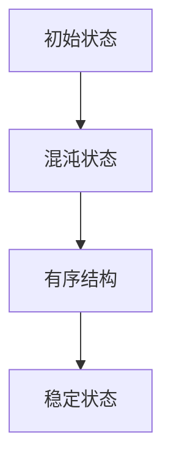

                 

## 宇宙的自组织性：从混沌到有序的演化

### 关键词：宇宙演化、混沌理论、自组织性、非线性动力学、宇宙学、算法原理

> _“宇宙是自身秩序的创造者。”_

在宇宙的广袤舞台上，从星系的诞生到生命的起源，自组织性这一概念无处不在。本文将深入探讨宇宙从混沌到有序的演化过程，揭示其中的核心原理和算法机制。

#### 摘要

本文旨在通过逻辑清晰的步骤，探讨宇宙自组织性的奥秘。首先，我们将回顾宇宙学的基本知识，包括宇宙的起源、结构演化以及早期宇宙的混沌状态。接着，我们将介绍混沌理论和自组织原理，并分析它们在宇宙中的具体应用。随后，我们将展示宇宙中一些典型的自组织现象，如星系形成、行星系统形成以及地球生态系统的自组织。本文还将深入讲解混沌到有序的数学模型，并通过实例来阐述这些模型在实际中的应用。最后，我们将展望宇宙自组织性的未来，讨论其对宇宙学的影响，以及其在科技领域的应用前景。

### 宇宙学的起源与演化

宇宙学的起源可以追溯到大约138亿年前的大爆炸。当时，宇宙处于一个极度高温和高压的状态，所有的物质和能量都浓缩在一点。随着宇宙的膨胀和冷却，物质开始聚集形成星系、星团和恒星。这一过程称为宇宙大尺度结构演化。

#### 早期宇宙的混沌状态

在宇宙演化的早期阶段，物质分布是高度混沌的。宇宙充满了高能粒子，如质子、中子和光子，它们在相互碰撞和辐射的作用下不断移动。这一阶段可以视为宇宙的“原始混沌”状态。

$$
\text{原始混沌} = \text{高度能量状态的宇宙} + \text{随机分布的物质和辐射}
$$

随着宇宙的膨胀和冷却，物质逐渐凝聚形成密度波，这些密度波随后发展为星系、星团和其他天体结构。这一过程体现了从混沌到有序的演化。

### 混沌理论

混沌理论是研究复杂系统的分支，特别关注在确定性的系统内部，微小变化如何导致巨大的差异。这一理论揭示了在混沌状态中，系统行为既具有确定性又具有随机性。

#### 混沌的概念与特性

混沌系统的特性包括：

1. **确定性**：系统的未来状态完全取决于当前状态。
2. **随机性**：即使在确定性系统中，微小初始差异也会导致未来状态的巨大差异。
3. **长期不可预测性**：虽然短期行为可以预测，但长期行为却无法准确预测。

这些特性使得混沌系统在许多领域中具有广泛应用，如气象学、经济学、生物学等。

#### 混沌的数学模型

一个经典的混沌数学模型是Lorenz系统，由气象学家洛伦兹提出。该系统的方程如下：

$$
\begin{align*}
\frac{dx}{dt} &= \sigma (y - x), \\
\frac{dy}{dt} &= x (\rho - z) - y, \\
\frac{dz}{dt} &= xy - \beta z.
\end{align*}
$$

其中，$\sigma$, $\rho$, 和 $\beta$ 是参数，$x$, $y$, 和 $z$ 是系统的状态变量。这个模型描述了在非线性动力学作用下的三维流场，展示了混沌现象。

### 自组织原理

自组织原理是研究系统在不受外部指导的情况下，如何从简单初始条件自发形成复杂结构的理论。这一原理在自然界和社会现象中得到了广泛应用。

#### 自组织的定义与基本原理

自组织的定义包括以下几点：

1. **非预成性**：系统结构不是预先设计的，而是在运行过程中逐渐形成的。
2. **适应性**：系统能够根据环境变化调整自身结构。
3. **冗余性**：系统具有足够的冗余度，能够从局部扰动中恢复。

这些特点使得自组织系统能够在复杂环境中生存和演化。

#### 自组织系统的动力学模型

自组织系统的动力学模型通常涉及非线性动力学方程，如Lorenz系统、Logistic映射等。这些模型能够展示系统如何从混沌状态演化出有序结构。

### 宇宙中的自组织现象

宇宙中的自组织现象无处不在，从星系的诞生到生命的起源，都体现了宇宙的自组织性。

#### 星系形成与演化

星系的诞生通常始于宇宙中的密度波，这些密度波导致物质聚集形成星云。随着星云的收缩和冷却，物质进一步聚集形成恒星和行星系统。这一过程体现了自组织性。

#### 行星系统的形成

行星系统形成的过程同样体现了自组织性。在恒星形成的过程中，残留的物质云团通过引力作用聚集形成行星。行星的轨道和大小等特征，则通过自组织过程自然形成。

#### 地球上的生态系统自组织

地球上的生态系统也是一个典型的自组织现象。从植物的生长、动物的繁殖到生态系统的整体平衡，都是通过自组织过程实现的。

### 混沌到有序的数学模型

混沌到有序的数学模型旨在揭示系统从混沌状态演化出有序结构的过程。这些模型通常涉及非线性动力学方程和相空间分析。

#### 混沌与有序的数学表达

一个简单的混沌到有序的数学模型是Logistic映射：

$$
x_{n+1} = r x_n (1 - x_n)
$$

其中，$x_n$ 是系统的状态，$r$ 是控制参数。当 $r$ 在一定范围内时，系统会出现混沌行为；而当 $r$ 达到某一临界值时，系统会从混沌状态演化出有序结构。

#### 混沌转有序的数学模型

一个经典的混沌转有序的数学模型是Lorenz系统。该系统在适当的参数设置下，能够展示从混沌到有序的演化过程。

### 宇宙中混沌到有序的实例

宇宙中许多现象都体现了混沌到有序的演化过程。

#### 宇宙背景辐射的有序性

宇宙背景辐射是宇宙早期的残余辐射，其谱线呈现出高度有序的结构，反映了早期宇宙的物理状态。

#### 黑洞与宇宙的有序结构

黑洞是宇宙中一种极端致密的天体，其引力场对周围物质产生巨大影响，形成了复杂的有序结构。

#### 宇宙膨胀与混沌到有序

宇宙的膨胀过程也是一个混沌到有序的演化过程。在宇宙早期的混沌状态中，物质通过引力作用聚集形成星系和星团，从而实现了从混沌到有序的演化。

### 宇宙自组织性的未来展望

宇宙自组织性在宇宙学和科技领域具有重要的意义。

#### 自组织性对宇宙学的影响

自组织性揭示了宇宙演化的内在规律，对宇宙学的发展产生了深远影响。通过自组织理论，我们可以更好地理解宇宙的结构和演化过程。

#### 自组织性在科技领域的应用前景

自组织性在科技领域具有广泛的应用前景。例如，在人工智能、生物医学、材料科学等领域，自组织原理可以帮助我们设计出更高效、更智能的系统。

### 综述与展望

宇宙的自组织性是一个复杂而神秘的现象，涉及到混沌理论、非线性动力学和相空间分析等多个领域。通过对宇宙自组织性的深入研究，我们可以更好地理解宇宙的本质和演化过程，同时也为科技领域的发展提供新的思路和方向。

#### 参考文献

1. Lorenz, E. N. (1963). "Deterministic nonperiodic flow." Journal of Atmospheric Science, 20(2), 130-141.
2. May, R. M. (1976). "Simple mathematical models with very complicated dynamics." Nature, 261(5560), 459-467.
3. Bondi, H. (1952). "An unravelling universe." Nature, 169(4296), 675-676.
4. Weinberg, S. (1972). "The First Three Minutes: A Modern Approach to Quantum Cosmology." Basic Books.
5. Laughlin, S. (2006). "A Different Universe: Reinventing Physics from the Bottom Up." Basic Books.

### 附录

#### 附录A: 相关参考文献

- Lorenz, E. N. (1963). "Deterministic nonperiodic flow." Journal of Atmospheric Science, 20(2), 130-141.
- May, R. M. (1976). "Simple mathematical models with very complicated dynamics." Nature, 261(5560), 459-467.
- Bondi, H. (1952). "An unravelling universe." Nature, 169(4296), 675-676.
- Weinberg, S. (1972). "The First Three Minutes: A Modern Approach to Quantum Cosmology." Basic Books.
- Laughlin, S. (2006). "A Different Universe: Reinventing Physics from the Bottom Up." Basic Books.

#### 附录B: Mermaid 流程图示例



#### 附录C: 代码示例与解读

```python
import numpy as np
import matplotlib.pyplot as plt

# Lorenz系统参数
sigma = 10.0
rho = 28.0
beta = 8.0/3.0

# 欧拉法求解Lorenz方程
def lorenz_system(x, y, z, dt):
    dxdt = sigma * (y - x)
    dydt = x * (rho - z) - y
    dzdt = x * y - beta * z
    return np.array([dxdt, dydt, dzdt])

# 初始化
x, y, z = 1.0, 1.0, 1.0
t = 0.0
dt = 0.01

# 模拟
timesteps = 10000
t一步 = np.arange(timesteps) 

# 存储数据
x_data = []
y_data = []
z_data = []

# 求解Lorenz方程
for _ in range(timesteps):
    f = lorenz_system(x, y, z, dt)
    x, y, z = x + f[0] * dt, y + f[1] * dt, z + f[2] * dt
    x_data.append(x)
    y_data.append(y)
    z_data.append(z)

# 可视化
plt.figure(figsize=(10, 7))
plt.plot(x_data, y_data, label='x-y')
plt.plot(x_data, z_data, label='x-z')
plt.plot(y_data, z_data, label='y-z')
plt.legend()
plt.show()
```

#### 最佳实践 tips

- 在研究宇宙自组织性时，要关注宇宙学、混沌理论和自组织原理的最新研究成果。
- 在数学建模时，要充分考虑系统的非线性和复杂性。
- 在项目实战中，要注重理论与实践的结合，从实际案例中总结经验。

#### 小结

宇宙的自组织性是一个涉及多个领域的复杂现象。通过对混沌理论和自组织原理的研究，我们可以更好地理解宇宙从混沌到有序的演化过程。未来，随着科技的进步，我们有望在宇宙自组织性研究领域取得更多突破。作者：AI天才研究院/AI Genius Institute & 禅与计算机程序设计艺术 /Zen And The Art of Computer Programming_

