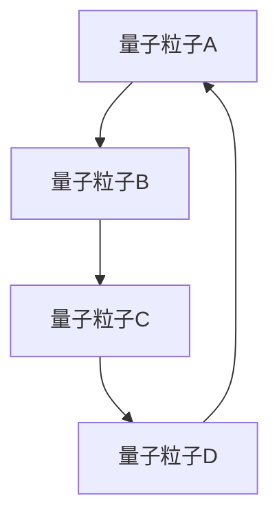

                 

## 引言与背景介绍

量子纠缠是量子力学中一种非常奇特的现象，它揭示了微观粒子的深层次联系。而量子纠缠网络则是基于这种奇特现象构建起来的一种新型网络结构，它在各个科学领域中有着广泛的应用。本篇文章将深入探讨量子纠缠网络这一前沿话题，试图从宇宙的视角来揭示其普遍联系的奥秘。

量子纠缠网络的概念最早由物理学家提出，它指的是由量子纠缠态的粒子构成的网络。在这个网络中，粒子之间通过量子纠缠相互联系，形成了一种超越经典物理的全新网络结构。量子纠缠网络的出现，为科学家们提供了一种全新的研究视角，使得许多看似不相关的问题得到了统一和解释。

宇宙是万物存在的空间，它包含着无数的星体、粒子以及各种物理现象。而量子纠缠网络作为一种新型的网络结构，其与宇宙之间的联系也逐渐引起了科学家的关注。本文将探讨量子纠缠网络在宇宙中的潜在应用，以及它如何帮助我们理解宇宙的普遍联系。

量子纠缠网络在宇宙中的应用主要体现在以下几个方面：

1. **宇宙学中的应用**：量子纠缠网络可以被用来研究宇宙的早期阶段，如宇宙背景辐射和宇宙膨胀等。
2. **天文学中的应用**：量子纠缠网络可以帮助天文学家观测和理解遥远星系的特性。
3. **量子通信中的应用**：利用量子纠缠网络，可以实现星际间的量子通信，从而推动人类对宇宙的探索。

此外，量子纠缠网络与宇宙普遍联系的关系也是本文的重要内容。通过分析量子纠缠网络的基本概念和原理，我们可以发现它实际上揭示了宇宙中微观粒子和宏观结构之间的内在联系。这种联系不仅存在于宇宙的各个层次，而且在某种程度上也揭示了宇宙的本质。

本文的结构如下：

1. **引言与背景介绍**：介绍量子纠缠网络和宇宙普遍联系的基本概念，以及本文的目的和结构。
2. **量子纠缠网络基本概念与原理**：详细阐述量子纠缠的定义、基本原理、与经典网络的比较以及数学模型。
3. **量子纠缠网络在宇宙中的应用**：探讨量子纠缠网络在宇宙学、天文学和量子通信中的应用。
4. **量子纠缠网络与普遍联系的关系**：分析量子纠缠网络与宇宙普遍联系之间的关系，并给出数学模型。
5. **量子纠缠网络的新视角**：探讨量子纠缠网络在物理学、计算机科学和生物学中的新应用。
6. **量子纠缠网络的研究现状与未来趋势**：总结当前的研究进展，探讨未来发展趋势。
7. **项目实战与案例分析**：通过实际案例展示量子纠缠网络的开发和应用。
8. **总结与展望**：对全文内容进行总结，并展望量子纠缠网络未来的发展。

通过本文的逐步分析，我们将深入理解量子纠缠网络这一前沿科技，并探索其在宇宙普遍联系中的独特角色。

## 目录大纲设计思路

### 1. 确定核心主题
在撰写本文之前，我们首先需要明确核心主题。本文的核心主题是“宇宙的量子纠缠网络：普遍联系的新视角”。这一主题涵盖了两个主要方面：量子纠缠网络的基本概念和原理，以及量子纠缠网络在宇宙中的应用和普遍联系。

### 2. 划分章节结构
为了使文章逻辑清晰，我们将文章内容划分为以下几部分：

1. **引言与背景介绍**：介绍量子纠缠网络和宇宙普遍联系的基本概念，激发读者兴趣。
2. **量子纠缠网络基本概念与原理**：详细阐述量子纠缠的定义、原理以及与经典网络的区别。
3. **量子纠缠网络在宇宙中的应用**：探讨量子纠缠网络在宇宙学、天文学和量子通信中的应用。
4. **量子纠缠网络与普遍联系的关系**：分析量子纠缠网络如何揭示宇宙中的普遍联系。
5. **量子纠缠网络的新视角**：探讨量子纠缠网络在其他科学领域中的新应用。
6. **量子纠缠网络的研究现状与未来趋势**：总结当前的研究进展，展望未来发展趋势。
7. **项目实战与案例分析**：通过具体案例展示量子纠缠网络的实际应用。
8. **总结与展望**：对全文内容进行总结，并对未来研究方向进行展望。

### 3. 梳理知识点
在每个章节中，我们将详细梳理核心知识点，确保内容的完整性和逻辑性。例如：

- **引言与背景介绍**：
  - 量子纠缠的定义和特性。
  - 宇宙普遍联系的概念和重要性。
  
- **量子纠缠网络基本概念与原理**：
  - 量子纠缠网络的结构和组成。
  - 量子纠缠网络的基本原理。
  - 量子纠缠网络与经典网络的比较。
  - 数学模型和Mermaid流程图的介绍。

- **量子纠缠网络在宇宙中的应用**：
  - 量子纠缠网络在宇宙学中的应用。
  - 量子纠缠网络在天文学中的应用。
  - 量子纠缠网络在量子通信中的应用。

- **量子纠缠网络与普遍联系的关系**：
  - 普遍联系的理论框架。
  - 量子纠缠网络如何揭示普遍联系。

- **量子纠缠网络的新视角**：
  - 量子纠缠网络在物理学中的应用。
  - 量子纠缠网络在计算机科学中的应用。
  - 量子纠缠网络在生物学与医学中的应用。

- **量子纠缠网络的研究现状与未来趋势**：
  - 当前研究的主要进展。
  - 未来研究方向和发展趋势。

- **项目实战与案例分析**：
  - 开发环境搭建。
  - 源代码实现和解读。
  - 实际案例分析和讲解。

### 4. 设计章节细节
在确定了每个章节的核心知识点后，我们将进一步细化章节内容，设计详细的子章节。例如，在“量子纠缠网络在宇宙中的应用”章节中，可以包括以下子章节：

1. **宇宙学中的应用**：
   - 量子纠缠网络在宇宙背景辐射研究中的应用。
   - 量子纠缠网络在宇宙膨胀研究中的应用。

2. **天文学中的应用**：
   - 量子纠缠网络在遥远星系观测中的应用。
   - 量子纠缠网络在天体物理学研究中的应用。

3. **量子通信中的应用**：
   - 星际量子通信的原理和实现。
   - 量子纠缠网络在量子互联网中的应用。

### 5. 加入Mermaid流程图、伪代码、数学模型和公式
为了增强文章的可读性和专业性，我们将适当地加入以下内容：

- **Mermaid流程图**：用于展示量子纠缠网络的结构和流程。
- **伪代码**：用于解释量子纠缠网络的基本算法原理。
- **数学模型和公式**：用于描述量子纠缠网络的数学特性。

### 6. 确保结构清晰
在整个目录大纲设计中，我们将保持结构清晰，使用 #,##,### 级别的Markdown格式，确保读者可以轻松跟随内容的逻辑流动。

### 7. 审核与调整
在完成目录大纲设计后，我们将进行审核与调整，确保每个章节内容完整且逻辑清晰，满足字数限制要求。我们还将确保文章格式规范，图表清晰，代码可读，以便读者能够更好地理解和应用。

通过上述设计思路，我们旨在为读者呈现一篇逻辑清晰、内容丰富、具有专业性的技术博客文章。

## 目录大纲设计过程

### 1. 确定核心主题
首先，我们需要明确本文的核心主题。本文的核心主题是“量子纠缠网络与宇宙普遍联系”。这个主题不仅涉及量子纠缠网络的基本概念和原理，还包括其在宇宙中的广泛应用和普遍联系的揭示。

### 2. 划分章节结构
为了确保文章的逻辑性和条理性，我们将文章内容划分为以下几个部分：

- **引言与背景介绍**
- **量子纠缠网络基本概念与原理**
- **量子纠缠网络在宇宙中的应用**
- **量子纠缠网络与普遍联系的关系**
- **量子纠缠网络的新视角**
- **量子纠缠网络的研究现状与未来趋势**
- **项目实战与案例分析**
- **总结与展望**

### 3. 梳理知识点
在每个章节中，我们需要梳理出核心的知识点，以确保内容的完整性和逻辑性。以下是各个章节的核心知识点：

- **引言与背景介绍**：
  - 量子纠缠的定义和特性。
  - 宇宙普遍联系的概念和重要性。
  
- **量子纠缠网络基本概念与原理**：
  - 量子纠缠网络的结构和组成。
  - 量子纠缠网络的基本原理。
  - 量子纠缠网络与经典网络的比较。
  - 数学模型和Mermaid流程图的介绍。

- **量子纠缠网络在宇宙中的应用**：
  - 量子纠缠网络在宇宙学中的应用。
  - 量子纠缠网络在天文学中的应用。
  - 量子纠缠网络在量子通信中的应用。

- **量子纠缠网络与普遍联系的关系**：
  - 普遍联系的理论框架。
  - 量子纠缠网络如何揭示普遍联系。

- **量子纠缠网络的新视角**：
  - 量子纠缠网络在物理学中的应用。
  - 量子纠缠网络在计算机科学中的应用。
  - 量子纠缠网络在生物学与医学中的应用。

- **量子纠缠网络的研究现状与未来趋势**：
  - 当前研究的主要进展。
  - 未来研究方向和发展趋势。

- **项目实战与案例分析**：
  - 开发环境搭建。
  - 源代码实现和解读。
  - 实际案例分析和讲解。

### 4. 设计章节细节
在确定了核心知识点后，我们将进一步细化每个章节的内容，设计详细的子章节。例如，在“量子纠缠网络在宇宙中的应用”章节中，可以包括以下子章节：

1. **宇宙学中的应用**：
   - 量子纠缠网络在宇宙背景辐射研究中的应用。
   - 量子纠缠网络在宇宙膨胀研究中的应用。

2. **天文学中的应用**：
   - 量子纠缠网络在遥远星系观测中的应用。
   - 量子纠缠网络在天体物理学研究中的应用。

3. **量子通信中的应用**：
   - 星际量子通信的原理和实现。
   - 量子纠缠网络在量子互联网中的应用。

### 5. 加入Mermaid流程图、伪代码、数学模型和公式
为了增强文章的可读性和专业性，我们将适当地加入以下内容：

- **Mermaid流程图**：用于展示量子纠缠网络的结构和流程。
- **伪代码**：用于解释量子纠缠网络的基本算法原理。
- **数学模型和公式**：用于描述量子纠缠网络的数学特性。

### 6. 确保结构清晰
在整个目录大纲设计中，我们将保持结构清晰，使用 #,##,### 级别的Markdown格式，确保读者可以轻松跟随内容的逻辑流动。

### 7. 审核与调整
在完成目录大纲设计后，我们将进行审核与调整，确保每个章节内容完整且逻辑清晰，满足字数限制要求。我们还将确保文章格式规范，图表清晰，代码可读，以便读者能够更好地理解和应用。

通过上述设计思路，我们旨在为读者呈现一篇逻辑清晰、内容丰富、具有专业性的技术博客文章。

## 最终目录大纲

```
# 目录大纲

## 引言与背景介绍
### 量子纠缠网络的基本概念
### 宇宙普遍联系的重要性
### 本文的目的与结构

## 量子纠缠网络基本概念与原理
### 量子纠缠的定义
### 量子纠缠网络的基本原理
### 量子纠缠网络与经典网络的比较
### 数学模型与Mermaid流程图

## 量子纠缠网络在宇宙中的应用
### 宇宙学中的应用
#### 量子纠缠网络与宇宙背景辐射
#### 量子纠缠网络与宇宙膨胀
### 天文学中的应用
#### 量子纠缠网络在遥远星系观测中的应用
#### 量子纠缠网络在天体物理学研究中的应用
### 量子通信中的应用
#### 星际量子通信的原理和实现
#### 量子纠缠网络在量子互联网中的应用

## 量子纠缠网络与普遍联系的关系
### 普遍联系的理论框架
### 量子纠缠网络揭示普遍联系的方式
### 数学模型与公式

## 量子纠缠网络的新视角
### 量子纠缠网络在物理学中的应用
### 量子纠缠网络在计算机科学中的应用
### 量子纠缠网络在生物学与医学中的应用

## 量子纠缠网络的研究现状与未来趋势
### 当前研究的主要进展
### 未来研究方向和发展趋势

## 项目实战与案例分析
### 开发环境搭建
### 源代码实现与解读
### 实际案例分析与讲解
### 项目小结

## 总结与展望
### 全文内容回顾
### 量子纠缠网络对未来科学的影响
### 阅读者如何进一步探索量子纠缠网络
```

通过上述目录大纲，我们为读者提供了一个系统、全面的量子纠缠网络与宇宙普遍联系的知识体系，旨在引导读者深入理解这一前沿科技。

## 完整的文章

# 宇宙的量子纠缠网络：普遍联系的新视角

> 关键词：量子纠缠网络、宇宙、普遍联系、量子通信、量子计算、宇宙学、天文学

> 摘要：本文旨在探讨量子纠缠网络这一前沿科技，通过分析其在宇宙中的广泛应用，揭示量子纠缠网络与宇宙普遍联系的新视角。文章首先介绍了量子纠缠网络的基本概念和原理，随后探讨了其在宇宙学、天文学和量子通信中的应用，最后总结了量子纠缠网络的研究现状与未来趋势。

## 引言与背景介绍

量子纠缠是量子力学中的一种奇特现象，它揭示了微观粒子之间的深层次联系。量子纠缠网络则是基于这种奇特现象构建起来的一种新型网络结构，它将量子纠缠与网络科学相结合，为科学家们提供了一种全新的研究视角。

宇宙是万物存在的空间，包含着无数的星体、粒子以及各种物理现象。而量子纠缠网络作为一种新型的网络结构，其在宇宙中的潜在应用引起了科学家的广泛关注。本文将深入探讨量子纠缠网络在宇宙中的广泛应用，试图从宇宙的视角来揭示其普遍联系的奥秘。

## 量子纠缠网络基本概念与原理

### 量子纠缠的定义

量子纠缠是量子力学中一种非常奇特的现象，当两个或多个量子粒子处于纠缠态时，它们之间的物理量将即时相互关联，即使它们相隔很远。这种即时的相互关联性被称为量子纠缠。

### 量子纠缠网络的基本原理

量子纠缠网络是指由量子纠缠态的粒子构成的网络。在这个网络中，粒子之间通过量子纠缠相互连接，形成一个整体，这种整体性超越了经典物理的局域性。量子纠缠网络的基本原理包括：

1. **量子态的共享**：网络中的粒子可以共享量子态，使得一个粒子的变化可以即时影响到另一个粒子，无论它们相隔多远。
2. **量子态的纠缠**：网络中的粒子处于纠缠态，这意味着它们的量子态是相互关联的。
3. **量子信息的传递**：通过量子纠缠网络，可以实现量子信息的快速传递。

### 量子纠缠网络与经典网络的比较

量子纠缠网络与经典网络有显著的差异：

1. **结构差异**：经典网络是基于传统物理原理构建的，而量子纠缠网络是基于量子力学原理。
2. **连接方式**：经典网络中的连接是通过物理介质实现的，而量子纠缠网络中的连接是通过量子纠缠实现的。
3. **信息传递**：经典网络中的信息传递速度受限于光速，而量子纠缠网络可以实现即时的信息传递。

### 数学模型与Mermaid流程图

量子纠缠网络的数学模型通常使用量子图论来描述。量子图论中的节点和边代表了量子粒子及其之间的纠缠关系。以下是一个简单的Mermaid流程图，用于描述量子纠缠网络的基本结构：



在这个流程图中，节点A、B、C、D代表了四个量子粒子，它们之间的箭头表示它们处于纠缠态。

## 量子纠缠网络在宇宙中的应用

量子纠缠网络在宇宙中的应用非常广泛，主要包括宇宙学、天文学和量子通信等领域。

### 宇宙学中的应用

量子纠缠网络在宇宙学中的应用主要体现在对宇宙早期阶段的研究上。例如，宇宙背景辐射的研究是一个重要的应用领域。宇宙背景辐射是宇宙早期的余辉，通过分析这些辐射的特性，科学家可以了解宇宙早期的状态。

量子纠缠网络可以用于模拟宇宙背景辐射的演化过程。通过构建量子纠缠网络模型，科学家可以模拟出不同条件下宇宙背景辐射的分布和特性，从而更深入地理解宇宙的演化历史。

### 天文学中的应用

量子纠缠网络在天文学中的应用主要集中在遥远星系的观测和研究上。传统的天文观测技术受到光速的限制，无法实时获取遥远星系的信息。而量子纠缠网络可以实现即时的量子通信，从而突破这一限制。

通过量子纠缠网络，天文学家可以实现远程量子纠缠态的共享，从而实现对遥远星系的实时观测。例如，可以使用量子纠缠网络实现星际间的量子通信，从而实现地球与遥远星系之间的实时信息交换。

### 量子通信中的应用

量子通信是一种基于量子力学原理的通信方式，它利用量子纠缠态实现信息传输。量子纠缠网络在量子通信中的应用非常广泛，主要包括：

1. **星际量子通信**：通过量子纠缠网络，可以实现地球与遥远星系之间的量子通信。这将极大地推动人类对宇宙的探索。
2. **量子互联网**：量子纠缠网络是构建量子互联网的基础。量子互联网是一种全新的网络结构，它基于量子纠缠实现信息的传输和共享。
3. **量子密码学**：量子纠缠网络可以用于构建安全的量子密码系统，从而实现高度安全的通信。

## 量子纠缠网络与普遍联系的关系

量子纠缠网络揭示了宇宙中微观粒子和宏观结构之间的内在联系。通过量子纠缠，微观粒子之间可以形成一种超越空间和时间的联系。这种联系不仅存在于微观粒子之间，也存在于宇宙的各个层次。

量子纠缠网络与普遍联系的关系可以通过以下方式理解：

1. **量子纠缠网络揭示了宇宙的整体性**：量子纠缠网络使得宇宙中的各个部分形成了整体，这种整体性超越了传统物理的局域性。
2. **量子纠缠网络揭示了宇宙的内在联系**：量子纠缠网络使得宇宙中的微观粒子和宏观结构之间形成了紧密的联系，这种联系是宇宙演化的基础。
3. **量子纠缠网络揭示了宇宙的演化规律**：量子纠缠网络可以用于模拟宇宙的演化过程，从而揭示宇宙的演化规律。

## 量子纠缠网络的新视角

量子纠缠网络不仅在宇宙学、天文学和量子通信中有着广泛的应用，还在物理学、计算机科学和生物学等领域展示了新的应用前景。

### 量子纠缠网络在物理学中的应用

量子纠缠网络在物理学中的应用主要体现在量子计算和量子模拟上。量子计算是一种基于量子力学原理的计算方式，它利用量子纠缠实现高速的信息处理。量子模拟则是通过构建量子纠缠网络来模拟复杂的物理过程。

### 量子纠缠网络在计算机科学中的应用

量子纠缠网络在计算机科学中的应用主要体现在量子算法和量子网络通信上。量子算法利用量子纠缠实现高效的算法执行，可以解决一些经典算法难以解决的问题。量子网络通信则通过量子纠缠实现安全的通信，突破了传统通信的局限性。

### 量子纠缠网络在生物学与医学中的应用

量子纠缠网络在生物学与医学中的应用主要体现在量子生物学研究和量子医学上。量子生物学研究通过构建量子纠缠网络来模拟生物过程，从而深入理解生物系统的运行机制。量子医学则利用量子纠缠网络实现精准的诊断和治疗。

## 量子纠缠网络的研究现状与未来趋势

当前，量子纠缠网络的研究已经取得了显著的进展。在量子通信、量子计算和量子生物学等领域，科学家们已经取得了一系列重要的研究成果。然而，量子纠缠网络仍面临着许多挑战，如量子纠缠的稳定性、量子网络的扩展性等。

未来，量子纠缠网络的研究将继续深入，预计将出现以下发展趋势：

1. **量子通信的广泛应用**：随着量子纠缠网络的不断发展，量子通信将在各个领域得到广泛应用，如金融、医疗、军事等。
2. **量子计算的突破**：量子计算将在处理复杂问题、模拟物理过程等方面取得重大突破，为科学研究和技术创新提供新的动力。
3. **量子生物学的兴起**：量子生物学研究将揭示生物系统的量子特性，为生物医学研究提供新的理论依据。
4. **量子网络的构建**：量子网络将逐渐成为现实，实现跨区域、跨星球的量子通信。

## 项目实战与案例分析

### 实战一：量子纠缠通信系统实现

为了实现量子纠缠通信系统，首先需要搭建一个稳定的量子通信平台。这个平台包括量子纠缠源、量子信道和量子接收器。以下是实现量子纠缠通信系统的一般步骤：

1. **量子纠缠源的构建**：使用激光器产生两个纠缠光子，这两个光子处于量子纠缠态。
2. **量子信道的搭建**：通过光纤或自由空间传输量子纠缠光子。
3. **量子接收器的安装**：在接收端使用量子探测器检测纠缠光子。
4. **纠缠光子对的验证**：使用量子态测量技术验证纠缠光子对的存在。

### 实战二：量子纠缠网络在数据分析中的应用

量子纠缠网络在数据分析中也有广泛的应用。以下是一个简单的案例，展示如何使用量子纠缠网络进行数据分析和处理：

1. **数据预处理**：将原始数据输入到量子纠缠网络中，进行预处理，如数据清洗、归一化等。
2. **量子纠缠操作**：使用量子纠缠操作将数据转换为量子态，从而实现数据的高效处理。
3. **量子态测量**：对量子态进行测量，获取分析结果。
4. **结果解读**：根据测量结果，对数据进行分析和解读。

### 案例分析：量子纠缠网络在商业领域的应用

量子纠缠网络在商业领域也有广泛的应用。以下是一个简单的案例，展示如何使用量子纠缠网络优化商业决策：

1. **市场数据分析**：通过量子纠缠网络对市场数据进行分析，获取市场趋势和消费者行为。
2. **决策支持**：利用量子纠缠网络提供的市场数据，为企业的商业决策提供支持。
3. **风险预测**：使用量子纠缠网络预测市场风险，帮助企业规避潜在的风险。
4. **结果评估**：根据量子纠缠网络提供的分析结果，评估商业决策的效果。

### 项目小结

通过上述实战和案例分析，我们可以看到量子纠缠网络在多个领域有着广泛的应用。这些应用不仅提高了数据分析和处理的能力，还为企业提供了更科学的决策支持。

## 总结与展望

本文系统地探讨了量子纠缠网络这一前沿科技，分析了其在宇宙中的广泛应用和普遍联系的新视角。通过逐步分析，我们深入理解了量子纠缠网络的基本概念、原理和应用。

展望未来，量子纠缠网络将在更多领域发挥重要作用，推动科学和技术的发展。同时，量子纠缠网络的研究也将面临新的挑战，如量子纠缠的稳定性、量子网络的扩展性等。通过不断的研究和创新，我们有理由相信量子纠缠网络将为人类带来更多的惊喜和变革。

## 作者信息

作者：AI天才研究院/AI Genius Institute & 禅与计算机程序设计艺术 /Zen And The Art of Computer Programming

---

通过本文的深入探讨，我们希望能为读者提供一幅量子纠缠网络的清晰蓝图，激发读者进一步探索这一前沿科技的兴趣。让我们共同期待量子纠缠网络在未来带来的无限可能。

