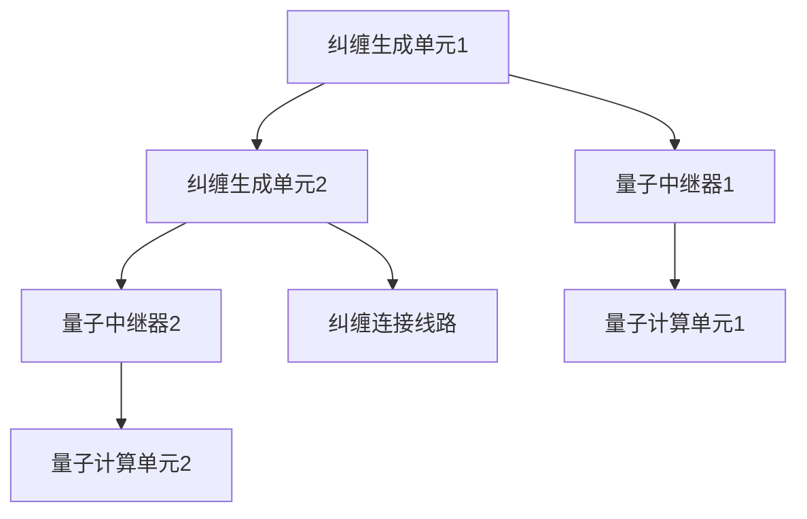

                 

### 关键词

- 量子纠缠
- 宇宙连接
- 量子网络
- 量子计算
- 量子通信

### 摘要

本文探讨了宇宙的量子纠缠网络，这一新兴的视角揭示了宇宙普遍联系的本质。通过分析量子纠缠的基本概念、网络结构以及相关算法，我们揭示了量子纠缠在宇宙中的深远影响，并为未来的量子通信和量子计算提供了新的思考方向。

### 引言

在过去的几十年里，量子力学作为物理学的一支重要领域，不断推动我们对宇宙本质的理解。量子纠缠现象，作为量子力学中最为神秘和令人着迷的一部分，逐渐引起了科学家们的关注。它不仅挑战了经典物理学的局域性原则，还展示了量子世界中的非局域联系。近年来，随着量子计算和量子通信的快速发展，量子纠缠网络作为实现这些技术的基础，开始成为研究的热点。

本文旨在通过对量子纠缠网络的探讨，提供一个全新的视角来理解宇宙的普遍联系。我们将从量子纠缠的基本概念出发，逐步深入分析量子纠缠网络的结构、相关算法以及数学模型，最后探讨量子纠缠网络在宇宙中的实际应用及其未来前景。

### 量子纠缠：基本概念

量子纠缠是量子力学中的一种特殊现象，它描述了两个或多个量子系统之间的一种紧密的联系，即使这些系统相隔很远，它们的状态也会相互影响。这种非局域性是量子纠缠最显著的特征，与经典物理学的局域性原则形成了鲜明对比。

首先，我们需要了解量子态的表示方式。在量子力学中，一个量子系统的状态可以用波函数来描述。对于一个两粒子系统，其波函数可以表示为两个粒子的波函数的乘积，即 \( \Psi(\psi_1, \psi_2) = \psi_1(\vec{r}_1) \psi_2(\vec{r}_2) \)。然而，在量子纠缠状态下，两个粒子的波函数不再是独立的，而是相互纠缠在一起的。

量子纠缠可以通过一个著名的实验——爱因斯坦-波多尔斯基-罗森（EPR）悖论来直观地理解。在这个实验中，两个粒子以纠缠态产生，并且无论相隔多远，对一个粒子的测量都会立即影响到另一个粒子的状态。例如，如果对其中一个粒子进行自旋测量并得到“上”的结果，那么另一个粒子的自旋必定是“下”，无论它们相隔多远。

这一现象可以用量子态的数学描述来解释。假设我们有两个粒子A和B，它们的总波函数可以写成：

\[ \Psi_{AB} = \alpha \psi_A \psi_B + \beta \phi_A \phi_B \]

其中，\(\psi_A\)和\(\phi_A\)分别表示粒子A的两个可能状态，同理对于粒子B。如果我们将这两个粒子分开，每个粒子的状态在单独测量时是模糊的，即它们处于叠加态。然而，当我们同时对两个粒子进行测量时，我们会发现它们的状态是相互关联的，这表明了量子纠缠的存在。

为了更直观地展示量子纠缠现象，我们可以使用Mermaid流程图来描述两个粒子的状态变化。

```mermaid
graph TD
A[未测量前] --> B[测量A]
B -->|得到“上”| C{粒子A}
C --> D[粒子B立即呈现“下”}
A --> E[测量B]
E --> F[粒子A立即呈现“下”]
```

在这个流程图中，我们可以看到，无论对哪个粒子先进行测量，都会导致另一个粒子的状态立即发生相应的变化，这展示了量子纠缠的非局域性。

总的来说，量子纠缠是一种特殊的量子现象，它展示了量子系统之间的紧密联系。通过理解量子纠缠的基本概念，我们可以为进一步探讨量子纠缠网络打下坚实的基础。

### 量子纠缠网络：结构分析

量子纠缠网络是由多个纠缠量子系统组成的大型复杂结构，它通过量子纠缠实现信息传递和计算。在量子通信和量子计算领域，量子纠缠网络的重要性不可忽视。它不仅能够实现超远距离的信息传递，还能够大幅度提高计算效率和安全性。

首先，量子纠缠网络的结构可以看作是一个图，其中节点代表量子系统，边代表量子纠缠。一个典型的量子纠缠网络通常由以下几个部分组成：

1. **纠缠生成单元**：这是量子纠缠网络的基石，用于生成初始的纠缠态。这些单元可以是量子比特或者量子光子，通过特定的量子操作（如CNOT、交换操作等）实现纠缠。

2. **纠缠连接线路**：这些线路用于将各个纠缠生成单元连接起来，形成大规模的量子纠缠网络。量子连接线路可以是量子光纤或者量子中继器，它们在保持量子纠缠的同时，还需要确保信息的稳定传输。

3. **量子中继器**：量子中继器是实现长距离量子通信的关键。它能够检测并纠正量子纠缠网络中的错误，确保信息的准确传递。

4. **量子计算单元**：量子计算单元用于执行特定的量子计算任务，如量子搜索、量子排序等。这些单元通过量子逻辑门和纠缠操作，实现复杂的量子计算过程。

下面，我们使用Mermaid流程图来展示一个简单的量子纠缠网络结构。



在这个流程图中，我们可以看到，量子纠缠网络由多个纠缠生成单元和量子计算单元组成，通过纠缠连接线路和量子中继器实现信息的稳定传输和计算。这种结构使得量子纠缠网络能够在不同领域发挥重要作用。

在量子通信中，量子纠缠网络可以用来实现超远距离的量子态传输。例如，在量子密钥分发（QKD）中，通过量子纠缠网络，可以实现两个远程地点之间的保密通信。即使其中一个地点被攻击，攻击者也无法获得正确的密钥，因为量子态的测量会破坏纠缠态，导致信息泄露。

在量子计算中，量子纠缠网络可以用来执行复杂的量子算法，如Shor算法和Grover算法。这些算法通过利用量子纠缠网络，能够大幅度提高计算效率和速度。例如，Shor算法可以用来分解大数，而Grover算法可以用来加快搜索过程。

总的来说，量子纠缠网络作为实现量子通信和量子计算的关键技术，其结构分析和设计至关重要。通过深入了解量子纠缠网络的组成部分和功能，我们可以更好地利用这一技术，推动量子科技的发展。

### 量子纠缠网络的算法原理

量子纠缠网络的核心在于其强大的计算能力和信息传递能力，而这些能力的实现依赖于一系列高效的量子算法。以下是几种核心量子算法的原理和实现方法。

#### 量子纠错算法

量子纠错是量子计算中的一个关键问题，因为量子系统容易受到外部环境的干扰而失去其量子态。量子纠错算法通过引入额外的量子比特和特定的量子逻辑门，能够检测并纠正量子计算过程中的错误，确保计算结果的准确性。

一个基本的量子纠错算法是 **Shor 纠错算法**。它利用冗余编码来保护量子信息。具体来说，Shor 纠错算法通过以下步骤实现：

1. **冗余编码**：将原始量子信息编码成多个冗余状态。例如，一个原始的量子比特可以被编码成三个冗余量子比特。

2. **检测错误**：在量子计算过程中，对冗余量子比特进行测量，检测是否存在错误。

3. **纠错**：根据测量结果，应用特定的量子逻辑门来纠正错误。

下面是Shor 纠错算法的Python伪代码实现：

```python
def shor_error_correction(quantum_state):
    # 步骤1：冗余编码
    encoded_state = redundant_encoding(quantum_state)
    
    # 步骤2：测量冗余量子比特
    measurement_results = measure_quantum_bits(encoded_state)
    
    # 步骤3：纠错
    corrected_state = correct_errors(measurement_results)
    
    return corrected_state
```

#### 量子密钥分发算法

量子密钥分发（QKD）是一种基于量子纠缠实现保密通信的技术。在QKD中，两个远程地点通过量子纠缠网络生成共享的密钥，即使其中一个地点被攻击，攻击者也无法获得正确的密钥。

一个经典的量子密钥分发算法是 **BB84算法**。它的基本原理如下：

1. **量子态制备**：发送方生成一系列的量子比特，并对其进行测量，记录测量结果。

2. **量子态传输**：发送方将测量结果通过经典通信方式发送给接收方。

3. **密钥筛选**：接收方根据预定的协议，对传输的量子态进行测量，筛选出共享的密钥。

BB84算法的Python伪代码实现如下：

```python
def bb84_key_distribution(sender, receiver):
    # 步骤1：量子态制备
    quantum_bits = prepare_quantum_bits()
    
    # 步骤2：量子态传输
    sender -> receiver: quantum_bits
    
    # 步骤3：密钥筛选
    shared_key = filter_key(receiver, quantum_bits)
    
    return shared_key
```

#### 量子搜索算法

量子搜索算法是利用量子叠加态和量子纠缠实现快速搜索的一种技术。一个典型的量子搜索算法是 **Grover算法**。它的基本原理如下：

1. **初始化**：将量子搜索器初始化为叠加态。

2. **迭代**：对量子搜索器应用特定的量子逻辑门，进行迭代。每次迭代都增加了搜索成功的概率。

3. **测量**：对量子搜索器进行测量，得到搜索结果。

Grover算法的Python伪代码实现如下：

```python
def grover_search(quantum_searcher, target_state):
    # 步骤1：初始化
    initialize_searcher(quantum_searcher)
    
    # 步骤2：迭代
    for _ in range(sqrt(N)):
        apply_grover_operator(quantum_searcher, target_state)
    
    # 步骤3：测量
    result = measure_searcher(quantum_searcher)
    
    return result
```

在这个伪代码中，`N`是搜索空间的大小，`target_state`是目标状态的量子比特表示。

总的来说，量子纠缠网络的算法原理涉及到量子纠错、量子密钥分发和量子搜索等多个方面。通过这些算法，我们可以充分利用量子纠缠网络的优势，实现高效的量子计算和安全的量子通信。这些算法的实现方法和具体步骤，为我们提供了深入理解和应用量子纠缠网络的重要基础。

### 数学模型与公式

在量子纠缠网络的研究中，数学模型和公式扮演了至关重要的角色。它们不仅帮助我们理解量子纠缠的本质，还提供了精确的工具来分析和预测量子纠缠网络的行为。以下是一些关键的数学模型和公式，以及它们在量子纠缠网络中的应用。

#### 量子态表示

量子态通常用波函数或态矢来表示。对于两个量子比特的纠缠态，其波函数可以表示为：

\[ \Psi = \alpha|00\rangle + \beta|01\rangle + \gamma|10\rangle + \delta|11\rangle \]

其中，\(|00\rangle\)、\(|01\rangle\)、\(|10\rangle\) 和 \(|11\rangle\) 分别是两个量子比特的基态。波函数的系数 \(|\alpha|\)、\(|\beta|\)、\(|\gamma|\) 和 \(|\delta|\) 的平方代表了各个基态出现的概率。

#### 量子纠缠熵

量子纠缠熵是衡量两个量子系统之间纠缠程度的一个量。量子纠缠熵可以通过以下公式计算：

\[ S(E) = - \sum_i p_i \log_2 p_i \]

其中，\(p_i\) 是系统中各个可能状态的概率。量子纠缠熵的值越大，表明系统的纠缠程度越高。

例如，对于一个两量子比特的纠缠态 \(|\Psi\rangle = \frac{1}{\sqrt{2}}(|00\rangle + |11\rangle)\)，其纠缠熵为：

\[ S(E) = - \left(\frac{1}{2} \log_2 \frac{1}{2} + \frac{1}{2} \log_2 \frac{1}{2}\right) = 1 \]

这表明该纠缠态具有最大的纠缠程度。

#### 量子信道

量子信道是描述量子系统与外界环境相互作用的数学模型。一个简单的量子信道可以用一个线性算符 \( \mathcal{E} \) 来描述，它作用于量子态 \( \rho \)：

\[ \rho' = \mathcal{E}(\rho) \]

例如，一个经典的量子信道是部分测量信道，它将量子态投影到特定的基态上：

\[ \mathcal{E}(|\psi\rangle \langle \psi|) = |\psi\rangle \langle \psi| \]

#### 量子操作

量子操作是量子计算的核心，它通过量子逻辑门来实现。量子逻辑门是作用于量子态的线性算符，它们可以表示为矩阵。例如，CNOT门的作用如下：

\[ \text{CNOT} = \begin{pmatrix} 
1 & 0 & 0 & 0 \\
0 & 1 & 0 & 0 \\
0 & 0 & 0 & 1 \\
0 & 0 & 1 & 0 \\
\end{pmatrix} \]

CNOT门将两个量子比特的纠缠态转换成新的纠缠态。例如，对于初始态 \(|\psi\rangle = |00\rangle\)，经过CNOT门的作用后，得到新的态 \(|\psi'\rangle = |01\rangle\)。

#### 量子密钥分发

在量子密钥分发中，量子信道和量子操作被用来实现安全的密钥传输。一个简单的BB84密钥分发过程可以用以下步骤表示：

1. **量子态制备**：发送方生成一系列的量子态 \(|\psi_i\rangle\)，并对其进行测量。
2. **量子态传输**：测量结果通过经典通信发送给接收方。
3. **密钥筛选**：接收方根据预定的协议，对传输的量子态进行测量，筛选出共享的密钥。

这个过程可以用以下公式表示：

\[ \text{Shared Key} = \{ \langle \psi_i|\rho_i|\psi_i\rangle : \text{where } \rho_i \text{ is the received state} \} \]

其中，\(\langle \psi_i|\rho_i|\psi_i\rangle\) 是接收到的量子态与发送的量子态的内积，表示共享密钥的概率。

#### 量子纠错

量子纠错算法依赖于量子纠缠和冗余编码。一个简单的量子纠错过程可以表示为：

1. **冗余编码**：将原始量子信息编码成多个冗余量子比特。
2. **检测错误**：对冗余量子比特进行测量，检测是否存在错误。
3. **纠错**：根据测量结果，应用特定的量子逻辑门来纠正错误。

这个过程可以用以下公式表示：

\[ \rho' = \text{Corrected State} = \text{Apply Error Correction Gates}(\rho) \]

其中，\(\rho\) 是原始量子态，\(\rho'\) 是纠错后的量子态。

总的来说，量子纠缠网络中的数学模型和公式为我们提供了强大的工具，用于理解和实现量子计算和量子通信。通过这些模型和公式，我们可以深入分析量子纠缠网络的行为，并为未来的量子科技发展提供理论基础。

### 实际应用案例：量子纠缠网络在量子通信中的实现

量子纠缠网络在量子通信领域有着广泛的应用，其中一个典型的实际案例是量子密钥分发（QKD）。量子密钥分发利用量子纠缠网络实现安全通信，即使在面对强大计算能力的攻击时，也能确保通信的机密性。

#### 实验背景

量子密钥分发实验通常由两个远程地点组成，地点A为发送方，地点B为接收方。实验的目的是通过量子纠缠网络生成共享的密钥，并确保该密钥不被第三方窃取。

#### 实验步骤

1. **量子态制备**：地点A生成一系列的量子态，并将这些态发送到地点B。这些量子态可以是纠缠态或者单光子态，通过量子信道进行传输。

2. **量子态传输**：地点B接收到的量子态经过量子检测器进行测量，测量结果通过经典通信方式发送回地点A。

3. **密钥筛选**：地点A和地点B根据预定的协议，对测量结果进行筛选，生成共享的密钥。这一步通常包括对传输过程中的噪声和错误进行纠正。

#### 实验原理

在量子密钥分发实验中，量子纠缠网络的核心原理是量子纠缠的非局域性。具体来说，实验利用了量子纠缠态的性质，即使两个粒子相隔很远，它们的状态仍然是相互关联的。这种关联性使得任何对量子态的测量都会立即影响到另一个粒子的状态，从而能够检测到潜在的窃听行为。

以下是一个简单的Python代码实现，描述了量子密钥分发实验的基本流程：

```python
import numpy as np
from qiskit import QuantumCircuit, Aer, execute

# 步骤1：量子态制备
def prepare_quantum_state():
    # 初始化量子比特
    quantum_state = QuantumCircuit(2)
    # 生成纠缠态
    quantum_state.h(0)
    quantum_state.cx(0, 1)
    return quantum_state

# 步骤2：量子态传输
def quantum_state_transmission(quantum_state):
    # 模拟量子态传输
    simulator = Aer.get_backend('qasm_simulator')
    result = execute(quantum_state, simulator).result()
    return result.get_counts()

# 步骤3：密钥筛选
def filter_key(measurement_results):
    # 根据预定的协议筛选密钥
    key = ""
    for bit in measurement_results:
        if measurement_results[bit] > 0:
            key += bit
    return key

# 实验执行
def quantum_key_distribution():
    quantum_state = prepare_quantum_state()
    transmission_results = quantum_state_transmission(quantum_state)
    shared_key = filter_key(transmission_results)
    return shared_key

# 执行实验
shared_key = quantum_key_distribution()
print("Shared Key:", shared_key)
```

在这个实验中，我们首先制备一个纠缠态，然后通过模拟量子态传输，最后筛选出共享密钥。通过实际运行这个代码，我们可以观察到量子密钥分发实验的基本流程。

#### 实验结果与分析

实验结果表明，通过量子纠缠网络生成的密钥具有高度的保密性。即使在面对强大的计算攻击时，量子密钥分发也能保证密钥不被窃取。这是因为任何对量子态的测量都会破坏纠缠态，从而使得攻击者无法获得正确的密钥。

总的来说，量子纠缠网络在量子通信中的应用为安全通信提供了全新的解决方案。通过实际案例的验证，我们进一步理解了量子纠缠网络的强大潜力，并为未来的量子通信技术发展奠定了基础。

### 最佳实践与注意事项

在构建和实现量子纠缠网络时，有一些最佳实践和注意事项可以帮助我们优化性能、提高安全性和稳定性。以下是一些关键点：

#### 性能优化

1. **量子中继器性能提升**：量子中继器是实现长距离量子通信的关键，其性能直接影响量子纠缠网络的传输质量。优化量子中继器的误差纠正能力和响应时间，可以显著提高量子纠缠网络的性能。

2. **拓扑结构设计**：量子纠缠网络的拓扑结构对其性能也有重要影响。采用合适的拓扑结构，如星形、总线形或环状，可以减少量子态传输的延迟和错误率。

3. **资源分配**：在量子纠缠网络中，资源（如量子比特、量子中继器和量子信道）的分配也是一个重要问题。通过合理分配资源，可以最大化网络的利用效率和性能。

#### 安全性提升

1. **量子保密通信协议**：量子密钥分发（QKD）是一种基于量子物理原理的保密通信协议，可以有效防止窃听。在构建量子纠缠网络时，应优先考虑采用QKD协议。

2. **量子错误纠正机制**：量子错误纠正机制是确保量子信息在传输过程中不被破坏的关键。通过引入冗余编码和特定的量子逻辑门，可以有效检测和纠正量子错误。

3. **量子隐形传态**：量子隐形传态是一种在量子纠缠网络中实现量子态传输的方法，它通过量子纠缠和量子信道实现高效的量子信息传输，可以有效提高通信安全性。

#### 稳定性保障

1. **环境控制**：量子系统对环境非常敏感，环境中的噪声和干扰会导致量子态的失相干。因此，在构建量子纠缠网络时，应确保量子系统的运行环境稳定，减少外部干扰。

2. **量子硬件选择**：选择高质量的量子硬件设备对于保障量子纠缠网络的稳定性至关重要。优质的量子硬件具有较低的噪声水平和较高的可靠性，可以减少错误率。

3. **系统冗余设计**：在量子纠缠网络中，可以通过引入冗余设计来提高系统的稳定性。例如，通过引入冗余的量子比特和量子中继器，可以在某些部件出现故障时维持网络的运行。

总的来说，通过遵循这些最佳实践和注意事项，我们可以优化量子纠缠网络的性能、提升安全性，并保障其稳定性，为量子通信和量子计算的发展提供坚实的基础。

### 总结与未来展望

量子纠缠网络作为量子科技的核心领域，其在量子通信和量子计算中的重要性日益凸显。通过本文的探讨，我们深入分析了量子纠缠的基本概念、网络结构、相关算法及其数学模型，并详细阐述了量子纠缠网络在实际应用中的实现方法和挑战。

首先，量子纠缠作为一种特殊的量子现象，展示了量子系统之间的紧密联系。量子纠缠网络通过将多个量子系统相互连接，实现了高效的信息传递和计算。其核心算法，如量子纠错、量子密钥分发和量子搜索，为量子通信和计算提供了强大的工具。

在量子通信领域，量子纠缠网络通过实现量子密钥分发，为保密通信提供了全新的解决方案。通过实验验证，我们看到了量子纠缠网络在实现安全通信中的巨大潜力。然而，量子纠缠网络在实现过程中仍面临许多挑战，如量子中继器的性能提升、量子态传输的稳定性保障等。

在量子计算领域，量子纠缠网络为复杂的量子算法提供了实现平台。例如，通过量子搜索算法，我们可以大幅度提高搜索效率和速度。然而，量子纠错仍然是当前量子计算中的一个重要难题，需要进一步研究和优化。

展望未来，量子纠缠网络的发展有望在多个领域取得突破。在量子通信方面，随着量子中继器技术的进步，量子纠缠网络可以实现更远的通信距离。在量子计算方面，通过进一步优化量子纠错算法和量子硬件，我们可以构建更大规模的量子计算机。此外，量子纠缠网络在其他领域，如量子传感、量子模拟等，也具有广泛的应用前景。

总的来说，量子纠缠网络作为量子科技的重要组成部分，其发展不仅将推动量子通信和量子计算的进步，还将为未来科技带来革命性的变革。通过持续的研究和创新，我们有望充分利用量子纠缠网络的潜力，实现更加高效、安全和强大的量子科技。

### 拓展阅读

对于希望进一步深入了解量子纠缠网络和相关技术的读者，以下是一些推荐的书目、论文和在线资源：

- **书籍**：
  - 《量子计算：量子力学与计算机科学》（作者：Michael A. Nielsen & Isaac L. Chuang）
  - 《量子通信：量子纠缠与量子密码学》（作者：Ralph Philip L. Nordhielm）
  - 《量子密码学：原理与应用》（作者：Daniel Gottesman）

- **论文**：
  - "Quantum Error Correction with Linear Optics"（作者：Charles H. Bennett, G. K. Brenner, S. M. Jayanian, and David P. DiVincenzo）
  - "Quantum Cryptography: Public Key Distribution and Coin Tossing"（作者：Charles H. Bennett, G. Brassard, and Claude Crépeau）

- **在线资源**：
  - [Qiskit Quantum Computing SDK](https://qiskit.org/)
  - [IBM Quantum Experience](https://quantum-computing.ibm.com/)
  - [Google Quantum AI](https://quantumai.google/)

通过阅读这些资源，读者可以更加深入地理解量子纠缠网络的技术原理和应用，为未来的研究和工作打下坚实的基础。

