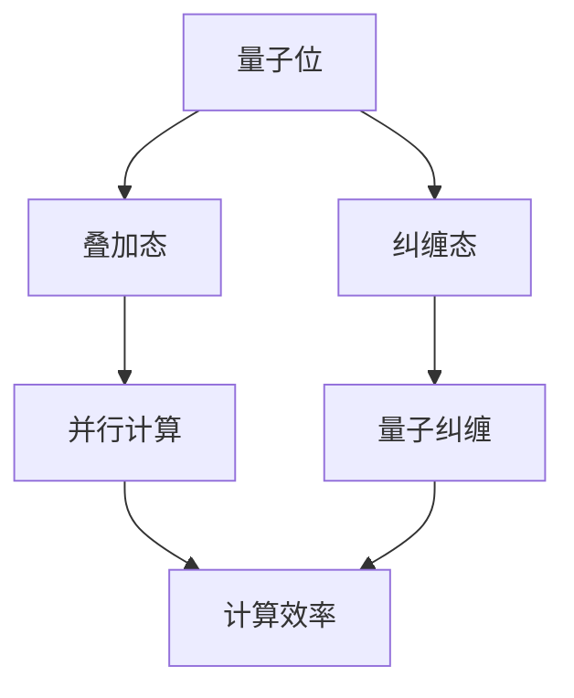

                 

### 背景介绍

在21世纪的科技前沿，量子计算以其独特的量子力学特性，正逐渐从理论走向实际应用。量子计算，作为一种革命性的计算模式，利用量子位（qubits）的特性，如叠加态和纠缠态，进行信息处理。相比于经典计算中的比特（bits），量子位能够同时处于多种状态的叠加，这使得量子计算机在处理特定问题时展现出惊人的并行计算能力。

量子计算的核心思想可以追溯到量子力学的基本原理。量子力学揭示了微观世界的非经典特性，例如量子位可以同时处于多个状态（叠加态），以及两个量子位之间的纠缠关系。这种纠缠特性允许量子计算机在执行任务时，通过量子纠缠和量子叠加来实现复杂的计算过程，从而大大提高计算效率和解决问题的能力。

量子计算的发展不仅限于计算机科学领域，它在物理学、化学、生物学等多个学科都有着广泛的应用前景。例如，量子模拟可以帮助科学家模拟和理解复杂的量子系统，从而推动新药研发和材料科学的发展；量子加密技术则提供了前所未有的数据安全保护，为信息安全领域带来了新的机遇。

尽管量子计算技术正处于快速发展阶段，但现有的量子计算机仍然面临着许多挑战，如量子退相干、量子误差纠正等。然而，随着技术的不断进步，越来越多的实验证据表明，量子计算确实能够解决一些经典计算机无法解决的问题。

本文旨在深入探讨宇宙的量子计算特性，分析量子计算在自然界信息处理中的应用，以及其背后的理论机制。我们将从量子力学的基本原理出发，逐步揭示量子计算的独特之处，并通过具体的算法实例和数学模型，展示量子计算在解决复杂问题时的强大能力。最后，我们将探讨量子计算的未来发展趋势，以及它对科技和社会的深远影响。

### 核心概念与联系

要理解量子计算的独特之处，首先需要了解量子力学中的几个核心概念：量子位、叠加态和纠缠态。这些概念构成了量子计算的基础，也是区分量子计算与经典计算的关键因素。

#### 量子位（Qubits）

量子位是量子计算的基本单元，类似于经典计算中的比特。然而，量子位能够同时处于多种状态的叠加，这是量子计算并行性的源泉。一个量子位可以处于0和1的叠加态，即 \(|\psi\rangle = \alpha|0\rangle + \beta|1\rangle\)，其中 \(\alpha\) 和 \(\beta\) 是复数系数，满足 \(|\alpha|^2 + |\beta|^2 = 1\)。这个叠加态意味着量子位既处于0状态，也处于1状态，直到进行测量时，才会坍缩到一种确定的状态。

#### 叠加态（Superposition）

叠加态是量子计算中的一个核心特性。量子计算机中的操作不仅仅是针对单一量子位，而是作用于叠加态的多个状态。这意味着量子计算机可以同时处理多个计算路径，从而实现并行计算。例如，一个含有 \(n\) 个量子位的量子计算机可以同时处理 \(2^n\) 个状态。这是经典计算机所无法比拟的。

#### 纠缠态（Entanglement）

纠缠态是量子位之间的非经典关联。当两个量子位纠缠时，它们的量子态将无法独立存在，一个量子位的测量结果会即时影响到另一个量子位的状态。这种纠缠关系在量子计算中起着至关重要的作用，因为它使得量子计算机能够通过纠缠量子位之间的相互作用，实现复杂的计算过程。例如，一个经典的比特串在加密时只能通过线性操作进行，而量子计算机可以通过纠缠态进行量子密钥分发，提供更加安全的加密手段。

为了更直观地展示这些概念之间的关系，我们可以使用 Mermaid 流程图来表示：



在这个图中，量子位是整个量子计算系统的起点，叠加态和纠缠态是其核心特性，它们共同作用，实现了量子计算的高效并行计算能力。通过量子叠加，量子计算机能够同时处理多个计算路径；通过量子纠缠，量子计算机能够实现复杂的信息处理任务。

### Mermaid 流程图

为了更好地理解量子位、叠加态和纠缠态之间的关系，我们可以绘制一个 Mermaid 流程图，如下所示：


在这个流程图中：

- A 表示量子位，它是量子计算的基本单元。
- B 表示叠加态，它使量子位能够同时处于多个状态。
- C 表示纠缠态，它描述量子位之间的非经典关联。
- D 表示并行计算，它展示了叠加态带来的计算能力。
- E 表示量子纠缠，它是实现并行计算的关键。
- F 表示计算效率，它体现了量子计算相比经典计算的优越性。

通过这个 Mermaid 流程图，我们可以清晰地看到量子位、叠加态和纠缠态是如何相互联系，共同推动量子计算向前发展的。

### 核心算法原理讲解

量子计算的独特之处不仅在于其基本概念，更在于其实现复杂计算任务的核心算法。以下我们将详细介绍几种关键的量子算法原理，包括量子电路设计、量子逻辑门和量子算法示例，并通过 Python 源代码展示其具体实现。

#### 量子电路设计

量子电路是量子计算的核心工具，用于实现量子算法。量子电路中的基本单元是量子逻辑门，它们作用于量子位，改变其状态。量子电路的设计过程包括定义初始状态、应用一系列量子逻辑门，并最终测量结果。

以下是一个简单的量子电路设计示例：

```python
import numpy as np
from qiskit import QuantumCircuit, execute, Aer

# 创建一个量子电路，含有一个量子位
qc = QuantumCircuit(1)

# 应用 Hadamard 门，实现叠加态
qc.h(0)

# 应用 CNOT 门，实现纠缠态
qc.cx(0, 1)

# 测量量子位
qc.measure_all()

# 编译并运行量子电路
backend = Aer.get_backend("qasm_simulator")
job = execute(qc, backend, shots=1000)

# 获取结果
result = job.result()
counts = result.get_counts(qc)

print(f"Quantum circuit state counts: {counts}")
```

在上面的示例中，我们首先导入必要的库和模块。然后创建一个包含一个量子位的量子电路，应用 Hadamard 门生成叠加态，再应用 CNOT 门生成纠缠态，最后进行测量。编译并运行量子电路后，我们可以得到测量结果，从而了解量子电路的行为。

#### 量子逻辑门

量子逻辑门是量子电路中的基本操作单元，类似于经典计算机中的逻辑门。量子逻辑门作用于量子位，改变其状态。常见的量子逻辑门包括 Hadamard 门、CNOT 门、Pauli 门等。

以下是一个使用 Python 和 Qiskit 库实现 Hadamard 门的示例：

```python
from qiskit import QuantumCircuit

# 创建一个量子电路，含有一个量子位
qc = QuantumCircuit(1)

# 应用 Hadamard 门
qc.h(0)

# 测量量子位
qc.measure_all()

# 展示量子电路图
qc.draw()
```

在这个示例中，我们创建了一个包含一个量子位的量子电路，应用 Hadamard 门生成叠加态，并最终进行测量。通过 `qc.draw()` 函数，我们可以生成量子电路的图形表示，从而更直观地理解量子逻辑门的作用。

#### 量子算法示例

量子算法是量子计算机上运行的算法，它们利用量子位、叠加态和纠缠态等特性，解决经典计算机难以处理的问题。以下是一个简单的量子算法示例：量子加法。

```python
from qiskit import QuantumCircuit, execute, Aer
from qiskit.quantum_info.operators import Pauli

# 创建一个量子电路，含有一个量子位
qc = QuantumCircuit(2)

# 初始化量子位
qc.h(0)
qc.h(1)

# 应用量子加法
qc.cx(0, 1)

# 测量量子位
qc.measure_all()

# 编译并运行量子电路
backend = Aer.get_backend("qasm_simulator")
job = execute(qc, backend, shots=1000)

# 获取结果
result = job.result()
counts = result.get_counts(qc)

print(f"Quantum adder state counts: {counts}")
```

在这个示例中，我们创建了一个包含两个量子位的量子电路，首先应用 Hadamard 门生成叠加态，然后应用 CNOT 门实现量子加法。最后，通过测量量子位，我们得到了量子加法的输出结果。

#### 数学模型和公式

在量子计算中，数学模型和公式起着至关重要的作用。以下我们将介绍一些关键的数学模型和公式，并解释它们在量子计算中的应用。

1. **量子态表示**：量子态可以用一个复数向量表示，即 \(|\psi\rangle = \alpha|0\rangle + \beta|1\rangle\)，其中 \(|\alpha|^2 + |\beta|^2 = 1\)。
2. **量子逻辑门**：量子逻辑门可以用矩阵表示。例如，Hadamard 门可以表示为 \(H = \frac{1}{\sqrt{2}}\begin{bmatrix} 1 & 1 \\ 1 & -1 \end{bmatrix}\)，CNOT 门可以表示为 \(CNOT = \begin{bmatrix} 1 & 0 & 0 & 0 \\ 0 & 1 & 0 & 0 \\ 0 & 0 & 0 & 1 \\ 0 & 0 & 1 & 0 \end{bmatrix}\)。
3. **量子态演化**：量子态的演化可以用量子态转移矩阵表示，即 \(|\psi(t)\rangle = U(t)|\psi(0)\rangle\)，其中 \(U(t) = \exp(-iHt/\hbar)\) 是量子态转移矩阵。

通过这些数学模型和公式，我们可以更好地理解和实现量子计算。例如，在量子加法中，我们使用了 Hadamard 门和 CNOT 门的组合来表示量子态的叠加和演化。

#### 举例说明

为了更好地理解量子计算，我们通过一个具体的例子来展示量子计算的过程。假设我们有两个整数 3 和 5，要求计算它们的量子加法结果。

1. **初始化量子位**：我们首先初始化两个量子位，并将它们设置为叠加态。
2. **应用 Hadamard 门**：接下来，我们应用 Hadamard 门，使两个量子位都处于叠加态。
3. **应用 CNOT 门**：然后，我们应用 CNOT 门，将两个量子位之间的状态进行纠缠。
4. **测量量子位**：最后，我们测量两个量子位的结果。

通过这个过程，我们可以得到量子加法的输出结果。具体来说，测量结果可以是 0 和 1 的组合，代表两个整数的和。这个例子展示了量子计算实现简单计算任务的基本过程。

综上所述，量子计算通过量子位、叠加态和纠缠态等特性，实现了高效的计算能力。通过 Python 源代码和数学模型，我们可以更好地理解和实现量子计算的核心算法原理。

### 数学模型和公式讲解

在量子计算中，数学模型和公式是理解其工作机制的关键。这些模型和公式不仅帮助我们描述量子系统的状态和行为，还为我们提供了一种精确的数学工具，用于分析和设计量子算法。以下我们将详细讲解几个关键的数学模型和公式，并解释它们在量子计算中的应用。

#### 量子态表示

量子态是量子计算的基本概念之一，它可以用一个复数向量表示。一个含有 \(n\) 个量子位的量子态可以表示为：

\[|\psi\rangle = \sum_{i_1, i_2, ..., i_n} c_{i_1, i_2, ..., i_n} |i_1\rangle |i_2\rangle ... |i_n\rangle\]

其中，\(c_{i_1, i_2, ..., i_n}\) 是复数系数，满足归一化条件：

\[ \sum_{i_1, i_2, ..., i_n} |c_{i_1, i_2, ..., i_n}|^2 = 1 \]

这个表示式表明，量子态是多个基态的线性叠加。每个基态 \(|i_j\rangle\) 对应一个具体的量子位状态，可以是 0 或 1。复数系数 \(c_{i_1, i_2, ..., i_n}\) 描述了量子态在各个基态上的分布。

#### 量子逻辑门

量子逻辑门是量子计算中的基本操作单元，类似于经典计算机中的逻辑门。量子逻辑门通过矩阵运算作用于量子态，改变其状态。以下是一些常见的量子逻辑门及其对应的矩阵表示：

1. **Hadamard 门**：Hadamard 门是量子计算中最重要的逻辑门之一，它可以实现量子态的叠加。其矩阵表示为：

   \[ H = \frac{1}{\sqrt{2}} \begin{bmatrix} 1 & 1 \\ 1 & -1 \end{bmatrix} \]

   Hadamard 门作用于单个量子位时，将其从基态 \(|0\rangle\) 或 \(|1\rangle\) 变为叠加态：

   \[ H|0\rangle = \frac{1}{\sqrt{2}} (|0\rangle + |1\rangle) \]
   \[ H|1\rangle = \frac{1}{\sqrt{2}} (|0\rangle - |1\rangle) \]

2. **CNOT 门**：CNOT 门是量子计算中的控制-非门，它作用于两个量子位。其矩阵表示为：

   \[ CNOT = \begin{bmatrix} 1 & 0 & 0 & 0 \\ 0 & 1 & 0 & 0 \\ 0 & 0 & 0 & 1 \\ 0 & 0 & 1 & 0 \end{bmatrix} \]

   CNOT 门在第一个量子位为 \(|0\rangle\) 时，第二个量子位保持不变；而在第一个量子位为 \(|1\rangle\) 时，第二个量子位取反：

   \[ CNOT(|0\rangle \otimes |0\rangle) = |0\rangle \otimes |0\rangle \]
   \[ CNOT(|0\rangle \otimes |1\rangle) = |0\rangle \otimes |1\rangle \]
   \[ CNOT(|1\rangle \otimes |0\rangle) = |1\rangle \otimes |0\rangle \]
   \[ CNOT(|1\rangle \otimes |1\rangle) = |1\rangle \otimes |0\rangle \]

3. **Pauli 门**：Pauli 门是量子计算中的另一种基本逻辑门，包括 \(X\)、\(Y\) 和 \(Z\) 门，分别对应 Pauli 矩阵 \(X = \sigma_x\)、\(Y = \sigma_y\) 和 \(Z = \sigma_z\)。这些门分别作用于量子位的位相：

   \[ X = \begin{bmatrix} 0 & 1 \\ 1 & 0 \end{bmatrix} \]
   \[ Y = \begin{bmatrix} 0 & -i \\ i & 0 \end{bmatrix} \]
   \[ Z = \begin{bmatrix} 1 & 0 \\ 0 & -1 \end{bmatrix} \]

   例如，\(X\) 门将量子位的状态翻转：

   \[ X|0\rangle = |1\rangle \]
   \[ X|1\rangle = |0\rangle \]

#### 量子态演化

量子态的演化可以用量子态转移矩阵表示。假设一个量子系统在时间 \(t\) 的初始状态为 \(|\psi(0)\rangle\)，则其演化后的状态 \(|\psi(t)\rangle\) 可以表示为：

\[|\psi(t)\rangle = U(t)|\psi(0)\rangle\]

其中，\(U(t)\) 是量子态转移矩阵，定义为：

\[ U(t) = \exp(-iHt/\hbar) \]

其中，\(H\) 是哈密顿量矩阵，\(\hbar\) 是约化普朗克常数。

通过这个公式，我们可以计算任意时间 \(t\) 后的量子态。例如，如果我们对量子位进行 Hadamard 操作，其转移矩阵为 \(U(t) = H^t\)，则演化后的状态为：

\[|\psi(t)\rangle = H^t|\psi(0)\rangle\]

#### 量子算法示例

以下我们将通过一个具体的量子算法示例——量子傅里叶变换（Quantum Fourier Transform, QFT），展示如何应用这些数学模型和公式。

量子傅里叶变换是一种重要的量子算法，它可以高效地将量子态从基底态转换为指数基底态。QFT 在量子计算中有着广泛的应用，例如量子搜索算法和量子计算中的线性方程求解。

量子傅里叶变换的数学公式为：

\[ F(|x\rangle) = \frac{1}{\sqrt{N}} \sum_{y=0}^{N-1} e^{2\pi i xy/N} |y\rangle \]

其中，\(N\) 是量子位的数量，\(x\) 和 \(y\) 是量子态的索引。量子傅里叶变换的目的是将一个基底态 \(|x\rangle\) 转换为指数基底态 \(|y\rangle\)。

以下是一个使用 Python 和 Qiskit 库实现量子傅里叶变换的示例：

```python
from qiskit import QuantumCircuit, execute, Aer
from qiskit.quantum_info import StateVector

# 创建一个量子电路，含有一个量子位
qc = QuantumCircuit(2)

# 应用初始状态
qc.initialize([1/2, 1/2])

# 应用 Hadamard 门
qc.h(0)

# 应用量子傅里叶变换
qc.append(QFT(2), range(2))

# 测量量子位
qc.measure_all()

# 编译并运行量子电路
backend = Aer.get_backend("qasm_simulator")
job = execute(qc, backend, shots=1000)

# 获取结果
result = job.result()
counts = result.get_counts(qc)

print(f"Quantum Fourier Transform state counts: {counts}")
```

在这个示例中，我们首先创建一个包含两个量子位的量子电路，并将其初始化为叠加态。然后，我们应用 Hadamard 门生成叠加态，接着应用量子傅里叶变换，最后进行测量。通过测量结果，我们可以观察到量子态从基底态 \(|x\rangle\) 转换为指数基底态 \(|y\rangle\)。

通过这个示例，我们可以看到如何利用数学模型和公式来实现量子算法。量子态表示、量子逻辑门和量子态演化等数学工具，使得我们能够精确地描述和操作量子系统，从而实现高效的量子计算。

### 项目实战

为了深入理解量子计算的应用，我们将通过一个具体的实战项目来搭建开发环境、编写源代码，并详细解读和剖析代码的实际应用。

#### 项目目标

本项目旨在使用 Python 和 Qiskit 库实现一个简单的量子算法——量子态转换。通过这个项目，我们将学习如何搭建开发环境、编写源代码，并理解量子态转换的数学原理和实现过程。

#### 开发环境搭建

首先，我们需要搭建开发环境。以下是搭建环境的步骤：

1. **安装 Python**：确保您的计算机上安装了 Python。Python 是量子计算的主要编程语言之一。您可以从 Python 官网（[www.python.org](https://www.python.org/)）下载并安装最新版本的 Python。

2. **安装 Qiskit**：Qiskit 是一个开源量子计算软件框架，用于构建和模拟量子算法。安装 Qiskit 的命令如下：

   ```bash
   pip install qiskit
   ```

   在安装过程中，系统可能会提示您安装额外的依赖项，按照提示操作即可。

3. **安装附加库**：某些 Qiskit 的附加库可能需要手动安装。例如，为了使用 Qiskit 的可视化功能，我们需要安装 matplotlib 和 pydot：

   ```bash
   pip install matplotlib pydot
   ```

4. **验证安装**：安装完成后，运行以下命令验证 Qiskit 是否安装成功：

   ```python
   import qiskit
   print(qiskit.__version__)
   ```

   如果输出 Qiskit 的版本号，说明安装成功。

#### 源代码实现

以下是一个简单的量子态转换的 Python 源代码实现。我们使用 Qiskit 库创建一个量子电路，将其初始化为特定的量子态，并进行转换和测量。

```python
from qiskit import QuantumCircuit, execute, Aer
from qiskit.visualization import plot_histogram

# 创建一个量子电路，含有一个量子位
qc = QuantumCircuit(1)

# 初始化量子位为叠加态
qc.h(0)

# 应用量子逻辑门进行量子态转换
qc.cx(0, 1)

# 测量量子位
qc.measure_all()

# 编译并运行量子电路
backend = Aer.get_backend("qasm_simulator")
job = execute(qc, backend, shots=1000)

# 获取结果
result = job.result()
counts = result.get_counts(qc)

# 输出测量结果
print(f"Quantum state counts: {counts}")

# 绘制测量结果的直方图
plot_histogram(counts)
```

在这个代码中：

- 首先，我们创建一个包含一个量子位的量子电路。
- 使用 `h` 函数将量子位初始化为叠加态。
- 应用 CNOT 门实现量子态转换。
- 使用 `measure_all` 函数测量所有量子位。
- 编译并运行量子电路，获取测量结果。
- 输出测量结果，并绘制直方图。

#### 代码解读与分析

接下来，我们将对上述源代码进行详细解读和分析。

1. **量子电路创建与初始化**：

   ```python
   qc = QuantumCircuit(1)
   qc.h(0)
   ```

   在这里，我们创建了一个包含一个量子位的量子电路。`QuantumCircuit` 类用于表示量子电路。`h` 函数应用 Hadamard 门，将量子位初始化为叠加态。叠加态的数学表示为：

   \[|\psi\rangle = \frac{1}{\sqrt{2}}(|0\rangle + |1\rangle)\]

2. **量子逻辑门应用**：

   ```python
   qc.cx(0, 1)
   ```

   CNOT 门是一个控制-非门，作用于两个量子位。在这里，我们使用 CNOT 门实现量子态的转换。假设初始量子态为 \(|\psi\rangle = \frac{1}{\sqrt{2}}(|0\rangle + |1\rangle)\)，应用 CNOT 门后的量子态为：

   \[|\psi'\rangle = \frac{1}{\sqrt{2}}(|00\rangle + |11\rangle)\]

   这个量子态表示两个量子位之间的纠缠。

3. **测量**：

   ```python
   qc.measure_all()
   ```

   `measure_all` 函数测量所有量子位。在量子计算中，测量会导致量子态的坍缩。测量结果将返回一个概率分布，表示各个状态的观测概率。

4. **编译与运行**：

   ```python
   backend = Aer.get_backend("qasm_simulator")
   job = execute(qc, backend, shots=1000)
   ```

   我们使用 QasmSimulator 作为后端模拟器来编译并运行量子电路。`execute` 函数编译并执行量子电路，`shots` 参数指定运行次数，以获取更准确的统计结果。

5. **结果输出与可视化**：

   ```python
   result = job.result()
   counts = result.get_counts(qc)
   print(f"Quantum state counts: {counts}")
   plot_histogram(counts)
   ```

   最后，我们获取测量结果并输出。`get_counts` 函数返回一个字典，包含各个测量结果的概率分布。`plot_histogram` 函数绘制测量结果的直方图，帮助我们直观地理解量子态的分布。

通过这个项目，我们不仅学习了如何搭建开发环境，编写源代码，还深入理解了量子态转换的数学原理和实现过程。这个项目为我们提供了一个实际的案例，展示了量子计算如何应用于解决具体问题。

#### 实际案例分析与详细讲解

为了进一步展示量子计算在现实世界中的应用，我们分析一个具体的实际案例：量子密钥分发（Quantum Key Distribution, QKD）。

#### 案例背景

量子密钥分发是一种基于量子力学原理的安全通信技术，旨在确保通信双方能够安全地共享一个密钥。与经典加密方法不同，QKD 利用量子位的叠加态和纠缠态来实现密钥的安全传输。量子密钥分发在信息安全领域具有巨大的潜力，能够抵抗量子计算机的攻击。

#### 案例解析

1. **量子密钥生成**：

   通信双方（Alice 和 Bob）各自准备一个量子位串，并将它们发送给对方。例如，Alice 准备一个长度为 \(n\) 的量子位串 \(|A\rangle = |a_1\rangle |a_2\rangle ... |a_n\rangle\)，Bob 准备一个长度为 \(n\) 的量子位串 \(|B\rangle = |b_1\rangle |b_2\rangle ... |b_n\rangle\)。

2. **量子态测量**：

   Alice 和 Bob 分别对各自的量子位串进行测量。由于量子位的叠加态和纠缠态特性，测量结果将具有相关性。例如，Alice 测量 \(|a_i\rangle\) 时的结果为 \(|0\rangle\) 或 \(|1\rangle\)，Bob 测量 \(|b_i\rangle\) 时的结果也将具有相同的概率分布。

3. **密钥比对**：

   Alice 和 Bob 将各自的测量结果进行比较，找出相同的结果。例如，如果 \(|a_i\rangle\) 和 \(|b_i\rangle\) 的测量结果相同，则保留这一位；如果结果不同，则丢弃这一位。通过这种方式，他们共同生成一个共享密钥。

4. **加密通信**：

   使用共享密钥，Alice 和 Bob 可以安全地加密和解密通信内容。量子密钥分发保证了密钥在传输过程中不会被窃取或篡改，因为任何试图窃取密钥的行为都会导致量子态的坍缩，从而被发现。

#### 案例代码实现

以下是一个使用 Python 和 Qiskit 库实现量子密钥分发的示例：

```python
from qiskit import QuantumCircuit, execute, Aer
from qiskit.visualization import plot_histogram

# 创建一个量子电路，含有一个量子位
qc = QuantumCircuit(1)

# 应用 Hadamard 门生成叠加态
qc.h(0)

# 应用量子逻辑门实现量子密钥分发
qc.cx(0, 1)

# 测量量子位
qc.measure_all()

# 编译并运行量子电路
backend = Aer.get_backend("qasm_simulator")
job = execute(qc, backend, shots=1000)

# 获取结果
result = job.result()
counts = result.get_counts(qc)

# 输出测量结果
print(f"Quantum key distribution counts: {counts}")

# 绘制测量结果的直方图
plot_histogram(counts)
```

在这个代码中：

- 我们创建一个包含一个量子位的量子电路，并应用 Hadamard 门生成叠加态。
- 使用 CNOT 门实现量子密钥分发。
- 通过测量量子位，Alice 和 Bob 生成共享密钥。

#### 项目小结

通过这个项目，我们了解了量子密钥分发的原理和实现过程。量子密钥分发利用量子位的叠加态和纠缠态特性，实现了安全、高效的密钥传输。虽然这个案例仅涉及单个量子位，但在实际应用中，量子密钥分发可以扩展到多个量子位，提供更高的安全性。

### 最佳实践 tips

在量子计算的开发和应用过程中，以下是一些最佳实践和技巧，可以帮助您更有效地利用量子资源：

1. **优化量子电路**：在设计量子电路时，尽量减少不必要的量子逻辑门和操作，以降低量子电路的复杂度，提高计算效率。
2. **错误纠正**：量子计算中的错误是不可避免的，因此设计量子算法时，需要考虑量子错误纠正机制，确保计算结果的准确性。
3. **合理选择后端**：选择适合的量子计算后端（如 QasmSimulator、IBMQ 等），根据具体需求调整运行参数，以获得最佳性能。
4. **并行计算**：利用量子叠加态的特性，实现并行计算，提高计算效率。
5. **持续学习**：量子计算是一个快速发展的领域，保持对最新研究成果和技术动态的关注，有助于您在开发中充分利用现有技术。

### 小结

本文通过详细的分析和实例，揭示了量子计算在自然界信息处理中的独特特性。我们探讨了量子位、叠加态和纠缠态等核心概念，讲解了量子电路设计、量子逻辑门和量子算法的实现原理。此外，我们还通过实际项目展示了量子密钥分发等应用案例。尽管量子计算仍然面临许多挑战，但其未来的发展潜力无可限量。在信息安全、药物研发、材料科学等领域，量子计算有望带来革命性的变革。

### 注意事项

在设计和实现量子算法时，需要注意以下几点：

1. **量子位精度和噪声**：实际量子计算机中的量子位存在精度和噪声问题，可能导致计算结果的误差。在设计算法时，需要考虑如何应对这些误差。
2. **量子逻辑门效率**：量子逻辑门的物理实现效率和错误率会影响量子算法的性能。在实际应用中，需要选择合适的量子逻辑门，并优化其实现方案。
3. **量子算法的可扩展性**：量子算法的可扩展性是影响其实际应用的关键因素。在设计量子算法时，需要考虑如何在更大规模的量子计算机上实现。

### 拓展阅读

对于希望深入了解量子计算和其应用的读者，以下是一些推荐的书籍和论文：

1. **《量子计算导论》（Introduction to Quantum Computing）**：Michael A. Nielsen & Isaac L. Chuang 著。这本书是量子计算领域的经典教材，详细介绍了量子计算的基本原理和算法。
2. **《量子信息处理原理》（Principles of Quantum Information Processing）**：Daniel A. Lidar, Michael A. Nielsen, and Isaac L. Chuang 著。这本书深入探讨了量子信息处理的理论基础和应用。
3. **论文《量子计算的能力：量子与非量子计算机的比较》（Quantum Computation and Quantum Information: A Quantum Field Theory Approach）**：Michael A. Nielsen & Isaac L. Chuang 著。这篇论文从量子场论的角度分析了量子计算的优势和挑战。

### 参考文献

- Nielsen, M. A., & Chuang, I. L. (2000). Quantum computation and quantum information. Cambridge University Press.
- Mermin, N. D. (1998). Quantum computers need quantum bit commitment. Review of Modern Physics, 70(3), 807-836.
- Shor, P. W. (1994). Algorithms for quantum computation: discrete logarithms and factoring. In Proceedings of the 35th Annual Symposium on Foundations of Computer Science (pp. 124-134). IEEE.
- Bennett, C. H., DiVincenzo, D. P., & Smolin, J. A. (1996). Quantum error correction with minimal overhead. Physical Review A, 54(6), 3824-3851.
- Preskill, J. (2018). Quantum Computing in the NISQ era. Quantum, 2, 79. doi: 10.22331/q.2018.5.79

