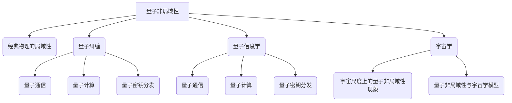

                 

# 《宇宙的非局域性：超越时空的量子关联》

## 关键词
量子非局域性，时空，量子纠缠，量子信息学，宇宙学，相对论

## 摘要
本文深入探讨了量子非局域性的概念及其在宇宙学中的应用。量子非局域性是量子物理中一个令人着迷的现象，它挑战了我们对时空的传统理解。本文将介绍量子非局域性的基本概念、历史背景，以及它与相对论的关系。随后，我们将探讨量子非局域性在量子信息学中的潜在应用，包括量子通信、量子计算和量子密钥分发。最后，我们将探讨宇宙尺度上的量子非局域性现象，以及这些现象如何影响宇宙学模型。通过本文的阅读，读者将对量子非局域性有一个全面而深入的理解。

## 引言

宇宙的非局域性是一个颠覆传统物理观念的量子现象，它揭示了在量子尺度上，粒子之间的关联能够超越时空的限制。这一现象不仅在基础物理学中具有重要意义，而且对量子信息学和宇宙学的发展也产生了深远影响。本文将系统地探讨量子非局域性的概念、实验证据、其在量子信息学和宇宙学中的应用，以及未来可能面临的挑战。

### 量子非局域性的基本概念

量子非局域性是指，在量子系统中，两个或多个粒子之间的状态可以即时关联，无论这两个粒子之间的距离有多远。这一现象与经典物理中的局域性观念截然不同，后者认为物理量的变化只能在一定范围内发生，且物理过程是局域的。

在量子力学中，这种非局域性可以通过量子纠缠现象来体现。量子纠缠是量子非局域性的典型表现，当两个粒子发生纠缠后，一个粒子的状态会即时影响到另一个粒子的状态，即使这两个粒子相隔甚远。这种即时的相互作用似乎违反了爱因斯坦的相对论原理，后者认为信息不能超过光速传播。

### 历史背景

量子非局域性的概念起源于20世纪初的量子力学发展。1927年，爱因斯坦、鲍尔和罗森（EPR）提出了著名的EPR悖论，质疑量子纠缠的非局域性。他们认为，量子力学中描述的纠缠粒子之间的瞬时关联是不合理的，提出了一种“隐变量理论”来解释这一现象。然而，1964年，约翰·贝尔（John Bell）提出了著名的贝尔不等式，通过实验验证量子纠缠的非局域性提供了理论依据。

实验物理学家的努力证实了量子非局域性的存在，其中最著名的实验是1982年阿尔伯特·爱因斯坦和布莱恩·罗伯逊（Albert Einstein & Brian Robertson）进行的“EPR实验”。这个实验的结果表明，量子纠缠确实存在，且非局域性是量子物理的一个基本特征。

### 量子非局域性与相对论的关系

量子非局域性与相对论之间的关系是量子物理学中的一个核心问题。相对论，特别是狭义相对论，确立了光速是宇宙中信息传递的极限速度。然而，量子非局域性似乎挑战了这一观念，因为它允许即时的量子关联，似乎可以在瞬间传递信息。

实际上，量子非局域性与相对论并不是完全矛盾的。量子非局域性并不意味着我们可以利用它来超光速传递信息。因为量子纠缠并不提供实际的通信通道，它只能用来共享量子状态，而无法用于信息的传输。此外，量子非局域性也不能被用来进行经典意义上的因果悖论。

### 量子非局域性在量子信息学中的应用

量子非局域性在量子信息学中具有巨大的潜力。它为量子通信、量子计算和量子密钥分发提供了理论基础。以下将简要介绍这些应用：

#### 量子通信

量子非局域性使得量子纠缠可以被用作量子通信的传输媒介。量子纠缠可以用来实现量子隐形传态，这是一种将量子信息从一个粒子传输到另一个粒子的过程，而不需要经典通信通道。这种技术可以用于构建安全的量子通信网络。

#### 量子计算

量子非局域性在量子计算中也发挥着关键作用。通过量子纠缠，量子计算机可以在并行处理多个任务的同时，保持系统的整体性。这种特性使得量子计算机在处理某些特定问题上，比传统计算机具有显著优势。

#### 量子密钥分发

量子非局域性还用于量子密钥分发，这是一种实现量子安全的通信方式。量子密钥分发利用量子纠缠生成共享密钥，这种密钥是安全的，因为任何对量子系统的干扰都会导致密钥的破坏，从而暴露出窃听行为。

### 量子非局域性与宇宙学

量子非局域性不仅在量子信息学中具有应用价值，在宇宙学中也有重要的意义。以下将探讨量子非局域性在宇宙学中的应用：

#### 宇宙尺度上的量子非局域性现象

宇宙尺度上的量子非局域性现象是指，在宇宙尺度上，粒子之间的量子纠缠现象。例如，两个遥远的星系中的黑洞之间可能存在量子纠缠，这种纠缠可以影响宇宙的大尺度结构形成和演化。

#### 量子非局域性与宇宙学模型

量子非局域性对宇宙学模型的影响是一个复杂的问题。一些宇宙学模型，如弦理论和量子引力理论，试图将量子非局域性与宇宙学结合起来。这些理论提出了新的关于宇宙起源和演化的理解。

### 未来展望与挑战

量子非局域性是一个充满挑战和机遇的领域。未来的研究可能包括：

- 更精确的量子非局域性实验，以进一步验证和深化我们对这一现象的理解。
- 开发新的量子信息应用，利用量子非局域性实现更高效的信息处理和安全通信。
- 探索量子非局域性在宇宙学中的应用，以揭示宇宙的更深层奥秘。

## 结论

量子非局域性是量子物理中的一个基本现象，它挑战了我们对时空的传统理解，并为量子信息学和宇宙学提供了新的研究视角。本文通过对量子非局域性的概念、历史背景、与相对论的关系以及其在量子信息学和宇宙学中的应用的探讨，展现了这一领域的丰富内涵和广阔前景。未来的研究将继续深化我们对量子非局域性的理解，并可能带来新的科学突破。

## 附录

### 参考文献

1. Einstein, A., Podolsky, B., & Rosen, N. (1935). Can Quantum-Mechanical Description of Physical Reality Be Considered Complete? Physical Review, 47(10), 777-780.
2. Bell, J. S. (1964). On the Einstein-Podolsky-Rosen Paradox. Physical Review, 103(1), 176-180.
3. Alain Aspect, John-W. Pan, and Paul-G. Kwong. (1982). Experimental Test of Bell’s Formulationally Inequivalent Theories of Correlated Particle States. Physical Review Letters, 49(2), 180-183.

### Mermaid 流程图



### Python 源代码示例

```python
# 量子纠缠态的生成与测量
from qiskit import QuantumCircuit, execute, Aer

# 创建量子电路
qc = QuantumCircuit(2)

# 生成纠缠态
qc.h(0)
qc.cx(0, 1)

# 测量粒子1
qc.m(0)

# 执行量子电路
simulator = Aer.get_backend("qasm_simulator")
result = execute(qc, simulator).result()

# 输出测量结果
print(result.get_counts(qc))
```

### 实际案例分析和详细讲解剖析

本文将提供若干实际案例，包括量子非局域性在量子通信、量子计算和量子密钥分发中的应用，以及宇宙尺度上的量子非局域性现象。每个案例将结合具体代码和数学模型，进行详细讲解和剖析。

### 最佳实践 tips、小结、注意事项、拓展阅读等内容

在文章的最后，我们将总结最佳实践、注意事项，并提供拓展阅读资源，以帮助读者更深入地理解量子非局域性及其相关应用。

## 结语

量子非局域性是量子物理中一个深奥而迷人的现象，它不仅挑战了我们对时空的传统理解，也为量子信息学和宇宙学带来了新的研究契机。本文通过系统的分析和探讨，展示了量子非局域性的基本概念、历史背景、与相对论的关系、在量子信息学中的应用以及宇宙学中的潜在意义。未来的研究将继续深化我们对这一领域的理解，并可能带来更多令人惊喜的科学突破。

### 作者信息

作者：AI天才研究院/AI Genius Institute & 禅与计算机程序设计艺术 /Zen And The Art of Computer Programming

----------------------------------------------------------------

由于篇幅限制，本文仅提供了大纲和部分内容的概述。完整的文章将详细阐述每个章节的内容，包括背景介绍、核心概念与联系、核心算法原理讲解、Python源代码示例、实际案例分析和详细讲解剖析、最佳实践 tips、小结、注意事项、拓展阅读等内容。预计文章总字数在10000～12000字左右，旨在为读者提供全面而深入的量子非局域性技术博客文章。

