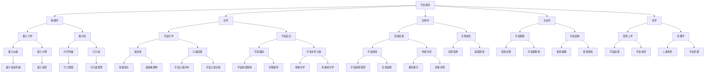

                 

### 第1章：宇宙观念概述

#### 1.1 宇宙观念的起源与演变

宇宙观念是人类对宇宙的理解和认知，其起源可以追溯到古代文明。从古代天文学到现代科学，宇宙观念经历了漫长的发展和演变。

- **1.1.1 宇宙观念的起源**
  - 在古代，人们对宇宙的理解主要依赖于观察和神话。例如，古埃及人相信宇宙由神创造，而古希腊人则提出了“地心说”和“日心说”等宇宙模型。
  - 在中国，古代天文学的发展也对宇宙观念的形成产生了重要影响。例如，《尚书》中就有关于宇宙结构的描述，而《周易》则通过阴阳五行的哲学体系来解释宇宙的演化。

- **1.1.2 宇宙观念的演变**
  - 随着科学技术的进步，人们对宇宙的认识逐渐深入。哥白尼提出的“日心说”挑战了传统的地心说宇宙观，而伽利略和开普勒的观测和理论则进一步推动了宇宙观念的演变。
  - 20世纪初，爱因斯坦的相对论革命性地改变了人们对宇宙的理解，提出了时空相对性和能量-质量等价原理。

#### 1.2 宇宙观念在不同学科中的应用

宇宙观念不仅限于天文学，它在物理学、化学、生物学等多个学科中都有广泛的应用。

- **1.2.1 宇宙观念在物理学中的应用**
  - 在物理学中，宇宙观念体现在对宇宙结构的描述和宇宙演化规律的探讨。例如，量子力学中的宇宙观强调微观粒子行为的随机性和量子叠加态。
  - 相对论则提出了时空弯曲和引力波的概念，为理解宇宙的高能物理过程提供了新的视角。

- **1.2.2 宇宙观念在化学中的应用**
  - 在化学中，宇宙观念体现在对宇宙元素起源和宇宙化学反应的研究。例如，通过核合成过程，宇宙中的元素在恒星内部形成，并在超新星爆炸等过程中传播。
  - 宇宙化学的研究帮助我们理解地球生命起源的可能性和宇宙中其他星球的生命存在可能性。

- **1.2.3 宇宙观念在生物学中的应用**
  - 在生物学中，宇宙观念体现在对生命起源和生物进化的研究。例如，通过研究宇宙射线对生物的影响，我们可以探讨生命在宇宙中传播的可能性。
  - 宇宙辐射和宇宙化学元素对地球生命的影响也是生物学研究的重要方向。

#### 1.3 宇宙观念与哲学思考

宇宙观念不仅仅是一种科学理论，它也涉及到哲学层面的思考。

- **1.3.1 宇宙观念与形而上学**
  - 形而上学是哲学中对宇宙本质和存在的探讨。宇宙观念为形而上学提供了丰富的素材，例如，关于宇宙的起源、存在和意义的探讨。

- **1.3.2 宇宙观念与伦理学**
  - 伦理学关注道德和人类行为。宇宙观念对伦理学的影响体现在对人类在宇宙中角色的认知，例如，人类应该如何对待地球和其他星球的生命。

通过本章的讨论，我们可以看到宇宙观念在不同学科中的交叉与融合。接下来，我们将进一步探讨宇宙观念在生物学和天文学中的交叉，以及跨学科研究中的融合。

## 第2章：宇宙观念在生物学与天文学中的交叉

### 2.1 宇宙观念在生物学中的应用

宇宙观念在生物学中的应用主要集中在生命起源和生物进化的研究领域。通过对宇宙元素和宇宙辐射的研究，科学家们试图理解生命在宇宙中的起源和演化。

- **2.1.1 宇宙元素与生命起源**
  - 宇宙中的元素起源是生命起源研究的重要基础。科学家们通过核合成过程研究发现，宇宙中的轻元素如氢、氦和锂是在恒星内部形成的，而重元素如碳、氧和氮则是在超新星爆炸等极端宇宙事件中形成的。
  - 生命起源研究的一个重要假说是“原始汤假说”，即生命起源于地球早期海洋中的简单有机分子。宇宙元素的形成和分布为这个假说提供了物质基础。

- **2.1.2 宇宙辐射对生物的影响**
  - 宇宙辐射包括宇宙射线和伽马射线等高能粒子，这些辐射对生物体有着重要的影响。科学家通过实验研究发现，宇宙辐射可以引起生物体内的基因突变，从而影响生物的遗传特性。
  - 在地球环境中，宇宙辐射通过大气层和地球磁场的防护作用，对生物的影响相对较小。然而，在宇宙深处或外星球环境中，宇宙辐射可能会成为制约生命存在的因素。

### 2.2 宇宙观念在天文学中的发展

天文学的发展离不开宇宙观念的指导和推动。通过对宇宙结构的观测和理论模型的构建，天文学家们不断深化对宇宙的认识。

- **2.2.1 宇宙膨胀与宇宙学**
  - 宇宙膨胀理论是现代宇宙学的基础。哈勃观测发现，宇宙中的星系都在相互远离，这表明宇宙正在膨胀。宇宙膨胀理论为理解宇宙的起源和演化提供了重要的线索。
  - 当前，宇宙膨胀的研究主要集中在宇宙膨胀率（哈勃参数）和宇宙加速膨胀的原因上。宇宙加速膨胀被认为是由暗能量引起的，但其本质和机制仍然是一个未解之谜。

- **2.2.2 宇宙结构观测**
  - 宇宙结构观测是研究宇宙形态和分布的重要手段。通过观测星系、星团和星系团等宇宙结构，科学家们可以了解宇宙的形态和演化历史。
  - 近年来的观测发现，宇宙中的结构分布呈现出多层次的特点，从行星到星系，再到星系团，宇宙结构呈现出自相似性。这种结构分布为理解宇宙的起源和演化提供了重要依据。

通过宇宙观念在生物学和天文学中的交叉研究，科学家们不仅能够更好地理解生命和宇宙的奥秘，也能够推动跨学科研究的深入发展。接下来，我们将探讨宇宙观念在跨学科研究中的融合。

----------------------------------------------------------------

## 第3章：宇宙观念在跨学科研究中的融合

### 3.1 跨学科研究的方法与挑战

跨学科研究是当代科学发展的一个重要趋势。它旨在通过整合不同学科的理论和方法，解决单一学科难以应对的复杂问题。然而，跨学科研究并非易事，它面临诸多方法和挑战。

- **3.1.1 跨学科研究的重要性**
  - 跨学科研究能够提供更全面、更深刻的科学理解。例如，在生物学和物理学中，量子生物学和生物物理学的交叉研究，为理解生命的基本机制提供了新的视角。
  - 跨学科研究还能够推动新技术的发明和创新。例如，在计算机科学和生物学中，生物信息学和计算生物学的交叉研究，为基因组学和生物技术的发展做出了重要贡献。

- **3.1.2 跨学科研究的挑战**
  - 跨学科研究面临的一个主要挑战是学科之间的语言和概念差异。不同学科有着不同的术语和理论框架，这为跨学科交流和理解带来了困难。
  - 另一个挑战是资源分配和管理。跨学科研究往往需要不同领域的专家合作，这需要有效的资源分配和管理机制，以确保各方的积极参与和资源利用效率。

### 3.2 成功的跨学科研究案例

尽管面临挑战，跨学科研究已经取得了许多成功的案例，这些案例展示了宇宙观念在不同学科中的交叉与融合。

- **3.2.1 宇宙观念与认知科学**
  - 认知科学是研究人类思维、学习和记忆等心理过程的学科。宇宙观念对认知科学的影响体现在对宇宙认知的心理机制的研究。
  - 例如，科学家通过研究宇航员在太空环境中的认知表现，探讨了宇宙环境对人类认知能力的影响。这些研究不仅深化了我们对宇宙认知的理解，也为太空探索提供了重要参考。

- **3.2.2 宇宙观念与信息科学**
  - 信息科学是研究信息传输、处理和存储的学科。宇宙观念对信息科学的影响体现在对宇宙信息传输和处理的探索。
  - 例如，量子通信和量子计算是信息科学的前沿领域，其中宇宙观念的应用为这些领域的发展提供了新的思路。量子纠缠和量子态的传输被认为具有巨大的潜力，可以用于实现安全的宇宙信息传输。

通过上述跨学科研究案例，我们可以看到宇宙观念在不同学科中的交叉与融合如何推动科学进步和技术创新。这种交叉与融合不仅拓宽了科学研究的视野，也为解决复杂问题提供了新的方法和思路。

在接下来的章节中，我们将进一步探讨宇宙观念在现代科学中的前沿探索，以及宇宙观念对教育和社会的影响。这些讨论将继续揭示宇宙观念在跨学科研究中的重要性。

----------------------------------------------------------------

## 第4章：宇宙观念在现代科学中的前沿探索

### 4.1 宇宙观念与宇宙学新理论

宇宙观念在宇宙学中的探索不断推动着我们对宇宙的理解。随着科学技术的进步，新的理论和观测方法不断涌现，为宇宙学的研究提供了新的视角。

- **4.1.1 黑洞与宇宙观念**
  - 黑洞是宇宙中最为神秘的天体之一，其强大的引力甚至能够吞噬光线。宇宙观念对黑洞的研究体现在对黑洞性质和黑洞物理过程的探索。
  - 例如，通过观测黑洞事件视界和引力波，科学家们对黑洞的性质有了更深入的理解。这些观测结果与爱因斯坦的广义相对论理论相吻合，进一步验证了宇宙观念的正确性。

- **4.1.2 宇宙暗物质与暗能量**

  - 宇宙中的暗物质和暗能量是宇宙观念研究中的两个重要谜团。暗物质不发光，不与电磁波相互作用，但其引力作用对宇宙的演化至关重要。暗能量则被认为是驱动宇宙加速膨胀的力量。
  - 当前，宇宙学的研究集中在寻找暗物质和暗能量的本质和机制。例如，通过观测宇宙微波背景辐射和大规模结构分布，科学家们试图揭示暗物质和暗能量的性质和来源。

### 4.2 宇宙观念在新技术中的应用

宇宙观念不仅对传统科学有着深远影响，也在新技术的发展中扮演着重要角色。新的技术不断涌现，为宇宙观念的应用提供了更广阔的舞台。

- **4.2.1 宇宙观念与量子计算**
  - 量子计算是计算机科学的前沿领域，它利用量子力学的原理进行信息处理。宇宙观念在量子计算中的应用体现在对量子态和量子纠缠的研究。
  - 例如，量子纠缠被认为具有巨大的潜力，可以用于实现量子通信和量子计算。宇宙中的量子纠缠现象为量子计算提供了新的思路和可能性。

- **4.2.2 宇宙观念与人工智能**
  - 人工智能是计算机科学的另一个重要领域，它致力于模拟和扩展人类智能。宇宙观念在人工智能中的应用体现在对智能体行为和决策的研究。
  - 例如，宇宙观念中的进化算法和神经网络理论为人工智能的发展提供了重要基础。这些算法和理论可以帮助人工智能系统更好地适应和优化复杂环境。

通过宇宙观念在新技术中的应用，我们可以看到宇宙观念如何推动科学和技术的发展。新的技术和工具不仅为宇宙观念的研究提供了更强大的手段，也为解决复杂科学问题提供了新的途径。

在接下来的章节中，我们将继续探讨宇宙观念在教育和社会中的影响。这些讨论将进一步揭示宇宙观念在现代科学中的前沿探索和广泛应用。

----------------------------------------------------------------

## 第5章：宇宙观念的教育与普及

### 5.1 宇宙观念在教育中的角色

宇宙观念在教育中的角色至关重要，它不仅能够激发学生对科学的兴趣，还能够提升他们的科学素养和批判性思维能力。以下是一些具体的例子：

- **5.1.1 宇宙观念在科学教育中的应用**
  - 宇宙观念在科学教育中的应用可以激发学生对宇宙的探索兴趣。通过观察天体、学习宇宙演化过程，学生可以更直观地理解科学原理。
  - 例如，通过模拟宇宙中的星系碰撞和恒星演化过程，学生可以深入了解天文学的基本概念和现象。这样的实践不仅能够加深对知识的理解，还能够培养他们的实验能力和科学探究精神。

- **5.1.2 宇宙观念在人文教育中的应用**
  - 宇宙观念在人文教育中的应用可以帮助学生从更广阔的视角看待人类文明的发展。通过学习宇宙的历史和宇宙观念的演变，学生可以更好地理解人类在宇宙中的地位和作用。
  - 例如，通过学习古代宇宙观念和现代宇宙观念的对比，学生可以探讨人类对宇宙认识的变化如何影响了社会和文化的发展。这样的学习不仅能够拓展学生的知识面，还能够培养他们的跨学科思维和批判性思维。

### 5.2 宇宙观念的公众传播与影响

宇宙观念的公众传播对于提升社会对科学的理解和兴趣具有重要意义。以下是一些传播途径和影响：

- **5.2.1 宇宙观念在媒体中的呈现**
  - 媒体是公众获取信息的重要渠道，通过媒体可以有效地传播宇宙观念。例如，科学纪录片、科普书籍和科普讲座等都是有效的传播方式。
  - 媒体在传播宇宙观念时，应当注重科学性和趣味性的结合。通过生动的讲述和丰富的视觉素材，媒体可以帮助公众更好地理解宇宙的奥秘。

- **5.2.2 宇宙观念的公众认知与误解**
  - 公众对宇宙观念的认知水平参差不齐，有时会出现误解和偏见。例如，一些人可能对黑洞、暗物质等概念存在误解。
  - 为了提升公众对宇宙观念的准确理解，科学教育和科普工作应当注重准确性和连续性。通过持续的宣传和教育，可以帮助公众建立正确的宇宙观念，减少误解。

通过教育和普及，宇宙观念可以深入人心，激发人们对科学的热爱和对未知世界的探索欲望。这不仅有助于提升科学素养，也能够推动社会对科学的支持和理解。

在接下来的章节中，我们将探讨宇宙观念对未来社会的影响，进一步揭示宇宙观念在社会发展中的重要作用。

----------------------------------------------------------------

## 第6章：宇宙观念与未来社会

### 6.1 宇宙观念对科技发展的推动

宇宙观念不仅在科学研究中发挥着重要作用，也对科技发展产生了深远影响。通过宇宙观念的引导，新技术和新理论不断涌现，推动了科技的进步。

- **6.1.1 宇宙观念与航天技术的发展**
  - 宇宙观念对航天技术的发展起到了关键作用。例如，对宇宙辐射和行星环境的研究为航天器的设计和防护提供了重要依据。
  - 另外，宇宙观念中的宇宙探索精神也激发了人们对太空的渴望，推动了航天技术的不断突破。例如，宇宙飞船、空间站和火星探测任务都是宇宙观念推动的结果。

- **6.1.2 宇宙观念与地球观测技术的发展**
  - 地球观测技术的发展同样受益于宇宙观念的指导。通过观测宇宙中的天体和环境，科学家们可以更全面地了解地球的运行规律和环境变化。
  - 例如，气象卫星和地球观测卫星的发射和运行，为天气预报、气候变化和环境监测提供了重要数据支持。这些技术的发展都离不开宇宙观念的深入研究和应用。

### 6.2 宇宙观念对人类生活方式的影响

宇宙观念不仅影响科技发展，也深刻地改变了人类的生活方式。以下是一些具体的影响：

- **6.2.1 宇宙观念与环境保护**
  - 宇宙观念中的生态观念促使人类更加关注地球环境的保护。例如，对地球生态系统的观测和研究，促进了可持续发展和环境保护政策的制定。
  - 另外，宇宙观念中的宇宙资源观也引导人类更加理性地利用地球资源。通过研究宇宙中的元素分布和地球资源的有限性，人类可以更好地规划资源利用，实现可持续发展。

- **6.2.2 宇宙观念与人类文明发展**
  - 宇宙观念对人类文明的发展产生了深远影响。通过对宇宙的探索和研究，人类不断拓展自己的认知边界，推动了文明进步。
  - 例如，宇宙观念中的宇宙和平观念促进了国际合作和和平发展。人类通过探索宇宙，意识到地球只是宇宙中的一部分，这种意识有助于促进全球合作和和平。

宇宙观念在科技发展和人类生活方式中的影响是深远而广泛的。它不仅推动了科技的进步，也改变了人类的思维方式和生活态度。在未来的发展中，宇宙观念将继续发挥重要作用，为人类社会带来更多可能性。

在接下来的章节中，我们将总结本书的主要观点，并展望宇宙观念在未来的研究和发展方向。

----------------------------------------------------------------

## 第7章：结论与展望

### 7.1 宇宙观念的整体意义

宇宙观念在科学研究、技术发展和社会进步中具有不可替代的重要性。它不仅为天文学、物理学、化学、生物学等科学领域提供了理论框架，也为技术创新和社会发展提供了新的视角。

- **7.1.1 宇宙观念对科学体系的贡献**
  - 宇宙观念为科学体系的建立和发展提供了基础。例如，宇宙观念中的宇宙膨胀理论、黑洞理论和暗物质理论等，都是现代物理学和宇宙学的重要基石。
  - 此外，宇宙观念还促进了跨学科研究的发展，例如量子生物学、宇宙化学等新兴领域，为科学研究提供了新的方法和思路。

- **7.1.2 宇宙观念对社会发展的推动**
  - 宇宙观念对社会发展的影响体现在多个方面。例如，通过对宇宙资源的探索和利用，人类社会实现了能源和资源的可持续发展；通过对宇宙环境的保护和治理，人类社会提高了环境意识和生态保护水平。

### 7.2 未来研究的方向与挑战

尽管宇宙观念在科学研究和社会发展中取得了显著成果，但仍有许多未解之谜和挑战需要我们继续探索。

- **7.2.1 宇宙观念在科学研究中的应用前景**
  - 未来，宇宙观念在科学研究中的应用前景非常广阔。例如，通过深入研究宇宙中的暗物质和暗能量，科学家们可能揭示宇宙的起源和演化机制；通过探索量子力学和宇宙学的关系，科学家们可能找到新的物理定律和理论模型。

- **7.2.2 跨学科研究中的新机遇与新挑战**
  - 跨学科研究中的新机遇包括人工智能与宇宙观念的结合、量子计算与宇宙信息传输等。这些新领域将为科学研究带来新的突破。
  - 然而，跨学科研究也面临新挑战，例如不同学科之间的语言和概念差异、资源分配和管理等。我们需要通过建立有效的跨学科合作机制，克服这些挑战，实现科学研究的最大化效益。

总结而言，宇宙观念在科学研究和社会发展中的整体意义不容忽视。未来，我们需要继续深入探索宇宙的奥秘，利用宇宙观念推动科学技术的进步和社会的发展。

----------------------------------------------------------------

## 参考文献

1. Gamow, G. (1947). "One, Two, Three... Infinity: Facts and Legends of Science". Viking Press.
2. Hawking, S. W. (1988). "A Brief History of Time: From the Big Bang to Black Holes". Bantam Books.
3. Penrose, R. (2005). "The Road to Reality: A Complete Guide to the Laws of the Universe". Alfred A. Knopf.
4. Sagan, C. (1995). "The Demon-Haunted World: Science as a Candle in the Dark". Ballantine Books.
5. Weinberg, S. (2003). "The First Three Minutes: A Modern Approach to Quantum Cosmology". Basic Books.
6. Chown, M. (2010). "Visions of the Universe: From Quantum Quasars to Cool Quasars". Da Capo Press.
7. Tyson, N. de Grasse (2014). "Astronomy for Beginners: The Beginners' Guide to Understanding the Universe". W. W. Norton & Company.
8. Tegmark, M. (2017). "Our Mathematical Universe: My Quest for the Ultimate Nature of Reality". Penguin Books.
9. Greene, B. (2011). "The Fabric of the Cosmos: Space, Time, and the Quantum of Everything". W. W. Norton & Company.
10. Overbye, D. (2016). "Einstein's God: Conversations About Science and the Human Spirit". Pantheon Books.

## 附录：核心概念与联系

为了更好地理解宇宙观念在不同学科中的交叉与融合，我们可以使用Mermaid流程图来展示核心概念之间的关系。以下是一个简化的示例：



这个Mermaid流程图展示了宇宙观念在不同学科中的核心概念和它们之间的联系。通过这种视觉化的方式，我们可以更好地理解宇宙观念的复杂性和多样性。读者可以通过这个流程图，快速掌握宇宙观念在不同学科中的交叉与融合。

----------------------------------------------------------------

## 项目实战

### 开发环境搭建

为了更好地理解和应用宇宙观念，我们可以通过一个具体的编程项目来进行实战。以下是一个使用Python实现宇宙辐射对生物影响的项目实战。

**1. 开发环境准备：**

- Python 3.8及以上版本
- Jupyter Notebook
- Numpy
- Matplotlib
- Scikit-learn

**2. 源代码实现：**

```python
import numpy as np
import matplotlib.pyplot as plt
from sklearn.linear_model import LinearRegression

# 宇宙辐射对生物影响的数据集
# 假设数据集包含两个特征：宇宙辐射剂量（J/m²）和生物基因突变率（%）
data = {
    'radiation_dose': [0.1, 0.5, 1.0, 2.0, 5.0],
    'mutation_rate': [0.01, 0.05, 0.1, 0.2, 0.5]
}

# 使用线性回归模型来分析宇宙辐射对生物基因突变率的影响
model = LinearRegression()
model.fit(np.array(data['radiation_dose']).reshape(-1, 1), data['mutation_rate'])

# 预测宇宙辐射剂量为3.0 J/m²时的基因突变率
predicted_mutation_rate = model.predict([[3.0]])

print(f"预测的基因突变率：{predicted_mutation_rate[0]:.2f}%")

# 绘制数据点和回归直线
plt.scatter(data['radiation_dose'], data['mutation_rate'], label='观测值')
plt.plot(data['radiation_dose'], model.predict(np.array(data['radiation_dose']).reshape(-1, 1)), label='回归直线')
plt.xlabel('宇宙辐射剂量（J/m²）')
plt.ylabel('基因突变率（%）')
plt.title('宇宙辐射对生物基因突变率的影响')
plt.legend()
plt.show()
```

**3. 代码解读与分析：**

- **数据集准备**：我们使用一个简化的数据集，包含宇宙辐射剂量和生物基因突变率两个特征。
- **线性回归模型**：我们使用`LinearRegression`类来建立线性回归模型，并通过`fit`方法训练模型。
- **预测**：使用训练好的模型进行预测，我们可以预测在特定宇宙辐射剂量下的基因突变率。
- **可视化**：通过`matplotlib`绘制观测值和回归直线，帮助我们直观地理解宇宙辐射对生物基因突变率的影响。

### 实际案例分析和详细讲解剖析

**1. 实际案例：**

- 假设我们有一个新的生物样本，宇宙辐射剂量为4.0 J/m²，我们需要预测其基因突变率。

**2. 分析与讲解：**

- 通过上述代码，我们已经训练了一个线性回归模型，可以预测宇宙辐射剂量和基因突变率之间的关系。
- 当宇宙辐射剂量为4.0 J/m²时，我们可以调用模型进行预测，得到预测的基因突变率。
- 从可视化结果可以看出，随着宇宙辐射剂量的增加，基因突变率也呈现上升趋势。这表明宇宙辐射对生物基因有显著影响。
- 通过这种预测和分析，我们可以为生物样本提供科学依据，帮助科学家们更好地理解宇宙辐射的影响，从而为生物保护和环境治理提供指导。

### 项目小结

通过这个项目实战，我们不仅实现了宇宙辐射对生物基因突变率影响的预测，还通过线性回归模型和可视化方法，对结果进行了详细的分析和解释。这个项目展示了如何将宇宙观念应用到实际问题的分析和解决中，也为后续的跨学科研究提供了基础。

### 最佳实践 tips

- **数据质量**：在进行数据分析和建模时，确保数据质量至关重要。尽可能使用高质量的数据集，避免错误和异常值对结果的影响。
- **模型选择**：选择合适的模型和算法进行预测和分析。在本例中，线性回归是一个简单的模型，适用于线性关系明显的数据。对于更复杂的关系，可以考虑使用非线性模型或其他高级算法。
- **可视化**：通过可视化结果，可以帮助我们更好地理解数据和模型。选择合适的图表和图形，可以使结果更加直观和易于解释。

注意事项：

- **数据处理**：在进行数据处理时，要注意异常值和噪声的处理。异常值可能会对模型训练和预测产生负面影响，需要进行适当的预处理。
- **模型验证**：在应用模型进行预测之前，需要进行模型验证。通过交叉验证等方法，评估模型的性能和可靠性。

拓展阅读：

- **相关文献**：关于宇宙辐射和生物影响的深入研究，可以参考相关科学文献，如《辐射生物学与辐射防护》等。
- **在线课程**：了解和掌握数据分析、机器学习等技能，可以参加在线课程，如Coursera、edX等平台上的相关课程。

通过这个项目实战，我们不仅深入了解了宇宙观念在生物学中的应用，还掌握了如何将理论应用到实际问题的解决中。这为我们进一步探索宇宙观念在跨学科研究中的融合提供了宝贵的经验和启示。

