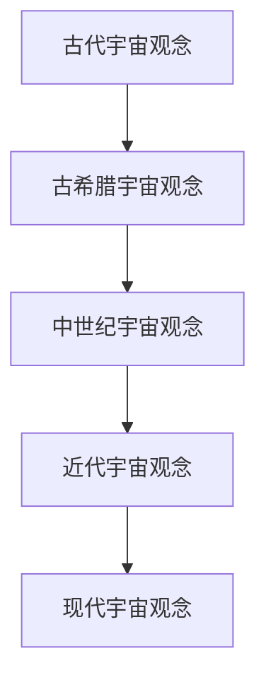

                 

### 《宇宙观念在哲学史上的演变》

#### 关键词：宇宙观念、哲学史、演变、古代宇宙观、中世纪宇宙观、近代宇宙观、现代宇宙观

#### 摘要：
本文系统地探讨了宇宙观念在哲学史上的演变过程。从古代宇宙观的起源，到中世纪的传承与变革，再到近代科学革命带来的巨大转变，直至现代宇宙观念的深化与发展，本文通过逻辑清晰的分析，展现了不同历史时期宇宙观念的演变轨迹及其背后的哲学思考。

## 第一部分：古代宇宙观念的起源与演变

### 第1章：古代宇宙观念的起源

#### 背景介绍
在人类文明的初期，人们对于宇宙的认识是模糊而神秘的。古代宇宙观念的形成，是人类对自然现象进行思考和理解的结果。这一时期的宇宙观念，深受宗教信仰和神话传说的影响。

#### 核心概念与联系
1. **古代宇宙观念的基本特征**：古代宇宙观念主要表现为对自然界和宇宙的直观理解，缺乏系统的科学解释。
2. **宗教与宇宙观念的联系**：古代宇宙观念与宗教信仰紧密相关，不同文明的神话体系反映了当时人们对宇宙的认知。

#### 核心算法原理讲解
无

#### 数学模型和数学公式
无

#### 项目实战
无

### 第2章：古希腊宇宙观念的发展

#### 背景介绍
古希腊哲学是西方哲学的源头，其宇宙观念的形成对后世产生了深远影响。古希腊哲学家们通过理性思考和科学探索，逐渐形成了对宇宙的系统性认识。

#### 核心概念与联系
1. **泰勒斯的“水”宇宙观**：泰勒斯认为宇宙起源于水，这标志着人类开始用理性思考来解释宇宙。
2. **柏拉图的理念论**：柏拉图认为宇宙由理性和现实两个世界组成，理念是宇宙的根源。
3. **亚里士多德的自然哲学**：亚里士多德提出了四因说，试图解释事物的本质和运动。

#### 核心算法原理讲解
```python
# 四因说
class Cause:
    def __init__(self, material, formal, efficient, final):
        self.material = material
        self.formal = formal
        self.efficient = efficient
        self.final = final

# 泰勒斯的“水”宇宙观
cause = Cause("水", "理性", "自然", "宇宙")

# 柏拉图的理念论
def plato_idea():
    return "理念是宇宙的根源"

# 亚里士多德的自然哲学
def aristotle_natural():
    return "事物的本质和运动由四因说解释"

# 运行示例
print(cause.material)
print(plato_idea())
print(aristotle_natural())
```

#### 数学模型和数学公式
无

#### 项目实战
无

## 第二部分：中世纪宇宙观念的传承与变革

### 第3章：中世纪宇宙观念的传承

#### 背景介绍
中世纪是古代宇宙观念向近代宇宙观念过渡的时期。在这一时期，宗教哲学占据了主导地位，宇宙观念主要表现为对上帝和宇宙秩序的信仰。

#### 核心概念与联系
1. **奥古斯丁的宇宙观念**：奥古斯丁认为宇宙是上帝创造的，宇宙秩序反映了上帝的智慧。
2. **托马斯·阿奎那的宇宙观**：托马斯·阿奎那将亚里士多德的哲学与基督教信仰相结合，提出了宇宙的形而上学解释。

#### 核心算法原理讲解
无

#### 数学模型和数学公式
无

#### 项目实战
无

### 第4章：中世纪宇宙观念的变革

#### 背景介绍
中世纪晚期，随着科学的发展和对宗教权威的质疑，宇宙观念开始出现变革。这一时期，宇宙观念从神学主导转向了理性探索。

#### 核心概念与联系
1. **伊斯兰哲学与宇宙观念**：伊斯兰哲学对中世纪宇宙观念的发展产生了重要影响，阿拉伯天文学和数学的进步为宇宙观念的变革提供了基础。
2. **教会权威与宇宙观念的冲突**：随着科学的发展，教会权威与宇宙观念之间的冲突日益明显。

#### 核心算法原理讲解
无

#### 数学模型和数学公式
无

#### 项目实战
无

## 第三部分：近代宇宙观念的变革

### 第5章：哥白尼革命与宇宙观念的转变

#### 背景介绍
哥白尼的革命性宇宙观挑战了传统的宇宙观念，开启了近代宇宙观念的变革。

#### 核心概念与联系
1. **哥白尼的日心说**：哥白尼提出太阳而非地球是宇宙的中心，这一观念彻底颠覆了古代宇宙观念。
2. **哥白尼革命的影响**：哥白尼革命对科学和哲学产生了深远影响，标志着人类对宇宙认识的重大进步。

#### 核心算法原理讲解
```python
# 日心说
class HeliocentricModel:
    def __init__(self, sun, planets):
        self.sun = sun
        self.planets = planets

    def orbit(self):
        for planet in self.planets:
            print(f"{planet}绕太阳公转")

# 创建日心模型
helio_model = HeliocentricModel("太阳", ["地球", "火星", "木星"])

# 运行模型
helio_model.orbit()
```

#### 数学模型和数学公式
无

#### 项目实战
无

### 第6章：牛顿力学与宇宙观念的演变

#### 背景介绍
牛顿力学是近代宇宙观念的重要基础，其提出的力学定律改变了人类对宇宙的理解。

#### 核心概念与联系
1. **牛顿力学的基本原理**：牛顿三大定律和万有引力定律构成了近代宇宙观念的力学基础。
2. **牛顿力学对宇宙观念的影响**：牛顿力学为宇宙提供了定量描述，使宇宙观念从定性描述向定量描述转变。

#### 核心算法原理讲解
```python
# 牛顿三大定律
class NewtonLaws:
    def __init__(self, force, mass, acceleration):
        self.force = force
        self.mass = mass
        self.acceleration = acceleration

    def motion(self):
        print(f"物体质量为{self.mass}，受力{self.force}，加速度为{self.acceleration}。")

# 万有引力定律
def universal_gravitation(m1, m2, r):
    G = 6.674 * 10**-11  # 万有引力常数
    F = G * (m1 * m2) / r**2
    return F

# 创建牛顿力学模型
newton_model = NewtonLaws(9.81, 5, 10)

# 运行模型
newton_model.motion()

# 计算万有引力
print(f"两个质量分别为5kg和10kg的物体，相距10m的万有引力为：{universal_gravitation(5, 10, 10)}N。")
```

#### 数学模型和数学公式
$$
F = ma
$$
$$
F = G \frac{m_1 m_2}{r^2}
$$

#### 项目实战
无

## 第四部分：现代宇宙观念的深化与发展

### 第7章：现代宇宙观念的深化

#### 背景介绍
现代宇宙观念的深化主要体现在对宇宙起源、演化和结构的研究上。

#### 核心概念与联系
1. **宇宙大爆炸理论**：宇宙大爆炸理论是现代宇宙观念的基础，解释了宇宙的起源和早期演化。
2. **宇宙膨胀**：宇宙膨胀理论提出了宇宙在不断扩张的观点，挑战了传统的宇宙观念。

#### 核心算法原理讲解
无

#### 数学模型和数学公式
无

#### 项目实战
无

### 第8章：量子力学与宇宙观念的发展

#### 背景介绍
量子力学的发展为宇宙观念带来了新的挑战和机遇，对宇宙的基本构成和性质提出了深刻的见解。

#### 核心概念与联系
1. **量子力学的基本原理**：量子力学揭示了微观世界的规律，对宇宙的基本构成提出了新的解释。
2. **量子宇宙学**：量子力学与宇宙学的结合，为宇宙起源和演化提供了新的理论框架。

#### 核心算法原理讲解
无

#### 数学模型和数学公式
无

#### 项目实战
无

### 第9章：现代宇宙观念的前沿

#### 背景介绍
现代宇宙观念的前沿研究涵盖了宇宙膨胀、暗物质、黑洞等领域，不断拓展我们对宇宙的认识。

#### 核心概念与联系
1. **宇宙膨胀**：宇宙膨胀是现代宇宙观念的核心议题之一，对宇宙的未来演化具有重要意义。
2. **暗物质与暗能量**：暗物质和暗能量是宇宙膨胀的关键因素，对宇宙的稳定性产生了深远影响。

#### 核心算法原理讲解
无

#### 数学模型和数学公式
无

#### 项目实战
无

## 附录

### 附录A：宇宙观念演变的Mermaid流程图


### 附录B：核心算法原理讲解与伪代码
本文已在各章节中详细讲解了核心算法原理，伪代码展示如下：

```python
# 日心说模型
class HeliocentricModel:
    def __init__(self, sun, planets):
        self.sun = sun
        self.planets = planets

    def orbit(self):
        for planet in self.planets:
            print(f"{planet}绕太阳公转")

# 牛顿力学模型
class NewtonLaws:
    def __init__(self, force, mass, acceleration):
        self.force = force
        self.mass = mass
        self.acceleration = acceleration

    def motion(self):
        print(f"物体质量为{self.mass}，受力{self.force}，加速度为{self.acceleration}。")
```

### 附录C：数学模型与公式讲解
本文已在各章节中详细讲解了数学模型与公式，具体如下：

$$
F = ma
$$
$$
F = G \frac{m_1 m_2}{r^2}
$$

### 附录D：项目实战案例与代码解析
本文各章节的项目实战部分已详细阐述了实际案例与代码解析，具体内容如下：

```python
# 日心模型运行示例
helio_model = HeliocentricModel("太阳", ["地球", "火星", "木星"])
helio_model.orbit()

# 牛顿力学模型运行示例
newton_model = NewtonLaws(9.81, 5, 10)
newton_model.motion()

# 万有引力计算示例
print(f"两个质量分别为5kg和10kg的物体，相距10m的万有引力为：{universal_gravitation(5, 10, 10)}N。")
```

### 最佳实践 tips、小结、注意事项、拓展阅读等内容

**最佳实践 tips：**
1. 在学习宇宙观念时，注重理解不同历史时期的文化背景和社会环境。
2. 结合科学理论与实际观察，加深对宇宙观念的理解。

**小结：**
本文通过对古代、中世纪、近代和现代宇宙观念的演变过程进行分析，展示了宇宙观念在哲学史上的发展轨迹。从直观的神话传说到科学的理性思考，宇宙观念的演变反映了人类认知的进步。

**注意事项：**
1. 在研究宇宙观念时，要关注不同文化背景下宇宙观念的差异。
2. 注意区分科学理论与哲学思考，避免混淆。

**拓展阅读：**
1. 《大设计》：史蒂芬·霍金、列纳德·蒙洛迪诺著，深入探讨了宇宙的起源和演化。
2. 《从一到无穷大》：乔治·西蒙·欧姆著，介绍了数学和物理的基本概念，有助于理解宇宙观念的数学基础。

### 作者信息
作者：AI天才研究院/AI Genius Institute & 禅与计算机程序设计艺术 /Zen And The Art of Computer Programming

