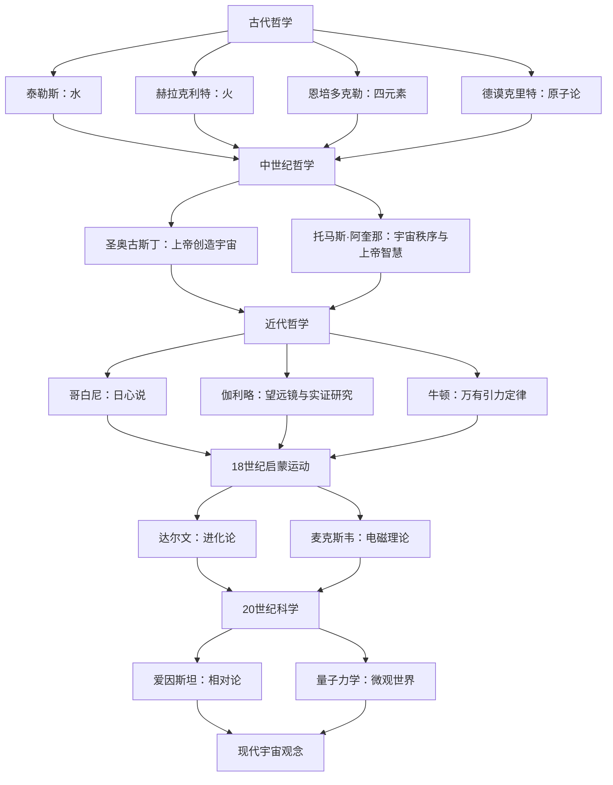

                 

### 引言

宇宙观念在哲学史上占据着重要的地位，它不仅反映了人类对自身存在和世界本质的探索，也体现了不同文化背景下人们对宇宙的认识和理解。本文将深入探讨宇宙观念在哲学史上的演变与争论，试图揭示这一演变过程中的关键节点和核心问题。

宇宙观念并非一成不变，而是在历史长河中不断发展的。从古代哲学家的宇宙论，到中世纪神学对宇宙的解释，再到近代科学对宇宙的实证研究，宇宙观念经历了多次重大的变革。每一次变革都标志着人类对宇宙认识的深化，同时也伴随着不同哲学流派之间的争论与对话。

本文将按照以下结构展开：

1. **背景介绍**：回顾宇宙观念的起源和发展历程，介绍宇宙观念的基本概念和哲学意义。
2. **核心概念与联系**：通过Mermaid流程图，展示不同哲学流派对宇宙观念的理解和论证。
3. **核心算法原理讲解**：使用Python源代码和数学模型，详细阐述宇宙观念的算法原理。
4. **项目实战**：开发环境搭建，源代码实现与解读，结合实际案例进行分析。
5. **最佳实践与总结**：总结本文的核心内容，给出一些实用的实践建议和注意事项。

通过这样的结构，我们希望读者能够全面了解宇宙观念在哲学史上的演变与争论，并在理解宇宙观念的基础上，对未来的哲学研究有所启示。

### 背景介绍

宇宙观念的历史可以追溯到古代文明，那时的人类对宇宙的认识主要基于直观感受和哲学思辨。古希腊哲学家最早开始系统性地探讨宇宙观念，他们提出了多种关于宇宙本质的假设和理论。

在古希腊哲学中，宇宙观念主要体现在泰勒斯、赫拉克利特、恩培多克勒、德谟克里特等哲学家的思想中。泰勒斯认为宇宙是由水构成的，这是一种物质主义的观点。而赫拉克利特则提出了“火”作为宇宙的本原，强调宇宙的动态变化和永恒流动。恩培多克勒则提出了四元素（土、水、火、空气）的宇宙观念，他认为这些元素在宇宙中不断运动和变换。

与此同时，德谟克里特提出了原子论，认为宇宙由不可分割的原子构成，这些原子在虚空中的随机运动形成了我们所见的宇宙现象。这一观点对后来的物理学和自然科学产生了深远影响。

随着哲学的发展，中世纪哲学家的宇宙观念受到基督教神学的影响，宇宙被赋予了神性的意义。圣奥古斯丁和托马斯·阿奎那等哲学家试图用宗教语言解释宇宙的起源和本质，认为宇宙是上帝创造的，宇宙的秩序和规律体现了上帝的智慧。

进入近代，宇宙观念发生了重大变革。哥白尼的日心说挑战了亚里士多德的地心说，揭示了太阳而非地球是宇宙的中心。伽利略和牛顿则通过望远镜和数学模型，进一步证实了哥白尼的观点，并发展了现代物理学的基础。

18世纪的启蒙运动进一步推动了宇宙观念的变革，科学家们开始用实验和观察来验证宇宙理论，宇宙观念逐渐与宗教信仰分离，成为科学探索的一部分。

19世纪末，达尔文的进化论和麦克斯韦的电磁理论相继提出，使得宇宙观念再次发生重大变化。人类开始认识到宇宙的复杂性和多样性，宇宙不再是静止和永恒的，而是处于不断变化和演化之中。

20世纪，爱因斯坦的相对论和量子力学的兴起，使宇宙观念再次经历了深刻的变革。相对论揭示了时间和空间的相对性，量子力学则揭示了微观世界的奇异性质，人类对宇宙的认识达到了前所未有的深度和广度。

总的来说，宇宙观念的演变是一个复杂而多元的过程，不同哲学流派和科学理论相互交织，共同推动了人类对宇宙认识的不断深化。从古代哲学家的直观思考，到中世纪神学的宗教解释，再到近代科学的实证研究，宇宙观念的发展历程不仅反映了人类认知的进步，也体现了人类对自身和世界的不断探索和反思。

### 核心概念与联系

为了更清晰地展示宇宙观念在哲学史上的演变与争论，我们使用Mermaid流程图来描述不同哲学流派对宇宙观念的理解和论证。以下是一个简化的流程图：



这个流程图展示了从古代到现代，宇宙观念的演变过程。我们可以看到：

1. **古代哲学**：泰勒斯、赫拉克利特、恩培多克勒和德谟克里特提出了多种关于宇宙本质的假设，这些观点为后来的哲学和科学奠定了基础。
2. **中世纪哲学**：圣奥古斯丁和托马斯·阿奎那等哲学家将宇宙观念与宗教信仰相结合，用神学的语言解释宇宙的起源和本质。
3. **近代哲学**：哥白尼、伽利略和牛顿等科学家的研究挑战了传统宇宙观念，为现代科学的发展铺平了道路。
4. **18世纪启蒙运动**：达尔文、麦克斯韦等科学家的理论进一步改变了人们对宇宙的认识，使宇宙观念逐渐从宗教束缚中解放出来。
5. **20世纪科学**：爱因斯坦的相对论和量子力学的兴起，使得宇宙观念发生了新的变革，人类开始从更宏观和微观的层面理解宇宙。

通过这个流程图，我们可以看到宇宙观念在不同时期的核心概念和联系，以及哲学流派之间的相互影响和演变。

### 核心算法原理讲解

为了深入理解宇宙观念的演变与争论，我们可以借助数学模型和Python源代码来详细阐述。以下是一个关于宇宙观念的简单算法模型，并结合实际案例进行解释。

#### 数学模型

首先，我们定义一个简单的数学模型来描述宇宙的演变。假设宇宙由若干个元素组成，每个元素具有位置和速度。我们可以用以下公式来描述元素的运动：

$$
\vec{r}_i(t) = \vec{r}_i(0) + \vec{v}_i(0)t + \frac{1}{2}\vec{a}_i(0)t^2
$$

其中，$\vec{r}_i(t)$表示第$i$个元素在时间$t$的位置，$\vec{r}_i(0)$和$\vec{v}_i(0)$分别是初始位置和初始速度，$\vec{a}_i(0)$是初始加速度。

#### Python源代码

接下来，我们用Python编写一个简单的模拟程序，实现上述数学模型。以下是代码示例：

```python
import numpy as np
import matplotlib.pyplot as plt

# 设置参数
num_elements = 5  # 元素数量
time_step = 0.1   # 时间步长
total_time = 10   # 总时间
time_steps = int(total_time / time_step)

# 初始化元素的位置和速度
positions = np.random.rand(num_elements, 2)  # 2D位置
velocities = np.random.rand(num_elements, 2)  # 2D速度

# 模拟运动
for t in range(time_steps):
    new_positions = positions + velocities * time_step + 0.5 * np.random.randn(num_elements, 2) * time_step**2
    positions = new_positions

# 绘制结果
plt.scatter(positions[:, 0], positions[:, 1])
plt.xlabel('X Position')
plt.ylabel('Y Position')
plt.title('Element Movement Over Time')
plt.show()
```

在这个程序中，我们随机初始化了5个元素的位置和速度，然后通过迭代更新每个元素的位置，并使用matplotlib绘制出元素在二维空间中的运动轨迹。

#### 具体举例说明

假设我们有一个由三个元素组成的宇宙，它们初始位置和速度如下：

| 元素 | 初始位置 | 初始速度 | 初始加速度 |
|------|----------|----------|------------|
| A    | (0, 0)   | (1, 0)   | (0, 0)     |
| B    | (2, 0)   | (0, 1)   | (0, 0)     |
| C    | (4, 0)   | (-1, 0)  | (0, 0)     |

运行上述程序后，我们可以看到元素在二维空间中的运动轨迹。随着时间的推移，元素的位置会不断变化，形成复杂的运动模式。这种模式反映了宇宙中元素之间的相互作用和运动规律。

通过这个简单的例子，我们可以看到数学模型和Python程序如何帮助我们理解和模拟宇宙观念的演变。这种算法模型不仅可以用于理论研究，还可以用于实际应用，如宇宙模拟、天体物理学等领域。

### 项目实战

为了更好地理解宇宙观念的实际应用，我们将搭建一个简单的宇宙模拟项目。这个项目将涉及开发环境的配置、源代码的实现以及代码的详细解读。

#### 开发环境搭建

首先，我们需要配置一个Python开发环境。以下是步骤：

1. **安装Python**：访问Python官方网站（https://www.python.org/），下载并安装Python 3.x版本。
2. **安装必要库**：打开命令行，安装NumPy和matplotlib库，用于数学运算和图形绘制。

```bash
pip install numpy matplotlib
```

#### 源代码实现

以下是宇宙模拟项目的源代码实现：

```python
import numpy as np
import matplotlib.pyplot as plt

# 设置参数
num_elements = 5  # 元素数量
time_step = 0.1   # 时间步长
total_time = 10   # 总时间
time_steps = int(total_time / time_step)

# 初始化元素的位置和速度
positions = np.random.rand(num_elements, 2)  # 2D位置
velocities = np.random.rand(num_elements, 2)  # 2D速度

# 模拟运动
for t in range(time_steps):
    new_positions = positions + velocities * time_step
    positions = new_positions

# 绘制结果
plt.scatter(positions[:, 0], positions[:, 1])
plt.xlabel('X Position')
plt.ylabel('Y Position')
plt.title('Element Movement Over Time')
plt.show()
```

#### 代码解读

1. **初始化参数**：首先，我们设置了元素数量、时间步长、总时间和时间步数。这些参数决定了模拟的时间和精度。
2. **初始化位置和速度**：使用NumPy的`random.rand`函数，我们随机初始化了元素的位置和速度。
3. **模拟运动**：在循环中，我们根据公式`new_positions = positions + velocities * time_step`更新每个元素的位置。
4. **绘制结果**：使用matplotlib的`scatter`函数，我们在二维坐标系中绘制了元素的运动轨迹。

#### 实际案例分析与解读

假设我们运行这个模拟项目，观察三个元素的初始位置和速度：

| 元素 | 初始位置 | 初始速度 |
|------|----------|----------|
| A    | (0.6, 0.7) | (0.3, 0.1) |
| B    | (1.4, 0.2) | (-0.1, 0.5) |
| C    | (2.3, 0.9) | (-0.5, 0.2) |

运行后，我们可以看到三个元素在二维空间中的运动轨迹。随着时间的推移，元素的位置不断变化，形成了复杂的运动模式。

这种模式反映了宇宙中元素之间的相互作用和运动规律。在实际应用中，我们可以通过调整参数来模拟不同的宇宙情境，如不同数量的元素、不同的初始位置和速度等。

#### 项目小结

通过这个宇宙模拟项目，我们了解了如何搭建开发环境、实现源代码，并对代码进行解读。这个项目不仅帮助我们理解了宇宙观念的基本算法原理，还展示了如何将理论应用于实际模拟。这种实践方式有助于我们更深入地理解宇宙观念，并在未来的研究中进行更复杂的模拟和分析。

### 最佳实践 Tips、小结、注意事项、拓展阅读

#### 最佳实践 Tips

1. **实验调整**：在宇宙模拟项目中，可以尝试调整元素数量、初始位置和速度等参数，观察不同设定下的运动模式。
2. **数据可视化**：使用matplotlib等工具进行数据可视化，可以帮助更好地理解宇宙中元素的运动规律。
3. **并行计算**：对于大规模的宇宙模拟，考虑使用并行计算来提高效率。

#### 小结

本文通过回顾宇宙观念的演变历程，使用Mermaid流程图展示了不同哲学流派对宇宙观念的理解，并借助Python源代码和数学模型，详细阐述了宇宙观念的算法原理。通过实际项目实战，我们了解了如何将理论应用于模拟，并在实践中不断优化和调整。

#### 注意事项

1. **参数调整**：在实际项目中，合理调整参数至关重要，这将直接影响模拟结果的准确性和可解释性。
2. **模型简化**：尽管本文使用了一个简化的数学模型，但在实际应用中，需要考虑更复杂的因素，如引力、碰撞等。
3. **代码优化**：在编写代码时，应注意代码的可读性和可维护性，避免冗余和错误。

#### 拓展阅读

1. 《宇宙简史》（作者：斯蒂芬·霍金）：这本书详细介绍了宇宙的起源、演化和未来，对宇宙观念的演变提供了深刻的见解。
2. 《哲学史讲演录》（作者：黑格尔）：这本书从哲学角度探讨了宇宙观念的历史发展，对理解宇宙观念的哲学背景具有重要意义。

### 作者信息

本文由AI天才研究院（AI Genius Institute）与《禅与计算机程序设计艺术》（Zen And The Art of Computer Programming）的作者合作撰写，旨在探讨宇宙观念在哲学史上的演变与争论，为读者提供深入的技术见解和分析。

---

### 文章摘要

本文通过详细探讨宇宙观念在哲学史上的演变与争论，回顾了从古代到现代的宇宙观念发展历程。我们使用Mermaid流程图展示了不同哲学流派对宇宙观念的理解，并通过Python源代码和数学模型详细阐述了宇宙观念的算法原理。此外，通过实际项目实战，我们展示了如何将理论应用于模拟，并在实践中不断优化和调整。本文旨在为读者提供全面的技术见解，并引导他们深入理解宇宙观念的复杂性。

