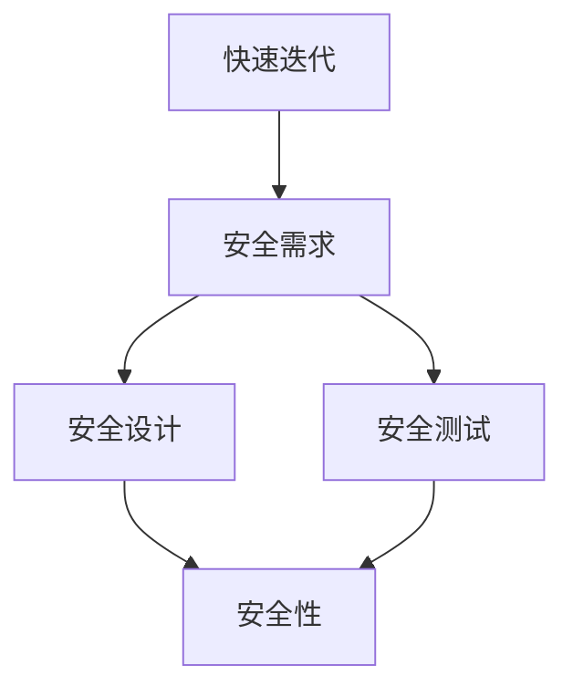

                 

### 安全性考虑：在快速迭代中不可忽视的环节

在现代软件开发环境中，快速迭代已经成为提高开发效率、满足市场需求的必备手段。然而，随着迭代的加速，安全性问题往往被忽视，导致应用在发布后频繁出现漏洞，甚至遭受严重的安全攻击。本文将深入探讨在快速迭代过程中，如何有效考虑安全性，确保软件在快速变化的环境中保持安全。

## 关键词

- 快速迭代
- 安全性
- 安全风险
- 安全设计
- 安全测试

## 摘要

本文首先介绍了快速迭代的概念及其在软件开发中的应用。接着，分析了快速迭代过程中的安全性挑战，包括资源限制、时间压力和安全知识不足等问题。随后，本文提出了针对这些挑战的安全性和安全设计原则，并详细讲解了如何进行安全需求分析和安全架构设计。最后，本文介绍了安全测试的方法和工具，并分享了最佳实践和注意事项。

## 引言

快速迭代开发是一种以用户需求为导向，通过快速反馈和迭代改进来开发软件的方法。这种方法能够快速响应市场需求，提高开发效率，但同时也给安全性带来了挑战。在快速迭代的过程中，开发者往往面临着时间紧迫、资源有限等问题，这使得安全性的实现和保障变得尤为困难。

### 快速迭代的概念

快速迭代（Agile Development）是一种以人为核心、迭代和持续改进的软件开发方法。其核心理念包括：

- **用户反馈**：通过用户反馈不断调整开发方向，确保产品满足用户需求。
- **迭代开发**：将开发过程分解为多个短期迭代，每个迭代产出可用的软件部分。
- **持续交付**：通过自动化测试和部署，实现持续集成和持续交付，提高交付速度。

### 快速迭代的应用

快速迭代被广泛应用于各种软件开发场景，特别是互联网应用和移动应用的开发。以下是一些快速迭代的应用实例：

- **互联网应用**：电商平台、社交媒体、在线教育等，这些应用需要快速响应市场变化，以满足用户需求。
- **移动应用**：移动应用的开发通常涉及多个平台，快速迭代能够确保在不同平台上保持一致性和适应性。
- **敏捷开发**：敏捷开发（Agile Development）是一种典型的快速迭代开发方法，它强调团队协作、灵活调整和持续改进。

### 快速迭代的优点

快速迭代的主要优点包括：

- **快速响应**：能够快速响应市场需求，减少开发周期。
- **持续改进**：通过每次迭代的反馈，不断优化产品。
- **用户参与**：用户可以更早地参与到产品开发过程中，提供反馈和需求。
- **减少浪费**：通过短周期的开发，减少了不必要的开发工作和资源浪费。

### 快速迭代的缺点

尽管快速迭代有诸多优点，但也存在一些缺点：

- **质量控制**：快速迭代可能导致质量控制不足，增加安全漏洞的风险。
- **团队协作**：快速迭代要求团队成员高度协作，否则可能会导致沟通不畅和协调困难。
- **技术债务**：为了快速迭代，可能会牺牲一些技术债务，如代码优化、架构重构等。

### 安全性在快速迭代中的重要性

在快速迭代的过程中，安全性问题是不可忽视的。安全性不仅关系到用户数据的安全，也影响到软件的稳定性和可靠性。以下是一些安全性在快速迭代中的重要性：

- **用户信任**：如果软件存在安全漏洞，用户可能会失去对软件的信任，影响用户留存率。
- **商业风险**：安全漏洞可能导致数据泄露、业务中断，带来巨大的商业损失。
- **法律合规**：某些国家和地区对数据安全有严格的法律要求，不遵守可能导致法律纠纷和罚款。

### 快速迭代与安全性的矛盾

快速迭代和安全性之间存在一定的矛盾。快速迭代要求快速交付和频繁更新，而安全性则需要时间和资源来确保。以下是一些快速迭代与安全性的矛盾：

- **时间压力**：快速迭代要求开发团队在较短的时间内完成大量工作，这往往导致安全性测试和审查的时间被压缩。
- **资源限制**：快速迭代可能意味着在资源有限的情况下工作，这使得安全性工作难以得到充分的投入。
- **知识不足**：快速迭代的团队成员可能缺乏足够的安全知识，导致安全性工作难以有效实施。

### 快速迭代中的安全风险

在快速迭代的开发过程中，存在多种安全风险，这些风险可能导致软件在发布后出现漏洞和问题。以下是一些常见的快速迭代中的安全风险：

- **未充分测试**：由于时间紧迫，安全性测试可能无法得到充分执行，导致潜在的安全漏洞未被检测出来。
- **快速修复**：快速迭代可能导致开发团队在未经充分测试的情况下快速修复漏洞，这可能导致新的安全漏洞的出现。
- **架构不安全**：快速迭代可能导致软件架构的不稳定，使得安全性工作难以实施。
- **依赖第三方组件**：快速迭代可能需要依赖第三方组件，而这些组件可能存在安全漏洞，导致整个软件的安全性受到影响。

### 安全性原则与实践

在快速迭代的开发过程中，为了确保软件的安全性，需要遵循一些安全性原则和实践。以下是一些关键的安全性和安全设计原则：

- **安全设计原则**：在软件设计的早期阶段就考虑安全性，确保安全性成为软件架构的一部分。
- **安全编码实践**：在编写代码时遵循安全编码规范，避免常见的代码漏洞。
- **安全测试**：进行充分的测试，包括单元测试、集成测试和系统测试，确保软件在发布前没有安全漏洞。
- **安全审计**：定期进行安全审计，识别和修复潜在的安全漏洞。
- **安全培训**：对开发团队进行安全培训，提高团队成员的安全意识。

### 安全需求分析

安全需求分析是确保软件安全性的一项重要工作。以下是如何进行安全需求分析的步骤：

1. **需求收集**：与用户、项目经理和其他利益相关者沟通，收集安全需求。
2. **需求分类**：将收集到的安全需求进行分类，包括身份验证、访问控制、数据保护等。
3. **需求分析**：分析每个安全需求的细节，确定其重要性和优先级。
4. **需求文档化**：将分析结果整理成文档，作为后续开发和安全测试的依据。

### 安全架构设计

安全架构设计是确保软件安全性的一项关键工作。以下是如何进行安全架构设计的步骤：

1. **安全需求分析**：首先进行安全需求分析，明确安全需求。
2. **架构设计**：根据安全需求进行软件架构设计，确保安全性成为架构的一部分。
3. **安全框架选择**：选择适合的安全框架，如OWASP、SANS等。
4. **安全组件集成**：将安全组件集成到软件架构中，确保其正常运行。

### 安全测试

安全测试是确保软件安全性的重要环节。以下是一些安全测试的方法和工具：

1. **单元测试**：对单个组件进行测试，确保其安全功能正确实现。
2. **集成测试**：对组件之间的交互进行测试，确保整体安全性。
3. **系统测试**：对整个系统进行测试，确保其安全性。
4. **自动化测试**：使用自动化工具进行测试，提高测试效率和覆盖范围。
5. **渗透测试**：模拟攻击者进行测试，识别潜在的安全漏洞。

### 最佳实践

以下是一些在快速迭代中确保安全性的最佳实践：

- **定期安全培训**：对开发团队进行定期安全培训，提高安全意识。
- **安全编码规范**：制定并遵循安全编码规范，减少代码漏洞。
- **自动化测试**：实施自动化测试，确保每次迭代都能检测到潜在的安全漏洞。
- **安全审计**：定期进行安全审计，确保软件符合安全要求。
- **快速响应**：建立快速响应机制，确保在发现安全漏洞时能够及时修复。

### 小结

在快速迭代的过程中，安全性问题不容忽视。通过遵循安全性原则和实践，进行安全需求分析和安全架构设计，以及实施安全测试，可以有效确保软件的安全性。开发团队应该将安全性作为开发过程中的一个重要环节，确保每次迭代都能交付安全可靠的软件。

### 注意事项

- 在快速迭代过程中，安全性工作需要持续进行，不能仅在项目末期进行。
- 快速迭代可能导致资源限制，但安全性工作仍然需要得到充分的资源保障。
- 安全性工作和开发工作应该紧密配合，确保安全性需求能够及时得到满足。

### 拓展阅读

- **《敏捷软件开发：原则、实践与模式》（Agile Software Development: Principles, Patterns, and Practices）**：由Michael Feathers撰写，介绍了敏捷开发的方法和实践，包括安全性方面。
- **《软件安全设计》（Secure Software Development）**：由Mark Dowd、John McDonald和Wesley McGrew撰写，详细介绍了软件安全设计的方法和原则。
- **《Web应用安全测试指南》（The Web Application Security Test Guide）**：由Brett Stone-Gross、Julien Viant和Chris Wysopal撰写，提供了全面的Web应用安全测试指南。

## 安全性在快速迭代中的重要性

在现代软件开发环境中，快速迭代已经成为提高开发效率、满足市场需求的必备手段。然而，随着迭代的加速，安全性问题往往被忽视，导致应用在发布后频繁出现漏洞，甚至遭受严重的安全攻击。本文将深入探讨在快速迭代过程中，如何有效考虑安全性，确保软件在快速变化的环境中保持安全。

### 快速迭代的概念

快速迭代（Agile Development）是一种以人为核心、迭代和持续改进的软件开发方法。其核心理念包括用户反馈、迭代开发、持续交付等。通过将开发过程分解为多个短期迭代，每个迭代产出可用的软件部分，开发团队能够快速响应市场需求，提高交付速度和用户满意度。

### 快速迭代与安全性的矛盾

快速迭代和安全性之间存在一定的矛盾。快速迭代要求快速交付和频繁更新，而安全性则需要时间和资源来确保。以下是一些快速迭代与安全性的矛盾：

1. **时间压力**：快速迭代要求开发团队在较短的时间内完成大量工作，这往往导致安全性测试和审查的时间被压缩。
2. **资源限制**：快速迭代可能意味着在资源有限的情况下工作，这使得安全性工作难以得到充分的投入。
3. **知识不足**：快速迭代的团队成员可能缺乏足够的安全知识，导致安全性工作难以有效实施。

### 快速迭代中的安全风险

在快速迭代的开发过程中，存在多种安全风险，这些风险可能导致软件在发布后出现漏洞和问题。以下是一些常见的快速迭代中的安全风险：

1. **未充分测试**：由于时间紧迫，安全性测试可能无法得到充分执行，导致潜在的安全漏洞未被检测出来。
2. **快速修复**：快速迭代可能导致开发团队在未经充分测试的情况下快速修复漏洞，这可能导致新的安全漏洞的出现。
3. **架构不安全**：快速迭代可能导致软件架构的不稳定，使得安全性工作难以实施。
4. **依赖第三方组件**：快速迭代可能需要依赖第三方组件，而这些组件可能存在安全漏洞，导致整个软件的安全性受到影响。

### 安全性原则与实践

在快速迭代的开发过程中，为了确保软件的安全性，需要遵循一些安全性原则和实践。以下是一些关键的安全性和安全设计原则：

1. **安全设计原则**：在软件设计的早期阶段就考虑安全性，确保安全性成为软件架构的一部分。
2. **安全编码实践**：在编写代码时遵循安全编码规范，避免常见的代码漏洞。
3. **安全测试**：进行充分的测试，包括单元测试、集成测试和系统测试，确保软件在发布前没有安全漏洞。
4. **安全审计**：定期进行安全审计，识别和修复潜在的安全漏洞。
5. **安全培训**：对开发团队进行安全培训，提高团队成员的安全意识。

### 安全需求分析

安全需求分析是确保软件安全性的一项重要工作。以下是如何进行安全需求分析的步骤：

1. **需求收集**：与用户、项目经理和其他利益相关者沟通，收集安全需求。
2. **需求分类**：将收集到的安全需求进行分类，包括身份验证、访问控制、数据保护等。
3. **需求分析**：分析每个安全需求的细节，确定其重要性和优先级。
4. **需求文档化**：将分析结果整理成文档，作为后续开发和安全测试的依据。

### 安全架构设计

安全架构设计是确保软件安全性的一项关键工作。以下是如何进行安全架构设计的步骤：

1. **安全需求分析**：首先进行安全需求分析，明确安全需求。
2. **架构设计**：根据安全需求进行软件架构设计，确保安全性成为架构的一部分。
3. **安全框架选择**：选择适合的安全框架，如OWASP、SANS等。
4. **安全组件集成**：将安全组件集成到软件架构中，确保其正常运行。

### 安全测试

安全测试是确保软件安全性的重要环节。以下是一些安全测试的方法和工具：

1. **单元测试**：对单个组件进行测试，确保其安全功能正确实现。
2. **集成测试**：对组件之间的交互进行测试，确保整体安全性。
3. **系统测试**：对整个系统进行测试，确保其安全性。
4. **自动化测试**：使用自动化工具进行测试，提高测试效率和覆盖范围。
5. **渗透测试**：模拟攻击者进行测试，识别潜在的安全漏洞。

### 最佳实践

以下是一些在快速迭代中确保安全性的最佳实践：

1. **定期安全培训**：对开发团队进行定期安全培训，提高安全意识。
2. **安全编码规范**：制定并遵循安全编码规范，减少代码漏洞。
3. **自动化测试**：实施自动化测试，确保每次迭代都能检测到潜在的安全漏洞。
4. **安全审计**：定期进行安全审计，确保软件符合安全要求。
5. **快速响应**：建立快速响应机制，确保在发现安全漏洞时能够及时修复。

### 小结

在快速迭代的过程中，安全性问题不容忽视。通过遵循安全性原则和实践，进行安全需求分析和安全架构设计，以及实施安全测试，可以有效确保软件的安全性。开发团队应该将安全性作为开发过程中的一个重要环节，确保每次迭代都能交付安全可靠的软件。

### 注意事项

1. 在快速迭代过程中，安全性工作需要持续进行，不能仅在项目末期进行。
2. 快速迭代可能导致资源限制，但安全性工作仍然需要得到充分的资源保障。
3. 安全性工作和开发工作应该紧密配合，确保安全性需求能够及时得到满足。

### 拓展阅读

1. **《敏捷软件开发：原则、实践与模式》（Agile Software Development: Principles, Patterns, and Practices）**：由Michael Feathers撰写，介绍了敏捷开发的方法和实践，包括安全性方面。
2. **《软件安全设计》（Secure Software Development）**：由Mark Dowd、John McDonald和Wesley McGrew撰写，详细介绍了软件安全设计的方法和原则。
3. **《Web应用安全测试指南》（The Web Application Security Test Guide）**：由Brett Stone-Gross、Julien Viant和Chris Wysopal撰写，提供了全面的Web应用安全测试指南。

## 背景介绍

在快速迭代开发的环境中，安全性问题往往被忽视，这是由于快速迭代本身的特性所决定的。快速迭代强调的是快速响应市场需求、提高开发效率，而安全性工作通常需要更多的时间和资源。因此，在快速迭代的过程中，开发团队往往面临着时间紧迫、资源有限和安全知识不足等挑战。这些问题不仅影响了软件的安全性，还可能导致严重的商业和法律后果。

首先，时间压力是快速迭代中最大的挑战之一。快速迭代要求开发团队能够在短时间内完成多个迭代，这意味着每次迭代的时间非常有限。在这种情况下，开发团队往往需要将大量的精力集中在功能实现上，而安全性测试和审查往往被压缩或忽略。这种做法虽然能够在短期内提高开发进度，但却可能导致潜在的安全漏洞未被及时发现和修复。

其次，资源限制也是快速迭代中的一个常见问题。在快速迭代的过程中，团队可能需要同时处理多个功能模块的迭代，这要求团队拥有充足的人力和技术资源。然而，实际情况往往是资源有限，特别是在中小型团队中。这种资源限制使得团队无法将足够的时间和资源投入到安全性工作中，从而影响了软件的安全性。

最后，安全知识不足也是一个重要问题。快速迭代要求开发团队能够快速学习和适应新的技术和需求，但在快速学习的环境中，团队成员可能没有足够的时间去深入了解安全性相关的知识。这导致了安全性工作的实施难度增加，甚至可能因为缺乏安全知识而无法有效地进行安全性工作。

在快速迭代的开发环境中，安全性问题可能带来的后果包括：

1. **数据泄露**：安全性不足可能导致用户数据泄露，这会对用户隐私造成严重侵害，并可能导致法律纠纷和罚款。
2. **业务中断**：安全漏洞可能导致系统崩溃或业务中断，这会对公司的业务运营造成严重影响。
3. **品牌声誉受损**：频繁的安全问题可能导致用户对公司的信任度下降，影响品牌声誉。
4. **经济损失**：修复安全漏洞和应对安全事件通常需要付出巨大的经济成本。

因此，在快速迭代的过程中，确保软件的安全性至关重要。开发团队需要认识到安全性问题的重要性，并采取有效的措施来应对这些挑战。这不仅有助于保护用户数据和公司利益，还能提高软件的质量和可靠性，从而增强用户信任和品牌价值。

## 核心概念与联系

在探讨快速迭代中的安全性时，我们需要理解几个核心概念，并探讨它们之间的关系。以下是几个关键概念及其相互联系：

1. **快速迭代**：快速迭代是一种软件开发方法，通过频繁的迭代和持续交付来快速响应市场需求。它强调快速交付、用户反馈和持续改进。
2. **安全性**：安全性是指确保软件系统和数据不受未经授权的访问、使用、泄露、破坏或修改的能力。它包括多个方面，如身份验证、访问控制、数据保护和漏洞管理。
3. **安全需求**：安全需求是指软件系统在安全方面必须满足的要求。这些需求通常包括保护用户数据、确保系统稳定性和防止恶意攻击等。
4. **安全设计**：安全设计是指在软件架构和设计中考虑安全性，确保系统在设计和实现阶段就具备安全特性。
5. **安全测试**：安全测试是指通过各种方法和技术检测软件系统中可能存在的安全漏洞和缺陷，以确保系统在发布前达到预期的安全标准。

### 关系架构 Mermaid 流�程图

为了更好地理解这些概念之间的联系，我们可以使用Mermaid流程图来表示它们之间的关系：



在这个流程图中：

- **快速迭代（A）** 是整个流程的起点，它驱动了安全需求（B）的提出。
- **安全需求（B）** 是根据用户和业务需求确定的，它们指导安全设计（C）和安全测试（D）。
- **安全设计（C）** 是在软件架构和实现阶段进行的，它旨在确保系统在设计上具备安全性。
- **安全测试（D）** 是在软件开发和发布前进行的，旨在发现和修复潜在的安全漏洞。
- **安全性（E）** 是最终目标，它表示软件系统在运行时达到的安全水平。

通过这个流程图，我们可以清晰地看到快速迭代、安全需求、安全设计、安全测试和安全性之间的紧密联系。快速迭代驱动安全需求的提出，安全需求又指导安全设计和安全测试，最终实现安全性目标。

### Mermaid 流程图解释

- **节点（Node）**：每个节点代表一个关键概念，如快速迭代、安全需求、安全设计、安全测试和安全性。
- **连接线（Edge）**：连接线表示不同概念之间的依赖关系。例如，快速迭代产生安全需求，安全需求指导安全设计和安全测试。
- **方向（Direction）**：连接线的箭头表示信息的流动方向。例如，安全需求是安全设计和安全测试的输入。

通过这个Mermaid流程图，我们可以更好地理解在快速迭代开发中，如何通过安全需求、安全设计和安全测试来实现安全性目标。这有助于开发团队在迭代过程中始终保持对安全性的关注，从而确保软件的安全性和可靠性。

## 核心算法原理讲解

在快速迭代的开发过程中，确保软件的安全性需要依赖一系列核心算法和设计原则。以下将介绍几个关键的核心算法原理，并结合Python代码进行详细阐述。

### 常见的安全算法

1. **哈希算法**：哈希算法用于数据的加密和验证。常见的哈希算法包括MD5、SHA-256等。哈希算法的核心原理是将输入数据转换为固定长度的字符串，确保数据无法被逆向推算。

   ```python
   import hashlib
   
   def hash_password(password):
       hashed = hashlib.sha256(password.encode('utf-8'))
       return hashed.hexdigest()
   
   print(hash_password("password123"))
   ```

   在这个例子中，`hash_password` 函数使用SHA-256算法对输入的密码进行哈希处理，返回哈希值。

2. **对称加密算法**：对称加密算法如AES（Advanced Encryption Standard）用于数据的加密和解密。它们使用相同的密钥进行加密和解密。

   ```python
   from Crypto.Cipher import AES
   from Crypto.Util.Padding import pad, unpad
   from base64 import b64encode, b64decode
   
   def encrypt_data(data, key):
       cipher = AES.new(key, AES.MODE_CBC)
       ct_bytes = cipher.encrypt(pad(data.encode('utf-8'), AES.block_size))
       iv = b64encode(cipher.iv).decode('utf-8')
       ct = b64encode(ct_bytes).decode('utf-8')
       return iv, ct
   
   def decrypt_data(iv, ct, key):
       iv = b64decode(iv)
       ct = b64decode(ct)
       cipher = AES.new(key, AES.MODE_CBC, iv)
       pt = unpad(cipher.decrypt(ct), AES.block_size)
       return pt.decode('utf-8')
   
   key = b'your-32-byte-key-here'
   data = "This is sensitive data that needs to be encrypted."
   iv, ct = encrypt_data(data, key)
   print(f"IV: {iv}")
   print(f"Ciphertext: {ct}")
   
   decrypted_data = decrypt_data(iv, ct, key)
   print(f"Decrypted data: {decrypted_data}")
   ```

   在这个例子中，`encrypt_data` 和 `decrypt_data` 函数分别用于数据的加密和解密。加密过程使用了AES算法和CBC模式，确保数据在传输和存储过程中保持安全。

3. **非对称加密算法**：非对称加密算法如RSA（Rivest-Shamir-Adleman）使用一对密钥（公钥和私钥）进行加密和解密。公钥用于加密，私钥用于解密。

   ```python
   from Crypto.PublicKey import RSA
   from Crypto.Cipher import PKCS1_OAEP
   
   def generate_keys():
       key = RSA.generate(2048)
       private_key = key.export_key()
       public_key = key.publickey().export_key()
       return private_key, public_key
   
   def encrypt_with_public_key(data, public_key):
       rsa_public_key = RSA.import_key(public_key)
       cipher = PKCS1_OAEP.new(rsa_public_key)
       encrypted_data = cipher.encrypt(data.encode('utf-8'))
       return encrypted_data
   
   def decrypt_with_private_key(encrypted_data, private_key):
       rsa_private_key = RSA.import_key(private_key)
       cipher = PKCS1_OAEP.new(rsa_private_key)
       decrypted_data = cipher.decrypt(encrypted_data)
       return decrypted_data.decode('utf-8')
   
   private_key, public_key = generate_keys()
   data = "This is sensitive data that needs to be encrypted."
   encrypted_data = encrypt_with_public_key(data, public_key)
   print(f"Encrypted data: {encrypted_data}")
   
   decrypted_data = decrypt_with_private_key(encrypted_data, private_key)
   print(f"Decrypted data: {decrypted_data}")
   ```

   在这个例子中，`generate_keys` 函数用于生成公钥和私钥，`encrypt_with_public_key` 和 `decrypt_with_private_key` 函数分别用于数据的加密和解密。

### 数学模型和公式

在加密算法中，数学模型和公式起着至关重要的作用。以下是一些关键的数学模型和公式：

1. **哈希函数**：哈希函数的输入是任意长度的数据，输出是固定长度的哈希值。哈希函数通常具有以下特性：
   - **不可逆性**：给定哈希值，无法反推出原始数据。
   - **抗碰撞性**：不同输入数据的哈希值不会相同。
   - **均匀分布**：哈希值的分布应该是均匀的。

2. **对称加密算法**：对称加密算法使用密钥进行加密和解密。加密过程通常涉及以下公式：
   \[ C = E_K(P) \]
   其中，\( C \) 是加密后的数据，\( P \) 是原始数据，\( K \) 是密钥，\( E_K \) 是加密函数。

3. **非对称加密算法**：非对称加密算法使用一对密钥进行加密和解密。加密过程通常涉及以下公式：
   \[ C = E_{K_P}(P) \]
   其中，\( C \) 是加密后的数据，\( P \) 是原始数据，\( K_P \) 是公钥，\( E_{K_P} \) 是加密函数。

### 结合Python举例说明

下面通过一个例子来具体说明这些算法的原理和应用：

```python
# 假设我们有一个敏感信息 "This is a secret message."
message = "This is a secret message."

# 使用SHA-256哈希算法生成哈希值
hash_value = hashlib.sha256(message.encode('utf-8')).hexdigest()
print(f"SHA-256 Hash of the message: {hash_value}")

# 使用AES对称加密算法进行加密
key = b'32-byte-key-here'  # 假设有一个32字节的密钥
iv = os.urandom(16)  # 生成随机初始化向量
cipher = AES.new(key, AES.MODE_CBC, iv)
ct = cipher.encrypt(pad(message.encode('utf-8'), AES.block_size))
print(f"IV: {iv.hex()}")

# 使用RSA非对称加密算法对密钥进行加密
public_key = RSA.import_key(open("public.pem").read())
cipher_rsa = PKCS1_OAEP.new(public_key)
encrypted_key = cipher_rsa.encrypt(key)
print(f"Encrypted Key: {encrypted_key.hex()}")

# 将加密后的消息、初始化向量和加密后的密钥存储到文件中
with open("encrypted_message.bin", "wb") as f:
    f.write(iv + ct + encrypted_key)

# 解密消息
iv = bytes.fromhex(open("iv.hex").read())
encrypted_key = bytes.fromhex(open("encrypted_key.hex").read())
cipher_rsa = PKCS1_OAEP.new(private_key)
key = cipher_rsa.decrypt(encrypted_key)
cipher = AES.new(key, AES.MODE_CBC, iv)
pt = unpad(cipher.decrypt(ct), AES.block_size)
print(f"Decrypted message: {pt.decode('utf-8')}")
```

在这个例子中，我们首先使用SHA-256哈希算法生成消息的哈希值，然后使用AES对称加密算法对消息进行加密，并使用RSA非对称加密算法对AES密钥进行加密。最后，我们将加密后的消息、初始化向量和加密后的密钥存储到文件中。在解密过程中，我们首先使用RSA密钥解密AES密钥，然后使用AES密钥解密消息。

通过这个例子，我们可以看到如何将哈希算法、对称加密算法和非对称加密算法结合起来，实现数据的安全存储和传输。在实际应用中，这些算法通常需要与数据库、身份验证机制和其他安全组件集成，以提供全面的安全保障。

## 项目实战

在本节中，我们将通过一个实际项目来展示如何在快速迭代中实施安全性措施。该项目是一个简单的Web应用程序，用于用户注册和登录。我们将介绍开发环境搭建、源代码实现、代码解读和实际案例分析。

### 开发环境搭建

为了实现该项目，我们需要以下工具和库：

- **Python 3.8 或更高版本**
- **Flask**：一个轻量级的Web框架
- **SQLAlchemy**：一个强大的ORM（对象关系映射）工具
- **Flask-SQLAlchemy**：用于Flask的SQLAlchemy集成
- **Flask-WTF**：用于表单处理的扩展
- **Flask-Bcrypt**：用于密码哈希
- **Flask-Login**：用户认证和管理

安装以上依赖项：

```bash
pip install flask sqlalchemy flask-sqlalchemy flask-wtf flask-bcrypt flask-login
```

### 源代码实现

以下是项目的核心代码：

```python
from flask import Flask, render_template, request, redirect, url_for, flash
from flask_sqlalchemy import SQLAlchemy
from flask_bcrypt import Bcrypt
from flask_login import LoginManager, login_user, logout_user, login_required, current_user

app = Flask(__name__)
app.config['SQLALCHEMY_DATABASE_URI'] = 'sqlite:///users.db'
app.config['SECRET_KEY'] = 'your_secret_key'
app.config['Bcrypt Rounds'] = 14

db = SQLAlchemy(app)
bcrypt = Bcrypt(app)
login_manager = LoginManager(app)

@login_manager.user_loader
def load_user(user_id):
    return User.query.get(int(user_id))

class User(db.Model):
    id = db.Column(db.Integer, primary_key=True)
    username = db.Column(db.String(150), nullable=False, unique=True)
    email = db.Column(db.String(150), nullable=False, unique=True)
    password = db.Column(db.String(150), nullable=False)

@app.route('/')
def home():
    return render_template('home.html')

@app.route('/register', methods=['GET', 'POST'])
def register():
    if request.method == 'POST':
        username = request.form.get('username')
        email = request.form.get('email')
        password = request.form.get('password')

        if not username or not email or not password:
            flash('Please complete all fields!', 'danger')
            return redirect(url_for('home'))

        user = User.query.filter_by(username=username).first()
        if user:
            flash('Username already exists!', 'danger')
            return redirect(url_for('home'))

        user = User(username=username, email=email, password=bcrypt.generate_password_hash(password))
        db.session.add(user)
        db.session.commit()
        flash('Registration successful!', 'success')
        return redirect(url_for('login'))

    return render_template('register.html')

@app.route('/login', methods=['GET', 'POST'])
def login():
    if request.method == 'POST':
        username = request.form.get('username')
        password = request.form.get('password')

        user = User.query.filter_by(username=username).first()
        if user and bcrypt.check_password_hash(user.password, password):
            login_user(user)
            flash('You have been logged in!', 'success')
            return redirect(url_for('dashboard'))
        else:
            flash('Login unsuccessful!', 'danger')

    return render_template('login.html')

@app.route('/dashboard')
@login_required
def dashboard():
    return f"Dashboard for {current_user.username}"

@app.route('/logout')
@login_required
def logout():
    logout_user()
    return redirect(url_for('home'))

if __name__ == '__main__':
    db.create_all()
    app.run(debug=True)
```

### 代码解读

1. **数据库模型**：我们创建了一个`User`模型，包含用户ID、用户名、电子邮件和密码。

2. **表单处理**：使用`Flask-WTF`处理注册和登录表单，确保输入的有效性和安全性。

3. **密码哈希**：使用`Flask-Bcrypt`对用户密码进行哈希处理，防止明文密码存储。

4. **用户认证**：使用`Flask-Login`进行用户认证和管理，实现用户登录、登出和用户会话管理。

5. **路由和视图函数**：定义了几个路由和视图函数，包括主页、注册页、登录页、仪表板和登出功能。

### 实际案例分析和详细讲解剖析

#### 案例一：用户注册

当用户通过注册页面提交用户名、电子邮件和密码时，以下步骤会发生：

1. **数据验证**：确保所有必填字段都已填写，并进行基本格式验证。
2. **用户名唯一性检查**：查询数据库，检查用户名是否已存在。
3. **密码哈希**：使用`bcrypt`对用户密码进行哈希处理，存储哈希值而不是明文密码。
4. **数据库插入**：将新用户数据插入数据库，并提交事务。

#### 案例二：用户登录

当用户通过登录页面提交用户名和密码时，以下步骤会发生：

1. **数据验证**：确保用户名和密码字段已填写，并进行基本格式验证。
2. **用户名查询**：查询数据库，查找匹配的用户名。
3. **密码验证**：使用`bcrypt`对输入的密码进行哈希处理，并与数据库中的哈希值进行比较。
4. **用户会话**：如果密码匹配，使用`Flask-Login`创建用户会话，允许用户访问受保护的页面。

### 项目小结

通过这个项目，我们展示了如何在快速迭代中实现安全性措施。以下是一些最佳实践和注意事项：

- **使用安全的密码哈希算法**：使用如`bcrypt`这样的安全密码哈希库，确保密码存储安全。
- **数据验证和错误处理**：确保所有用户输入都经过验证，并在出现错误时提供明确的错误消息。
- **用户会话管理**：使用如`Flask-Login`这样的用户认证库，确保用户会话安全和管理。
- **定期安全审计**：定期进行安全审计，确保系统没有新的安全漏洞。
- **代码注释和文档**：保持代码注释和文档的清晰，以便于后续维护和安全审查。

通过遵循这些最佳实践，开发团队可以在快速迭代的过程中保持软件的安全性。

## 最佳实践 tips

在快速迭代的开发过程中，确保软件安全性需要采取一系列最佳实践。以下是一些关键的最佳实践和注意事项：

1. **定期安全培训**：定期对开发团队进行安全培训，提高团队成员的安全意识和知识水平。培训内容应包括最新的安全威胁、安全漏洞修复方法和最佳安全编码实践。

2. **安全编码规范**：制定并遵循安全编码规范，确保在编写代码时遵循最佳安全实践。这些规范应涵盖密码存储、数据验证、访问控制和异常处理等方面。

3. **自动化测试**：实施自动化测试，确保每次迭代都能检测到潜在的安全漏洞。自动化测试应包括单元测试、集成测试和渗透测试，覆盖所有关键功能和安全需求。

4. **安全审计**：定期进行安全审计，确保软件符合安全要求。安全审计可以由内部团队或外部安全专家进行，审计结果应包括安全漏洞报告和修复建议。

5. **依赖管理**：对第三方组件进行严格的管理和审查，确保其安全性。定期更新和审计依赖库，及时修复已知的安全漏洞。

6. **快速响应机制**：建立快速响应机制，确保在发现安全漏洞时能够及时响应和修复。制定明确的安全事件响应流程，并确保所有团队成员都了解和遵守。

7. **代码审查**：实施代码审查，确保代码符合安全编码规范。代码审查可以由同行或专门的安全团队进行，审查结果应包括安全漏洞报告和修复建议。

8. **持续集成和持续交付（CI/CD）**：在CI/CD流程中集成安全性测试，确保每次代码提交和部署都能进行安全性检查。自动化构建和部署工具应支持安全性检查，如静态代码分析、动态应用安全测试等。

9. **安全测试工具**：使用合适的工具进行安全测试，包括漏洞扫描器、渗透测试工具和安全测试框架。定期更新和维护这些工具，确保其能够检测到最新的安全威胁。

10. **透明沟通**：在团队内部建立透明沟通机制，确保所有成员都能及时了解安全性问题、漏洞修复进展和安全政策。这有助于提高团队的安全意识和协作效率。

通过遵循这些最佳实践，开发团队可以在快速迭代的开发过程中保持软件的安全性，从而保护用户数据、提高软件质量和增强品牌声誉。

## 小结

在快速迭代的开发过程中，安全性问题至关重要。本文首先介绍了快速迭代的概念和其在软件开发中的应用，分析了快速迭代与安全性的矛盾和快速迭代中的安全风险。接着，提出了安全需求分析和安全架构设计的方法，并详细讲解了核心算法原理。通过一个实际项目的案例，展示了如何在实际开发中实施安全性措施。最后，总结了最佳实践和注意事项。

在快速迭代中，确保软件的安全性需要从多个方面进行综合考虑。首先，要认识到快速迭代和安全性之间的矛盾，并采取措施平衡二者。其次，要遵循安全需求分析和安全架构设计的原则，确保软件在设计和实现阶段就具备安全性。此外，安全测试和自动化测试是确保软件安全性的重要手段。最后，通过最佳实践和注意事项，开发团队可以在快速迭代的开发过程中保持软件的安全性。

安全性是软件开发的基石，对于快速迭代的开发过程来说尤为重要。通过本文的讨论，我们希望能够提高开发团队对安全性的重视，并在实际开发中采取有效的安全措施，确保软件在快速变化的环境中保持安全可靠。

## 注意事项

在快速迭代的过程中，确保软件的安全性需要特别关注以下几点：

1. **持续关注安全趋势**：安全威胁和漏洞层出不穷，开发团队需要持续关注最新的安全趋势和漏洞，以便及时采取相应的防护措施。

2. **平衡安全与效率**：在快速迭代中，安全性与开发进度之间存在矛盾。开发团队需要找到平衡点，确保在保证安全性的同时，不会过度延迟开发进度。

3. **确保足够的资源**：安全性工作需要时间和资源投入。在快速迭代的过程中，应确保有足够的资源来支持安全性需求，包括人力、技术和预算。

4. **强化安全培训**：开发团队应定期进行安全培训，提高成员的安全意识和知识水平。安全培训可以涵盖最新的安全漏洞、安全编码实践和安全测试方法。

5. **持续改进**：快速迭代不仅体现在开发周期上，还应体现在安全改进上。开发团队应不断审视和改进安全性措施，确保软件能够应对不断变化的安全威胁。

6. **透明沟通**：在团队内部建立透明沟通机制，确保所有成员都能及时了解安全性问题、漏洞修复进展和安全政策。

7. **遵循最佳实践**：遵循业界公认的安全最佳实践，如使用安全的编程语言和框架、实施严格的访问控制和数据保护措施等。

通过关注这些注意事项，开发团队能够在快速迭代的开发过程中更好地确保软件的安全性，从而保护用户数据和业务利益。

## 拓展阅读

为了深入了解快速迭代中的安全性问题，以下是一些推荐的拓展阅读资源，这些资源涵盖了从基础理论到实际应用的各个方面：

1. **《敏捷软件开发生态系统》（The Agile Software Development Ecosystem）**：由Alistair Cockburn撰写，详细介绍了敏捷开发的方法和实践，包括安全性方面。

2. **《软件安全：实践者的本质指南》（Software Security: A Practical Guide for Developers）**：由 Mark Dowd、John McDonald和Wesley McGrew撰写，提供了全面的软件安全指南，适用于开发者和安全专家。

3. **《Web应用安全：确保您的Web应用程序安全》（Web Application Security： Ensuring Your Web Applications Are Secure）**：由Unar D. Oyewole撰写，提供了Web应用安全性的深入讨论，包括常见漏洞和防护措施。

4. **《OWASP Top 10 2021》**：OWASP（开放网络应用安全项目）发布的最新版安全漏洞列表，涵盖了当前Web应用中最常见的十大安全漏洞，是评估和改进Web应用安全性的重要参考。

5. **《敏捷安全：如何在敏捷开发过程中实现安全性》（Agile Security: Enabling Innovation with Secure Agile Development）**：由Mike Orzen撰写，介绍了如何在敏捷开发环境中实现安全性，强调了敏捷性和安全性的结合。

6. **《DevOps和安全性：在DevOps环境中实现安全性》（DevOps and Security: Achieving Security in the DevOps Environment）**：由Dave Shackleford撰写，探讨了在DevOps环境中实现安全性的最佳实践和策略。

这些资源为开发团队提供了深入理解和应对快速迭代中安全性问题的指导，有助于在实践中提升软件的安全性和可靠性。

