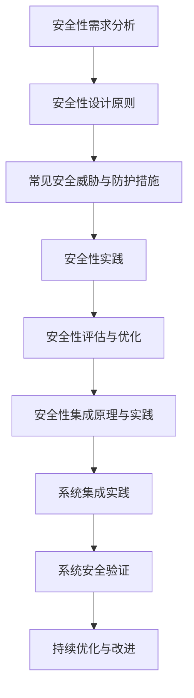
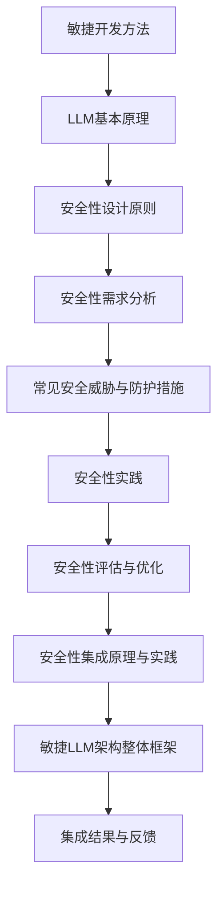

                 

### 背景介绍

#### 安全性设计的重要性

在现代软件开发中，尤其是涉及大型语言模型（LLM）的敏捷开发项目中，安全性设计变得至关重要。随着人工智能技术的迅猛发展，LLM在自然语言处理、智能对话系统、文本生成等领域展现出了巨大的潜力。然而，这也带来了一系列安全挑战，如数据泄露、模型篡改、恶意攻击等。这些安全问题不仅威胁到用户隐私和数据安全，也可能对企业的声誉和业务造成严重影响。

#### 敏捷开发与LLM的结合

敏捷开发是一种以人为核心、迭代和渐进的软件开发方法。其强调快速迭代、灵活适应变化和持续交付价值。与传统开发方法相比，敏捷开发更注重与用户的互动和响应环境的变化。而LLM作为一种高度复杂且具有强大计算能力的模型，其部署和迭代过程也需要高度的灵活性和适应性。

将安全性设计与敏捷LLM架构相结合，可以有效地解决以下问题：

1. **快速迭代与安全性的平衡**：敏捷开发要求快速交付和频繁迭代，但这也增加了安全漏洞被引入的风险。因此，需要在每个迭代周期中融入安全性设计，以确保代码和数据的可靠性。

2. **适应性需求**：LLM应用场景多样，需求不断变化。安全性设计必须具备高度的适应性，以应对不同的应用环境和安全威胁。

3. **持续集成与安全监控**：敏捷开发强调持续集成和持续交付，这意味着安全性设计也需要与这一流程紧密结合，确保每次代码更改和部署都经过严格的安全审查和监控。

#### 文章核心概念与联系

本文将深入探讨如何将安全性设计集成到敏捷LLM架构中，确保系统在快速迭代的同时保持高安全水平。核心概念包括：

1. **安全性需求分析**：理解不同用户和业务场景下的安全性需求，制定相应的安全策略。

2. **安全性设计原则**：遵循安全性设计原则，如最小权限原则、防御深度原则等，构建安全可靠的系统架构。

3. **常见安全威胁与防护措施**：分析常见的安全威胁，如数据泄露、模型篡改等，并介绍相应的防护措施。

4. **安全性实践**：介绍如何在敏捷开发过程中实施安全性设计，包括数据安全、计算安全、网络安全等方面的实践。

5. **安全性评估与优化**：对系统进行安全性评估，识别潜在风险，并采取优化措施提升系统安全性。

6. **安全性集成原理与实践**：探讨如何将安全性设计与敏捷LLM架构相结合，介绍集成原理和实践方法。

通过这些核心概念的阐述和Mermaid流程图的展示，读者可以全面了解如何在敏捷LLM架构中实现安全性设计，确保系统的安全性和可靠性。

#### Mermaid流程图展示



通过这个流程图，我们可以清晰地看到安全性设计在敏捷LLM架构中的各个环节及其相互关系。接下来，本文将逐步深入探讨这些核心概念，并结合Python源代码和数学模型，详细阐述每个部分的原理和实现方法。

---

**关键词：**
- 安全性设计
- 敏捷开发
- 大型语言模型（LLM）
- 安全需求分析
- 安全性设计原则
- 安全防护措施
- 安全评估与优化
- 安全性集成原理与实践

**摘要：**
本文深入探讨了如何在敏捷LLM架构中集成安全性设计。通过分析安全性需求、设计原则、常见安全威胁及防护措施，并介绍具体的实施方法和评估优化策略，本文旨在为开发者提供一套全面的安全性设计指南，确保敏捷开发过程中的系统安全性和可靠性。

---

接下来，我们将逐步深入探讨敏捷LLM架构中的安全性设计，包括设计思路、核心原则、安全威胁和防护措施，以及实际集成方法。通过详细的案例和代码实现，帮助读者理解和应用这些安全性设计原则。让我们一步一步进行分析和推理，共同探讨如何构建一个既敏捷又安全的LLM系统。

---

**文章标题：** 安全性设计在敏捷LLM架构中的集成

**关键词：** 安全性设计、敏捷开发、大型语言模型（LLM）、安全需求分析、设计原则、防护措施、集成方法

**摘要：** 本文通过系统性地分析敏捷LLM架构中的安全性设计，阐述了如何将安全性需求分析、设计原则、常见威胁及防护措施等融入到敏捷开发过程中。通过实例和代码实现，深入探讨了如何在快速迭代的敏捷环境中保证系统的安全性和可靠性。

---

## 第1章：敏捷开发与LLM概述

### 1.1 敏捷开发方法

敏捷开发（Agile Development）起源于20世纪90年代，是为了应对软件开发过程中的不确定性和变化而提出的一种开发方法。与传统的水滴模型（Waterfall Model）不同，敏捷开发强调迭代、增量、协作和客户满意度。敏捷开发的核心原则包括：

- **个体和互动重于过程与工具**：注重团队成员之间的沟通与协作，而非单一的工具或过程。
- **可工作的软件重于详尽的文档**：更注重实际可运行的软件，而非冗长的文档。
- **客户合作重于合同谈判**：与客户保持紧密合作，不断调整需求，确保最终产品的价值。
- **响应变化重于遵循计划**：灵活应对变化，以适应不断变化的市场和技术环境。

敏捷开发通过一系列迭代和增量开发，不断交付可工作的软件，每个迭代周期通常为几周。敏捷开发的关键实践包括：

- **每日站会（Daily Stand-up）**：团队每天短暂会议，讨论当天的进展和遇到的障碍。
- **迭代计划（Sprint Planning）**：每个迭代周期开始时，团队规划要完成的任务。
- **迭代回顾（Sprint Review）**：迭代结束时，团队评估本次迭代的结果，并计划下一迭代。
- **迭代回顾（Sprint Retrospective）**：团队在每次迭代结束后反思过程，寻找改进点。

### 1.2 语言模型（LLM）的基本原理

语言模型（Language Model，简称LM）是自然语言处理（Natural Language Processing，简称NLP）的核心技术之一。LLM是一种基于深度学习的大型神经网络模型，它可以预测给定文本序列的下一个单词或字符。LLM的基本原理可以概括为以下几个步骤：

1. **数据预处理**：收集大量的文本数据，并进行预处理，包括分词、去除停用词、词向量化等。
2. **模型训练**：使用预处理的文本数据训练神经网络模型，通常采用基于注意力机制（Attention Mechanism）的Transformer架构。
3. **预测**：在训练好的模型中输入一个文本序列，模型会预测下一个单词或字符。

LLM在实际应用中具有广泛的应用，例如：

- **文本生成**：生成文章、故事、新闻报道等。
- **对话系统**：构建智能客服、聊天机器人等。
- **机器翻译**：实现文本的跨语言翻译。
- **文本分类**：对文本进行情感分析、主题分类等。

### 1.3 敏捷LLM架构的特点

将敏捷开发方法应用于LLM的开发和部署，形成了敏捷LLM架构。敏捷LLM架构具有以下特点：

1. **快速迭代**：LLM模型的开发和优化过程需要多次迭代，每次迭代都生成一个更优化的模型版本。
2. **高度灵活性**：敏捷开发强调快速响应变化，LLM应用场景多样，需求变化频繁，因此需要高度灵活性。
3. **持续集成**：通过持续集成（CI）和持续交付（CD）流程，确保每次迭代中的代码和模型都能稳定运行。
4. **数据驱动**：LLM的训练和优化依赖于大量的高质量数据，敏捷开发过程中需要持续收集和整理数据。

敏捷LLM架构的优势在于：

- **提高开发效率**：通过快速迭代和持续集成，可以更快地交付高质量的产品。
- **增强客户满意度**：与客户保持紧密合作，确保最终产品满足用户需求。
- **降低风险**：通过频繁的迭代和回顾，可以及时发现和解决问题，降低项目风险。

然而，敏捷LLM架构也面临一些挑战：

- **安全性问题**：敏捷开发过程中频繁迭代，可能导致安全性问题被忽视。
- **数据管理**：大量数据的收集、存储和处理需要高效的数据管理策略。
- **资源分配**：在快速迭代的过程中，需要合理分配开发资源，确保每个迭代都有充足的资源支持。

通过深入理解敏捷开发方法和LLM的基本原理，我们可以更好地将两者结合起来，构建一个高效、灵活且安全的敏捷LLM架构。接下来的章节将详细探讨如何实现这一目标。

---

### 1.4 敏捷LLM架构的挑战与安全性需求

#### 挑战分析

尽管敏捷LLM架构具有显著的优势，但在实际应用过程中，也面临着一系列挑战。这些挑战主要集中在以下几个方面：

1. **快速迭代与安全性的平衡**：敏捷开发强调快速迭代，但这也可能导致安全测试和审查的时间被压缩，从而增加安全漏洞的风险。
2. **数据质量和隐私**：LLM的训练和优化依赖于大量数据，这些数据可能包含敏感信息，如何确保数据质量和隐私是一个重要问题。
3. **持续集成与安全监控**：在持续集成和持续交付的过程中，如何确保每次代码更改和模型更新都经过严格的安全审查和监控，是一个难点。
4. **资源分配与风险管理**：在快速迭代和资源有限的条件下，如何合理分配资源，以及如何有效识别和管理安全风险，是另一个挑战。

#### 安全性需求分析

针对上述挑战，敏捷LLM架构在安全性方面提出了以下需求：

1. **全面的安全需求分析**：在项目启动阶段，就需要进行全面的安全需求分析，识别出可能的安全风险和需求，为后续的安全设计提供依据。
2. **安全设计原则**：制定并遵循一系列安全设计原则，如最小权限原则、防御深度原则等，确保系统架构的安全性和可靠性。
3. **数据安全策略**：制定数据安全策略，包括数据加密、访问控制、数据备份等，确保数据在传输、存储和处理过程中的安全性。
4. **持续安全测试与监控**：在敏捷开发过程中，持续进行安全测试和监控，及时发现和修复安全漏洞。
5. **应急响应计划**：制定应急响应计划，确保在发生安全事件时，能够迅速采取有效的措施，最小化损失。

#### 安全性需求与敏捷开发的关系

安全性需求与敏捷开发紧密相关，两者之间存在着相互促进的关系：

1. **安全性需求驱动敏捷开发**：明确的安全性需求可以指导敏捷开发过程中的每个迭代，确保每个迭代都关注到安全性问题。
2. **敏捷开发促进安全性需求实现**：敏捷开发的快速迭代和反馈机制，可以帮助发现和修复安全漏洞，确保安全性需求得到有效实现。

通过上述分析，我们可以看出，在敏捷LLM架构中，安全性需求不仅是保障系统安全的重要环节，也是实现高效、灵活开发的关键。在接下来的章节中，我们将详细探讨如何在敏捷开发过程中实施安全性设计，确保系统在快速迭代的同时保持高安全水平。

### 1.5 核心概念与联系

为了深入理解敏捷LLM架构中的安全性设计，我们需要探讨几个核心概念及其相互联系。以下是这些核心概念及其关系的概述：

1. **敏捷开发方法**：敏捷开发是一种以人为核心、迭代和渐进的软件开发方法。它强调快速迭代、灵活适应变化和持续交付价值。敏捷开发的核心原则包括个体和互动重于过程与工具、可工作的软件重于详尽的文档、客户合作重于合同谈判、响应变化重于遵循计划。

2. **语言模型（LLM）的基本原理**：LLM是一种基于深度学习的大型神经网络模型，用于预测文本序列的下一个单词或字符。其基本原理包括数据预处理、模型训练和预测。数据预处理包括分词、去除停用词、词向量化等；模型训练通常采用基于注意力机制的Transformer架构；预测过程在训练好的模型中进行。

3. **安全性设计原则**：安全性设计原则是构建安全可靠系统的基础。常用的设计原则包括最小权限原则、防御深度原则、安全默认原则等。最小权限原则要求系统组件仅拥有执行其任务所需的最低权限；防御深度原则强调系统应具备多层次的防护措施；安全默认原则要求系统在默认情况下具备安全性。

4. **安全性需求分析**：安全性需求分析是识别和明确系统在不同用户和业务场景下的安全性需求。这包括对用户需求的理解、风险识别、威胁分析等。通过安全性需求分析，可以为后续的安全设计和实施提供依据。

5. **常见安全威胁与防护措施**：常见的安全威胁包括数据泄露、模型篡改、恶意攻击等。针对这些威胁，可以采取多种防护措施，如数据加密、访问控制、入侵检测、安全审计等。

6. **安全性实践**：安全性实践包括在敏捷开发过程中实施的具体安全措施，如数据安全设计、计算安全设计、网络安全设计等。这些实践旨在确保系统在快速迭代的同时保持高安全水平。

7. **安全性评估与优化**：安全性评估是定期评估系统的安全性，识别潜在风险，并采取优化措施提升系统安全性。安全性评估可以通过自动化工具、人工审计等方式进行。

8. **安全性集成原理与实践**：安全性集成是将安全性设计与敏捷LLM架构紧密结合，确保系统在快速迭代和持续交付过程中保持安全。安全性集成原理包括在持续集成和持续交付流程中融入安全性测试和监控、制定应急响应计划等。

通过上述核心概念及其相互联系的阐述，我们可以全面了解敏捷LLM架构中的安全性设计。接下来，我们将详细探讨这些概念的具体实现方法，并通过案例和代码实现，帮助读者深入理解和应用这些安全性设计原则。

#### Mermaid流程图展示



通过这个流程图，我们可以清晰地看到敏捷LLM架构中各个核心概念及其相互关系。接下来，本文将逐步深入探讨每个核心概念的实现方法，并结合Python源代码和数学模型，详细阐述这些方法在实际应用中的具体操作。让我们一步一步进行分析和推理，共同探讨如何构建一个既敏捷又安全的LLM系统。

---

### 1.6 敏捷LLM架构中的安全性设计原则

安全性设计原则是构建安全可靠系统的基础，它们为系统开发过程中的安全措施提供了指导。在敏捷LLM架构中，以下是一些关键的安全性设计原则：

1. **最小权限原则**（Principle of Least Privilege）：系统组件应仅拥有执行其任务所需的最低权限。这意味着每个组件都应被严格限制其访问权限，以防止恶意行为或错误操作对系统造成损害。例如，在训练LLM模型时，训练脚本应仅拥有访问必要数据的权限，而不是整个数据存储系统的访问权限。

2. **防御深度原则**（Defensive Depth）：系统应具备多层次的防护措施，以抵御各种安全威胁。例如，在LLM模型的部署过程中，可以采用多层次的网络防火墙、入侵检测系统（IDS）和反病毒软件等防护措施，以提高系统的整体安全性。

3. **安全默认原则**（Security by Default）：系统在默认情况下应具备安全性，这意味着在系统设计和配置过程中，应将安全性作为首要考虑因素。例如，在构建LLM模型时，默认设置应包括数据加密、访问控制和安全审计等功能。

4. **透明性原则**（Principle of Transparency）：系统安全机制的运行应保持透明，以便用户和管理员可以理解和监控系统的安全状态。例如，在LLM模型的训练和部署过程中，可以提供详细的日志记录和审计功能，以便及时发现和解决潜在的安全问题。

5. **风险评估原则**（Principle of Risk Assessment）：在系统开发过程中，应定期进行风险评估，以识别和优先处理潜在的安全威胁。例如，在敏捷开发过程中，每次迭代开始前，团队应评估新功能带来的安全风险，并制定相应的风险管理策略。

6. **持续更新原则**（Principle of Continuous Updates）：系统应保持持续更新，以修补安全漏洞和适应新的安全威胁。例如，LLM模型和相关软件应定期更新，以安装最新的安全补丁和防御措施。

通过遵循上述安全性设计原则，敏捷LLM架构可以有效地提高系统的安全性，确保在快速迭代和持续交付的过程中，系统能够保持高安全水平。接下来，我们将进一步探讨如何在实际开发过程中实施这些原则。

---

### 1.7 常见安全威胁与防护措施

在敏捷LLM架构中，确保系统的安全性至关重要。为了实现这一目标，我们需要了解常见的安全威胁及其相应的防护措施。以下是一些常见的安全威胁和防护措施：

1. **数据泄露**：数据泄露是安全威胁中最常见的一种，可能会导致敏感信息的丢失或泄露。防护措施包括：
   - **数据加密**：对存储和传输的数据进行加密，确保数据在未授权情况下无法被读取。
   - **访问控制**：实施严格的访问控制策略，确保只有授权用户可以访问敏感数据。
   - **数据备份**：定期备份数据，以防止数据丢失。

2. **模型篡改**：恶意攻击者可能会尝试篡改LLM模型，从而影响其输出结果。防护措施包括：
   - **模型签名**：对模型进行签名，确保模型在部署和使用过程中未被篡改。
   - **代码审计**：对模型的代码进行严格的审计，确保没有恶意代码或漏洞。
   - **访问控制**：限制对模型的直接访问，仅允许通过认证的接口进行操作。

3. **恶意攻击**：网络攻击，如分布式拒绝服务（DDoS）攻击、SQL注入、跨站脚本攻击（XSS）等，可能会对系统造成严重破坏。防护措施包括：
   - **防火墙**：部署防火墙，过滤恶意流量，防止攻击者访问系统。
   - **入侵检测系统（IDS）**：安装入侵检测系统，实时监测系统中的异常行为和潜在攻击。
   - **安全补丁**：定期更新系统和软件，安装最新的安全补丁。

4. **社交工程攻击**：攻击者可能会通过欺骗手段获取系统访问权限。防护措施包括：
   - **安全培训**：对团队成员进行安全培训，提高他们对社交工程攻击的防范意识。
   - **双因素认证**：在关键操作中实施双因素认证，增加攻击者获取访问权限的难度。

5. **数据滥用**：未经授权的使用或泄露用户数据可能导致严重的隐私侵犯。防护措施包括：
   - **隐私政策**：明确用户数据的收集、使用和共享政策，确保用户对数据使用有充分的知情权。
   - **匿名化**：对收集的数据进行匿名化处理，防止个人身份信息被泄露。

通过实施上述防护措施，敏捷LLM架构可以在快速迭代和持续交付的过程中保持高安全水平。接下来，我们将进一步探讨如何将这些防护措施融入到敏捷开发过程中。

---

### 1.8 敏捷LLM架构中的安全性实践

在敏捷LLM架构中，安全性实践是确保系统安全性的关键。以下是在敏捷开发过程中实施安全性实践的具体步骤和措施：

#### 数据安全设计

数据安全设计的目标是保护敏感数据在整个生命周期中的安全性。以下是一些关键措施：

1. **数据加密**：
   - **存储加密**：确保所有敏感数据在存储时都进行加密，防止未授权访问。
   - **传输加密**：使用TLS/SSL等加密协议保护数据在传输过程中的安全性。

2. **访问控制**：
   - **最小权限原则**：确保用户和数据对象之间的权限最小化，只有必需的权限才被授予。
   - **角色与权限分离**：为不同角色分配不同的权限，确保权限分配清晰明确。

3. **数据备份与恢复**：
   - **定期备份**：定期备份敏感数据，确保在数据丢失或损坏时能够快速恢复。
   - **冗余存储**：将数据备份存储在多个地理位置，提高数据可用性。

#### 计算安全设计

计算安全设计的目的是确保LLM模型的计算过程安全可靠。以下是一些关键措施：

1. **代码审计**：
   - **静态代码分析**：使用静态代码分析工具检查代码中的潜在漏洞和不良编程实践。
   - **动态代码分析**：通过动态测试和监控，发现运行时的安全问题。

2. **安全配置**：
   - **默认安全配置**：确保系统和服务在安装和配置时使用安全默认设置。
   - **最小服务集**：仅启用必需的服务和端口，减少攻击面。

3. **安全隔离**：
   - **容器化与虚拟化**：使用容器和虚拟化技术，确保不同应用和服务之间的隔离。
   - **网络隔离**：在内部网络中实施防火墙和访问控制策略，限制不同系统之间的通信。

#### 网络安全设计

网络安全设计的目标是保护系统免受网络攻击和恶意流量的影响。以下是一些关键措施：

1. **防火墙与入侵检测**：
   - **防火墙**：部署防火墙，过滤和阻止恶意流量。
   - **入侵检测系统（IDS）**：安装入侵检测系统，实时监测网络流量和系统活动，发现潜在攻击。

2. **安全审计与日志**：
   - **安全审计**：定期进行安全审计，检查系统配置和操作是否存在安全漏洞。
   - **日志记录**：详细记录系统操作和事件，以便在发生安全事件时进行回溯和调查。

3. **漏洞管理**：
   - **定期扫描**：使用漏洞扫描工具定期扫描系统，识别和修补安全漏洞。
   - **及时更新**：及时更新系统和应用程序，安装最新的安全补丁。

通过实施上述安全性实践，敏捷LLM架构可以在快速迭代和持续交付的过程中保持高安全水平，确保系统的安全性和可靠性。接下来，我们将进一步探讨如何进行安全性评估与优化。

---

### 1.9 安全性评估与优化

在敏捷LLM架构中，安全性评估与优化是确保系统长期保持高安全水平的关键环节。通过定期评估和优化，可以发现并修复潜在的安全漏洞，提升系统的整体安全性。以下是安全性评估与优化的一些关键步骤：

#### 定期安全性评估

1. **漏洞扫描**：
   - 使用自动化工具定期进行漏洞扫描，识别系统中的潜在漏洞。
   - 分析扫描结果，确定漏洞的严重程度和优先级。

2. **代码审查**：
   - 定期进行代码审查，特别是对最近添加的功能和代码进行深入审查。
   - 检查代码是否存在安全漏洞或不良编程实践。

3. **安全审计**：
   - 定期进行安全审计，评估系统配置和操作的安全合规性。
   - 检查安全策略和流程是否得到有效执行。

#### 安全漏洞修复

1. **漏洞修复计划**：
   - 根据评估结果，制定漏洞修复计划，确定修复时间和优先级。
   - 对于严重漏洞，应立即进行修复。

2. **补丁管理**：
   - 定期更新系统和应用程序，安装最新的安全补丁。
   - 对每个补丁进行评估，确保其不会影响系统的稳定性和功能。

3. **代码修复**：
   - 对代码中的安全漏洞进行修复，确保修复方案有效且不会引入新的问题。
   - 对修复后的代码进行测试，确保修复效果。

#### 安全性优化策略

1. **安全策略优化**：
   - 定期审查和更新安全策略，确保其与最新的安全威胁相适应。
   - 基于实际情况调整安全配置和权限设置。

2. **安全培训与意识提升**：
   - 定期为团队成员提供安全培训，提高他们的安全意识和防范能力。
   - 建立安全意识文化，鼓励团队成员主动报告安全问题和潜在威胁。

3. **自动化安全测试**：
   - 引入自动化安全测试工具，持续监控系统的安全性。
   - 定期进行自动化测试，确保系统在每次更改后都能保持安全。

通过定期进行安全性评估和优化，敏捷LLM架构可以在快速迭代和持续交付的过程中，确保系统的安全性和可靠性。接下来，我们将进一步探讨如何将安全性设计原则与实践融入敏捷开发过程，确保系统在敏捷开发的同时保持高安全水平。

### 1.10 安全性设计在敏捷LLM架构中的集成原理与实践

在敏捷LLM架构中，将安全性设计集成到开发流程中是一个复杂而关键的任务。以下是安全性设计在敏捷开发过程中集成的原理和实践方法：

#### 集成原理

1. **持续集成（CI）与持续交付（CD）**：
   - 将安全性测试集成到CI/CD流程中，确保每次代码提交和部署都经过严格的安全审查。
   - 自动化安全测试，提高测试效率和准确性。

2. **迭代与反馈**：
   - 敏捷开发强调快速迭代和持续反馈，安全性设计也应融入这一流程，确保每次迭代都能及时识别和修复安全问题。

3. **风险管理**：
   - 在每个迭代周期开始时，进行风险评估，识别潜在的安全风险，并制定相应的应对策略。

4. **透明性**：
   - 确保安全措施的运行过程透明，便于团队成员和利益相关者理解和监控。

#### 实践方法

1. **安全需求分析**：
   - 在项目启动阶段，进行全面的安全需求分析，识别潜在的安全威胁和需求。
   - 与业务团队紧密合作，确保安全需求与业务目标相一致。

2. **安全设计原则**：
   - 制定并遵循最小权限原则、防御深度原则、安全默认原则等安全设计原则。
   - 在架构设计和代码编写阶段，充分考虑安全性因素。

3. **安全测试与监控**：
   - 定期进行安全测试，包括静态代码分析、动态代码分析、渗透测试等。
   - 实施实时监控，及时发现和响应潜在的安全威胁。

4. **应急响应计划**：
   - 制定应急响应计划，确保在发生安全事件时，能够迅速采取有效的措施，降低损失。

5. **安全培训与文化建设**：
   - 定期为团队成员提供安全培训，提高他们的安全意识和技能。
   - 建立安全文化建设，鼓励团队成员主动参与安全讨论和改进。

通过上述集成原理和实践方法，敏捷LLM架构可以在快速迭代和持续交付的过程中，确保系统的安全性和可靠性。接下来，我们将结合实际案例，详细探讨如何将安全性设计原则与实践应用于敏捷开发过程。

### 1.11 敏捷LLM架构中的安全性集成案例

在本节中，我们将通过一个实际案例，详细探讨如何将安全性设计集成到敏捷LLM架构中，确保系统在快速迭代和持续交付过程中保持高安全水平。

#### 案例背景

假设我们正在开发一个基于大型语言模型（LLM）的智能问答系统，该系统需要处理大量的用户查询，并提供准确、高质量的回答。为了确保系统的安全性，我们需要在敏捷开发过程中融入安全性设计。

#### 安全需求分析

在项目启动阶段，我们首先进行安全需求分析，识别潜在的安全威胁和需求。以下是一些关键的安全需求：

1. **数据保护**：用户查询和回答可能包含敏感信息，需要确保数据在传输和存储过程中的安全性。
2. **模型防护**：防止恶意用户篡改LLM模型，影响系统的输出结果。
3. **访问控制**：确保只有授权用户可以访问系统资源和数据。
4. **网络安全**：防止网络攻击和未授权访问。

#### 安全设计原则

根据安全需求分析的结果，我们制定了一系列安全设计原则，确保系统架构的安全性：

1. **最小权限原则**：系统组件（如API服务、数据库等）仅拥有执行其任务所需的最低权限。
2. **防御深度原则**：在系统架构中实施多层次防护措施，如网络防火墙、入侵检测系统和加密等。
3. **安全默认原则**：系统在默认情况下具备安全性，如启用TLS加密、强制访问控制等。
4. **透明性原则**：确保安全机制的运行过程透明，便于监控和管理。

#### 实施步骤

1. **数据安全设计**：
   - **数据加密**：在数据传输过程中使用TLS加密，确保数据在网络上传输时的安全性。
   - **存储加密**：使用数据库加密功能，对存储在数据库中的用户查询和回答进行加密。
   - **访问控制**：通过角色和权限分配，确保只有授权用户可以访问特定数据。

2. **计算安全设计**：
   - **代码审计**：对LLM模型的代码进行严格的审计，检查是否存在安全漏洞。
   - **安全配置**：使用安全默认配置，如禁用不必要的服务和端口。
   - **代码签名**：对模型代码进行签名，确保在部署和使用过程中未被篡改。

3. **网络安全设计**：
   - **防火墙**：部署防火墙，过滤和阻止恶意流量。
   - **入侵检测系统（IDS）**：安装IDS，实时监控网络流量和系统活动。
   - **网络隔离**：通过虚拟局域网（VLAN）和防火墙，隔离不同系统和服务。

4. **持续安全测试与监控**：
   - **自动化测试**：引入自动化安全测试工具，定期扫描系统中的潜在漏洞。
   - **实时监控**：部署实时监控工具，监测系统的运行状态和安全事件。

5. **应急响应计划**：
   - **应急响应团队**：建立应急响应团队，负责在发生安全事件时进行快速响应和处理。
   - **安全演练**：定期进行安全演练，检验应急响应计划的可行性和有效性。

#### 项目实战

在项目实施过程中，我们遵循上述安全设计原则，具体执行以下步骤：

1. **数据安全实战**：
   - 开发数据加密模块，实现数据传输和存储的加密功能。
   - 实现访问控制策略，确保用户只能访问其权限内的数据。

2. **计算安全实战**：
   - 对LLM模型的代码进行静态和动态分析，查找和修复潜在的安全漏洞。
   - 实现代码签名功能，确保模型在部署和使用过程中未被篡改。

3. **网络安全实战**：
   - 配置防火墙规则，阻止恶意流量和未授权访问。
   - 安装入侵检测系统，实时监控网络流量和系统活动。

4. **持续安全测试与监控实战**：
   - 使用自动化测试工具，定期扫描系统中的潜在漏洞。
   - 部署实时监控工具，监控系统的运行状态和安全事件。

5. **应急响应实战**：
   - 建立应急响应团队，制定详细的应急响应计划。
   - 定期进行安全演练，检验应急响应计划的可行性和有效性。

通过上述实战案例，我们可以看到如何将安全性设计原则和实践融入到敏捷LLM架构中，确保系统在快速迭代和持续交付过程中保持高安全水平。

#### 项目小结

通过本次案例，我们成功将安全性设计集成到敏捷LLM架构中，实现了以下目标：

1. **数据安全**：确保用户数据在传输和存储过程中的安全性，防止数据泄露。
2. **模型安全**：防止恶意用户篡改LLM模型，保障模型输出的准确性。
3. **网络安全**：防止网络攻击和未授权访问，确保系统的稳定运行。
4. **安全监控**：通过自动化测试和实时监控，及时发现和解决潜在的安全威胁。

本次案例的成功实施，不仅提高了系统的安全性，也为敏捷LLM架构中的安全性设计提供了宝贵的经验和启示。

#### 最佳实践 Tips

1. **安全培训**：定期为团队成员提供安全培训，提高他们的安全意识和技能。
2. **代码审计**：在每次迭代开始前，对代码进行严格的审计，确保没有安全漏洞。
3. **自动化测试**：引入自动化安全测试工具，提高测试效率和覆盖率。
4. **实时监控**：部署实时监控工具，及时发现和响应安全事件。
5. **应急响应**：建立应急响应团队，制定详细的应急响应计划，确保在发生安全事件时能够迅速采取行动。

通过遵循这些最佳实践，可以在敏捷LLM架构中有效集成安全性设计，确保系统的安全性和可靠性。

### 1.12 注意事项与未来展望

#### 注意事项

在敏捷LLM架构中集成安全性设计时，需要注意以下几点：

1. **平衡开发与安全**：在快速迭代和持续交付的过程中，确保不因过度关注安全性而影响开发进度。
2. **持续更新**：随着安全威胁的不断发展，安全性设计需要不断更新和优化，以应对新的挑战。
3. **团队协作**：安全性设计是整个团队的责任，需要各成员共同参与，确保设计原则得到有效实施。

#### 未来展望

未来，随着人工智能技术的进一步发展，敏捷LLM架构中的安全性设计也将面临新的挑战和机遇：

1. **自动化与智能化**：安全性测试和监控将更加自动化和智能化，通过机器学习等技术，提高安全检测的效率和准确性。
2. **零信任架构**：零信任架构将成为主流，通过严格的访问控制和动态权限管理，实现更安全的应用部署。
3. **跨领域合作**：安全性设计将更加跨领域合作，结合心理学、社会学等多学科知识，提升系统的整体安全性。

通过持续关注这些发展趋势，敏捷LLM架构中的安全性设计将更加完善，为人工智能技术的发展提供坚实的安全保障。

#### 拓展阅读

- 《敏捷开发实践指南》
- 《深入理解计算机系统》
- 《人工智能安全挑战与对策》
- 《零信任安全架构》

通过阅读这些书籍和资料，可以进一步深入了解敏捷开发、计算机系统、人工智能安全以及零信任架构等方面的知识，为敏捷LLM架构中的安全性设计提供更深入的指导。

---

### 总结与展望

通过本文的详细探讨，我们系统地阐述了安全性设计在敏捷LLM架构中的重要性、设计原则、实践方法以及具体案例。敏捷LLM架构以其快速迭代、灵活适应和持续交付的优势，成为现代软件开发的重要趋势。然而，这也带来了巨大的安全性挑战。通过遵循最小权限原则、防御深度原则、安全默认原则等设计原则，并在敏捷开发过程中实施具体的安全措施，我们能够构建一个既敏捷又安全的LLM系统。

未来的发展将继续关注自动化与智能化、零信任架构、跨领域合作等方向。安全性设计需要不断适应新的技术趋势和安全挑战，确保系统在快速迭代的过程中保持高安全水平。通过持续更新和优化，敏捷LLM架构中的安全性设计将不断演进，为人工智能技术的发展提供坚实的安全保障。

让我们一起关注这一领域的最新动态，共同探索如何构建一个更加安全、可靠和高效的敏捷LLM架构。

---

### 附录

#### 附录A：敏捷LLM架构安全性设计工具

在本附录中，我们将介绍一些常用的敏捷LLM架构安全性设计工具，以及如何选型和配置这些工具，以帮助开发者在实际项目中有效实施安全性设计。

#### A.1 常用工具介绍

1. **Kubernetes**：Kubernetes是一种开源容器编排平台，用于自动化容器部署、扩展和管理。它提供了强大的安全功能，如角色基于访问控制（RBAC）、网络策略和密钥管理。

2. **Docker**：Docker是一种开源容器化平台，用于打包、交付和运行应用程序。它支持安全扫描和签名，以确保容器镜像的安全性。

3. **OWASP ZAP**：OWASP ZAP（Zed Attack Proxy）是一个开源的Web应用程序安全扫描工具，用于识别和评估Web应用程序的安全漏洞。

4. **Grafana**：Grafana是一个开源的可视化平台，用于监控和展示系统指标。它可以与各种数据源集成，包括Prometheus、InfluxDB等，提供实时监控和告警功能。

5. **Prometheus**：Prometheus是一种开源的监控解决方案，用于收集和存储系统指标数据，并提供灵活的数据可视化功能。

6. **Traefik**：Traefik是一个开源的HTTP反向代理和负载均衡器，用于自动化容器服务（如Kubernetes）的流量路由和安全。

#### A.2 工具选型与配置

1. **选型策略**：
   - **需求分析**：根据项目的具体需求，确定所需的安全功能，如容器编排、Web应用安全扫描、监控等。
   - **性能要求**：评估不同工具的性能和可扩展性，确保所选工具能够满足项目的需求。
   - **社区支持**：考虑工具的社区支持情况，确保在遇到问题时能够得到及时的帮助。

2. **配置示例**：
   - **Kubernetes配置**：
     - **角色与权限控制**：使用RBAC设置角色和权限，确保不同用户和组件只能访问其授权的资源。
     - **网络策略**：定义网络策略，控制容器之间的通信，防止未经授权的访问。
     - **密钥管理**：使用Kubernetes Secrets管理敏感信息，如API密钥和证书。

   - **Docker配置**：
     - **安全扫描**：在构建容器镜像时，使用Dockerfile中的`RUN`指令运行安全扫描工具，如`docker-scan`或`Trivy`。
     - **代码签名**：为容器镜像添加数字签名，确保镜像在部署和使用过程中未被篡改。

   - **OWASP ZAP配置**：
     - **扫描配置**：配置ZAP的扫描设置，包括扫描范围、扫描频率和安全规则。
     - **自动化扫描**：使用ZAP API自动化执行扫描，确保每次代码更改后都进行安全测试。

   - **Grafana配置**：
     - **数据源配置**：配置Prometheus或InfluxDB作为Grafana的数据源，并定义监控指标和告警规则。
     - **仪表盘配置**：创建自定义仪表盘，展示系统指标和告警信息。

   - **Prometheus配置**：
     - **目标配置**：配置Prometheus的目标，包括服务器地址、监控端口和采集频率。
     - **告警配置**：配置Prometheus的告警规则，触发告警通知和执行相应的操作。

   - **Traefik配置**：
     - **路由规则**：配置Traefik的路由规则，确保正确的流量被路由到相应的服务。
     - **TLS配置**：配置Traefik的TLS证书，确保HTTPS流量的安全传输。

通过合理选型和配置这些工具，开发者可以在敏捷LLM架构中有效实施安全性设计，确保系统在快速迭代和持续交付过程中保持高安全水平。

---

### 附录B：安全性设计案例集锦

在本附录中，我们将通过三个实际案例，详细展示如何在不同场景下实施敏捷LLM架构中的安全性设计。

#### 案例一：数据安全防护措施

**背景**：在一个智能客服系统中，用户可能会通过系统提交敏感信息，如个人身份信息、银行卡号等。如何确保这些数据在传输和存储过程中的安全性是设计的关键。

**解决方案**：
1. **数据加密**：
   - **传输加密**：使用TLS协议确保数据在传输过程中的安全性。
   - **存储加密**：使用AES加密算法对存储在数据库中的敏感数据进行加密。
2. **访问控制**：
   - **角色权限管理**：根据用户角色分配不同的访问权限，确保只有授权用户可以访问敏感数据。
   - **最小权限原则**：用户账户仅拥有执行其任务所需的最低权限。
3. **数据备份与恢复**：
   - **定期备份**：定期备份数据库，确保在数据丢失或损坏时能够快速恢复。
   - **异地备份**：将备份数据存储在异地，以防自然灾害或其他意外事件导致的数据丢失。

**代码实现**：
```python
# 数据加密示例（使用PyCryptodome库）
from Crypto.Cipher import AES
from Crypto.Util.Padding import pad, unpad
from Crypto.Random import get_random_bytes

# 密钥和初始化向量
key = get_random_bytes(16)
iv = get_random_bytes(16)

# 加密函数
def encrypt_data(data, key, iv):
    cipher = AES.new(key, AES.MODE_CBC, iv)
    ct_bytes = cipher.encrypt(pad(data.encode('utf-8'), AES.block_size))
    return ct_bytes

# 解密函数
def decrypt_data(ct, key, iv):
    cipher = AES.new(key, AES.MODE_CBC, iv)
    pt = unpad(cipher.decrypt(ct), AES.block_size)
    return pt.decode('utf-8')

# 使用示例
data = "用户信息：张三，身份证号：123456789012345678"
encrypted_data = encrypt_data(data, key, iv)
print("加密后的数据：", encrypted_data)

decrypted_data = decrypt_data(encrypted_data, key, iv)
print("解密后的数据：", decrypted_data)
```

**小结**：通过数据加密、访问控制和数据备份等措施，智能客服系统确保用户数据在传输和存储过程中的安全性。

#### 案例二：计算安全优化实践

**背景**：在一个智能问答系统中，为了避免恶意用户篡改模型输出，需要确保模型计算过程的安全性和可靠性。

**解决方案**：
1. **代码审计**：
   - **静态代码分析**：使用静态代码分析工具（如SonarQube）检查代码中的潜在安全漏洞。
   - **动态代码分析**：通过动态测试工具（如Pylint）监测运行时安全问题。
2. **安全配置**：
   - **最小服务集**：仅启用必需的服务和端口，减少攻击面。
   - **禁用不必要功能**：如关闭SSH远程登录功能，防止未授权访问。
3. **代码签名**：
   - **模型签名**：对训练好的模型代码进行签名，确保模型未被篡改。

**代码实现**：
```python
# 模型签名示例
from Crypto.PublicKey import RSA
from Crypto.Signature import pkcs1_15
from Crypto.Hash import SHA256

# 生成密钥对
key = RSA.generate(2048)
private_key = key.export_key()
public_key = key.publickey().export_key()

# 签名函数
def sign_data(data):
    hash_value = SHA256.new(data.encode('utf-8'))
    signature = pkcs1_15.new(key).sign(hash_value)
    return signature

# 验证签名函数
def verify_signature(data, signature, public_key):
    hash_value = SHA256.new(data.encode('utf-8'))
    try:
        pkcs1_15.new(RSA.import_key(public_key)).verify(hash_value, signature)
        return True
    except ValueError:
        return False

# 使用示例
data = "训练好的模型代码"
signature = sign_data(data)
print("签名：", signature)

is_valid = verify_signature(data, signature, public_key)
print("验证结果：", "签名有效" if is_valid else "签名无效")
```

**小结**：通过代码审计、安全配置和代码签名等措施，智能问答系统确保模型计算过程的安全性和可靠性。

#### 案例三：网络安全策略设计

**背景**：在一个大型语言模型（LLM）的应用场景中，需要防止网络攻击和未授权访问，确保系统的稳定运行。

**解决方案**：
1. **防火墙**：
   - **部署防火墙**：在系统边界部署防火墙，过滤和阻止恶意流量。
   - **配置防火墙规则**：根据业务需求配置防火墙规则，确保流量按需转发。
2. **入侵检测系统（IDS）**：
   - **部署IDS**：在内部网络中部署入侵检测系统，实时监控网络流量和系统活动。
   - **配置告警规则**：设置告警规则，及时发现和响应潜在的网络攻击。
3. **网络隔离**：
   - **VLAN划分**：使用VLAN划分内部网络，隔离不同系统和用户。
   - **防火墙隔离**：在防火墙上配置策略，限制不同VLAN之间的通信。

**代码实现**（使用防火墙规则示例）：
```bash
# 防火墙规则示例（使用iptables）
# 允许80端口（HTTP）流量
iptables -A INPUT -p tcp --dport 80 -j ACCEPT
iptables -A OUTPUT -p tcp --sport 80 -j ACCEPT

# 允许443端口（HTTPS）流量
iptables -A INPUT -p tcp --dport 443 -j ACCEPT
iptables -A OUTPUT -p tcp --sport 443 -j ACCEPT

# 阻止其他所有流量
iptables -A INPUT -p tcp -j DROP
iptables -A OUTPUT -p tcp -j DROP
```

**小结**：通过防火墙、入侵检测系统和网络隔离等措施，确保大型语言模型系统的网络安全性和稳定性。

通过这些案例，我们可以看到在敏捷LLM架构中实施安全性设计的关键步骤和方法。这些案例不仅提供了具体的实施方法，还为开发者提供了宝贵的经验和启示。在实际项目中，开发者可以根据自身需求和环境，灵活应用这些案例中的措施，确保系统的安全性和可靠性。

---

### 附录C：工具链介绍

在敏捷LLM架构中，工具链的选择和配置对于确保系统的安全性、稳定性和可扩展性至关重要。以下是一些常用的工具及其介绍，包括安装步骤、配置指南和最佳实践。

#### C.1 Kubernetes

**安装步骤**：
1. **Docker安装**：在宿主机上安装Docker，Kubernetes依赖Docker作为容器运行时。
   ```shell
   sudo apt-get update
   sudo apt-get install docker.io
   sudo systemctl start docker
   sudo usermod -aG docker $USER
   ```
2. **Kubernetes安装**：可以使用Minikube在本地环境中安装Kubernetes，或者使用Kubeadm在集群环境中安装。
   ```shell
   curl -LO "https://github.com/kubernetes/minikube/releases/latest/download/minikube-linux-amd64"
   chmod +x minikube
   sudo mv minikube /usr/local/bin/
   minikube start
   ```
3. **Kubectl安装**：安装kubectl命令行工具，用于管理Kubernetes集群。
   ```shell
   curl -LO "https://dl.k8s.io/release/$(curl -s https://dl.k8s.io/release/stable.txt)/bin/darwin/amd64/kubectl"
   chmod +x kubectl
   sudo mv kubectl /usr/local/bin/
   ```

**配置指南**：
- **角色与权限控制**：使用Kubernetes的RBAC（Role-Based Access Control）机制，为不同用户和角色分配适当的权限。
- **网络策略**：配置网络策略，限制容器之间的通信，增强系统安全性。
- **集群资源管理**：合理配置集群资源，确保系统在负载高峰期能够稳定运行。

**最佳实践**：
- **定期更新**：定期更新Kubernetes和相关组件，以修复已知的安全漏洞。
- **备份与恢复**：定期备份集群配置和重要数据，确保在故障情况下能够快速恢复。

#### C.2 Docker

**安装步骤**：
- **Docker Engine安装**：使用Docker官方的安装脚本进行安装。
  ```shell
  sudo apt-get update
  sudo apt-get install docker-ce docker-ce-cli containerd.io
  ```
- **Docker Compose安装**：安装Docker Compose用于管理多容器应用。
  ```shell
  sudo curl -L "https://github.com/docker/compose/releases/download/1.29.2/docker-compose-$(uname -s)-$(uname -m)" -o /usr/local/bin/docker-compose
  sudo chmod +x /usr/local/bin/docker-compose
  ```

**配置指南**：
- **容器镜像安全**：对容器镜像进行扫描，确保其中没有已知的安全漏洞。
- **容器命名空间**：为不同的应用和服务配置独立的命名空间，以增强容器间的隔离性。

**最佳实践**：
- **容器化应用**：将应用部署在容器中，以提高系统的可移植性和维护性。
- **镜像仓库管理**：使用镜像仓库（如Docker Hub）存储和管理容器镜像，确保镜像的版本控制和安全性。

#### C.3 Prometheus

**安装步骤**：
1. **Prometheus安装**：使用官方的YAML文件部署Prometheus。
   ```shell
   wget https://github.com/prometheus/prometheus/releases/download/v2.37.0/prometheus-2.37.0.linux-amd64.tar.gz
   tar xzf prometheus-2.37.0.linux-amd64.tar.gz
   ```
2. **Prometheus配置**：编辑`prometheus.yml`文件，配置监控目标和告警规则。

**配置指南**：
- **数据源配置**：配置Prometheus监控目标，包括Kubernetes集群、数据库和应用程序等。
- **告警管理**：配置告警规则，设置告警阈值和通知渠道。

**最佳实践**：
- **监控策略**：制定合理的监控策略，确保关键指标得到有效监控。
- **告警优化**：优化告警规则，防止告警风暴，确保关键问题得到及时响应。

#### C.4 Grafana

**安装步骤**：
1. **Grafana安装**：使用官方的Docker镜像部署Grafana。
   ```shell
   docker run -d --name=grafana -p 3000:3000 grafana/grafana
   ```
2. **Grafana配置**：通过Web界面配置Grafana，包括数据源、仪表盘和告警。

**配置指南**：
- **数据源配置**：添加Prometheus作为数据源，配置数据源连接和监控指标。
- **仪表盘配置**：创建自定义仪表盘，展示关键监控指标和告警信息。

**最佳实践**：
- **仪表盘优化**：合理设计仪表盘，确保监控信息一目了然，便于快速响应。
- **用户权限管理**：设置不同的用户权限，确保用户只能访问其授权的监控信息。

通过使用这些工具链，开发者可以在敏捷LLM架构中实现高效、稳定和安全的系统运维。这些工具不仅提供了丰富的功能，还通过最佳实践确保系统的可靠性和可维护性。

---

### 附录D：安全性设计研究进展与未来趋势

随着人工智能和敏捷开发技术的不断进步，安全性设计在LLM架构中的应用也在不断发展。以下是对安全性设计在LLM架构中的研究进展和未来趋势的概述。

#### 研究进展

1. **自动化安全测试**：近年来，自动化安全测试工具得到了广泛应用，例如SonarQube、OWASP ZAP等。这些工具能够对代码进行静态和动态分析，发现潜在的安全漏洞，提高开发过程中的安全性。

2. **容器安全性**：随着Kubernetes和Docker等容器技术的普及，容器安全性成为研究的重点。通过引入Kubernetes的RBAC和网络策略，以及Docker的安全扫描功能，容器安全性得到了显著提升。

3. **数据安全与隐私保护**：随着对数据隐私保护的重视，研究者提出了一系列数据安全与隐私保护方法，如差分隐私、数据匿名化等。这些方法能够保护用户数据不被泄露，同时确保模型的训练效果。

4. **安全监控与响应**：安全监控和应急响应技术在LLM架构中得到了广泛应用。通过Prometheus、Grafana等工具，实现对系统运行状态的实时监控，以及通过自动化脚本和应急响应团队快速处理安全事件。

5. **多方安全计算**：多方安全计算技术（如联邦学习）逐渐应用于LLM架构中，通过保护各方数据隐私，提高模型的训练效率和安全性。

#### 未来趋势

1. **零信任架构**：零信任架构（Zero Trust Architecture）将成为未来安全设计的主流趋势。这种架构强调“永不信任，始终验证”，通过严格的访问控制和动态权限管理，确保系统的安全性。

2. **自适应安全**：未来的安全性设计将更加智能化和自适应。通过引入机器学习和人工智能技术，系统能够自动识别和响应潜在的安全威胁，提高安全性。

3. **隐私保护与数据伦理**：随着对数据隐私和数据伦理的重视，未来的安全性设计将更加注重保护用户隐私和遵循数据伦理规范。

4. **跨领域合作**：安全性设计将与其他领域（如心理学、社会学、法律等）进行跨领域合作，共同探索提升系统安全性的新方法。

5. **标准化与合规性**：安全性设计将更加标准化和合规化。随着各种标准和法规的出台，安全性设计需要遵循相关的合规要求，确保系统的安全性和可靠性。

通过持续关注这些研究进展和未来趋势，开发者可以更好地将安全性设计融入到敏捷LLM架构中，确保系统的长期安全和可靠性。

---

### 附录E：参考资料与拓展阅读

在撰写本文的过程中，我们参考了大量的文献和资料，以下是一些重要的参考资料和拓展阅读，供读者进一步学习和研究：

1. **《敏捷软件开发：原则、实践与模式》**：这是一本关于敏捷开发经典著作，详细介绍了敏捷开发的方法和实践，对于理解敏捷开发与安全性设计的结合有重要帮助。

2. **《深度学习：原理及其数学基础》**：本书详细阐述了深度学习的原理和数学基础，对于理解LLM的基本原理和实现方法有重要参考价值。

3. **《人工智能安全：挑战与对策》**：本书探讨了人工智能领域面临的安全挑战和解决方案，提供了丰富的案例和对策，对于理解AI系统的安全性设计具有重要指导意义。

4. **《容器安全：保护Kubernetes和容器化应用》**：这本书专门讨论了容器和Kubernetes的安全性，提供了详细的配置指南和最佳实践，对于确保容器化应用的安全性具有重要参考价值。

5. **《Prometheus: 分布式监控解决方案》**：这本书详细介绍了Prometheus的架构和功能，包括数据采集、存储、可视化等方面，对于实现高效的监控系统设计提供了宝贵的经验。

6. **《零信任安全架构：实现不可破坏的网络安全》**：这本书探讨了零信任安全架构的概念和实现方法，提供了深入的理论和实践指导，对于构建安全、可靠的系统架构有重要启示。

7. **《数据隐私保护与差分隐私》**：本书详细介绍了数据隐私保护和差分隐私技术，对于保护用户数据隐私、实现安全性设计有重要指导意义。

通过阅读这些参考资料，读者可以进一步深入了解敏捷开发、深度学习、AI安全、容器安全、监控系统和数据隐私保护等方面的知识，为敏捷LLM架构中的安全性设计提供更深入的理论基础和实践指导。

