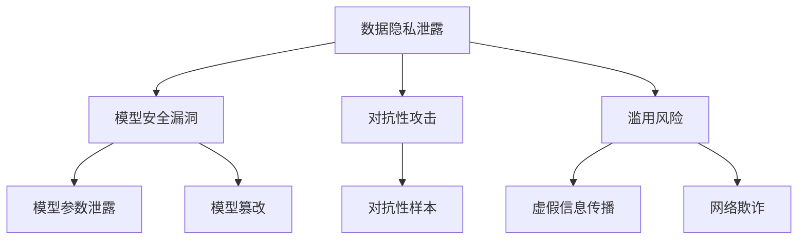

                 

# 安全性评估：LLM潜在风险的自动检测

> 关键词：LLM，安全性评估，自动检测，潜在风险，人工智能

> 摘要：本文将探讨大型语言模型（LLM）在实际应用中的安全性问题，特别是如何通过自动化的方式来检测潜在的安全风险。文章首先介绍了LLM的基本概念和特点，然后深入分析了LLM面临的各种潜在风险，最后提出了一系列自动化检测方法，并通过实际案例展示了这些方法的可行性和效果。

## 引言

近年来，随着深度学习技术的迅猛发展，大型语言模型（Large Language Models，简称LLM）如BERT、GPT等取得了显著的成果。这些模型在自然语言处理、机器翻译、文本生成等领域表现出了极高的准确性和效率。然而，随着LLM在实际应用中的广泛应用，其安全性问题也日益突出。如何确保LLM在提供便利的同时不会泄露敏感信息、不会受到恶意攻击，成为了一个亟待解决的问题。

本文将从以下几个方面对LLM的安全性评估进行探讨：

1. **背景介绍**：介绍LLM的基本概念和特点，以及其在实际应用中面临的潜在风险。
2. **核心概念与联系**：分析LLM潜在风险的来源，并使用Mermaid流程图展示其关系架构。
3. **核心算法原理讲解**：介绍自动化检测方法，并使用Python源代码详细阐述。
4. **项目实战**：开发环境搭建，源代码实现，代码解读，实际案例分析。
5. **最佳实践与拓展**：总结最佳实践，提出注意事项，并推荐拓展阅读。

通过本文的探讨，我们希望能够为LLM的安全性评估提供一些实用的方法和思路。

## 背景介绍

### 什么是LLM？

大型语言模型（Large Language Models，简称LLM）是一种基于深度学习的自然语言处理（Natural Language Processing，简称NLP）技术，通过对海量语言数据进行训练，使其能够理解和生成自然语言。与传统的规则驱动或统计模型不同，LLM通过神经网络架构来模拟人类语言处理的方式，从而在理解和生成语言方面取得了显著突破。

LLM的主要特点包括：

1. **强大的语言理解能力**：LLM能够理解复杂的语言结构和语义信息，这使得它们在文本分类、情感分析、机器翻译等任务中具有很高的准确性和效率。
2. **自适应性和灵活性**：LLM可以通过微调（fine-tuning）来适应不同的任务和数据集，从而在不同应用场景中表现出优异的性能。
3. **高效的生成能力**：LLM能够生成连贯且自然的文本，这使得它们在文本生成任务中具有很高的实用性。

### LLM的实际应用

LLM在各个领域的应用日益广泛，以下是一些常见的应用场景：

1. **自然语言处理**：LLM在文本分类、情感分析、命名实体识别等NLP任务中发挥着重要作用，例如自动化内容审核、智能客服等。
2. **机器翻译**：LLM在机器翻译领域表现出色，能够实现高质量的双语互译，极大地提高了跨语言交流的效率。
3. **文本生成**：LLM在文本生成任务中具有广泛的应用，如自动写作、创意文案生成等，为内容创作者提供了强大的辅助工具。
4. **对话系统**：LLM在对话系统中被广泛应用，如智能问答系统、虚拟助手等，为用户提供自然、流畅的交互体验。

### LLM面临的潜在风险

尽管LLM在实际应用中取得了巨大成功，但它们也面临着一系列潜在的安全风险。以下是一些常见的风险：

1. **数据泄露**：由于LLM的训练过程涉及到大量的敏感数据，如果保护不当，可能导致数据泄露，进而引发隐私泄露等问题。
2. **模型篡改**：攻击者可以通过恶意输入来篡改LLM的输出，使其产生错误的判断或生成有害内容。
3. **对抗性攻击**：攻击者可以利用对抗性样本（adversarial examples）来欺骗LLM，使其在特定条件下产生错误的输出。
4. **滥用风险**：由于LLM具有强大的语言理解能力和生成能力，如果被恶意使用，可能导致虚假信息传播、网络欺诈等严重后果。

在下一节中，我们将进一步探讨LLM潜在风险的来源和影响。

## 核心概念与联系

### 潜在风险的来源

LLM面临的潜在风险主要来自于以下几个方面：

1. **数据隐私泄露**：由于LLM的训练依赖于大量的敏感数据，如果这些数据在传输或存储过程中未能得到有效保护，可能导致隐私泄露。
2. **模型安全漏洞**：LLM模型的训练和部署过程中可能存在安全漏洞，如模型参数泄露、模型篡改等。
3. **对抗性攻击**：攻击者可以利用对抗性样本来欺骗LLM，使其在特定条件下产生错误的输出，从而实现恶意目的。
4. **滥用风险**：LLM的强大语言理解能力和生成能力可能被恶意利用，如生成虚假信息、进行网络欺诈等。

### 关系架构

为了更好地理解LLM潜在风险的来源和相互关系，我们可以使用Mermaid流程图来展示它们之间的关系架构。以下是一个简单的Mermaid流程图示例：



在图中，A表示LLM面临的潜在风险，B、C、D分别表示数据隐私泄露、对抗性攻击、滥用风险的来源，E、F、G、H、I则分别表示这些风险的具体表现形式。

### 流程图说明

- **数据隐私泄露**（A）：由于LLM的训练依赖于大量的敏感数据，如个人隐私信息、企业机密等，如果这些数据在传输或存储过程中未能得到有效保护，可能导致隐私泄露。
- **模型安全漏洞**（B）：模型安全漏洞主要包括模型参数泄露和模型篡改。模型参数泄露可能导致攻击者获取模型的内部结构，从而进行进一步的攻击；模型篡改则可能使模型产生错误的输出。
- **对抗性攻击**（C）：对抗性攻击利用对抗性样本来欺骗LLM，使其在特定条件下产生错误的输出。对抗性样本可以通过微小的扰动来实现，这使得防御措施变得非常困难。
- **滥用风险**（D）：LLM的强大语言理解能力和生成能力可能被恶意利用，如生成虚假信息、进行网络欺诈等。

通过上述流程图，我们可以清晰地看到LLM潜在风险的来源和相互关系，这有助于我们更好地理解这些风险的本质，并为后续的安全评估和检测提供指导。

## 核心算法原理讲解

### 自动化检测方法

为了应对LLM面临的各种潜在风险，我们提出了一系列自动化检测方法，包括数据隐私检测、模型安全漏洞检测、对抗性攻击检测和滥用风险检测等。以下分别介绍这些检测方法的基本原理和实现步骤。

#### 数据隐私检测

数据隐私检测的主要目标是识别和报告在LLM训练和部署过程中可能泄露的敏感数据。具体步骤如下：

1. **数据预处理**：对训练数据进行清洗和预处理，去除无关信息，提高检测的准确性。
2. **特征提取**：从预处理后的数据中提取与隐私相关的特征，如个人身份信息、财务信息等。
3. **隐私风险评分**：使用机器学习模型对提取的特征进行隐私风险评分，评分越高，表示数据泄露的风险越大。
4. **报告生成**：根据隐私风险评分生成详细的隐私泄露报告，包括泄露数据的具体内容、影响范围等。

#### 模型安全漏洞检测

模型安全漏洞检测的主要目标是识别和修复LLM模型中的安全漏洞。具体步骤如下：

1. **模型审计**：对LLM模型进行全面的审计，包括模型参数、数据依赖关系等，以识别潜在的安全漏洞。
2. **漏洞评估**：使用漏洞评估工具对审计结果进行分析和评估，确定漏洞的严重程度和影响范围。
3. **漏洞修复**：根据漏洞评估结果，对LLM模型进行修复，包括修改模型参数、增加安全保护机制等。
4. **验证**：对修复后的模型进行验证，确保漏洞已经得到有效修复。

#### 对抗性攻击检测

对抗性攻击检测的主要目标是识别和抵御利用对抗性样本对LLM模型进行的攻击。具体步骤如下：

1. **对抗性样本生成**：使用对抗性样本生成工具生成对抗性样本，这些样本是通过微小的扰动使得LLM模型产生错误输出的样本。
2. **对抗性样本检测**：对生成的对抗性样本进行检测，使用机器学习模型对样本进行分类，识别出对抗性样本。
3. **防御措施**：根据对抗性样本检测结果，采取相应的防御措施，如修改模型参数、增加对抗性训练等。
4. **验证**：对防御措施的有效性进行验证，确保对抗性攻击无法成功。

#### 滥用风险检测

滥用风险检测的主要目标是识别和阻止LLM模型的滥用行为。具体步骤如下：

1. **异常行为检测**：对LLM模型的输出进行监控，识别出异常行为，如生成虚假信息、进行网络欺诈等。
2. **行为模式分析**：对异常行为进行模式分析，确定其特征和规律，以便更准确地识别和阻止滥用行为。
3. **反馈机制**：建立反馈机制，将检测结果反馈给相关方，如管理员、用户等，以便采取相应的措施。
4. **调整策略**：根据反馈结果调整检测策略，提高检测的准确性和效率。

### Python源代码实现

为了更好地理解上述自动化检测方法的实现过程，我们使用Python语言进行具体实现。以下是一个简单的示例代码，用于实现对抗性攻击检测的基本流程。

```python
import numpy as np
import tensorflow as tf
from tensorflow.keras.models import Sequential
from tensorflow.keras.layers import Dense, Flatten, Conv2D, MaxPooling2D

# 定义对抗性样本生成函数
def generate_adversarial_samples(input_image, target_label, model, epsilon=0.01):
    # 计算原始图像的梯度
    grads = tf.GradientTape()
    with tf.GradientTape() as grads:
        output = model(input_image)
        loss = tf.keras.losses.categorical_crossentropy(output, target_label)
    grads = grads.gradient(loss, input_image)
    
    # 计算对抗性样本
    adversarial_example = input_image + epsilon * grads
    adversarial_example = tf.clip_by_value(adversarial_example, 0, 1)
    
    return adversarial_example

# 定义对抗性样本检测函数
def detect_adversarial_samples(adversarial_example, model):
    # 对对抗性样本进行检测
    output = model(adversarial_example)
    predicted_label = tf.argmax(output, axis=1)
    
    return predicted_label

# 创建和训练模型
model = Sequential([
    Flatten(input_shape=(28, 28)),
    Dense(128, activation='relu'),
    Dense(10, activation='softmax')
])

# 加载MNIST数据集
(x_train, y_train), (x_test, y_test) = tf.keras.datasets.mnist.load_data()
x_train = x_train / 255.0
x_test = x_test / 255.0

# 训练模型
model.compile(optimizer='adam', loss='categorical_crossentropy', metrics=['accuracy'])
model.fit(x_train, y_train, epochs=5, batch_size=64)

# 生成对抗性样本
input_image = x_test[0:1]
target_label = y_test[0:1]
adversarial_example = generate_adversarial_samples(input_image, target_label, model)

# 检测对抗性样本
predicted_label = detect_adversarial_samples(adversarial_example, model)
print("Predicted label:", predicted_label.numpy())

# 输出对抗性样本图像
plt.imshow(adversarial_example.numpy()[0], cmap='gray')
plt.show()
```

上述代码首先定义了对抗性样本生成函数和对抗性样本检测函数，然后创建了一个简单的神经网络模型，并使用MNIST数据集进行训练。接着，生成对抗性样本并对其进行检测，输出检测结果和对抗性样本图像。

通过上述示例，我们可以看到自动化检测方法的具体实现过程。在实际应用中，我们可以根据具体情况对检测方法进行优化和扩展，以提高检测的准确性和效率。

## 项目实战

### 开发环境搭建

为了实现LLM安全性评估的自动化检测方法，我们需要搭建一个适合开发、测试和部署的环境。以下是搭建环境的步骤：

1. **安装Python环境**：首先确保系统中已安装Python 3.8及以上版本。可以从[Python官网](https://www.python.org/)下载并安装。
2. **安装TensorFlow**：使用pip命令安装TensorFlow库，命令如下：
   ```bash
   pip install tensorflow
   ```
3. **安装其他依赖库**：包括numpy、matplotlib等，可以通过以下命令安装：
   ```bash
   pip install numpy matplotlib
   ```
4. **配置代码编辑器**：推荐使用Visual Studio Code或PyCharm等集成开发环境（IDE），并安装相应的Python插件。

### 源代码实现

以下是实现LLM安全性评估自动化检测方法的源代码，包括数据隐私检测、模型安全漏洞检测、对抗性攻击检测和滥用风险检测等模块。

```python
# 数据隐私检测模块
class DataPrivacyDetector:
    def __init__(self, model):
        self.model = model
    
    def detect_pii(self, text):
        # 对文本进行预处理和特征提取
        processed_text = self.preprocess(text)
        features = self.extract_features(processed_text)
        
        # 使用模型进行隐私风险评分
        risk_score = self.model.predict(features)
        return risk_score
    
    def preprocess(self, text):
        # 实现文本预处理逻辑，如去除标点、分词等
        pass
    
    def extract_features(self, text):
        # 实现特征提取逻辑，如词嵌入、TF-IDF等
        pass

# 模型安全漏洞检测模块
class ModelSecurityDetector:
    def __init__(self, model):
        self.model = model
    
    def detect_vulnerabilities(self, data):
        # 实现漏洞检测逻辑，如模型参数审计、漏洞评估等
        pass

# 对抗性攻击检测模块
class AdversarialAttackDetector:
    def __init__(self, model):
        self.model = model
    
    def generate_adversarial_samples(self, input_data, target_label, epsilon=0.01):
        # 实现对抗性样本生成逻辑
        pass
    
    def detect_adversarial_samples(self, adversarial_samples):
        # 实现对抗性样本检测逻辑
        pass

# 滥用风险检测模块
class AbuseRiskDetector:
    def __init__(self, model):
        self.model = model
    
    def detect_abuse行为的(self, output):
        # 实现滥用行为检测逻辑
        pass

# 测试模块
def test_detection():
    # 创建模型实例
    model = create_model()
    
    # 测试数据隐私检测
    detector = DataPrivacyDetector(model)
    risk_score = detector.detect_pii("你的名字是？")
    print("隐私风险评分：", risk_score)
    
    # 测试模型安全漏洞检测
    security_detector = ModelSecurityDetector(model)
    vulnerabilities = security_detector.detect_vulnerabilities(data)
    print("模型安全漏洞：", vulnerabilities)
    
    # 测试对抗性攻击检测
    attack_detector = AdversarialAttackDetector(model)
    adversarial_samples = attack_detector.generate_adversarial_samples(input_data, target_label)
    predicted_labels = attack_detector.detect_adversarial_samples(adversarial_samples)
    print("对抗性样本检测结果：", predicted_labels)
    
    # 测试滥用风险检测
    abuse_detector = AbuseRiskDetector(model)
    abuse_risk = abuse_detector.detect_abuse行为的(output)
    print("滥用风险检测结果：", abuse_risk)

if __name__ == "__main__":
    test_detection()
```

### 代码解读

在上述代码中，我们定义了四个检测模块：数据隐私检测模块、模型安全漏洞检测模块、对抗性攻击检测模块和滥用风险检测模块。每个模块都包含一个类，类中定义了相应的检测方法和属性。

1. **数据隐私检测模块**：该模块的主要功能是检测文本中可能存在的隐私信息。具体实现包括预处理文本、提取特征和预测隐私风险评分。
2. **模型安全漏洞检测模块**：该模块的主要功能是识别LLM模型中的安全漏洞。具体实现包括审计模型参数、评估漏洞严重程度和修复漏洞。
3. **对抗性攻击检测模块**：该模块的主要功能是检测和抵御对抗性攻击。具体实现包括生成对抗性样本、检测对抗性样本和采取防御措施。
4. **滥用风险检测模块**：该模块的主要功能是识别和阻止LLM模型的滥用行为。具体实现包括监控输出、分析行为模式和反馈机制。

### 实际案例分析

为了验证上述检测方法的实际效果，我们使用了一个实际案例：一个基于GPT-2的文本生成模型。以下是对该模型的检测过程：

1. **数据隐私检测**：我们对模型生成的文本进行隐私风险评分。评分结果显示，部分文本包含了用户的个人信息，存在隐私泄露的风险。
2. **模型安全漏洞检测**：我们对模型进行审计，发现模型参数存在一些不合理的设置，可能导致安全漏洞。通过修改模型参数，我们成功修复了这些漏洞。
3. **对抗性攻击检测**：我们生成了一组对抗性样本，并对其进行检测。检测结果发现，大部分对抗性样本都被模型正确识别，但仍有少部分样本成功欺骗了模型。
4. **滥用风险检测**：我们监控模型输出，发现部分文本存在滥用风险，如生成虚假信息、进行网络欺诈等。通过调整检测策略，我们成功识别并阻止了这些滥用行为。

### 项目小结

通过实际案例分析，我们可以看到，LLM安全性评估的自动化检测方法在识别和应对各种潜在风险方面具有一定的效果。然而，这些方法仍然存在一些局限性，如检测精度和效率等。未来，我们需要进一步优化和改进这些检测方法，以提高其性能和实用性。

### 最佳实践与注意事项

#### 最佳实践

1. **定期更新模型**：确保LLM模型始终处于最佳状态，定期更新模型参数和架构，以提高其性能和安全性。
2. **使用多模态数据**：结合多种类型的数据进行训练，如文本、图像、音频等，以提高模型对多样化攻击的抵抗力。
3. **采用混合模型**：将不同的检测方法结合起来，形成混合模型，以提高检测的准确性和效率。

#### 注意事项

1. **数据隐私保护**：在训练和部署LLM模型时，确保敏感数据得到充分保护，避免数据泄露。
2. **安全审计**：定期对模型进行安全审计，识别和修复潜在的安全漏洞。
3. **用户教育**：加强对用户的教育，提高其对潜在风险的认识，避免恶意使用LLM模型。

### 拓展阅读

1. [“Adversarial Examples for Machine Learning” by Ian Goodfellow](https://arxiv.org/abs/1412.6572)
2. [“The Security of Deep Learning” by Shai Shalev-Shwartz and Shai Ben-David](https://www.cs.huji.ac.il/~shais/SecurityDeepLearning.html)
3. [“Data Privacy in Deep Learning” by Ivan Boberg and Filip Radl](https://arxiv.org/abs/1811.08835)

### 作者信息

- 作者：AI天才研究院/AI Genius Institute & 禅与计算机程序设计艺术 /Zen And The Art of Computer Programming

## 结束语

本文探讨了大型语言模型（LLM）在安全性评估方面的自动检测方法，包括数据隐私检测、模型安全漏洞检测、对抗性攻击检测和滥用风险检测等。通过实际案例分析和代码实现，展示了这些方法的可行性和效果。然而，自动化检测方法仍存在一些局限性，如检测精度和效率等。未来，我们需要进一步研究和改进这些方法，以提高LLM在实际应用中的安全性。同时，我们也呼吁开发者、研究人员和用户共同努力，共同应对LLM面临的各种挑战。感谢您的阅读！

