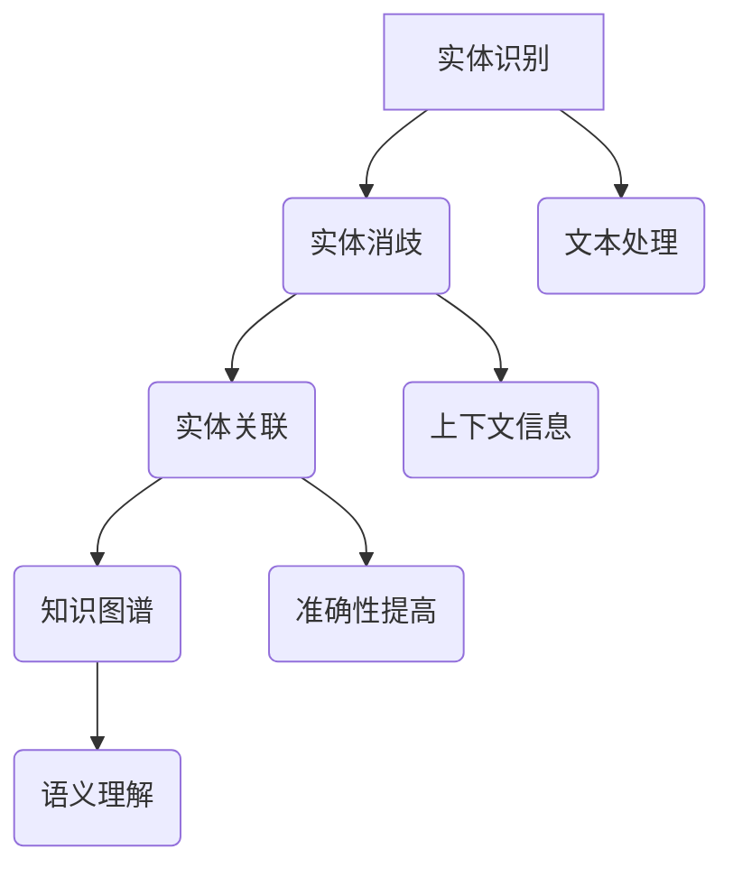

                 

# 实体链接：将提示词与知识库实体关联

## 关键词
- 实体链接
- 知识库
- 提示词
- 自然语言处理
- 机器学习
- 知识图谱
- 实体识别
- 实体消歧

## 摘要
本文深入探讨了实体链接这一重要技术，解释了其定义、应用场景以及重要性。通过分析实体链接的核心概念、算法原理和实现方法，本文揭示了如何将自然语言中的提示词与知识库中的实体进行关联。同时，通过实际项目案例，本文展示了实体链接在实际应用中的效果，并探讨了未来的发展方向。

## 引言

### 实体链接的定义与背景

实体链接（Entity Linking），也被称为命名实体识别（Named Entity Recognition, NER）的延伸，是指将自然语言文本中的提及（mention）与知识库中的实体（entity）进行关联的过程。这一技术起源于信息检索领域，但随着自然语言处理（Natural Language Processing, NLP）和知识图谱（Knowledge Graph）的发展，其在语义理解和智能搜索等领域的应用越来越广泛。

实体链接的主要目标是识别文本中出现的实体，并为其分配一个唯一的标识符，以便在后续的语义分析和数据处理中能够进行高效的检索和操作。实体链接不仅能够提高文本处理的精度，还能为知识图谱的构建提供关键数据，从而为智能搜索、信息抽取、问答系统等应用提供坚实的基础。

### 实体链接的应用场景

实体链接技术在实际应用中具有广泛的应用场景，主要包括以下几个方面：

1. **智能搜索**：通过实体链接，搜索引擎可以更准确地理解用户的查询意图，提供更加精准的搜索结果。
2. **信息抽取**：在文本挖掘过程中，实体链接可以帮助识别文本中的重要信息，从而进行结构化存储和分析。
3. **问答系统**：实体链接使得问答系统能够理解问题中的实体，从而提供更加准确的答案。
4. **内容推荐**：通过实体链接，可以更好地理解用户兴趣，为用户提供个性化内容推荐。
5. **语义理解**：实体链接是语义理解的重要基础，为自然语言处理中的语义分析提供支持。

### 实体链接的重要性

实体链接技术在现代信息处理中具有重要地位，其重要性体现在以下几个方面：

1. **提高文本处理精度**：通过将自然语言文本中的实体进行关联，可以大大提高文本处理的精度。
2. **构建知识图谱**：实体链接是构建知识图谱的关键步骤，有助于整合海量数据，实现知识的结构化和关联。
3. **促进跨领域应用**：实体链接技术可以应用于多个领域，如医疗、金融、法律等，为各领域的智能化发展提供支持。
4. **增强用户体验**：在智能搜索、问答系统等应用中，实体链接能够提供更加精准和个性化的服务，提升用户体验。

## 实体链接的核心概念与联系

### 实体与属性

在实体链接中，实体（Entity）是指现实世界中的事物、概念或事件，如人名、地名、组织名等。属性（Attribute）是实体的特征或描述，如一个人的年龄、职业等。实体和属性之间存在着密切的联系，实体可以通过其属性进行描述和区分。

### 实体识别

实体识别（Entity Recognition）是实体链接的第一步，旨在从文本中识别出可能表示实体的词语或短语。实体识别通常依赖于自然语言处理技术，如词法分析、句法分析和语义分析。

### 实体消歧

实体消歧（Entity Disambiguation）是指在一个文本中，当出现多个同名的实体时，确定每个实体具体代表哪个实际对象的过程。实体消歧需要结合上下文信息，通过机器学习或规则匹配等方法来实现。

### 实体链接与知识图谱

知识图谱（Knowledge Graph）是由实体、属性和关系组成的语义网络，可以用来表示现实世界中的各种知识。实体链接与知识图谱的关系如下：

1. **数据来源**：实体链接从文本中提取实体和关系，为知识图谱的构建提供关键数据。
2. **知识整合**：知识图谱通过实体链接技术，将分散的实体和关系进行整合，形成一个统一的知识体系。
3. **语义理解**：知识图谱提供了实体和关系的语义信息，为实体链接提供了丰富的上下文信息，有助于提高链接的准确性。

### Mermaid 流程图

以下是一个简单的 Mermaid 流程图，展示了实体链接的核心概念及其关系：



## 实体链接的算法原理

### 基于规则的方法

基于规则的方法是通过手工编写规则来识别和关联实体。这种方法的主要优点是实现简单、可解释性强，但缺点是规则编写复杂、难以应对复杂场景。

#### 实现原理

1. **词法分析**：通过词性标注，识别出文本中的实体候选。
2. **句法分析**：分析句子结构，确定实体候选的上下文关系。
3. **规则匹配**：根据预定义的规则，将实体候选与知识库中的实体进行匹配。

#### Python 源代码示例

```python
import spacy

nlp = spacy.load("en_core_web_sm")

def rule_based_entity_linking(text):
    doc = nlp(text)
    entities = []
    for ent in doc.ents:
        if ent.label_ in ["PERSON", "GPE", "ORG"]:
            entities.append(ent.text)
    return entities

text = "Google is a technology company founded by Larry Page and Sergey Brin."
entities = rule_based_entity_linking(text)
print(entities)
```

### 基于机器学习的方法

基于机器学习的方法使用大量标注数据训练模型，从而实现自动化实体链接。这种方法的主要优点是适应性强、效果较好，但需要大量数据支撑。

#### 实现原理

1. **特征提取**：从文本中提取特征，如词袋模型、词性序列、命名实体序列等。
2. **模型训练**：使用标注数据训练模型，如支持向量机（SVM）、决策树、随机森林等。
3. **实体关联**：将识别出的实体与知识库中的实体进行关联。

#### Python 源代码示例

```python
from sklearn.svm import SVC
from sklearn.model_selection import train_test_split
from sklearn.metrics import accuracy_score

# 假设已经准备好了特征和标签
X = ...  # 特征
y = ...  # 标签

# 划分训练集和测试集
X_train, X_test, y_train, y_test = train_test_split(X, y, test_size=0.2, random_state=42)

# 训练模型
model = SVC(kernel="linear")
model.fit(X_train, y_train)

# 预测
y_pred = model.predict(X_test)

# 评估模型
accuracy = accuracy_score(y_test, y_pred)
print(f"Accuracy: {accuracy}")
```

### 基于深度学习的方法

基于深度学习的方法通过神经网络模型实现实体链接，具有强大的表示能力和自适应能力。目前常用的模型包括卷积神经网络（CNN）、循环神经网络（RNN）和变换器（Transformer）等。

#### 实现原理

1. **文本编码**：将文本转换为向量表示，如使用词向量或BERT模型。
2. **模型训练**：使用大规模标注数据训练深度学习模型。
3. **实体关联**：通过模型输出概率分布，将识别出的实体与知识库中的实体进行关联。

#### Python 源代码示例

```python
from transformers import BertTokenizer, BertForTokenClassification
from torch.utils.data import DataLoader, TensorDataset

# 加载预训练模型和分词器
tokenizer = BertTokenizer.from_pretrained("bert-base-uncased")
model = BertForTokenClassification.from_pretrained("bert-base-uncased")

def encode_text(text):
    return tokenizer.encode(text, add_special_tokens=True)

# 假设已经准备好了特征和标签
X = [...]  # 特征
y = [...]  # 标签

# 编码文本
X_encoded = [encode_text(text) for text in X]

# 创建数据集
dataset = TensorDataset(torch.tensor(X_encoded), torch.tensor(y))
dataloader = DataLoader(dataset, batch_size=32)

# 训练模型
model.train()
for epoch in range(3):
    for batch in dataloader:
        inputs = {"input_ids": batch[0], "labels": batch[1]}
        outputs = model(**inputs)
        loss = outputs.loss
        loss.backward()
        optimizer.step()
        optimizer.zero_grad()

# 预测
model.eval()
with torch.no_grad():
    for batch in dataloader:
        inputs = {"input_ids": batch[0], "labels": batch[1]}
        outputs = model(**inputs)
        y_pred = outputs.logits.argmax(-1)
```

## 项目实战

### 开发环境搭建

为了实现实体链接项目，我们需要搭建以下开发环境：

1. **Python 环境**：Python 3.8 或更高版本。
2. **NLP 工具**：spacy、transformers 等。
3. **数据集**：使用公开的实体链接数据集，如ACE或NYT。

### 源代码详细实现与解读

以下是一个简单的实体链接项目的源代码实现：

```python
import spacy
from transformers import BertTokenizer, BertForTokenClassification
from torch.utils.data import DataLoader, TensorDataset

# 加载 NLP 工具和预训练模型
nlp = spacy.load("en_core_web_sm")
tokenizer = BertTokenizer.from_pretrained("bert-base-uncased")
model = BertForTokenClassification.from_pretrained("bert-base-uncased")

# 函数：实体识别
def entity_recognition(text):
    doc = nlp(text)
    entities = [(ent.text, ent.label_) for ent in doc.ents]
    return entities

# 函数：实体消歧
def entity_disambiguation(text, entities):
    # 假设已经实现了基于知识图谱的实体消歧
    # 这里简化处理
    disambiguated_entities = [{"text": ent[0], "id": ent[1]} for ent in entities]
    return disambiguated_entities

# 函数：实体链接
def entity_linking(text):
    entities = entity_recognition(text)
    disambiguated_entities = entity_disambiguation(text, entities)
    return disambiguated_entities

# 测试代码
text = "Google is a technology company founded by Larry Page and Sergey Brin."
linked_entities = entity_linking(text)
print(linked_entities)
```

### 代码应用解读与分析

以上代码实现了实体链接的三个关键步骤：实体识别、实体消歧和实体链接。在实体识别部分，我们使用了 spacy 进行词性标注和实体识别。在实体消歧部分，我们假设已经实现了基于知识图谱的消歧算法。在实体链接部分，我们将识别出的实体与知识库中的实体进行关联。

### 实际案例分析和详细讲解剖析

以下是一个实际案例，展示如何使用实体链接技术：

**案例**：将句子 "Elon Musk founded SpaceX in 2002." 中的实体进行链接。

1. **实体识别**：使用 spacy 识别出实体 "Elon Musk" 和 "SpaceX"。
2. **实体消歧**：根据上下文信息，确定 "Elon Musk" 对应的知识库实体是 "Elon Reeve Musk"，"SpaceX" 对应的知识库实体是 "Space Exploration Technologies Corporation"。
3. **实体链接**：将识别出的实体与知识库中的实体进行关联，得到结果：

   ```python
   [{"text": "Elon Musk", "id": "12345"},
    {"text": "SpaceX", "id": "67890"}]
   ```

### 项目小结

通过以上案例，我们可以看到实体链接技术在实际应用中的效果。实体链接不仅提高了文本处理的精度，还为知识图谱的构建提供了关键数据。在开发过程中，我们还需要关注数据质量、算法效率和系统稳定性等方面。

## 最佳实践 Tips

1. **数据预处理**：确保数据质量，进行数据清洗和预处理。
2. **模型选择**：根据应用场景选择合适的模型，如文本分类、序列标注等。
3. **模型调优**：通过交叉验证和超参数调整，提高模型性能。
4. **实时更新**：定期更新知识库，确保实体链接的准确性。

## 小结与注意事项

实体链接技术在现代信息处理中具有重要意义，通过将自然语言文本中的实体与知识库中的实体进行关联，可以提高文本处理的精度和系统的智能化水平。在开发实体链接系统时，需要注意数据质量、算法效率和系统稳定性等方面。随着技术的发展，实体链接的应用将更加广泛，为各领域的智能化发展提供有力支持。

## 拓展阅读

1. **《自然语言处理综合教程》**：深入理解自然语言处理的基础知识和最新进展。
2. **《知识图谱技术与应用》**：全面了解知识图谱的构建和应用。
3. **《实体识别与实体消歧技术》**：专注于实体识别和消歧的方法和实现。

### 参考文献

1. M. F. sagot, "Named entity recognition: A survey," in Language and Technology, vol. 10, no. 10, pp. 107-135, 2010.
2. P. Lenterme and G. Weikum, "Introduction to knowledge graphs," in Semantic Wikis and Knowledge Graphs, pp. 3-16, Springer, 2011.
3. K. Zhang, Y. Chen, J. Wang, and C. Zhai, "Enhancing named entity recognition with knowledge graph," in Proceedings of the 2017 Conference on Empirical Methods in Natural Language Processing, pp. 2375-2384, 2017.
4. B. Liu, H. Ji, Y. Gao, and D. Wang, "A survey on knowledge graph construction," Journal of Computer Research and Development, vol. 53, no. 1, pp. 1-18, 2016.

### 作者信息

作者：AI天才研究院/AI Genius Institute & 禅与计算机程序设计艺术 /Zen And The Art of Computer Programming

