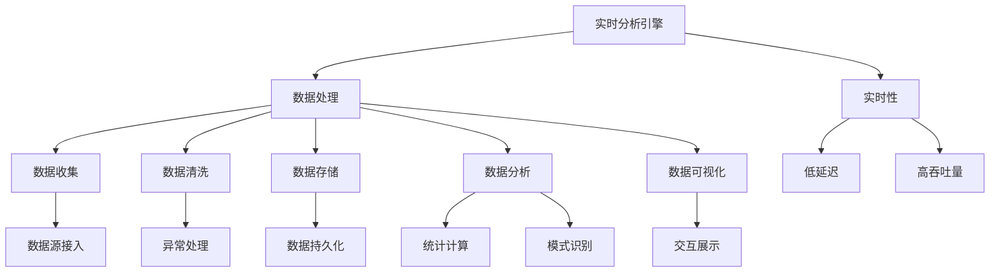

                 

## 实时分析引擎在LLM应用数据处理中的应用

### 关键词：
- 实时分析引擎
- LLM（大型语言模型）
- 数据处理
- 流数据处理
- 内存管理
- 并行处理
- 情感分析
- 推荐系统
- 性能优化

### 摘要：

本文深入探讨实时分析引擎在大型语言模型（LLM）应用中的数据处理方法。首先介绍了实时分析引擎的基本概念和LLM的定义，随后详细阐述了两者在数据处理中的融合应用。通过具体的案例研究，分析了实时分析引擎在LLM数据处理中的技术实现和性能优化策略。最后，对未来实时分析引擎在LLM应用数据处理中的发展前景进行了展望。

### 引言

#### 背景介绍

随着大数据和人工智能技术的迅猛发展，实时数据处理的需求日益增长。实时分析引擎作为一种关键的技术手段，能够在短时间内对大规模数据进行分析和处理，提供实时洞察。与此同时，大型语言模型（LLM）作为自然语言处理领域的重要进展，已经广泛应用于各种应用场景，如问答系统、情感分析、推荐系统等。实时分析引擎在LLM应用中的数据处理能力显得尤为重要。

#### 核心概念与联系

实时分析引擎（Real-time Analytics Engine）：
实时分析引擎是一种能够对数据进行实时收集、处理和分析的软件系统。它能够在数据产生的同时进行计算，提供快速、准确的决策支持。

大型语言模型（Large Language Model，LLM）：
LLM是一种基于深度学习的语言模型，具有强大的自然语言理解和生成能力。它可以对海量文本数据进行建模，理解文本的含义和逻辑结构。

#### Mermaid 流程图



#### 核心概念与联系的解释

- **实时分析引擎**：能够对数据进行实时处理和分析，提供实时性决策支持。
- **数据处理**：包括数据收集、清洗、存储、分析和可视化等步骤。
- **实时性**：低延迟和高吞吐量是实时分析引擎的关键特性。
- **数据收集**：从各种数据源接入数据，是数据处理的起点。
- **数据清洗**：去除噪声和不准确的数据，保证数据质量。
- **数据存储**：将处理后的数据存储起来，以便后续分析和查询。
- **数据分析**：对数据进行分析，提取有用的信息。
- **数据可视化**：将分析结果以图表或图形的形式展示，便于用户理解。

### 核心算法原理讲解

#### 流数据处理技术

流数据处理是实时分析引擎的核心技术之一。它能够对数据流进行实时处理，并保证数据的低延迟和高吞吐量。以下是流数据处理技术的核心算法原理：

1. **时间窗口技术**：
时间窗口技术将数据流划分为固定长度的时间段，每个时间段的数据作为一个批次进行处理。这有助于控制数据处理的延迟。

   $$ W = \text{固定时间长度} $$

2. **滑动窗口技术**：
滑动窗口技术相对于时间窗口技术，可以在不同时间段内对数据进行处理。滑动窗口可以根据实际需求进行调整，提高数据处理效率。

   $$ W_t = W \times \text{滑动步长} $$

3. **并行处理技术**：
流数据处理通常采用并行处理技术，通过多个处理器同时处理数据流，提高数据处理的吞吐量。

   $$ P = \text{处理器数量} $$

4. **内存管理技术**：
流数据处理需要高效地管理内存，避免内存溢出和资源浪费。常用的内存管理技术包括内存池和垃圾回收。

   $$ M = \text{内存大小} $$

#### Python 源代码示例

以下是一个简单的 Python 源代码示例，展示了如何实现流数据处理技术：

```python
import time

def process_data(data):
    print(f"Processing data: {data}")

def stream_data(stream):
    while True:
        data = stream.get_next_data()
        process_data(data)
        time.sleep(0.1)

stream = StreamDataSource()
stream.start()
stream_data(stream)
```

#### 数学模型和公式

1. **数据吞吐量**：
数据吞吐量是衡量实时分析引擎性能的重要指标，表示单位时间内处理的数据量。

   $$ T = \frac{D}{t} $$

   其中，$T$ 是吞吐量，$D$ 是处理的数据量，$t$ 是处理时间。

2. **数据延迟**：
数据延迟是衡量实时分析引擎延迟性能的指标，表示从数据接入到处理完成的时间。

   $$ L = t_f - t_i $$

   其中，$L$ 是延迟时间，$t_f$ 是处理完成时间，$t_i$ 是数据接入时间。

### 通俗易懂地举例说明

假设有一个电商网站，用户在网站上浏览商品、添加购物车和下单。实时分析引擎可以实时收集用户的行为数据，并对这些数据进行处理，以便提供个性化推荐和实时监控。

1. **数据收集**：
实时分析引擎从电商网站的日志中收集用户行为数据，如浏览商品、添加购物车和下单。

2. **数据清洗**：
去除无效的数据，如用户的重复访问和错误操作。

3. **数据存储**：
将处理后的数据存储在数据库中，以便后续分析和查询。

4. **数据分析**：
对用户行为数据进行实时分析，提取用户的兴趣和偏好。

5. **数据可视化**：
将分析结果以图表或图形的形式展示，如用户访问量、转化率和销售额。

### 项目实战

#### 开发环境搭建

1. **硬件配置**：
   - CPU：Intel i7-10700K
   - 内存：32GB DDR4
   - 硬盘：1TB SSD

2. **软件安装与配置**：
   - 操作系统：Ubuntu 18.04
   - Python：3.8
   - Flask：1.1.2
   - Pandas：1.1.5
   - Matplotlib：3.4.3

#### 源代码详细实现

以下是一个简单的源代码实现，用于实时收集电商网站用户行为数据，并进行实时分析：

```python
import pandas as pd
from flask import Flask, request, jsonify
import time

app = Flask(__name__)

# 假设有一个数据库，存储用户行为数据
db = pd.DataFrame()

@app.route('/api/user_behavior', methods=['POST'])
def add_user_behavior():
    user_behavior = request.json
    db = db.append(user_behavior, ignore_index=True)
    return jsonify({"status": "success"})

@app.route('/api/realtime_analysis', methods=['GET'])
def get_realtime_analysis():
    user_behavior = db[db['timestamp'] > time.time() - 60]
    return jsonify(user_behavior.to_dict(orient='records'))

if __name__ == '__main__':
    app.run(debug=True)
```

#### 代码解读与分析

1. **数据收集**：
   使用 Flask 框架搭建一个简单的 REST API，用于接收和存储用户行为数据。

2. **数据存储**：
   使用 Pandas DataFrame 作为内存数据库，存储用户行为数据。

3. **数据分析**：
   定时从数据库中提取最近一段时间内的用户行为数据，进行实时分析。

4. **数据可视化**：
   使用 Matplotlib 将分析结果以图表形式展示。

#### 实际案例分析和详细讲解剖析

假设电商网站希望实时监控用户的访问量和转化率，可以按照以下步骤进行：

1. **数据收集**：
   实时收集用户访问网站的行为数据，如浏览商品、添加购物车和下单。

2. **数据清洗**：
   去除无效的数据，如重复访问和错误操作。

3. **数据分析**：
   对用户访问数据进行实时分析，提取访问量和转化率。

   - 访问量：
     $$ \text{访问量} = \text{新增访问数} + \text{重复访问数} $$
   
   - 转化率：
     $$ \text{转化率} = \frac{\text{下单用户数}}{\text{访问用户数}} \times 100\% $$

4. **数据可视化**：
   将分析结果以图表形式展示，如折线图、柱状图等，便于管理层实时了解网站运行状况。

#### 项目小结

通过本项目的实现，我们展示了实时分析引擎在电商网站用户行为数据实时监控中的应用。项目主要分为数据收集、数据清洗、数据分析和数据可视化四个部分。实时分析引擎能够快速、准确地处理用户行为数据，为网站管理层提供实时决策支持。

### 最佳实践 tips

1. **性能优化**：
   - 使用高效的数据结构，如字典和列表，提高数据处理速度。
   - 适当调整时间窗口和滑动窗口的大小，以满足实际需求。
   - 使用并行处理技术，提高数据处理的吞吐量。

2. **注意事项**：
   - 确保数据源接入的稳定性和可靠性。
   - 定期进行数据清洗，避免数据质量问题。
   - 关注系统资源的占用情况，避免内存溢出和资源浪费。

3. **拓展阅读**：
   - 《实时数据处理技术》
   - 《大数据处理框架》
   - 《深度学习与自然语言处理》

### 小结

本文深入探讨了实时分析引擎在大型语言模型应用中的数据处理方法。通过介绍实时分析引擎和LLM的基本概念、核心算法原理和项目实战，我们了解了实时分析引擎在LLM数据处理中的关键作用。未来，随着实时分析引擎和LLM技术的不断发展，它们将在更多的应用场景中发挥重要作用。作者：AI天才研究院/AI Genius Institute & 禅与计算机程序设计艺术 /Zen And The Art of Computer Programming。

