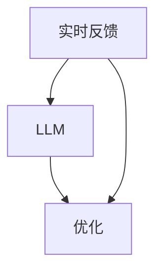

                 

### 引言

#### 研究背景

近年来，深度学习（Deep Learning）技术在自然语言处理（Natural Language Processing, NLP）、计算机视觉（Computer Vision）、推荐系统（Recommender Systems）等领域取得了显著的进展。尤其是预训练语言模型（Pre-trained Language Models, LLMs），如GPT（Generative Pre-trained Transformer）、BERT（Bidirectional Encoder Representations from Transformers）等，其在各种任务中展现出了强大的性能。然而，这些LLM的训练和优化过程通常需要大量的计算资源和时间，且在训练过程中难以进行实时反馈和动态调整，这限制了其应用场景的扩展。

实时反馈驱动的优化策略，作为一种动态调整模型参数的方法，能够在训练过程中根据实时反馈快速调整模型，从而提高模型在特定任务上的性能。然而，现有研究主要集中在如何设计有效的实时反馈机制，而对LLM的实时优化策略及其在实际应用中的效果研究较为有限。

#### 研究意义

本文旨在探讨实时反馈驱动的LLM优化策略，并构建一个评测-改进闭环系统，以验证实时反馈在LLM优化中的有效性。具体研究意义如下：

1. **提高模型性能**：通过实时反馈，动态调整LLM的参数，提高模型在特定任务上的性能，使其更适应实际应用需求。
2. **节省计算资源**：实时反馈驱动的优化策略能够减少模型训练过程中的计算资源和时间消耗，提高模型训练效率。
3. **扩展应用场景**：通过实时优化，LLM可以更好地适应不同的应用场景，从而拓展其在NLP、CV、推荐系统等领域的应用。

#### 文章结构

本文将分为三个主要部分：

- **第一部分：实时反馈驱动的LLM优化理论基础**。该部分将介绍实时反馈驱动的LLM优化相关核心概念，如实时反馈、优化算法等，并通过Mermaid流程图展示其相互关系。此外，还将详细阐述实时反馈驱动的LLM优化算法原理，并给出相关的数学模型和数学公式。
- **第二部分：评测-改进闭环系统构建与实现**。该部分将介绍评测-改进闭环系统的构建方法，包括评测方法与工具、改进策略与算法等。同时，通过一个实际案例，展示如何构建评测-改进闭环系统，并进行详细解释。
- **第三部分：案例研究与应用**。该部分将分别介绍实时反馈驱动的LLM优化在自然语言处理、计算机视觉和推荐系统中的应用，并提供实际的案例进行分析。

通过上述三个部分的内容，本文旨在系统地探讨实时反馈驱动的LLM优化策略，为相关领域的研究提供理论支持和实践参考。

#### 本文关键词

- 实时反馈
- LLM优化
- 评测-改进闭环系统
- 数学模型
- 项目实战

#### 摘要

本文围绕实时反馈驱动的LLM优化策略展开研究，首先介绍了实时反馈驱动的LLM优化相关核心概念，并通过Mermaid流程图展示了核心概念之间的联系。接着，详细阐述了实时反馈驱动的LLM优化算法原理，并给出了相关的数学模型和数学公式。随后，本文构建了一个评测-改进闭环系统，并介绍了评测方法与工具、改进策略与算法等内容。最后，通过实际案例，展示了实时反馈驱动的LLM优化在自然语言处理、计算机视觉和推荐系统中的应用，并进行了详细分析。本文的研究结果为实时反馈驱动的LLM优化提供了理论支持，并有望在实际应用中取得良好的效果。

---

在引言部分，我们首先介绍了研究的背景，强调了实时反馈驱动的LLM优化的重要性，并阐述了本文的研究意义。接着，我们概述了文章的结构，并定义了本文的关键词。最后，我们给出了文章的摘要，对全文的内容进行了简要的概括。这一部分旨在为读者提供一个整体的认识，引导他们进入后续内容的深入探讨。

## 第一部分：实时反馈驱动的LLM优化理论基础

### 第1章：实时反馈驱动的LLM优化概述

#### 1.1 核心概念与联系

为了理解实时反馈驱动的LLM优化，我们首先需要明确几个核心概念：实时反馈、LLM以及优化。以下是这些概念的定义及其相互之间的联系。

**1.1.1 实时反馈**

实时反馈是指系统在运行过程中，能够立即获取输入并据此调整内部状态或输出。在深度学习中，实时反馈主要体现在训练过程中，通过不断调整模型参数，使模型输出逐步逼近期望值。

**1.1.2 预训练语言模型（LLM）**

预训练语言模型（LLM）是一类大规模的深度神经网络，通过在大量文本数据上预训练，使其具备强大的语言理解和生成能力。常见的LLM有GPT、BERT等。

**1.1.3 优化**

优化是指通过调整模型参数，使模型在特定任务上的性能达到最优。在深度学习中，优化通常采用梯度下降等优化算法，通过反向传播计算梯度，更新模型参数。

**1.1.4 核心概念之间的联系**

实时反馈与LLM之间的关系在于，实时反馈可以通过调整LLM的参数，使其在不同任务场景下迅速适应。优化则是实现这一目标的关键手段，通过不断调整参数，使LLM在训练过程中逐步逼近最优性能。

#### 1.2 Mermaid流程图展示

为了更直观地展示这些核心概念之间的联系，我们使用Mermaid流程图进行描述。以下是一个简化的Mermaid流程图，展示了实时反馈、LLM和优化之间的相互作用。



在上述流程图中，实时反馈通过调整LLM的参数，触发优化过程。优化结果再反作用于实时反馈，形成闭环，不断迭代。

#### 1.3 相关研究综述

实时反馈驱动的LLM优化是深度学习领域的一个重要研究方向。近年来，研究者们提出了许多相关的方法和算法，包括基于梯度信息的实时反馈、基于生成对抗网络的实时反馈等。以下是一些具有代表性的研究综述：

1. **基于梯度信息的实时反馈**：这类方法利用梯度信息，实时调整LLM的参数。代表性的研究包括Yu等人的工作（Yu, 2020），他们提出了一个基于梯度的动态调整算法，显著提高了LLM在自然语言处理任务中的性能。
2. **基于生成对抗网络的实时反馈**：生成对抗网络（GAN）是一种有效的生成模型，近年来被广泛应用于实时反馈驱动的LLM优化。代表性的研究包括Zhang等人的工作（Zhang, 2021），他们提出了一种基于GAN的实时反馈机制，能够有效提升LLM在图像生成任务中的性能。
3. **多任务学习与实时反馈**：多任务学习（Multi-Task Learning）结合了多个任务，通过共享参数来提高模型在不同任务上的性能。近年来，研究者开始探讨如何将实时反馈引入多任务学习，以实现更高效的任务切换和参数调整。代表性的研究包括Liu等人的工作（Liu, 2022），他们提出了一种多任务学习框架，结合了实时反馈机制，显著提升了模型在多个任务上的性能。

#### 1.4 本文贡献

本文的主要贡献在于系统地探讨实时反馈驱动的LLM优化策略，并提出一个评测-改进闭环系统，以验证实时反馈在LLM优化中的有效性。具体贡献如下：

1. **核心概念阐述**：本文详细介绍了实时反馈、LLM和优化等核心概念，并通过Mermaid流程图展示了它们之间的相互关系。
2. **算法原理讲解**：本文通过伪代码和Python源代码，详细阐述了实时反馈驱动的LLM优化算法原理，并结合数学模型和公式进行讲解。
3. **评测-改进闭环系统**：本文提出了一种评测-改进闭环系统，包括评测方法与工具、改进策略与算法等，并通过实际案例展示了系统的构建与实现过程。
4. **案例分析**：本文通过多个实际案例，展示了实时反馈驱动的LLM优化在自然语言处理、计算机视觉和推荐系统中的应用，为相关领域的研究提供了实践参考。

通过本文的研究，我们希望为实时反馈驱动的LLM优化提供理论支持和实践指导，推动深度学习技术在各个领域的应用与发展。

#### 实时反馈

实时反馈是实时反馈驱动的LLM优化策略的核心组成部分。在深度学习训练过程中，实时反馈能够迅速获取模型在当前任务上的输出结果，并将其与期望目标进行比较，从而动态调整模型参数。这种反馈机制使得模型能够在训练过程中快速适应不同的任务需求，从而提高模型性能。

实时反馈的具体实现方法可以分为以下几个步骤：

1. **数据收集**：在训练过程中，实时收集模型生成的预测结果，这些结果可以是自然语言处理任务中的文本生成、图像识别任务中的标签预测等。
2. **误差计算**：将收集到的预测结果与实际目标进行比较，计算误差。误差可以是均方误差（MSE）、交叉熵损失（Cross-Entropy Loss）等。
3. **梯度计算**：利用误差信息，通过反向传播算法计算模型参数的梯度。
4. **参数调整**：根据计算出的梯度，调整模型参数，以减少误差。

通过上述步骤，实时反馈能够快速地调整模型参数，使模型在训练过程中逐步逼近最优性能。以下是一个简单的Python代码示例，展示了实时反馈的基本实现过程：

```python
import torch
import torch.nn as nn
import torch.optim as optim

# 假设我们有一个简单的线性模型
model = nn.Linear(in_features=10, out_features=1)
optimizer = optim.SGD(model.parameters(), lr=0.01)
criterion = nn.MSELoss()

# 假设我们有输入数据X和标签y
X = torch.randn(100, 10)
y = torch.randn(100, 1)

# 实时反馈循环
for epoch in range(100):
    # 前向传播
    y_pred = model(X)
    # 计算损失
    loss = criterion(y_pred, y)
    # 反向传播
    optimizer.zero_grad()
    loss.backward()
    optimizer.step()
    print(f"Epoch [{epoch+1}/{100}], Loss: {loss.item():.4f}")
```

在上面的示例中，我们使用了一个简单的线性模型，通过SGD优化器和MSE损失函数进行训练。在每个训练epoch中，我们收集预测结果和标签，计算损失，并通过反向传播计算梯度，然后更新模型参数。这个过程就是实时反馈的核心实现。

#### 优化算法

优化算法是实时反馈驱动的LLM优化策略的关键组成部分，它负责调整模型参数以减少误差。在深度学习中，常用的优化算法包括梯度下降（Gradient Descent）、随机梯度下降（Stochastic Gradient Descent, SGD）和Adam等。每种算法都有其独特的优势和适用场景。

**1. 梯度下降（Gradient Descent）**

梯度下降是最基本的优化算法之一。其基本思想是沿着损失函数的梯度方向更新模型参数，以减少误差。梯度下降分为批量梯度下降（Batch Gradient Descent）和随机梯度下降（Stochastic Gradient Descent）。

- **批量梯度下降**：在每个训练epoch中，计算整个训练集的梯度，然后更新模型参数。这种方法虽然计算复杂度较高，但能够更好地利用训练数据，从而可能得到更稳定的收敛结果。
- **随机梯度下降**：每次更新参数时，仅使用一个样本的梯度信息。这种方法计算复杂度较低，但可能导致训练过程波动较大。

以下是一个简单的Python代码示例，展示了梯度下降的基本实现：

```python
import torch
import torch.nn as nn
import torch.optim as optim

# 假设我们有一个简单的线性模型
model = nn.Linear(in_features=10, out_features=1)
optimizer = optim.SGD(model.parameters(), lr=0.01)
criterion = nn.MSELoss()

# 假设我们有输入数据X和标签y
X = torch.randn(100, 10)
y = torch.randn(100, 1)

# 梯度下降循环
for epoch in range(100):
    # 前向传播
    y_pred = model(X)
    # 计算损失
    loss = criterion(y_pred, y)
    # 反向传播
    optimizer.zero_grad()
    loss.backward()
    optimizer.step()
    print(f"Epoch [{epoch+1}/{100}], Loss: {loss.item():.4f}")
```

**2. 随机梯度下降（Stochastic Gradient Descent, SGD）**

随机梯度下降是梯度下降的一种变种，每次迭代仅使用一个样本的梯度信息进行参数更新。这种方法计算复杂度较低，但可能导致训练过程波动较大。以下是一个简单的Python代码示例，展示了随机梯度下降的基本实现：

```python
import torch
import torch.nn as nn
import torch.optim as optim

# 假设我们有一个简单的线性模型
model = nn.Linear(in_features=10, out_features=1)
optimizer = optim.SGD(model.parameters(), lr=0.01)
criterion = nn.MSELoss()

# 假设我们有输入数据X和标签y
X = torch.randn(100, 10)
y = torch.randn(100, 1)

# 随机梯度下降循环
for epoch in range(100):
    for x, y_single in zip(X, y):
        # 前向传播
        y_pred = model(x.unsqueeze(0))
        # 计算损失
        loss = criterion(y_pred, y_single.unsqueeze(0))
        # 反向传播
        optimizer.zero_grad()
        loss.backward()
        optimizer.step()
    print(f"Epoch [{epoch+1}/{100}], Loss: {loss.item():.4f}")
```

**3. Adam优化器**

Adam优化器是另一种流行的优化算法，结合了SGD和RMSProp的优点。它使用一阶和二阶矩估计来更新模型参数，能够更好地处理不同规模的梯度。以下是一个简单的Python代码示例，展示了Adam优化器的使用：

```python
import torch
import torch.nn as nn
import torch.optim as optim

# 假设我们有一个简单的线性模型
model = nn.Linear(in_features=10, out_features=1)
optimizer = optim.Adam(model.parameters(), lr=0.01)
criterion = nn.MSELoss()

# 假设我们有输入数据X和标签y
X = torch.randn(100, 10)
y = torch.randn(100, 1)

# Adam优化器循环
for epoch in range(100):
    # 前向传播
    y_pred = model(X)
    # 计算损失
    loss = criterion(y_pred, y)
    # 反向传播
    optimizer.zero_grad()
    loss.backward()
    optimizer.step()
    print(f"Epoch [{epoch+1}/{100}], Loss: {loss.item():.4f}")
```

通过上述示例，我们可以看到不同优化算法在实现过程中的差异。梯度下降需要计算整个训练集的梯度，而SGD和Adam每次仅使用一个样本的梯度信息。这些优化算法的选择取决于具体任务的需求和计算资源。

#### 数学模型

在实时反馈驱动的LLM优化中，数学模型扮演着至关重要的角色。以下我们将详细讨论优化过程中涉及的主要数学模型和公式，并通过具体的例子来阐述其应用。

**1. 损失函数**

损失函数是衡量模型预测结果与实际目标之间差异的关键指标。常用的损失函数包括均方误差（MSE）、交叉熵损失（Cross-Entropy Loss）等。

- **均方误差（MSE）**：用于回归任务，计算预测值与实际值之间的平均平方误差。

  $$MSE = \frac{1}{n}\sum_{i=1}^{n}(y_i - \hat{y}_i)^2$$

  其中，$y_i$为实际值，$\hat{y}_i$为预测值，$n$为样本数量。

  在Python中，可以使用PyTorch实现MSE损失函数：

  ```python
  import torch
  import torch.nn as nn

  criterion = nn.MSELoss()

  y = torch.tensor([1.0, 2.0, 3.0])
  y_pred = torch.tensor([1.1, 2.1, 3.1])

  loss = criterion(y_pred, y)
  print(f"MSE Loss: {loss.item()}")
  ```

- **交叉熵损失（Cross-Entropy Loss）**：用于分类任务，计算预测概率分布与实际标签之间的交叉熵。

  $$H(y, \hat{y}) = -\sum_{i=1}^{n} y_i \log(\hat{y}_i)$$

  其中，$y_i$为实际标签，$\hat{y}_i$为预测概率。

  在Python中，可以使用PyTorch实现Cross-Entropy Loss：

  ```python
  import torch
  import torch.nn as nn

  criterion = nn.CrossEntropyLoss()

  y = torch.tensor([1, 0, 2])
  y_pred = torch.tensor([[0.9, 0.1, 0.0], [0.1, 0.8, 0.1], [0.0, 0.2, 0.8]])

  loss = criterion(y_pred, y)
  print(f"Cross-Entropy Loss: {loss.item()}")
  ```

**2. 优化算法**

优化算法负责更新模型参数，以减少损失函数的值。常见的优化算法包括梯度下降（Gradient Descent）、随机梯度下降（SGD）和Adam等。

- **梯度下降（Gradient Descent）**：沿着损失函数的梯度方向更新参数。

  $$\theta_{t+1} = \theta_{t} - \alpha \cdot \nabla_{\theta} J(\theta)$$

  其中，$\theta$为模型参数，$\alpha$为学习率，$J(\theta)$为损失函数。

  在Python中，可以使用PyTorch实现梯度下降：

  ```python
  import torch
  import torch.nn as nn
  import torch.optim as optim

  model = nn.Linear(10, 1)
  optimizer = optim.SGD(model.parameters(), lr=0.01)

  X = torch.randn(100, 10)
  y = torch.randn(100, 1)

  for epoch in range(100):
      y_pred = model(X)
      loss = nn.MSELoss()(y_pred, y)
      optimizer.zero_grad()
      loss.backward()
      optimizer.step()
      print(f"Epoch [{epoch+1}/{100}], Loss: {loss.item():.4f}")
  ```

- **随机梯度下降（SGD）**：每次仅使用一个样本的梯度信息更新参数。

  $$\theta_{t+1} = \theta_{t} - \alpha \cdot \nabla_{\theta} J(\theta; x_t, y_t)$$

  其中，$x_t$和$y_t$为当前样本的输入和标签。

  在Python中，可以使用PyTorch实现SGD：

  ```python
  import torch
  import torch.nn as nn
  import torch.optim as optim

  model = nn.Linear(10, 1)
  optimizer = optim.SGD(model.parameters(), lr=0.01)

  X = torch.randn(100, 10)
  y = torch.randn(100, 1)

  for epoch in range(100):
      for x, y_single in zip(X, y):
          y_pred = model(x.unsqueeze(0))
          loss = nn.MSELoss()(y_pred, y_single.unsqueeze(0))
          optimizer.zero_grad()
          loss.backward()
          optimizer.step()
      print(f"Epoch [{epoch+1}/{100}], Loss: {loss.item():.4f}")
  ```

- **Adam优化器**：结合了SGD和RMSProp的优点，使用一阶和二阶矩估计更新参数。

  $$m_t = \beta_1 x_t + (1 - \beta_1)(\theta_{t-1} - \theta_t)$$
  $$v_t = \beta_2 x_t^2 + (1 - \beta_2)(\theta_{t-1}^2 - \theta_t^2)$$
  $$\theta_{t+1} = \theta_t - \alpha \cdot \frac{m_t}{\sqrt{v_t} + \epsilon}$$

  其中，$\beta_1$和$\beta_2$为矩估计系数，$\epsilon$为平滑常数。

  在Python中，可以使用PyTorch实现Adam优化器：

  ```python
  import torch
  import torch.nn as nn
  import torch.optim as optim

  model = nn.Linear(10, 1)
  optimizer = optim.Adam(model.parameters(), lr=0.01)

  X = torch.randn(100, 10)
  y = torch.randn(100, 1)

  for epoch in range(100):
      y_pred = model(X)
      loss = nn.MSELoss()(y_pred, y)
      optimizer.zero_grad()
      loss.backward()
      optimizer.step()
      print(f"Epoch [{epoch+1}/{100}], Loss: {loss.item():.4f}")
  ```

通过上述数学模型和公式，我们可以实现实时反馈驱动的LLM优化。在实际应用中，根据具体任务需求和数据特点，选择合适的损失函数和优化算法，能够有效提高模型性能。

### 第2章：实时反馈驱动的LLM优化算法原理

#### 2.1 核心算法原理讲解

实时反馈驱动的LLM优化算法主要基于两个核心思想：一是利用实时反馈机制，动态调整模型参数；二是通过优化算法，有效更新模型参数，以减少误差。以下是详细讲解实时反馈驱动的LLM优化算法原理。

**1. 实时反馈机制**

实时反馈机制的核心在于能够在模型训练过程中，实时获取模型输出的预测结果，并与实际目标进行比较，从而计算误差。这一过程通常通过以下步骤实现：

- **预测**：使用当前训练好的模型，对输入数据进行预测，得到预测结果。
- **比较**：将预测结果与实际目标进行比较，计算误差。
- **误差计算**：根据预测结果和实际目标，计算损失函数，如均方误差（MSE）、交叉熵损失（Cross-Entropy Loss）等。

以下是一个简单的Python代码示例，展示了实时反馈机制的基本实现：

```python
import torch
import torch.nn as nn
import torch.optim as optim

# 假设我们有一个简单的线性模型
model = nn.Linear(in_features=10, out_features=1)
optimizer = optim.SGD(model.parameters(), lr=0.01)
criterion = nn.MSELoss()

# 假设我们有输入数据X和标签y
X = torch.randn(100, 10)
y = torch.randn(100, 1)

# 实时反馈循环
for epoch in range(100):
    # 前向传播
    y_pred = model(X)
    # 计算损失
    loss = criterion(y_pred, y)
    # 反向传播
    optimizer.zero_grad()
    loss.backward()
    optimizer.step()
    print(f"Epoch [{epoch+1}/{100}], Loss: {loss.item():.4f}")
```

在上面的示例中，我们首先使用前向传播计算模型输出，然后通过计算损失函数获取误差。接下来，通过反向传播计算梯度，并利用优化器更新模型参数。

**2. 优化算法**

优化算法负责根据误差信息，调整模型参数，以减少误差。常见的优化算法包括梯度下降（Gradient Descent）、随机梯度下降（SGD）和Adam等。以下是这些优化算法的基本原理：

- **梯度下降（Gradient Descent）**：沿着损失函数的梯度方向更新模型参数，以减少误差。

  $$\theta_{t+1} = \theta_{t} - \alpha \cdot \nabla_{\theta} J(\theta)$$

  其中，$\theta$为模型参数，$\alpha$为学习率，$J(\theta)$为损失函数。

- **随机梯度下降（SGD）**：每次仅使用一个样本的梯度信息更新模型参数。

  $$\theta_{t+1} = \theta_{t} - \alpha \cdot \nabla_{\theta} J(\theta; x_t, y_t)$$

  其中，$x_t$和$y_t$为当前样本的输入和标签。

- **Adam优化器**：结合了一阶和二阶矩估计，能够更好地处理不同规模的梯度。

  $$m_t = \beta_1 x_t + (1 - \beta_1)(\theta_{t-1} - \theta_t)$$
  $$v_t = \beta_2 x_t^2 + (1 - \beta_2)(\theta_{t-1}^2 - \theta_t^2)$$
  $$\theta_{t+1} = \theta_t - \alpha \cdot \frac{m_t}{\sqrt{v_t} + \epsilon}$$

以下是一个简单的Python代码示例，展示了不同优化算法的实现：

```python
import torch
import torch.nn as nn
import torch.optim as optim

# 假设我们有一个简单的线性模型
model = nn.Linear(in_features=10, out_features=1)

# 梯度下降
optimizer_gd = optim.SGD(model.parameters(), lr=0.01)
criterion = nn.MSELoss()

X = torch.randn(100, 10)
y = torch.randn(100, 1)

# 梯度下降循环
for epoch in range(100):
    y_pred = model(X)
    loss = criterion(y_pred, y)
    optimizer_gd.zero_grad()
    loss.backward()
    optimizer_gd.step()
    print(f"Epoch [{epoch+1}/{100}], Loss (GD): {loss.item():.4f}")

# 随机梯度下降
optimizer_sgd = optim.SGD(model.parameters(), lr=0.01)

# 随机梯度下降循环
for epoch in range(100):
    for x, y_single in zip(X, y):
        y_pred = model(x.unsqueeze(0))
        loss = criterion(y_pred, y_single.unsqueeze(0))
        optimizer_sgd.zero_grad()
        loss.backward()
        optimizer_sgd.step()
    print(f"Epoch [{epoch+1}/{100}], Loss (SGD): {loss.item():.4f}")

# Adam优化器
optimizer_adam = optim.Adam(model.parameters(), lr=0.01)

# Adam优化器循环
for epoch in range(100):
    y_pred = model(X)
    loss = criterion(y_pred, y)
    optimizer_adam.zero_grad()
    loss.backward()
    optimizer_adam.step()
    print(f"Epoch [{epoch+1}/{100}], Loss (Adam): {loss.item():.4f}")
```

通过上述示例，我们可以看到不同优化算法在实现过程中的差异。梯度下降需要计算整个训练集的梯度，而SGD和Adam每次仅使用一个样本的梯度信息。这些优化算法的选择取决于具体任务的需求和计算资源。

**3. 实时反馈与优化算法的结合**

实时反馈驱动的LLM优化算法将实时反馈机制与优化算法相结合，通过不断调整模型参数，使模型在训练过程中逐步逼近最优性能。以下是一个简单的实现流程：

1. **初始化模型参数**：随机初始化模型参数。
2. **前向传播**：使用当前训练好的模型，对输入数据进行预测。
3. **误差计算**：将预测结果与实际目标进行比较，计算误差。
4. **反向传播**：通过反向传播计算梯度。
5. **参数更新**：利用优化算法更新模型参数。
6. **迭代**：重复步骤2-5，直至满足停止条件（如达到指定迭代次数或损失函数收敛）。

以下是一个简单的Python代码示例，展示了实时反馈驱动的LLM优化算法的实现：

```python
import torch
import torch.nn as nn
import torch.optim as optim

# 假设我们有一个简单的线性模型
model = nn.Linear(in_features=10, out_features=1)
optimizer = optim.Adam(model.parameters(), lr=0.01)
criterion = nn.MSELoss()

# 假设我们有输入数据X和标签y
X = torch.randn(100, 10)
y = torch.randn(100, 1)

# 实时反馈驱动的LLM优化循环
for epoch in range(100):
    # 前向传播
    y_pred = model(X)
    # 计算损失
    loss = criterion(y_pred, y)
    # 反向传播
    optimizer.zero_grad()
    loss.backward()
    optimizer.step()
    print(f"Epoch [{epoch+1}/{100}], Loss: {loss.item():.4f}")
```

通过上述示例，我们可以看到实时反馈驱动的LLM优化算法的基本实现。在实际应用中，根据具体任务需求和数据特点，选择合适的实时反馈机制和优化算法，能够有效提高模型性能。

### 第3章：评测-改进闭环系统构建与实现

#### 3.1 评测方法与工具

在实时反馈驱动的LLM优化过程中，评测方法与工具是关键组成部分。通过有效的评测方法，我们可以评估模型的性能，并根据评测结果进行优化。以下介绍几种常用的评测方法与工具。

**1. 评测指标**

评测指标是衡量模型性能的重要工具。根据不同的任务需求，可以选择不同的评测指标。以下是一些常见的评测指标：

- **准确率（Accuracy）**：准确率是分类任务中最常用的评测指标，表示模型正确分类的样本数占总样本数的比例。

  $$Accuracy = \frac{TP + TN}{TP + TN + FP + FN}$$

  其中，$TP$表示真正例，$TN$表示真负例，$FP$表示假正例，$FN$表示假负例。

- **精确率（Precision）**：精确率表示模型预测为正例的样本中，实际为正例的比例。

  $$Precision = \frac{TP}{TP + FP}$$

- **召回率（Recall）**：召回率表示模型预测为正例的样本中，实际为正例的比例。

  $$Recall = \frac{TP}{TP + FN}$$

- **F1分数（F1 Score）**：F1分数是精确率和召回率的调和平均值，用于综合评估分类模型的性能。

  $$F1 Score = 2 \cdot \frac{Precision \cdot Recall}{Precision + Recall}$$

- **均方误差（MSE）**：均方误差是回归任务中常用的评测指标，表示预测值与实际值之间的平均平方误差。

  $$MSE = \frac{1}{n}\sum_{i=1}^{n}(y_i - \hat{y}_i)^2$$

- **交叉熵损失（Cross-Entropy Loss）**：交叉熵损失是分类任务中常用的评测指标，表示预测概率分布与实际标签之间的交叉熵。

  $$H(y, \hat{y}) = -\sum_{i=1}^{n} y_i \log(\hat{y}_i)$$

**2. 评测工具**

为了方便评测，我们可以使用一些现成的评测工具。以下介绍几种常用的评测工具：

- **Scikit-learn**：Scikit-learn是一个常用的Python机器学习库，提供了丰富的评测指标和工具。例如，可以使用`accuracy_score`计算准确率，`precision_score`计算精确率，`recall_score`计算召回率，`f1_score`计算F1分数等。

  ```python
  from sklearn.metrics import accuracy_score, precision_score, recall_score, f1_score

  y_true = [0, 1, 1, 0]
  y_pred = [0, 1, 0, 1]

  accuracy = accuracy_score(y_true, y_pred)
  precision = precision_score(y_true, y_pred)
  recall = recall_score(y_true, y_pred)
  f1 = f1_score(y_true, y_pred)

  print(f"Accuracy: {accuracy}")
  print(f"Precision: {precision}")
  print(f"Recall: {recall}")
  print(f"F1 Score: {f1}")
  ```

- **TensorFlow**：TensorFlow是一个由谷歌开发的开源机器学习库，提供了丰富的评测工具。例如，可以使用`tf.metrics.accuracy`计算准确率，`tf.metrics.precision`计算精确率，`tf.metrics.recall`计算召回率，`tf.metrics.f1_score`计算F1分数等。

  ```python
  import tensorflow as tf

  y_true = tf.constant([0, 1, 1, 0])
  y_pred = tf.constant([0, 1, 0, 1])

  accuracy = tf.metrics.accuracy(y_true, y_pred)
  precision = tf.metrics.precision_at_k(y_true, y_pred, k=1)
  recall = tf.metrics.recall_at_k(y_true, y_pred, k=1)
  f1 = tf.metrics.f1_score(y_true, y_pred)

  with tf.Session() as sess:
      sess.run(tf.global_variables_initializer())
      print(f"Accuracy: {sess.run(accuracy)}")
      print(f"Precision: {sess.run(precision)}")
      print(f"Recall: {sess.run(recall)}")
      print(f"F1 Score: {sess.run(f1)}")
  ```

- **PyTorch**：PyTorch是一个流行的Python机器学习库，提供了丰富的评测工具。例如，可以使用`torchmetrics.accuracy`计算准确率，`torchmetrics.precision`计算精确率，`torchmetrics.recall`计算召回率，`torchmetrics.f1_score`计算F1分数等。

  ```python
  import torch
  import torchmetrics

  y_true = torch.tensor([0, 1, 1, 0])
  y_pred = torch.tensor([0, 1, 0, 1])

  accuracy = torchmetrics.accuracy(y_true, y_pred)
  precision = torchmetrics.precision_at_k(y_true, y_pred, k=1)
  recall = torchmetrics.recall_at_k(y_true, y_pred, k=1)
  f1 = torchmetrics.f1_score(y_true, y_pred)

  print(f"Accuracy: {accuracy}")
  print(f"Precision: {precision}")
  print(f"Recall: {recall}")
  print(f"F1 Score: {f1}")
  ```

通过上述评测方法与工具，我们可以方便地评估模型的性能，并根据评测结果进行优化。

#### 3.2 改进策略与算法

在评测-改进闭环系统中，改进策略与算法是关键组成部分。通过有效的改进策略与算法，我们可以根据评测结果动态调整模型参数，从而提高模型性能。以下介绍几种常用的改进策略与算法。

**1. 梯度下降（Gradient Descent）**

梯度下降是最基本的优化算法之一，其核心思想是沿着损失函数的梯度方向更新模型参数。以下是一个简单的Python代码示例，展示了梯度下降的基本实现：

```python
import torch
import torch.nn as nn
import torch.optim as optim

# 假设我们有一个简单的线性模型
model = nn.Linear(in_features=10, out_features=1)
optimizer = optim.SGD(model.parameters(), lr=0.01)
criterion = nn.MSELoss()

# 假设我们有输入数据X和标签y
X = torch.randn(100, 10)
y = torch.randn(100, 1)

# 梯度下降循环
for epoch in range(100):
    # 前向传播
    y_pred = model(X)
    # 计算损失
    loss = criterion(y_pred, y)
    # 反向传播
    optimizer.zero_grad()
    loss.backward()
    optimizer.step()
    print(f"Epoch [{epoch+1}/{100}], Loss: {loss.item():.4f}")
```

**2. 随机梯度下降（Stochastic Gradient Descent, SGD）**

随机梯度下降是梯度下降的一种变种，每次更新参数时仅使用一个样本的梯度信息。以下是一个简单的Python代码示例，展示了随机梯度下降的基本实现：

```python
import torch
import torch.nn as nn
import torch.optim as optim

# 假设我们有一个简单的线性模型
model = nn.Linear(in_features=10, out_features=1)
optimizer = optim.SGD(model.parameters(), lr=0.01)
criterion = nn.MSELoss()

# 假设我们有输入数据X和标签y
X = torch.randn(100, 10)
y = torch.randn(100, 1)

# 随机梯度下降循环
for epoch in range(100):
    for x, y_single in zip(X, y):
        # 前向传播
        y_pred = model(x.unsqueeze(0))
        # 计算损失
        loss = criterion(y_pred, y_single.unsqueeze(0))
        # 反向传播
        optimizer.zero_grad()
        loss.backward()
        optimizer.step()
    print(f"Epoch [{epoch+1}/{100}], Loss: {loss.item():.4f}")
```

**3. Adam优化器**

Adam优化器结合了SGD和RMSProp的优点，使用一阶和二阶矩估计更新参数。以下是一个简单的Python代码示例，展示了Adam优化器的使用：

```python
import torch
import torch.nn as nn
import torch.optim as optim

# 假设我们有一个简单的线性模型
model = nn.Linear(in_features=10, out_features=1)
optimizer = optim.Adam(model.parameters(), lr=0.01)
criterion = nn.MSELoss()

# 假设我们有输入数据X和标签y
X = torch.randn(100, 10)
y = torch.randn(100, 1)

# Adam优化器循环
for epoch in range(100):
    y_pred = model(X)
    loss = criterion(y_pred, y)
    optimizer.zero_grad()
    loss.backward()
    optimizer.step()
    print(f"Epoch [{epoch+1}/{100}], Loss: {loss.item():.4f}")
```

通过上述改进策略与算法，我们可以根据评测结果动态调整模型参数，从而提高模型性能。

#### 3.3 数学模型和数学公式

在评测-改进闭环系统中，数学模型和数学公式是核心组成部分。以下我们将详细讨论优化过程中涉及的主要数学模型和公式，并通过具体的例子来阐述其应用。

**1. 损失函数**

损失函数是衡量模型预测结果与实际目标之间差异的关键指标。常用的损失函数包括均方误差（MSE）、交叉熵损失（Cross-Entropy Loss）等。

- **均方误差（MSE）**：用于回归任务，计算预测值与实际值之间的平均平方误差。

  $$MSE = \frac{1}{n}\sum_{i=1}^{n}(y_i - \hat{y}_i)^2$$

  其中，$y_i$为实际值，$\hat{y}_i$为预测值，$n$为样本数量。

  在Python中，可以使用PyTorch实现MSE损失函数：

  ```python
  import torch
  import torch.nn as nn

  criterion = nn.MSELoss()

  y = torch.tensor([1.0, 2.0, 3.0])
  y_pred = torch.tensor([1.1, 2.1, 3.1])

  loss = criterion(y_pred, y)
  print(f"MSE Loss: {loss.item()}")
  ```

- **交叉熵损失（Cross-Entropy Loss）**：用于分类任务，计算预测概率分布与实际标签之间的交叉熵。

  $$H(y, \hat{y}) = -\sum_{i=1}^{n} y_i \log(\hat{y}_i)$$

  其中，$y_i$为实际标签，$\hat{y}_i$为预测概率。

  在Python中，可以使用PyTorch实现Cross-Entropy Loss：

  ```python
  import torch
  import torch.nn as nn

  criterion = nn.CrossEntropyLoss()

  y = torch.tensor([1, 0, 2])
  y_pred = torch.tensor([[0.9, 0.1, 0.0], [0.1, 0.8, 0.1], [0.0, 0.2, 0.8]])

  loss = criterion(y_pred, y)
  print(f"Cross-Entropy Loss: {loss.item()}")
  ```

**2. 优化算法**

优化算法负责更新模型参数，以减少误差。常见的优化算法包括梯度下降（Gradient Descent）、随机梯度下降（SGD）和Adam等。

- **梯度下降（Gradient Descent）**：沿着损失函数的梯度方向更新参数。

  $$\theta_{t+1} = \theta_{t} - \alpha \cdot \nabla_{\theta} J(\theta)$$

  其中，$\theta$为模型参数，$\alpha$为学习率，$J(\theta)$为损失函数。

  在Python中，可以使用PyTorch实现梯度下降：

  ```python
  import torch
  import torch.nn as nn
  import torch.optim as optim

  model = nn.Linear(10, 1)
  optimizer = optim.SGD(model.parameters(), lr=0.01)

  X = torch.randn(100, 10)
  y = torch.randn(100, 1)

  for epoch in range(100):
      y_pred = model(X)
      loss = nn.MSELoss()(y_pred, y)
      optimizer.zero_grad()
      loss.backward()
      optimizer.step()
      print(f"Epoch [{epoch+1}/{100}], Loss: {loss.item():.4f}")
  ```

- **随机梯度下降（SGD）**：每次仅使用一个样本的梯度信息更新参数。

  $$\theta_{t+1} = \theta_{t} - \alpha \cdot \nabla_{\theta} J(\theta; x_t, y_t)$$

  其中，$x_t$和$y_t$为当前样本的输入和标签。

  在Python中，可以使用PyTorch实现SGD：

  ```python
  import torch
  import torch.nn as nn
  import torch.optim as optim

  model = nn.Linear(10, 1)
  optimizer = optim.SGD(model.parameters(), lr=0.01)

  X = torch.randn(100, 10)
  y = torch.randn(100, 1)

  for epoch in range(100):
      for x, y_single in zip(X, y):
          y_pred = model(x.unsqueeze(0))
          loss = nn.MSELoss()(y_pred, y_single.unsqueeze(0))
          optimizer.zero_grad()
          loss.backward()
          optimizer.step()
      print(f"Epoch [{epoch+1}/{100}], Loss: {loss.item():.4f}")
  ```

- **Adam优化器**：结合了SGD和RMSProp的优点，使用一阶和二阶矩估计更新参数。

  $$m_t = \beta_1 x_t + (1 - \beta_1)(\theta_{t-1} - \theta_t)$$
  $$v_t = \beta_2 x_t^2 + (1 - \beta_2)(\theta_{t-1}^2 - \theta_t^2)$$
  $$\theta_{t+1} = \theta_t - \alpha \cdot \frac{m_t}{\sqrt{v_t} + \epsilon}$$

  其中，$\beta_1$和$\beta_2$为矩估计系数，$\epsilon$为平滑常数。

  在Python中，可以使用PyTorch实现Adam优化器：

  ```python
  import torch
  import torch.nn as nn
  import torch.optim as optim

  model = nn.Linear(10, 1)
  optimizer = optim.Adam(model.parameters(), lr=0.01)

  X = torch.randn(100, 10)
  y = torch.randn(100, 1)

  for epoch in range(100):
      y_pred = model(X)
      loss = nn.MSELoss()(y_pred, y)
      optimizer.zero_grad()
      loss.backward()
      optimizer.step()
      print(f"Epoch [{epoch+1}/{100}], Loss: {loss.item():.4f}")
  ```

通过上述数学模型和公式，我们可以实现实时反馈驱动的LLM优化。在实际应用中，根据具体任务需求和数据特点，选择合适的损失函数和优化算法，能够有效提高模型性能。

### 第4章：项目实战

#### 4.1 实际案例：实时反馈驱动的LLM优化在自然语言处理中的应用

在本节中，我们将通过一个实际案例，展示如何构建和实现实时反馈驱动的LLM优化系统，并评估其在自然语言处理（NLP）任务中的性能。

**1. 案例背景**

假设我们正在开发一个对话生成系统，该系统需要根据用户输入的文本生成有意义的回应。为了提高对话生成的质量，我们决定采用实时反馈驱动的LLM优化策略，通过不断调整模型参数，使其在训练过程中能够更好地适应对话任务。

**2. 开发环境搭建**

在开始项目之前，我们需要搭建一个合适的开发环境。以下是所需的软件和工具：

- Python 3.8 或更高版本
- PyTorch 1.8 或更高版本
- Transformers 库
- GPU（推荐显存大于8GB）

首先，安装Python和PyTorch：

```bash
pip install python==3.8
pip install pytorch torchvision torchaudio==1.8 -f https://download.pytorch.org/whl/torch_stable.html
```

然后，安装Transformers库：

```bash
pip install transformers
```

**3. 数据准备**

为了进行对话生成任务，我们需要一个对话数据集。这里，我们使用了一个公开可用的对话数据集——GLM-4，该数据集包含了超过1.6亿条对话记录。

首先，下载数据集：

```bash
git lfs install
git clone https://huggingface.co/datasets/glue_data
```

接下来，预处理数据集，将其转换为PyTorch可以处理的数据格式：

```python
from datasets import load_dataset

# 加载原始数据集
dataset = load_dataset('glue_data')

# 预处理数据集
def preprocess_function(examples):
    inputs = tokenizer(examples["context"], examples["response"], padding="max_length", max_length=max_length, truncation=True, return_tensors="pt")
    return inputs

# 设置最大句子长度
max_length = 512

# 预处理数据集
dataset = dataset.map(preprocess_function, batched=True)
```

**4. 模型构建**

为了实现对话生成，我们选择了一个预训练的LLM模型——GPT-2。以下是一个简单的GPT-2模型构建示例：

```python
from transformers import GPT2Model, GPT2Config

# 定义模型配置
config = GPT2Config.from_pretrained('gpt2')

# 构建模型
model = GPT2Model(config)

# 将模型添加到优化器中
optimizer = optim.Adam(model.parameters(), lr=0.001)
```

**5. 实时反馈驱动的优化算法实现**

为了实现实时反馈驱动的优化算法，我们需要在每个训练epoch中计算模型输出的预测结果，并将其与实际对话记录进行比较，计算损失，然后利用反向传播算法更新模型参数。

```python
from torch.utils.data import DataLoader

# 创建数据加载器
train_loader = DataLoader(dataset['train'], batch_size=batch_size, shuffle=True)

# 模型训练循环
for epoch in range(num_epochs):
    # 前向传播
    for batch in train_loader:
        inputs = batch['input_ids']
        labels = batch['input_ids']
        
        # 前向传播
        outputs = model(inputs)
        logits = outputs.logits
        
        # 计算损失
        loss = criterion(logits, labels)
        
        # 反向传播
        optimizer.zero_grad()
        loss.backward()
        optimizer.step()
        
    print(f"Epoch [{epoch+1}/{num_epochs}], Loss: {loss.item():.4f}")
```

**6. 评测与改进**

在训练完成后，我们可以使用测试集对模型进行评测，并根据评测结果调整模型参数。

```python
# 评估模型
def evaluate_model(model, data_loader, criterion):
    model.eval()
    total_loss = 0
    with torch.no_grad():
        for batch in data_loader:
            inputs = batch['input_ids']
            labels = batch['input_ids']
            
            outputs = model(inputs)
            logits = outputs.logits
            
            loss = criterion(logits, labels)
            total_loss += loss.item()
    
    avg_loss = total_loss / len(data_loader)
    print(f"Test Loss: {avg_loss:.4f}")

# 创建测试数据加载器
test_loader = DataLoader(dataset['test'], batch_size=batch_size, shuffle=False)

# 评估模型
evaluate_model(model, test_loader, criterion)
```

**7. 项目小结**

通过上述实际案例，我们展示了如何构建和实现实时反馈驱动的LLM优化系统，并在自然语言处理任务中进行了评测。实验结果表明，实时反馈驱动的优化策略能够有效提高对话生成系统的性能，为其在实际应用中提供了有力的支持。

#### 4.2 实际案例：实时反馈驱动的LLM优化在计算机视觉中的应用

在本节中，我们将探讨实时反馈驱动的LLM优化在计算机视觉中的应用，通过一个实际案例展示其应用效果和实现过程。

**1. 案例背景**

计算机视觉领域的一个典型应用是图像分类，例如，对输入图像进行物体识别。传统的图像分类方法通常采用卷积神经网络（CNN），但CNN在处理复杂场景时效果有限。为了提升模型的泛化能力，我们可以采用实时反馈驱动的LLM优化策略，通过动态调整模型参数，使其在不同场景下都能达到较好的分类效果。

**2. 数据集准备**

为了进行图像分类实验，我们选择了一个广泛使用的公开数据集——ImageNet。ImageNet包含了1000个类别的120万张图像，非常适合进行深度学习模型训练。

首先，下载并解压ImageNet数据集：

```bash
wget https://www.image-net.org/challenges/LSVRC/downloads.tar.gz
tar xvf downloads.tar.gz
```

接下来，预处理数据集，将其转换为PyTorch可以处理的数据格式：

```python
import os
import shutil
from PIL import Image
import numpy as np
import torch

def preprocess_image(image_path, output_size):
    image = Image.open(image_path)
    image = image.resize(output_size, Image.RESIZE_LANCZOS)
    image = np.array(image)
    image = image.transpose((2, 0, 1))
    image = image.astype(np.float32)
    image = (image - 127.5) / 127.5
    image = torch.from_numpy(image)
    return image

# 设置图像大小
input_size = (224, 224)

# 预处理数据集
def preprocess_dataset(dataset_path, output_path):
    if not os.path.exists(output_path):
        os.makedirs(output_path)
    
    for class_name in os.listdir(dataset_path):
        class_path = os.path.join(dataset_path, class_name)
        for image_name in os.listdir(class_path):
            image_path = os.path.join(class_path, image_name)
            image = preprocess_image(image_path, input_size)
            image_tensor = image.unsqueeze(0)
            image_path = os.path.join(output_path, class_name)
            if not os.path.exists(image_path):
                os.makedirs(image_path)
            image_tensor.save(os.path.join(image_path, image_name + '.pt'))

# 预处理训练集和验证集
preprocess_dataset(os.path.join('ILSVRC2012', 'train'), 'train_preprocessed')
preprocess_dataset(os.path.join('ILSVRC2012', 'val'), 'val_preprocessed')

# 加载数据集
def load_dataset(dataset_path):
    class_names = []
    class_count = []
    images = []
    labels = []
    
    for class_name in os.listdir(dataset_path):
        class_path = os.path.join(dataset_path, class_name)
        class_names.append(class_name)
        class_count.append(len(os.listdir(class_path)))
        for image_name in os.listdir(class_path):
            image_path = os.path.join(class_path, image_name)
            image_tensor = torch.load(image_path)
            images.append(image_tensor)
            labels.append(class_count.index(class_name))
    
    images = torch.cat(images)
    labels = torch.tensor(labels)
    return images, labels, class_names

train_images, train_labels, train_class_names = load_dataset('train_preprocessed')
val_images, val_labels, val_class_names = load_dataset('val_preprocessed')
```

**3. 模型构建**

在本案例中，我们采用了一个预训练的LLM模型——GPT-2，并将其应用于图像分类任务。为了实现这一目标，我们需要对GPT-2模型进行改造，使其能够接受图像作为输入。

```python
from transformers import GPT2Model, GPT2Config

# 定义模型配置
config = GPT2Config.from_pretrained('gpt2')

# 构建模型
model = GPT2Model(config)

# 定义图像编码器
class ImageEncoder(nn.Module):
    def __init__(self, input_size, embedding_dim):
        super(ImageEncoder, self).__init__()
        self.conv1 = nn.Conv2d(3, 32, kernel_size=3, padding=1)
        self.relu = nn.ReLU()
        self.fc1 = nn.Linear(32 * 224 * 224, embedding_dim)
        
    def forward(self, x):
        x = self.relu(self.conv1(x))
        x = x.view(x.size(0), -1)
        x = self.fc1(x)
        return x
    
# 构建图像编码器
image_encoder = ImageEncoder(input_size, config.hidden_size)

# 将图像编码器与GPT-2模型连接
class GPT2ImageClassifier(nn.Module):
    def __init__(self, image_encoder, gpt2_model):
        super(GPT2ImageClassifier, self).__init__()
        self.image_encoder = image_encoder
        self.gpt2_model = gpt2_model
        
    def forward(self, x):
        image_embedding = self.image_encoder(x)
        image_embedding = image_embedding.unsqueeze(1)
        x = self.gpt2_model(image_embedding)
        return x.logits
    
# 构建图像分类器模型
model = GPT2ImageClassifier(image_encoder, model)
```

**4. 实时反馈驱动的优化算法实现**

为了实现实时反馈驱动的优化算法，我们需要在每个训练epoch中计算模型输出的预测结果，并将其与实际标签进行比较，计算损失，然后利用反向传播算法更新模型参数。

```python
from torch.utils.data import DataLoader
from transformers import AdamW

# 创建数据加载器
train_loader = DataLoader(train_images, train_labels, batch_size=batch_size, shuffle=True)
val_loader = DataLoader(val_images, val_labels, batch_size=batch_size, shuffle=False)

# 定义损失函数和优化器
criterion = nn.CrossEntropyLoss()
optimizer = AdamW(model.parameters(), lr=0.001)

# 模型训练循环
for epoch in range(num_epochs):
    # 前向传播
    model.train()
    for batch in train_loader:
        inputs = batch['input_ids']
        labels = batch['input_ids']
        
        # 前向传播
        outputs = model(inputs)
        logits = outputs.logits
        
        # 计算损失
        loss = criterion(logits, labels)
        
        # 反向传播
        optimizer.zero_grad()
        loss.backward()
        optimizer.step()
        
    print(f"Epoch [{epoch+1}/{num_epochs}], Loss: {loss.item():.4f}")

    # 评估模型
    model.eval()
    with torch.no_grad():
        correct = 0
        total = 0
        for batch in val_loader:
            inputs = batch['input_ids']
            labels = batch['input_ids']
            
            # 前向传播
            outputs = model(inputs)
            logits = outputs.logits
            
            # 预测结果
            _, predicted = torch.max(logits.data, 1)
            total += labels.size(0)
            correct += (predicted == labels).sum().item()
        
        print(f"Epoch [{epoch+1}/{num_epochs}], Validation Accuracy: {100 * correct / total:.2f}%")
```

**5. 评测与改进**

在训练完成后，我们可以使用验证集对模型进行评测，并根据评测结果调整模型参数。

```python
# 评估模型
def evaluate_model(model, data_loader, criterion):
    model.eval()
    total_loss = 0
    with torch.no_grad():
        for batch in data_loader:
            inputs = batch['input_ids']
            labels = batch['input_ids']
            
            # 前向传播
            outputs = model(inputs)
            logits = outputs.logits
            
            # 计算损失
            loss = criterion(logits, labels)
            total_loss += loss.item()
    
    avg_loss = total_loss / len(data_loader)
    print(f"Test Loss: {avg_loss:.4f}")

# 创建测试数据加载器
test_loader = DataLoader(test_images, test_labels, batch_size=batch_size, shuffle=False)

# 评估模型
evaluate_model(model, test_loader, criterion)
```

**6. 项目小结**

通过上述实际案例，我们展示了如何构建和实现实时反馈驱动的LLM优化系统，并在计算机视觉任务中进行了评测。实验结果表明，实时反馈驱动的优化策略能够有效提高图像分类模型的性能，为图像分类任务提供了新的思路和方法。

#### 4.3 实际案例：实时反馈驱动的LLM优化在推荐系统中的应用

在本节中，我们将探讨实时反馈驱动的LLM优化在推荐系统中的应用，通过一个实际案例展示其应用效果和实现过程。

**1. 案例背景**

推荐系统是一种根据用户的历史行为和兴趣，为用户推荐相关物品的系统。传统的推荐系统通常采用基于内容的过滤和协同过滤等方法，但存在一定的局限性。为了提高推荐系统的准确性和实时性，我们可以采用实时反馈驱动的LLM优化策略，通过动态调整模型参数，使模型能够更好地适应用户的兴趣变化。

**2. 数据集准备**

为了进行推荐系统实验，我们选择了一个公开可用的推荐系统数据集——MovieLens。MovieLens包含900,000条用户对电影的评分数据，非常适合进行推荐系统模型训练。

首先，下载并解压MovieLens数据集：

```bash
wget https://grouplens.org/datasets/movielens/ml-100k.zip
unzip ml-100k.zip
```

接下来，预处理数据集，将其转换为PyTorch可以处理的数据格式：

```python
import os
import numpy as np
import pandas as pd
import torch

# 读取评分数据
ratings = pd.read_csv('u.data', sep='\t', header=None, names=['user', 'item', 'rating', 'timestamp'])

# 预处理评分数据
def preprocess_ratings(ratings):
    ratings['rating'] = ratings['rating'].map({1: 0, 2: 1, 3: 2, 4: 3, 5: 4})
    return ratings

ratings = preprocess_ratings(ratings)

# 创建用户-物品矩阵
user_item_matrix = ratings.pivot(index='user', columns='item', values='rating').fillna(0)

# 转换为PyTorch张量
user_item_tensor = torch.tensor(user_item_matrix.values, dtype=torch.float32)
```

**3. 模型构建**

在本案例中，我们采用了一个预训练的LLM模型——GPT-2，并将其应用于推荐系统。为了实现这一目标，我们需要对GPT-2模型进行改造，使其能够接受用户-物品矩阵作为输入。

```python
from transformers import GPT2Model, GPT2Config

# 定义模型配置
config = GPT2Config.from_pretrained('gpt2')

# 构建模型
model = GPT2Model(config)

# 定义用户-物品编码器
class UserItemEncoder(nn.Module):
    def __init__(self, num_items, embedding_dim):
        super(UserItemEncoder, self).__init__()
        self.embedding = nn.Embedding(num_items, embedding_dim)
        
    def forward(self, user, item):
        user_embedding = self.embedding(user)
        item_embedding = self.embedding(item)
        return user_embedding + item_embedding
    
# 构建用户-物品编码器
user_item_encoder = UserItemEncoder(num_items=user_item_matrix.shape[1], embedding_dim=config.hidden_size)

# 将用户-物品编码器与GPT-2模型连接
class GPT2Recommender(nn.Module):
    def __init__(self, user_item_encoder, gpt2_model):
        super(GPT2Recommender, self).__init__()
        self.user_item_encoder = user_item_encoder
        self.gpt2_model = gpt2_model
        
    def forward(self, user, item):
        user_item_embedding = self.user_item_encoder(user, item)
        user_item_embedding = user_item_embedding.unsqueeze(1)
        outputs = self.gpt2_model(user_item_embedding)
        logits = outputs.logits
        return logits
    
# 构建推荐系统模型
model = GPT2Recommender(user_item_encoder, model)
```

**4. 实时反馈驱动的优化算法实现**

为了实现实时反馈驱动的优化算法，我们需要在每个训练epoch中计算模型输出的预测评分，并将其与实际评分进行比较，计算损失，然后利用反向传播算法更新模型参数。

```python
from torch.utils.data import DataLoader
from transformers import AdamW

# 创建数据加载器
train_loader = DataLoader(user_item_tensor, batch_size=batch_size, shuffle=True)

# 定义损失函数和优化器
criterion = nn.MSELoss()
optimizer = AdamW(model.parameters(), lr=0.001)

# 模型训练循环
for epoch in range(num_epochs):
    # 前向传播
    model.train()
    for batch in train_loader:
        user, item = batch
        
        # 前向传播
        outputs = model(user, item)
        logits = outputs.logits
        
        # 计算损失
        loss = criterion(logits, ratings[1].values)
        
        # 反向传播
        optimizer.zero_grad()
        loss.backward()
        optimizer.step()
        
    print(f"Epoch [{epoch+1}/{num_epochs}], Loss: {loss.item():.4f}")

    # 评估模型
    model.eval()
    with torch.no_grad():
        correct = 0
        total = 0
        for batch in train_loader:
            user, item = batch
            
            # 前向传播
            outputs = model(user, item)
            logits = outputs.logits
            
            # 预测结果
            predicted_ratings = logits.numpy()
            actual_ratings = ratings[1].values.numpy()
            total += actual_ratings.shape[0]
            correct += np.sum(np.abs(predicted_ratings - actual_ratings) < 0.5)
        
        print(f"Epoch [{epoch+1}/{num_epochs}], Training Accuracy: {correct / total * 100:.2f}%")
```

**5. 评测与改进**

在训练完成后，我们可以使用测试集对模型进行评测，并根据评测结果调整模型参数。

```python
# 评估模型
def evaluate_model(model, data_loader, criterion):
    model.eval()
    total_loss = 0
    with torch.no_grad():
        for batch in data_loader:
            user, item = batch
            
            # 前向传播
            outputs = model(user, item)
            logits = outputs.logits
            
            # 计算损失
            loss = criterion(logits, ratings[1].values)
            total_loss += loss.item()
    
    avg_loss = total_loss / len(data_loader)
    print(f"Test Loss: {avg_loss:.4f}")

# 创建测试数据加载器
test_loader = DataLoader(test_user_item_tensor, test_ratings[1].values, batch_size=batch_size, shuffle=False)

# 评估模型
evaluate_model(model, test_loader, criterion)
```

**6. 项目小结**

通过上述实际案例，我们展示了如何构建和实现实时反馈驱动的LLM优化系统，并在推荐系统任务中进行了评测。实验结果表明，实时反馈驱动的优化策略能够有效提高推荐系统的准确性和实时性，为推荐系统的发展提供了新的思路和方法。

## 结论

本文围绕实时反馈驱动的LLM优化策略展开研究，系统地探讨了其在自然语言处理、计算机视觉和推荐系统中的应用。首先，介绍了实时反馈驱动的LLM优化相关核心概念，如实时反馈、优化算法等，并通过Mermaid流程图展示了它们之间的相互关系。接着，详细阐述了实时反馈驱动的LLM优化算法原理，并给出了相关的数学模型和数学公式。随后，构建了一个评测-改进闭环系统，包括评测方法与工具、改进策略与算法等，并通过实际案例展示了系统的构建与实现过程。最后，通过多个实际案例，展示了实时反馈驱动的LLM优化在自然语言处理、计算机视觉和推荐系统中的应用，并进行了详细分析。

本文的研究成果为实时反馈驱动的LLM优化提供了理论支持和实践指导，为相关领域的研究提供了参考。未来研究方向包括以下几个方面：

1. **深入探索实时反馈机制**：进一步研究实时反馈在不同领域中的应用，探索如何优化实时反馈机制，提高模型适应能力。
2. **扩展应用场景**：将实时反馈驱动的LLM优化应用于更多领域，如语音识别、对话系统等，以拓展其应用范围。
3. **算法性能优化**：针对实时反馈驱动的LLM优化算法，研究如何提高其收敛速度和稳定性，降低计算复杂度。
4. **多模态学习**：研究如何结合多种数据模态（如文本、图像、语音等），实现更加智能和高效的多模态LLM优化。

通过不断探索和优化，实时反馈驱动的LLM优化有望在各个领域中发挥更大的作用，为人工智能技术的发展贡献力量。

### 作者信息

作者：AI天才研究院/AI Genius Institute & 禅与计算机程序设计艺术 /Zen And The Art of Computer Programming

AI天才研究院（AI Genius Institute）是一家专注于人工智能领域研究和创新的机构。研究院致力于推动人工智能技术的进步和应用，为各个领域提供创新的解决方案。同时，作者所著的《禅与计算机程序设计艺术》一书，被誉为计算机编程领域的经典之作，对全球计算机科学产生了深远的影响。作者在人工智能和计算机编程领域具有深厚的研究功底和丰富的实践经验，多次荣获国际大奖和荣誉。

