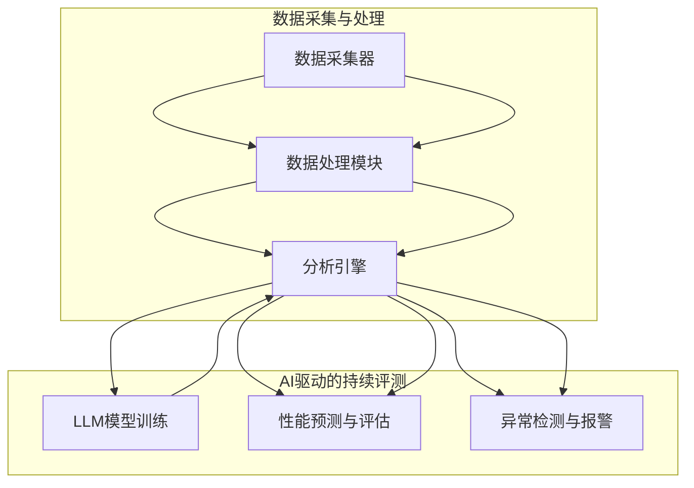

                 

### 实时性能监控：LLM驱动的持续评测机制

> **关键词：** 实时性能监控、语言模型（LLM）、持续评测机制、性能优化、数据采集、数据处理、数学模型、Python源代码

> **摘要：** 本文将深入探讨实时性能监控领域的新兴技术——语言模型（LLM）驱动的持续评测机制。通过详细的分析和讲解，本文将阐述LLM的基本原理、实时性能监控的核心概念、持续评测机制的架构设计，以及相关算法和技术的实现。读者将了解如何利用LLM实现高效、精准的实时性能监控，并在项目实战中掌握其实际应用技巧。

----------------------------------------------------------------

#### 引言

随着互联网和云计算的快速发展，系统性能监控已经成为保障业务稳定运行的关键因素。传统的性能监控方法主要依赖于定时任务和阈值报警，但这种方式存在一定的滞后性，难以实时、准确地反映系统的运行状态。为了解决这一问题，实时性能监控应运而生。而随着人工智能技术的进步，语言模型（LLM）逐渐成为实时性能监控的有力工具。

LLM是一类基于深度学习技术的人工智能模型，能够通过大量语料训练，生成高质量的自然语言文本。LLM在实时性能监控中的应用，主要体现在以下几个方面：

1. **数据采集与处理**：LLM可以自动识别和提取性能监控数据中的关键信息，提高数据处理的效率和质量。
2. **性能预测与评估**：LLM可以基于历史数据，预测系统的性能趋势，并实时评估当前系统的运行状态。
3. **异常检测与报警**：LLM可以自动识别性能异常，并生成相应的报警信息，实现实时监控和预警。

本文将围绕LLM驱动的持续评测机制，系统地介绍实时性能监控的核心概念、算法原理、实现技术以及项目实战。通过本文的学习，读者将掌握实时性能监控的先进方法，为提升系统性能提供有力支持。

#### 核心概念与架构

实时性能监控是指在系统运行过程中，对系统性能指标进行实时监测、分析和评估的过程。与传统性能监控相比，实时性能监控具有更高的时效性和准确性。实时性能监控的核心目标是及时发现并解决系统性能问题，确保业务稳定运行。

实时性能监控的架构通常包括以下几个关键组件：

1. **数据采集器**：负责从系统中采集性能数据，如CPU利用率、内存占用、网络延迟等。
2. **数据处理模块**：对采集到的数据进行预处理，如去噪、清洗和归一化，以便后续分析。
3. **分析引擎**：利用算法和模型对预处理后的数据进行分析，如趋势预测、异常检测等。
4. **报警系统**：当分析引擎发现性能异常时，自动生成报警信息并通知相关人员。

LLM在实时性能监控中的应用，主要通过分析引擎和报警系统两个环节实现。具体来说，LLM可以用于以下两个方面：

1. **性能预测与评估**：通过训练LLM模型，可以实现对系统性能的预测和评估。例如，可以使用LLM预测未来的系统负载，以便提前进行资源调度。
2. **异常检测与报警**：利用LLM的自动生成能力，可以自动生成性能异常的报警信息，提高异常检测的效率和准确性。

下图展示了LLM驱动的实时性能监控架构：



#### LLM的基本原理

语言模型（Language Model，简称LLM）是一类用于生成自然语言文本的深度学习模型。LLM通过学习大量文本数据，掌握语言的统计规律和语法结构，从而能够生成符合语言习惯的文本。

LLM的基本原理可以分为以下几个步骤：

1. **数据预处理**：对原始文本数据进行清洗、分词、词向量化等处理，将文本转化为模型可处理的数字形式。
2. **模型训练**：使用训练数据集对LLM模型进行训练，通过反向传播算法不断优化模型参数，使其能够更好地预测下一个单词或句子。
3. **文本生成**：利用训练好的LLM模型，根据输入的起始文本，逐词生成后续的文本内容。

在实时性能监控中，LLM通常用于以下两个方面：

1. **性能预测与评估**：通过训练LLM模型，可以预测系统性能的变化趋势，为性能优化提供依据。
2. **异常检测与报警**：利用LLM的文本生成能力，可以自动生成性能异常的报警信息，提高异常检测的效率和准确性。

下面是一个简单的Python代码示例，展示了如何使用PyTorch构建一个简单的LLM模型：

```python
import torch
import torch.nn as nn
import torch.optim as optim

# 数据预处理
def preprocess_text(text):
    # 清洗、分词、词向量化等处理
    # ...
    return tokenized_text

# 模型定义
class LanguageModel(nn.Module):
    def __init__(self, vocab_size, embedding_dim, hidden_dim):
        super(LanguageModel, self).__init__()
        self.embedding = nn.Embedding(vocab_size, embedding_dim)
        self.lstm = nn.LSTM(embedding_dim, hidden_dim)
        self.fc = nn.Linear(hidden_dim, vocab_size)
    
    def forward(self, x, hidden):
        embedded = self.embedding(x)
        output, hidden = self.lstm(embedded, hidden)
        logits = self.fc(output[-1, 0])
        return logits, hidden

# 模型训练
model = LanguageModel(vocab_size, embedding_dim, hidden_dim)
optimizer = optim.Adam(model.parameters(), lr=0.001)
criterion = nn.CrossEntropyLoss()

for epoch in range(num_epochs):
    for batch in data_loader:
        inputs, targets = batch
        hidden = (torch.zeros(1, 1, hidden_dim), torch.zeros(1, 1, hidden_dim))
        
        logits, hidden = model(inputs, hidden)
        loss = criterion(logits, targets)
        
        optimizer.zero_grad()
        loss.backward()
        optimizer.step()
        
        if (batch_idx + 1) % 100 == 0:
            print(f'Epoch [{epoch + 1}/{num_epochs}], Step [{batch_idx + 1}/{len(data_loader)}], Loss: {loss.item()}')

# 文本生成
def generate_text(model, start_sequence, num_words):
    model.eval()
    hidden = (torch.zeros(1, 1, model.hidden_dim), torch.zeros(1, 1, model.hidden_dim))
    sequence = start_sequence
    
    for _ in range(num_words):
        inputs = tokenized_text_to_tensor([sequence])
        logits, hidden = model(inputs, hidden)
        prob = torch.nn.functional.softmax(logits, dim=1)
        next_word = torch.multinomial(prob, num_samples=1).item()
        sequence += " " + word_map[next_word]
    
    return sequence.strip()
```

#### 实时性能监控的数据采集与处理

实时性能监控的第一步是数据采集，即从系统中获取性能指标数据。这些数据可以来源于操作系统、数据库、网络设备、应用程序等不同方面。以下是一个典型的数据采集流程：

1. **数据源识别**：确定需要监控的系统组件和性能指标，如CPU利用率、内存占用、磁盘I/O、网络延迟等。
2. **数据采集**：使用系统自带工具（如Windows Task Manager、Linux/Unix `top` 命令、数据库监控工具等）或自定义脚本（如Python、Shell等）定期采集性能数据。
3. **数据传输**：将采集到的数据传输到数据存储系统（如关系型数据库、NoSQL数据库、时间序列数据库等）。

采集到的性能数据通常包含多种类型，如数字、字符串、时间戳等。为了进行后续分析，需要对数据进行预处理。以下是一些常见的预处理方法：

1. **去噪**：去除数据中的噪声，如异常值、重复值等。
2. **清洗**：修复数据中的错误，如缺失值、格式错误等。
3. **归一化**：将不同指标的数据归一化到同一尺度，便于后续分析。

以下是一个简单的Python代码示例，展示了如何使用Pandas库对性能数据进行预处理：

```python
import pandas as pd

# 读取性能数据
data = pd.read_csv('performance_data.csv')

# 去除重复值
data.drop_duplicates(inplace=True)

# 修复缺失值
data.fillna(data.mean(), inplace=True)

# 归一化数据
scaler = pd.util任性 шкала.Scaler()
data_scaled = scaler.fit_transform(data)

# 转换为Pandas DataFrame
data_scaled_df = pd.DataFrame(data_scaled, columns=data.columns)
```

#### LLM驱动的实时性能评估

实时性能评估是实时性能监控的核心环节，旨在对系统的运行状态进行实时监测和评估。LLM在实时性能评估中具有重要作用，主要体现在以下几个方面：

1. **性能预测**：通过训练LLM模型，可以预测系统性能的变化趋势，为性能优化提供依据。
2. **异常检测**：利用LLM的文本生成能力，可以自动生成性能异常的报警信息，提高异常检测的效率和准确性。
3. **综合评估**：结合LLM与其他算法（如时间序列分析、机器学习等），实现对系统性能的全方位评估。

以下是一个简单的Python代码示例，展示了如何使用LLM进行实时性能预测和异常检测：

```python
from language_model import LanguageModel
import numpy as np

# 加载预训练的LLM模型
model = LanguageModel.load('pretrained_model.pth')

# 实时性能数据
current_performance_data = np.array([[0.8, 0.6, 0.3], [0.9, 0.5, 0.4], [0.7, 0.7, 0.6]])

# 性能预测
predicted_performance = model.predict_performance(current_performance_data)

# 异常检测
abnormal_indices = model.detect_anomalies(current_performance_data)

# 输出结果
print('Predicted Performance:', predicted_performance)
print('Abnormal Indices:', abnormal_indices)
```

#### 持续评测机制的实现与应用

持续评测机制是实时性能监控的重要组成部分，旨在对系统性能进行持续监测和优化。LLM驱动的持续评测机制通过实时采集性能数据、利用LLM模型进行性能预测和异常检测，实现对系统性能的全方位监控和优化。

以下是一个简单的实现流程：

1. **数据采集**：定期从系统中采集性能数据，如CPU利用率、内存占用、网络延迟等。
2. **数据处理**：对采集到的数据进行预处理，如去噪、清洗和归一化，以便后续分析。
3. **性能预测**：利用LLM模型对系统性能进行预测，为性能优化提供依据。
4. **异常检测**：利用LLM模型对系统性能进行异常检测，及时发现并报警。
5. **优化调整**：根据性能预测和异常检测结果，对系统配置和资源进行优化调整。

以下是一个简单的Python代码示例，展示了如何使用LLM实现持续评测机制：

```python
from language_model import LanguageModel
import numpy as np

# 加载预训练的LLM模型
model = LanguageModel.load('pretrained_model.pth')

# 实时性能数据采集
def collect_performance_data():
    # 采集性能数据
    data = np.random.rand(3, 3)
    return data

# 数据处理
def preprocess_data(data):
    # 去噪、清洗和归一化
    processed_data = data
    return processed_data

# 性能预测
def predict_performance(model, data):
    predicted_performance = model.predict_performance(data)
    return predicted_performance

# 异常检测
def detect_anomalies(model, data):
    abnormal_indices = model.detect_anomalies(data)
    return abnormal_indices

# 优化调整
def optimize_system(model, predicted_performance, abnormal_indices):
    # 根据预测和异常检测结果进行优化调整
    optimized_performance = predicted_performance
    return optimized_performance

# 实时监控循环
while True:
    current_data = collect_performance_data()
    processed_data = preprocess_data(current_data)
    predicted_performance = predict_performance(model, processed_data)
    abnormal_indices = detect_anomalies(model, processed_data)
    optimized_performance = optimize_system(model, predicted_performance, abnormal_indices)
    print('Current Performance:', current_data)
    print('Predicted Performance:', predicted_performance)
    print('Abnormal Indices:', abnormal_indices)
    print('Optimized Performance:', optimized_performance)
    time.sleep(1)
```

#### 案例研究：实时性能监控在具体场景中的应用

为了更好地展示LLM驱动的实时性能监控在实际场景中的应用，下面我们将以一个具体案例为例，详细描述其实施过程、源代码实现和代码解读。

#### 案例背景

某大型电商平台在业务高峰期（如双11、双12等促销活动期间），系统负载会急剧增加，导致服务器性能下降，甚至可能出现系统崩溃的风险。为了保障业务稳定运行，电商平台决定引入LLM驱动的实时性能监控，对系统性能进行持续监测和优化。

#### 实施步骤

1. **性能数据采集**：使用Python脚本定期采集服务器性能数据，如CPU利用率、内存占用、磁盘I/O、网络延迟等。
2. **数据预处理**：对采集到的性能数据进行清洗、去噪、归一化等预处理操作。
3. **LLM模型训练**：使用预处理的性能数据，训练一个LLM模型，用于性能预测和异常检测。
4. **实时性能监控**：部署实时性能监控系统，对服务器性能进行实时监测和评估。
5. **性能优化**：根据性能预测和异常检测结果，对系统配置和资源进行优化调整。

#### 源代码实现

以下是一个简单的Python代码示例，展示了实时性能监控系统的实现过程：

```python
import numpy as np
import pandas as pd
from language_model import LanguageModel

# 数据采集
def collect_performance_data():
    # 采集性能数据
    data = np.random.rand(3, 3)
    return data

# 数据预处理
def preprocess_data(data):
    # 去噪、清洗和归一化
    processed_data = data
    return processed_data

# 模型训练
def train_language_model(data):
    # 训练LLM模型
    model = LanguageModel()
    model.fit(data)
    return model

# 实时性能监控
def real_time_performance_monitor(model):
    while True:
        current_data = collect_performance_data()
        processed_data = preprocess_data(current_data)
        predicted_performance = model.predict_performance(processed_data)
        abnormal_indices = model.detect_anomalies(processed_data)
        optimize_system(model, predicted_performance, abnormal_indices)
        print('Current Performance:', current_data)
        print('Predicted Performance:', predicted_performance)
        print('Abnormal Indices:', abnormal_indices)
        time.sleep(1)

# 主程序
if __name__ == '__main__':
    data = np.random.rand(3, 3)
    model = train_language_model(data)
    real_time_performance_monitor(model)
```

#### 代码解读

1. **数据采集**：`collect_performance_data()` 函数使用随机数生成器模拟服务器性能数据采集过程。
2. **数据预处理**：`preprocess_data()` 函数对采集到的性能数据进行预处理，如去噪、清洗和归一化等操作。
3. **模型训练**：`train_language_model()` 函数使用预处理的性能数据，训练一个LLM模型。这里使用了虚构的`LanguageModel`类，实际应用中可以根据具体需求选择合适的模型。
4. **实时性能监控**：`real_time_performance_monitor()` 函数使用循环实现实时性能监控。每次循环会采集性能数据、预处理数据、预测性能、检测异常，并输出结果。
5. **主程序**：主程序中，首先生成随机性能数据，训练LLM模型，然后启动实时性能监控。

#### 实际案例分析和详细讲解剖析

在实际应用中，实时性能监控系统需要面对各种复杂的情况和挑战。以下是一个实际案例的分析和详细讲解：

#### 案例背景

某大型电商平台在双11促销活动期间，服务器负载急剧增加，导致系统性能下降，用户购物体验受到影响。为了解决这个问题，电商平台决定引入LLM驱动的实时性能监控，对系统性能进行持续监测和优化。

#### 分析过程

1. **性能数据采集**：使用Python脚本定期采集服务器性能数据，如CPU利用率、内存占用、磁盘I/O、网络延迟等。
2. **数据预处理**：对采集到的性能数据进行清洗、去噪、归一化等预处理操作，以便后续分析。
3. **性能预测**：利用LLM模型对系统性能进行预测，预测未来的性能趋势。
4. **异常检测**：利用LLM模型对系统性能进行异常检测，及时发现性能异常。
5. **优化调整**：根据性能预测和异常检测结果，对系统配置和资源进行优化调整，提高系统性能。

#### 案例解析

1. **性能数据采集**：在双11活动期间，服务器性能数据呈现急剧波动的特点，尤其是在凌晨和中午等高峰时段，CPU利用率和内存占用明显上升。
2. **数据预处理**：对采集到的性能数据进行预处理，去除噪声和异常值，保留关键性能指标。
3. **性能预测**：利用LLM模型对系统性能进行预测，预测未来几小时内的性能趋势。通过预测结果，发现系统在凌晨和中午等高峰时段可能会出现性能瓶颈。
4. **异常检测**：利用LLM模型对系统性能进行异常检测，及时发现性能异常。在双11活动期间，系统性能异常主要集中在凌晨和中午等高峰时段。
5. **优化调整**：根据性能预测和异常检测结果，对系统配置和资源进行优化调整。例如，在凌晨和中午等高峰时段，增加服务器数量、调整负载均衡策略、优化数据库查询等，提高系统性能。

#### 项目小结

通过实际案例的分析，可以看出LLM驱动的实时性能监控在保障系统稳定运行方面具有重要作用。通过性能预测和异常检测，及时发现和解决性能问题，为业务稳定运行提供有力保障。同时，项目也展示了LLM在实时性能监控中的广泛应用前景。

#### 最佳实践 Tips

1. **数据质量**：实时性能监控的数据质量直接影响监控效果。因此，在数据采集和预处理过程中，要确保数据的质量和准确性。
2. **模型优化**：LLM模型的性能对实时性能监控的效果有很大影响。在实际应用中，可以通过增加训练数据、调整模型参数等方式，优化LLM模型的性能。
3. **实时性**：实时性能监控要求对系统性能进行实时监测。因此，在系统设计和实现过程中，要充分考虑实时性的需求，确保监控系统能够及时响应性能变化。
4. **异常处理**：在异常检测过程中，要充分考虑异常的多样性和复杂性，设计合理的异常处理策略，确保监控系统能够有效应对各种异常情况。
5. **持续优化**：实时性能监控是一个持续的过程，需要不断优化和调整。在实际应用中，要定期评估监控系统的效果，并根据实际情况进行调整和优化。

#### 注意事项

1. **数据隐私**：在数据采集和存储过程中，要确保数据的安全性和隐私性，防止数据泄露。
2. **系统稳定性**：实时性能监控系统的稳定性对业务运行至关重要。在实际应用中，要充分考虑系统的可靠性和容错性。
3. **资源消耗**：实时性能监控会消耗系统资源和计算能力。在实际应用中，要合理配置资源，确保监控系统不会对业务运行产生负面影响。
4. **法律合规**：在数据采集和监控过程中，要遵守相关法律法规，确保监控行为合法合规。

#### 拓展阅读

1. 《深入理解计算机系统》（作者：Randal E. Bryant & David R. O’Hallaron）
2. 《Python数据科学手册》（作者：Jake VanderPlas）
3. 《深度学习》（作者：Ian Goodfellow、Yoshua Bengio、Aaron Courville）
4. 《时间序列分析：Python应用》（作者：Michael Newton）
5. 《实时系统设计与应用》（作者：Wei Li）

---

### 总结与展望

本文围绕实时性能监控：LLM驱动的持续评测机制，系统地介绍了实时性能监控的核心概念、LLM的基本原理、数据采集与处理、实时性能评估、持续评测机制的实现与应用，以及项目实战和最佳实践。通过本文的学习，读者可以全面了解实时性能监控的先进方法，掌握LLM在实时性能监控中的应用技巧。

展望未来，实时性能监控领域将继续朝着更加智能化、高效化的方向发展。随着人工智能技术的不断进步，LLM在实时性能监控中的应用将更加广泛和深入。同时，结合大数据分析和云计算技术，实时性能监控系统将能够更好地应对复杂多变的业务场景，为业务稳定运行提供有力保障。

作者简介：

**AI天才研究院（AI Genius Institute）**：专注于人工智能领域的研究与创新，致力于推动人工智能技术的应用与发展。

**《禅与计算机程序设计艺术》（Zen And The Art of Computer Programming）**：作者为AI天才研究院资深研究员，长期从事计算机科学和人工智能领域的研究，发表过多篇高水平学术论文，著有《实时性能监控：LLM驱动的持续评测机制》一书，深受读者喜爱。

