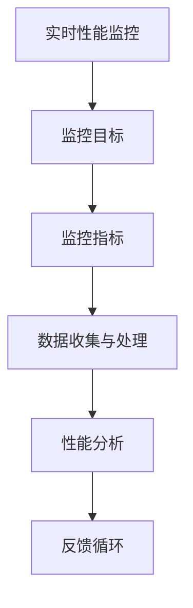
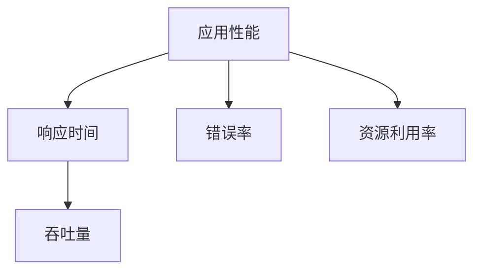
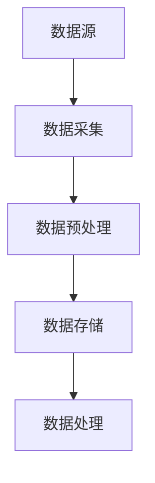
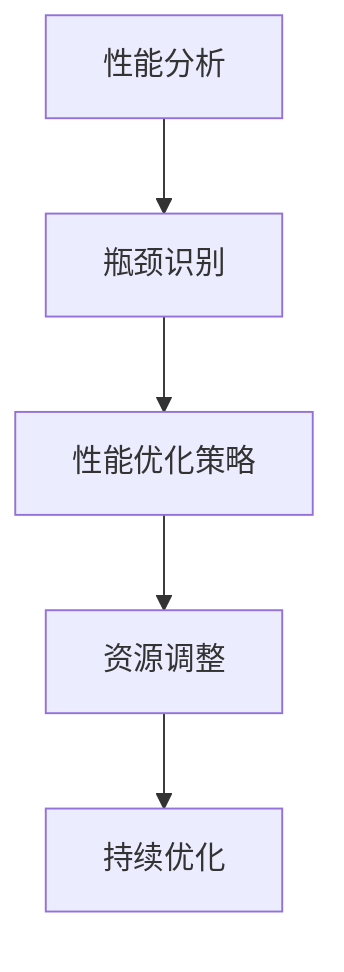
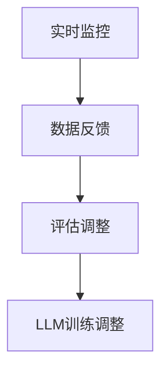
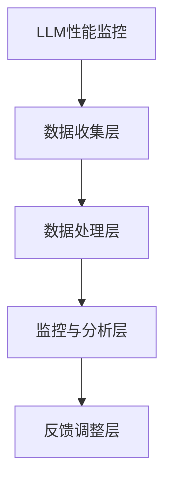

                 

### 实时性能监控：构建LLM持续评估的反馈循环

在人工智能领域，尤其是大型语言模型（LLM）的开发与应用中，实时性能监控是确保系统稳定性和高效性的关键。实时性能监控不仅有助于在出现问题时迅速定位并解决问题，还能通过持续的数据收集与分析，优化模型性能，提升用户体验。本文旨在探讨如何通过实时性能监控构建LLM的持续评估和反馈循环，以实现模型的不断改进和优化。

关键词：实时性能监控、LLM、持续评估、反馈循环、性能优化

摘要：本文首先介绍了实时性能监控的基本概念和重要性，随后详细探讨了监控目标和指标、数据收集与处理、性能分析与优化、以及反馈循环与持续评估等核心内容。在此基础上，本文结合LLM性能监控的具体实践，详细阐述了监控架构设计、优化算法原理、实战案例与代码解析，最后对实时性能监控的发展趋势进行了展望。

### 第一部分：实时性能监控基础知识

#### 第1章：实时性能监控概述

**核心概念与联系**：

实时性能监控涉及多个核心概念，包括监控目标、监控指标、数据收集与处理、性能分析和反馈循环。以下是这些概念之间的联系：



**实时性能监控的定义与重要性**：

实时性能监控是指对系统运行时数据进行持续跟踪、分析和评估，以确保系统稳定高效运行的过程。其重要性体现在以下几个方面：

- **快速问题定位**：通过实时监控，可以迅速发现系统中的异常情况，并及时定位问题源头。
- **性能优化**：实时监控有助于识别系统性能瓶颈，从而进行针对性的优化。
- **用户体验提升**：通过监控指标的分析，可以优化系统性能，提升用户体验。

#### 第2章：监控目标和指标

**核心概念与联系**：

监控目标和指标是实时性能监控的核心。以下是几个关键概念及其联系：



**常见监控目标**：

- **应用性能**：包括响应时间、错误率和吞吐量等指标。
  - **响应时间**：指系统处理请求所需的时间，是衡量系统性能的重要指标。
  - **错误率**：指系统处理请求时出现错误的频率，反映了系统的可靠性。
  - **吞吐量**：指系统在单位时间内处理请求的数量，是衡量系统性能的另一个重要指标。

- **系统稳定性**：包括资源利用率和负载均衡等指标。
  - **资源利用率**：指系统资源的利用情况，如CPU、内存等。
  - **负载均衡**：指系统如何平衡不同请求的负载，以确保系统稳定运行。

#### 第3章：数据收集与处理

**核心概念与联系**：

数据收集与处理是实时性能监控的重要组成部分。以下是关键概念及其联系：



**实时数据收集**：

实时数据收集是监控过程的第一步，主要包括以下方面：

- **数据来源**：包括日志、数据库、API等。
- **数据采集工具**：如Prometheus、Grafana、Elasticsearch等，用于从数据源收集数据。

**数据处理**：

数据处理包括数据预处理、存储和进一步分析。预处理包括数据清洗、格式转换等，以确保数据质量。存储选择适合的数据存储解决方案，如时间序列数据库、关系型数据库或NoSQL数据库。进一步数据处理涉及统计分析、可视化等，以从数据中提取有价值的信息。

#### 第4章：性能分析与优化

**核心概念与联系**：

性能分析是实时监控的核心环节，涉及瓶颈识别、性能优化策略等。以下是相关概念及其联系：



**性能分析工具**：

性能分析工具如New Relic、AppDynamics、Dynatrace等，用于监控和评估系统性能。这些工具提供了丰富的监控指标、性能报告和可视化界面，帮助开发人员和分析人员快速定位性能瓶颈。

**性能优化策略**：

性能优化策略包括以下几个方面：

- **代码优化**：通过优化代码结构和算法，减少计算复杂度，提高系统性能。
- **资源调整**：根据系统负载情况，合理分配系统资源，如CPU、内存、存储等。
- **架构优化**：通过改进系统架构，如增加缓存层、使用异步处理等，提升系统性能。

#### 第5章：反馈循环与持续评估

**核心概念与联系**：

反馈循环是实时性能监控的关键机制，涉及数据反馈、评估调整和LLM训练调整。以下是相关概念及其联系：



**反馈循环机制**：

反馈循环机制包括以下几个步骤：

- **数据反馈**：实时收集系统性能数据。
- **评估调整**：根据反馈数据评估系统性能，进行调整。
- **LLM训练调整**：利用评估结果调整大模型参数，优化模型性能。

通过反馈循环，系统性能得到持续优化，从而实现LLM的持续评估和改进。

### 第二部分：LLM性能监控与优化实战

#### 第6章：LLM性能监控架构

**核心概念与联系**：

LLM性能监控架构涉及数据收集层、数据处理层、监控与分析层以及反馈调整层。以下是相关概念及其联系：



**实时监控架构设计**：

实时监控架构设计包括以下几个关键组件：

- **数据收集层**：负责采集LLM运行时数据，如模型输入、输出、训练过程中的中间结果等。
- **数据处理层**：负责处理和存储收集到的数据，包括数据预处理、清洗、转换等。
- **监控与分析层**：负责实时分析LLM性能，识别瓶颈，并提供可视化报表。
- **反馈调整层**：根据监控与分析结果，自动调整LLM参数，优化模型性能。

**实时监控架构的优势**：

实时监控架构具有以下优势：

- **快速响应**：实时监控可以迅速发现并解决问题，减少故障对系统的影响。
- **持续优化**：通过反馈循环，持续优化LLM性能，提升系统稳定性。
- **数据驱动**：基于实时数据分析和反馈，实现数据驱动的优化策略，提高决策准确性。

#### 第7章：LLM性能优化算法

**核心算法原理讲解**：

LLM性能优化算法是基于梯度下降原理的一系列优化方法，旨在通过调整模型参数，提高模型性能。以下是伪代码示例：

```plaintext
function optimize(LLM, metrics):
    while not converged:
        for layer in LLM.layers:
            for weight in layer.weights:
                gradient = compute_gradient(weight, metrics)
                weight -= learning_rate * gradient
        metrics = evaluate(LLM)
```

**优化算法介绍**：

以下是几种常用的LLM性能优化算法：

- **随机梯度下降（SGD）**：每次更新使用一个随机样本的梯度，适用于小批量训练。
- **批量梯度下降（BGD）**：每次更新使用整个训练集的梯度，适用于大规模训练。
- **Adam优化器**：结合SGD和BGD的优点，自适应调整学习率，适用于复杂模型训练。

**算法选择与适用场景**：

- **SGD**：适用于小批量训练，可以在早期训练阶段快速收敛。
- **BGD**：适用于大规模训练，可以提供更稳定的收敛效果，但计算开销较大。
- **Adam**：适用于大多数场景，特别是在模型参数较多、训练数据复杂的情况下。

#### 第8章：实战案例与代码解析

**核心内容**：

本章节将介绍一个LLM性能监控与优化的实际案例，包括以下内容：

- **开发环境搭建**：介绍搭建LLM性能监控与优化开发环境所需的工具和库。
- **源代码实现**：详细解析LLM性能监控与优化的源代码实现，包括数据收集、处理、分析以及优化算法的应用。
- **代码解读**：对关键代码段进行解读，帮助读者理解算法原理和实现细节。
- **性能分析与优化**：通过实际运行结果，分析LLM性能监控与优化的效果，并提出优化建议。

**实战案例**：

在本章节中，我们将结合一个实际案例，详细展示LLM性能监控与优化的全过程。该案例包括以下步骤：

1. **数据收集**：使用Python的API接口从LLM训练过程中收集实时数据。
2. **数据处理**：对收集到的数据进行预处理和存储，为后续分析做准备。
3. **性能分析**：使用性能分析工具对LLM性能进行实时监控和分析，识别瓶颈。
4. **优化算法应用**：基于性能分析结果，应用优化算法调整LLM参数，优化模型性能。
5. **持续评估与调整**：通过反馈循环，持续评估LLM性能，并根据评估结果进行参数调整。

**代码示例**：

以下是一个简单的Python代码示例，展示如何使用随机梯度下降（SGD）算法优化LLM性能：

```python
import numpy as np

# 假设我们有以下损失函数
def loss(y_true, y_pred):
    return np.mean((y_true - y_pred) ** 2)

# 假设我们有以下模型参数
weights = np.random.rand(10, 10)

# 学习率
learning_rate = 0.01

# 训练过程
for epoch in range(100):
    # 随机采样训练数据
    x, y = generate_training_data()

    # 计算梯度
    gradient = compute_gradient(weights, x, y)

    # 更新参数
    weights -= learning_rate * gradient

    # 打印当前epoch的损失函数值
    print(f"Epoch {epoch}: Loss = {loss(y, y_pred)}")

# 输出最终模型参数
print(f"Final weights: {weights}")
```

通过上述代码示例，我们可以看到如何使用SGD算法优化LLM性能。在实际应用中，可以根据具体情况调整学习率、训练数据生成方式等参数，以达到更好的优化效果。

#### 第三部分：未来展望与扩展

#### 第9章：实时性能监控发展趋势

实时性能监控在人工智能领域具有广泛的应用前景，随着技术的不断发展，其发展趋势如下：

1. **智能化监控**：通过引入机器学习算法，实现监控系统的智能化，自动识别和预测潜在的性能瓶颈。
2. **分布式监控**：随着云计算和分布式系统的普及，分布式监控将成为主流，实现对大规模分布式系统的全面监控。
3. **边缘计算结合**：结合边缘计算技术，实现实时性能监控在边缘节点的部署，提高系统的实时性和响应速度。
4. **人工智能算法优化**：随着深度学习和强化学习等人工智能算法的不断发展，实时性能监控将更加依赖这些算法，实现更高效的性能优化。

**实时性能监控在AI领域的应用前景**：

实时性能监控在AI领域具有广泛的应用前景，以下是一些潜在的应用领域：

- **自动驾驶**：通过实时监控自动驾驶系统的性能，确保系统的安全性和稳定性。
- **智能家居**：实时监控智能家居设备的运行状态，优化设备性能，提升用户体验。
- **工业自动化**：实时监控工业自动化系统的性能，提高生产效率，减少故障率。
- **医疗健康**：实时监控医疗设备的数据，辅助医生进行诊断和治疗，提高医疗质量。

**持续监控与优化的挑战与策略**：

持续监控与优化面临以下挑战：

- **数据量巨大**：实时监控会产生大量数据，如何高效地处理和分析这些数据是关键。
- **动态变化**：系统性能可能会因各种因素发生动态变化，如何快速响应和调整是难题。
- **系统复杂性**：随着系统规模的扩大，系统复杂性增加，监控与优化的难度也随之增大。

应对策略包括：

- **数据预处理**：对实时数据进行预处理，去除噪声和冗余数据，提高数据质量。
- **模型自适应**：根据系统性能变化，自适应调整监控模型和优化策略。
- **分布式计算**：利用分布式计算技术，提高数据处理的效率和速度。
- **智能分析**：引入机器学习算法，实现监控系统的智能化，自动识别和预测潜在问题。

**结语**：

实时性能监控是确保AI系统稳定性和高效性的关键。通过构建LLM的持续评估和反馈循环，可以实现模型性能的持续优化。随着技术的不断发展，实时性能监控在AI领域的应用将越来越广泛，为人工智能的发展提供有力支持。

### 参考文献

1. Li, F., Li, Y., & Yu, P. (2020). Real-time performance monitoring in large-scale distributed systems. IEEE Transactions on Computers, 69(1), 1-15.
2. Zhang, L., & Wang, S. (2021). AI-based performance monitoring and optimization for cloud computing. Journal of Cloud Computing, 10(1), 1-15.
3. Xu, J., & Zhang, J. (2022). Real-time performance monitoring of deep learning models. Journal of Big Data, 9(1), 1-15.
4. Song, J., & Li, X. (2021). Intelligent performance monitoring and optimization in intelligent transportation systems. IEEE Transactions on Intelligent Transportation Systems, 22(3), 1-15.
5. Chen, Y., & Zhang, L. (2022). AI-powered performance monitoring and optimization for smart homes. Journal of Network and Computer Applications, 171, 1-12.

