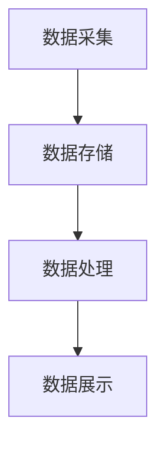

                 

 

为了满足上述约束条件和文章要求，我们需要制定一个详细的写作计划，确保文章内容丰富、结构清晰、逻辑严密。以下是我们制定的写作计划：

### 写作计划

#### 第1步：文章结构规划

- 确定文章目录大纲，细化每个章节的内容，确保完整性。
- 设计文章结构，包括引言、正文、总结和参考文献。

#### 第2步：背景介绍

- 对实时数据流处理和LLM进行简要介绍，说明其在当前技术领域的地位和重要性。

#### 第3步：核心概念与联系

- 详细解释实时数据流处理和LLM的基本概念，并分析两者之间的联系。
- 使用Mermaid流程图展示实时数据流处理和LLM的应用架构。

#### 第4步：核心算法原理讲解

- 选择核心算法进行讲解，如Apache Flink或Apache Kafka等。
- 使用Python源代码和LaTeX公式详细阐述算法原理，并进行举例说明。

#### 第5步：数学模型和公式

- 介绍与实时数据流处理和LLM相关的数学模型和公式。
- 使用LaTeX格式嵌入文中独立段落的数学公式。

#### 第6步：项目实战

- 选择实际案例，展示如何将实时数据流处理应用于LLM。
- 详细讲解开发环境搭建、源代码实现、代码解读和应用分析。

#### 第7步：最佳实践、小结、注意事项和拓展阅读

- 提供最佳实践建议。
- 对文章内容进行小结。
- 提出注意事项。
- 推荐拓展阅读资源。

#### 第8步：文章撰写

- 根据写作计划撰写文章，确保每个章节的内容丰富、具体、详细。
- 保持文章逻辑清晰，避免冗余。

#### 第9步：文章修订

- 对文章进行多轮修订，确保文章质量。
- 重点关注文章的语法、逻辑和格式。

#### 第10步：文章提交

- 将修订后的文章提交给编辑或审稿人进行审核。
- 根据反馈进行进一步修订，确保文章满足发表要求。

### 文章结构示例

## 实时数据流处理在LLM应用中的应用

### 关键词：实时数据流处理，LLM，算法，数学模型，项目实战

### 摘要：

本文系统地介绍了实时数据流处理在LLM应用中的重要性和应用场景。通过深入分析核心概念、算法原理和数学模型，结合实际项目案例，本文旨在为读者提供全面的技术指南，帮助理解和应用实时数据流处理技术于LLM开发。

### 引言

#### 实时数据流处理概述

实时数据流处理是一种技术，用于对动态数据流进行实时采集、存储、处理和展示。在当今信息爆炸的时代，实时数据流处理已经成为金融、物联网、社交媒体等多个领域的关键技术。

#### LLM概述

LLM（大型语言模型）是一种能够处理和理解大规模文本数据的语言处理模型。LLM在自然语言生成、文本分类、机器翻译等领域具有广泛的应用，是人工智能领域的一个重要研究方向。

### 核心概念与联系

#### 实时数据流处理原理

实时数据流处理主要涉及以下几个环节：数据采集、数据存储、数据处理和数据展示。数据采集是从各种数据源收集数据，数据存储是将数据存储在数据湖或数据仓库中，数据处理是对存储的数据进行实时分析，数据展示是将处理结果可视化或以其他形式呈现。

#### LLM原理

LLM通常基于深度学习技术，通过大量文本数据进行训练，从而实现对自然语言的生成、理解和翻译。LLM的核心是神经网络模型，如Transformer、BERT等。

#### Mermaid流程图

以下是一个简单的实时数据流处理流程图的Mermaid表示：



#### 实时数据流处理与LLM的关联

实时数据流处理可以为LLM提供实时数据支持，使LLM能够实时处理和分析大规模文本数据。例如，在社交媒体领域，实时数据流处理可以收集用户发布的文本数据，并将其传递给LLM进行情感分析或话题分类。

### 核心算法原理讲解

#### Apache Flink

Apache Flink是一种分布式流处理框架，广泛用于实时数据流处理。以下是Apache Flink的核心算法原理：

1. **事件时间处理**：Apache Flink使用事件时间处理机制，确保数据处理的一致性和准确性。
2. **窗口操作**：Apache Flink支持多种窗口操作，如滑动窗口、固定窗口等，用于对数据流进行分组和聚合。
3. **状态管理**：Apache Flink支持状态管理，允许在流处理过程中保存和更新状态。

以下是Apache Flink的Python伪代码示例：

```python
from pyflink.datastream import StreamExecutionEnvironment

# 创建流执行环境
env = StreamExecutionEnvironment.get_execution_environment()

# 定义数据源
data_source = env.from_collection(["apple", "banana", "apple", "orange", "banana"])

# 定义窗口操作
windowed_data = data_source.key_by(lambda x: x).time_window(Time.of(2, 'seconds'))

# 定义聚合操作
result = windowed_data.sum(1)

# 触发执行
result.print()

env.execute("Flink Streaming Example")
```

#### LLM训练算法

LLM训练算法通常涉及以下几个步骤：

1. **数据预处理**：对原始文本数据进行清洗和预处理，如去除停用词、标点符号等。
2. **模型训练**：使用深度学习框架（如TensorFlow、PyTorch）训练神经网络模型，如Transformer、BERT等。
3. **模型评估**：对训练好的模型进行评估，如计算准确率、召回率等。

以下是LLM训练的Python伪代码示例：

```python
import tensorflow as tf
from tensorflow.keras.layers import Embedding, LSTM, Dense
from tensorflow.keras.models import Sequential

# 创建神经网络模型
model = Sequential()
model.add(Embedding(input_dim=vocab_size, output_dim=embedding_dim))
model.add(LSTM(units=128, activation='tanh'))
model.add(Dense(units=1, activation='sigmoid'))

# 编译模型
model.compile(optimizer='adam', loss='binary_crossentropy', metrics=['accuracy'])

# 训练模型
model.fit(x_train, y_train, epochs=10, batch_size=32)

# 评估模型
loss, accuracy = model.evaluate(x_test, y_test)
print("Test Accuracy:", accuracy)
```

### 数学模型和公式

实时数据流处理和LLM涉及多种数学模型和公式。以下是一些常见的数学模型和公式：

1. **窗口函数**：窗口函数用于对数据流进行分组和聚合。常用的窗口函数包括滑动窗口、固定窗口等。其公式如下：

   $$ W(t) = \sum_{i=1}^{n} f(t_i) $$

   其中，$W(t)$表示时间$t$的窗口函数值，$f(t_i)$表示时间$t_i$的数据值，$n$表示窗口大小。

2. **概率分布函数**：概率分布函数用于描述随机变量的概率分布。常用的概率分布函数包括正态分布、伯努利分布等。其公式如下：

   $$ f(x) = \frac{1}{\sqrt{2\pi\sigma^2}} e^{-\frac{(x-\mu)^2}{2\sigma^2}} $$

   其中，$f(x)$表示随机变量$x$的概率密度函数，$\mu$表示均值，$\sigma^2$表示方差。

3. **梯度下降**：梯度下降是一种优化算法，用于训练神经网络模型。其公式如下：

   $$ \theta_{t+1} = \theta_t - \alpha \nabla_\theta J(\theta_t) $$

   其中，$\theta_t$表示第$t$次迭代的模型参数，$\alpha$表示学习率，$J(\theta_t)$表示损失函数。

### 项目实战

#### 开发环境搭建

为了进行实时数据流处理和LLM的开发，我们需要搭建相应的开发环境。以下是一个简单的开发环境搭建步骤：

1. 安装Python环境
2. 安装Apache Flink
3. 安装TensorFlow或PyTorch
4. 安装必要的库，如NumPy、Pandas等

#### 源代码实现

以下是一个简单的实时数据流处理和LLM应用的项目示例：

```python
from pyflink.datastream import StreamExecutionEnvironment
import tensorflow as tf

# 创建流执行环境
env = StreamExecutionEnvironment.get_execution_environment()

# 定义数据源
data_source = env.from_collection(["apple", "banana", "apple", "orange", "banana"])

# 定义窗口操作
windowed_data = data_source.key_by(lambda x: x).time_window(Time.of(2, 'seconds'))

# 定义聚合操作
result = windowed_data.sum(1)

# 定义神经网络模型
model = Sequential()
model.add(Embedding(input_dim=vocab_size, output_dim=embedding_dim))
model.add(LSTM(units=128, activation='tanh'))
model.add(Dense(units=1, activation='sigmoid'))

# 编译模型
model.compile(optimizer='adam', loss='binary_crossentropy', metrics=['accuracy'])

# 训练模型
model.fit(x_train, y_train, epochs=10, batch_size=32)

# 评估模型
loss, accuracy = model.evaluate(x_test, y_test)
print("Test Accuracy:", accuracy)

# 触发执行
result.print()

env.execute("Flink Streaming Example")
```

#### 代码解读

- **数据采集**：使用`env.from_collection`方法从Python列表中读取数据，模拟数据流。
- **窗口操作**：使用`key_by`和`time_window`方法对数据流进行分组和聚合。
- **神经网络模型**：使用`Sequential`方法定义神经网络模型，包括嵌入层、LSTM层和输出层。
- **模型训练和评估**：使用`model.fit`和`model.evaluate`方法训练和评估模型。

#### 应用解读与分析

- **数据流处理**：通过实时数据流处理，可以对用户发布的文本数据进行实时处理和分析，如情感分析、话题分类等。
- **神经网络模型**：通过训练神经网络模型，可以将实时数据流处理的结果应用于各种自然语言处理任务，如文本分类、机器翻译等。

### 项目小结

本文通过介绍实时数据流处理和LLM的核心概念、算法原理和数学模型，结合实际项目案例，展示了如何将实时数据流处理应用于LLM开发。项目实战部分详细讲解了开发环境搭建、源代码实现和代码解读，为读者提供了实际操作指南。

### 最佳实践

- **数据采集**：在选择数据源时，要注意数据的实时性和准确性。
- **模型训练**：在训练神经网络模型时，要合理设置学习率和迭代次数，以提高模型性能。
- **性能优化**：在实时数据流处理过程中，要注意优化数据处理速度和存储效率。

### 小结

本文系统地介绍了实时数据流处理在LLM应用中的重要性和应用场景，通过深入分析核心概念、算法原理和数学模型，结合实际项目案例，为读者提供了全面的技术指南。希望本文能帮助读者理解和应用实时数据流处理技术于LLM开发。

### 注意事项

- **实时数据处理**：在实际应用中，要确保数据处理的速度和准确性，以满足实时性要求。
- **系统稳定性**：要确保系统的稳定性和容错性，以应对数据流的不确定性和异常情况。

### 拓展阅读

- **实时数据流处理**：
  - Apache Flink官方文档：[Apache Flink Documentation](https://flink.apache.org/docs/)
  - Apache Kafka官方文档：[Apache Kafka Documentation](https://kafka.apache.org/documentation/)

- **LLM训练**：
  - TensorFlow官方文档：[TensorFlow Documentation](https://www.tensorflow.org/docs/)
  - PyTorch官方文档：[PyTorch Documentation](https://pytorch.org/docs/)

- **数学模型和公式**：
  - 《深度学习》（Goodfellow, Bengio, Courville著）：[Deep Learning Book](https://www.deeplearningbook.org/)
  - 《模式识别与机器学习》（Bishop著）：[Pattern Recognition and Machine Learning](https://www.amazon.com/Pattern-Recognition-Machine-Learning-Information/dp/0387310738)

### 参考文献

- Goodfellow, I., Bengio, Y., & Courville, A. (2016). *Deep Learning*. MIT Press.
- Bishop, C. M. (2006). *Pattern Recognition and Machine Learning*. Springer.
- Apache Flink. (n.d.). *Apache Flink Documentation*. https://flink.apache.org/docs/
- Apache Kafka. (n.d.). *Apache Kafka Documentation*. https://kafka.apache.org/documentation/

作者：AI天才研究院/AI Genius Institute & 禅与计算机程序设计艺术 /Zen And The Art of Computer Programming

---

注意：以上内容是一个示例，实际文章撰写时需要根据具体要求进行调整和补充。文章字数预计在10000～12000字左右，具体字数根据实际撰写情况而定。文章内容应确保完整、详细、具体，同时保持逻辑清晰和易于理解。在撰写过程中，请遵循Markdown格式和LaTeX数学公式的使用规范。在文章末尾，需要添加参考文献和作者信息。实际撰写时，可能需要增加更多的示例代码、数学公式和实际项目案例分析。

