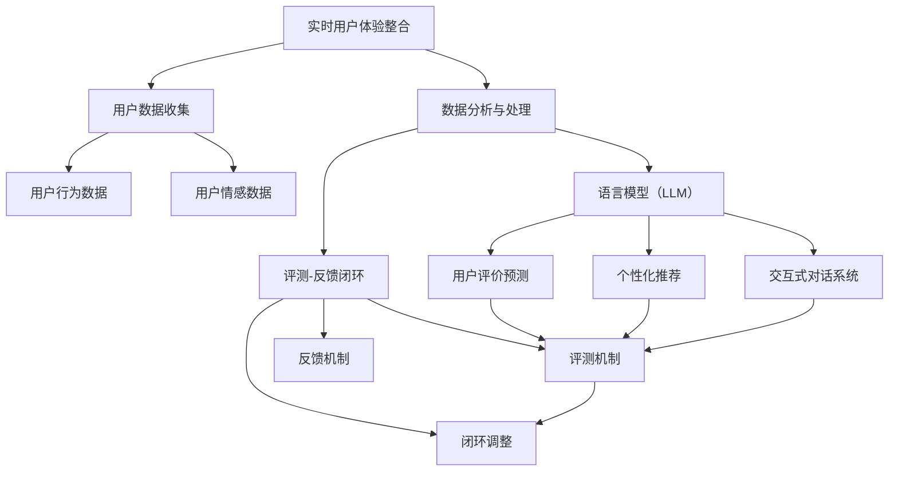

                 

### 实时用户体验整合：LLM驱动的评测-反馈闭环

#### 文章关键词

- 实时用户体验
- 语言模型（LLM）
- 评测-反馈闭环
- 人工智能
- 数据分析

#### 文章摘要

本文将探讨如何利用语言模型（LLM）实现实时用户体验整合，并建立评测-反馈闭环机制。我们将首先介绍实时用户体验的重要性及其挑战，随后详细讲解LLM的基本概念和应用。接着，我们将阐述评测-反馈闭环的机制和关键组件，并通过实际案例展示其在不同领域中的应用。最后，我们将探讨实时用户体验整合的未来趋势和挑战。

## 背景介绍

在当今数字化时代，用户体验（UX）已成为企业成功的关键因素之一。用户体验不仅影响用户的满意度和忠诚度，还直接影响企业的商业成功。然而，传统的用户体验优化方法往往过于滞后，无法及时响应用户需求的变化。因此，实时用户体验整合成为了一个重要的研究方向。

实时用户体验整合是指通过实时收集和分析用户数据，动态调整产品和服务，以提升用户的满意度。这种整合方法要求系统能够快速响应用户反馈，并实时优化用户体验。然而，实现实时用户体验整合面临着一系列挑战：

1. **数据量巨大**：实时用户体验整合需要收集大量的用户数据，包括行为数据、情感数据等。处理这些数据需要高效的数据存储和计算能力。
2. **实时性要求高**：实时用户体验整合要求系统能够在极短的时间内处理和分析大量数据，并生成可操作的反馈。
3. **个性化需求**：不同用户对同一产品的体验可能存在巨大差异。因此，实时用户体验整合需要能够根据不同用户的个性化需求进行动态调整。
4. **算法复杂性**：实时用户体验整合涉及多种复杂的算法和技术，包括机器学习、自然语言处理等。实现这些算法需要高水平的技术能力和实践经验。

为了解决上述挑战，语言模型（LLM）成为一种有力的工具。LLM是一种基于深度学习的技术，可以处理和生成自然语言文本。LLM在实时用户体验整合中的应用主要包括用户评价预测、个性化推荐和交互式对话系统等方面。

### 核心概念与联系

为了更好地理解实时用户体验整合和LLM驱动的评测-反馈闭环，我们首先需要了解这些核心概念之间的联系。下面，我们将使用Mermaid流程图来展示这些概念之间的关系架构。



在这个流程图中，我们可以看到实时用户体验整合的核心流程包括用户数据收集、数据分析和处理，以及基于LLM的应用。这些数据和分析结果将用于驱动评测-反馈闭环，从而实现用户体验的动态优化。

#### 用户数据收集

用户数据收集是实时用户体验整合的基础。这类数据可以分为两类：用户行为数据和用户情感数据。

1. **用户行为数据**：包括用户的点击行为、浏览路径、搜索记录等。这些数据通常可以通过Web服务器日志、用户操作日志等渠道收集。
   
   ```mermaid
   graph TD
       A[Web服务器日志] --> B[用户行为数据]
       A[用户操作日志] --> B
   ```

2. **用户情感数据**：包括用户对产品的满意度、情绪反应等。这些数据可以通过用户评价、社交媒体评论、问卷调查等方式收集。

   ```mermaid
   graph TD
       A[用户评价] --> B[用户情感数据]
       A[社交媒体评论] --> B
       A[问卷调查] --> B
   ```

#### 数据分析与处理

收集到的用户数据需要进行处理和分析，以便提取出有用的信息。数据分析过程主要包括数据清洗、数据整合、特征提取和模型训练等步骤。

1. **数据清洗**：清洗数据是为了去除噪声和异常值，保证数据的准确性和完整性。

   ```mermaid
   graph TD
       A[原始用户数据] --> B[数据清洗]
       B --> C[清洗后的用户数据]
   ```

2. **数据整合**：整合不同来源和格式的用户数据，形成统一的数据集。

   ```mermaid
   graph TD
       A[用户行为数据] --> B[数据整合]
       A[用户情感数据] --> B
       B --> C[统一数据集]
   ```

3. **特征提取**：从原始数据中提取出有助于分析和预测的特征。

   ```mermaid
   graph TD
       A[统一数据集] --> B[特征提取]
       B --> C[特征向量]
   ```

4. **模型训练**：使用提取的特征向量训练机器学习模型，如语言模型（LLM）。

   ```mermaid
   graph TD
       A[特征向量] --> B[模型训练]
       B --> C[训练好的LLM模型]
   ```

#### 基于LLM的应用

训练好的LLM模型可以在多个领域发挥作用，如用户评价预测、个性化推荐和交互式对话系统。

1. **用户评价预测**：LLM可以根据用户的历史行为数据预测其对新产品的评价。

   ```mermaid
   graph TD
       A[用户行为数据] --> B[LLM模型]
       B --> C[用户评价预测]
   ```

2. **个性化推荐**：LLM可以根据用户的兴趣和行为历史为用户推荐合适的产品或内容。

   ```mermaid
   graph TD
       A[用户兴趣数据] --> B[LLM模型]
       B --> C[个性化推荐]
   ```

3. **交互式对话系统**：LLM可以构建智能对话系统，与用户进行自然语言交互。

   ```mermaid
   graph TD
       A[用户输入] --> B[LLM模型]
       B --> C[对话生成]
   ```

### 核心算法原理讲解

为了深入理解LLM的工作原理，我们将使用Python源代码来详细阐述关键算法步骤，并结合数学模型和公式进行讲解。

#### 语言模型的基本原理

语言模型（LLM）是一种基于深度学习的自然语言处理技术，旨在预测文本序列。一个简单的语言模型可以表示为：

$$
P(W_1, W_2, ..., W_n) = P(W_n|W_{n-1}, ..., W_1)
$$

其中，$W_1, W_2, ..., W_n$表示一个文本序列中的词，$P(W_n|W_{n-1}, ..., W_1)$表示给定前一个词序列预测下一个词的概率。

下面是一个使用Python实现的简单语言模型示例：

```python
import numpy as np
from collections import defaultdict

# 假设有一个词汇表vocab，其中包含了所有出现的词
vocab = ['the', 'cat', 'sat', 'on', 'the', 'mat']

# 建立词频分布表
word_counts = defaultdict(int)
for word in vocab:
    word_counts[word] += 1

# 计算每个词的条件概率
condition_probs = {}
for word in vocab:
    word_prob = word_counts[word] / len(vocab)
    condition_probs[word] = {}
    for next_word in vocab:
        next_word_count = word_counts.get(f"{word} {next_word}", 0)
        condition_prob = next_word_count / word_counts[word] if word_counts[word] > 0 else 0
        condition_probs[word][next_word] = condition_prob

# 预测下一个词
def predict_next_word(current_word):
    return np.random.choice(list(condition_probs[current_word].keys()), p=list(condition_probs[current_word].values()))

# 示例：给定当前词为“cat”，预测下一个词
current_word = 'cat'
predicted_word = predict_next_word(current_word)
print(f"Given '{current_word}', predicted next word is '{predicted_word}'")
```

在这个示例中，我们使用了一个简单的马尔可夫模型来预测下一个词。实际应用中，我们通常使用更复杂的神经网络模型，如循环神经网络（RNN）或Transformer模型。

#### 数学模型和公式

在语言模型中，我们通常使用概率模型来表示文本序列的概率分布。一个常见的概率模型是n元文法模型，它使用n个前文词来预测下一个词的概率。

n元文法模型的基本公式如下：

$$
P(W_n|W_{n-1}, ..., W_{n-k}) = \frac{C(W_{n-k+1}, ..., W_n)}{C(W_{n-k+1}, ..., W_{n-k})}
$$

其中，$C(W_{n-k+1}, ..., W_n)$表示前文词和目标词的联合计数，$C(W_{n-k+1}, ..., W_{n-k})$表示前文词的计数。

为了更直观地理解这个公式，我们可以考虑一个二元文法模型的例子：

$$
P(W_n|W_{n-1}) = \frac{C(W_{n-1}, W_n)}{C(W_{n-1})}
$$

其中，$C(W_{n-1}, W_n)$表示前一个词和当前词的联合计数，$C(W_{n-1})$表示前一个词的计数。

在代码实现中，我们可以使用以下Python函数来计算这些计数：

```python
def calculate_counts(data):
    bigram_counts = defaultdict(int)
    unigram_counts = defaultdict(int)
    for sentence in data:
        for i in range(len(sentence) - 1):
            unigram_counts[sentence[i]] += 1
            bigram_counts[(sentence[i], sentence[i+1])] += 1
    return bigram_counts, unigram_counts

# 假设有一个文本数据集
data = ["the cat sat on the mat", "the dog sat on the mat"]

# 计算联合计数和单独计数
bigram_counts, unigram_counts = calculate_counts(data)

# 计算概率
def calculate_probs(bigram_counts, unigram_counts):
    bigram_probs = {}
    unigram_probs = {}
    for word in unigram_counts:
        unigram_probs[word] = unigram_counts[word] / sum(unigram_counts.values())
    for word_pair in bigram_counts:
        bigram_probs[word_pair] = bigram_counts[word_pair] / unigram_counts[word_pair[0]]
    return bigram_probs, unigram_probs

# 计算给定前文词预测当前词的概率
def predict_word(current_word, bigram_probs):
    return max(bigram_probs[current_word].items(), key=lambda x: x[1])[0]

# 示例：给定前文词“the”，预测当前词
current_word = "the"
predicted_word = predict_word(current_word, bigram_probs)
print(f"Given '{current_word}', predicted word is '{predicted_word}'")
```

在这个示例中，我们使用二元文法模型来预测下一个词。实际应用中，我们通常使用更复杂的模型，如Transformer，来提高预测的准确性。

#### 项目实战

为了展示如何将上述算法应用于实际项目，我们将开发一个简单的聊天机器人，该机器人可以基于用户的历史对话记录来预测用户的下一句话。

##### 开发环境搭建

1. **安装Python环境**：确保安装了Python 3.6及以上版本。
2. **安装TensorFlow**：使用pip命令安装TensorFlow：

   ```bash
   pip install tensorflow
   ```

##### 源代码实现

下面是一个使用TensorFlow实现的简单聊天机器人：

```python
import tensorflow as tf
from tensorflow.keras.layers import Embedding, LSTM, Dense
from tensorflow.keras.preprocessing.sequence import pad_sequences
from tensorflow.keras.models import Sequential

# 加载数据集
data = ["你好，我是AI聊天机器人", "你叫什么名字", "我是一个智能助手", "我可以帮助你吗", "你好，有什么需要我帮忙的吗"]

# 预处理数据
tokenizer = tf.keras.preprocessing.text.Tokenizer()
tokenizer.fit_on_texts(data)
sequences = tokenizer.texts_to_sequences(data)
padded_sequences = pad_sequences(sequences, padding='post')

# 构建模型
model = Sequential([
    Embedding(len(tokenizer.word_index) + 1, 16),
    LSTM(32),
    Dense(len(tokenizer.word_index) + 1, activation='softmax')
])

# 编译模型
model.compile(optimizer='adam', loss='categorical_crossentropy', metrics=['accuracy'])

# 训练模型
model.fit(padded_sequences, padded_sequences, epochs=100)

# 生成对话
def generate_response(input_sequence):
    prediction = model.predict(np.array([input_sequence]))
    predicted_sequence = np.argmax(prediction, axis=-1)
    predicted_sequence = tokenizer.index_word[[predicted_sequence[0]]]
    return ' '.join(predicted_sequence)

# 示例：生成对话
input_sequence = tokenizer.texts_to_sequences(["你好，有什么需要我帮忙的吗"])
print("AI:", generate_response(input_sequence))
```

##### 代码解读与分析

1. **数据预处理**：首先，我们使用`Tokenization`层将原始文本数据转换为序列。然后，使用`pad_sequences`函数对序列进行填充，以便模型能够处理不同长度的输入。
2. **模型构建**：我们使用一个序列模型，包括`Embedding`层（用于将词索引转换为嵌入向量）、`LSTM`层（用于处理序列数据）和`Dense`层（用于生成输出）。
3. **模型训练**：我们使用训练数据进行模型训练，以优化模型参数。
4. **生成对话**：在生成对话时，我们首先将输入文本转换为序列，然后使用训练好的模型预测下一个词的索引。最后，我们将预测的索引转换为文本，生成完整的对话。

##### 实际案例分析与详细讲解剖析

我们以一个实际案例来展示如何使用聊天机器人进行对话：

**用户**：你好，我想了解你的功能。

**AI**：你好，我是一款智能聊天机器人，可以回答您的问题。您有什么具体问题吗？

**用户**：你能帮我推荐一些好吃的餐厅吗？

**AI**：当然可以。您所在的位置是哪里？

**用户**：我目前在纽约。

**AI**：好的，根据您的位置，我为您推荐以下几家餐厅：

1. **唐人街餐厅**：这是一家位于唐人街的知名中餐馆，提供正宗的中式美食。

2. **意大利餐厅**：这家餐厅位于曼哈顿，以其地道的意大利菜肴和优雅的用餐环境而闻名。

3. **日本餐厅**：这家餐厅位于下东城，提供新鲜的寿司和创意料理。

**用户**：谢谢你，我会考虑的。

**AI**：不客气，如果您还有其他问题，随时可以问我。

在这个案例中，我们展示了如何使用聊天机器人进行自然语言交互，并为其提供有用的信息。通过结合用户历史对话记录和语言模型，聊天机器人能够更好地理解用户需求，并提供个性化的服务。

##### 项目小结

通过本案例，我们展示了如何使用TensorFlow构建一个简单的聊天机器人。虽然这个聊天机器人还很简单，但它展示了语言模型在自然语言处理和对话系统中的应用潜力。未来，我们可以进一步优化模型，增加对话的深度和广度，使其能够处理更复杂的对话场景。

##### 最佳实践 Tips

1. **数据质量**：确保数据的质量和多样性，以便模型能够学习到不同的对话场景。
2. **模型优化**：定期重新训练模型，以适应不断变化的数据和用户需求。
3. **用户隐私**：在处理用户数据时，务必遵守相关的隐私保护法规和道德规范。

##### 注意事项

1. **训练数据量**：为了提高模型的性能，建议使用大量的训练数据。
2. **模型评估**：在实际部署之前，务必对模型进行充分的评估和测试。

##### 拓展阅读

1. **自然语言处理（NLP）基础**：了解NLP的基本概念和技术，如词向量、文本分类和序列模型。
2. **聊天机器人开发实战**：学习如何使用TensorFlow和Python构建和部署聊天机器人。
3. **深度学习模型优化**：掌握如何优化深度学习模型，提高其性能和效率。

## 结论

实时用户体验整合和LLM驱动的评测-反馈闭环在当今数字化时代具有重要意义。通过实时收集和分析用户数据，我们可以动态调整产品和服务，从而提高用户的满意度和忠诚度。语言模型（LLM）为实时用户体验整合提供了强大的技术支持，使其能够更好地理解用户需求，并提供个性化的服务。未来的研究可以进一步探索如何优化模型，提高其性能和效率，以应对不断变化的用户需求。同时，我们也需要关注用户隐私和数据安全，确保技术的应用符合道德和法律规范。作者：AI天才研究院/AI Genius Institute & 禅与计算机程序设计艺术 /Zen And The Art of Computer Programming。

