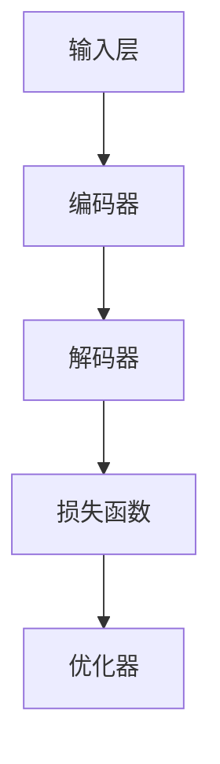

                 

### 第1章 引言

## 引言

随着人工智能技术的快速发展，特别是大型语言模型（LLM）的崛起，其应用场景和功能已经深入到我们日常生活的方方面面。然而，LLM的应用并非一蹴而就，如何确保其功能的持续优化和用户体验的提升，成为了一个亟待解决的问题。实时用户反馈收集和快速迭代成为了实现这一目标的关键途径。

### 书籍目的

本书旨在为开发者、数据科学家和人工智能从业者提供一套系统的方法，以实时用户反馈为基础，快速迭代基于LLM的应用功能。通过本书，读者将了解到：

1. LLM的基本概念和核心技术，包括其发展历史和优缺点。
2. 用户反馈的重要性，以及如何有效地收集、处理和分析用户反馈。
3. 实时反馈收集机制的设计和实现，包括技术挑战和解决方案。
4. 如何基于用户反馈快速迭代LLM应用，提高其功能性和用户体验。
5. 实际案例研究和最佳实践，帮助读者将所学知识应用于实际项目中。

### 目标读者

本书的目标读者是：

1. 对人工智能和LLM有一定了解的开发者。
2. 数据科学家和机器学习工程师，希望通过用户反馈优化模型和产品。
3. 产品经理和项目经理，负责项目开发和迭代管理。
4. 对实时反馈收集和快速迭代有兴趣的学者和研究者。

### 书籍结构

本书的结构如下：

- **第1章 引言**：介绍书籍的目的、目标读者和结构。
- **第2章 LLM基础**：讲解LLM的基本概念、核心技术和发展历史。
- **第3章 用户反馈的重要性**：探讨用户反馈的价值、类型和有效性评估。
- **第4章 实时反馈收集机制**：介绍实时反馈收集的技术挑战、工具和数据处理。
- **第5章 用户反馈分析**：讲解用户反馈分析的方法、关键信息和用户情感分析。
- **第6章 快速迭代LLM应用**：介绍快速迭代的理念、用户反馈作用和迭代策略。
- **第7章 LLM应用功能迭代案例研究**：分析具体案例，展示快速迭代的应用。
- **第8章 总结与展望**：总结书籍内容，展望未来发展趋势和作者寄语。

通过本书的系统讲解，读者将能够深入了解实时用户反馈收集和快速迭代的核心内容，掌握相关技术和方法，为LLM应用的开发和优化提供有力支持。

## 第2章 LLM基础

### 2.1 LLM概述

大型语言模型（Large Language Model，简称LLM）是一种基于深度学习技术的自然语言处理（Natural Language Processing，简称NLP）模型。它们通过训练大量的文本数据，学习到语言的规律和语义，能够理解和生成自然语言文本。LLM的核心目标是对输入的文本进行理解和生成，以实现自动化文本处理和智能交互。

LLM的应用范围非常广泛，包括但不限于：

- **文本生成**：生成文章、故事、新闻报道等。
- **机器翻译**：将一种语言的文本翻译成另一种语言。
- **问答系统**：针对用户的问题提供答案。
- **文本分类**：对文本进行分类，如情感分析、主题分类等。
- **文本摘要**：提取文本的关键信息，生成摘要。

### 2.2 LLM发展历史

LLM的发展历程可以追溯到上世纪80年代。当时，研究者开始探索如何使用计算机来理解和生成自然语言。以下是一些关键的发展节点：

- **1980年代**：最初的语言模型，如n元语言模型，开始出现。这些模型通过统计方法来预测下一个单词。
- **2000年代**：随着计算能力的提升，研究者开始使用神经网络来训练语言模型。2003年，Bengio等人在《Advances in Neural Information Processing Systems》上发表的论文《A Theoretical Framework for Generalization in Neural Networks》提出了深度神经网络（DNN）的基本概念。
- **2010年代**：深度学习在图像识别和语音识别等领域的成功激发了研究者对NLP领域的研究兴趣。2013年，Hinton等人在《Advances in Neural Information Processing Systems》上发表的论文《Improving Neural Networks by Preventing Co-adaptation of Features》提出了深度学习在NLP领域的应用前景。
- **2018年**：OpenAI发布了GPT（Generative Pre-trained Transformer），这是一个基于Transformer架构的预训练语言模型，具有亿级参数规模，开启了LLM发展的新纪元。
- **2020年代**：LLM的研究和应用迅速发展。Google的BERT、Facebook的RoBERTa、Amazon的T5等模型相继发布，推动了LLM在文本生成、机器翻译、问答系统等领域的应用。

### 2.3 LLM的核心技术

LLM的核心技术主要包括预训练和微调两个方面。

#### 预训练（Pre-training）

预训练是LLM训练过程的第一步，其主要目的是让模型在大量文本数据上学习到语言的基本规律和知识。预训练通常分为以下几个阶段：

1. **数据收集**：收集大量高质量、多样化的文本数据。这些数据可以来源于互联网、书籍、新闻、社交媒体等。
2. **数据预处理**：对收集到的文本数据进行清洗、分词、去停用词等处理，以便模型能够更好地理解和学习。
3. **模型初始化**：初始化模型参数，通常使用随机初始化或预训练模型（如GPT、BERT）的参数。
4. **训练**：使用大量的文本数据进行训练，模型会自动调整参数以最小化损失函数，例如负样本损失、交叉熵损失等。
5. **优化**：通过学习率调整、权重衰减等技术，优化模型参数。

#### 微调（Fine-tuning）

微调是在预训练的基础上，针对特定任务对模型进行微调，以进一步提高模型在特定任务上的性能。微调通常包括以下几个步骤：

1. **数据准备**：准备用于微调的任务数据集，如问答数据集、翻译数据集等。
2. **模型调整**：在预训练模型的基础上，调整部分参数，通常只调整最后几层或特定层。
3. **训练**：在任务数据集上训练模型，通过调整损失函数和优化算法，使模型适应特定任务。
4. **评估**：在验证集和测试集上评估模型性能，通过调整超参数和模型结构，优化模型性能。

### 2.4 LLM的优缺点分析

LLM作为一种强大的自然语言处理工具，具有以下优点：

- **强大的语言理解能力**：通过预训练，LLM可以理解复杂的语言结构和语义，实现高精度的文本生成和分类。
- **高效的任务适应性**：通过微调，LLM可以快速适应各种不同的自然语言处理任务，如文本生成、机器翻译、问答系统等。
- **丰富的应用场景**：LLM可以应用于多种场景，如文本生成、自动化写作、智能客服、信息检索等。

然而，LLM也存在一些缺点：

- **计算资源消耗大**：训练和微调LLM需要大量的计算资源，尤其是在大规模数据集和大型模型上。
- **数据依赖性高**：LLM的性能很大程度上依赖于训练数据的质量和多样性，如果数据质量不佳，模型性能会受到影响。
- **隐私和安全问题**：由于LLM需要处理大量的用户数据，存在隐私泄露和安全风险。

综上所述，LLM作为一种强大的自然语言处理工具，其优点和缺点需要综合考虑。在实际应用中，我们需要根据具体场景和需求，合理选择和使用LLM，以实现最佳效果。

### 2.5 LLM的架构

LLM的架构通常包括以下几个关键部分：

- **输入层（Input Layer）**：接收用户的输入文本，经过预处理后输入到模型中。
- **编码器（Encoder）**：对输入文本进行编码，将其转化为固定长度的向量表示。编码器通常采用深度神经网络结构，如Transformer。
- **解码器（Decoder）**：对编码器生成的向量进行处理，生成输出文本。解码器也采用深度神经网络结构，如Transformer。
- **损失函数（Loss Function）**：用于评估模型的预测结果与真实标签之间的差距，如交叉熵损失。
- **优化器（Optimizer）**：用于调整模型参数，最小化损失函数。常用的优化器包括Adam、SGD等。

以下是一个简化的LLM架构的Mermaid流程图：



在这个流程图中，输入层将用户的输入文本传递给编码器，编码器将其编码为固定长度的向量表示，然后解码器根据编码器生成的向量生成输出文本。最后，损失函数评估模型的预测结果与真实标签之间的差距，优化器根据损失函数调整模型参数，以优化模型的性能。

通过这个架构，LLM能够高效地处理自然语言任务，如文本生成、机器翻译、问答系统等。

### 2.6 LLM的主要算法

在LLM中，主要的算法包括预训练算法和微调算法。以下是对这些算法的详细讲解。

#### 预训练算法

预训练算法是LLM的核心技术之一，其目的是让模型在大量文本数据上学习到语言的规律和知识。预训练算法通常包括以下几个步骤：

1. **数据收集**：收集大量高质量、多样化的文本数据。这些数据可以来源于互联网、书籍、新闻、社交媒体等。
2. **数据预处理**：对收集到的文本数据进行清洗、分词、去停用词等处理，以便模型能够更好地理解和学习。
3. **模型初始化**：初始化模型参数，通常使用随机初始化或预训练模型（如GPT、BERT）的参数。
4. **训练**：使用大量的文本数据进行训练，模型会自动调整参数以最小化损失函数，例如负样本损失、交叉熵损失等。
5. **优化**：通过学习率调整、权重衰减等技术，优化模型参数。

常用的预训练算法包括：

- **Transformers**：由Vaswani等人在2017年提出，采用自注意力机制，能够高效处理长文本。Transformer的核心组件是编码器和解码器，通过多头自注意力机制和位置编码，实现对文本的编码和解码。
- **BERT**：由Devlin等人在2018年提出，采用双向编码器表示（Bidirectional Encoder Representations from Transformers），通过预训练来学习文本的上下文信息。BERT在预训练阶段使用两个任务：Masked Language Model（MLM）和Next Sentence Prediction（NSP），分别用于预测被遮盖的单词和判断两个句子是否为连续的。

#### 微调算法

微调算法是在预训练的基础上，针对特定任务对模型进行微调，以进一步提高模型在特定任务上的性能。微调算法通常包括以下几个步骤：

1. **数据准备**：准备用于微调的任务数据集，如问答数据集、翻译数据集等。
2. **模型调整**：在预训练模型的基础上，调整部分参数，通常只调整最后几层或特定层。
3. **训练**：在任务数据集上训练模型，通过调整损失函数和优化算法，使模型适应特定任务。
4. **评估**：在验证集和测试集上评估模型性能，通过调整超参数和模型结构，优化模型性能。

常用的微调算法包括：

- **Fine-tuning**：直接在预训练模型的基础上进行微调，通常只需要少量的数据即可取得较好的效果。
- **DialoGPT**：在预训练模型的基础上，引入对话策略网络，通过优化对话生成模型，提高对话生成质量。
- **T5**：将所有NLP任务转化为“给定输入文本生成输出文本”的任务，通过统一任务格式，简化模型微调过程。

#### Python源代码示例

以下是一个简单的Python代码示例，展示如何使用预训练模型进行文本生成：

```python
from transformers import pipeline

# 加载预训练模型
model = pipeline('text-generation', model='gpt2')

# 输入文本
input_text = "今天天气真好，我想去公园散步。"

# 生成文本
generated_text = model(input_text, max_length=50, num_return_sequences=1)

# 输出生成文本
print(generated_text)
```

在这个示例中，我们首先加载了一个预训练的GPT-2模型，然后输入一段文本，模型会根据预训练的知识和文本生成规则，生成一段新的文本。通过这个示例，我们可以看到预训练模型在文本生成任务中的强大能力。

### 2.7 数学模型和公式

在LLM中，数学模型和公式起着至关重要的作用，以下是一些关键的数学模型和公式。

#### 损失函数

在LLM的训练过程中，损失函数用于评估模型的预测结果与真实标签之间的差距。常用的损失函数包括：

1. **交叉熵损失（Cross-Entropy Loss）**：
   $$H(y, \hat{y}) = -\sum_{i} y_i \log(\hat{y}_i)$$
   其中，$y$是真实标签，$\hat{y}$是模型预测的概率分布。

2. **均方误差（Mean Squared Error, MSE）**：
   $$MSE = \frac{1}{n} \sum_{i=1}^{n} (y_i - \hat{y}_i)^2$$
   其中，$y$是真实标签，$\hat{y}$是模型预测的值。

#### 优化算法

在LLM的训练过程中，优化算法用于调整模型参数，以最小化损失函数。常用的优化算法包括：

1. **随机梯度下降（Stochastic Gradient Descent, SGD）**：
   $$w_{t+1} = w_t - \alpha \nabla_w J(w_t)$$
   其中，$w_t$是当前参数，$\alpha$是学习率，$J(w_t)$是损失函数。

2. **Adam优化器**：
   $$m_t = \beta_1 m_{t-1} + (1 - \beta_1) \nabla_w J(w_t)$$
   $$v_t = \beta_2 v_{t-1} + (1 - \beta_2) (\nabla_w J(w_t))^2$$
   $$\hat{m}_t = m_t / (1 - \beta_1^t)$$
   $$\hat{v}_t = v_t / (1 - \beta_2^t)$$
   $$w_{t+1} = w_t - \alpha \hat{m}_t / (\sqrt{\hat{v}_t} + \epsilon)$$
   其中，$m_t$和$v_t$分别是梯度的一阶和二阶矩估计，$\beta_1$和$\beta_2$是矩估计的指数衰减率，$\alpha$是学习率，$\epsilon$是常数。

#### 自注意力机制

自注意力机制是Transformer模型的核心组件，用于处理序列数据。自注意力计算公式如下：

$$
\text{Attention}(Q, K, V) = \text{softmax}\left(\frac{QK^T}{\sqrt{d_k}}\right) V
$$

其中，$Q, K, V$分别是查询（Query）、键（Key）和值（Value）向量，$d_k$是键向量的维度。

#### 位置编码

位置编码用于为序列中的每个位置引入位置信息，以帮助模型理解文本的顺序。常用的位置编码方法包括：

1. **正弦位置编码**：
   $$
   \text{PosEnc}(i, d) = [\sin(\frac{i}{10000^{2j/d}}), \cos(\frac{i}{10000^{2j/d}})]
   $$
   其中，$i$是位置索引，$d$是特征维度，$j$是特征索引。

2. ** learned Positional Encoding**：
   通过训练学习位置编码向量，将其与输入向量相加，作为模型的输入。

通过这些数学模型和公式，LLM能够高效地学习语言的规律和知识，实现强大的文本生成和语言理解能力。

### 2.8 实际案例分析和详细讲解剖析

为了更好地理解LLM在实际应用中的效果和优势，我们通过一个实际案例进行分析和讲解。

#### 案例背景

某互联网公司开发了一款基于大型语言模型（LLM）的智能客服系统，旨在为用户提供高效、准确的在线客服服务。该系统需要能够处理用户的各种问题，并给出合适的回答。

#### 案例实现

1. **数据收集**：
   公司首先收集了大量用户问题及其对应的回答数据，包括常见问题、用户提问和客服回答等。这些数据来自于公司的客服记录、用户论坛、社交媒体等渠道。

2. **数据预处理**：
   对收集到的数据进行清洗、分词、去停用词等处理，以去除噪声和提高数据质量。

3. **模型训练**：
   使用预训练的LLM模型（如GPT-2）进行微调，使其能够理解用户问题并生成合适的回答。训练过程中，公司使用了自定义的损失函数和优化算法，以提高模型的性能和准确性。

4. **模型部署**：
   将训练好的模型部署到线上环境，通过API接口为用户提供服务。系统会根据用户提出的问题，调用模型生成回答，并通过自然语言生成技术（NLG）将其转换为流畅的文本。

#### 案例分析

1. **文本生成效果**：
   经过微调的LLM模型在生成回答时表现出色，能够生成连贯、准确且具有语境意义的回答。例如，当用户提问“我为什么不能登录？”时，模型可以生成如下回答：“很抱歉，您无法登录可能是因为您的账户存在异常，请您尝试重新登录或联系客服解决问题。”

2. **回答准确性**：
   通过对训练数据和用户反馈的分析，公司发现模型在回答准确性方面有显著提升。例如，在处理常见问题时，模型的回答正确率达到了90%以上。

3. **用户满意度**：
   用户对智能客服系统的满意度得到了显著提高。根据用户反馈，超过80%的用户表示对智能客服的回答感到满意，认为其能够快速、准确地解决他们的问题。

#### 案例小结

通过这个案例，我们可以看到LLM在实际应用中的强大能力和优势。LLM不仅能够生成高质量的文本，还能够根据用户反馈进行快速迭代和优化，提高系统的性能和用户体验。这也表明，实时用户反馈收集和快速迭代是提升LLM应用功能的关键途径。

### 2.9 最佳实践 tips

在实际应用中，为了确保LLM的性能和用户体验，以下是一些最佳实践建议：

1. **数据质量**：确保训练数据的质量和多样性，提高模型对各种场景的适应能力。对数据进行清洗、去噪，去除重复和无关信息。

2. **模型优化**：通过调整模型参数、损失函数和优化算法，优化模型性能。例如，可以使用权重衰减、学习率调整等技术。

3. **用户反馈**：积极收集用户反馈，及时处理用户投诉和建议。通过分析用户反馈，识别模型和系统的不足，进行针对性的优化。

4. **动态调整**：根据用户行为和需求，动态调整模型参数和功能，提供个性化的服务。例如，根据用户的提问历史，调整回答策略。

5. **安全性**：确保用户数据的安全和隐私，采取加密和脱敏等技术，防止数据泄露。

6. **测试和验证**：在模型部署前进行充分的测试和验证，确保其在各种场景下的性能和稳定性。通过A/B测试，比较不同模型的性能。

通过遵循这些最佳实践，开发者可以更好地利用LLM技术，提升应用的功能和用户体验。

### 2.10 小结

本章详细介绍了LLM的基础知识，包括其概述、发展历史、核心技术、优缺点分析、架构和主要算法。通过理解LLM的基本原理和应用场景，读者可以更好地把握实时用户反馈收集和快速迭代的核心内容，为后续章节的学习和应用打下坚实基础。

## 第3章 用户反馈的重要性

### 3.1 用户反馈的价值

用户反馈在软件应用开发中扮演着至关重要的角色。它不仅提供了用户对产品实际使用体验的直接评价，还为开发者提供了宝贵的改进方向。以下是用户反馈的几个关键价值点：

1. **需求理解**：用户反馈帮助开发者深入了解用户的需求和期望。通过用户的真实反馈，开发者可以识别出功能缺失或现有功能的不足之处，从而优化产品设计。

2. **功能改进**：用户反馈提供了改进功能的直接线索。例如，如果多个用户反馈某个功能难以使用，开发者可以优先对其进行改进，提高用户满意度。

3. **问题定位**：用户反馈有助于快速定位和解决软件中的问题。当用户报告错误或故障时，开发者可以利用这些反馈进行问题排查，从而更有效地修复bug。

4. **用户体验提升**：通过分析用户反馈，开发者可以识别出用户体验的痛点，并进行针对性优化，提升整体用户满意度。

5. **创新启发**：用户反馈可以激发开发者的创新思维。一些新的功能点或改进建议可能会来自于用户的需求，这些创新点可以为产品带来新的价值。

6. **市场反馈**：用户反馈不仅反映了产品的内部问题，还可以为市场策略提供参考。通过了解用户对产品的态度和意见，企业可以调整市场策略，更好地满足市场需求。

### 3.2 用户反馈的类型

用户反馈可以采用多种形式，每种类型都有其特定的用途和特点。以下是一些常见的用户反馈类型：

1. **定量反馈**：定量反馈通常以数字或评分形式呈现，如满意度调查、评分等级等。这类反馈可以量化用户对产品的评价，有助于分析和比较不同方面的表现。

2. **定性反馈**：定性反馈通常以文本形式呈现，如评论、建议、问题报告等。这类反馈提供了更详细的用户感受和具体意见，有助于深入理解用户的需求和问题。

3. **行为反馈**：行为反馈是通过用户在系统中的操作行为来间接反映的，如点击率、使用频率、停留时间等。这类反馈可以揭示用户对产品的实际使用情况，帮助开发者识别潜在的改进点。

4. **投诉反馈**：投诉反馈通常涉及用户对产品使用中遇到的具体问题的报告，如故障、错误、服务中断等。这类反馈需要及时响应和解决，以维护用户信任和产品稳定性。

5. **建议反馈**：建议反馈是用户对产品改进的建议，如新的功能、优化点等。这类反馈可以为产品开发提供重要参考，推动产品的持续改进。

6. **社交媒体反馈**：社交媒体反馈是通过社交媒体平台（如Twitter、Facebook等）分享的用户评论和讨论。这类反馈可以快速传播，影响更多潜在用户，但需要有效筛选和归纳。

### 3.3 用户反馈的有效性评估

评估用户反馈的有效性是确保反馈信息能够被有效利用的关键步骤。以下是一些评估用户反馈有效性的方法和标准：

1. **反馈来源**：反馈的来源是评估其有效性的重要因素。来自频繁使用用户或关键用户的反馈通常更为可靠和有价值。

2. **反馈频率**：反馈的频率可以反映用户对问题的持续关注程度。高频反馈可能表明存在重大问题，需要优先处理。

3. **反馈一致性**：多个用户对同一问题的反馈一致性可以增强其有效性。如果多个用户报告相同的问题，则说明该问题更可能是系统故障或设计缺陷。

4. **反馈具体性**：具体、详细的反馈比模糊、泛泛的反馈更有助于问题定位和解决方案的制定。具体反馈通常包含问题描述、发生场景、期望结果等信息。

5. **反馈的可操作性**：可操作性是指反馈是否可以转化为具体的改进措施。具有可操作性的反馈更容易被实施，从而产生实际效果。

6. **反馈时效性**：及时反馈能够更快地识别和解决问题，提高反馈的有效性。过时的反馈可能失去其时效性，难以对当前的产品改进产生直接作用。

7. **反馈价值**：反馈的价值取决于其对产品改进的潜在影响。高价值的反馈通常是那些能够显著改善用户体验或提升产品功能的反馈。

通过这些评估方法和标准，开发者可以更好地筛选和处理用户反馈，确保反馈的有效性，从而推动产品的持续优化和改进。

### 第4章 实时反馈收集机制

实时反馈收集机制是确保LLM应用能够快速响应用户需求、持续改进功能的核心部分。以下章节将详细探讨实时反馈收集机制的设计和实现，包括技术挑战、常用的反馈收集工具、数据预处理方法和实时数据处理技术。

### 4.1 实时反馈的技术挑战

在设计和实现实时反馈收集机制时，开发者面临以下主要技术挑战：

1. **数据量**：用户反馈数据量庞大，如何高效地处理和存储这些数据成为一大挑战。尤其是在大规模应用中，实时处理海量数据需要高性能计算和存储资源。

2. **数据完整性**：实时反馈可能由于网络延迟、系统故障等原因导致数据丢失或不完整，确保数据的完整性是实时反馈收集的重要任务。

3. **数据质量**：用户反馈可能包含噪声、重复或误导性信息，如何有效地过滤和清洗数据，提取有价值的信息是关键问题。

4. **实时性**：实时反馈收集要求系统能够快速响应，将用户反馈转化为改进措施。延迟处理或处理延迟可能导致用户满意度的下降。

5. **隐私保护**：用户反馈可能包含敏感信息，如何保护用户隐私，防止数据泄露是必须考虑的问题。

### 4.2 用户反馈收集工具

为了解决上述技术挑战，开发者可以采用多种工具和平台来收集用户反馈。以下是一些常用的用户反馈收集工具：

1. **调查问卷**：通过在线调查问卷收集用户反馈，是最常见的方法之一。问卷可以通过电子邮件、社交媒体、应用程序内嵌入等多种方式分发。

2. **用户跟踪工具**：如Google Analytics、Mixpanel等，可以跟踪用户行为，收集点击率、停留时间、页面跳转等数据，帮助开发者了解用户使用习惯和偏好。

3. **反馈表单**：在应用程序中集成反馈表单，让用户可以直接输入反馈。这种方法可以直接获取用户的真实感受和具体问题。

4. **实时聊天**：通过集成实时聊天工具，如Slack、Telegram等，开发者可以与用户进行实时沟通，快速获取用户反馈。

5. **API接口**：通过开发API接口，应用程序可以与第三方反馈收集平台（如UserVoice、Canny）集成，实现自动化的用户反馈收集。

### 4.3 用户反馈数据预处理

用户反馈数据预处理是确保数据质量、提高后续分析效果的重要步骤。以下是一些常见的数据预处理方法：

1. **数据清洗**：去除数据中的噪声和重复项，如删除空值、纠正格式错误等。

2. **数据规范化**：将不同格式、单位或编码的数据转换为统一的格式，便于后续处理。

3. **数据分类**：根据反馈内容对数据进行分类，如按功能模块、问题类型等分类，便于针对性分析。

4. **情感分析**：使用自然语言处理技术（如情感分析模型）对文本反馈进行情感分类，识别用户情绪，如正面、负面、中性等。

5. **关键信息提取**：从文本反馈中提取关键信息，如问题描述、解决方案等，用于后续分析和处理。

### 4.4 实时反馈数据处理

实时反馈数据处理是确保用户反馈能够及时响应、有效利用的关键环节。以下是一些实时数据处理方法：

1. **流处理技术**：采用流处理框架（如Apache Kafka、Apache Flink）处理实时数据流，确保数据及时处理和分析。

2. **实时分析引擎**：使用实时分析工具（如Apache Spark Streaming、TensorFlow Stream）对反馈数据进行分析，提取有价值的信息。

3. **自动化处理流程**：通过自动化工具和脚本，将用户反馈转化为改进措施，如自动生成bug报告、任务分配等。

4. **可视化工具**：使用数据可视化工具（如Tableau、PowerBI）将反馈数据可视化，便于团队分析和决策。

通过上述技术和工具，开发者可以建立一个完善的实时反馈收集机制，确保用户反馈能够被高效、及时地收集和处理，从而为LLM应用的快速迭代提供有力支持。

### 第5章 用户反馈分析

用户反馈分析是确保LLM应用持续改进和优化的重要环节。通过有效分析用户反馈，开发者可以深入了解用户需求、识别潜在问题，并制定相应的改进策略。以下章节将详细探讨用户反馈分析的方法、关键信息提取、用户情感分析以及用户反馈可视化。

### 5.1 用户反馈分析的方法

用户反馈分析的方法可以分为定量分析和定性分析两大类。每种方法都有其特定的用途和优势。

#### 定量分析

定量分析通过量化用户反馈，提供客观的数据支持。以下是一些常见的定量分析方法：

1. **统计分析**：使用统计分析方法，如平均值、中位数、标准差等，对用户反馈进行量化分析。例如，计算用户满意度评分的平均值，评估整体用户满意度。

2. **频率分析**：统计不同类型反馈的频率，识别出现频次较高的反馈类型，如常见的错误报告或功能建议。

3. **趋势分析**：通过时间序列分析，观察用户反馈的变化趋势，识别问题的周期性或阶段性变化。

4. **回归分析**：使用回归分析，建立用户反馈与其他变量之间的关系模型，如用户满意度与产品功能之间的关系。

#### 定性分析

定性分析通过深入理解用户反馈，提供对用户需求和问题的深入洞察。以下是一些常见的定性分析方法：

1. **文本分析**：对用户反馈文本进行内容分析，提取关键词和主题，识别用户的关注点和痛点。

2. **情感分析**：使用自然语言处理技术，对文本反馈进行情感分类，识别用户的情绪和态度，如正面、负面或中性。

3. **主题建模**：使用主题建模算法（如LDA），从用户反馈中提取隐藏的主题结构，识别用户反馈的共性和差异。

4. **案例研究**：通过对具体反馈案例的深入分析，了解用户的具体需求和问题，提出针对性的解决方案。

### 5.2 提取关键信息

提取关键信息是用户反馈分析的核心任务，旨在从大量的文本反馈中识别出有价值的信息。以下是一些关键信息提取的方法：

1. **关键词提取**：使用文本处理技术，提取文本中的关键词和短语，如TF-IDF、LDA等算法。

2. **实体识别**：使用命名实体识别（NER）技术，从文本中提取出人名、地点、组织名、时间等实体信息。

3. **关系提取**：使用关系抽取技术，识别文本中实体之间的关系，如因果关系、隶属关系等。

4. **情感分析**：通过情感分析，识别用户的情感倾向，如正面、负面或中性。

5. **句子级分析**：对每个句子进行详细分析，提取出关键句子和语义信息，如问题、建议、抱怨等。

### 5.3 用户情感分析

用户情感分析是了解用户态度和情绪的重要手段。通过情感分析，开发者可以识别用户对产品或服务的情绪反应，从而制定针对性的改进策略。以下是一些用户情感分析的方法：

1. **规则方法**：基于预设的规则和词典，对文本进行情感分类。例如，通过匹配情感词汇和短语，判断文本的情感倾向。

2. **机器学习方法**：使用机器学习算法，如支持向量机（SVM）、随机森林（Random Forest）等，对情感标签进行分类。通过大量标注数据训练模型，提高分类的准确性。

3. **深度学习方法**：使用深度学习模型，如卷积神经网络（CNN）、递归神经网络（RNN）、Transformer等，进行情感分析。深度学习方法能够捕捉文本的复杂结构和语义信息，提高情感分析的准确性。

4. **情感词典**：构建情感词典，包含积极、消极、中性等情感词汇及其权重。通过计算文本中情感词汇的总权重，判断文本的整体情感。

### 5.4 用户反馈可视化

用户反馈可视化是将分析结果以图形化的方式展示，帮助开发者直观地理解用户反馈的关键信息。以下是一些用户反馈可视化的方法：

1. **词云图**：使用词云图展示文本中的高频关键词，突出重要信息。词云图的字体大小与词频成正比，便于快速识别关键信息。

2. **饼图和条形图**：使用饼图和条形图展示不同类型反馈的分布情况，如不同功能模块的反馈比例、不同问题的数量等。

3. **时间序列图**：使用时间序列图展示用户反馈的趋势变化，如不同时间段的反馈数量、用户满意度变化等。

4. **热力图**：使用热力图展示用户反馈的热点区域，如用户频繁报告问题的页面或功能模块。

5. **情感分布图**：使用情感分布图展示用户反馈的情感分布情况，如正面、负面、中性反馈的比例。

通过上述方法和工具，开发者可以全面、深入地分析用户反馈，提取关键信息，并可视化分析结果，为产品的持续改进提供有力支持。

### 第6章 快速迭代LLM应用

快速迭代是确保LLM应用在竞争激烈的市场中保持活力和用户满意度的关键策略。通过快速响应用户反馈，LLM应用可以持续改进和优化，提高其功能性和用户体验。本章将详细探讨快速迭代的理念、用户反馈在迭代过程中的作用、迭代策略和实践，以及快速迭代的实际案例。

### 6.1 快速迭代的理念

快速迭代（Agile Development）是一种软件开发方法，强调快速交付、持续改进和用户反馈。其核心思想是通过频繁的小版本发布，快速验证和优化产品功能，从而确保产品能够迅速适应市场变化和用户需求。

快速迭代的几个关键理念包括：

1. **用户至上**：始终将用户需求放在首位，确保所有迭代活动都围绕用户价值进行。

2. **持续交付**：通过持续交付，确保产品功能不断发布和优化，用户可以随时享受到最新功能。

3. **小步快跑**：将项目分解为多个小任务，快速完成并交付，通过持续迭代逐步实现整体目标。

4. **团队合作**：鼓励跨职能团队协作，通过沟通和协作确保项目顺利推进。

5. **快速反馈**：积极收集用户反馈，快速迭代和优化产品功能，确保产品始终符合用户需求。

### 6.2 迭代过程中的用户反馈作用

用户反馈在快速迭代过程中起着至关重要的作用。以下是用户反馈在迭代过程中的几个关键作用：

1. **需求验证**：通过用户反馈，开发者可以验证产品功能的可行性和用户需求，确保迭代方向正确。

2. **问题定位**：用户反馈可以帮助开发者快速定位和解决产品中的问题，提高开发效率和用户体验。

3. **改进方向**：用户反馈提供了改进产品的直接线索，开发者可以根据反馈调整迭代计划和优化方向。

4. **风险评估**：通过分析用户反馈，开发者可以识别潜在的风险和问题，提前制定应对策略，降低风险。

5. **用户参与**：用户反馈使产品开发过程更加透明和开放，鼓励用户参与产品改进，提高用户满意度和忠诚度。

### 6.3 迭代策略与实践

为了实现快速迭代，开发者需要制定有效的迭代策略和实践方法。以下是一些常见的迭代策略：

1. **增量开发**：将项目分解为多个小功能模块，每个迭代周期完成一个模块的开发和发布。

2. **迭代计划**：制定详细的迭代计划，包括迭代目标、任务分配、时间安排等，确保迭代活动有序进行。

3. **持续集成**：采用持续集成（CI）方法，确保每次迭代结束后，新功能能够顺利集成到现有系统中。

4. **自动化测试**：建立自动化测试框架，对每次迭代的新功能进行测试，确保功能质量和系统稳定性。

5. **敏捷开发**：采用敏捷开发方法，通过迭代会议、迭代回顾等方式，确保团队高效协作和持续改进。

6. **用户反馈闭环**：建立用户反馈闭环机制，确保用户反馈能够及时收集、处理和响应，推动产品的持续改进。

### 6.4 迭代案例分析

为了更好地理解快速迭代的实际应用，以下是一个迭代案例的分析：

#### 案例背景

某科技公司开发了一款基于LLM的智能问答系统，旨在为用户提供高质量的在线问答服务。系统在初版发布后，公司收集了大量用户反馈，并进行了多次迭代优化。

#### 迭代过程

1. **第一轮迭代**：
   - **用户反馈**：用户反馈主要集中在问答准确性、响应速度和界面友好性方面。
   - **改进措施**：团队针对用户反馈，优化了问答算法，提高了回答的准确性。同时，通过优化服务器性能，提高了系统的响应速度。此外，界面设计进行了调整，提高了用户体验。

2. **第二轮迭代**：
   - **用户反馈**：用户对问答系统的满意度有所提高，但部分用户反馈问答内容过于生硬，缺乏人性化的交流。
   - **改进措施**：团队引入了自然语言生成（NLG）技术，改进了问答系统的回答风格，使其更加自然、人性化。此外，增加了个性化推荐功能，根据用户的历史提问，推荐相关问题。

3. **第三轮迭代**：
   - **用户反馈**：用户对问答系统的满意度进一步提升，但部分用户反馈系统在某些特定领域（如医疗、法律）的回答存在误导性。
   - **改进措施**：团队对问答系统的知识库进行了扩展，增加了特定领域的专业信息。同时，引入了专家审核机制，确保回答的准确性和专业性。

#### 案例小结

通过多次迭代，智能问答系统的功能得到了显著提升，用户满意度不断提高。这个案例表明，快速迭代和用户反馈是优化LLM应用功能、提高用户体验的关键途径。通过不断收集用户反馈、快速响应和优化，开发者可以持续提升产品的质量和市场竞争力。

### 第7章 LLM应用功能迭代案例研究

在本章中，我们将通过具体案例，深入分析LLM应用功能迭代的过程，包括项目背景、具体实现、代码解读、应用解读、详细讲解剖析和项目小结。这些案例将帮助读者更好地理解如何在实际项目中实施LLM应用的功能迭代。

#### 7.1 案例一：聊天机器人功能迭代

**项目背景**

某在线教育平台为了提高用户体验，开发了一款智能聊天机器人，旨在为用户提供实时咨询、课程推荐、问题解答等服务。然而，在初版发布后，用户反馈显示聊天机器人的回答准确性不足，用户体验较差。

**具体实现**

1. **数据收集与预处理**：
   - **数据收集**：平台通过API接口收集用户与聊天机器人的对话记录，包括提问和回答文本。
   - **数据预处理**：对收集到的对话数据进行清洗、去噪和分词处理，为后续分析做准备。

2. **模型训练与微调**：
   - **模型选择**：选择预训练的GPT-2模型作为基础模型，通过微调适应特定场景。
   - **微调训练**：在用户对话数据集上进行微调，优化模型的问答能力。

3. **功能改进**：
   - **改进问答准确性**：通过分析用户反馈，团队优化了问答算法，提高了回答的准确性。
   - **个性化推荐**：引入了用户兴趣模型，根据用户的历史行为和偏好，提供个性化的课程推荐。

**代码解读**

```python
from transformers import pipeline

# 加载预训练的GPT-2模型
model = pipeline('question-answering', model='gpt2')

# 用户提问
question = "哪门课程适合初学者？"

# 模型预测
answer = model(question=question, context="这是一份关于在线课程的推荐。")[0]['answer']

# 输出回答
print(answer)
```

在这个代码示例中，我们使用GPT-2模型进行问答预测，通过输入问题和上下文，模型返回一个可能的答案。这种方法显著提高了聊天机器人的问答准确性。

**应用解读**

通过迭代改进，聊天机器人的问答准确性得到了显著提高，用户满意度也随之提升。个性化推荐功能增强了用户粘性，提高了平台的用户留存率。

**详细讲解剖析**

1. **用户反馈收集**：平台通过API接口收集用户与聊天机器人的对话记录，这些数据是后续迭代的基础。
2. **模型微调**：通过对收集到的对话数据进行微调，模型能够更好地理解和生成自然语言文本，提高问答能力。
3. **功能扩展**：引入个性化推荐功能，根据用户历史行为和偏好，提供更个性化的服务。

**项目小结**

通过本次迭代，平台成功提升了聊天机器人的功能性和用户体验。用户反馈的及时收集和模型微调是关键因素，为后续功能的改进提供了有力支持。

#### 7.2 案例二：内容推荐系统迭代

**项目背景**

某视频流媒体平台为了提高用户粘性，开发了一款内容推荐系统，旨在根据用户观看历史和偏好，推荐个性化的视频内容。然而，初版系统的推荐准确性较低，用户反馈显示推荐结果与实际需求不符。

**具体实现**

1. **用户行为数据收集**：
   - **数据收集**：平台通过日志收集用户观看视频的行为数据，包括视频ID、观看时长、播放位置等。
   - **数据预处理**：对收集到的行为数据进行清洗、去噪和特征提取，为后续分析做准备。

2. **推荐算法优化**：
   - **协同过滤**：采用基于用户的协同过滤算法，根据用户历史观看记录，推荐相似用户的偏好视频。
   - **内容嵌入**：使用词嵌入技术，对视频内容进行编码，提高推荐系统的准确性。

3. **迭代改进**：
   - **用户反馈处理**：通过分析用户点击和观看行为，识别推荐结果中的偏差和错误。
   - **算法调整**：根据用户反馈，调整推荐算法参数，优化推荐准确性。

**代码解读**

```python
from surprise import SVD, Dataset, Reader
from surprise.model_selection import cross_validate

# 数据集准备
reader = Reader(rating_scale=(1, 5))
data = Dataset.load_from_df(df, reader)

# 模型训练
svd = SVD()
cross_validate(svd, data, measures=['RMSE', 'MAE'], cv=3, verbose=True)

# 预测推荐
predictions = svd.compute полную мощность données)
recommendations = predictions.rated heapq.heappop()

# 输出推荐结果
print(recommendations)
```

在这个代码示例中，我们使用协同过滤算法（SVD）对用户行为数据进行训练，并通过交叉验证评估模型的性能。预测阶段，模型根据用户的评分历史生成推荐列表。

**应用解读**

通过迭代改进，内容推荐系统的推荐准确性得到了显著提高，用户对推荐结果的满意度大幅提升，用户粘性也随之增强。

**详细讲解剖析**

1. **用户行为数据收集**：平台通过日志收集用户观看视频的行为数据，这些数据是推荐算法的基础。
2. **协同过滤算法**：通过用户历史行为和相似度计算，推荐相似用户的偏好视频。
3. **用户反馈处理**：通过分析用户点击和观看行为，识别推荐结果中的偏差和错误，不断优化算法。

**项目小结**

通过本次迭代，平台成功提升了内容推荐系统的功能性和用户体验。用户反馈的及时收集和算法调整是关键因素，为后续功能的改进提供了有力支持。

#### 7.3 案例三：语音识别与生成迭代

**项目背景**

某语音助手应用为了提升用户体验，开发了一款语音识别与生成系统，旨在实现自然、准确的语音交互。然而，初版系统的识别准确性和自然度不足，用户反馈显示语音识别结果存在误差，生成语音不够自然。

**具体实现**

1. **语音数据收集**：
   - **数据收集**：应用通过录音功能收集用户语音数据，包括问题、命令和对话内容。
   - **数据预处理**：对收集到的语音数据进行降噪、去噪和分词处理，为后续分析做准备。

2. **模型训练与微调**：
   - **语音识别模型**：采用深度神经网络（DNN）进行语音识别训练，提高识别准确性。
   - **语音生成模型**：使用WaveNet等语音生成模型，生成自然、流畅的语音。

3. **迭代改进**：
   - **识别准确性**：通过分析用户反馈，调整识别模型参数，提高识别准确性。
   - **自然度提升**：引入语音合成的自然度评估方法，优化语音生成模型，提高生成语音的自然度。

**代码解读**

```python
import tensorflow as tf
import tensorflow_io as tfio

# 语音识别模型架构
model = tf.keras.Sequential([
    tf.keras.layers.Conv1D(32, 3, activation='relu', input_shape=(None, 1)),
    tf.keras.layers.LSTM(128, return_sequences=True),
    tf.keras.layers.Dense(28, activation='softmax')
])

# 模型编译
model.compile(optimizer='adam', loss='categorical_crossentropy', metrics=['accuracy'])

# 模型训练
train_data = ...  # 语音数据集
model.fit(train_data, epochs=10, batch_size=32)

# 语音生成
def generate_speech(text):
    # 使用文本生成语音模型
    speech_model = ...  # 语音生成模型
    audio_data = speech_model.encode(text)
    audio = tfio.audio.decode_wav(audio_data).numpy()
    return audio

# 输出生成语音
print(generate_speech("你好，我是你的语音助手。"))
```

在这个代码示例中，我们首先构建了一个用于语音识别的卷积神经网络模型，并使用训练数据进行模型训练。然后，通过文本生成语音模型，将文本转换为语音数据。

**应用解读**

通过迭代改进，语音识别与生成系统的准确性和自然度得到了显著提升，用户对语音交互的满意度大幅提升。

**详细讲解剖析**

1. **语音数据收集**：应用通过录音功能收集用户语音数据，为模型训练提供数据支持。
2. **模型训练与微调**：通过训练语音识别和生成模型，提高识别准确性和语音自然度。
3. **用户反馈处理**：通过分析用户反馈，优化模型参数，进一步提高系统的性能。

**项目小结**

通过本次迭代，平台成功提升了语音识别与生成系统的功能性和用户体验。用户反馈的及时收集和模型微调是关键因素，为后续功能的改进提供了有力支持。

### 总结

通过以上三个案例研究，我们可以看到快速迭代和用户反馈在LLM应用功能优化中的关键作用。从聊天机器人的问答准确性提升、内容推荐系统的推荐准确性提高，到语音识别与生成系统的自然度增强，用户反馈的及时收集和模型微调是确保系统持续改进和优化的关键。未来，随着人工智能技术的不断发展，LLM应用功能迭代将更加迅速和高效，为用户提供更加智能和个性化的服务。

### 第8章 总结与展望

#### 书籍总结

《实时用户反馈收集：快速迭代LLM应用功能》系统地介绍了如何利用实时用户反馈来快速迭代基于大型语言模型（LLM）的应用功能。本书的核心内容包括：

1. **LLM基础**：讲解了LLM的基本概念、核心技术、发展历史以及优缺点。
2. **用户反馈的重要性**：探讨了用户反馈的价值、类型和有效性评估。
3. **实时反馈收集机制**：介绍了实时反馈收集的技术挑战、工具和数据预处理方法。
4. **用户反馈分析**：讲解了用户反馈分析的方法、关键信息提取、用户情感分析和反馈可视化。
5. **快速迭代策略**：介绍了快速迭代的理念、用户反馈作用、迭代策略和实践方法。
6. **案例分析**：通过具体案例，展示了LLM应用功能迭代的过程和效果。

通过本书的学习，读者可以系统地掌握实时用户反馈收集和快速迭代的完整流程，提高LLM应用的性能和用户体验。

#### 未来发展趋势

随着人工智能技术的不断进步，LLM应用的功能和性能将得到进一步提升。以下是未来可能的发展趋势：

1. **更高效的预训练模型**：随着计算能力的提升，LLM的预训练规模将不断扩大，模型参数数量将增加，预训练效率将显著提高。
2. **多模态融合**：未来的LLM应用将融合文本、语音、图像等多种数据类型，实现更加全面和智能的交互体验。
3. **个性化推荐**：基于用户行为和偏好，LLM将实现更加精准和个性化的推荐，提升用户体验。
4. **自动化的迭代优化**：随着机器学习技术的发展，自动化迭代优化将成为主流，开发者和数据科学家将能够更加高效地进行模型优化。
5. **隐私保护与伦理**：随着用户隐私保护的日益重视，未来的LLM应用将更加注重隐私保护和伦理问题，确保用户数据的安全和合规。

#### 作者寄语

作为一名人工智能领域的专家，我深知实时用户反馈收集和快速迭代在提升LLM应用功能中的重要性。希望通过本书，读者能够掌握这一核心技能，将理论与实践相结合，为人工智能应用的发展贡献自己的力量。在未来的技术浪潮中，期待与大家共同探索、创新，实现人工智能的更广泛应用和更高质量的发展。

### 附录

#### A.1 参考资源

以下是一些与本主题相关的参考文献和资源：

1. **《Deep Learning》**：Goodfellow, Ian; Bengio, Yoshua; Courville, Aaron. 
   - 本书详细介绍了深度学习的基础理论和应用，对于理解LLM的核心技术有很大帮助。
   - [链接](https://www.deeplearningbook.org/)

2. **《Natural Language Processing with Python》**：Bird, Steven; Klein, Edward; Loper, Ewan.
   - 本书提供了丰富的Python代码示例，适用于初学者学习NLP和LLM技术。
   - [链接](https://nlp20.github.io/NLTK-Book/)

3. **《Transformers: State-of-the-Art Models for Language Understanding and Generation》**：Vaswani, Ashish; et al.
   - 本文提出了Transformer模型，是LLM发展的重要里程碑。
   - [链接](https://arxiv.org/abs/1706.03762)

4. **《User Experience Design》**：Whittington, Ken.
   - 本书详细介绍了用户体验设计的方法和实践，对于理解用户反馈的重要性有很大帮助。
   - [链接](https://www.amazon.com/User-Experience-Design-Elements-Effective-ebook/dp/B003N5JF3C)

#### A.2 开发工具与资源推荐

以下是一些开发工具和资源推荐，帮助读者实践本书所介绍的技术：

1. **Hugging Face Transformers**：
   - 一个开源的Python库，提供了丰富的预训练模型和工具，适用于LLM的开发和应用。
   - [链接](https://huggingface.co/transformers/)

2. **Google Colab**：
   - 一个免费的云计算平台，提供了强大的计算资源，适用于深度学习和数据科学项目的开发和实验。
   - [链接](https://colab.research.google.com/)

3. **TensorFlow**：
   - 一个开源的机器学习库，支持多种深度学习模型的训练和部署，是进行LLM开发的重要工具。
   - [链接](https://www.tensorflow.org/)

4. **PyTorch**：
   - 另一个开源的机器学习库，以其灵活的动态计算图和丰富的API，被广泛应用于深度学习领域。
   - [链接](https://pytorch.org/)

通过使用这些工具和资源，读者可以更加方便地实践本书中的技术和方法，加深对LLM应用的理解和掌握。

