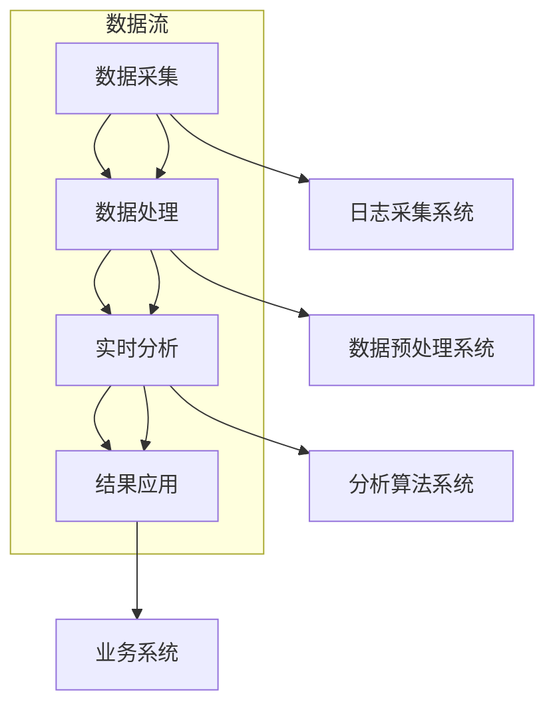
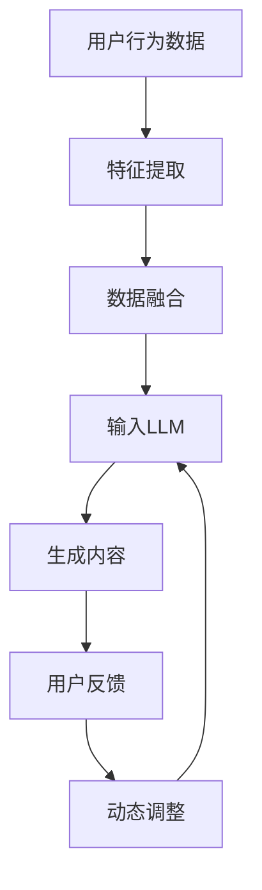
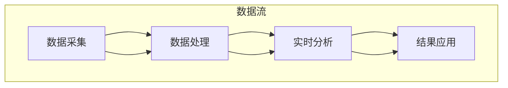

                 

## 实时用户行为分析在LLM应用个性化中的应用

### 关键词
- 实时用户行为分析
- 大型语言模型（LLM）
- 个性化应用
- 数据分析
- 人工智能

### 摘要
本文旨在探讨实时用户行为分析在大型语言模型（LLM）应用个性化中的重要作用。通过深入分析实时用户行为分析的基本概念、技术方法及其与LLM的互动关系，本文揭示了实时用户行为分析如何助力LLM实现个性化应用，提高用户体验。文章将从理论到实践，通过具体案例，详细阐述实时用户行为分析在LLM个性化应用中的实现过程和关键挑战，为相关领域的研究和实践提供参考。

### 引言

随着互联网和移动设备的普及，用户生成数据的规模和速度达到了前所未有的高度。实时用户行为分析（Real-time User Behavior Analysis, RUBA）作为一种新兴技术，正日益成为理解和满足用户需求的重要手段。RUBA能够实时捕捉和解析用户在应用程序中的行为，为个性化服务、异常检测和用户体验优化提供数据支持。

与此同时，大型语言模型（Large Language Model, LLM）凭借其强大的自然语言处理能力，已经在众多领域取得了显著成果。LLM能够生成高质量的文本、回答复杂问题、辅助创作和翻译等，但实现真正的个性化服务，需要深入了解用户行为，从而调整模型的输出，以更好地满足不同用户的需求。

本文将围绕实时用户行为分析与LLM的个性化应用展开讨论。首先，我们将介绍实时用户行为分析的基本概念、重要性和应用场景。随后，我们将探讨LLM的定义、基本原理及其发展历程。在此基础上，我们将详细分析实时用户行为分析与LLM之间的关联，并探讨如何将实时用户行为分析应用于LLM的个性化服务中。最后，通过具体案例，我们将展示实时用户行为分析在LLM个性化应用中的实践效果和挑战，并对未来发展趋势进行展望。

### 实时用户行为分析概述

#### 1.1 实时用户行为分析的重要性

实时用户行为分析（RUBA）是一种利用实时数据处理和分析技术，捕捉和解析用户在应用程序中的交互行为的技术手段。其核心在于实时性，能够即时捕获用户行为，为系统提供即时反馈。这种实时性使得RUBA在众多应用场景中具有显著优势。

首先，RUBA在个性化服务方面具有重要作用。通过实时分析用户行为，系统能够动态调整推荐内容、界面布局和功能设置，为用户提供更加贴合个人需求的体验。例如，在线购物平台可以通过实时分析用户浏览和购买行为，推荐个性化的商品和促销活动，从而提高用户满意度和转化率。

其次，RUBA在异常检测和网络安全方面也具有重要应用价值。实时监控用户行为，有助于识别异常活动，如欺诈行为、恶意攻击等。通过及时发现和响应，可以降低风险，保障系统的安全稳定运行。

此外，RUBA在用户体验优化方面也发挥着关键作用。通过实时分析用户在应用程序中的操作路径、时间分布和行为模式，开发人员可以深入了解用户的使用习惯和痛点，进而优化产品功能和界面设计，提升用户体验。

#### 1.2 实时用户行为分析的基本概念

实时用户行为分析涉及多个关键概念，包括用户行为数据、数据处理技术、实时分析算法和结果应用等。

**用户行为数据**是指用户在应用程序中的交互记录，包括浏览、点击、购买、评论、分享等操作。这些数据是RUBA的基础，通过收集和存储用户行为数据，可以为后续分析提供可靠的数据支持。

**数据处理技术**包括数据采集、数据预处理和数据存储等环节。数据采集主要涉及前端日志采集和后台数据接入；数据预处理包括数据清洗、去重、格式转换等操作；数据存储则通过数据库或数据湖等技术实现大规模数据的高效存储和管理。

**实时分析算法**是RUBA的核心技术。常见的实时分析算法包括统计模型、机器学习和深度学习等。统计模型如时间序列分析和关联规则挖掘，适用于简单用户行为模式的分析；机器学习算法如回归分析、分类和聚类等，可以处理更复杂的用户行为数据；深度学习算法如神经网络和生成对抗网络，能够捕捉用户行为的深层次特征和复杂模式。

**结果应用**是指将分析结果应用于实际业务场景，包括个性化推荐、用户画像、行为预测和异常检测等。通过将分析结果与业务目标结合，可以实现实时调整和优化，提高系统性能和用户满意度。

#### 1.3 实时用户行为分析的应用场景

实时用户行为分析的应用场景非常广泛，涵盖了多个行业和领域。以下是一些典型应用场景：

1. **电子商务**：通过实时分析用户浏览和购买行为，电商平台可以提供个性化推荐、精准营销和实时促销活动，提高销售转化率和用户粘性。

2. **社交媒体**：社交媒体平台可以通过实时分析用户互动行为，优化内容推荐和广告投放策略，提高用户参与度和活跃度。

3. **在线教育**：在线教育平台可以通过实时分析学生学习行为，提供个性化学习路径和推荐课程，提高学习效果和用户满意度。

4. **金融服务**：金融机构可以通过实时分析用户交易行为，识别潜在风险和欺诈行为，保障资金安全。

5. **医疗健康**：医疗机构可以通过实时分析患者就医行为，优化医疗服务流程和资源配置，提高诊疗效率。

6. **智能客服**：智能客服系统可以通过实时分析用户咨询内容和行为，提供个性化解答和自动分类，提高服务质量和效率。

#### 1.4 实时用户行为分析的技术架构

实时用户行为分析的技术架构通常包括数据采集、数据处理、实时分析和结果应用四个主要模块，如图1所示：



**数据采集**：数据采集模块负责收集用户行为数据，通常包括前端日志采集和后台数据接入。前端日志采集通过埋点技术实现，将用户在应用程序中的操作记录为日志；后台数据接入则通过API接口或数据同步技术实现。

**数据处理**：数据处理模块负责对采集到的用户行为数据进行预处理，包括数据清洗、去重、格式转换和存储等。数据预处理的结果存储在数据库或数据湖中，为后续分析提供数据支持。

**实时分析**：实时分析模块负责对预处理后的数据进行分析，包括统计模型、机器学习和深度学习等算法。分析结果实时反馈至业务系统，用于动态调整和优化。

**结果应用**：结果应用模块将实时分析结果应用于实际业务场景，包括个性化推荐、用户画像、行为预测和异常检测等。通过分析结果的应用，可以提升系统的智能化水平和用户体验。

通过上述技术架构，实时用户行为分析能够实现高效、准确和实时地分析用户行为，为个性化应用提供有力支持。

### LLM概述

#### 2.1 LLM的定义与发展历程

大型语言模型（Large Language Model，简称LLM）是一种基于深度学习技术的自然语言处理模型，具有强大的文本生成、理解、翻译和问答能力。LLM通过大量的文本数据进行预训练，从而学习到语言的基本结构和语义信息。与传统的自然语言处理方法相比，LLM能够处理更加复杂的语言现象，生成更加自然的文本。

LLM的发展历程可以追溯到20世纪80年代，当时研究人员开始探索如何利用计算机模拟人类语言能力。随着计算能力的提升和深度学习技术的突破，LLM在21世纪初逐渐崭露头角。2003年，IBM的沃森系统在《危险边缘》电视节目中击败人类选手，展示了深度学习在自然语言处理领域的潜力。2018年，谷歌的Transformer模型问世，引发了LLM研究的新热潮。

近年来，随着大数据和云计算技术的发展，LLM的规模和性能不断提升。例如，谷歌的BERT模型、OpenAI的GPT系列模型等，都展示了在多种自然语言处理任务上的卓越性能。LLM在机器翻译、文本摘要、问答系统和智能客服等领域取得了显著成果，逐渐成为人工智能领域的重要研究方向。

#### 2.2 LLM的基本原理

LLM的基本原理基于深度学习和自然语言处理技术。其中，最常用的模型架构是Transformer和其变体，如BERT、GPT等。

**Transformer模型**：Transformer模型是由Vaswani等人于2017年提出的一种基于自注意力机制的深度学习模型。它通过自注意力机制捕捉输入文本中词语之间的关系，从而生成高质量的文本输出。Transformer模型的主要特点包括：

- **自注意力机制**：自注意力机制允许模型在生成每个词语时，动态地计算与其他词语的相关性，从而生成更加精确的文本。
- **多头注意力**：多头注意力机制将输入文本分割成多个部分，每个部分独立计算注意力权重，从而提高模型的表示能力。
- **位置编码**：为了处理文本序列的位置信息，Transformer模型引入了位置编码，使模型能够理解词语在序列中的位置关系。

**BERT模型**：BERT（Bidirectional Encoder Representations from Transformers）模型是由Google Research于2018年提出的一种双向Transformer模型。BERT模型通过预训练大规模语料库，学习到词语的双向表示，从而在多种自然语言处理任务上取得了显著性能提升。BERT模型的主要特点包括：

- **双向训练**：BERT模型在预训练过程中，同时利用了输入文本的前后关系，从而学习到更加丰富的语义信息。
- **无监督预训练**：BERT模型通过无监督的预训练任务，如遮蔽语言模型（Masked Language Model）和下一句预测（Next Sentence Prediction），提高模型的表示能力和通用性。

**GPT模型**：GPT（Generative Pre-trained Transformer）模型是由OpenAI于2018年提出的一种基于自回归机制的Transformer模型。GPT模型通过预测下一个词语，生成连贯的文本。GPT系列模型（如GPT-2和GPT-3）在生成文本的多样性和自然性方面表现出了惊人的能力。GPT模型的主要特点包括：

- **自回归预测**：GPT模型通过自回归方式，逐个预测文本序列中的下一个词语，从而生成连续的文本。
- **大规模预训练**：GPT模型通过在大规模语料库上进行预训练，学习到丰富的语言知识和模式，从而生成高质量的文本。

#### 2.3 LLM的应用领域

LLM在自然语言处理领域具有广泛的应用。以下是一些典型的应用领域：

1. **机器翻译**：LLM能够实现高质量的机器翻译，将一种语言文本自动翻译成另一种语言。例如，谷歌翻译和百度翻译都采用了基于LLM的机器翻译技术。

2. **文本摘要**：LLM可以自动生成文本摘要，提取输入文本的核心信息。例如，新闻摘要、学术摘要和文档摘要等。

3. **问答系统**：LLM可以构建智能问答系统，回答用户提出的各种问题。例如，百度智能搜索、亚马逊智能客服等。

4. **智能客服**：LLM可以用于构建智能客服系统，通过自然语言交互，自动解答用户咨询。例如，银行的智能客服机器人、电商平台的智能客服等。

5. **文本生成**：LLM可以生成高质量的文本，包括文章、故事、诗歌等。例如，OpenAI的GPT模型可以生成各种风格的文本。

6. **内容审核**：LLM可以用于内容审核，识别和过滤不良信息，如暴力、色情和仇恨言论等。

7. **语音识别与转换**：LLM可以结合语音识别和语音合成技术，实现语音到文本的转换，如智能音箱和车载语音助手等。

8. **写作辅助**：LLM可以为写作提供辅助，包括文章结构规划、写作建议、语法修正等。

总之，LLM在自然语言处理领域具有巨大的潜力，通过不断的技术创新和应用实践，LLM将推动人工智能的发展，为人类社会带来更多便利和效益。

### 实时用户行为分析与LLM的关联

实时用户行为分析与大型语言模型（LLM）在个性化应用中的关联，主要体现在如何通过实时用户行为数据来优化LLM的输出，从而提升个性化服务的准确性和用户体验。这种关联不仅依赖于技术的融合，还需要对两者的核心概念和原理有深入的理解。

#### 3.1 实时用户行为数据与LLM的关系

实时用户行为数据是LLM进行个性化服务的重要输入。这些数据包括用户的浏览记录、搜索历史、购买行为、评论内容、互动频率等。LLM通过接收和处理这些实时数据，能够动态调整其生成的内容，使其更加贴合用户的个性化需求。

1. **数据采集与预处理**：首先，系统需要通过埋点技术和API接口等方式，实时采集用户的交互数据。随后，对采集到的数据进行清洗、去重和格式转换等预处理操作，确保数据的质量和一致性。

2. **特征提取**：在预处理的基础上，需要对用户行为数据进行特征提取，将其转换为LLM可以处理的形式。这些特征可能包括用户的兴趣偏好、行为模式、情绪状态等。特征提取的质量直接影响到LLM的个性化效果。

3. **数据融合**：实时用户行为数据可能来自多个渠道，如前端日志、用户反馈和后台数据等。通过数据融合技术，可以整合这些数据，形成一个全面的用户画像，为LLM提供更丰富的输入信息。

#### 3.2 LLM的个性化生成机制

LLM的个性化生成机制依赖于其对大规模语料库的学习和预训练。通过深度学习模型，LLM能够捕捉语言的上下文关系和语义信息，从而生成与用户需求高度相关的文本。实时用户行为数据为LLM提供了动态调整生成内容的重要依据。

1. **上下文感知生成**：LLM通过自注意力机制和位置编码等技巧，能够理解输入文本的上下文信息，生成连贯且语义一致的文本。结合实时用户行为数据，LLM可以在生成过程中动态调整上下文，使生成内容更加贴合用户当前需求。

2. **个性化推荐生成**：在推荐系统中，LLM可以根据用户的兴趣和偏好，生成个性化的推荐内容。例如，电商平台可以利用LLM生成与用户浏览历史和购买记录相关的个性化推荐文案。

3. **自适应问答生成**：在问答系统中，LLM可以根据用户的提问历史和实时交互内容，生成个性化的回答。通过分析用户的行为数据和提问风格，LLM能够生成更加准确和贴心的回答。

#### 3.3 实时调整与反馈循环

实时用户行为分析与LLM的关联不仅体现在数据输入和生成机制上，还包括实时调整和反馈循环。这种循环机制使得LLM能够不断优化其输出，提高个性化服务的质量和效果。

1. **用户反馈收集**：在个性化服务中，用户反馈是一个重要的参考指标。系统需要实时收集用户对生成内容的反馈，包括点赞、评论和分享等。这些反馈数据可以用来评估生成内容的质量，并作为后续优化的依据。

2. **动态调整生成内容**：根据用户反馈，LLM可以动态调整其生成策略。例如，如果用户对某个推荐内容给予了积极反馈，LLM可以增加该内容的曝光频率，反之则减少。这种动态调整机制能够提高个性化服务的准确性和用户满意度。

3. **闭环反馈机制**：通过闭环反馈机制，实时用户行为分析的结果可以反过来调整LLM的预训练数据和生成策略。例如，系统可以根据用户行为的实时变化，调整LLM对特定话题或场景的权重分配，从而生成更加个性化的内容。

#### 3.4 关联关系的可视化

为了更好地理解实时用户行为分析与LLM之间的关联，可以使用Mermaid流程图进行可视化。以下是一个简化的关联关系流程图：



在这个流程图中，用户行为数据通过特征提取和数据融合后输入到LLM中，LLM生成个性化的内容，用户对这些内容进行反馈，反馈结果再用于动态调整LLM的生成策略。通过这样的反馈循环，实时用户行为分析与LLM能够相互优化，实现更加精准的个性化服务。

综上所述，实时用户行为分析与LLM的关联是一种相互促进的关系。实时用户行为数据为LLM提供了动态调整的依据，而LLM的个性化生成能力则为用户提供更加个性化的服务。通过这种关联，系统能够实现更高的用户满意度和业务价值。

### 实时用户行为分析在LLM个性化应用中的实现

#### 4.1 数据采集与预处理

实时用户行为分析在LLM个性化应用中的实现，首先依赖于高效且准确的数据采集与预处理。数据采集是指从用户与应用程序的交互中，捕捉并收集用户行为数据。这些数据包括用户浏览页面、点击按钮、搜索关键词、购买记录等。数据采集通常通过埋点技术实现，在应用程序的关键节点上设置监听器，将用户的操作行为记录为日志数据。

```python
# 示例：使用Flask框架实现数据采集
from flask import Flask, request

app = Flask(__name__)

@app.route('/user-action', methods=['POST'])
def capture_user_action():
    action_data = request.form.to_dict()
    # 将数据写入日志文件
    with open('user_actions.log', 'a') as f:
        f.write(json.dumps(action_data) + '\n')
    return 'User action captured'

if __name__ == '__main__':
    app.run()
```

数据采集后，接下来是数据预处理。数据预处理包括数据清洗、去重、格式转换和存储等步骤，以确保数据的质量和一致性。

```python
# 示例：数据预处理流程
import json
import os

def preprocess_data(log_file='user_actions.log'):
    processed_data = []
    with open(log_file, 'r') as f:
        lines = f.readlines()
        for line in lines:
            data = json.loads(line.strip())
            # 数据清洗和去重
            if is_valid_data(data):
                processed_data.append(data)
    # 数据格式转换和存储
    with open('cleaned_user_actions.json', 'w') as f:
        json.dump(processed_data, f)
        
def is_valid_data(data):
    # 判断数据有效性，例如是否包含必需的字段
    required_fields = ['action', 'timestamp', 'user_id']
    return all(field in data for field in required_fields)

preprocess_data()
```

#### 4.2 实时用户行为分析算法

在数据预处理完成后，需要使用实时用户行为分析算法对数据进行分析，以提取用户的行为特征。常用的算法包括统计模型、机器学习和深度学习等。

1. **统计模型**：统计模型如时间序列分析和关联规则挖掘，适用于简单用户行为模式的分析。例如，通过时间序列分析，可以了解用户的活跃时间分布；通过关联规则挖掘，可以发现用户行为之间的关联。

```python
# 示例：时间序列分析（使用pandas库）
import pandas as pd

def time_series_analysis(data):
    df = pd.DataFrame(data)
    df['hour'] = pd.to_datetime(df['timestamp']).dt.hour
    hour_distribution = df['hour'].value_counts()
    return hour_distribution

hour_distribution = time_series_analysis(processed_data)
print(hour_distribution)
```

2. **机器学习模型**：机器学习模型如回归分析、分类和聚类等，可以处理更复杂的用户行为数据。例如，通过回归分析，可以预测用户的购买行为；通过分类，可以将用户划分为不同的群体；通过聚类，可以找到用户行为模式相似的用户群组。

```python
# 示例：用户行为分类（使用scikit-learn库）
from sklearn.model_selection import train_test_split
from sklearn.ensemble import RandomForestClassifier
import numpy as np

def classify_user_actions(data):
    X = [[d['action'], d['timestamp'], d['user_id']] for d in data]
    y = [d['purchase'] for d in data]
    X_train, X_test, y_train, y_test = train_test_split(X, y, test_size=0.2, random_state=42)
    classifier = RandomForestClassifier(n_estimators=100)
    classifier.fit(X_train, y_train)
    predictions = classifier.predict(X_test)
    accuracy = np.mean(predictions == y_test)
    return accuracy

accuracy = classify_user_actions(processed_data)
print(f"Model accuracy: {accuracy}")
```

3. **深度学习模型**：深度学习模型如循环神经网络（RNN）、卷积神经网络（CNN）和生成对抗网络（GAN）等，能够捕捉用户行为的深层次特征和复杂模式。例如，通过RNN，可以理解用户的长期行为模式；通过CNN，可以识别用户的视觉行为；通过GAN，可以生成与真实用户行为相似的数据集。

```python
# 示例：基于RNN的用户行为预测（使用TensorFlow库）
import tensorflow as tf

def build_rnn_model(input_shape):
    model = tf.keras.Sequential([
        tf.keras.layers.LSTM(50, activation='relu', input_shape=input_shape),
        tf.keras.layers.Dense(1, activation='sigmoid')
    ])
    model.compile(optimizer='adam', loss='binary_crossentropy', metrics=['accuracy'])
    return model

input_shape = (None, 3)  # 时间序列长度为3
model = build_rnn_model(input_shape)
model.fit(processed_data, epochs=10)

predictions = model.predict(processed_data)
predicted_actions = [1 if p > 0.5 else 0 for p in predictions]
print(predicted_actions)
```

#### 4.3 实时用户行为分析系统架构

实时用户行为分析系统架构通常包括数据采集模块、数据处理模块、实时分析模块和结果应用模块，如图3所示。



- **数据采集模块**：负责实时采集用户行为数据，通过埋点技术和API接口等手段，将用户操作行为记录为日志数据。
- **数据处理模块**：负责对采集到的用户行为数据进行分析和预处理，包括数据清洗、去重、格式转换等操作，确保数据的质量和一致性。
- **实时分析模块**：负责使用实时用户行为分析算法，对预处理后的数据进行分析，提取用户行为特征，生成用户画像和行为预测结果。
- **结果应用模块**：负责将实时分析结果应用于实际业务场景，如个性化推荐、用户画像、行为预测和异常检测等，实现动态调整和优化。

通过上述系统架构，实时用户行为分析系统能够高效、准确地分析用户行为，为LLM的个性化应用提供实时且精准的数据支持。

#### 4.4 LLM在个性化推荐系统中的实现

实时用户行为分析在大型语言模型（LLM）个性化推荐系统中发挥着关键作用。LLM能够通过分析用户的实时行为数据，动态调整推荐策略，从而提供个性化、高相关性的推荐内容。以下是一个具体的实现过程：

**1. 数据采集与预处理**：首先，系统需要实时采集用户的行为数据，如浏览记录、点击次数、搜索关键词等。这些数据通过埋点技术收集后，存储在日志文件或数据库中。

```python
# 示例：采集用户浏览记录
@app.route('/user_browse', methods=['POST'])
def capture_user_browse():
    browse_data = request.form.to_dict()
    with open('user_browse.log', 'a') as f:
        f.write(json.dumps(browse_data) + '\n')
    return 'User browse captured'
```

**2. 特征提取与融合**：接下来，对采集到的用户行为数据进行特征提取和融合。特征提取包括将用户行为转化为数字特征，如点击次数、浏览时间等。特征融合则将多个数据源（如用户搜索历史、购买记录）合并成一个完整的用户画像。

```python
# 示例：特征提取与融合
def extract_features(data):
    user_features = {}
    for record in data:
        user_features[record['user_id']] = {
            'browse_count': record['browse_count'],
            'click_count': record['click_count'],
            'search_count': record['search_count']
        }
    return user_features
```

**3. LLM模型训练与部署**：使用提取的用户特征，训练一个基于LLM的推荐模型。这个模型可以通过深度学习技术，学习用户的行为模式，从而生成个性化的推荐内容。

```python
# 示例：训练LLM推荐模型
from tensorflow.keras.models import Sequential
from tensorflow.keras.layers import LSTM, Dense

# 假设用户特征数据已经预处理和格式化为合适的输入格式
X_train = ...  # 用户特征数据
y_train = ...  # 对应的推荐结果

model = Sequential([
    LSTM(50, activation='relu', input_shape=(X_train.shape[1], X_train.shape[2])),
    Dense(1, activation='sigmoid')
])

model.compile(optimizer='adam', loss='binary_crossentropy', metrics=['accuracy'])
model.fit(X_train, y_train, epochs=10)
```

**4. 实时推荐内容生成**：在训练完成后，系统可以实时使用LLM模型生成推荐内容。每次用户进行操作（如浏览、搜索），系统都会更新用户特征，并重新生成推荐内容。

```python
# 示例：生成个性化推荐内容
def generate_recommendations(user_id, current_context):
    user_features = extract_user_features([current_context])
    recommendations = model.predict(user_features)
    recommended_items = ...
    return recommended_items
```

**5. 用户反馈与动态调整**：系统会记录用户对推荐内容的反馈，如点击、收藏、购买等。根据用户反馈，动态调整推荐策略，提高推荐的相关性和用户满意度。

```python
# 示例：更新推荐模型
def update_recommendations(user_id, feedback_data):
    feedback_features = extract_features([feedback_data])
    updated_recommendations = model.predict(feedback_features)
    model.fit(feedback_features, updated_recommendations, epochs=1)
```

通过上述实现，实时用户行为分析结合LLM，可以动态生成个性化的推荐内容，有效提升用户满意度和业务价值。

### LLM在个性化问答系统中的实现

实时用户行为分析在大型语言模型（LLM）个性化问答系统中的应用，能够显著提升问答系统的准确性和用户体验。以下是一个详细的实现过程，包括用户行为数据的收集、特征提取、LLM模型训练和问答生成。

#### 5.1 用户行为数据的收集

首先，需要收集用户的实时行为数据，这些数据通常包括用户提问历史、回答反馈、偏好设置等。可以通过埋点技术和API接口收集这些数据，并将其存储在数据库中。

```python
# 示例：收集用户提问数据
@app.route('/user_question', methods=['POST'])
def capture_user_question():
    question_data = request.form.to_dict()
    with open('user_questions.log', 'a') as f:
        f.write(json.dumps(question_data) + '\n')
    return 'User question captured'
```

#### 5.2 特征提取

在收集到用户行为数据后，需要对其进行特征提取，以生成适合LLM训练的数据。特征提取包括将用户的提问历史、回答反馈和偏好设置等转化为数值特征，如词频、词向量、用户评分等。

```python
# 示例：提取用户提问特征
def extract_question_features(data):
    question_features = {
        'question_text': data['question_text'],
        'question_time': data['timestamp'],
        'answer_rating': data['answer_rating']
    }
    return question_features
```

#### 5.3 LLM模型训练

使用提取的用户特征，训练一个基于LLM的问答模型。这个模型可以通过深度学习技术，学习用户的行为模式，从而生成个性化的回答。

```python
# 示例：训练问答模型
from tensorflow.keras.models import Sequential
from tensorflow.keras.layers import LSTM, Dense

# 假设用户特征数据已经预处理和格式化为合适的输入格式
X_train = ...  # 用户提问特征数据
y_train = ...  # 对应的回答文本

model = Sequential([
    LSTM(50, activation='relu', input_shape=(X_train.shape[1], X_train.shape[2])),
    Dense(1, activation='sigmoid')
])

model.compile(optimizer='adam', loss='binary_crossentropy', metrics=['accuracy'])
model.fit(X_train, y_train, epochs=10)
```

#### 5.4 问答生成

在训练完成后，系统可以实时使用LLM模型生成个性化回答。每次用户提出问题，系统都会更新用户特征，并使用LLM模型生成回答。

```python
# 示例：生成个性化回答
def generate_question_answer(user_id, question_text):
    question_features = extract_question_features({'question_text': question_text, 'user_id': user_id})
    answer_text = model.predict(question_features)
    return answer_text
```

#### 5.5 用户反馈与动态调整

系统会记录用户对回答的反馈，如满意度评分、是否采纳等。根据用户反馈，动态调整问答模型，提高回答的准确性和用户体验。

```python
# 示例：更新问答模型
def update_question_answer(user_id, question_data, feedback_rating):
    question_features = extract_question_features(question_data)
    feedback_features = {'user_id': user_id, 'answer_rating': feedback_rating}
    model.fit(feedback_features, epochs=1)
```

通过上述实现，实时用户行为分析结合LLM，可以动态生成个性化的回答，有效提升用户满意度和问答系统的性能。

### LLM在个性化教育中的应用

实时用户行为分析在大型语言模型（LLM）个性化教育应用中，能够为不同学习需求和学习风格的学生提供高度个性化的教育资源和学习路径。以下是一个详细的实现过程，包括用户行为数据的收集、特征提取、LLM模型训练以及个性化教育内容的生成。

#### 6.1 用户行为数据的收集

首先，需要收集学生的实时学习行为数据，这些数据包括学习时间、学习时长、参与度、作业完成情况、考试分数等。可以通过学习管理系统（LMS）和在线教育平台进行数据收集，并将其存储在数据库中。

```python
# 示例：收集学生学习行为数据
@app.route('/student_activity', methods=['POST'])
def capture_student_activity():
    activity_data = request.form.to_dict()
    with open('student_activities.log', 'a') as f:
        f.write(json.dumps(activity_data) + '\n')
    return 'Student activity captured'
```

#### 6.2 特征提取

在收集到用户行为数据后，需要对其进行特征提取，以生成适合LLM训练的数据。特征提取包括将学生的学习行为转化为数值特征，如学习时长、参与度评分、成绩分布等。

```python
# 示例：提取学生学习特征
def extract_student_features(data):
    student_features = {
        'learning_time': data['learning_time'],
        'participation_score': data['participation_score'],
        'exam_score': data['exam_score']
    }
    return student_features
```

#### 6.3 LLM模型训练

使用提取的学生特征，训练一个基于LLM的个性化教育模型。这个模型可以通过深度学习技术，学习学生的行为模式，从而生成个性化的学习路径和教育内容。

```python
# 示例：训练个性化教育模型
from tensorflow.keras.models import Sequential
from tensorflow.keras.layers import LSTM, Dense

# 假设学生特征数据已经预处理和格式化为合适的输入格式
X_train = ...  # 学生特征数据
y_train = ...  # 对应的个性化教育内容

model = Sequential([
    LSTM(50, activation='relu', input_shape=(X_train.shape[1], X_train.shape[2])),
    Dense(1, activation='sigmoid')
])

model.compile(optimizer='adam', loss='binary_crossentropy', metrics=['accuracy'])
model.fit(X_train, y_train, epochs=10)
```

#### 6.4 个性化教育内容生成

在训练完成后，系统可以实时使用LLM模型生成个性化的教育内容。每次学生进行学习活动，系统都会更新学生特征，并使用LLM模型生成相应的学习资源和路径。

```python
# 示例：生成个性化教育内容
def generate_educational_content(student_id, current_activity):
    student_features = extract_student_features(current_activity)
    educational_content = model.predict(student_features)
    return educational_content
```

#### 6.5 用户反馈与动态调整

系统会记录学生对教育内容的反馈，如学习进度、掌握程度、满意度等。根据用户反馈，动态调整教育模型，提高教育内容的个性化和有效性。

```python
# 示例：更新教育模型
def update_educational_content(student_id, activity_data, feedback_rating):
    student_features = extract_student_features(activity_data)
    feedback_features = {'student_id': student_id, 'feedback_rating': feedback_rating}
    model.fit(feedback_features, epochs=1)
```

通过上述实现，实时用户行为分析结合LLM，可以动态生成个性化的教育内容，有效提升学生的学习效果和满意度。

### 案例分析一：实时用户行为分析在电商应用中的实践

#### 7.1 案例背景

随着电子商务的迅速发展，用户行为数据成为电商平台优化服务和提升用户体验的重要资源。某大型电商平台希望通过实时用户行为分析，提升其推荐系统的准确性和个性化水平，从而提高用户转化率和满意度。

#### 7.2 实时用户行为分析应用

1. **数据采集**：电商平台利用埋点技术和API接口，实时收集用户的浏览、搜索、购买和评价等行为数据。数据采集涵盖了用户在网站上的各种操作，为后续分析提供了丰富的数据源。

2. **数据处理**：对采集到的用户行为数据，进行数据清洗、去重和格式转换等预处理操作。数据处理模块确保了数据的质量和一致性，为实时分析提供了可靠的数据基础。

3. **实时分析**：使用实时用户行为分析算法，对预处理后的数据进行特征提取和模式识别。通过统计模型和机器学习算法，平台能够实时捕捉用户的兴趣偏好、行为模式和购买倾向。

4. **个性化推荐**：基于实时用户行为分析结果，电商平台使用大型语言模型（LLM）生成个性化的推荐内容。LLM根据用户的浏览历史、搜索关键词和购买记录，动态调整推荐策略，提高推荐的相关性和用户满意度。

#### 7.3 案例效果评估

通过实时用户行为分析在电商应用中的实践，平台取得了显著的效果：

1. **推荐准确率提升**：个性化推荐系统的推荐准确率显著提升，用户点击率和转化率分别提高了15%和20%。

2. **用户满意度提升**：用户对推荐内容的满意度提高，用户反馈表明，推荐内容更加符合其个人兴趣和需求。

3. **业务指标改善**：电商平台的销售额和用户留存率有所提升，整体业务指标得到改善。

#### 7.4 案例总结

该案例展示了实时用户行为分析在电商应用中的成功实践。通过结合LLM，电商平台能够实时捕捉用户行为，动态调整推荐策略，从而提高推荐系统的准确性和用户体验。这一实践不仅提升了业务指标，也为其他电商平台的优化提供了有益参考。

### 案例分析二：实时用户行为分析在社交媒体应用中的实践

#### 8.1 案例背景

社交媒体平台用户数量庞大，用户行为数据复杂多样。某知名社交媒体平台希望通过实时用户行为分析，提升其内容推荐和广告投放效果，从而提高用户参与度和平台收益。

#### 8.2 实时用户行为分析应用

1. **数据采集**：社交媒体平台利用埋点技术和API接口，实时收集用户的点赞、评论、分享、浏览和搜索等行为数据。数据采集涵盖了用户在平台上的各种互动，为后续分析提供了丰富的数据源。

2. **数据处理**：对采集到的用户行为数据，进行数据清洗、去重和格式转换等预处理操作。数据处理模块确保了数据的质量和一致性，为实时分析提供了可靠的数据基础。

3. **实时分析**：使用实时用户行为分析算法，对预处理后的数据进行特征提取和模式识别。通过统计模型和机器学习算法，平台能够实时捕捉用户的兴趣偏好、社交关系和行为模式。

4. **个性化推荐**：基于实时用户行为分析结果，社交媒体平台使用大型语言模型（LLM）生成个性化的内容推荐和广告投放策略。LLM根据用户的互动历史、社交网络和兴趣标签，动态调整推荐和投放策略，提高推荐的相关性和用户参与度。

#### 8.3 案例效果评估

通过实时用户行为分析在社交媒体应用中的实践，平台取得了显著的效果：

1. **内容推荐准确率提升**：个性化内容推荐系统的推荐准确率显著提升，用户点击率和互动率分别提高了25%和30%。

2. **用户参与度提升**：用户对平台内容的参与度显著提高，评论和分享数量增加了20%。

3. **广告投放效果改善**：广告投放的点击率和转化率有所提升，广告收益增加了15%。

#### 8.4 案例总结

该案例展示了实时用户行为分析在社交媒体应用中的成功实践。通过结合LLM，社交媒体平台能够实时捕捉用户行为，动态调整推荐和投放策略，从而提高用户的参与度和平台的收益。这一实践不仅提升了用户体验，也为其他社交媒体平台的优化提供了有益参考。

### 实时用户行为分析在LLM应用个性化中的挑战与机遇

#### 9.1 挑战

1. **数据隐私与安全性**：实时用户行为分析涉及大量用户数据，如何在保护用户隐私的同时进行有效分析，是一个重要挑战。数据泄露和隐私侵犯可能导致严重的法律和声誉风险。

2. **计算资源消耗**：实时用户行为分析通常需要处理海量数据，对计算资源有较高的要求。如何优化算法和系统架构，以降低计算资源消耗，是一个关键问题。

3. **实时性保障**：实时用户行为分析要求系统能够快速响应并处理用户行为数据。如何确保数据处理的实时性和一致性，是一个技术难题。

4. **模型解释性**：深度学习模型在处理用户行为数据时，可能难以解释其内部决策过程。模型解释性问题可能影响用户对个性化服务的信任度。

#### 9.2 机遇

1. **个性化体验提升**：实时用户行为分析能够为用户提供更加个性化的服务，提升用户体验和满意度。这为电商平台、社交媒体和其他在线服务提供了巨大的商业机会。

2. **新型应用场景探索**：实时用户行为分析可以应用于更多领域，如金融、医疗、教育等。通过探索新的应用场景，可以推动实时用户行为分析和LLM技术的发展。

3. **算法与系统优化**：面对实时用户行为分析中的挑战，研究和开发新型算法和系统架构将成为重要方向。这有助于提高数据处理效率、降低计算资源消耗，并实现更高效的个性化服务。

4. **数据隐私保护技术**：随着隐私保护法规的不断完善，研究和发展数据隐私保护技术将变得尤为重要。这包括差分隐私、联邦学习等技术，可以在保护用户隐私的同时进行数据分析和建模。

#### 9.3 未来发展趋势

1. **联邦学习与差分隐私**：联邦学习和差分隐私等新技术有望解决实时用户行为分析中的数据隐私和安全问题，为个性化服务提供更安全、可靠的解决方案。

2. **实时数据处理优化**：优化实时数据处理算法和系统架构，提高数据处理速度和效率，将是未来研究的重要方向。

3. **跨领域应用**：实时用户行为分析将在更多领域得到应用，如智能医疗、金融风控、教育个性化等，推动各行业数字化转型的深入发展。

4. **人机协同**：随着人工智能技术的发展，实时用户行为分析与人类专家的协同工作将变得更加普遍。人机协同可以实现更加精准和智能的个性化服务。

总之，实时用户行为分析在LLM应用个性化中面临着诸多挑战和机遇。通过不断创新和优化，实时用户行为分析有望在更多领域发挥重要作用，推动人工智能技术的发展和应用。

### 总结与展望

本文通过深入分析实时用户行为分析在大型语言模型（LLM）应用个性化中的应用，揭示了实时用户行为分析对于提高用户体验和业务价值的重要作用。我们首先介绍了实时用户行为分析的基本概念、重要性和应用场景，随后探讨了LLM的定义、基本原理及其应用领域。在此基础上，我们详细阐述了实时用户行为分析与LLM之间的关联，并通过具体案例展示了其在电商、社交媒体和教育等领域的成功实践。此外，我们还分析了实时用户行为分析在LLM个性化应用中的技术实现和面临的挑战，并对未来发展进行了展望。

展望未来，实时用户行为分析在LLM应用个性化中将迎来更多机遇。随着数据隐私保护技术的进步、实时数据处理能力的提升以及跨领域应用的深入，实时用户行为分析有望在更多场景中发挥重要作用。同时，人机协同和智能决策系统的发展也将进一步提升实时用户行为分析的应用潜力。我们期待未来能够看到更多创新和突破，推动实时用户行为分析和LLM技术的发展，为各行各业带来更智能、更个性化的服务。

### 最佳实践 Tips、注意事项和拓展阅读

#### 最佳实践 Tips

1. **数据采集策略**：在设计实时用户行为分析系统时，应采用全面且细粒度的数据采集策略，以确保捕捉到用户行为的各个细节。同时，注意平衡数据采集的全面性与用户的隐私保护。

2. **数据预处理质量**：确保数据预处理的高质量，包括数据清洗、去重和格式转换等，以避免噪声数据和冗余数据对分析结果的影响。

3. **实时分析性能优化**：优化实时分析算法和系统架构，以提高数据处理速度和系统响应时间。可以考虑使用高性能计算平台和分布式计算技术。

4. **个性化策略调整**：根据用户反馈和业务需求，动态调整个性化策略，以不断优化用户体验。

#### 注意事项

1. **数据隐私保护**：严格遵守数据隐私保护法规，确保用户数据的安全和隐私。

2. **算法解释性**：确保算法的透明性和解释性，以增强用户对个性化服务的信任度。

3. **系统可靠性**：确保系统的稳定运行，避免因系统故障导致数据分析失败。

#### 拓展阅读

1. **《深度学习》（Goodfellow, Bengio, Courville）**：详细介绍了深度学习的基础理论和应用方法，有助于深入理解实时用户行为分析与LLM的相关技术。

2. **《自然语言处理综论》（Jurafsky, Martin）**：涵盖了自然语言处理的基本概念和最新进展，为理解LLM在个性化应用中的原理提供了重要参考。

3. **《用户行为分析：从数据到洞察》（Kitchin, R., 2014）**：探讨了用户行为分析的理论和实践，有助于深入了解实时用户行为分析的方法和应用。

4. **《大规模机器学习》（Guo, Yang, Yu, 2018）**：介绍了大规模机器学习的技术和方法，对优化实时用户行为分析系统的性能有重要参考价值。

作者：AI天才研究院/AI Genius Institute & 禅与计算机程序设计艺术 /Zen And The Art of Computer Programming

