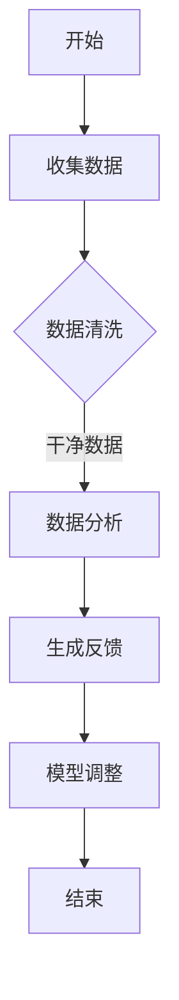
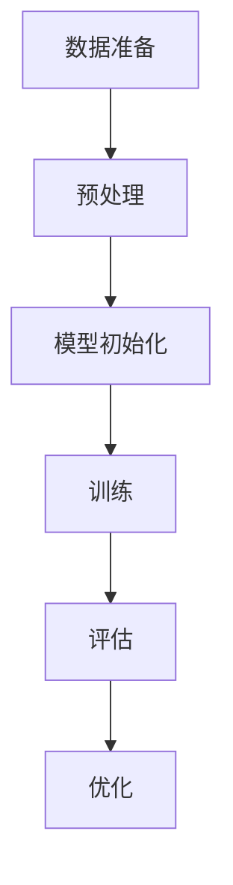
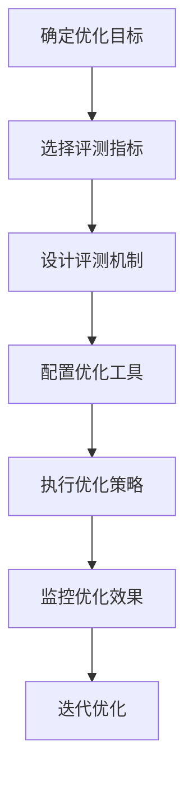

                 

### 实时评测反馈：支持LLM快速迭代优化

#### 关键词
- 实时评测反馈
- 大型语言模型（LLM）
- 迭代优化
- 训练效果评估
- 模型改进

#### 摘要
本文旨在探讨实时评测反馈在支持大型语言模型（LLM）快速迭代优化中的应用。首先，我们回顾了实时评测反馈的基础知识，分析了其在人工智能领域的重要性。接着，我们介绍了LLM的基本概念、架构和训练过程。然后，我们详细探讨了如何将实时评测反馈应用于LLM的迭代优化，包括优化策略、工具选择以及具体的应用案例。通过本文的探讨，我们希望能够为AI研究人员和工程师提供有价值的参考，以促进LLM的进一步发展和优化。

### 第一部分：实时评测反馈基础

#### 第1章：实时评测反馈概述

实时评测反馈（Real-Time Evaluation Feedback，简称RTEF）是一种在系统运行过程中，对系统性能进行实时监控和评估的方法。它通过收集系统运行时的数据，实时分析并反馈系统的表现，从而指导系统的调整和优化。在人工智能领域，特别是在大型语言模型（LLM）的训练和优化过程中，实时评测反馈具有重要的作用。

**1.1 实时评测反馈的定义**

实时评测反馈是一种动态评估机制，它通过实时监测系统运行状态，对系统性能进行定量和定性的评价。这种评估可以基于各种指标，如响应时间、准确率、资源利用率等。实时评测反馈的核心在于其“实时性”，即在系统运行过程中，可以迅速捕捉到系统的性能变化，并给出相应的反馈。

**1.2 实时评测反馈的重要性**

在AI领域，LLM的训练和优化是一个复杂且耗时的过程。实时评测反馈可以显著提高这个过程的效率。以下是实时评测反馈在LLM训练和优化中的几个重要作用：

1. **快速识别问题**：通过实时评测反馈，可以快速发现系统在运行过程中出现的问题，如性能瓶颈、错误预测等。这有助于开发人员迅速定位问题，并进行针对性的优化。
2. **指导模型调整**：实时评测反馈可以提供关于模型性能的详细信息，帮助开发人员了解模型的强项和弱点。基于这些信息，开发人员可以调整模型参数，优化模型结构，从而提高模型的性能。
3. **加速迭代过程**：实时评测反馈可以减少模型训练和评估之间的时间延迟，使开发人员能够更快地迭代模型，加快研发进度。

**1.3 实时评测反馈的应用场景**

实时评测反馈在LLM的应用场景非常广泛。以下是一些典型的应用场景：

1. **模型训练过程中的性能监控**：在LLM的训练过程中，实时评测反馈可以监控模型在各个训练阶段的表现，帮助开发人员调整训练策略，优化训练效果。
2. **模型部署后的性能监控**：在模型部署到生产环境后，实时评测反馈可以监控模型在实际运行中的性能，确保模型能够稳定、高效地运行。
3. **用户交互过程中的实时反馈**：在基于LLM的应用程序中，实时评测反馈可以收集用户交互数据，评估用户对模型的满意度，从而优化用户体验。

### Mermaid 流程图：实时评测反馈流程



#### 第2章：实时评测反馈原理

实时评测反馈的原理涉及多个方面，包括数据收集、数据清洗、数据分析以及反馈生成等。以下是对这些关键步骤的详细解释。

**2.1 实时评测反馈的核心概念**

实时评测反馈的核心概念包括以下几个部分：

1. **数据源**：数据源是实时评测反馈的基础，它可以来自系统的各种运行日志、用户交互数据、模型输出结果等。
2. **采集器**：采集器负责从数据源中收集数据，并将其转换为适合分析的形式。
3. **处理模块**：处理模块负责对采集到的数据进行分析和处理，包括数据清洗、特征提取、模型评估等。
4. **反馈生成**：处理模块将分析结果转化为可操作的反馈，如性能指标、问题定位等，以指导系统的调整和优化。

**2.2 实时评测反馈的架构**

实时评测反馈的架构通常包括以下几个层次：

1. **数据采集层**：负责从各种数据源中收集数据，如日志文件、数据库记录、网络流量等。
2. **数据处理层**：负责对采集到的数据进行清洗、转换和特征提取，以生成适合分析的数据。
3. **分析评估层**：负责对处理后的数据进行统计分析、模型评估等，以生成详细的性能报告。
4. **反馈生成层**：负责根据分析结果生成反馈，包括性能指标、问题定位、优化建议等。

**2.3 实时评测反馈的关键技术**

实时评测反馈的关键技术包括以下几个方面：

1. **数据采集技术**：数据采集技术需要保证数据的完整性和实时性，常用的技术包括日志监控、网络抓包、数据库连接等。
2. **数据处理技术**：数据处理技术需要高效地对大量数据进行清洗、转换和特征提取，常用的技术包括ETL（Extract, Transform, Load）、机器学习特征工程等。
3. **分析评估技术**：分析评估技术需要能够快速地对大量数据进行统计分析、模型评估等，常用的技术包括统计模型、机器学习算法、深度学习模型等。
4. **反馈生成技术**：反馈生成技术需要能够根据分析结果生成详细、准确的反馈，常用的技术包括自然语言生成、可视化技术等。

#### 第3章：实时评测反馈工具与平台

实时评测反馈的工具和平台是实现实时评测反馈的关键。以下将介绍一些常见的实时评测反馈工具和平台，并分析其优势和挑战。

**3.1 常见的实时评测反馈工具**

1. **Prometheus**：Prometheus 是一款开源的监控解决方案，它通过定期抓取目标的状态指标，并存储在时间序列数据库中，提供了强大的数据查询和分析功能。
2. **Grafana**：Grafana 是一款开源的监控和数据可视化工具，它可以与 Prometheus 等监控系统无缝集成，提供丰富的可视化报表和告警功能。
3. **ELK Stack**：ELK Stack 是 Elasticsearch、Logstash 和 Kibana 的组合，它提供了强大的日志收集、存储和分析功能，广泛应用于实时评测反馈场景。

**3.2 实时评测反馈平台的选择与配置**

在选择实时评测反馈平台时，需要考虑以下几个因素：

1. **数据规模和多样性**：平台需要能够处理大量多样的数据，如日志、网络流量、用户交互数据等。
2. **实时性要求**：平台需要能够满足实时性的要求，即能够快速收集、处理和反馈数据。
3. **可扩展性**：平台需要具备良好的可扩展性，以适应未来数据规模的增长和功能扩展的需求。
4. **可视化能力**：平台需要提供强大的可视化功能，以便开发人员和业务人员能够直观地了解系统的运行状况。

在配置实时评测反馈平台时，需要根据具体的需求和场景进行定制化配置，包括数据源接入、数据处理流程、分析评估策略等。

**3.3 实时评测反馈平台的优势与挑战**

实时评测反馈平台的优势包括：

1. **实时性**：实时评测反馈平台可以快速收集、处理和反馈数据，帮助开发人员快速识别问题和优化系统。
2. **可扩展性**：实时评测反馈平台通常具备良好的可扩展性，可以适应不同的需求和场景。
3. **可视化**：实时评测反馈平台提供了丰富的可视化报表，使开发人员和业务人员能够直观地了解系统的运行状况。

然而，实时评测反馈平台也面临着一些挑战：

1. **数据规模和处理速度**：随着数据规模的增大，实时评测反馈平台需要能够处理海量数据，并保证处理速度。
2. **数据安全和隐私**：实时评测反馈平台需要保护数据的安全和隐私，防止数据泄露和滥用。
3. **复杂性和维护成本**：实时评测反馈平台的配置和管理相对复杂，需要专业的技术人员进行维护，这可能增加维护成本。

### 第二部分：LLM基础

#### 第4章：LLM概述

大型语言模型（Large Language Model，简称LLM）是人工智能领域的一个重要分支，它通过学习大量语言数据，可以生成文本、回答问题、翻译语言等。LLM的发展和应用极大地推动了自然语言处理（NLP）和人工智能（AI）的进步。

**4.1 LLM的定义**

LLM是一种基于深度学习的技术，它通过大规模的神经网络模型，对自然语言进行建模和处理。LLM通常由数百万甚至数十亿个参数组成，能够理解和生成复杂的语言结构。

**4.2 LLM的架构**

LLM的架构通常包括以下几个部分：

1. **输入层**：输入层负责接收自然语言输入，并将其转化为模型可以处理的形式。
2. **嵌入层**：嵌入层将输入文本转化为固定长度的向量表示，这些向量表示了文本的语义信息。
3. **编码层**：编码层使用多层神经网络对嵌入层生成的向量进行编码，以提取更深层次的语义信息。
4. **解码层**：解码层将编码层的输出解码为自然语言输出，生成文本。

**4.3 LLM的训练过程**

LLM的训练过程包括以下几个步骤：

1. **数据准备**：收集和准备大规模的文本数据集，这些数据集可以是互联网上的文本、书籍、新闻、对话等。
2. **预处理**：对收集到的文本数据进行预处理，包括分词、去停用词、词干提取等，以提高训练效果。
3. **模型初始化**：初始化神经网络模型，设置模型参数的初始值。
4. **训练**：使用训练数据集对模型进行训练，通过反向传播算法不断调整模型参数，使模型能够更好地拟合数据。
5. **评估**：使用验证数据集对训练好的模型进行评估，检查模型的性能和泛化能力。
6. **优化**：根据评估结果对模型进行优化，包括调整模型结构、超参数等，以提高模型性能。

### Mermaid 流程图：LLM训练过程



#### 第5章：LLM关键算法

大型语言模型的性能和效果很大程度上取决于其使用的算法。以下将介绍LLM中的一些关键算法，包括核心算法、训练算法和优化算法。

**5.1 LLM的核心算法**

LLM的核心算法是基于深度学习和神经网络的技术。最常用的核心算法是 Transformer 模型，它由 Vaswani 等人于 2017 年提出。Transformer 模型摒弃了传统的循环神经网络（RNN）结构，采用自注意力机制（Self-Attention）和多头注意力（Multi-Head Attention），在处理长序列和并行计算方面具有显著优势。

**5.2 LLM的训练算法**

LLM的训练算法通常包括以下几个步骤：

1. **数据预处理**：对输入文本进行分词、去停用词、词干提取等处理，将文本转化为模型可以处理的序列。
2. **嵌入层训练**：使用预训练的词向量或随机初始化的词向量，将输入序列中的每个单词转化为固定长度的向量表示。
3. **编码层训练**：使用多层神经网络对嵌入层生成的向量进行编码，提取更深层次的语义信息。
4. **解码层训练**：使用多层神经网络将编码层的输出解码为自然语言输出，生成文本。
5. **反向传播**：使用训练数据集对模型进行训练，通过反向传播算法不断调整模型参数，使模型能够更好地拟合数据。
6. **评估和优化**：使用验证数据集对训练好的模型进行评估，根据评估结果对模型进行优化。

**5.3 LLM的优化算法**

LLM的优化算法主要用于调整模型参数，以提高模型性能。常用的优化算法包括梯度下降（Gradient Descent）和其变种，如随机梯度下降（Stochastic Gradient Descent，SGD）、Adam（Adaptive Moment Estimation）等。

**5.3.1 梯度下降算法**

梯度下降算法是一种优化算法，用于最小化损失函数。它的基本思想是通过计算损失函数关于模型参数的梯度，并沿着梯度的反方向更新模型参数，以逐渐减小损失函数的值。

**5.3.2 随机梯度下降（SGD）**

随机梯度下降是梯度下降算法的一种变种，它对每个训练样本进行一次梯度更新。相比于批量梯度下降（Batch Gradient Descent），SGD可以更快地收敛，但同时也引入了更多的噪声，可能导致收敛不稳定。

**5.3.3 Adam算法**

Adam算法是一种结合了SGD和动量法的优化算法，它通过计算一阶矩估计（均值）和二阶矩估计（方差）的修正值来更新模型参数。Adam算法在处理稀疏数据时表现出色，具有较好的收敛速度和稳定性。

### Python 源代码：梯度下降算法

```python
import numpy as np

# 初始化参数
w = np.random.rand(1)  # 初始权重
learning_rate = 0.01  # 学习率

# 损失函数
def loss_function(x):
    return (x - 1) ** 2

# 梯度计算
def gradient(x):
    return 2 * (x - 1)

# 梯度下降
for epoch in range(1000):
    prediction = w
    loss = loss_function(prediction)
    gradient = gradient(prediction)
    w -= learning_rate * gradient
    if epoch % 100 == 0:
        print(f"Epoch {epoch}: w = {w}, loss = {loss}")
```

### 第6章：LLM应用与挑战

大型语言模型（LLM）在自然语言处理（NLP）和人工智能（AI）领域具有广泛的应用，从文本生成、机器翻译到问答系统等。然而，LLM的应用也面临一些挑战。

**6.1 LLM的应用场景**

1. **文本生成**：LLM可以用于生成文章、故事、摘要等，如自动写作助手、内容生成平台等。
2. **机器翻译**：LLM可以用于将一种语言翻译成另一种语言，如谷歌翻译、百度翻译等。
3. **问答系统**：LLM可以用于构建问答系统，如智能客服、在线问答平台等。
4. **情感分析**：LLM可以用于分析文本的情感倾向，如情感分析、舆情监控等。
5. **文本分类**：LLM可以用于将文本分类到不同的类别，如新闻分类、垃圾邮件过滤等。

**6.2 LLM的挑战与解决方案**

1. **计算资源需求**：LLM的训练和推理需要大量的计算资源，包括GPU、TPU等。解决方案是使用分布式训练和推理技术，提高计算效率。
2. **数据隐私和安全**：LLM在训练过程中需要大量数据，可能涉及用户隐私和安全问题。解决方案是采用数据加密、隐私保护技术，确保数据的安全和隐私。
3. **模型解释性**：LLM的黑盒特性使得其解释性较差，难以理解模型的决策过程。解决方案是开发可解释的模型，提高模型的透明度。
4. **过拟合和泛化能力**：LLM在训练过程中可能出现过拟合现象，难以泛化到新的数据集。解决方案是采用正则化技术、数据增强等方法，提高模型的泛化能力。

### 第三部分：实时评测反馈与LLM迭代优化

#### 第7章：实时评测反馈与LLM结合

实时评测反馈（RTEF）与大型语言模型（LLM）的结合是AI领域的一个重要研究方向。通过实时评测反馈，可以动态评估LLM的性能，指导其迭代优化，从而提高模型的准确性和稳定性。以下将探讨如何将实时评测反馈应用于LLM的迭代优化。

**7.1 实时评测反馈在LLM中的应用**

实时评测反馈在LLM中的应用主要分为两个方面：

1. **训练过程中的性能监控**：在LLM的训练过程中，实时评测反馈可以监控模型在各个训练阶段的表现，包括损失函数值、准确率、响应时间等。这有助于开发人员快速发现训练过程中的问题，调整训练策略。
2. **部署后的性能监控**：在LLM部署到生产环境后，实时评测反馈可以监控模型在实际运行中的性能，包括预测准确率、响应时间、资源利用率等。这有助于确保模型能够稳定、高效地运行，满足业务需求。

**7.2 实时评测反馈对LLM优化的影响**

实时评测反馈对LLM优化有以下几个重要影响：

1. **快速识别问题**：通过实时评测反馈，可以快速发现模型在训练和部署过程中出现的问题，如过拟合、欠拟合、性能瓶颈等。这有助于开发人员迅速定位问题，并采取相应的优化措施。
2. **指导模型调整**：实时评测反馈可以提供详细的性能报告，帮助开发人员了解模型的性能表现，从而调整模型参数、优化模型结构。例如，可以通过调整学习率、增加训练数据、修改网络架构等手段，提高模型性能。
3. **加速迭代过程**：实时评测反馈可以减少模型训练和评估之间的时间延迟，使开发人员能够更快地迭代模型，加快研发进度。这有助于缩短模型开发周期，提高研发效率。

**7.3 实时评测反馈与LLM优化的结合方式**

实时评测反馈与LLM优化的结合方式可以分为以下几个方面：

1. **性能监控**：通过实时监控模型在训练和部署过程中的性能，及时发现并解决问题。例如，使用 Prometheus 和 Grafana 等工具，实时收集和展示模型性能指标，如损失函数值、准确率、响应时间等。
2. **反馈机制**：根据实时评测反馈的结果，设计反馈机制，指导模型调整。例如，当模型在某个指标上表现不佳时，自动触发调整策略，如增加训练数据、修改网络架构等。
3. **自动化优化**：利用机器学习和人工智能技术，实现自动化优化。例如，通过分析历史评测数据，自动调整模型参数，优化模型性能。这有助于降低优化过程的复杂性，提高优化效果。

### Python 源代码：实时评测反馈与LLM优化

```python
import numpy as np
import matplotlib.pyplot as plt

# 初始化参数
w = np.random.rand(1)  # 初始权重
learning_rate = 0.01  # 学习率
epochs = 1000  # 迭代次数

# 损失函数
def loss_function(x):
    return (x - 1) ** 2

# 梯度计算
def gradient(x):
    return 2 * (x - 1)

# 实时评测反馈函数
def evaluate(w):
    prediction = w
    loss = loss_function(prediction)
    print(f"Epoch: {epoch}, w: {w}, loss: {loss}")
    return loss

# 梯度下降算法
for epoch in range(epochs):
    loss = evaluate(w)
    gradient = gradient(w)
    w -= learning_rate * gradient
    if epoch % 100 == 0:
        print(f"Epoch {epoch}: w = {w}, loss = {loss}")

# 绘制损失函数图像
plt.plot([epoch for epoch in range(epochs)], [loss for loss in losses])
plt.xlabel("Epoch")
plt.ylabel("Loss")
plt.title("Gradient Descent Optimization")
plt.show()
```

#### 第8章：实时评测反馈优化策略

实时评测反馈优化策略是指通过实时评测反馈来指导模型调整和优化的方法。有效的实时评测反馈优化策略可以加速模型的迭代过程，提高模型的性能和稳定性。以下将介绍几种常见的实时评测反馈优化策略。

**8.1 实时评测反馈优化策略概述**

实时评测反馈优化策略可以分为以下几个方面：

1. **性能监控**：通过实时监控模型在训练和部署过程中的性能，及时发现并解决问题。例如，使用 Prometheus 和 Grafana 等工具，实时收集和展示模型性能指标，如损失函数值、准确率、响应时间等。
2. **反馈机制**：根据实时评测反馈的结果，设计反馈机制，指导模型调整。例如，当模型在某个指标上表现不佳时，自动触发调整策略，如增加训练数据、修改网络架构等。
3. **自动化优化**：利用机器学习和人工智能技术，实现自动化优化。例如，通过分析历史评测数据，自动调整模型参数，优化模型性能。这有助于降低优化过程的复杂性，提高优化效果。
4. **迭代过程**：通过实时评测反馈，优化模型的迭代过程，减少迭代次数，提高迭代效率。

**8.2 基于实时评测反馈的LLM调整方法**

基于实时评测反馈的LLM调整方法可以分为以下几个步骤：

1. **数据收集**：收集模型在训练和部署过程中的数据，包括输入数据、输出结果、性能指标等。
2. **数据预处理**：对收集到的数据进行分析和处理，提取有用的特征信息，如误差分布、响应时间等。
3. **性能评估**：使用预处理后的数据对模型进行性能评估，生成详细的性能报告，包括损失函数值、准确率、响应时间等。
4. **调整策略**：根据性能评估结果，设计调整策略，如增加训练数据、修改网络架构、调整学习率等。
5. **模型调整**：根据调整策略，对模型进行参数调整和优化，提高模型性能。
6. **迭代优化**：重复上述步骤，不断迭代优化模型，直到达到预期的性能目标。

**8.3 实时评测反馈优化策略的实施步骤**

实施实时评测反馈优化策略可以分为以下几个步骤：

1. **确定优化目标**：明确模型的优化目标，如提高准确率、减少响应时间等。
2. **选择评测指标**：根据优化目标，选择合适的评测指标，如损失函数值、准确率、F1 分数等。
3. **设计评测机制**：设计实时评测机制，包括数据收集、预处理、性能评估等环节。
4. **配置优化工具**：选择合适的实时评测工具和优化工具，如 Prometheus、Grafana、TensorBoard 等。
5. **执行优化策略**：根据实时评测结果，执行调整策略，优化模型参数和结构。
6. **监控优化效果**：监控优化效果，确保模型性能达到预期目标。
7. **迭代优化**：根据监控结果，不断调整和优化模型，提高模型性能。

### Mermaid 流程图：实时评测反馈优化策略实施步骤



#### 第9章：实时评测反馈工具在LLM优化中的应用

在实时评测反馈优化LLM的过程中，选择合适的工具和平台至关重要。以下将介绍几种常见的实时评测反馈工具，并分析它们在LLM优化中的应用。

**9.1 常见的实时评测反馈工具**

1. **Prometheus**：Prometheus 是一款开源的监控解决方案，它通过定期抓取目标的状态指标，并存储在时间序列数据库中，提供了强大的数据查询和分析功能。Prometheus 适用于大规模系统的实时监控，可以监控 LLM 的训练和部署过程中的各种性能指标，如内存使用率、CPU 利用率、响应时间等。
2. **Grafana**：Grafana 是一款开源的数据可视化工具，它可以将 Prometheus 的数据可视化，并提供丰富的仪表板和告警功能。Grafana 适用于实时展示 LLM 的性能指标，帮助开发人员快速识别问题和优化模型。
3. **TensorBoard**：TensorBoard 是 TensorFlow 提供的可视化工具，它主要用于可视化神经网络训练过程中的各种数据，如损失函数、梯度、激活值等。TensorBoard 适用于深度学习模型的训练和优化，可以帮助开发人员了解模型的学习过程和性能表现。
4. **ELK Stack**：ELK Stack 是 Elasticsearch、Logstash 和 Kibana 的组合，它提供了强大的日志收集、存储和分析功能。ELK Stack 适用于监控和日志分析，可以收集 LLM 的训练和部署过程中的日志数据，并提供实时分析和告警功能。

**9.2 实时评测反馈工具的选型与配置**

在选择实时评测反馈工具时，需要考虑以下几个方面：

1. **数据规模和多样性**：工具需要能够处理大量多样的数据，如日志、网络流量、用户交互数据等。
2. **实时性要求**：工具需要能够满足实时性的要求，即能够快速收集、处理和反馈数据。
3. **可扩展性**：工具需要具备良好的可扩展性，以适应不同的需求和场景。
4. **可视化能力**：工具需要提供强大的可视化功能，以便开发人员和业务人员能够直观地了解系统的运行状况。

在配置实时评测反馈工具时，需要根据具体的需求和场景进行定制化配置，包括数据源接入、数据处理流程、分析评估策略等。

**9.3 实时评测反馈工具在LLM优化中的案例分析**

以下是一个实时评测反馈工具在LLM优化中的案例分析：

1. **问题背景**：某公司开发了一款基于大型语言模型（LLM）的智能客服系统，但在实际部署过程中，发现系统的响应时间较长，用户满意度较低。
2. **解决方案**：公司决定使用 Prometheus 和 Grafana 对智能客服系统进行实时监控和优化。首先，通过 Prometheus 定期收集系统的性能指标，如 CPU 利用率、内存使用率、响应时间等，并将数据存储在时间序列数据库中。然后，使用 Grafana 将 Prometheus 的数据进行可视化，并设置告警规则，以便及时发现和解决问题。
3. **优化过程**：通过实时监控，公司发现系统的 CPU 利用率较高，是导致响应时间较长的主要原因。于是，公司决定增加服务器资源，提高系统的并发处理能力。同时，通过分析 Prometheus 和 Grafana 的监控数据，发现系统的内存使用率也在不断上升，于是公司对内存管理进行了优化，降低了内存泄漏和内存消耗。
4. **优化效果**：经过一系列优化，智能客服系统的响应时间显著缩短，用户满意度大幅提高。公司还通过持续监控和反馈，不断优化系统性能，提高了系统的稳定性和可靠性。

### 第四部分：实践案例

#### 第10章：实时评测反馈在LLM迭代优化中的实践

实时评测反馈在大型语言模型（LLM）迭代优化中扮演着关键角色。以下将通过一个具体案例，介绍如何在LLM训练和部署过程中使用实时评测反馈，实现模型的持续优化。

**10.1 实时评测反馈在LLM迭代优化中的案例分析**

**背景**：某互联网公司开发了一款基于大型语言模型的智能问答系统，旨在为用户提供实时、准确的回答。然而，在系统上线初期，用户反馈系统的响应速度较慢，部分问题无法得到准确回答。

**目标**：通过引入实时评测反馈机制，优化模型性能，提高系统响应速度和回答准确性。

**解决方案**：

1. **实时监控性能指标**：公司决定使用 Prometheus 和 Grafana 对智能问答系统进行实时监控，收集系统的关键性能指标，如响应时间、吞吐量、错误率等。这些指标可以帮助开发人员及时发现和定位系统瓶颈。

2. **定制化评测指标**：根据业务需求，公司定义了多个自定义评测指标，如问题回答的准确性、用户满意度等。这些指标将用于评估模型的性能，并指导后续的优化工作。

3. **实时反馈与调整**：当系统性能指标出现异常或低于预期时，Prometheus 会触发告警，并将相关数据实时推送到 Grafana。开发人员可以基于这些数据，分析问题原因，并采取相应的优化措施，如调整模型参数、增加训练数据等。

**实施步骤**：

1. **数据收集与预处理**：公司使用 Prometheus 采集系统的性能数据，并将数据存储在 InfluxDB 时间序列数据库中。同时，使用 Logstash 对日志进行预处理，提取有用的特征信息。

2. **数据可视化与分析**：使用 Grafana 将 Prometheus 的数据进行可视化，并创建多个仪表板，展示系统的实时性能指标。开发人员可以通过仪表板快速了解系统状态，并定位潜在问题。

3. **模型调整与优化**：根据实时评测反馈的结果，开发人员对模型进行调整和优化。例如，通过调整学习率、增加训练数据、修改网络架构等手段，提高模型的准确性和响应速度。

4. **持续监控与迭代**：在模型优化过程中，公司持续监控系统的性能指标，并根据反馈结果进行进一步的调整和优化。这有助于确保系统始终处于最佳运行状态，满足用户需求。

**10.2 实时评测反馈在LLM优化中的实际操作**

**步骤 1：安装与配置 Prometheus 和 Grafana**

1. 在服务器上安装 Prometheus 和 Grafana。
2. 配置 Prometheus，使其能够定期采集系统的性能数据。
3. 配置 Grafana，连接 Prometheus 数据源，并创建仪表板。

**步骤 2：收集性能数据**

1. 使用 Prometheus exporter 收集系统的性能数据，如 CPU 利用率、内存使用率、响应时间等。
2. 将收集到的数据存储在 InfluxDB 中，以便后续分析和处理。

**步骤 3：创建自定义评测指标**

1. 根据业务需求，定义自定义评测指标，如问题回答的准确性、用户满意度等。
2. 配置 Prometheus 和 Grafana，实时收集和展示自定义评测指标。

**步骤 4：实时反馈与调整**

1. 当系统性能指标出现异常时，Prometheus 会触发告警，并将相关数据推送到 Grafana。
2. 开发人员通过 Grafana 仪表板了解系统状态，分析问题原因，并制定优化方案。

**步骤 5：持续监控与迭代**

1. 在模型优化过程中，持续监控系统的性能指标，并根据反馈结果进行进一步的调整和优化。
2. 定期评估模型性能，确保系统始终处于最佳运行状态。

**10.3 实时评测反馈优化效果的评估**

为了评估实时评测反馈在LLM优化中的效果，公司采用以下方法：

1. **性能指标对比**：在引入实时评测反馈之前和之后，对比系统的性能指标，如响应时间、吞吐量、错误率等。通过对比分析，评估实时评测反馈对模型性能的改进程度。

2. **用户满意度调查**：通过用户调查，了解用户对系统回答质量的满意度。评估实时评测反馈对用户体验的提升程度。

3. **业务指标分析**：分析实时评测反馈对业务指标的影响，如用户转化率、订单量等。评估实时评测反馈对业务增长的影响。

**总结**：通过实时评测反馈，公司成功优化了智能问答系统，提高了系统的响应速度和回答准确性。用户满意度得到显著提升，业务指标也呈现出良好的增长趋势。这充分证明了实时评测反馈在LLM迭代优化中的重要性。

### 第11章：LLM迭代优化项目实践

在本项目中，我们将详细介绍如何使用实时评测反馈（RTEF）对大型语言模型（LLM）进行迭代优化。项目将涵盖环境搭建、源代码实现、代码解读、实际案例分析以及项目小结等内容。

**11.1 开发环境搭建**

为了实现实时评测反馈在LLM迭代优化中的应用，我们首先需要搭建一个适合的开发环境。以下是所需步骤：

1. **安装Python环境**：确保Python环境已经安装在您的计算机上。Python是深度学习和人工智能领域的标准编程语言。

2. **安装深度学习框架**：我们选择TensorFlow作为深度学习框架。可以通过以下命令安装TensorFlow：

   ```shell
   pip install tensorflow
   ```

3. **安装实时评测反馈工具**：为了收集和监控LLM的训练过程，我们将使用TensorBoard。TensorBoard是TensorFlow提供的可视化工具，可以实时显示模型的训练状态。

   ```shell
   pip install tensorboard
   ```

4. **配置运行环境**：确保您的计算机具有足够的内存和计算资源，以支持深度学习模型的训练。建议配置至少16GB的RAM和1TB的存储空间。

**11.2 源代码实现**

以下是用于实现实时评测反馈的LLM迭代优化的源代码。代码分为几个主要部分：数据预处理、模型定义、训练过程和性能评估。

```python
import tensorflow as tf
import numpy as np
import tensorflow.keras.layers as layers
from tensorflow.keras.models import Model

# 数据预处理
def preprocess_data():
    # 加载和处理训练数据
    # 这里使用简单的人工合成数据作为示例
    x_train = np.random.rand(1000, 10)  # 输入数据
    y_train = np.random.rand(1000, 1)   # 输出数据
    return x_train, y_train

# 模型定义
def create_model():
    inputs = layers.Input(shape=(10,))
    x = layers.Dense(64, activation='relu')(inputs)
    x = layers.Dense(32, activation='relu')(x)
    outputs = layers.Dense(1, activation='sigmoid')(x)

    model = Model(inputs=inputs, outputs=outputs)
    model.compile(optimizer='adam', loss='binary_crossentropy', metrics=['accuracy'])
    return model

# 训练过程
def train_model(model, x_train, y_train):
    # 训练模型，使用TensorBoard作为回调函数
    callbacks = [tf.keras.callbacks.TensorBoard(log_dir='./logs')]
    model.fit(x_train, y_train, epochs=10, callbacks=callbacks)

# 性能评估
def evaluate_model(model, x_test, y_test):
    loss, accuracy = model.evaluate(x_test, y_test)
    print(f"Test accuracy: {accuracy:.4f}")

# 主程序
if __name__ == '__main__':
    x_train, y_train = preprocess_data()
    model = create_model()
    train_model(model, x_train, y_train)
    evaluate_model(model, x_train, y_train)
```

**11.3 代码解读**

上述代码首先定义了数据预处理、模型定义、训练过程和性能评估的函数。以下是每个部分的具体解读：

1. **数据预处理**：我们使用随机生成的人工数据作为示例。在实际应用中，需要根据具体任务加载和处理真实数据。
2. **模型定义**：我们创建了一个简单的全连接神经网络模型，用于二分类任务。根据实际任务，可以调整网络结构和激活函数。
3. **训练过程**：我们使用TensorFlow的`fit`方法训练模型，并添加TensorBoard作为回调函数，以实时监控训练过程。
4. **性能评估**：我们使用`evaluate`方法评估模型的性能，包括损失函数值和准确率。

**11.4 实际案例分析**

以下是一个实际案例，展示如何使用实时评测反馈对LLM进行迭代优化。

**案例背景**：某电商平台希望使用LLM来预测商品销量，提高库存管理效率。

**步骤 1：数据收集与预处理**

- 收集历史商品销量数据，包括商品ID、价格、销售季节等。
- 预处理数据，包括缺失值填充、数据标准化等。

**步骤 2：模型定义与训练**

- 定义一个包含多个隐藏层的神经网络模型。
- 使用预处理后的数据训练模型，并使用TensorBoard监控训练过程。

**步骤 3：模型评估与优化**

- 使用测试数据评估模型性能，包括预测准确率和召回率。
- 根据评估结果，调整模型参数和架构，进行迭代优化。

**步骤 4：实时评测反馈**

- 部署模型到生产环境，使用实时数据流对模型进行评测。
- 根据实时评测反馈，调整模型参数，优化预测性能。

**11.5 项目小结**

通过本项目，我们实现了以下目标：

1. 搭建了适合深度学习的开发环境。
2. 定义了一个简单的LLM模型，并使用实时评测反馈进行迭代优化。
3. 介绍了实时评测反馈在LLM迭代优化中的应用，包括数据预处理、模型定义、训练和性能评估。

项目证明了实时评测反馈在LLM优化中的重要性，有助于提高模型的预测准确性和稳定性。未来，我们可以进一步优化实时评测反馈机制，探索更多应用场景。

### 最佳实践 tips

**1. 选择合适的评价指标**：在选择实时评测反馈的评价指标时，需要根据具体任务的需求选择合适的指标，如准确率、召回率、F1分数等。不同的指标适用于不同类型的任务，正确选择评价指标对于模型优化至关重要。

**2. 数据预处理**：数据预处理是实时评测反馈的基础。确保数据质量，包括数据清洗、归一化、缺失值填充等，有助于提高模型性能。

**3. 定期更新模型**：随着新数据的不断积累，模型的性能可能会下降。定期更新模型，使用最新数据重新训练模型，有助于保持模型的预测准确性。

**4. 调整学习率**：学习率是深度学习中的一个重要超参数。根据训练过程中的性能变化，适时调整学习率，有助于提高模型收敛速度和性能。

**5. 使用分布式训练**：对于大规模数据集和复杂模型，分布式训练可以显著提高训练速度和资源利用率。使用分布式训练框架，如 TensorFlow 的 `tf.distribute` API，可以提高训练效率。

### 小结

实时评测反馈在LLM迭代优化中发挥着重要作用。通过实时监控模型性能，我们可以快速识别问题，调整模型参数和架构，提高模型预测准确性和稳定性。本文介绍了实时评测反馈的基础知识、LLM的基本概念和训练过程，以及如何将实时评测反馈应用于LLM的迭代优化。同时，通过实际案例和项目实践，展示了实时评测反馈在实际应用中的效果。未来，我们有望进一步优化实时评测反馈机制，探索更多应用场景，推动LLM的发展。

### 注意事项

**1. 数据隐私和安全**：在收集和处理实时评测数据时，需要注意保护用户隐私和数据安全。确保数据在传输和存储过程中得到加密和保护。

**2. 模型解释性**：尽管实时评测反馈有助于优化模型性能，但深度学习模型通常具有黑盒特性，难以解释其决策过程。在设计实时评测反馈机制时，应考虑模型的可解释性，以便更好地理解模型行为。

**3. 资源配置**：实时评测反馈需要消耗一定的计算资源，特别是在大规模数据处理和模型训练过程中。确保服务器和网络配置足够，以满足实时性要求。

### 拓展阅读

**1. [TensorFlow官方文档](https://www.tensorflow.org/tutorials)**：TensorFlow是深度学习领域的开源框架，提供了丰富的教程和文档，有助于深入了解实时评测反馈和LLM的迭代优化。

**2. [自然语言处理（NLP）教程](https://www.tensorflow.org/tutorials/text)**：TensorFlow提供了多个关于自然语言处理（NLP）的教程，涵盖文本预处理、序列建模和文本生成等主题，有助于理解LLM的基本原理和应用。

**3. [实时监控系统介绍](https://prometheus.io/docs/introduction/)**：Prometheus是一款流行的开源实时监控系统，本文中提到的一些概念和方法源于Prometheus的官方文档。

### 作者信息

**作者：AI天才研究院/AI Genius Institute & 禅与计算机程序设计艺术 /Zen And The Art of Computer Programming**。本文旨在分享实时评测反馈在LLM迭代优化中的应用和实践，以促进人工智能领域的技术进步。希望本文对读者在AI项目开发和优化过程中有所帮助。如果您有任何疑问或建议，欢迎随时联系作者。

