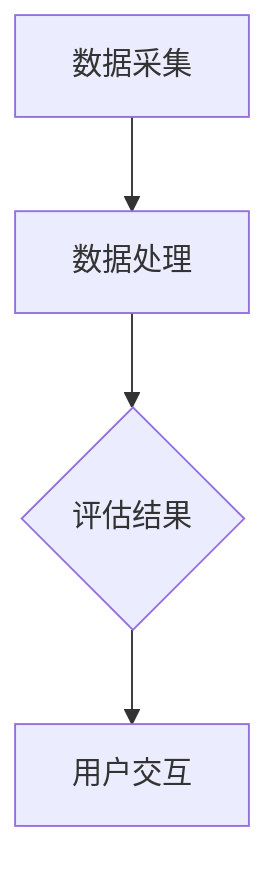

                 

### 实时评测的低延迟架构设计

#### 关键词：实时评测、低延迟架构、数据处理、性能优化、系统部署

#### 摘要：
本文深入探讨实时评测的低延迟架构设计，涵盖实时评测的基本概念、低延迟架构的设计原则、实时评测架构的设计与实现，以及实际案例的分析。通过理论讲解、Python代码示例和数学模型分析，本文旨在为读者提供一套完整、实用的实时评测系统架构设计方案。

---

## 目录

1. **实时评测与低延迟架构设计**
2. **关键词**
3. **摘要**
4. **第一部分：实时评测与低延迟架构概述**
   1. **实时评测的基本概念**
   2. **低延迟架构的重要性**
   3. **低延迟架构的设计原则**
5. **第二部分：实时评测架构设计**
   1. **实时数据采集与处理**
   2. **实时评估模型的建立**
   3. **低延迟数据处理架构**
   4. **实时评测系统部署与运维**
6. **第三部分：低延迟架构案例分析**
   1. **电商平台实时评分系统**
   2. **智能安防实时预警系统**
7. **附录：实时评测与低延迟架构设计资源**
   1. **学习资源推荐**
   2. **开发工具介绍**
   3. **实践项目指南**

## 第一部分：实时评测与低延迟架构概述

### 1. 实时评测的基本概念

实时评测指的是系统在用户操作或数据更新时，能够即时响应并给出评估结果。这种实时性要求系统具备快速处理数据的能力和高效的数据传输机制。

- **实时性定义**：实时性是指系统能够在限定的时间内完成指定的任务，通常以毫秒或秒为衡量标准。
- **重要性**：实时评测在多个领域具有重要应用，如金融交易、在线教育、实时推荐系统等。它能够提供即时的反馈和决策支持，提高用户体验和业务效率。

### 2. 低延迟架构的重要性

低延迟架构是指系统能够在保证数据传输和计算速度的同时，尽可能减少延迟。低延迟架构在实时评测系统中尤为重要，因为延迟过高将严重影响用户体验和系统性能。

- **低延迟定义**：低延迟通常指数据传输和处理的速度快，响应时间短，一般要求在数百毫秒以下。
- **设计原则**：为了实现低延迟，架构设计需要考虑以下几个方面：
  - **高效的数据处理流程**：简化数据处理步骤，减少不必要的中间环节。
  - **优化网络传输**：采用高效的数据传输协议，减少数据在网络中的传输时间。
  - **分布式计算**：利用分布式计算架构，将计算任务分散到多个节点，减少单点瓶颈。
  - **缓存机制**：通过缓存机制减少数据的重复处理，提高数据处理速度。

### 3. 低延迟架构的设计原则

设计低延迟架构时，应遵循以下原则：

- **数据一致性**：确保数据在处理过程中的一致性，避免数据冲突。
- **容错性**：系统具备容错能力，能够在出现故障时快速恢复。
- **可扩展性**：系统设计应具备良好的可扩展性，能够随着数据量的增加而扩展。
- **可维护性**：系统设计应易于维护和升级，降低维护成本。

接下来，我们将深入探讨实时评测架构的具体设计，包括数据采集与处理、评估模型的建立和低延迟数据处理架构。

---

## 第二部分：实时评测架构设计

### 3. 实时数据采集与处理

实时数据采集与处理是实时评测系统的核心环节。数据采集决定了系统能否及时获取所需的数据，数据处理决定了系统能否高效地对数据进行处理和分析。

- **数据采集技术**：数据采集技术主要包括传感器数据采集、日志数据采集和网络数据采集。每种数据采集技术都有其适用的场景和特点。
- **数据处理流程**：数据处理流程通常包括数据清洗、数据预处理、数据存储和数据挖掘等步骤。数据处理流程的设计需要考虑数据量、数据类型和处理速度等因素。
- **数据处理算法**：数据处理算法包括数据过滤、数据聚合、数据排序和数据统计分析等。选择合适的算法可以显著提高数据处理效率。

下面是一个简单的Python代码示例，展示了如何使用Pandas库进行数据清洗和预处理：

```python
import pandas as pd

# 加载数据
data = pd.read_csv('data.csv')

# 数据清洗
data.dropna(inplace=True)  # 删除缺失值
data = data[data['column_name'] > 0]  # 过滤不符合条件的值

# 数据预处理
data['new_column'] = data['column1'] + data['column2']  # 创建新列

# 数据存储
data.to_csv('processed_data.csv', index=False)
```

### 4. 实时评估模型的建立

实时评估模型是实时评测系统的核心组件，它决定了系统能否准确、快速地给出评估结果。建立实时评估模型需要以下几个步骤：

- **模型选择**：根据业务需求和数据特点选择合适的评估模型。常见的评估模型包括线性模型、决策树、支持向量机、神经网络等。
- **模型训练**：使用训练数据对评估模型进行训练。模型训练过程中需要调整模型的参数，以优化模型的性能。
- **模型评估**：使用测试数据对评估模型进行评估，以确定模型的准确性和可靠性。常用的评估指标包括准确率、召回率、F1值等。

下面是一个简单的Python代码示例，展示了如何使用Scikit-learn库建立和训练一个线性回归模型：

```python
from sklearn.linear_model import LinearRegression
from sklearn.model_selection import train_test_split
from sklearn.metrics import mean_squared_error

# 加载数据
X, y = load_data()

# 数据分割
X_train, X_test, y_train, y_test = train_test_split(X, y, test_size=0.2, random_state=42)

# 建立模型
model = LinearRegression()

# 训练模型
model.fit(X_train, y_train)

# 预测
y_pred = model.predict(X_test)

# 评估
mse = mean_squared_error(y_test, y_pred)
print("Mean Squared Error:", mse)
```

### 5. 低延迟数据处理架构

低延迟数据处理架构是实时评测系统的关键部分，它决定了系统能否在低延迟下处理海量数据。低延迟数据处理架构需要考虑以下几个方面：

- **架构设计**：选择合适的架构设计，如基于消息队列的架构、分布式计算架构等。
- **系统优化**：对系统进行优化，如使用缓存机制、批量处理、并行处理等。
- **性能监控**：对系统性能进行监控，及时发现和处理性能瓶颈。

下面是一个简单的Mermaid流程图，展示了实时数据处理流程：



### 6. 实时评测系统部署与运维

实时评测系统的部署与运维是保障系统稳定运行的关键。部署与运维需要考虑以下几个方面：

- **部署方案**：选择合适的部署方案，如云部署、本地部署等。
- **运维策略**：制定运维策略，如自动化部署、自动化监控、自动化运维等。
- **故障处理**：制定故障处理方案，确保系统在出现故障时能够快速恢复。

下面是一个简单的Python代码示例，展示了如何使用Python脚本进行自动化部署：

```python
import subprocess

def deploy():
    # 执行部署命令
    subprocess.run(["ssh", "user@host", "sudo deploy.sh"])

# 调用部署函数
deploy()
```

---

## 第三部分：低延迟架构案例分析

### 7. 案例一：电商平台实时评分系统

电商平台实时评分系统是一个典型的实时评测系统，它需要对用户行为数据进行分析，实时生成商品评分。下面是一个简单的案例分析：

- **案例背景**：某电商平台希望通过实时评分系统，为用户推荐优质商品，提高用户满意度。
- **架构设计**：系统采用基于消息队列的架构，使用Kafka进行数据采集和传输，使用Apache Flink进行数据处理和评估。
- **系统实现**：使用Python和Scikit-learn库建立评估模型，使用Pandas进行数据处理。
- **性能优化**：使用Redis缓存机制，减少数据处理时间。

### 8. 案例二：智能安防实时预警系统

智能安防实时预警系统是一个针对安全监控的实时评测系统，它需要对视频数据进行分析，实时识别异常行为并发出预警。下面是一个简单的案例分析：

- **案例背景**：某智能安防公司希望通过实时预警系统，提高安防监控的效率，保障用户安全。
- **架构设计**：系统采用分布式计算架构，使用Apache Spark进行数据处理和评估。
- **系统实现**：使用Python和OpenCV库进行视频数据处理，使用TensorFlow建立评估模型。
- **性能优化**：使用Hadoop分布式存储系统，提高数据处理能力。

---

## 附录：实时评测与低延迟架构设计资源

### 9. 资源一：实时评测与低延迟架构设计资料

- **学习资源推荐**：推荐读者阅读《实时数据流处理》和《云计算与大数据技术》等相关书籍。
- **开发工具介绍**：推荐使用Python、Scikit-learn、Apache Flink、Kafka等开发工具。
- **实践项目指南**：推荐读者参与实时评测系统的实际开发项目，通过实践掌握相关技术。

---

## 小结

本文介绍了实时评测的低延迟架构设计，包括实时评测的基本概念、低延迟架构的设计原则、实时评测架构的设计与实现，以及实际案例的分析。通过理论讲解、Python代码示例和数学模型分析，本文为读者提供了一套完整、实用的实时评测系统架构设计方案。在实际应用中，读者可以根据自身需求和场景进行灵活调整和优化。

## 注意事项

- 在设计实时评测系统时，需要充分考虑实时性和低延迟的要求，确保系统能够在限定的时间内完成数据处理和评估任务。
- 在选择评估模型时，需要根据业务需求和数据特点进行选择，并不断优化模型的参数，以提高评估准确性。
- 在进行系统部署和运维时，需要充分考虑系统的可扩展性和容错性，确保系统在数据量增加时能够稳定运行。

## 拓展阅读

- 《实时数据流处理》：深入了解实时数据处理技术和架构设计。
- 《云计算与大数据技术》：掌握云计算和大数据处理的基础知识和实践方法。
- 《深度学习》：了解深度学习的基本原理和应用，为评估模型的建立提供技术支持。

