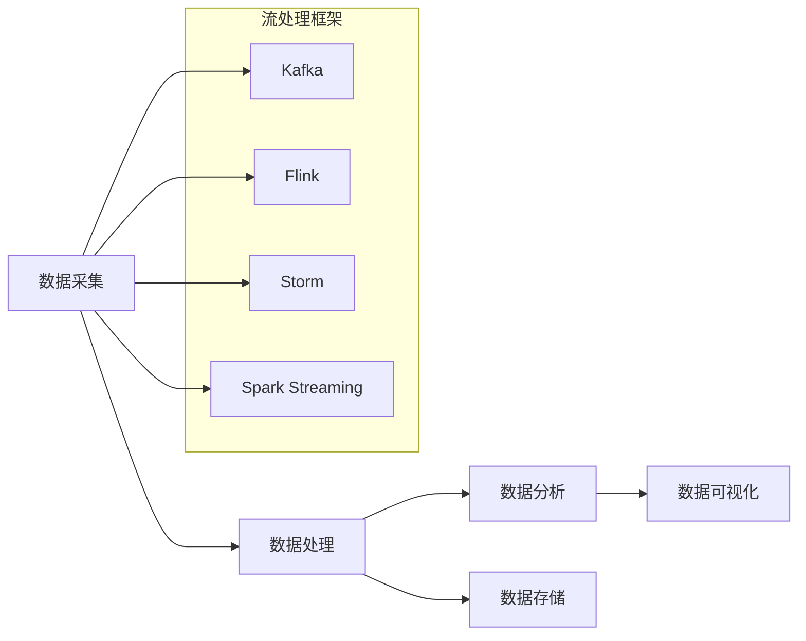

                 

### 《实时评测的流处理架构设计》

随着互联网和大数据技术的发展，实时评测已成为众多领域的重要应用，如金融、电子商务、在线教育等。实时评测的架构设计不仅需要处理海量数据的高效性，还要求系统的低延迟和可扩展性。本文将详细探讨实时评测的流处理架构设计，旨在为读者提供一个全面而深入的指南。

## 关键词
- 实时评测
- 流处理
- 架构设计
- 数据处理流程
- 算法实现
- 性能优化

## 摘要
本文首先介绍了流处理技术的基础概念，包括流处理与批处理的对比、流处理框架的介绍以及流数据处理模型。随后，文章详细阐述了实时评测系统设计原则、数据处理流程、核心算法原理和实时评测系统优化与调优策略。最后，通过两个实时评测项目实战，展示了流处理架构在实践中的应用。本文旨在为读者提供实时评测流处理架构设计的理论基础和实践指导。

### 第一部分：流处理技术基础

#### 1. 流处理技术概述

流处理是一种数据处理技术，它可以实时地处理数据流，对数据进行实时分析、计算和更新。与批处理不同，流处理具有低延迟、高实时性和可扩展性的特点。流处理技术的应用场景非常广泛，例如实时监控、实时分析、实时推荐系统等。

**流处理与批处理对比：**

- **批处理**：数据以批量方式处理，通常用于离线数据分析，如Hadoop、Spark等。
- **流处理**：数据以流的方式处理，能够实现实时分析，如Apache Kafka、Apache Flink等。

**流处理技术的应用场景：**

- 实时日志分析
- 实时监控和报警
- 实时数据推荐系统
- 实时流数据分析

#### 2. 流处理框架介绍

流处理框架是实现流处理的关键组件，下面介绍几种主流的流处理框架：

- **Apache Kafka**：一个分布式流处理平台，主要用于数据的实时传输和存储。
- **Apache Flink**：一个分布式流处理框架，支持批处理和流处理，具备高吞吐量和低延迟的特点。
- **Apache Storm**：一个分布式实时计算系统，主要用于实时流数据处理。
- **Apache Spark Streaming**：Spark的核心组件之一，用于流数据处理，具备高吞吐量和可扩展性。

#### 3. 流数据处理模型

流数据处理模型是流处理架构的核心，下面介绍几种常见的流数据处理模型：

- **微批处理模型**：将流数据划分为小批量进行批处理，平衡实时性和计算效率。
- **微服务模型**：将流处理任务拆分为多个微服务，实现高可扩展性和灵活部署。
- **实时数据湖模型**：将流数据和批数据统一存储，进行实时和离线分析。

### 第二部分：实时评测的架构设计

#### 4. 实时评测系统设计原则

实时评测系统设计原则包括以下几个方面：

- **系统性能优化**：优化数据处理流程，提高系统吞吐量和响应速度。
- **容错性和可伸缩性设计**：确保系统在故障和负载高峰时能够稳定运行。
- **安全性性和隐私保护**：保障数据的安全性和用户隐私。

#### 5. 实时评测数据处理流程

实时评测数据处理流程包括以下几个步骤：

- **数据采集与清洗**：从各种数据源收集数据，并进行清洗和预处理。
- **数据预处理**：对数据进行格式转换、缺失值填充、异常值处理等操作。
- **数据分析**：使用统计分析、机器学习等方法对数据进行处理和挖掘。
- **数据可视化**：将分析结果以图表、报表等形式展示，帮助决策者进行决策。

#### 6. 核心算法原理与实现

核心算法是实现实时评测的关键，下面介绍几种常见的算法原理：

- **实时数据流建模**：使用时间序列分析、聚类分析等方法对数据流进行建模。
- **实时机器学习算法**：如K-最近邻、决策树、支持向量机等，用于实时预测和分类。
- **聚类分析与模式识别**：使用K-均值、层次聚类等方法进行聚类分析，识别数据中的模式和趋势。

#### 7. 实时评测系统优化与调优

实时评测系统优化与调优包括以下几个方面：

- **常见性能瓶颈分析**：识别系统中的性能瓶颈，如CPU、内存、I/O等。
- **调优策略与方法**：根据性能瓶颈采取相应的调优策略，如缓存、并行处理、负载均衡等。
- **指标优化与评价**：设置关键性能指标（KPI），对系统性能进行评价和优化。

### 第三部分：实时评测项目实战

#### 8. 实时评测项目实战一

**项目背景与目标**：该项目旨在为电商平台搭建一个实时商品推荐系统，根据用户浏览和购买行为，实时推荐相关的商品。

**系统架构设计**：

1. 数据采集：通过API接口和日志收集用户行为数据。
2. 数据处理：使用Apache Kafka进行数据流传输，使用Apache Flink进行数据处理和实时推荐。
3. 数据存储：使用Hadoop HDFS进行数据存储，使用Apache Hive进行数据查询和分析。
4. 数据可视化：使用ECharts进行数据可视化。

**系统开发与实现**：

1. 数据采集：使用Python编写API接口和日志收集脚本。
2. 数据处理：使用Apache Kafka和Apache Flink实现数据流处理和实时推荐。
3. 数据存储：使用Hadoop HDFS和Apache Hive实现数据存储和查询。
4. 数据可视化：使用ECharts进行数据可视化。

**性能测试与评估**：

1. 基准测试：使用基准数据集进行系统性能测试。
2. 实际测试：使用真实数据集进行系统性能测试。
3. 评估指标：响应时间、吞吐量、准确性等。

**项目小结**：

通过该项目实战，成功实现了实时商品推荐系统，提高了用户购物体验和电商平台销售额。

#### 9. 实时评测项目实战二

**项目背景与目标**：该项目旨在为金融机构搭建一个实时风险评估系统，根据客户交易行为，实时评估其信用风险。

**系统架构设计**：

1. 数据采集：通过API接口和日志收集客户交易数据。
2. 数据处理：使用Apache Kafka进行数据流传输，使用Apache Flink进行数据处理和实时评估。
3. 数据存储：使用Hadoop HDFS进行数据存储，使用Apache Hive进行数据查询和分析。
4. 数据可视化：使用ECharts进行数据可视化。

**系统开发与实现**：

1. 数据采集：使用Python编写API接口和日志收集脚本。
2. 数据处理：使用Apache Kafka和Apache Flink实现数据流处理和实时评估。
3. 数据存储：使用Hadoop HDFS和Apache Hive实现数据存储和查询。
4. 数据可视化：使用ECharts进行数据可视化。

**性能测试与评估**：

1. 基准测试：使用基准数据集进行系统性能测试。
2. 实际测试：使用真实数据集进行系统性能测试。
3. 评估指标：响应时间、吞吐量、评估准确性等。

**项目小结**：

通过该项目实战，成功实现了实时风险评估系统，提高了金融机构的风险管理和决策能力。

### 第四部分：未来趋势与展望

#### 10. 流处理技术的发展趋势

流处理技术在未来将继续发展，主要趋势包括：

- **新型流处理框架**：如Apache Storm、Apache Flink等，将提供更高效、更灵活的流处理能力。
- **大数据流处理技术**：随着数据规模的不断扩大，大数据流处理技术将得到广泛应用。
- **实时计算与人工智能融合**：实时计算与人工智能技术的结合，将实现更智能、更高效的实时评测系统。

#### 11. 实时评测的挑战与机遇

实时评测在未来的发展中将面临以下挑战：

- **海量数据处理的性能优化**：如何高效地处理海量数据，提高系统性能。
- **实时性保障**：如何在保证实时性的前提下，提高系统可靠性。
- **安全性性和隐私保护**：如何保障数据的安全性和用户隐私。

同时，实时评测也将面临巨大的机遇：

- **新兴应用领域**：如智慧城市、智能医疗、物联网等，为实时评测提供了广阔的应用场景。
- **潜在的商业价值**：实时评测技术在金融、电子商务、智能交通等领域的应用，将带来巨大的商业价值。
- **技术与产业融合方向**：实时评测技术与物联网、人工智能等领域的融合，将推动产业升级和创新发展。

### 结论

实时评测的流处理架构设计是当前大数据和人工智能领域的重要研究方向。本文详细介绍了实时评测的流处理技术基础、架构设计、项目实战和未来趋势。通过本文的探讨，希望读者能够对实时评测的流处理架构设计有一个全面而深入的了解，并为实际项目提供参考和指导。

### 作者信息

作者：AI天才研究院/AI Genius Institute & 禅与计算机程序设计艺术 /Zen And The Art of Computer Programming

### 完整性要求

在本文中，我们详细讲解了实时评测的流处理架构设计的各个方面，包括技术基础、架构设计、项目实战和未来趋势。以下是各部分的核心内容：

#### 背景介绍

实时评测是指系统实时地对数据进行处理和分析，以提供即时反馈和决策支持。流处理技术是实时评测的核心，它能够高效地处理实时数据流，提供低延迟和高吞吐量的处理能力。

#### 核心概念与联系

实时评测的流处理架构涉及多个核心概念，如流处理框架、数据处理模型、核心算法等。这些概念之间存在紧密的联系，共同构成了实时评测的流处理架构。

以下是流处理架构的Mermaid流程图：



#### 核心算法原理讲解

实时数据流建模：

- **时间序列分析**：使用时间序列分析方法对实时数据流进行建模，如ARIMA模型、LSTM模型等。
- **聚类分析**：使用聚类分析方法对实时数据流进行聚类，如K-均值聚类、层次聚类等。

以下是一个简单的Python代码示例，使用K-均值聚类对时间序列数据进行建模：

```python
import numpy as np
from sklearn.cluster import KMeans

# 生成模拟数据
data = np.random.rand(100, 1)

# 使用K-均值聚类
kmeans = KMeans(n_clusters=3)
kmeans.fit(data)

# 输出聚类结果
print(kmeans.labels_)

# 输出聚类中心
print(kmeans.cluster_centers_)
```

#### 项目实战

实时评测项目实战涉及实时数据采集、数据处理、数据分析和数据可视化等多个环节。以下是两个实时评测项目实战的简要介绍：

**实战一：实时商品推荐系统**

- **背景与目标**：为电商平台搭建实时商品推荐系统，根据用户浏览和购买行为，实时推荐相关的商品。
- **系统架构设计**：包括数据采集、数据处理、数据存储和数据可视化等模块。
- **系统开发与实现**：使用Python、Apache Kafka、Apache Flink、Hadoop HDFS、Apache Hive和ECharts等技术实现系统。
- **性能测试与评估**：通过基准测试和实际测试，评估系统性能。

**实战二：实时风险评估系统**

- **背景与目标**：为金融机构搭建实时风险评估系统，根据客户交易行为，实时评估其信用风险。
- **系统架构设计**：包括数据采集、数据处理、数据存储和数据可视化等模块。
- **系统开发与实现**：使用Python、Apache Kafka、Apache Flink、Hadoop HDFS、Apache Hive和ECharts等技术实现系统。
- **性能测试与评估**：通过基准测试和实际测试，评估系统性能。

#### 最佳实践 tips、小结、注意事项、拓展阅读

**最佳实践 tips：**

- 选择合适的流处理框架：根据实际需求和性能要求，选择合适的流处理框架。
- 数据预处理：确保数据的准确性和一致性，对数据进行预处理和清洗。
- 性能优化：针对系统性能瓶颈进行优化，如缓存、并行处理、负载均衡等。

**小结：**

本文详细介绍了实时评测的流处理架构设计，包括技术基础、架构设计、项目实战和未来趋势。通过本文的探讨，读者可以全面了解实时评测的流处理架构设计，并为实际项目提供参考和指导。

**注意事项：**

- 在进行实时评测项目时，要充分考虑系统的性能、可靠性和安全性。
- 要根据实际需求和数据特点，选择合适的算法和模型。
- 要进行充分的性能测试和评估，确保系统在实际运行中的性能。

**拓展阅读：**

- 《实时大数据处理：概念、技术和实践》
- 《大数据流处理技术综述》
- 《实时计算与人工智能》

### 结语

实时评测的流处理架构设计是大数据和人工智能领域的重要研究方向。本文通过详细的分析和实战案例，为读者提供了一个全面而深入的指南。希望本文能够帮助读者了解实时评测的流处理架构设计，并在实际项目中取得成功。随着技术的发展，实时评测的应用前景将更加广阔，期待读者在这一领域取得更多的成就。作者：AI天才研究院/AI Genius Institute & 禅与计算机程序设计艺术/Zen And The Art of Computer Programming。

