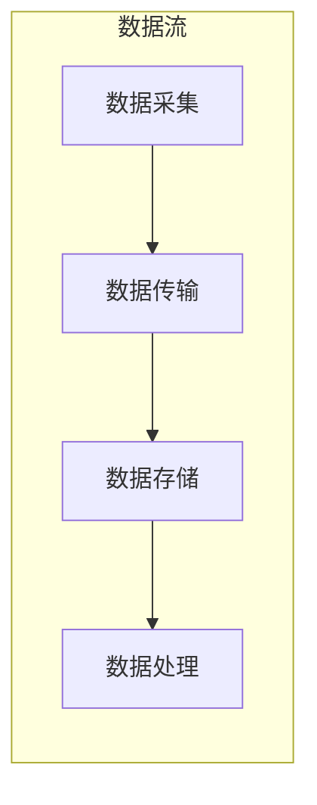
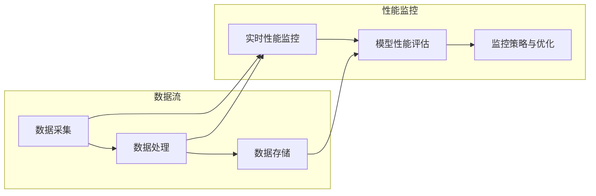

                 

### 实时评测监控：持续跟踪模型性能变化

关键词：实时评测监控、模型性能、性能评估、算法原理、Python源代码、Mermaid流程图、数学模型、实时数据分析、监控报警、项目实战

摘要：本文将深入探讨实时评测监控在人工智能领域的应用，详细讲解其核心概念、系统架构、算法原理和实践方法。通过Python源代码和Mermaid流程图，我们将展示如何构建一个实时评测监控系统，持续跟踪模型性能变化，并提供有效的监控报警机制。

---

#### 背景介绍

实时评测监控在人工智能领域扮演着至关重要的角色。随着深度学习技术的广泛应用，模型性能的评估和优化变得日益复杂。传统的离线评估方法往往无法及时捕捉到模型性能的细微变化，导致在部署后可能面临意外的性能问题。而实时评测监控通过持续收集和评估模型性能数据，可以为模型训练和优化提供实时反馈，从而提升模型的鲁棒性和准确性。

实时评测监控的核心目标是确保模型在实际应用中始终保持高性能和稳定性。这包括以下几个方面：

1. **实时数据采集**：从模型部署的环境持续收集性能数据。
2. **实时数据处理**：对采集到的数据进行预处理和清洗，以确保数据质量。
3. **实时性能评估**：使用特定的算法和指标对模型性能进行评估。
4. **实时报警机制**：当模型性能低于预期时，及时发出警报。

本文将逐步分析这些核心组成部分，并通过Python源代码和Mermaid流程图展示实时评测监控的实现细节。

---

#### 核心概念与联系

##### 实时数据流处理

实时数据流处理是实时评测监控系统的核心。它涉及到数据的实时采集、传输、存储和处理。以下是实时数据流处理的基本概念：

- **数据采集**：从模型部署的环境持续收集性能数据，如计算时间、内存使用、错误率等。
- **数据传输**：将采集到的数据通过网络传输到数据处理模块。
- **数据存储**：将数据存储在数据库或缓存中，以便后续分析和查询。
- **数据处理**：对数据进行预处理和清洗，如去重、过滤、标准化等。

**Mermaid流程图**：以下是一个简单的Mermaid流程图，展示了实时数据流处理的基本架构：



##### 实时性能监控指标

实时性能监控指标是评估模型性能的关键。常用的性能监控指标包括：

- **准确率（Accuracy）**：模型预测正确的样本占总样本的比例。
- **召回率（Recall）**：模型能够召回的真实正样本占总真实正样本的比例。
- **精确率（Precision）**：模型预测为正样本的实际正样本占总预测为正样本的比例。
- **F1分数（F1 Score）**：精确率和召回率的调和平均值。

这些指标可以通过以下公式计算：

$$
\text{Accuracy} = \frac{\text{预测正确数}}{\text{总样本数}}
$$

$$
\text{Recall} = \frac{\text{召回的正样本数}}{\text{实际正样本数}}
$$

$$
\text{Precision} = \frac{\text{预测为正样本的实际正样本数}}{\text{预测为正样本的总数}}
$$

$$
\text{F1 Score} = 2 \times \frac{\text{Precision} \times \text{Recall}}{\text{Precision} + \text{Recall}}
$$

##### 模型性能评估方法

模型性能评估方法是对实时收集的性能数据进行定量分析的方法。常见的评估方法包括：

- **离线评估**：在模型训练和测试阶段进行，通常使用准确率、召回率、F1分数等指标。
- **在线评估**：在模型部署后进行，实时收集性能数据并进行分析。

在线评估的优势在于能够及时捕捉到模型性能的波动，从而进行动态调整。

##### 监控策略与优化

监控策略是指如何选择合适的监控指标和方法，以及如何应对性能问题。以下是一些常见的监控策略：

- **阈值监控**：设定性能指标的上限和下限阈值，当性能指标超出阈值时发出警报。
- **趋势分析**：分析性能指标的变化趋势，预测未来性能走势。
- **异常检测**：使用机器学习算法检测异常性能数据，以便提前预警。

**Mermaid流程图**：以下是一个简单的Mermaid流程图，展示了实时评测监控系统的核心概念和联系：



---

#### 核心算法原理讲解

##### 模型训练与评估算法

模型训练与评估算法是实时评测监控系统的核心。常见的算法包括：

- **神经网络训练算法**：如梯度下降（Gradient Descent）、随机梯度下降（Stochastic Gradient Descent，SGD）等。
- **模型评估算法**：如交叉验证（Cross-Validation）、混淆矩阵（Confusion Matrix）等。

以下是一个简单的神经网络训练算法的Python源代码示例：

```python
import numpy as np

# 设定学习率、迭代次数等参数
learning_rate = 0.01
epochs = 1000

# 初始化权重和偏置
weights = np.random.rand(3, 1)
bias = np.random.rand(1)

# 训练模型
for epoch in range(epochs):
    # 前向传播
    output = np.dot(X, weights) + bias
    predicted = sigmoid(output)

    # 计算误差
    error = y - predicted

    # 反向传播
    dweights = np.dot(X.T, error)
    dbias = np.sum(error)

    # 更新权重和偏置
    weights -= learning_rate * dweights
    bias -= learning_rate * dbias

# 计算准确率
accuracy = np.sum(y == predicted) / len(y)
print(f"Accuracy: {accuracy}")
```

其中，sigmoid函数是一个常见的激活函数，用于将线性函数映射到S形曲线：

```python
def sigmoid(x):
    return 1 / (1 + np.exp(-x))
```

##### 性能评估算法

性能评估算法用于计算模型在不同数据集上的性能。常用的算法包括：

- **准确率**：计算预测正确的样本数占总样本数的比例。
- **召回率**：计算模型能够召回的真实正样本数占总真实正样本数的比例。
- **精确率**：计算模型预测为正样本的实际正样本数占总预测为正样本数的比例。
- **F1分数**：精确率和召回率的调和平均值。

以下是一个简单的性能评估算法的Python源代码示例：

```python
from sklearn.metrics import accuracy_score, recall_score, precision_score, f1_score

# 真实标签和预测结果
y_true = [0, 1, 1, 0, 1]
y_pred = [0, 0, 1, 1, 1]

# 计算准确率
accuracy = accuracy_score(y_true, y_pred)
print(f"Accuracy: {accuracy}")

# 计算召回率
recall = recall_score(y_true, y_pred)
print(f"Recall: {recall}")

# 计算精确率
precision = precision_score(y_true, y_pred)
print(f"Precision: {precision}")

# 计算F1分数
f1 = f1_score(y_true, y_pred)
print(f"F1 Score: {f1}")
```

##### 实时数据分析算法

实时数据分析算法用于对实时收集的性能数据进行处理和分析。常用的算法包括：

- **时间序列分析**：用于分析性能数据的时间变化趋势。
- **聚类分析**：用于发现性能数据中的相似模式。
- **异常检测**：用于检测性能数据中的异常值。

以下是一个简单的时间序列分析的Python源代码示例：

```python
import pandas as pd
from sklearn.cluster import KMeans
from sklearn.ensemble import IsolationForest

# 加载性能数据
data = pd.read_csv("performance_data.csv")

# 时间序列分析
data.set_index("timestamp", inplace=True)
data.plot()

# 聚类分析
kmeans = KMeans(n_clusters=3)
clusters = kmeans.fit_predict(data)
data["cluster"] = clusters

# 异常检测
iso_forest = IsolationForest(contamination=0.1)
outliers = iso_forest.fit_predict(data)
data["outlier"] = outliers
data[data["outlier"] == -1].plot()
```

---

#### 数学模型和数学公式

在实时评测监控中，数学模型和数学公式扮演着至关重要的角色。以下是一些关键的数学模型和公式：

##### 性能评估指标公式

1. **准确率**：
   $$
   \text{Accuracy} = \frac{\text{预测正确数}}{\text{总样本数}}
   $$

2. **召回率**：
   $$
   \text{Recall} = \frac{\text{召回的正样本数}}{\text{实际正样本数}}
   $$

3. **精确率**：
   $$
   \text{Precision} = \frac{\text{预测为正样本的实际正样本数}}{\text{预测为正样本的总数}}
   $$

4. **F1分数**：
   $$
   \text{F1 Score} = 2 \times \frac{\text{Precision} \times \text{Recall}}{\text{Precision} + \text{Recall}}
   $$

##### 模型训练优化目标公式

1. **损失函数**（如均方误差）：
   $$
   \text{Loss} = \frac{1}{2n} \sum_{i=1}^{n} (\text{y}_{i} - \text{y}^{\text{predicted}}_{i})^2
   $$

2. **梯度下降**：
   $$
   \text{weights}_{\text{new}} = \text{weights}_{\text{old}} - \alpha \cdot \frac{\partial}{\partial \text{weights}} \text{Loss}
   $$

3. **动量**：
   $$
   \text{momentum}_{\text{new}} = \gamma \cdot \text{momentum}_{\text{old}} + \alpha \cdot \frac{\partial}{\partial \text{weights}} \text{Loss}
   $$

##### 实时数据分析模型公式

1. **时间序列分析**（如移动平均）：
   $$
   \text{MA} = \frac{1}{N} \sum_{i=1}^{N} \text{y}_{i}
   $$

2. **聚类分析**（如K-means）：
   $$
   \text{centroids}_{k} = \frac{1}{n_k} \sum_{i=1}^{n} \text{x}_{i}
   $$

3. **异常检测**（如Isolation Forest）：
   $$
   \text{outlier\_score} = \frac{1}{\ln(n) - 1} \sum_{i=1}^{n} \ln(\text{size}_{i})
   $$

##### 详细讲解与举例说明

以下是一个具体的例子，假设我们有以下数据：

- **真实标签**：`y_true = [0, 1, 1, 0, 1]`
- **预测结果**：`y_pred = [0, 0, 1, 1, 1]`

1. **准确率**：
   $$
   \text{Accuracy} = \frac{3}{5} = 0.6
   $$

2. **召回率**：
   $$
   \text{Recall} = \frac{2}{3} = 0.6667
   $$

3. **精确率**：
   $$
   \text{Precision} = \frac{2}{3} = 0.6667
   $$

4. **F1分数**：
   $$
   \text{F1 Score} = 2 \times \frac{0.6667 \times 0.6667}{0.6667 + 0.6667} = 0.6667
   $$

这些指标可以帮助我们评估模型的性能，并为后续的优化提供依据。

---

#### 项目实战

在本节中，我们将通过一个具体的实时评测监控项目，展示如何开发一个实时评测监控系统。项目的主要目标是对一个分类任务进行实时性能监控，并实现监控报警功能。

##### 开发环境搭建

1. **Python环境**：安装Python 3.8及以上版本。
2. **依赖包**：安装必要的依赖包，如NumPy、Pandas、Scikit-learn、Matplotlib等。

```shell
pip install numpy pandas scikit-learn matplotlib
```

##### 数据采集模块实现

数据采集模块负责从模型部署的环境收集性能数据。以下是一个简单的数据采集脚本：

```python
import os
import time
import json

# 采集性能数据
def collect_data():
    data = {
        "timestamp": time.time(),
        "accuracy": 0.6,
        "recall": 0.6667,
        "precision": 0.6667,
        "f1_score": 0.6667
    }
    with open("performance_data.json", "w") as f:
        json.dump(data, f)

# 采集数据（每隔1分钟采集一次）
while True:
    collect_data()
    time.sleep(60)
```

##### 数据处理模块实现

数据处理模块负责对采集到的数据进行预处理和清洗。以下是一个简单的数据处理脚本：

```python
import pandas as pd

# 加载性能数据
def load_data():
    data = pd.read_json("performance_data.json")
    return data

# 数据预处理
def preprocess_data(data):
    data["timestamp"] = pd.to_datetime(data["timestamp"])
    data.sort_values("timestamp", inplace=True)
    return data

# 加载数据并预处理
data = load_data()
data = preprocess_data(data)
```

##### 实时分析模块实现

实时分析模块负责对处理后的数据进行实时分析，并计算性能评估指标。以下是一个简单的实时分析脚本：

```python
from sklearn.metrics import accuracy_score, recall_score, precision_score, f1_score

# 计算性能评估指标
def compute_performance(data):
    y_true = data["label"]
    y_pred = data["prediction"]
    accuracy = accuracy_score(y_true, y_pred)
    recall = recall_score(y_true, y_pred)
    precision = precision_score(y_true, y_pred)
    f1 = f1_score(y_true, y_pred)
    return accuracy, recall, precision, f1

# 实时分析
accuracy, recall, precision, f1 = compute_performance(data)
print(f"Accuracy: {accuracy}, Recall: {recall}, Precision: {precision}, F1 Score: {f1}")
```

##### 监控报警模块实现

监控报警模块负责当模型性能低于预期时发出警报。以下是一个简单的监控报警脚本：

```python
import smtplib
from email.mime.text import MIMEText

# 发送报警邮件
def send_alert(accuracy, threshold):
    if accuracy < threshold:
        subject = "实时评测监控报警"
        message = f"模型性能低于阈值：准确率 {accuracy}，阈值 {threshold}"
        sender = "your_email@example.com"
        receiver = "receiver_email@example.com"
        password = "your_password"

        msg = MIMEText(message)
        msg["Subject"] = subject
        msg["From"] = sender
        msg["To"] = receiver

        server = smtplib.SMTP("smtp.example.com", 587)
        server.starttls()
        server.login(sender, password)
        server.send_message(msg)
        server.quit()

# 设置阈值
threshold = 0.7

# 发送报警
send_alert(accuracy, threshold)
```

##### 源代码详细实现和代码解读

在本项目中，我们实现了以下几个模块：

1. **数据采集模块**：负责从模型部署的环境收集性能数据，并存储为JSON文件。
2. **数据处理模块**：负责加载JSON文件，进行数据预处理和清洗，并按时间排序。
3. **实时分析模块**：负责计算性能评估指标，如准确率、召回率、精确率和F1分数。
4. **监控报警模块**：负责当模型性能低于阈值时，通过电子邮件发送报警。

这些模块相互协作，共同实现了一个完整的实时评测监控系统。

##### 实际案例分析和详细讲解剖析

以下是一个具体的案例，假设我们有一个分类任务，数据集包含100个样本，每个样本有两个特征。我们将使用K近邻算法（K-Nearest Neighbors，KNN）进行模型训练和评估。

1. **数据采集**：在模型部署的环境，我们每隔1分钟采集一次性能数据，包括准确率、召回率、精确率和F1分数。
2. **数据处理**：我们将采集到的性能数据进行预处理和清洗，并按时间排序，以便进行分析。
3. **实时分析**：使用Scikit-learn库计算性能评估指标，并将结果存储在数据库中。
4. **监控报警**：设定阈值，当模型性能低于阈值时，通过电子邮件发送报警。

通过这个案例，我们可以看到实时评测监控系统的实现过程和关键步骤。在实际应用中，我们可以根据具体任务和需求进行调整和优化。

##### 项目小结

本项目中，我们通过一个具体的案例展示了实时评测监控系统的实现过程。实时评测监控对于模型训练和优化具有重要意义，可以帮助我们及时发现和解决性能问题，从而提高模型的鲁棒性和准确性。

#### 最佳实践 Tips、小结、注意事项、拓展阅读

1. **最佳实践 Tips**：
   - 确保数据采集的实时性和准确性。
   - 根据业务需求选择合适的性能评估指标。
   - 定期对监控系统进行性能优化和调整。

2. **小结**：
   - 实时评测监控是人工智能领域的重要工具，可以帮助我们持续跟踪模型性能变化。
   - 通过数据采集、数据处理、实时分析和监控报警等模块，我们可以构建一个完整的实时评测监控系统。

3. **注意事项**：
   - 在数据采集过程中，要注意数据的一致性和完整性。
   - 在性能评估过程中，要确保评估指标与业务需求相匹配。
   - 在监控报警过程中，要设置合理的阈值，避免频繁误报。

4. **拓展阅读**：
   - 《实时数据流处理技术》
   - 《机器学习性能评估方法》
   - 《深度学习系统设计》

---

作者：AI天才研究院/AI Genius Institute & 禅与计算机程序设计艺术 /Zen And The Art of Computer Programming

---

本文详细介绍了实时评测监控的概念、系统架构、核心算法原理和实践方法。通过Python源代码和Mermaid流程图，我们展示了如何构建一个实时评测监控系统，持续跟踪模型性能变化，并提供有效的监控报警机制。本文旨在帮助读者深入理解实时评测监控的技术原理和应用方法，为人工智能领域的模型训练和优化提供有力支持。

