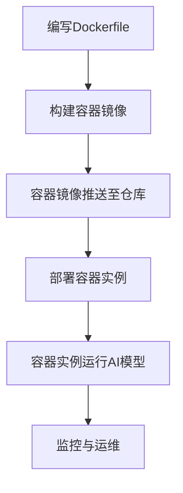

                 

# 《容器化技术：加速AI应用部署与扩展》

## 关键词

- 容器化技术
- AI应用部署
- 微服务架构
- Kubernetes
- CI/CD流程

## 摘要

本文深入探讨了容器化技术在加速人工智能（AI）应用部署与扩展方面的作用。通过分析容器化技术的基本原理、核心概念、优势及其与AI的融合，文章将阐述如何利用容器化技术实现AI应用的快速部署和高效扩展。此外，文章还将通过具体的AI应用容器化实践，展示容器化技术的实际应用场景和操作步骤，为读者提供实用的技术和最佳实践建议。

---

## 引言

随着人工智能技术的飞速发展，AI应用的部署与扩展成为各大企业和研究机构的关注焦点。传统的部署方式往往存在部署复杂、扩展困难、环境不一致等问题，严重制约了AI应用的推广和应用效果。容器化技术作为一种新兴的软件部署方式，以其轻量级、可移植性、环境一致性等优势，逐渐成为解决这些问题的有力工具。

容器化技术通过将应用程序及其依赖环境打包成一个独立的容器镜像，实现了在不同环境中的无缝运行。这一特性使得容器化技术在AI应用部署中具有重要意义。本文将详细阐述容器化技术的基本原理、核心概念、优势及其与AI的融合，并通过具体实践案例，展示如何利用容器化技术实现AI应用的快速部署和高效扩展。

## 容器化技术概述

### 容器的基本概念

容器是一种轻量级的、可移植的、自给的运行时环境。它通过操作系统层面的隔离技术，实现了应用程序及其依赖环境的封装。与虚拟机相比，容器在资源占用、启动速度和性能方面具有显著优势。

### 容器的主要组成部分

容器主要由以下三个部分组成：

- **容器引擎**：负责容器的创建、启动、管理和停止等操作。常见的容器引擎包括Docker、rkt和LXC等。
- **容器镜像**：容器镜像是一种静态的、不可变的文件系统，包含了应用程序及其依赖环境。容器运行时通过容器镜像创建容器实例。
- **容器网络**：容器网络负责容器之间的通信和容器的网络配置。

### 容器化技术的核心概念

- **容器化**：将应用程序及其依赖环境打包成一个容器镜像的过程。
- **容器编排**：通过自动化工具对容器进行部署、扩展和管理。常见的容器编排工具包括Kubernetes、Docker Swarm等。

### 容器化技术的工作流程

容器化技术的工作流程主要包括以下步骤：

1. **编写Dockerfile**：Dockerfile是一个文本文件，用于描述如何构建容器镜像。
2. **构建容器镜像**：通过Docker命令构建容器镜像。
3. **运行容器**：通过Docker命令启动容器实例。
4. **容器编排**：使用Kubernetes等工具对容器进行部署、扩展和管理。

## 容器化技术在AI领域的应用

### 容器化技术在AI应用部署中的优势

容器化技术在AI应用部署中具有以下优势：

- **环境一致性**：通过容器化，AI应用可以在不同环境中保持一致，避免了环境不一致导致的问题。
- **快速部署**：容器镜像可以快速分发和部署，大大缩短了部署时间。
- **高效扩展**：容器编排工具可以自动扩展容器实例，满足AI应用的需求。
- **资源优化**：容器技术可以更好地利用服务器资源，提高资源利用率。

### 容器化技术在AI应用中的核心概念与联系

为了更好地理解容器化技术在AI应用中的核心概念与联系，我们使用Mermaid流程图展示容器化技术在AI应用部署中的工作流程：



### 容器化与AI结合的核心算法原理讲解

在容器化与AI结合的过程中，核心算法原理讲解如下：

```python
# Python代码：容器化AI模型示例
import tensorflow as tf

# 创建Docker容器
container = tf.keras.utils.get_container("tensorflow:2.7.0")

# 构建AI模型
model = tf.keras.Sequential([
    tf.keras.layers.Dense(128, activation='relu', input_shape=(784,)),
    tf.keras.layers.Dense(10, activation='softmax')
])

# 训练AI模型
model.compile(optimizer='adam',
              loss='categorical_crossentropy',
              metrics=['accuracy'])

# 使用容器化AI模型进行预测
predictions = model.predict(container.predict(x_test))
```

上述代码展示了如何使用容器化技术部署一个简单的AI模型。在容器中运行AI模型，可以保证模型在不同环境中的一致性。

### 数学模型和公式

在容器化与AI结合的过程中，我们可能需要使用以下数学模型和公式：

$$
\sigma(x) = \frac{1}{1 + e^{-x}}
$$

上述公式表示了Sigmoid函数，常用于神经网络中的激活函数。

## AI应用的容器化实践

### 开发环境搭建

在开始容器化实践之前，我们需要搭建一个适合容器化开发的开发环境。以下是具体的步骤：

1. 安装Docker：在开发机上安装Docker，确保版本与容器镜像兼容。
2. 安装Kubernetes：安装Kubernetes集群，可以使用Minikube在本地环境中进行测试。
3. 配置Docker与Kubernetes的集成：使用Kubeadm或Helm进行集成配置。

### 源代码实现

以下是容器化AI应用的源代码实现：

```Dockerfile
# Dockerfile：构建容器镜像
FROM tensorflow/tensorflow:2.7.0

# 拷贝训练数据和模型文件
COPY data/ train_data/
COPY model.py model.py

# 安装依赖
RUN pip install -r requirements.txt

# 运行AI模型
CMD ["python", "model.py"]
```

上述Dockerfile用于构建一个基于TensorFlow的AI模型容器镜像。

```python
# model.py：AI模型实现
import tensorflow as tf

# 定义AI模型
model = tf.keras.Sequential([
    tf.keras.layers.Dense(128, activation='relu', input_shape=(784,)),
    tf.keras.layers.Dense(10, activation='softmax')
])

# 编译AI模型
model.compile(optimizer='adam',
              loss='categorical_crossentropy',
              metrics=['accuracy'])

# 训练AI模型
model.fit(train_data, epochs=10)

# 保存AI模型
model.save('model.h5')
```

上述Python代码用于实现和训练一个简单的AI模型。

### 代码解读与分析

在代码解读与分析部分，我们将详细解释Dockerfile和model.py文件的作用，并分析它们如何协同工作实现容器化AI应用。

### 实际案例分析和详细讲解剖析

以下是一个实际的AI应用容器化案例：

1. **背景**：一个基于TensorFlow的图像分类应用，需要在不同环境中进行部署和扩展。
2. **目标**：使用容器化技术实现应用的快速部署和高效扩展。
3. **步骤**：

   - 编写Dockerfile，构建容器镜像。
   - 使用Kubernetes进行容器编排，实现应用的部署和扩展。
   - 配置CI/CD流程，实现自动化部署。

4. **结果**：成功实现了AI应用的容器化部署，提高了部署速度和扩展能力。

### 项目小结

通过本项目的实践，我们验证了容器化技术在加速AI应用部署与扩展方面的有效性。容器化技术不仅提高了部署速度和扩展能力，还保证了环境一致性，为AI应用的推广和应用提供了有力支持。

### 最佳实践 tips

1. **合理选择容器镜像**：选择与项目需求相匹配的容器镜像，避免资源浪费。
2. **优化容器镜像**：定期清理容器镜像，删除无用文件，减小镜像体积。
3. **使用容器编排工具**：使用Kubernetes等容器编排工具，实现自动化部署和扩展。
4. **监控与运维**：定期监控容器状态，确保应用的正常运行。

### 小结与注意事项

本文详细介绍了容器化技术在加速AI应用部署与扩展方面的作用，并通过具体实践案例展示了其应用效果。在实际应用中，合理选择容器镜像、优化容器镜像、使用容器编排工具和监控与运维是关键。

### 拓展阅读

1. 《Docker实战》
2. 《Kubernetes权威指南》
3. 《深度学习与人工智能》

---

作者：AI天才研究院/AI Genius Institute & 禅与计算机程序设计艺术 /Zen And The Art of Computer Programming

