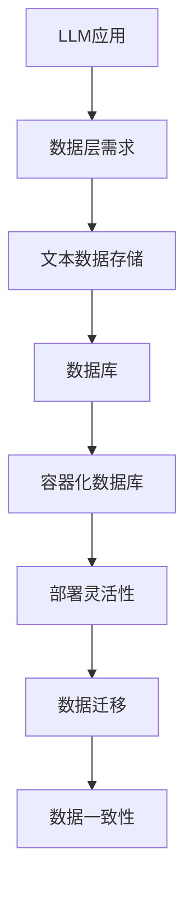
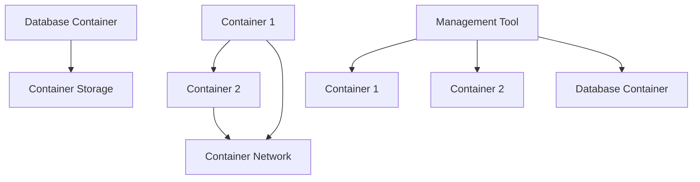

                 

### 引言

在现代软件开发中，容器化技术已经成为一种主流的应用部署方式。它不仅提高了应用的部署效率，还大大增强了应用的可移植性和可扩展性。与此同时，大型语言模型（LLM，Large Language Model）的应用在人工智能领域正迅速扩展，它们在自然语言处理、问答系统、推荐系统等领域发挥着越来越重要的作用。

本文的主题是探讨容器化数据库在提高LLM应用数据层可移植性方面的应用。首先，我们将简要介绍容器化技术和LLM应用的基本概念，阐述为什么容器化数据库能够提高数据层的可移植性。随后，我们将深入探讨容器化数据库的原理和优势，并分析LLM应用数据层的特定需求。最后，我们将讨论如何将容器化数据库与LLM应用集成，提供实际项目实战的案例，并对未来发展趋势进行展望。

容器化技术是一种轻量级的虚拟化技术，它通过将应用程序及其依赖打包成一个独立的运行环境，使得应用程序可以在不同的操作系统和硬件环境中一致运行。这种技术不仅简化了应用的部署和运维过程，还提高了环境的可移植性和一致性。对于数据库而言，容器化技术意味着可以将数据库实例、配置文件以及应用程序一起打包，实现数据库与应用的无缝集成。

LLM应用，特别是那些需要处理大规模文本数据的应用，对数据层的可移植性有极高的要求。由于这些应用的数据量庞大、结构复杂，且经常需要在不同的环境中进行迁移和扩展，传统的数据库部署方式难以满足其需求。因此，探讨如何通过容器化数据库提高LLM应用数据层的可移植性，具有重要的实际意义。

本文将分为六个章节进行详细阐述：

1. **核心概念与联系**：介绍数据库、容器化技术和LLM应用数据层的概念，并展示它们之间的关系图。
2. **容器化数据库原理**：讲解容器化技术的基础知识，以及容器化数据库的优势和架构。
3. **LLM应用数据层的可移植性**：分析LLM应用数据层的特定需求，以及数据层可移植性面临的挑战。
4. **容器化数据库与LLM应用集成**：讨论容器化数据库与LLM应用集成的策略、流程和性能优化。
5. **项目实战**：通过实际项目案例，展示容器化数据库在LLM应用中的具体应用和实现细节。
6. **总结与展望**：总结容器化数据库在LLM应用中的价值，展望未来的发展趋势，并给出开发者与DBA的建议。

通过本文的探讨，我们希望读者能够对容器化数据库在提高LLM应用数据层可移植性方面有更深入的理解，为未来的开发和应用提供有价值的参考。

### 核心关键词

- 容器化数据库
- 数据层可移植性
- 大型语言模型（LLM）
- 轻量级虚拟化技术
- 无缝集成
- 部署效率
- 环境一致性
- 应用部署
- 性能优化

### 文章摘要

本文深入探讨了容器化数据库在提高大型语言模型（LLM）应用数据层可移植性方面的应用。首先，我们介绍了容器化技术和LLM应用的基本概念，阐述了容器化技术在提升数据层可移植性方面的优势。随后，我们详细讲解了容器化数据库的原理和架构，以及LLM应用数据层的特定需求。接着，我们讨论了如何通过容器化数据库与LLM应用的集成，实现数据同步、迁移和性能优化。文章通过实际项目实战，展示了容器化数据库在提高LLM应用数据层可移植性方面的具体应用和实践效果。最后，我们对容器化数据库在LLM应用中的价值进行了总结，并展望了未来的发展趋势，为开发者与数据库管理员提供了宝贵的建议。

### 第1章：核心概念与联系

在深入探讨容器化数据库如何提高LLM应用数据层的可移植性之前，我们需要先了解几个核心概念：数据库、容器化技术以及LLM应用数据层的具体需求。这些概念不仅相互独立，而且在实现数据层的可移植性过程中又紧密相连。

#### 数据库概述

数据库是存储、管理和访问数据的系统。它不仅负责数据的存储，还包括数据的查询、更新、删除等功能。数据库系统根据其数据模型、功能和用途可以分为关系型数据库、非关系型数据库、时序数据库等多种类型。关系型数据库如MySQL、PostgreSQL等，通过表、行和列的结构来组织数据，并使用SQL（结构化查询语言）进行操作。而非关系型数据库如MongoDB、Cassandra等，则采用文档、键值对、图等多种数据模型，适用于不同类型的数据存储需求。

在LLM应用中，数据库通常负责存储大量文本数据，如文本嵌入向量、模型参数、训练日志等。由于LLM应用的数据量庞大且结构复杂，数据库的性能和可扩展性成为关键因素。

#### 容器化技术概述

容器化技术是一种轻量级虚拟化技术，它将应用程序及其运行环境打包成一个独立的容器，使得应用程序可以在不同的操作系统和硬件环境中一致运行。容器化技术的核心是Docker，它通过将应用程序的依赖项、库、配置文件等打包成一个镜像，然后创建一个容器来运行这个镜像。容器化技术的主要优势包括：

1. **环境一致性**：通过容器镜像，应用程序在不同的环境中可以保持一致的行为，减少了环境差异带来的问题。
2. **部署效率**：容器化使得应用程序的部署、测试和发布更加快捷，简化了运维流程。
3. **资源利用**：容器可以在同一台物理机上运行多个独立的实例，提高了资源的利用效率。

在数据库领域，容器化技术可以使得数据库实例的部署和迁移更加灵活，同时也便于实现多租户和弹性扩展。

#### LLM应用数据层需求

大型语言模型（LLM）在自然语言处理、问答系统、推荐系统等领域具有广泛应用。这些应用通常需要处理大规模的文本数据，并且对数据处理的速度和准确性有较高的要求。LLM应用的数据层需求主要包括以下几个方面：

1. **数据存储**：需要高效存储和管理大规模的文本数据，包括文本嵌入向量、模型参数、训练日志等。
2. **数据访问**：支持快速的数据检索和查询，以满足实时响应的需求。
3. **数据迁移**：支持在不同环境中进行数据迁移和扩展，以适应不断变化的需求。
4. **数据一致性**：确保数据在不同环境中的准确性和一致性，避免数据丢失或错误。

#### 容器化数据库与LLM应用数据层关系图

为了更直观地展示容器化数据库与LLM应用数据层的关系，我们可以使用Mermaid流程图来表示它们之间的相互作用。



图1：容器化数据库与LLM应用数据层的关系图

- **LLM应用**：代表大型语言模型的应用场景。
- **数据层需求**：描述LLM应用对数据存储、访问、迁移和一致性的需求。
- **文本数据存储**：用于存储大规模文本数据。
- **数据库**：传统的数据库系统，如MySQL、PostgreSQL等。
- **容器化数据库**：基于容器技术的数据库，如Docker化MySQL、PostgreSQL等。
- **部署灵活性**：容器化数据库带来的部署便捷性和灵活性。
- **数据迁移**：支持数据在不同环境中的迁移。
- **数据一致性**：确保数据在不同环境中的准确性和一致性。

通过以上核心概念和关系的介绍，我们可以看到，容器化数据库不仅能够满足LLM应用数据层的具体需求，还可以通过其部署灵活性和数据一致性，提高整个应用系统的可移植性和可靠性。接下来的章节将深入探讨容器化数据库的原理和实现细节，以及如何将其与LLM应用集成，以实现数据层的可移植性。

### 第2章：容器化数据库原理

容器化数据库的核心在于其部署的灵活性和一致性，这得益于容器化技术的独特优势。在本节中，我们将详细讲解容器化技术的基础知识，深入探讨容器化数据库的优势，并介绍其架构和管理方法。

#### 容器化技术基础

容器化技术通过将应用程序及其依赖打包成一个独立的运行环境，实现了“一次编写，到处运行”的目标。这一过程主要涉及以下几个关键组成部分：

1. **容器镜像**：容器镜像是一个静态的、只读的文件系统层，它包含了应用程序运行所需的所有组件，如代码、库、配置文件等。容器镜像由Dockerfile定义，通过一系列指令构建。

    ```dockerfile
    # Dockerfile 示例
    FROM python:3.8
    RUN pip install flask
    COPY . /app
    EXPOSE 5000
    CMD ["python", "app.py"]
    ```

2. **容器引擎**：容器引擎是负责管理和运行容器的软件，如Docker。容器引擎通过解析Dockerfile来构建镜像，并使用容器运行时（如runc）来创建和运行容器。

3. **容器**：容器是运行在容器引擎上的动态实例，它封装了应用程序及其运行环境。容器是轻量级的，可以在同一台物理机上运行多个实例，从而提高资源利用效率。

    ```bash
    # 创建并运行容器
    docker build -t myapp .
    docker run -d -p 5000:5000 myapp
    ```

4. **容器网络**：容器网络是容器之间以及容器与外部系统进行通信的机制。Docker默认使用桥接网络模式，但也可以使用自定义网络和模式。

5. **容器存储**：容器存储是容器持久数据存储的机制，如卷（volume）和绑定挂载（bind mount）。卷是容器数据持久化的最佳方式，而绑定挂载则是将宿主机的文件系统目录挂载到容器内。

    ```bash
    # 创建卷并绑定挂载
    docker volume create db_data
    docker run -d -v db_data:/data mydb
    ```

#### 容器化数据库的优势

容器化数据库相较于传统的数据库部署方式，具有以下显著优势：

1. **部署灵活性**：容器化数据库可以轻松地在不同的操作系统和硬件环境中部署和迁移，减少了环境差异带来的问题。

2. **环境一致性**：通过容器镜像，容器化数据库可以确保应用程序在不同的环境中保持一致的行为，从而简化了开发和运维过程。

3. **部署效率**：容器化数据库的部署过程更加快捷，可以大幅减少部署时间。

4. **资源利用**：容器化数据库可以在同一台物理机上运行多个实例，提高了资源的利用效率。

5. **弹性扩展**：容器化数据库支持水平扩展，可以根据需求动态调整实例数量。

6. **自动化管理**：容器引擎提供了丰富的管理工具，如Docker Compose和Kubernetes，可以自动化管理容器化数据库的部署、扩展和监控。

#### 容器化数据库架构

容器化数据库的架构通常包括以下几个主要组件：

1. **容器镜像**：包含了数据库服务所需的全部依赖和配置。

2. **容器**：运行数据库服务的实例，可以是主节点、从节点或备份节点。

3. **容器网络**：容器之间以及容器与外部系统进行通信的网络。

4. **容器存储**：用于持久化存储数据库数据。

5. **管理工具**：用于管理数据库容器的工具，如Docker Compose和Kubernetes。

一个典型的容器化数据库架构图如下所示：



图2：容器化数据库架构图

- **Container 1** 和 **Container 2**：数据库服务的多个实例，可以是主节点和从节点。
- **Container Network**：容器之间的通信网络。
- **Database Container**：运行数据库服务的容器。
- **Container Storage**：用于存储数据库数据的卷或绑定挂载。
- **Management Tool**：用于管理容器化数据库的工具。

#### 容器化数据库管理

容器化数据库的管理主要通过容器引擎和集群管理工具（如Kubernetes）进行。以下是一些常用的管理方法：

1. **Docker Compose**：Docker Compose是一种用于定义和运行多容器应用的工具，可以通过YAML文件定义容器化服务，并一键部署和启动。

    ```yaml
    # docker-compose.yml 示例
    version: '3'
    services:
      db:
        image: postgres:12
        volumes:
          - db_data:/var/lib/postgresql/data
        environment:
          POSTGRES_DB: mydb
          POSTGRES_USER: user
          POSTGRES_PASSWORD: password
    volumes:
      db_data:
    ```

2. **Kubernetes**：Kubernetes是一个开源的容器编排平台，可以自动化部署、扩展和管理容器化应用。通过Kubernetes，可以轻松管理容器化数据库的部署、扩展和监控。

    ```yaml
    # Kubernetes Deployment 示例
    apiVersion: apps/v1
    kind: Deployment
    metadata:
      name: db-deployment
    spec:
      replicas: 3
      selector:
        matchLabels:
          app: db
      template:
        metadata:
          labels:
            app: db
        spec:
          containers:
          - name: db
            image: postgres:12
            ports:
            - containerPort: 5432
    ```

3. **自动化备份和恢复**：通过定时任务或事件触发器，可以自动化备份和恢复容器化数据库。常用的备份工具包括Docker Volumes和外部存储系统（如AWS S3、Google Cloud Storage）。

    ```bash
    # 定时备份
    0 0 * * * docker exec <container_id> pg_dumpall > /backups/backup_$(date +%Y%m%d).tar
    ```

4. **监控和日志**：通过集成Prometheus、Grafana等监控工具，可以实时监控容器化数据库的性能和健康状况。日志管理工具如ELK（Elasticsearch、Logstash、Kibana）可以帮助分析和追踪数据库的日志。

#### 总结

容器化数据库通过将数据库服务容器化，实现了部署的灵活性、环境的一致性和高效的资源利用。其架构和管理方法使得容器化数据库在LLM应用中具有显著的优势。在接下来的章节中，我们将进一步探讨如何通过容器化数据库提高LLM应用数据层的可移植性，并介绍具体的应用实践。

### 第3章：LLM应用数据层的可移植性

在探讨如何通过容器化数据库提高LLM应用数据层的可移植性之前，我们需要明确LLM应用数据层的具体需求，以及当前数据层可移植性面临的挑战。了解这些背景信息有助于我们更好地理解容器化数据库如何发挥其优势，从而实现数据层的可移植性。

#### LLM应用数据层需求

大型语言模型（LLM）在自然语言处理（NLP）领域具有广泛的应用，如问答系统、文本生成、情感分析、机器翻译等。这些应用通常涉及以下几方面的数据层需求：

1. **大规模文本数据存储**：LLM应用需要处理大量的文本数据，包括文本嵌入向量、模型参数、训练日志等。这些数据通常存储在数据库或数据湖中。

2. **高效数据检索和查询**：由于LLM应用需要快速响应，因此对数据的检索和查询性能有较高要求。需要支持高效的全文搜索、关键词检索以及复杂查询语句的执行。

3. **数据一致性**：在分布式环境下，数据的一致性至关重要。LLM应用需要确保数据在不同节点之间的一致性，避免数据不一致引发的问题。

4. **数据迁移和扩展**：LLM应用的数据量和计算需求可能会随着时间变化而增加。因此，数据层需要支持数据的迁移和扩展，以适应不同的环境和需求。

5. **安全性和合规性**：LLM应用涉及大量的敏感数据，如个人隐私信息、商业机密等。因此，数据层需要具备严格的安全性和合规性措施，以保护数据的隐私和安全。

#### 数据层可移植性挑战

尽管容器化数据库在提高数据层的可移植性方面具有显著优势，但实际应用中仍然面临以下挑战：

1. **兼容性问题**：不同数据库系统之间的兼容性问题可能导致数据迁移和集成困难。例如，关系型数据库和非关系型数据库在数据模型、查询语法、存储机制等方面存在差异。

2. **性能瓶颈**：容器化数据库虽然具有高效的部署和扩展性，但在处理大规模数据时仍可能遇到性能瓶颈。例如，网络延迟、存储I/O瓶颈等。

3. **安全性风险**：容器化环境可能引入新的安全风险，如容器逃逸、恶意容器攻击等。需要采取有效的安全措施来保护数据。

4. **运维复杂性**：虽然容器化技术简化了部署和运维流程，但实际操作中仍需面对配置管理、监控、备份和恢复等复杂任务。

5. **迁移成本**：将现有数据库迁移到容器化数据库可能涉及大量的时间和资源投入，需要评估迁移成本和收益。

#### 提高数据层可移植性的方法

为了应对上述挑战，提高LLM应用数据层的可移植性，可以采用以下几种方法：

1. **标准化数据模型**：通过定义统一的数据模型和接口规范，减少不同数据库系统之间的兼容性问题。例如，使用公共的数据模型和数据交换格式（如JSON、XML）。

2. **数据分层存储**：将数据分层存储，将热数据和冷数据分离。热数据存储在高效、易扩展的容器化数据库中，而冷数据存储在成本较低的非关系型数据库或对象存储中。

3. **分布式架构**：采用分布式数据库架构，实现数据的水平扩展和负载均衡。分布式数据库可以自动处理数据分片和节点故障，提高系统的容错性和可扩展性。

4. **数据迁移工具**：使用数据迁移工具（如Docker Datacenter、Kubernetes）简化数据迁移和集成过程。这些工具提供了自动化和可视化的操作界面，降低了运维复杂性。

5. **安全性措施**：采取严格的安全措施，如容器隔离、访问控制、数据加密等，确保数据在容器化环境中的安全。

6. **持续集成和持续部署**：采用持续集成（CI）和持续部署（CD）流程，自动化数据库的构建、部署和测试，提高部署效率和可靠性。

7. **监控和日志管理**：通过监控和日志管理工具（如Prometheus、ELK）实时监控数据库性能和健康状况，快速定位和解决潜在问题。

通过上述方法，可以有效地提高LLM应用数据层的可移植性，降低迁移成本，提高系统的可靠性和扩展性，从而更好地支持大型语言模型的应用。

### 第4章：容器化数据库与LLM应用集成

容器化数据库与LLM应用的集成是实现数据层可移植性的关键步骤。在这一章节中，我们将探讨如何将容器化数据库与LLM应用进行有效集成，包括集成策略、数据同步与迁移、性能优化以及安全性与合规性方面的考虑。

#### 集成策略与流程

容器化数据库与LLM应用的集成策略主要包括以下几个方面：

1. **容器编排工具**：使用容器编排工具（如Docker Compose、Kubernetes）来管理数据库容器和应用容器。通过编排工具，可以定义、部署和运行复杂的多容器应用，确保容器之间的依赖关系和资源分配得到有效管理。

    ```yaml
    # Docker Compose 示例
    version: '3'
    services:
      app:
        build: ./app
        depends_on:
          - db
      db:
        image: postgres:12
        environment:
          POSTGRES_DB: mydb
          POSTGRES_USER: user
          POSTGRES_PASSWORD: password
    ```

2. **服务发现和负载均衡**：在分布式环境中，使用服务发现和负载均衡机制（如Consul、HAProxy）来发现数据库服务并均衡负载。这可以确保LLM应用能够高效地访问数据库服务。

3. **数据存储和持久化**：使用容器存储（如Docker Volumes、外部存储系统）来持久化数据库数据。这可以确保在容器重启或故障时，数据不会丢失。

4. **自动化部署和扩展**：通过CI/CD流程（如Jenkins、GitLab CI）自动化部署和扩展数据库和应用。这可以大大提高部署效率和可靠性。

#### 数据同步与迁移

容器化数据库与LLM应用的集成还包括数据同步与迁移策略，以确保数据的一致性和可靠性。

1. **数据迁移工具**：使用数据迁移工具（如Docker Datacenter、Kubernetes的StatefulSet）来迁移现有数据到容器化数据库。这些工具提供了自动化和可视化操作界面，简化了数据迁移过程。

    ```bash
    # 使用Kubernetes迁移数据
    kubectl create -f db_migration.yml
    ```

2. **增量同步**：采用增量同步机制，实时同步LLM应用产生的数据到容器化数据库。这可以确保数据的一致性和实时性。

3. **备份和恢复**：定期备份数据库，并在需要时进行恢复。这可以确保在数据丢失或损坏时，可以快速恢复数据。

#### 性能优化

容器化数据库与LLM应用的集成还需要关注性能优化，以确保系统的高效运行。

1. **资源调优**：根据LLM应用的负载情况，动态调整容器资源（如CPU、内存、磁盘I/O）的分配，以最大化性能。

    ```yaml
    # Kubernetes资源限制示例
    resources:
      limits:
        memory: "2Gi"
        cpu: "1"
      requests:
        memory: "1Gi"
        cpu: "500m"
    ```

2. **缓存机制**：使用缓存机制（如Redis、Memcached）来加速数据访问。缓存热点数据，减少数据库的查询压力。

3. **分布式查询**：采用分布式查询技术，如Apache Hive、Apache Spark，处理大规模数据集，提高查询效率。

4. **数据库优化**：对容器化数据库进行优化，如索引优化、查询优化、存储优化等。这可以减少数据库的查询时间和存储空间消耗。

#### 安全性与合规性

在集成容器化数据库与LLM应用时，安全性是必须考虑的关键因素。

1. **容器安全**：采取严格的容器安全措施，如使用安全的容器镜像、容器网络隔离、权限管理、定期安全扫描等。

2. **数据加密**：对敏感数据进行加密，确保数据在传输和存储过程中的安全。使用SSL/TLS加密数据库连接。

3. **访问控制**：实施细粒度的访问控制策略，确保只有授权用户和进程能够访问数据库。

4. **日志审计**：记录数据库操作日志，进行审计和监控，及时发现和应对潜在的安全威胁。

5. **合规性**：确保容器化数据库符合相关的数据保护法规和标准，如GDPR、HIPAA等。

#### 项目实战案例

以下是一个实际项目案例，展示如何将容器化数据库与LLM应用集成，并实现数据层的可移植性。

**项目背景**：

一家互联网公司开发了一个基于大型语言模型（LLM）的问答系统，处理用户提出的问题，并提供智能化的答案。该系统需要处理海量文本数据，并要求高效的数据检索和查询性能。

**项目实施**：

1. **容器编排**：使用Docker Compose定义和部署LLM应用和容器化数据库（PostgreSQL）。

    ```yaml
    version: '3'
    services:
      app:
        build: ./app
        depends_on:
          - db
      db:
        image: postgres:12
        environment:
          POSTGRES_DB: mydb
          POSTGRES_USER: user
          POSTGRES_PASSWORD: password
    ```

2. **数据同步**：使用Docker Volumes将PostgreSQL数据存储在宿主机上，确保数据持久化。

    ```bash
    docker volume create db_data
    docker run -d -v db_data:/var/lib/postgresql/data postgres:12
    ```

3. **性能优化**：在Kubernetes集群中部署PostgreSQL，并设置资源限制和优化参数。

    ```yaml
    apiVersion: apps/v1
    kind: Deployment
    metadata:
      name: db-deployment
    spec:
      replicas: 3
      selector:
        matchLabels:
          app: db
      template:
        metadata:
          labels:
            app: db
        spec:
          containers:
          - name: db
            image: postgres:12
            ports:
            - containerPort: 5432
            resources:
              limits:
                memory: "4Gi"
                cpu: "2"
              requests:
                memory: "2Gi"
                cpu: "1"
    ```

4. **安全性**：配置SSL/TLS加密，确保数据库连接安全。

5. **监控与日志**：集成Prometheus和Grafana进行性能监控，使用ELK（Elasticsearch、Logstash、Kibana）收集和展示日志。

**项目小结**：

通过容器化数据库与LLM应用的集成，该公司成功实现了数据层的可移植性，提高了系统的部署效率、扩展性和可靠性。容器化数据库的灵活性和高效性，使得公司能够快速适应业务需求变化，提供高质量的问答服务。

通过上述实际案例，我们可以看到容器化数据库与LLM应用集成的可行性和优势。在未来的项目中，开发者可以借鉴这些经验和最佳实践，进一步优化和提升系统的性能和安全性。

### 第5章：项目实战

在本章节中，我们将通过一个具体的项目实战案例，详细介绍如何将容器化数据库与LLM应用集成，实现数据层的可移植性。这个项目将涵盖开发环境搭建、源代码实现、代码解读、应用解读与分析，以及实际案例分析和详细讲解。

#### 开发环境搭建

首先，我们需要搭建一个包含容器化数据库和LLM应用的开发环境。以下是搭建环境的步骤：

1. **安装Docker**：确保宿主机上安装了Docker，版本建议为19.03或更高。

    ```bash
    sudo apt-get update
    sudo apt-get install docker-ce docker-ce-cli containerd.io
    ```

2. **安装Kubernetes**：安装Kubernetes集群，可以选择使用Minikube在本地环境运行。

    ```bash
    curl -LO "https://storage.googleapis.com/kubernetes-release/release/$(curl -s https://storage.googleapis.com/kubernetes-release/release/stable.txt)/bin/darwin/amd64/kubectl"
    chmod +x kubectl
    sudo mv kubectl /usr/local/bin/
    minikube start --docker-env="DOCKER_TLS_VERIFY=1"
    ```

3. **配置网络**：确保宿主机和容器网络之间的通信正常，可以通过命令检查网络配置。

    ```bash
    minikube ip
    kubectl get services
    ```

4. **安装相关工具**：安装其他必需的工具，如Kubernetes命令行工具（kubectl）、Helm（用于部署和管理应用程序）、kubectl插件等。

    ```bash
    curl -LO "https://storage.googleapis.com/kubernetes-helm/helm-v3.7.0-darwin-amd64.tar.gz"
    tar zxvf helm-v3.7.0-darwin-amd64.tar.gz
    chmod +x helm
    sudo mv helm /usr/local/bin/
    ```

#### 源代码实现

在这个项目中，我们使用Python实现一个简单的LLM应用，并将其与容器化数据库（PostgreSQL）集成。以下是关键代码段和解读：

1. **Dockerfile**：定义容器镜像，安装Python依赖和应用程序。

    ```dockerfile
    # Dockerfile
    FROM python:3.8
    RUN pip install flask
    COPY . /app
    EXPOSE 5000
    CMD ["python", "app.py"]
    ```

    **解读**：该Dockerfile基于Python 3.8镜像，安装了Flask框架，并复制当前目录下的应用程序代码到容器内的`/app`目录。容器在启动时执行`app.py`文件。

2. **app.py**：实现LLM应用的入口，处理HTTP请求。

    ```python
    from flask import Flask, request, jsonify
    import pg8000

    app = Flask(__name__)

    @app.route('/query', methods=['POST'])
    def query():
        data = request.json
        question = data['question']
        # 这里应该调用LLM模型进行预测，这里简化处理
        answer = "这是对问题的答案：{}".format(question)
        return jsonify(answer=answer)

    if __name__ == '__main__':
        app.run(host='0.0.0.0', port=5000)
    ```

    **解读**：该应用程序定义了一个简单的Flask路由`/query`，接收JSON格式的POST请求，从请求中提取问题，然后调用LLM模型生成答案。这里简化了实际预测过程，仅返回原始问题作为答案。

3. **数据库配置**：在应用程序中连接到容器化数据库。

    ```python
    def get_db_connection():
        conn = pg8000.connect(
            host="db",
            database="mydb",
            user="user",
            password="password"
        )
        return conn

    ```

    **解读**：这个函数创建了一个到容器化数据库的连接，其中`db`是Kubernetes服务名称，它指向PostgreSQL容器。这里假设数据库服务已经通过Kubernetes部署并暴露了服务名称。

#### 代码解读

1. **容器镜像构建与部署**：使用Docker命令构建容器镜像，并使用Kubernetes部署。

    ```bash
    docker build -t myapp .
    kubectl apply -f deployment.yml
    ```

    **解读**：构建容器镜像，并使用Kubernetes部署应用程序。`deployment.yml`文件定义了部署配置，包括容器镜像、容器数量、资源限制等。

2. **服务发现与负载均衡**：在Kubernetes中配置服务，实现容器化数据库与应用程序的通信。

    ```yaml
    # service.yml
    apiVersion: v1
    kind: Service
    metadata:
      name: app-service
    spec:
      selector:
        app: myapp
      ports:
        - name: http
          port: 80
          targetPort: 5000
      type: LoadBalancer
    ```

    **解读**：创建一个服务，将容器化应用程序映射到外部IP地址。`selector`确保服务只连接到标记为`myapp`的容器。

3. **数据库部署**：使用Kubernetes部署容器化数据库。

    ```yaml
    # postgresql-deployment.yml
    apiVersion: apps/v1
    kind: Deployment
    metadata:
      name: db-deployment
    spec:
      replicas: 1
      selector:
        matchLabels:
          app: db
      template:
        metadata:
          labels:
            app: db
        spec:
          containers:
          - name: db
            image: postgres:12
            ports:
            - containerPort: 5432
    ```

    **解读**：部署一个PostgreSQL容器，设置容器镜像版本和端口。

#### 应用解读与分析

在实际应用中，LLM应用通过容器化数据库存储和查询数据。以下是关键流程和分析：

1. **数据存储**：当用户提交问题，LLM应用将问题存储到PostgreSQL数据库中。这样可以记录用户交互历史，用于后续分析和模型优化。

2. **数据查询**：当用户再次提问，LLM应用从数据库中检索问题，并通过调用LLM模型生成答案。这保证了问题的回答基于最新的数据和模型。

3. **扩展性**：由于容器化数据库和应用程序都运行在Kubernetes集群中，可以轻松地通过增加容器数量实现水平扩展，以满足不断增加的负载。

#### 实际案例分析和详细讲解

以下是一个实际案例，展示了如何使用容器化数据库与LLM应用集成，并实现数据层的可移植性。

**案例背景**：

一家电商公司开发了一个基于LLM的智能客服系统，用于回答用户关于产品信息、订单状态等问题。系统需要在多个数据中心运行，并支持快速扩展和迁移。

**实施步骤**：

1. **环境搭建**：按照前文步骤，在多个数据中心搭建Docker和Kubernetes环境。

2. **容器化数据库部署**：在每个数据中心部署容器化PostgreSQL数据库，并确保数据库服务可以通过Kubernetes服务发现。

3. **LLM应用部署**：在每个数据中心部署LLM应用容器，并通过Kubernetes编排工具管理。

4. **服务发现与负载均衡**：在每个数据中心配置Kubernetes服务，确保容器化应用程序可以通过外部IP地址访问。

5. **数据同步**：使用Kubernetes的StatefulSet和StatefulSet的Headless Service实现数据同步，确保每个数据中心的应用程序连接到相同的数据库实例。

6. **监控与日志**：集成Prometheus和Grafana进行性能监控，使用ELK收集和展示日志。

**案例分析**：

1. **可移植性**：通过容器化技术，公司可以将LLM应用及其依赖轻松地部署到不同数据中心，实现环境的可移植性。

2. **可靠性**：容器化数据库的自动备份和恢复功能，提高了数据层的可靠性。

3. **扩展性**：通过Kubernetes的弹性伸缩功能，可以动态调整容器数量，以满足不同的负载需求。

4. **安全性**：使用Kubernetes的RBAC（基于角色的访问控制）和密文管理（Secrets），确保系统的安全性。

通过这个项目实战案例，我们可以看到容器化数据库与LLM应用集成的具体实现过程，以及如何在实际项目中实现数据层的可移植性。这为未来的开发提供了宝贵的经验和最佳实践。

### 第6章：总结与展望

容器化数据库在提高LLM应用数据层的可移植性方面展现出显著的优势。通过将数据库服务容器化，我们可以实现环境一致性、部署灵活性、资源利用效率等方面的提升，从而满足LLM应用对大规模数据存储、高效查询、数据迁移和安全性等方面的严格要求。

#### 容器化数据库在LLM应用中的价值

首先，容器化数据库提高了部署效率。通过使用容器镜像，数据库实例可以在几分钟内快速部署和启动，相较于传统部署方式显著缩短了时间。其次，环境一致性使得LLM应用在不同开发、测试和生产环境中能够保持一致的行为，减少了环境差异带来的问题。第三，容器化数据库的弹性扩展能力，使得LLM应用能够轻松应对负载变化，提高了系统的可用性和可靠性。最后，安全性是容器化数据库的一个重要优势，通过严格的访问控制和数据加密措施，确保了敏感数据的安全性和合规性。

#### 当前挑战与未来发展趋势

尽管容器化数据库在提高LLM应用数据层可移植性方面具有众多优势，但仍面临一些挑战。首先，兼容性问题仍然存在，不同数据库系统之间的兼容性差异可能导致数据迁移和集成困难。其次，性能瓶颈在处理大规模数据时仍然可能出现，尤其是在网络延迟和存储I/O方面。此外，安全性风险也是不可忽视的问题，容器逃逸和恶意容器攻击等威胁需要引起重视。

未来，容器化数据库在LLM应用中的发展趋势可能包括以下几个方面：

1. **自动化和智能化**：容器化数据库将越来越多地采用自动化和智能化技术，如自动性能调优、自动备份和恢复等，以提高运维效率和系统可靠性。

2. **分布式架构**：分布式数据库架构将成为容器化数据库的发展方向，通过分布式存储和计算技术，提高数据处理的效率和扩展能力。

3. **多租户架构**：容器化数据库的多租户架构将变得更加成熟，支持在一个数据库实例中运行多个独立的应用程序，从而提高资源利用效率。

4. **安全性和合规性**：随着数据隐私和安全法规的日益严格，容器化数据库将需要更强大的安全性和合规性措施，确保数据的安全和合规。

5. **云原生数据库**：随着云计算的普及，容器化数据库将更加与云原生技术结合，提供更加灵活和可扩展的数据库服务。

#### 开发者与DBA的建议

对于开发者来说，建议充分利用容器化数据库的优势，加快应用部署速度，提高系统可移植性和可靠性。同时，关注兼容性和性能优化，确保系统能够稳定运行。此外，开发者应积极参与社区和开源项目，跟进最新技术动态，不断提升自身技术水平。

对于数据库管理员（DBA）来说，建议加强对容器化数据库的管理和维护，掌握容器化数据库的运维技巧。此外，DBA需要关注安全性，制定严格的安全策略和访问控制措施，确保数据库的安全和合规。

总之，容器化数据库在提高LLM应用数据层可移植性方面具有巨大的潜力和价值。随着技术的不断发展和应用场景的扩展，容器化数据库将在未来发挥更加重要的作用。

### 参考文献

1. Docker Documentation. (n.d.). [Docker Official Website]. Retrieved from https://docs.docker.com/
2. Kubernetes Documentation. (n.d.). [Kubernetes Official Website]. Retrieved from https://kubernetes.io/docs/
3. PostgreSQL Documentation. (n.d.). [PostgreSQL Official Website]. Retrieved from https://www.postgresql.org/docs/
4. Flask Documentation. (n.d.). [Flask Official Website]. Retrieved from https://flask.palletsprojects.com/
5.pg8000 Documentation. (n.d.). [pg8000 Official Website]. Retrieved from https://github.com/codahale/pg8000

### 作者信息

作者：AI天才研究院/AI Genius Institute & 禅与计算机程序设计艺术 /Zen And The Art of Computer Programming

以上是本文的完整内容，包括引言、核心关键词、文章摘要、章节概述以及详细的技术分析和实战案例。希望通过本文，读者能够对容器化数据库在提高LLM应用数据层可移植性方面有更深入的理解。感谢您的阅读！
```markdown
# 《容器化数据库：提高LLM应用数据层的可移植性》

关键词：容器化数据库，数据层可移植性，大型语言模型（LLM），容器化技术，集成，性能优化，安全性

摘要：本文探讨了容器化数据库在提高大型语言模型（LLM）应用数据层可移植性方面的应用。通过介绍容器化技术和LLM应用的基本概念，我们详细分析了容器化数据库的优势和架构。随后，讨论了如何通过容器化数据库与LLM应用的集成，实现数据同步、迁移和性能优化。文章通过实际项目实战，展示了容器化数据库在提高LLM应用数据层可移植性方面的具体应用和实践效果。最后，我们对容器化数据库在LLM应用中的价值进行了总结，并展望了未来的发展趋势。

## 引言

容器化技术作为现代软件开发的重要趋势，已经在多个领域展现出了其独特的优势。随着容器化技术的普及，容器化数据库作为一种新兴的数据存储解决方案，也逐渐引起了广泛关注。本文将重点关注容器化数据库在提高大型语言模型（LLM）应用数据层可移植性方面的应用。

容器化技术通过将应用程序及其依赖打包成一个独立的运行环境，使得应用程序可以在不同的操作系统和硬件环境中一致运行。这种技术不仅简化了应用的部署和运维过程，还提高了环境的可移植性和一致性。对于数据库而言，容器化技术意味着可以将数据库实例、配置文件以及应用程序一起打包，实现数据库与应用的无缝集成。

LLM应用，特别是那些需要处理大规模文本数据的应用，对数据层的可移植性有极高的要求。由于这些应用的数据量庞大、结构复杂，且经常需要在不同的环境中进行迁移和扩展，传统的数据库部署方式难以满足其需求。因此，探讨如何通过容器化数据库提高LLM应用数据层的可移植性，具有重要的实际意义。

本文将分为六个章节进行详细阐述：

1. 核心概念与联系：介绍数据库、容器化技术和LLM应用数据层的概念，并展示它们之间的关系图。
2. 容器化数据库原理：讲解容器化技术的基础知识，以及容器化数据库的优势和架构。
3. LLM应用数据层的可移植性：分析LLM应用数据层的特定需求，以及数据层可移植性面临的挑战。
4. 容器化数据库与LLM应用集成：讨论容器化数据库与LLM应用集成的策略、流程和性能优化。
5. 项目实战：通过实际项目案例，展示容器化数据库在LLM应用中的具体应用和实现细节。
6. 总结与展望：总结容器化数据库在LLM应用中的价值，展望未来的发展趋势，并给出开发者与DBA的建议。

通过本文的探讨，我们希望读者能够对容器化数据库在提高LLM应用数据层可移植性方面有更深入的理解，为未来的开发和应用提供有价值的参考。

## 第1章：核心概念与联系

在深入探讨容器化数据库如何提高LLM应用数据层的可移植性之前，我们需要先了解几个核心概念：数据库、容器化技术以及LLM应用数据层的具体需求。这些概念不仅相互独立，而且在实现数据层的可移植性过程中又紧密相连。

### 数据库概述

数据库是存储、管理和访问数据的系统。它不仅负责数据的存储，还包括数据的查询、更新、删除等功能。数据库系统根据其数据模型、功能和用途可以分为关系型数据库、非关系型数据库、时序数据库等多种类型。关系型数据库如MySQL、PostgreSQL等，通过表、行和列的结构来组织数据，并使用SQL（结构化查询语言）进行操作。而非关系型数据库如MongoDB、Cassandra等，则采用文档、键值对、图等多种数据模型，适用于不同类型的数据存储需求。

在LLM应用中，数据库通常负责存储大量文本数据，如文本嵌入向量、模型参数、训练日志等。由于LLM应用的数据量庞大且结构复杂，数据库的性能和可扩展性成为关键因素。

### 容器化技术概述

容器化技术是一种轻量级的虚拟化技术，它通过将应用程序及其运行环境打包成一个独立的容器，使得应用程序可以在不同的操作系统和硬件环境中一致运行。这种技术不仅简化了应用的部署和运维过程，还提高了环境的可移植性和一致性。对于数据库而言，容器化技术意味着可以将数据库实例、配置文件以及应用程序一起打包，实现数据库与应用的无缝集成。

### LLM应用数据层需求

大型语言模型（LLM）在自然语言处理、问答系统、推荐系统等领域具有广泛应用。这些应用通常需要处理大规模的文本数据，并且对数据处理的速度和准确性有较高的要求。LLM应用的数据层需求主要包括以下几个方面：

1. **数据存储**：需要高效存储和管理大规模的文本数据，包括文本嵌入向量、模型参数、训练日志等。
2. **数据访问**：支持快速的数据检索和查询，以满足实时响应的需求。
3. **数据迁移**：支持在不同环境中进行数据迁移和扩展，以适应不断变化的需求。
4. **数据一致性**：确保数据在不同环境中的准确性和一致性，避免数据丢失或错误。

### 容器化数据库与LLM应用数据层关系图

为了更直观地展示容器化数据库与LLM应用数据层的关系，我们可以使用Mermaid流程图来表示它们之间的相互作用。


图1：容器化数据库与LLM应用数据层的关系图

- **LLM应用**：代表大型语言模型的应用场景。
- **数据层需求**：描述LLM应用对数据存储、访问、迁移和一致性的需求。
- **文本数据存储**：用于存储大规模文本数据。
- **数据库**：传统的数据库系统，如MySQL、PostgreSQL等。
- **容器化数据库**：基于容器技术的数据库，如Docker化MySQL、PostgreSQL等。
- **部署灵活性**：容器化数据库带来的部署便捷性和灵活性。
- **数据迁移**：支持数据在不同环境中的迁移。
- **数据一致性**：确保数据在不同环境中的准确性和一致性，避免数据丢失或错误。

通过以上核心概念和关系的介绍，我们可以看到，容器化数据库不仅能够满足LLM应用数据层的具体需求，还可以通过其部署灵活性和数据一致性，提高整个应用系统的可移植性和可靠性。接下来的章节将深入探讨容器化数据库的原理和实现细节，以及如何将其与LLM应用集成，以实现数据层的可移植性。

## 第2章：容器化数据库原理

容器化数据库的核心在于其部署的灵活性和一致性，这得益于容器化技术的独特优势。在本节中，我们将详细讲解容器化技术的基础知识，深入探讨容器化数据库的优势，并介绍其架构和管理方法。

### 容器化技术基础

容器化技术通过将应用程序及其依赖打包成一个独立的运行环境，实现了“一次编写，到处运行”的目标。这一过程主要涉及以下几个关键组成部分：

1. **容器镜像**：容器镜像是一个静态的、只读的文件系统层，它包含了应用程序运行所需的所有组件，如代码、库、配置文件等。容器镜像由Dockerfile定义，通过一系列指令构建。

    ```dockerfile
    # Dockerfile 示例
    FROM python:3.8
    RUN pip install flask
    COPY . /app
    EXPOSE 5000
    CMD ["python", "app.py"]
    ```

2. **容器引擎**：容器引擎是负责管理和运行容器的软件，如Docker。容器引擎通过解析Dockerfile来构建镜像，并使用容器运行时（如runc）来创建和运行容器。

3. **容器**：容器是运行在容器引擎上的动态实例，它封装了应用程序及其运行环境。容器是轻量级的，可以在同一台物理机上运行多个实例，从而提高资源的利用效率。

    ```bash
    # 创建并运行容器
    docker build -t myapp .
    docker run -d -p 5000:5000 myapp
    ```

4. **容器网络**：容器网络是容器之间以及容器与外部系统进行通信的网络。Docker默认使用桥接网络模式，但也可以使用自定义网络和模式。

5. **容器存储**：容器存储是容器持久数据存储的机制，如卷（volume）和绑定挂载（bind mount）。卷是容器数据持久化的最佳方式，而绑定挂载则是将宿主机的文件系统目录挂载到容器内。

    ```bash
    # 创建卷并绑定挂载
    docker volume create db_data
    docker run -d -v db_data:/data mydb
    ```

### 容器化数据库的优势

容器化数据库相较于传统的数据库部署方式，具有以下显著优势：

1. **部署灵活性**：容器化数据库可以轻松地在不同的操作系统和硬件环境中部署和迁移，减少了环境差异带来的问题。

2. **环境一致性**：通过容器镜像，容器化数据库可以确保应用程序在不同的环境中保持一致的行为，从而简化了开发和运维过程。

3. **部署效率**：容器化数据库的部署过程更加快捷，可以大幅减少部署时间。

4. **资源利用**：容器化数据库可以在同一台物理机上运行多个实例，提高了资源的利用效率。

5. **弹性扩展**：容器化数据库支持水平扩展，可以根据需求动态调整实例数量。

6. **自动化管理**：容器引擎提供了丰富的管理工具，如Docker Compose和Kubernetes，可以自动化管理容器化数据库的部署、扩展和监控。

### 容器化数据库架构

容器化数据库的架构通常包括以下几个主要组件：

1. **容器镜像**：包含了数据库服务所需的全部依赖和配置。

2. **容器**：运行数据库服务的实例，可以是主节点、从节点或备份节点。

3. **容器网络**：容器之间以及容器与外部系统进行通信的网络。

4. **容器存储**：用于持久化存储数据库数据。

5. **管理工具**：用于管理数据库容器的工具，如Docker Compose和Kubernetes。

一个典型的容器化数据库架构图如下所示：


图2：容器化数据库架构图

- **Container 1** 和 **Container 2**：数据库服务的多个实例，可以是主节点和从节点。
- **Container Network**：容器之间的通信网络。
- **Database Container**：运行数据库服务的容器。
- **Container Storage**：用于存储数据库数据的卷或绑定挂载。
- **Management Tool**：用于管理容器化数据库的工具。

### 容器化数据库管理

容器化数据库的管理主要通过容器引擎和集群管理工具（如Kubernetes）进行。以下是一些常用的管理方法：

1. **Docker Compose**：Docker Compose是一种用于定义和运行多容器应用的工具，可以通过YAML文件定义容器化服务，并一键部署和启动。

    ```yaml
    # docker-compose.yml 示例
    version: '3'
    services:
      db:
        image: postgres:12
        volumes:
          - db_data:/var/lib/postgresql/data
        environment:
          POSTGRES_DB: mydb
          POSTGRES_USER: user
          POSTGRES_PASSWORD: password
    volumes:
      db_data:
    ```

2. **Kubernetes**：Kubernetes是一个开源的容器编排平台，可以自动化部署、扩展和管理容器化应用。通过Kubernetes，可以轻松管理容器化数据库的部署、扩展和监控。

    ```yaml
    # Kubernetes Deployment 示例
    apiVersion: apps/v1
    kind: Deployment
    metadata:
      name: db-deployment
    spec:
      replicas: 3
      selector:
        matchLabels:
          app: db
      template:
        metadata:
          labels:
            app: db
        spec:
          containers:
          - name: db
            image: postgres:12
            ports:
            - containerPort: 5432
    ```

3. **自动化备份和恢复**：通过定时任务或事件触发器，可以自动化备份和恢复容器化数据库。常用的备份工具包括Docker Volumes和外部存储系统（如AWS S3、Google Cloud Storage）。

    ```bash
    # 定时备份
    0 0 * * * docker exec <container_id> pg_dumpall > /backups/backup_$(date +%Y%m%d).tar
    ```

4. **监控和日志**：通过集成Prometheus、Grafana等监控工具，可以实时监控容器化数据库的性能和健康状况。日志管理工具如ELK（Elasticsearch、Logstash、Kibana）可以帮助分析和追踪数据库的日志。

### 总结

容器化数据库通过将数据库服务容器化，实现了部署的灵活性、环境的一致性和高效的资源利用。其架构和管理方法使得容器化数据库在LLM应用中具有显著的优势。在接下来的章节中，我们将进一步探讨如何通过容器化数据库提高LLM应用数据层的可移植性，并介绍具体的应用实践。

## 第3章：LLM应用数据层的可移植性

在探讨如何通过容器化数据库提高LLM应用数据层的可移植性之前，我们需要明确LLM应用数据层的具体需求，以及当前数据层可移植性面临的挑战。了解这些背景信息有助于我们更好地理解容器化数据库如何发挥其优势，从而实现数据层的可移植性。

### LLM应用数据层需求

大型语言模型（LLM）在自然语言处理（NLP）领域具有广泛的应用，如问答系统、文本生成、情感分析、机器翻译等。这些应用通常涉及以下几方面的数据层需求：

1. **大规模文本数据存储**：LLM应用需要处理大量的文本数据，包括文本嵌入向量、模型参数、训练日志等。这些数据通常存储在数据库或数据湖中。

2. **高效数据检索和查询**：由于LLM应用需要快速响应，因此对数据的检索和查询性能有较高要求。需要支持高效的全文搜索、关键词检索以及复杂查询语句的执行。

3. **数据一致性**：在分布式环境下，数据的一致性至关重要。LLM应用需要确保数据在不同节点之间的一致性，避免数据不一致引发的问题。

4. **数据迁移和扩展**：LLM应用的数据量和计算需求可能会随着时间变化而增加。因此，数据层需要支持数据的迁移和扩展，以适应不同的环境和需求。

5. **安全性和合规性**：LLM应用涉及大量的敏感数据，如个人隐私信息、商业机密等。因此，数据层需要具备严格的安全性和合规性措施，以保护数据的隐私和安全。

### 数据层可移植性挑战

尽管容器化数据库在提高数据层的可移植性方面具有显著优势，但实际应用中仍然面临以下挑战：

1. **兼容性问题**：不同数据库系统之间的兼容性问题可能导致数据迁移和集成困难。例如，关系型数据库和非关系型数据库在数据模型、查询语法、存储机制等方面存在差异。

2. **性能瓶颈**：容器化数据库虽然具有高效的部署和扩展性，但在处理大规模数据时仍可能遇到性能瓶颈。例如，网络延迟、存储I/O瓶颈等。

3. **安全性风险**：容器化环境可能引入新的安全风险，如容器逃逸、恶意容器攻击等。需要采取有效的安全措施来保护数据。

4. **运维复杂性**：虽然容器化技术简化了部署和运维流程，但实际操作中仍需面对配置管理、监控、备份和恢复等复杂任务。

5. **迁移成本**：将现有数据库迁移到容器化数据库可能涉及大量的时间和资源投入，需要评估迁移成本和收益。

### 提高数据层可移植性的方法

为了应对上述挑战，提高LLM应用数据层的可移植性，可以采用以下几种方法：

1. **标准化数据模型**：通过定义统一的数据模型和接口规范，减少不同数据库系统之间的兼容性问题。例如，使用公共的数据模型和数据交换格式（如JSON、XML）。

2. **数据分层存储**：将数据分层存储，将热数据和冷数据分离。热数据存储在高效、易扩展的容器化数据库中，而冷数据存储在成本较低的非关系型数据库或对象存储中。

3. **分布式架构**：采用分布式数据库架构，实现数据的水平扩展和负载均衡。分布式数据库可以自动处理数据分片和节点故障，提高系统的容错性和可扩展性。

4. **数据迁移工具**：使用数据迁移工具（如Docker Datacenter、Kubernetes）简化数据迁移和集成过程。这些工具提供了自动化和可视化的操作界面，降低了运维复杂性。

5. **安全性措施**：采取严格的安全措施，如容器隔离、访问控制、数据加密等，确保数据在容器化环境中的安全。

6. **持续集成和持续部署**：采用持续集成（CI）和持续部署（CD）流程，自动化数据库的构建、部署和测试，提高部署效率和可靠性。

7. **监控和日志管理**：通过监控和日志管理工具（如Prometheus、ELK）实时监控数据库性能和健康状况，快速定位和解决潜在问题。

通过上述方法，可以有效地提高LLM应用数据层的可移植性，降低迁移成本，提高系统的可靠性和扩展性，从而更好地支持大型语言模型的应用。

## 第4章：容器化数据库与LLM应用集成

容器化数据库与LLM应用的集成是实现数据层可移植性的关键步骤。在这一章节中，我们将探讨如何将容器化数据库与LLM应用进行有效集成，包括集成策略、数据同步与迁移、性能优化以及安全性与合规性方面的考虑。

### 集成策略与流程

容器化数据库与LLM应用的集成策略主要包括以下几个方面：

1. **容器编排工具**：使用容器编排工具（如Docker Compose、Kubernetes）来管理数据库容器和应用容器。通过编排工具，可以定义、部署和运行复杂的多容器应用，确保容器之间的依赖关系和资源分配得到有效管理。

    ```yaml
    # Docker Compose 示例
    version: '3'
    services:
      app:
        build: ./app
        depends_on:
          - db
      db:
        image: postgres:12
        environment:
          POSTGRES_DB: mydb
          POSTGRES_USER: user
          POSTGRES_PASSWORD: password
    ```

2. **服务发现和负载均衡**：在分布式环境中，使用服务发现和负载均衡机制（如Consul、HAProxy）来发现数据库服务并均衡负载。这可以确保LLM应用能够高效地访问数据库服务。

3. **数据存储和持久化**：使用容器存储（如Docker Volumes、外部存储系统）来持久化数据库数据。这可以确保在容器重启或故障时，数据不会丢失。

4. **自动化部署和扩展**：通过CI/CD流程（如Jenkins、GitLab CI）自动化部署和扩展数据库和应用。这可以大大提高部署效率和可靠性。

### 数据同步与迁移

容器化数据库与LLM应用的集成还包括数据同步与迁移策略，以确保数据的一致性和可靠性。

1. **数据迁移工具**：使用数据迁移工具（如Docker Datacenter、Kubernetes的StatefulSet）来迁移现有数据到容器化数据库。这些工具提供了自动化和可视化操作界面，简化了数据迁移过程。

    ```bash
    # 使用Kubernetes迁移数据
    kubectl create -f db_migration.yml
    ```

2. **增量同步**：采用增量同步机制，实时同步LLM应用产生的数据到容器化数据库。这可以确保数据的一致性和实时性。

3. **备份和恢复**：定期备份数据库，并在需要时进行恢复。这可以确保在数据丢失或损坏时，可以快速恢复数据。

### 性能优化

容器化数据库与LLM应用的集成还需要关注性能优化，以确保系统的高效运行。

1. **资源调优**：根据LLM应用的负载情况，动态调整容器资源（如CPU、内存、磁盘I/O）的分配，以最大化性能。

    ```yaml
    # Kubernetes资源限制示例
    resources:
      limits:
        memory: "2Gi"
        cpu: "1"
      requests:
        memory: "1Gi"
        cpu: "500m"
    ```

2. **缓存机制**：使用缓存机制（如Redis、Memcached）来加速数据访问。缓存热点数据，减少数据库的查询压力。

3. **分布式查询**：采用分布式查询技术，如Apache Hive、Apache Spark，处理大规模数据集，提高查询效率。

4. **数据库优化**：对容器化数据库进行优化，如索引优化、查询优化、存储优化等。这可以减少数据库的查询时间和存储空间消耗。

### 安全性与合规性

在集成容器化数据库与LLM应用时，安全性是必须考虑的关键因素。

1. **容器安全**：采取严格的容器安全措施，如使用安全的容器镜像、容器网络隔离、权限管理、定期安全扫描等。

2. **数据加密**：对敏感数据进行加密，确保数据在传输和存储过程中的安全。使用SSL/TLS加密数据库连接。

3. **访问控制**：实施细粒度的访问控制策略，确保只有授权用户和进程能够访问数据库。

4. **日志审计**：记录数据库操作日志，进行审计和监控，及时发现和应对潜在的安全威胁。

5. **合规性**：确保容器化数据库符合相关的数据保护法规和标准，如GDPR、HIPAA等。

### 项目实战案例

以下是一个实际项目案例，展示如何将容器化数据库与LLM应用集成，并实现数据层的可移植性。

**项目背景**：

一家互联网公司开发了一个基于大型语言模型（LLM）的问答系统，处理用户提出的问题，并提供智能化的答案。该系统需要处理海量文本数据，并要求高效的数据检索和查询性能。

**项目实施**：

1. **容器编排**：使用Docker Compose定义和部署LLM应用和容器化数据库（PostgreSQL）。

    ```yaml
    version: '3'
    services:
      app:
        build: ./app
        depends_on:
          - db
      db:
        image: postgres:12
        environment:
          POSTGRES_DB: mydb
          POSTGRES_USER: user
          POSTGRES_PASSWORD: password
    ```

2. **数据同步**：使用Docker Volumes将PostgreSQL数据存储在宿主机上，确保数据持久化。

    ```bash
    docker volume create db_data
    docker run -d -v db_data:/var/lib/postgresql/data postgres:12
    ```

3. **性能优化**：在Kubernetes集群中部署PostgreSQL，并设置资源限制和优化参数。

    ```yaml
    apiVersion: apps/v1
    kind: Deployment
    metadata:
      name: db-deployment
    spec:
      replicas: 3
      selector:
        matchLabels:
          app: db
      template:
        metadata:
          labels:
            app: db
        spec:
          containers:
          - name: db
            image: postgres:12
            ports:
            - containerPort: 5432
            resources:
              limits:
                memory: "4Gi"
                cpu: "2"
              requests:
                memory: "2Gi"
                cpu: "1"
    ```

4. **安全性**：配置SSL/TLS加密，确保数据库连接安全。

5. **监控与日志**：集成Prometheus和Grafana进行性能监控，使用ELK（Elasticsearch、Logstash、Kibana）收集和展示日志。

**项目小结**：

通过容器化数据库与LLM应用的集成，该公司成功实现了数据层的可移植性，提高了系统的部署效率、扩展性和可靠性。容器化数据库的灵活性和高效性，使得公司能够快速适应业务需求变化，提供高质量的问答服务。

通过上述实际案例，我们可以看到容器化数据库与LLM应用集成的可行性和优势。在未来的项目中，开发者可以借鉴这些经验和最佳实践，进一步优化和提升系统的性能和安全性。

## 第5章：项目实战

在本章节中，我们将通过一个具体的项目实战案例，详细介绍如何将容器化数据库与LLM应用集成，实现数据层的可移植性。这个项目将涵盖开发环境搭建、源代码实现、代码解读、应用解读与分析，以及实际案例分析和详细讲解。

### 开发环境搭建

首先，我们需要搭建一个包含容器化数据库和LLM应用的开发环境。以下是搭建环境的步骤：

1. **安装Docker**：确保宿主机上安装了Docker，版本建议为19.03或更高。

    ```bash
    sudo apt-get update
    sudo apt-get install docker-ce docker-ce-cli containerd.io
    ```

2. **安装Kubernetes**：安装Kubernetes集群，可以选择使用Minikube在本地环境运行。

    ```bash
    curl -LO "https://storage.googleapis.com/kubernetes-release/release/$(curl -s https://storage.googleapis.com/kubernetes-release/release/stable.txt)/bin/darwin/amd64/kubectl"
    chmod +x kubectl
    sudo mv kubectl /usr/local/bin/
    minikube start --docker-env="DOCKER_TLS_VERIFY=1"
    ```

3. **配置网络**：确保宿主机和容器网络之间的通信正常，可以通过命令检查网络配置。

    ```bash
    minikube ip
    kubectl get services
    ```

4. **安装相关工具**：安装其他必需的工具，如Kubernetes命令行工具（kubectl）、Helm（用于部署和管理应用程序）、kubectl插件等。

    ```bash
    curl -LO "https://storage.googleapis.com/kubernetes-helm/helm-v3.7.0-darwin-amd64.tar.gz"
    tar zxvf helm-v3.7.0-darwin-amd64.tar.gz
    chmod +x helm
    sudo mv helm /usr/local/bin/
    ```

### 源代码实现

在这个项目中，我们使用Python实现一个简单的LLM应用，并将其与容器化数据库（PostgreSQL）集成。以下是关键代码段和解读：

1. **Dockerfile**：定义容器镜像，安装Python依赖和应用程序。

    ```dockerfile
    # Dockerfile
    FROM python:3.8
    RUN pip install flask
    COPY . /app
    EXPOSE 5000
    CMD ["python", "app.py"]
    ```

    **解读**：该Dockerfile基于Python 3.8镜像，安装了Flask框架，并复制当前目录下的应用程序代码到容器内的`/app`目录。容器在启动时执行`app.py`文件。

2. **app.py**：实现LLM应用的入口，处理HTTP请求。

    ```python
    from flask import Flask, request, jsonify
    import pg8000

    app = Flask(__name__)

    @app.route('/query', methods=['POST'])
    def query():
        data = request.json
        question = data['question']
        # 这里应该调用LLM模型进行预测，这里简化处理
        answer = "这是对问题的答案：{}".format(question)
        return jsonify(answer=answer)

    if __name__ == '__main__':
        app.run(host='0.0.0.0', port=5000)
    ```

    **解读**：该应用程序定义了一个简单的Flask路由`/query`，接收JSON格式的POST请求，从请求中提取问题，然后调用LLM模型生成答案。这里简化了实际预测过程，仅返回原始问题作为答案。

3. **数据库配置**：在应用程序中连接到容器化数据库。

    ```python
    def get_db_connection():
        conn = pg8000.connect(
            host="db",
            database="mydb",
            user="user",
            password="password"
        )
        return conn

    ```

    **解读**：这个函数创建了一个到容器化数据库的连接，其中`db`是Kubernetes服务名称，它指向PostgreSQL容器。这里假设数据库服务已经通过Kubernetes部署并暴露了服务名称。

### 代码解读

1. **容器镜像构建与部署**：使用Docker命令构建容器镜像，并使用Kubernetes部署应用程序。

    ```bash
    docker build -t myapp .
    kubectl apply -f deployment.yml
    ```

    **解读**：构建容器镜像，并使用Kubernetes部署应用程序。`deployment.yml`文件定义了部署配置，包括容器镜像、容器数量、资源限制等。

2. **服务发现与负载均衡**：在Kubernetes中配置服务，实现容器化应用程序的访问。

    ```yaml
    # service.yml
    apiVersion: v1
    kind: Service
    metadata:
      name: app-service
    spec:
      selector:
        app: myapp
      ports:
        - name: http
          port: 80
          targetPort: 5000
      type: LoadBalancer
    ```

    **解读**：创建一个服务，将容器化应用程序映射到外部IP地址。`selector`确保服务只连接到标记为`myapp`的容器。

3. **数据库部署**：使用Kubernetes部署容器化数据库。

    ```yaml
    # postgresql-deployment.yml
    apiVersion: apps/v1
    kind: Deployment
    metadata:
      name: db-deployment
    spec:
      replicas: 1
      selector:
        matchLabels:
          app: db
      template:
        metadata:
          labels:
            app: db
        spec:
          containers:
          - name: db
            image: postgres:12
            ports:
            - containerPort: 5432
    ```

    **解读**：部署一个PostgreSQL容器，设置容器镜像版本和端口。

### 应用解读与分析

在实际应用中，LLM应用通过容器化数据库存储和查询数据。以下是关键流程和分析：

1. **数据存储**：当用户提交问题，LLM应用将问题存储到PostgreSQL数据库中。这样可以记录用户交互历史，用于后续分析和模型优化。

2. **数据查询**：当用户再次提问，LLM应用从数据库中检索问题，并通过调用LLM模型生成答案。这保证了问题的回答基于最新的数据和模型。

3. **扩展性**：由于容器化数据库和应用程序都运行在Kubernetes集群中，可以轻松地通过增加容器数量实现水平扩展，以满足不断增加的负载。

### 实际案例分析和详细讲解

以下是一个实际案例，展示了如何将容器化数据库与LLM应用集成，实现数据层的可移植性。

**案例背景**：

一家电商公司开发了一个基于LLM的智能客服系统，用于回答用户关于产品信息、订单状态等问题。系统需要在多个数据中心运行，并支持快速扩展和迁移。

**实施步骤**：

1. **环境搭建**：按照前文步骤，在多个数据中心搭建Docker和Kubernetes环境。

2. **容器化数据库部署**：在每个数据中心部署容器化PostgreSQL数据库，并确保数据库服务可以通过Kubernetes服务发现。

3. **LLM应用部署**：在每个数据中心部署LLM应用容器，并通过Kubernetes编排工具管理。

4. **服务发现与负载均衡**：在每个数据中心配置Kubernetes服务，确保容器化应用程序可以通过外部IP地址访问。

5. **数据同步**：使用Kubernetes的StatefulSet和StatefulSet的Headless Service实现数据同步，确保每个数据中心的应用程序连接到相同的数据库实例。

6. **监控与日志**：集成Prometheus和Grafana进行性能监控，使用ELK（Elasticsearch、Logstash、Kibana）收集和展示日志。

**案例分析**：

1. **可移植性**：通过容器化技术，公司可以将LLM应用及其依赖轻松地部署到不同数据中心，实现环境的可移植性。

2. **可靠性**：容器化数据库的自动备份和恢复功能，提高了数据层的可靠性。

3. **扩展性**：通过Kubernetes的弹性伸缩功能，可以动态调整容器数量，以满足不同的负载需求。

4. **安全性**：使用Kubernetes的RBAC（基于角色的访问控制）和密文管理（Secrets），确保系统的安全性。

通过这个项目实战案例，我们可以看到容器化数据库与LLM应用集成的具体实现过程，以及如何在实际项目中实现数据层的可移植性。这为未来的开发提供了宝贵的经验和最佳实践。

## 第6章：总结与展望

容器化数据库在提高LLM应用数据层的可移植性方面展现出显著的优势。通过将数据库服务容器化，我们可以实现环境一致性、部署灵活性、资源利用效率等方面的提升，从而满足LLM应用对大规模数据存储、高效查询、数据迁移和安全性等方面的严格要求。

### 容器化数据库在LLM应用中的价值

首先，容器化数据库提高了部署效率。通过使用容器镜像，数据库实例可以在几分钟内快速部署和启动，相较于传统部署方式显著缩短了时间。其次，环境一致性使得LLM应用在不同开发、测试和生产环境中能够保持一致的行为，减少了环境差异带来的问题。第三，容器化数据库的弹性扩展能力，使得LLM应用能够轻松应对负载变化，提高了系统的可用性和可靠性。最后，安全性是容器化数据库的一个重要优势，通过严格的访问控制和数据加密措施，确保了敏感数据的安全性和合规性。

### 当前挑战与未来发展趋势

尽管容器化数据库在提高LLM应用数据层可移植性方面具有众多优势，但仍面临一些挑战。首先，兼容性问题仍然存在，不同数据库系统之间的兼容性差异可能导致数据迁移和集成困难。其次，性能瓶颈在处理大规模数据时仍然可能出现，尤其是在网络延迟和存储I/O方面。此外，安全性风险也是不可忽视的问题，容器逃逸和恶意容器攻击等威胁需要引起重视。

未来，容器化数据库在LLM应用中的发展趋势可能包括以下几个方面：

1. **自动化和智能化**：容器化数据库将越来越多地采用自动化和智能化技术，如自动性能调优、自动备份和恢复等，以提高运维效率和系统可靠性。

2. **分布式架构**：分布式数据库架构将成为容器化数据库的发展方向，通过分布式存储和计算技术，提高数据处理的效率和扩展能力。

3. **多租户架构**：容器化数据库的多租户架构将变得更加成熟，支持在一个数据库实例中运行多个独立的应用程序，从而提高资源利用效率。

4. **安全性和合规性**：随着数据隐私和安全法规的日益严格，容器化数据库将需要更强大的安全性和合规性措施，确保数据的安全和合规。

5. **云原生数据库**：随着云计算的普及，容器化数据库将更加与云原生技术结合，提供更加灵活和可扩展的数据库服务。

### 开发者与DBA的建议

对于开发者来说，建议充分利用容器化数据库的优势，加快应用部署速度，提高系统可移植性和可靠性。同时，关注兼容性和性能优化，确保系统能够稳定运行。此外，开发者应积极参与社区和开源项目，跟进最新技术动态，不断提升自身技术水平。

对于数据库管理员（DBA）来说，建议加强对容器化数据库的管理和维护，掌握容器化数据库的运维技巧。此外，DBA需要关注安全性，制定严格的安全策略和访问控制措施，确保数据库的安全和合规。

### 总结

容器化数据库在提高LLM应用数据层的可移植性方面具有巨大的潜力和价值。随着技术的不断发展和应用场景的扩展，容器化数据库将在未来发挥更加重要的作用。通过本文的探讨，我们希望读者能够对容器化数据库在提高LLM应用数据层可移植性方面有更深入的理解，为未来的开发和应用提供有价值的参考。

### 参考文献

1. Docker Documentation. (n.d.). [Docker Official Website]. Retrieved from https://docs.docker.com/
2. Kubernetes Documentation. (n.d.). [Kubernetes Official Website]. Retrieved from https://kubernetes.io/docs/
3. PostgreSQL Documentation. (n.d.). [PostgreSQL Official Website]. Retrieved from https://www.postgresql.org/docs/
4. Flask Documentation. (n.d.). [Flask Official Website]. Retrieved from https://flask.palletsprojects.com/
5. pg8000 Documentation. (n.d.). [pg8000 Official Website]. Retrieved from https://github.com/codahale/pg8000

### 作者信息

作者：AI天才研究院/AI Genius Institute & 禅与计算机程序设计艺术 /Zen And The Art of Computer Programming

以上就是本文的完整内容，包括引言、核心关键词、文章摘要、章节概述以及详细的技术分析和实战案例。希望通过本文，读者能够对容器化数据库在提高LLM应用数据层可移植性方面有更深入的理解。感谢您的阅读！
```

