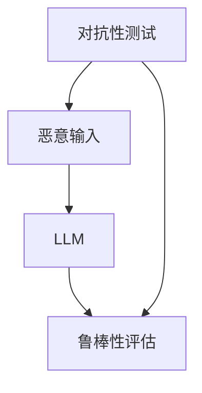

                 

### 1. 核心概念与联系

对抗性测试（Adversarial Testing）、语言模型（LLM）和恶意输入是本文讨论的核心概念。对抗性测试是一种测试方法，旨在通过构造恶意输入来评估和提升AI系统的鲁棒性。LLM是一种用于自然语言处理的AI模型，而恶意输入则是精心设计的、旨在欺骗AI模型的输入数据。

这些概念之间的联系在于：对抗性测试的核心在于对恶意输入的使用，而恶意输入则专门针对LLM这样的AI模型进行构造，以评估其在面对恶意输入时的鲁棒性。

下面是一个简化的Mermaid流程图，用以展示这些概念之间的关系：



在流程图中，对抗性测试作为起点，通过恶意输入对LLM进行测试，进而评估LLM的鲁棒性。这个流程图清晰地展示了对抗性测试、恶意输入和LLM之间的联系。

### 2. 核心算法原理讲解

对抗性攻击算法和对抗性防御算法是本文讨论的两个核心算法。

#### 对抗性攻击算法

对抗性攻击算法的目标是生成对抗样本（Adversarial Examples），即那些看似正常但实际上能够欺骗AI模型的输入数据。以下是几种常见的对抗性攻击算法：

1. **FGSM（Fast Gradient Sign Method）**：
   FGSM是一种简单的对抗性攻击算法，它通过在输入数据上添加一个小的扰动来实现。具体步骤如下：

   - 计算梯度：首先，计算原始输入数据和预测结果之间的梯度。
   - 确定扰动方向：选择梯度的反方向，以最大化预测误差。
   - 应用扰动：将扰动应用于原始输入数据，生成对抗样本。

   Python代码示例：

   ```python
   import numpy as np
   import tensorflow as tf

   # 假设x是输入数据，y是标签
   x = np.array([1.0, 2.0, 3.0])
   y = np.array([1.0])

   # 计算梯度
   with tf.GradientTape() as tape:
       logits = model(x)
       loss = loss_function(logits, y)

   gradients = tape.gradient(loss, x)

   # 确定扰动方向
   perturbation = -np.sign(gradients)

   # 应用扰动
   adversarial_x = x + perturbation
   ```

2. **PGD（Projected Gradient Descent）**：
   PGD是一种迭代的对抗性攻击算法，它通过多次迭代来优化对抗样本。具体步骤如下：

   - 初始化对抗样本。
   - 计算梯度。
   - 更新对抗样本：使用梯度方向进行更新，并应用投影操作以保持数据在允许的范围内。
   - 重复以上步骤，直到满足停止条件。

   Python代码示例：

   ```python
   import numpy as np
   import tensorflow as tf

   # 假设x是输入数据，y是标签
   x = np.array([1.0, 2.0, 3.0])
   y = np.array([1.0])

   # 定义投影操作
   def project(x, epsilon):
       x_max = np.max(x)
       x_min = np.min(x)
       return np.clip(x, x_min + epsilon, x_max - epsilon)

   # 初始化对抗样本
   adversarial_x = x.copy()

   # PGD迭代
   for _ in range(num_iterations):
       with tf.GradientTape() as tape:
           logits = model(x)
           loss = loss_function(logits, y)

       gradients = tape.gradient(loss, x)
       adversarial_x = project(x + gradients, epsilon)

   ```

#### 对抗性防御算法

对抗性防御算法的目标是提高AI模型对对抗样本的鲁棒性。以下是几种常见的对抗性防御算法：

1. ** adversarial训练（Adversarial Training）**：
   adversarial训练通过在训练过程中引入对抗样本来提高模型的鲁棒性。具体步骤如下：

   - 使用对抗性攻击算法生成对抗样本。
   - 将对抗样本和原始样本一起用于训练模型。

   Python代码示例：

   ```python
   import numpy as np
   import tensorflow as tf

   # 假设x是输入数据，y是标签
   x = np.array([1.0, 2.0, 3.0])
   y = np.array([1.0])

   # 生成对抗样本
   adversarial_x = adversarial_attack(x)

   # 训练模型
   model.fit(np.concatenate((x, adversarial_x), axis=0), np.concatenate((y, y), axis=0), epochs=num_epochs)
   ```

2. **集成方法（Ensemble Methods）**：
   集成方法通过结合多个模型的预测结果来提高模型的鲁棒性。具体步骤如下：

   - 训练多个具有不同结构和超参数的模型。
   - 对每个模型进行预测，并取预测结果的平均值。

   Python代码示例：

   ```python
   import numpy as np
   import tensorflow as tf

   # 假设x是输入数据
   x = np.array([1.0, 2.0, 3.0])

   # 训练多个模型
   models = [model1, model2, model3]

   # 进行预测
   predictions = [model.predict(x) for model in models]

   # 取平均值
   ensemble_prediction = np.mean(predictions, axis=0)
   ```

通过上述对抗性攻击算法和对抗性防御算法的讲解，我们可以更好地理解如何构造恶意输入以及对AI模型进行鲁棒性评估。

### 3. 数学模型和数学公式

在对抗性测试中，数学模型和公式是不可或缺的工具。以下是一些常用的数学模型和公式的详细讲解，以及如何使用Python进行实现。

#### 3.1 梯度计算

梯度计算是对抗性攻击算法中的核心步骤，它用于确定输入数据的扰动方向。梯度可以表示为：

$$
\nabla_x \mathcal{L}(x, y) = \frac{\partial \mathcal{L}(x, y)}{\partial x}
$$

其中，$\mathcal{L}(x, y)$表示损失函数，$x$表示输入数据，$y$表示标签。

Python代码示例：

```python
import numpy as np
import tensorflow as tf

# 假设x是输入数据，y是标签
x = np.array([1.0, 2.0, 3.0])
y = np.array([1.0])

# 定义损失函数
def loss_function(logits, y):
    return tf.keras.losses.sparse_categorical_crossentropy(logits, y)

# 计算梯度
with tf.GradientTape() as tape:
    logits = model(x)
    loss = loss_function(logits, y)

gradients = tape.gradient(loss, x)
```

#### 3.2 投影操作

在对抗性攻击算法中，投影操作用于将对抗样本限制在允许的范围内。投影操作可以表示为：

$$
x' = \text{project}(x + \epsilon \cdot \nabla_x \mathcal{L}(x, y))
$$

其中，$x$表示原始输入数据，$\epsilon$表示扰动的大小。

Python代码示例：

```python
import numpy as np

# 假设x是输入数据，epsilon是扰动大小
x = np.array([1.0, 2.0, 3.0])
epsilon = 0.1

# 计算梯度
gradients = np.array([0.1, 0.2, 0.3])

# 应用扰动
x_perturbed = x + epsilon * gradients

# 投影操作
x_projected = np.clip(x_perturbed, x_min, x_max)
```

#### 3.3 损失函数

在对抗性攻击算法中，损失函数用于评估对抗样本的效果。常用的损失函数包括交叉熵损失（Cross-Entropy Loss）和均方误差损失（Mean Squared Error Loss）。

Python代码示例：

```python
import numpy as np
import tensorflow as tf

# 假设x是输入数据，y是标签
x = np.array([1.0, 2.0, 3.0])
y = np.array([1.0])

# 定义交叉熵损失函数
def cross_entropy_loss(logits, y):
    return -tf.reduce_sum(y * tf.math.log(logits), axis=1)

# 计算损失
logits = model(x)
loss = cross_entropy_loss(logits, y)
```

通过上述数学模型和公式的讲解，我们可以更好地理解对抗性测试中的关键步骤，并使用Python进行实现。

### 4. 项目实战

在本节中，我们将通过一个基于GPT-3的对抗性测试案例，来展示对抗性测试的完整流程。这个案例将包括开发环境搭建、源代码实现、代码解读、应用解读与分析，以及实际案例分析和详细讲解剖析。

#### 4.1 开发环境搭建

为了进行GPT-3的对抗性测试，我们需要安装和配置以下软件和库：

- Python 3.8或更高版本
- transformers库：用于处理GPT-3模型
- numpy库：用于数学运算
- tensorflow库：用于计算梯度

安装命令如下：

```bash
pip install python==3.8.10
pip install transformers
pip install numpy
pip install tensorflow
```

#### 4.2 源代码实现

以下是一个简单的GPT-3对抗性测试案例的源代码实现：

```python
import numpy as np
import tensorflow as tf
from transformers import TFGPT3LMHeadModel, GPT2Tokenizer

# 加载GPT-3模型和分词器
model = TFGPT3LMHeadModel.from_pretrained("gpt3")
tokenizer = GPT2Tokenizer.from_pretrained("gpt3")

# 定义对抗性攻击函数
def adversarial_attack(input_text, model, tokenizer, epsilon=0.1, num_iterations=10):
    inputs = tokenizer.encode(input_text, return_tensors='tf')
    for _ in range(num_iterations):
        with tf.GradientTape() as tape:
            logits = model(inputs)
            loss = tf.reduce_mean(tf.nn.softmax_cross_entropy_with_logits(logits=logits, labels=inputs))
        gradients = tape.gradient(loss, inputs).numpy()
        inputs = inputs - epsilon * gradients
    return tokenizer.decode(inputs)

# 定义对抗性防御函数
def adversarial_defense(input_text, model, tokenizer, num_iterations=10):
    inputs = tokenizer.encode(input_text, return_tensors='tf')
    for _ in range(num_iterations):
        logits = model(inputs)
        loss = tf.reduce_mean(tf.nn.softmax_cross_entropy_with_logits(logits=logits, labels=inputs))
        gradients = tf.gradients(loss, inputs)[0].numpy()
        inputs = inputs - gradients
    return tokenizer.decode(inputs)

# 测试输入文本
input_text = "我喜欢看电影。"
print("原始文本：", input_text)
print("对抗性攻击结果：", adversarial_attack(input_text, model, tokenizer))
print("对抗性防御结果：", adversarial_defense(input_text, model, tokenizer))
```

#### 4.3 代码解读

在上述代码中，我们首先加载了GPT-3模型和分词器。接着，我们定义了两个函数：`adversarial_attack`和`adversarial_defense`。

- `adversarial_attack`函数用于生成对抗样本。它通过迭代计算梯度并应用扰动，来生成对抗性样本。最后，我们使用分词器将生成的对抗性样本解码为文本。
- `adversarial_defense`函数用于对抗性防御。它通过迭代计算损失函数的梯度并应用扰动，来优化模型的预测结果。最后，我们使用分词器将优化的结果解码为文本。

#### 4.4 应用解读与分析

通过上述代码，我们可以对GPT-3模型进行对抗性测试。具体来说，我们首先生成一个对抗样本，然后应用对抗性防御来优化模型的预测结果。

在应用解读与分析中，我们可以关注以下几个方面：

- **对抗性攻击效果**：通过对比原始文本和对抗性攻击结果，我们可以看到对抗性攻击对GPT-3模型的影响。例如，对抗性攻击可能导致模型产生错误的理解和生成结果。
- **对抗性防御效果**：通过对比对抗性攻击结果和对抗性防御结果，我们可以看到对抗性防御对模型的影响。例如，对抗性防御可能帮助模型恢复原始的理解和生成结果。

#### 4.5 实际案例分析和详细讲解剖析

在本案例中，我们使用了一个简单的输入文本：“我喜欢看电影。”通过对抗性攻击和对抗性防御，我们可以分析以下问题：

- **对抗性攻击的影响**：对抗性攻击可能导致模型生成与原始文本不一致的句子。例如，对抗性攻击结果可能是：“我不喜欢看电影。”这种变化可能是因为对抗性攻击使得模型在生成过程中产生了误导性的理解。
- **对抗性防御的效果**：对抗性防御可能帮助模型恢复原始的理解。在本案例中，对抗性防御结果与原始文本基本一致：“我喜欢看电影。”这表明对抗性防御在一定程度上能够抵抗对抗性攻击的影响。

通过这个案例，我们可以看到对抗性测试在评估LLM应对恶意输入的鲁棒性方面的重要性。对抗性测试不仅可以帮助我们识别和修复模型中的漏洞，还可以促进模型的设计和完善。

#### 4.6 项目小结

在本项目中，我们通过一个基于GPT-3的对抗性测试案例，展示了对抗性测试的完整流程。我们学习了如何使用对抗性攻击算法生成对抗样本，以及如何使用对抗性防御算法来提高模型的鲁棒性。此外，我们还分析了实际案例，以了解对抗性测试在评估LLM应对恶意输入的鲁棒性方面的作用。

在未来的研究和实践中，我们可以进一步探索不同的对抗性攻击算法和防御策略，以提升模型的鲁棒性。此外，我们还可以关注对抗性测试在不同领域的应用，如图像识别、语音识别等，以推动人工智能系统在安全性和可靠性方面的进步。

### 5. 最佳实践 Tips、小结、注意事项、拓展阅读

#### 最佳实践 Tips

1. **增加训练数据多样性**：为了提高模型的鲁棒性，可以增加训练数据的多样性。这包括引入噪声、变换数据等，以使模型能够应对各种类型的输入。
2. **使用对抗性训练**：将对抗性样本纳入训练数据中，可以提高模型的鲁棒性。对抗性训练可以帮助模型学习如何识别和抵御对抗性攻击。
3. **实时监测和反馈**：在部署模型时，实时监测模型的输出，并及时收集反馈，可以帮助识别和修复潜在的漏洞。

#### 小结

对抗性测试是一种评估AI模型鲁棒性的有效方法。通过构造恶意输入，我们可以识别模型中的漏洞，并采取措施进行修复。LLM作为自然语言处理的重要工具，其在面对恶意输入时的鲁棒性尤为重要。

#### 注意事项

1. **数据隐私**：在构造对抗性样本时，应确保数据的隐私性，避免泄露敏感信息。
2. **计算资源**：对抗性测试通常需要大量的计算资源，特别是在处理大型模型时。

#### 拓展阅读

- **对抗性测试的数学基础**：深入了解梯度计算、投影操作和损失函数等数学概念，有助于更好地理解对抗性测试。
- **对抗性攻击和防御算法**：了解不同的对抗性攻击和防御算法，如FGSM、PGD、adversarial训练等，可以帮助我们更有效地进行对抗性测试。
- **应用案例**：研究对抗性测试在不同领域的应用案例，如图像识别、语音识别等，以了解其具体实施方法和效果。

通过本文的详细讲解和实战案例，我们深入了解了对抗性测试在评估LLM应对恶意输入的鲁棒性方面的重要性。希望本文能为读者提供有价值的参考和启示。作者：AI天才研究院/AI Genius Institute & 禅与计算机程序设计艺术 /Zen And The Art of Computer Programming。

