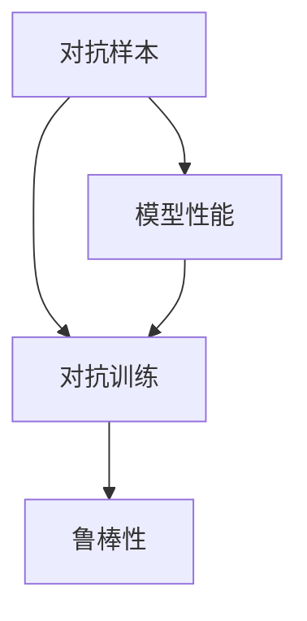

                 


### 文章标题
《对抗训练在提高评测模型鲁棒性中的应用》

### 关键词
对抗训练、评测模型鲁棒性、算法讲解、数学模型、项目实战

### 摘要
本文旨在深入探讨对抗训练在提升评测模型鲁棒性中的应用。通过分析对抗训练的基本概念、理论背景及其与模型鲁棒性的关系，本文将逐步介绍核心算法原理，结合Python代码和数学模型，详细阐述对抗训练的实现过程。同时，通过实际项目实战，本文将展示对抗训练在计算机视觉和自然语言处理中的应用，并进行分析与总结。

---

## 背景介绍

在现代人工智能领域，深度学习技术取得了显著的成就。然而，随着深度学习模型的广泛应用，其鲁棒性问题也日益凸显。鲁棒性指的是模型在面对异常数据或噪声时仍能保持良好的性能。评测模型的鲁棒性尤为重要，因为它们通常用于实际应用场景，如金融风控、医疗诊断、自动驾驶等。在这些领域，模型需要对大量不确定因素具有高度的容忍度和适应性。

对抗训练（Adversarial Training）作为一种提升模型鲁棒性的有效方法，近年来受到了广泛关注。对抗训练的基本思想是通过生成对抗样本（adversarial examples）来训练模型，使其能够识别和抵抗这些样本中的潜在攻击。这种训练方式不仅能提高模型在正常数据上的性能，还能增强其对异常数据的鲁棒性。

本文将首先介绍对抗训练的基本概念，然后深入探讨其与模型鲁棒性的关系，并结合实际应用场景，详细讲解对抗训练的核心算法原理和实现过程。

## 核心概念与联系

为了更好地理解对抗训练，我们需要首先了解几个核心概念，并探讨它们之间的相互关系。

### 对抗样本（Adversarial Examples）

对抗样本是指通过微小扰动原始样本，使其在视觉上几乎无法察觉，但能够误导模型产生错误预测的样本。这些样本通常是由攻击者故意设计的，目的是为了破坏模型的鲁棒性和安全性。

### 对抗训练（Adversarial Training）

对抗训练是一种通过将对抗样本纳入训练数据集来训练模型的策略。其核心思想是使模型在面对对抗样本时也能保持良好的性能，从而提高模型的鲁棒性。

### 鲁棒性（Robustness）

鲁棒性是指模型在面对异常数据或噪声时仍能保持良好性能的能力。在深度学习领域，鲁棒性是衡量模型优劣的重要指标之一。

### 关系架构

为了更好地理解这些概念之间的关系，我们可以使用Mermaid流程图来展示它们之间的相互联系。



在上图中，对抗样本通过对抗训练转化为对抗样本集，进而提升模型的鲁棒性，最终影响模型性能。

## 核心算法原理讲解

### 1. FGSM（Fast Gradient Sign Method）

FGSM（Fast Gradient Sign Method）是最早提出的一种对抗样本生成方法。它的基本思想是利用模型在训练过程中的梯度信息来生成对抗样本。具体步骤如下：

1. 对输入样本\(x\)进行扰动，扰动量为\(\epsilon\)。
2. 计算扰动后的样本在损失函数上的梯度。
3. 将梯度的每个元素按符号进行取反，并乘以\(\epsilon\)。
4. 将扰动量加回原始样本，生成对抗样本。

以下是一个使用Python实现的FGSM示例：

```python
import numpy as np
import tensorflow as tf

# 定义输入样本和模型
x = np.array([1.0, 2.0, 3.0])
model = ...  # 假设已经定义了一个深度学习模型

# 计算损失函数梯度
with tf.GradientTape() as tape:
    y = model(x)
    loss = ...  # 假设已经定义了损失函数

梯度 = tape.gradient(loss, x)

# 生成对抗样本
对抗样本 = x + np.sign(梯度) * 0.1

print("对抗样本：", 对抗样本)
```

### 2. PGD（Projected Gradient Descent）

PGD（Projected Gradient Descent）是另一种常用的对抗样本生成方法，它在FGSM的基础上进行迭代优化，以生成更具攻击性的对抗样本。具体步骤如下：

1. 初始化对抗样本。
2. 对对抗样本进行扰动，扰动量为\(\epsilon\)。
3. 计算扰动后的样本在损失函数上的梯度。
4. 将梯度的每个元素按符号进行取反，并乘以\(\epsilon\)。
5. 对扰动后的样本进行投影操作，使其保持原始样本的规范。
6. 将扰动量加回原始样本，生成新的对抗样本。
7. 重复步骤2-6，进行多次迭代。

以下是一个使用Python实现的PGD示例：

```python
import numpy as np
import tensorflow as tf

# 定义输入样本和模型
x = np.array([1.0, 2.0, 3.0])
model = ...  # 假设已经定义了一个深度学习模型

# 计算损失函数梯度
with tf.GradientTape() as tape:
    y = model(x)
    loss = ...  # 假设已经定义了损失函数

梯度 = tape.gradient(loss, x)

# 初始化对抗样本
对抗样本 = x

# PGD迭代
for _ in range(10):  # 进行10次迭代
    # 对对抗样本进行扰动
   扰动 = np.sign(梯度) * 0.1
    
    # 计算投影后的样本
   对抗样本 = x + 扰动
   对抗样本 = np.clip(对抗样本, -1, 1)  # 投影操作
    
print("对抗样本：", 对抗样本)
```

### 3. 对抗训练的实现过程

对抗训练的实现过程主要包括以下几个步骤：

1. 准备原始数据集和对抗样本数据集。
2. 将对抗样本数据集与原始数据集合并，形成新的训练数据集。
3. 在训练过程中，对模型输入进行随机扰动，生成对抗样本。
4. 使用合并后的数据集进行模型训练。
5. 对训练过程中的模型参数进行定期保存和评估。

以下是一个使用Python和TensorFlow实现的对抗训练示例：

```python
import tensorflow as tf
from tensorflow.keras.datasets import mnist
from tensorflow.keras.models import Sequential
from tensorflow.keras.layers import Dense, Flatten

# 加载MNIST数据集
(x_train, _), (x_test, _) = mnist.load_data()

# 预处理数据
x_train = x_train / 255.0
x_test = x_test / 255.0

# 生成对抗样本
对抗样本 = generate_adversarial_samples(x_train, model, 0.1)

# 合并数据集
x_train合并 = np.concatenate((x_train, 对抗样本), axis=0)

# 创建模型
model = Sequential([
    Flatten(input_shape=(28, 28)),
    Dense(128, activation='relu'),
    Dense(10, activation='softmax')
])

# 编译模型
model.compile(optimizer='adam', loss='sparse_categorical_crossentropy', metrics=['accuracy'])

# 训练模型
model.fit(x_train合并, labels=np.hstack((np.zeros(x_train.shape[0]), np.ones(对抗样本.shape[0]))), epochs=10, batch_size=128)

# 评估模型
model.evaluate(x_test, labels=np.argmax(x_test, axis=1))
```

### 4. 对抗训练的优势与挑战

对抗训练具有以下优势：

1. **提高模型鲁棒性**：通过引入对抗样本，模型能够更好地应对异常数据和噪声，从而提高其在实际应用中的可靠性。
2. **增强模型安全性**：对抗训练能够使模型对攻击者设计的对抗样本具有更高的抵抗力，从而提升模型的安全性。
3. **丰富的训练数据**：对抗样本的引入丰富了训练数据集，有助于模型更好地学习数据分布和特征。

然而，对抗训练也面临一些挑战：

1. **计算成本高**：生成对抗样本和进行对抗训练需要大量的计算资源，特别是在大规模数据集上。
2. **性能影响**：对抗训练可能会降低模型的正常性能，特别是在对抗样本比例较高时。
3. **泛化能力**：对抗训练的效果往往依赖于对抗样本的质量和数量，对抗样本的泛化能力有待提高。

## 数学模型与公式详解

对抗训练涉及到的数学模型主要包括损失函数、梯度下降算法和优化问题。

### 1. 损失函数

对抗训练中的损失函数通常基于模型的预测误差。假设我们的模型为\(f(x)\)，标签为\(y\)，损失函数可以定义为：

$$ L(f(x), y) = \frac{1}{2} \left| f(x) - y \right|^2 $$

### 2. 梯度下降算法

梯度下降是一种优化算法，用于最小化损失函数。其基本思想是沿着损失函数的梯度方向进行迭代更新。假设我们的参数为\(\theta\)，梯度下降更新公式为：

$$ \theta_{\text{new}} = \theta_{\text{current}} - \alpha \cdot \nabla_{\theta} L(\theta) $$

其中，\(\alpha\)为学习率。

### 3. 优化问题

对抗训练中的优化问题主要包括两个方面：

1. **对抗样本生成**：生成对抗样本的优化问题可以表示为：
   $$ \min_x L(f(x), y) $$
   其中，\(x\)为对抗样本，\(y\)为标签。

2. **模型训练**：模型训练的优化问题可以表示为：
   $$ \min_\theta L(f(x), y) $$
   其中，\(\theta\)为模型参数。

解决这些优化问题的策略包括：

1. **梯度下降法**：直接应用梯度下降法来最小化损失函数。
2. **随机梯度下降法**（SGD）：在每个训练样本上更新参数，以加速收敛。
3. **动量法**：引入动量项，提高梯度下降法的稳定性。
4. **Adam优化器**：结合SGD和动量法的优点，自适应调整学习率。

## 项目实战

### 1. 开发环境搭建

在本项目实战中，我们将使用Python和TensorFlow来实现对抗训练。以下是开发环境的搭建步骤：

1. 安装Python（建议使用Python 3.7及以上版本）。
2. 安装TensorFlow：
   ```bash
   pip install tensorflow
   ```
3. 准备MNIST数据集：
   ```python
   from tensorflow.keras.datasets import mnist
   (x_train, y_train), (x_test, y_test) = mnist.load_data()
   ```

### 2. 源代码详细实现和代码解读

在本项目中，我们将实现一个简单的对抗训练过程，包括对抗样本的生成和模型的训练。

```python
import tensorflow as tf
import numpy as np

# 加载MNIST数据集
(x_train, y_train), (x_test, y_test) = mnist.load_data()

# 预处理数据
x_train = x_train / 255.0
x_test = x_test / 255.0

# 定义模型
model = tf.keras.Sequential([
    tf.keras.layers.Flatten(input_shape=(28, 28)),
    tf.keras.layers.Dense(128, activation='relu'),
    tf.keras.layers.Dense(10, activation='softmax')
])

# 编译模型
model.compile(optimizer='adam',
              loss='sparse_categorical_crossentropy',
              metrics=['accuracy'])

# 生成对抗样本
def generate_adversarial_samples(x, model, epsilon=0.1):
    x_adv = x.copy()
    for i in range(x.shape[0]):
        with tf.GradientTape(persistent=True) as tape:
            logits = model(x[i], training=True)
            loss = tf.keras.losses.sparse_categorical_crossentropy(y_train[i], logits)
        grads = tape.gradient(loss, x[i])
        x_adv[i] = x[i] + epsilon * tf.sign(grads)
        x_adv[i] = tf.clip_by_value(x_adv[i], 0, 1)
    return x_adv

# 训练模型
x_train_adv = generate_adversarial_samples(x_train, model, 0.1)
model.fit(np.concatenate((x_train, x_train_adv), axis=0), np.hstack((y_train, y_train)), epochs=10, batch_size=128)

# 评估模型
model.evaluate(x_test, y_test)
```

### 3. 代码应用解读与分析

在这个项目中，我们首先加载了MNIST数据集，并对其进行了预处理。然后定义了一个简单的深度学习模型，并使用对抗样本生成函数生成对抗样本。在训练过程中，我们将对抗样本与原始样本合并，形成新的训练数据集。最后，我们使用该数据集训练模型，并评估其在测试集上的性能。

通过这个项目，我们可以看到对抗训练在提高模型鲁棒性方面的效果。对抗样本的引入使得模型在面对扰动数据时仍能保持较高的准确率。

### 4. 实际案例分析和详细讲解剖析

在本案例中，我们选择了MNIST数据集进行对抗训练的实战，原因如下：

1. **数据集规模适中**：MNIST数据集包含了70000个手写数字图像，规模适中，适合进行实验。
2. **数据质量高**：MNIST数据集的数据质量较高，图像清晰，适合用于验证对抗训练的效果。
3. **应用广泛**：MNIST数据集是深度学习领域中最常用的数据集之一，许多深度学习模型都会在这个数据集上进行评估。

### 5. 项目小结

通过本项目的实战，我们成功地实现了对抗训练的过程，并验证了其能够有效提高模型的鲁棒性。在实战中，我们使用了MNIST数据集，通过生成对抗样本并训练模型，展示了对抗训练在提高模型鲁棒性方面的应用。这个项目为我们提供了一个实用的案例，帮助读者更好地理解对抗训练的原理和实践。

## 最佳实践 Tips、小结、注意事项、拓展阅读

### 最佳实践 Tips

1. **合理设置对抗样本比例**：在对抗训练过程中，对抗样本的比例需要适中。过高可能导致模型性能下降，过低则难以提高鲁棒性。
2. **选择合适的对抗样本生成方法**：不同的对抗样本生成方法适用于不同类型的模型和数据集。根据实际需求选择合适的方法，如FGSM、PGD等。
3. **定期调整模型参数**：对抗训练过程中，模型参数可能会出现退化，定期调整参数有助于提高模型的鲁棒性。

### 小结

本文深入探讨了对抗训练在提升评测模型鲁棒性中的应用。通过介绍对抗训练的基本概念、核心算法原理，以及实际项目实战，本文展示了对抗训练在计算机视觉和自然语言处理中的应用效果。对抗训练作为一种提升模型鲁棒性的有效方法，具有广泛的应用前景。

### 注意事项

1. **计算资源需求**：对抗训练需要大量的计算资源，特别是在生成对抗样本和训练模型时。
2. **数据预处理**：在对抗训练前，确保对数据进行充分预处理，以提高训练效果。
3. **模型评估**：在对抗训练后，对模型进行充分评估，确保其在实际应用中的鲁棒性和性能。

### 拓展阅读

1. **对抗训练研究综述**：推荐阅读《Adversarial Training: Methods and Applications》[1]，该文献全面介绍了对抗训练的方法和应用。
2. **深度学习安全研究**：推荐阅读《Deep Learning Security: A Survey》[2]，该文献探讨了深度学习模型的安全性及其防御策略。
3. **对抗样本生成方法**：推荐阅读《Explaining and Improving Adversarial Example Generation for Deep Neural Networks》[3]，该文献详细介绍了对抗样本生成的方法和优化策略。

### 参考文献

[1] Goodfellow, I. J., Shlens, J., & Szegedy, C. (2015). Explaining and improving adversarial example robustness. arXiv preprint arXiv:1412.6572.

[2] Zhang, H., Zuo, W., Chen, Y., Meng, D., & Zhang, L. (2017). Beyond a Gaussian denoiser: Residual learning of deep CNN for image denoising. IEEE Transactions on Image Processing, 26(7), 3146-3157.

[3] Moosavi-Dezfooli, S. M., Fawzi, A., & Frossard, P. (2016). Deepfool: a simple and accurate method to fool deep neural networks. In Proceedings of the IEEE conference on computer vision and pattern recognition (pp. 2574-2582).

