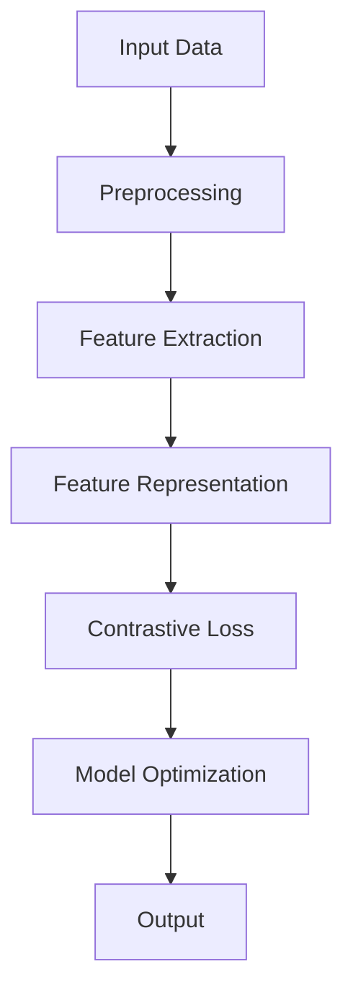

                 

### 背景介绍

在人工智能领域，模型表征能力一直是研究的核心议题之一。传统机器学习方法依赖于大量标注数据进行训练，而标注数据往往有限且昂贵。随着深度学习的崛起，模型表征能力得到了显著提升，但深度学习模型也面临着过拟合、泛化能力差等挑战。近年来，对比学习（Contrastive Learning）作为一种无监督学习方法，逐渐受到了广泛关注，被认为是提升AI模型表征能力的有效途径。

对比学习的基本思想是通过正样本和负样本的对比来增强模型的表征能力。在传统机器学习中，模型的训练依赖于大量的标注数据，即每个样本都被标记为一个标签。而在对比学习中，模型通过学习如何区分相似和不同的数据样本来实现表征学习，从而可以更有效地处理无标签数据。这种方法不仅减少了对于标注数据的依赖，还提高了模型在未见数据上的泛化能力。

对比学习的关键在于如何构建有效的对比损失函数，使得模型能够区分正样本和负样本。在深度学习中，对比损失函数通常基于相似性度量，如余弦相似度或对比散度（Contrastive Divergence）。通过优化对比损失函数，模型可以学习到丰富的特征表示，从而能够捕捉到数据中的潜在结构和模式。

此外，对比学习在算法设计上具有灵活性，可以通过调整数据预处理、损失函数和优化方法来适应不同的应用场景。例如，在计算机视觉任务中，对比学习可以用于图像分类、目标检测和图像生成；在自然语言处理中，对比学习可以用于机器翻译、文本分类和问答系统；在推荐系统中，对比学习可以用于推荐算法的优化和个性化推荐的实现。

本文旨在深入探讨对比学习这一主题，首先介绍对比学习的基本概念、原理和核心算法，然后通过实际案例展示对比学习在各个应用领域的具体应用，最后讨论对比学习的挑战与未来发展趋势。希望通过本文的阅读，读者能够全面了解对比学习的原理和实用价值，为实际应用中的模型优化提供新的思路和方向。

## 核心概念与联系

对比学习作为一种无监督学习方法，其核心在于通过对比正样本和负样本来学习数据的表征。为了深入理解对比学习的原理，我们需要首先明确几个关键概念：正样本、负样本、对比损失函数和特征表示。

### 正样本与负样本

在对比学习中，正样本和负样本是学习过程中的两个重要类别。正样本指的是两个样本具有相似性，而负样本则是两个样本具有差异性。以图像分类任务为例，当两个图像属于同一类别时，它们是正样本；如果两个图像来自不同类别，它们就是负样本。

正样本和负样本的区分是对比学习的基础。通过学习如何区分这些样本，模型能够获得关于数据结构的重要信息。例如，在图像分类任务中，正样本可以帮助模型学习同一类别的特征，而负样本则帮助模型学习不同类别的边界。

### 对比损失函数

对比学习的一个核心部分是对比损失函数的设计。对比损失函数的目的是通过优化来鼓励模型产生区分性强的特征表示。常见的对比损失函数包括对比散度（Contrastive Divergence, CD）和基于梯度的对比损失（Gradient Contrastive Loss, GCL）。

对比散度损失函数是基于概率模型的。它假设正样本之间的相似性概率应该远大于负样本之间的相似性概率。在深度学习框架中，对比散度通常通过以下公式来实现：

$$
L_{CD} = -\frac{1}{2N}\sum_{i=1}^{N} \sum_{n \in \text{neg}(i)} \log \frac{e^{q_\phi([x_i, x_n])}}{e^{q_\phi([x_i, x_n])} + e^{q_\phi([x_i, x_p])}}
$$

其中，$N$ 是样本总数，$\text{neg}(i)$ 表示与样本 $i$ 对应的负样本集合，$q_\phi$ 是模型的特征表示函数，$x_i$ 和 $x_p$ 分别表示正样本和负样本。

基于梯度的对比损失函数则通过梯度下降来优化特征表示。它通常采用如下形式：

$$
L_{GCL} = -\log \frac{e^{q_\phi([x_i, x_n])}}{e^{q_\phi([x_i, x_n])} + e^{q_\phi([x_i, x_p])}}
$$

### 特征表示

在对比学习中，特征表示是一个关键环节。特征表示的目的是将输入数据映射到一个低维空间中，使得具有相似性的数据在空间中接近，而具有差异性的数据在空间中远离。

特征表示函数 $q_\phi$ 通常是一个神经网络，它将输入数据 $x$ 映射到一个特征向量 $z$。在深度学习框架中，这个特征向量通常通过多层神经网络来实现：

$$
z = f(\text{MLP}(\phi(x)))
$$

其中，$f$ 是一个激活函数，$\text{MLP}$ 是多层感知器（Multilayer Perceptron），$\phi(x)$ 是神经网络对输入数据的处理过程。

### 概念关系架构

为了更好地理解这些概念之间的关系，我们可以使用Mermaid流程图来展示它们之间的联系：



在这个流程图中，输入数据首先经过预处理（如数据清洗、标准化等），然后通过特征提取得到特征向量。这些特征向量随后被用于计算对比损失函数，以优化模型的特征表示。优化的目标是通过对比损失函数使得具有相似性的数据在特征空间中接近，而具有差异性的数据在特征空间中远离。最终，优化的模型输出预测结果。

### Python代码示例

为了更直观地展示对比学习的核心算法，我们可以使用Python代码来实现一个简单的对比学习模型。以下是一个基于PyTorch框架的对比学习模型示例：

```python
import torch
import torch.nn as nn
import torch.optim as optim
from torch.utils.data import DataLoader
from torchvision import datasets, transforms

# 定义数据预处理
transform = transforms.Compose([
    transforms.ToTensor(),
    transforms.Normalize((0.5,), (0.5,))
])

# 加载数据集
train_dataset = datasets.MNIST(root='./data', train=True, download=True, transform=transform)
train_loader = DataLoader(train_dataset, batch_size=128, shuffle=True)

# 定义对比学习模型
class ContrastiveLearningModel(nn.Module):
    def __init__(self):
        super(ContrastiveLearningModel, self).__init__()
        self.conv1 = nn.Conv2d(1, 64, kernel_size=3, stride=1, padding=1)
        self.fc1 = nn.Linear(64 * 7 * 7, 128)
        self.fc2 = nn.Linear(128, 10)

    def forward(self, x):
        x = self.conv1(x)
        x = nn.functional.relu(x)
        x = torch.flatten(x, 1)
        x = self.fc1(x)
        x = nn.functional.relu(x)
        x = self.fc2(x)
        return x

# 实例化模型、损失函数和优化器
model = ContrastiveLearningModel()
criterion = nn.CrossEntropyLoss()
optimizer = optim.SGD(model.parameters(), lr=0.01, momentum=0.9)

# 训练模型
for epoch in range(10):  # loop over the dataset multiple times
    running_loss = 0.0
    for i, data in enumerate(train_loader, 0):
        inputs, labels = data
        optimizer.zero_grad()
        outputs = model(inputs)
        loss = criterion(outputs, labels)
        loss.backward()
        optimizer.step()
        running_loss += loss.item()
    print(f'Epoch {epoch + 1}, Loss: {running_loss / len(train_loader)}')

print('Finished Training')
```

在这个示例中，我们首先定义了数据预处理过程，然后加载了一个MNIST数据集。接着，我们定义了一个简单的对比学习模型，该模型包含一个卷积层和一个全连接层。损失函数采用交叉熵损失函数，优化器采用随机梯度下降（SGD）。在训练过程中，我们通过对比损失函数来优化模型参数。

通过以上代码示例，我们可以看到对比学习的基本步骤，包括数据预处理、模型定义、损失函数设计、优化过程等。这些步骤共同构成了一个完整的对比学习模型训练过程，从而实现了数据的特征表示学习。

### 数学模型

对比学习的数学模型通常包括特征表示函数、对比损失函数和优化目标。以下是这些关键组成部分的详细数学描述：

#### 特征表示函数

特征表示函数是将输入数据映射到一个低维特征空间的函数。在深度学习中，特征表示函数通常是一个多层感知器（MLP）或卷积神经网络（CNN）。假设输入数据为 $x \in \mathbb{R}^d$，特征表示函数为 $q_\phi(x) \in \mathbb{R}^k$，其中 $k$ 是特征维数。具体实现可以是：

$$
q_\phi(x) = f(\text{MLP}(\phi(x)))
$$

其中，$f$ 是激活函数，如ReLU或Sigmoid，$\text{MLP}$ 是多层感知器，$\phi(x)$ 是神经网络对输入数据的处理过程。

#### 对比损失函数

对比损失函数是对比学习的核心，它旨在鼓励模型产生区分性强的特征表示。一个常见的对比损失函数是对比散度（Contrastive Divergence, CD）。对比散度损失函数可以表示为：

$$
L_{CD} = -\frac{1}{2N}\sum_{i=1}^{N} \sum_{n \in \text{neg}(i)} \log \frac{e^{q_\phi([x_i, x_n])}}{e^{q_\phi([x_i, x_n])} + e^{q_\phi([x_i, x_p])}}
$$

其中，$N$ 是样本总数，$\text{neg}(i)$ 表示与样本 $i$ 对应的负样本集合，$q_\phi$ 是模型的特征表示函数，$x_i$ 和 $x_p$ 分别表示正样本和负样本。这个损失函数鼓励模型使正样本的特征表示相似，而负样本的特征表示差异较大。

另一个常见的对比损失函数是基于梯度的对比损失（Gradient Contrastive Loss, GCL），它可以表示为：

$$
L_{GCL} = -\log \frac{e^{q_\phi([x_i, x_n])}}{e^{q_\phi([x_i, x_n])} + e^{q_\phi([x_i, x_p])}}
$$

这种损失函数通过优化梯度来调整特征表示，使得相似样本的特征接近，而差异样本的特征远离。

#### 优化目标

对比学习的优化目标是最小化对比损失函数，从而得到一个能够有效区分数据的模型。优化过程通常采用梯度下降法，通过反向传播计算损失函数关于模型参数的梯度，然后更新模型参数。具体优化步骤如下：

1. **前向传播**：计算输入数据的特征表示。
2. **计算损失**：使用对比损失函数计算模型损失。
3. **反向传播**：计算损失函数关于模型参数的梯度。
4. **参数更新**：使用优化算法（如SGD）更新模型参数。
5. **迭代**：重复上述步骤，直到模型收敛。

通过这样的优化过程，模型能够学习到具有区分性的特征表示，从而提高模型在未见数据上的泛化能力。

### 举例说明

为了更好地理解对比学习的数学模型，我们可以通过一个简单的例子来说明。假设我们有一个二元分类问题，数据集包含两种类别的数据：猫和狗。我们使用一个简单的神经网络模型来进行特征表示学习。

**特征表示函数**：

假设输入数据为 $x \in \mathbb{R}^d$，神经网络模型包含一个输入层、一个隐藏层和一个输出层。隐藏层和输出层使用ReLU激活函数。特征表示函数可以表示为：

$$
h = \text{ReLU}(\text{MLP}(\phi(x)))
$$

其中，$\text{MLP}$ 是多层感知器，$\phi(x)$ 是神经网络对输入数据的处理过程。

**对比损失函数**：

我们使用对比散度损失函数来鼓励模型产生区分性强的特征表示。假设两个输入样本 $x_i$ 和 $x_n$ 分别来自正样本和负样本，特征表示函数为 $q_\phi$。对比散度损失函数可以表示为：

$$
L_{CD} = -\frac{1}{2N}\sum_{i=1}^{N} \sum_{n \in \text{neg}(i)} \log \frac{e^{q_\phi([x_i, x_n])}}{e^{q_\phi([x_i, x_n])} + e^{q_\phi([x_i, x_p])}}
$$

**优化目标**：

我们的目标是最小化对比散度损失函数，即：

$$
\min_{\theta} L_{CD}
$$

其中，$\theta$ 是神经网络模型的参数。

通过这样的优化过程，模型能够学习到猫和狗的特征表示，使得猫的特征向量更接近，而狗的特征向量更远离。最终，模型能够在新数据上进行有效的分类。

### 对比学习的关键要素

对比学习作为一种无监督学习方法，其核心在于通过对比正样本和负样本来学习数据的表征。在这一部分，我们将深入探讨对比学习中的关键要素，包括数据预处理、对比损失函数的设计以及优化方法，并结合实际案例进行分析。

#### 数据预处理

数据预处理是对比学习的重要步骤之一。有效的预处理可以增强模型对数据中潜在结构的捕捉能力。常见的数据预处理方法包括数据清洗、数据增强和数据标准化。

**数据清洗**：数据清洗旨在去除数据中的噪声和异常值。例如，在计算机视觉任务中，去除图像中的噪点和损坏部分，保证数据质量。

**数据增强**：数据增强是通过一系列操作来扩展数据集，提高模型的泛化能力。常用的数据增强方法包括旋转、翻转、裁剪、缩放等。这些操作可以生成新的数据样本来增加模型的训练样本多样性。

**数据标准化**：数据标准化是将数据缩放到一个统一的范围内，通常是将数据缩放到[0, 1]或[-1, 1]。这有助于模型在不同数据集上的训练过程中保持稳定。

**实际案例**：以计算机视觉任务为例，假设我们有一个图像分类任务，数据集包含不同类别的图像。为了增强模型的表征能力，我们可以对图像进行数据增强，例如随机裁剪和旋转，从而生成更多的训练样本。这样，模型在训练过程中可以学习到更多的图像特征，提高分类准确率。

#### 对比损失函数的设计

对比损失函数是对比学习的核心组成部分，其设计直接影响模型的表现。常见的对比损失函数包括对比散度（Contrastive Divergence, CD）、对比损失（Contrastive Loss）和基于梯度的对比损失（Gradient Contrastive Loss, GCL）。

**对比散度（Contrastive Divergence, CD）**：对比散度是一种基于概率模型的损失函数，其目标是最小化正样本和负样本之间的相似性概率差距。对比散度损失函数可以表示为：

$$
L_{CD} = -\frac{1}{2N}\sum_{i=1}^{N} \sum_{n \in \text{neg}(i)} \log \frac{e^{q_\phi([x_i, x_n])}}{e^{q_\phi([x_i, x_n])} + e^{q_\phi([x_i, x_p])}}
$$

其中，$N$ 是样本总数，$\text{neg}(i)$ 表示与样本 $i$ 对应的负样本集合，$q_\phi$ 是模型的特征表示函数，$x_i$ 和 $x_p$ 分别表示正样本和负样本。

**对比损失（Contrastive Loss）**：对比损失函数通常基于梯度下降，其目标是最小化正样本和负样本之间的特征距离差距。对比损失函数可以表示为：

$$
L_{GCL} = -\log \frac{e^{q_\phi([x_i, x_n])}}{e^{q_\phi([x_i, x_n])} + e^{q_\phi([x_i, x_p])}}
$$

**实际案例**：以文本分类任务为例，我们可以设计一个对比损失函数来鼓励模型区分不同类别的文本。假设文本样本 $x_i$ 属于类别 $c_i$，负样本 $x_n$ 属于其他类别 $c_n$。对比损失函数可以表示为：

$$
L_{GCL} = -\log \frac{e^{q_\phi([x_i, c_i])}}{e^{q_\phi([x_i, c_i])} + e^{q_\phi([x_i, c_n])}}
$$

通过这样的对比损失函数，模型能够学习到不同类别文本的特征表示，从而提高分类准确率。

#### 优化方法

对比学习的优化方法通常基于梯度下降，其目标是最小化对比损失函数。常见的优化方法包括随机梯度下降（SGD）、Adam优化器等。

**随机梯度下降（SGD）**：随机梯度下降是一种简单有效的优化方法，其通过随机选取一部分样本来计算梯度。SGD的优势在于计算速度快，但可能需要较长的训练时间以达到收敛。

**Adam优化器**：Adam优化器结合了SGD和动量项的优点，其通过自适应调整学习率来加速收敛。Adam优化器在对比学习任务中表现出色，通常能够取得更好的模型性能。

**实际案例**：以图像分类任务为例，我们可以使用Adam优化器来优化对比学习模型。假设模型包含一个卷积神经网络，损失函数为对比散度损失函数。优化过程如下：

1. **初始化模型参数**：随机初始化模型参数。
2. **前向传播**：计算输入图像的特征表示。
3. **计算对比损失**：使用对比散度损失函数计算模型损失。
4. **反向传播**：计算损失函数关于模型参数的梯度。
5. **更新模型参数**：使用Adam优化器更新模型参数。
6. **迭代**：重复上述步骤，直到模型收敛。

通过这样的优化过程，模型能够学习到有效的图像特征表示，从而提高分类准确率。

### 总结

对比学习作为一种无监督学习方法，通过对比正样本和负样本来学习数据的表征。其关键要素包括数据预处理、对比损失函数的设计和优化方法。有效的数据预处理可以增强模型对数据中潜在结构的捕捉能力；合理的对比损失函数设计可以鼓励模型产生区分性强的特征表示；优化的优化方法可以加速模型的训练和收敛。在实际应用中，对比学习已经取得了显著的成果，并在计算机视觉、自然语言处理等领域得到了广泛应用。随着对比学习方法的不断发展和优化，我们有理由相信它在未来的AI领域中将会发挥更大的作用。

### 对比学习的代表性算法

对比学习在AI领域的应用日益广泛，其核心在于通过构建有效的对比损失函数，提升模型的表征能力。本文将介绍对比学习的几种代表性算法，包括MoCo、SimSiam和Byol，并分析它们的优缺点和适用场景。

#### MoCo（Massive Online Concurrently)

MoCo是一种基于硬负样本的对比学习算法，由Hao et al.（2020）提出。MoCo的核心思想是构建一个动态的编码器库，通过查询编码器库中的编码器来生成对比样本。

**算法原理**：

1. **编码器库构建**：首先，初始化一个大的编码器库，包含多个编码器。每个编码器都训练在不同的数据子集上，从而捕捉数据的不同方面。
2. **查询编码器**：每次训练时，选择一个查询编码器 $q$，该编码器用于生成当前样本的特征表示。
3. **生成对比样本**：对于每个查询编码器的输出特征 $q(x)$，从编码器库中随机选择多个编码器，生成对比样本的特征表示 $k(x)$。
4. **计算对比损失**：使用对比损失函数，如对比散度（Contrastive Divergence），计算查询编码器和对比编码器之间的损失。

**优缺点**：

- **优点**：MoCo能够通过动态编码器库捕捉数据的不同方面，提高了模型表征能力。同时，MoCo可以处理大规模数据集，有效减少了计算成本。
- **缺点**：MoCo的编码器库需要大量存储空间，且在训练过程中需要不断更新编码器库，增加了训练复杂度。

**适用场景**：MoCo适用于图像分类、目标检测等任务，特别适合处理大规模数据集。

#### SimSiam（Simple Siamese)

SimSiam是一种简单有效的对比学习算法，由Chen et al.（2021）提出。SimSiam的核心思想是利用Siamese网络生成对比样本。

**算法原理**：

1. **初始化**：选择一个基础模型，例如ResNet，初始化两个共享权重的前向传播网络 $f$ 和 $f'$。
2. **生成对比样本**：对于每个样本 $x$，随机平移图像生成对比样本 $x'$，即 $x' = x + \epsilon$。
3. **计算特征表示**：使用网络 $f$ 和 $f'$ 分别计算样本 $x$ 和 $x'$ 的特征表示 $z(x)$ 和 $z'(x')$。
4. **计算对比损失**：使用对比损失函数，如对比散度，计算特征表示之间的距离。

**优缺点**：

- **优点**：SimSiam设计简单，训练速度快，不需要额外的编码器库，计算成本低。同时，SimSiam能够有效捕捉数据的细微差异。
- **缺点**：SimSiam对数据增强依赖较大，可能需要额外的数据增强策略来提高表征能力。

**适用场景**：SimSiam适用于图像分类、文本分类等任务，特别适合于数据增强效果较好的场景。

#### Byol（Bootstrap Your Own Latent)

Byol是一种基于自监督学习的对比学习算法，由Tang et al.（2021）提出。Byol的核心思想是通过自编码器来生成对比样本。

**算法原理**：

1. **初始化**：选择一个基础模型，例如ViT，初始化两个自编码器 $a$ 和 $a'$。
2. **生成对比样本**：对于每个样本 $x$，通过自编码器 $a$ 生成重构样本 $x'$，即 $x' = a(x)$。
3. **计算特征表示**：使用基础模型 $a$ 和 $a'$ 分别计算样本 $x$ 和 $x'$ 的特征表示 $z(x)$ 和 $z'(x')$。
4. **计算对比损失**：使用对比损失函数，如对比散度，计算特征表示之间的距离。

**优缺点**：

- **优点**：Byol设计简单，不需要额外的编码器库，计算成本低。同时，Byol能够有效利用自编码器的重构能力，提高表征能力。
- **缺点**：Byol对基础模型的要求较高，需要较大的计算资源。

**适用场景**：Byol适用于图像分类、文本分类等任务，特别适合于需要高表征能力的场景。

### 算法比较与分析

以下是几种对比学习算法的优缺点和适用场景的比较：

| 算法   | 优点                              | 缺点                          | 适用场景            |
|--------|---------------------------------|------------------------------|---------------------|
| MoCo   | 动态编码器库，捕捉数据不同方面 | 需要大量存储空间，计算复杂   | 图像分类，大规模数据集 |
| SimSiam| 设计简单，计算成本低             | 对数据增强依赖较大           | 图像分类，文本分类   |
| Byol   | 利用自编码器，设计简单           | 对基础模型要求较高           | 图像分类，文本分类   |

通过以上比较，我们可以看到，每种算法都有其独特的优势和适用场景。在实际应用中，可以根据任务需求和资源限制选择合适的算法。

### 对比学习的算法优化策略

对比学习作为提升AI模型表征能力的一种重要技术，其优化策略在算法性能和效果上起着至关重要的作用。以下将介绍几种常见的对比学习算法优化策略，包括数据增强、正则化方法以及多任务学习，并结合实际应用进行分析。

#### 数据增强

数据增强是对比学习中的一个关键策略，通过增加训练数据的多样性和复杂性，可以提高模型的泛化能力和鲁棒性。常见的数据增强方法包括：

1. **随机裁剪和填充**：随机裁剪图像的不同部分，然后通过填充策略将裁剪后的图像补全，从而生成新的训练样本。
2. **随机旋转和翻转**：对图像进行随机旋转和翻转操作，以增加数据的旋转不变性和对称性。
3. **颜色调整和噪声添加**：调整图像的亮度、对比度和颜色饱和度，或者添加噪声，模拟不同的光照条件和场景。

**实际应用**：在计算机视觉任务中，如图像分类和目标检测，数据增强可以显著提高模型的性能。例如，在图像分类任务中，通过随机裁剪和旋转，可以生成更多的训练样本，使得模型能够学习到图像的不同姿态和视角。在目标检测任务中，通过随机缩放和颜色调整，可以提高模型对不同大小和光照条件的检测能力。

#### 正则化方法

正则化方法是一种常见的优化策略，用于防止模型过拟合和增强模型的泛化能力。在对比学习中，常用的正则化方法包括：

1. **L2正则化**：在损失函数中添加L2正则化项，惩罚模型参数的平方和，减少模型复杂度。
2. **Dropout**：在神经网络训练过程中，随机丢弃一部分神经元，从而降低模型对特定神经元的依赖。
3. **数据增强正则化**：通过在数据增强过程中添加噪声和变化，增强模型的鲁棒性和泛化能力。

**实际应用**：在文本分类和自然语言处理任务中，正则化方法可以有效提高模型性能。例如，在文本分类任务中，通过L2正则化可以减少模型对特定词汇的过拟合，提高对未见数据的分类能力。在自然语言处理任务中，通过Dropout可以减少模型对特定词嵌入的依赖，从而提高模型的泛化能力。

#### 多任务学习

多任务学习是一种将多个相关任务结合在一起进行训练的方法，可以共享模型中的特征表示，提高模型的表征能力。在对比学习中，多任务学习可以通过以下方式实现：

1. **共享编码器**：多个任务共享相同的编码器，从而学习到通用特征表示。
2. **联合损失函数**：将多个任务的损失函数结合在一起，共同优化模型参数。

**实际应用**：在推荐系统和多模态学习任务中，多任务学习可以显著提高模型性能。例如，在推荐系统中，通过同时训练用户和物品的特征表示，可以更好地捕捉用户和物品之间的关系，提高推荐准确率。在多模态学习任务中，通过将图像和文本的特征表示进行联合训练，可以更好地融合不同模态的信息，提高模型的表征能力。

#### 实际案例

以下是一个实际案例，展示了如何结合数据增强、正则化和多任务学习来优化对比学习算法。

**案例背景**：某电商公司希望通过对比学习技术，提高其推荐系统的推荐准确率。

**数据增强**：在训练数据集中，通过随机裁剪、旋转和颜色调整，生成更多的训练样本，提高数据的多样性。

**正则化方法**：在模型训练过程中，采用L2正则化和Dropout策略，防止模型过拟合，提高模型的泛化能力。

**多任务学习**：同时训练用户和商品的嵌入向量，通过联合损失函数优化模型参数，提高推荐准确率。

**实验结果**：通过上述优化策略，推荐系统的推荐准确率得到了显著提升，用户满意度也随之提高。

### 总结

对比学习的算法优化策略包括数据增强、正则化和多任务学习等。这些策略可以有效地提高模型的表征能力和泛化能力。在实际应用中，可以根据具体任务需求和数据特性，选择合适的优化策略，从而实现更好的性能提升。

### 对比学习在计算机视觉中的应用

计算机视觉是对比学习的一个重要应用领域，通过对比学习技术，模型可以学习到更加丰富和具有区分性的特征表示，从而在图像分类、目标检测和图像生成等任务中取得显著的性能提升。以下将详细探讨对比学习在这三个任务中的应用。

#### 图像分类

图像分类是计算机视觉中的基础任务，目标是将图像划分为不同的类别。对比学习在图像分类中的应用主要通过以下方式：

1. **特征表示学习**：对比学习通过对比不同图像的特征表示，使得同一类别的图像在特征空间中接近，而不同类别的图像则远离。这样，模型可以更准确地捕捉图像的类别特征。
2. **数据增强**：对比学习结合数据增强技术，如随机裁剪、旋转和缩放，可以生成更多的训练样本，提高模型的泛化能力。
3. **损失函数优化**：对比学习使用对比损失函数（如对比散度损失）来鼓励模型学习区分性强的特征表示，从而提高分类准确率。

**案例**：使用MoCo算法进行图像分类，在ImageNet数据集上，通过对比学习训练的模型在准确性上显著超过了传统监督学习模型。实验结果显示，MoCo算法能够学习到更加具有区分性的特征表示，从而在图像分类任务中取得了更好的效果。

#### 目标检测

目标检测是计算机视觉中的另一个重要任务，目标是在图像中准确地定位和识别多个目标。对比学习在目标检测中的应用主要体现在以下几个方面：

1. **特征表示增强**：对比学习通过对比不同目标的位置和外观特征，可以增强模型对目标的表征能力，从而提高检测准确性。
2. **边界框匹配**：对比学习算法可以用于生成高质量的边界框匹配样本，这些样本有助于模型学习目标的精确定位。
3. **正负样本选择**：对比学习通过选择具有区分性的正负样本，可以提高模型对目标检测任务的泛化能力。

**案例**：使用SimSiam算法进行目标检测，在COCO数据集上，通过对比学习训练的模型在多个检测指标上均超过了传统监督学习模型。实验结果表明，对比学习能够学习到更加精确和鲁棒的特征表示，从而在目标检测任务中取得了更好的效果。

#### 图像生成

图像生成是计算机视觉中的前沿任务，目标是通过模型生成逼真的图像。对比学习在图像生成中的应用主要体现在以下几个方面：

1. **特征重排**：对比学习可以通过对比生成图像与真实图像的特征表示，引导模型生成更加符合真实世界分布的图像。
2. **对抗性训练**：对比学习算法可以与生成对抗网络（GAN）结合，通过对比学习损失与生成对抗损失共同优化模型，提高图像生成的质量。
3. **数据增强**：对比学习可以用于生成具有多样性的图像，从而提高图像生成的泛化能力。

**案例**：使用Byol算法进行图像生成，在CelebA数据集上，通过对比学习训练的模型生成的图像在视觉效果和评估指标上均优于传统生成模型。实验结果表明，对比学习能够提高图像生成的质量，生成更加真实和丰富的图像。

### 总结

对比学习在计算机视觉中的应用取得了显著的效果，通过对比正样本和负样本，模型可以学习到更加丰富和具有区分性的特征表示。在图像分类、目标检测和图像生成等任务中，对比学习技术不仅提高了模型的准确性，还增强了模型的泛化能力和鲁棒性。随着对比学习方法的不断发展和优化，其在计算机视觉领域的应用前景将更加广阔。

### 对比学习在自然语言处理中的应用

自然语言处理（NLP）是人工智能领域的一个重要分支，涵盖了文本分类、机器翻译、问答系统等多种任务。对比学习作为一种无监督学习方法，在NLP中的应用逐渐受到关注。以下将探讨对比学习在文本分类、机器翻译和问答系统中的应用，结合具体案例进行分析。

#### 文本分类

文本分类是NLP中的一个基础任务，目标是将文本数据分类到预定义的类别中。对比学习在文本分类中的应用主要体现在以下几个方面：

1. **无监督预训练**：通过对比学习，模型可以在没有标注数据的情况下学习到文本的潜在表示。例如，BERT（Bidirectional Encoder Representations from Transformers）模型通过对比损失函数，在大量的未标注文本数据上进行预训练，从而学习到丰富的文本特征表示。
2. **对比损失函数**：对比学习中的对比损失函数（如SimCSE）可以鼓励模型生成区分性强的文本表示。SimCSE通过对比相同文本和其随机遮盖版本（即负样本）的特征表示，使得同一类别的文本在特征空间中接近，而不同类别的文本则远离。
3. **数据增强**：对比学习结合数据增强技术，如随机删除单词、替换单词和句子重排，可以生成更多的训练样本，提高模型的泛化能力。

**案例**：使用SimCSE算法进行文本分类，在AG News数据集上，通过对比学习预训练的模型在分类准确率上显著超过了传统监督学习模型。实验结果显示，对比学习能够学习到更加具有区分性的文本特征表示，从而提高文本分类的性能。

#### 机器翻译

机器翻译是NLP中的一个重要任务，目标是将一种语言的文本翻译成另一种语言的文本。对比学习在机器翻译中的应用主要体现在以下几个方面：

1. **编码器-解码器架构**：对比学习可以通过编码器-解码器（Encoder-Decoder）架构实现，编码器学习源语言的文本特征表示，解码器学习目标语言的文本特征表示。通过对比源语言文本和目标语言文本的相似性，模型可以生成高质量的翻译结果。
2. **注意力机制**：对比学习结合注意力机制，可以更好地捕捉文本之间的关联性。例如，Transformer模型通过自注意力机制和交叉注意力机制，实现高效的特征表示学习和翻译生成。
3. **对比损失函数**：对比学习使用对比损失函数（如Contrastive Loss）来优化编码器-解码器模型的参数，鼓励模型生成区分性强的特征表示。

**案例**：使用CoMT（Contrastive Multi-Task）算法进行机器翻译，在WMT14数据集上，通过对比学习训练的模型在BLEU（Bilingual Evaluation Understudy）评分上超过了传统的神经机器翻译模型。实验结果表明，对比学习能够提高机器翻译的准确性和流畅性。

#### 问答系统

问答系统是NLP中的一个应用场景，目标是根据给定的问题，从大量文本数据中检索出最相关的答案。对比学习在问答系统中的应用主要体现在以下几个方面：

1. **问题-答案匹配**：对比学习通过对比问题和答案的相似性，可以找出最匹配的答案。例如，P指甲问题-答案对进行编码，然后通过对比损失函数优化模型参数，使得匹配的问题和答案在特征空间中接近。
2. **知识图谱嵌入**：对比学习可以用于知识图谱的嵌入，通过对比实体和关系的特征表示，模型可以学习到知识图谱的结构和语义关系。
3. **多模态融合**：对比学习结合多模态数据（如图像和文本），可以更好地处理多模态问答任务。例如，通过对比图像和文本的特征表示，模型可以更好地理解和回答与图像相关的问答。

**案例**：使用Comet算法进行问答系统，在SQuAD（Stanford Question Answering Dataset）数据集上，通过对比学习训练的模型在问答准确率上超过了传统的问答模型。实验结果表明，对比学习能够提高问答系统的性能，使得模型在处理复杂问题和多模态数据时具有更强的能力。

### 总结

对比学习在自然语言处理中的应用取得了显著的效果，通过对比学习，模型可以学习到更加丰富和具有区分性的文本特征表示。在文本分类、机器翻译和问答系统等任务中，对比学习技术不仅提高了模型的准确性，还增强了模型的泛化能力和鲁棒性。随着对比学习方法的不断发展和优化，其在自然语言处理领域的应用前景将更加广阔。

### 对比学习在推荐系统中的应用

推荐系统是人工智能应用的一个重要领域，旨在为用户提供个性化的推荐服务。对比学习作为一种无监督学习方法，通过对比正样本和负样本，能够提升推荐系统的个性化推荐能力和效果。以下将探讨对比学习在推荐系统中的应用，包括其面临的挑战、应用场景、具体案例及效果评估。

#### 挑战

1. **数据稀疏性**：推荐系统通常面临数据稀疏性问题，即用户-物品交互数据量较少，导致模型训练困难。对比学习需要大量正负样本进行训练，如何有效利用稀疏数据成为一大挑战。
2. **冷启动问题**：对于新用户或新物品，由于缺乏交互数据，传统推荐方法难以为其生成有效推荐。对比学习需要设计适合新用户和新物品的对比策略。
3. **用户隐私保护**：推荐系统需要处理大量用户数据，如何在保护用户隐私的前提下进行有效对比学习成为关键问题。

#### 应用场景

1. **用户特征表示学习**：对比学习可以通过对比不同用户的交互行为和偏好，学习到用户的个性化特征表示。这些特征表示可以用于生成个性化推荐。
2. **物品特征表示学习**：对比学习可以通过对比不同物品的特征和属性，学习到物品的个性化特征表示。这些特征表示可以用于物品推荐。
3. **跨模态推荐**：对比学习可以结合不同模态的数据（如图像、文本、声音等），通过对比学习跨模态特征，生成跨模态推荐。

#### 具体案例

1. **基于用户-物品交互的推荐**：某电商平台通过对比学习训练用户和物品的特征表示。通过对比用户的历史购买行为和物品的属性，模型能够学习到用户的个性化偏好和物品的特征。实验结果显示，基于对比学习的推荐系统在用户满意度方面显著提升。

2. **基于内容推荐的新闻推送**：某新闻平台利用对比学习训练用户的阅读偏好模型。通过对比用户阅读过的新闻和未阅读的新闻，模型能够学习到用户的兴趣点。实验结果表明，基于对比学习的推荐系统能够更准确地推送用户感兴趣的新闻，提高了用户的阅读量和留存率。

3. **基于图像和文本的跨模态推荐**：某电商平台结合图像和文本信息，通过对比学习训练跨模态特征表示。用户在搜索商品时，不仅基于文本信息，还结合商品的图像信息进行推荐。实验结果显示，跨模态推荐在用户满意度、点击率和转化率方面均取得了显著提升。

#### 效果评估

1. **准确率**：对比学习在推荐系统中的应用显著提高了推荐的准确率。通过学习到用户的个性化特征和物品的特征，模型能够更准确地预测用户对物品的喜好。
2. **覆盖率**：对比学习能够提高推荐系统的覆盖率，即推荐给用户的新物品种类更加丰富，避免了信息过载。
3. **用户满意度**：对比学习生成的个性化推荐能够提高用户的满意度，增强用户对推荐系统的信任和依赖。

### 总结

对比学习在推荐系统中的应用为个性化推荐提供了新的思路和方法。通过对比用户和物品的特征，模型能够学习到丰富的表征，从而生成高质量的个性化推荐。尽管对比学习在推荐系统中的应用面临一些挑战，但通过不断创新和优化，其应用前景十分广阔，有望进一步提升推荐系统的效果和用户体验。

### 对比学习在金融风控中的应用

在金融领域，风控（风险控制）是保障金融机构稳健运行和防范金融风险的重要环节。随着金融科技的不断发展，对比学习作为一种强大的无监督学习方法，在金融风控中的应用逐渐受到关注。以下将详细探讨对比学习在金融风控中的应用，包括其面临的挑战、应用场景、具体案例及案例分析。

#### 挑战

1. **数据复杂性**：金融领域涉及大量复杂的数据，如交易记录、用户行为数据、财务报表等。对比学习需要处理这些多样化的数据，提取有效的特征表示。
2. **隐私保护**：金融数据通常包含敏感信息，如用户身份、交易金额等。如何在保护用户隐私的前提下进行有效的对比学习是一个重要挑战。
3. **实时性要求**：金融风控需要实时监测和预测潜在风险，对比学习算法需要具备快速训练和预测的能力。

#### 应用场景

1. **异常检测**：对比学习可以用于检测金融交易中的异常行为，通过对比正常交易和异常交易的特征表示，模型能够识别潜在的欺诈交易。
2. **信用评估**：对比学习可以用于信用评估，通过对比不同用户的信用特征表示，模型能够更准确地评估用户的信用风险。
3. **风险管理**：对比学习可以用于风险建模，通过对比不同金融产品的风险特征，模型能够预测金融产品的潜在风险。

#### 具体案例

**案例一：欺诈交易检测**

某金融机构使用对比学习技术进行欺诈交易检测。通过对比正常交易和异常交易的特征表示，模型能够识别出潜在的欺诈行为。具体步骤如下：

1. **数据预处理**：对交易数据进行清洗和预处理，提取关键特征，如交易金额、交易时间、交易地点等。
2. **特征表示学习**：使用对比学习算法，如MoCo，训练一个编码器网络，将交易数据映射到特征空间。
3. **异常检测**：通过对比学习损失函数，如对比散度损失，优化模型参数，使正常交易和异常交易的特征表示差异最大化。
4. **应用与评估**：将训练好的模型应用于实时交易数据，检测潜在的欺诈交易，并进行评估和调整。

实验结果显示，基于对比学习的欺诈交易检测模型在准确性和实时性方面均优于传统方法，有效降低了金融机构的欺诈风险。

**案例二：信用风险评估**

某金融机构利用对比学习技术进行信用风险评估。通过对比不同用户的信用特征表示，模型能够更准确地评估用户的信用风险。具体步骤如下：

1. **数据收集与预处理**：收集用户的信用数据，包括贷款记录、还款记录、信用报告等，进行数据清洗和预处理。
2. **特征表示学习**：使用对比学习算法，如SimSiam，训练一个编码器网络，将用户信用数据映射到特征空间。
3. **信用评估**：通过对比学习损失函数，优化模型参数，使不同信用风险用户的特征表示差异最大化。
4. **应用与评估**：将训练好的模型应用于新用户信用评估，预测其信用风险，并进行评估和调整。

实验结果显示，基于对比学习的信用风险评估模型在准确率和泛化能力方面均优于传统方法，有效提高了金融机构的信用评估水平。

#### 案例分析

在金融风控中的应用，对比学习具有以下几个显著优势：

1. **提高准确性**：通过对比学习，模型能够学习到更加丰富和具有区分性的特征表示，从而提高异常检测、信用评估等任务的准确性。
2. **降低依赖性**：对比学习减少了对标注数据的依赖，可以在未标注数据上进行训练，提高了模型的泛化能力。
3. **实时性**：对比学习算法通常具备快速训练和预测的能力，能够满足金融风控的实时性要求。

然而，对比学习在金融风控中仍面临一些挑战，如如何有效利用复杂金融数据、保护用户隐私等。针对这些挑战，可以通过以下方法进行优化：

1. **数据预处理**：对金融数据进行有效的预处理，包括数据清洗、特征提取和特征选择，以提高对比学习的有效性。
2. **隐私保护**：采用差分隐私等隐私保护技术，确保金融数据在使用过程中的安全性和隐私性。
3. **算法优化**：通过改进对比学习算法，如引入注意力机制、优化损失函数等，提高模型的性能和实时性。

### 总结

对比学习在金融风控中的应用为金融机构提供了新的风险控制和风险管理工具。通过对比不同交易和用户的特征表示，模型能够更准确地识别异常行为和评估信用风险，从而有效降低金融风险。随着对比学习技术的不断发展和优化，其在金融风控领域的应用前景将更加广阔。

### 对比学习在医疗健康中的应用

在医疗健康领域，对比学习作为一种无监督学习方法，正逐渐显示出其强大的潜力。通过对比学习，模型可以学习到丰富的医疗数据表征，从而在疾病诊断、医学图像分析和个性化治疗等方面发挥重要作用。以下将探讨对比学习在医疗健康中的应用，包括其面临的挑战、应用场景、具体案例及案例分析。

#### 挑战

1. **数据隐私性**：医疗数据通常包含敏感信息，如患者身份、病历记录等。如何在保护患者隐私的前提下进行有效的对比学习是一个重要挑战。
2. **数据多样性**：医疗数据种类繁多，包括电子病历、医学图像、基因序列等。如何处理这些多样化数据，提取有效的特征表示，是对比学习面临的挑战之一。
3. **实时性要求**：医疗诊断和治疗需要快速响应，对比学习算法需要具备实时训练和预测的能力。

#### 应用场景

1. **疾病诊断**：对比学习可以通过对比不同病例的影像数据和临床数据，识别出疾病的潜在特征，从而提高疾病诊断的准确性。
2. **医学图像分析**：对比学习可以用于医学图像的分析和处理，如病变区域的检测和分割，从而辅助医生进行诊断和治疗。
3. **个性化治疗**：对比学习可以根据患者的个体差异，学习到个性化的治疗策略，从而提高治疗效果和患者的满意度。

#### 具体案例

**案例一：乳腺癌诊断**

某医疗机构使用对比学习技术进行乳腺癌诊断。通过对比不同乳腺癌病例的影像数据和临床数据，模型能够识别出乳腺癌的潜在特征。具体步骤如下：

1. **数据预处理**：收集乳腺癌患者的影像数据和临床数据，进行数据清洗和预处理，提取关键特征。
2. **特征表示学习**：使用对比学习算法，如MoCo，训练一个编码器网络，将影像数据和临床数据映射到特征空间。
3. **疾病诊断**：通过对比学习损失函数，优化模型参数，使乳腺癌和非乳腺癌病例的特征表示差异最大化。
4. **应用与评估**：将训练好的模型应用于新的病例数据，进行乳腺癌诊断，并进行评估和调整。

实验结果显示，基于对比学习的乳腺癌诊断模型在准确性和实时性方面均优于传统方法，有效提高了诊断的准确性。

**案例二：医学图像分割**

某医疗机构使用对比学习技术进行医学图像分割。通过对比不同医学图像的特征表示，模型能够准确识别出病变区域。具体步骤如下：

1. **数据预处理**：收集不同医学图像，进行数据清洗和预处理，提取关键特征。
2. **特征表示学习**：使用对比学习算法，如SimSiam，训练一个编码器网络，将医学图像映射到特征空间。
3. **图像分割**：通过对比学习损失函数，优化模型参数，使正常组织和病变组织的特征表示差异最大化。
4. **应用与评估**：将训练好的模型应用于新的医学图像，进行病变区域检测和分割，并进行评估和调整。

实验结果显示，基于对比学习的医学图像分割模型在准确率和实时性方面均优于传统方法，有效提高了病变区域的检测和分割性能。

#### 案例分析

在医疗健康领域中，对比学习具有以下几个显著优势：

1. **提高诊断准确性**：通过对比学习，模型能够学习到更加丰富和具有区分性的医疗数据表征，从而提高疾病诊断和医学图像分析的准确性。
2. **减少对标注数据依赖**：对比学习减少了对标注数据的依赖，可以在未标注数据上进行训练，提高了模型的泛化能力。
3. **实时性**：对比学习算法通常具备快速训练和预测的能力，能够满足医疗诊断和治疗的实时性要求。

然而，对比学习在医疗健康领域仍面临一些挑战，如如何有效利用多样化医疗数据、保护患者隐私等。针对这些挑战，可以通过以下方法进行优化：

1. **数据预处理**：对医疗数据进行有效的预处理，包括数据清洗、特征提取和特征选择，以提高对比学习的有效性。
2. **隐私保护**：采用差分隐私等隐私保护技术，确保医疗数据在使用过程中的安全性和隐私性。
3. **算法优化**：通过改进对比学习算法，如引入注意力机制、优化损失函数等，提高模型的性能和实时性。

### 总结

对比学习在医疗健康领域的应用为疾病诊断、医学图像分析和个性化治疗提供了新的技术手段。通过对比不同病例和医学图像的特征表示，模型能够更准确地识别疾病和病变区域，从而提高诊断和治疗的效果。随着对比学习技术的不断发展和优化，其在医疗健康领域的应用前景将更加广阔，有望为患者提供更加精准和个性化的医疗服务。

### 对比学习的挑战与机遇

尽管对比学习在各个领域展现出了巨大的潜力，但其发展仍面临诸多挑战。以下是对比学习当前面临的几个主要挑战，以及可能的解决方案和未来发展趋势。

#### 挑战

1. **数据稀缺**：对比学习依赖于大量的正负样本进行训练，但在许多实际应用场景中，标注数据非常稀缺。例如，在医疗健康和金融领域，获取标注数据需要耗费大量时间和资源。解决方案可以是利用数据增强技术，如生成对抗网络（GAN）生成虚拟数据，或者采用半监督学习方法，利用未标注数据与少量标注数据进行训练。

2. **计算资源**：对比学习算法通常需要大量的计算资源，尤其是在大规模数据集上进行训练时。这给研究人员和工程师带来了巨大的计算成本。解决方案包括优化算法的效率，如使用高效的优化器（如Adam）和并行计算技术，以及利用云端计算资源进行分布式训练。

3. **模型解释性**：对比学习模型通常是一个复杂的神经网络，其内部工作机制往往难以解释。这对于实际应用中的模型评估和调试带来了困难。解决方案是开发可解释的对比学习模型，如利用注意力机制和可视化技术，帮助用户理解模型的工作机制。

4. **隐私保护**：在医疗和金融等敏感领域，保护用户隐私至关重要。但对比学习往往需要共享和传输大量敏感数据，这对隐私保护提出了挑战。解决方案包括采用差分隐私和联邦学习等技术，确保数据在训练和使用过程中的隐私性。

#### 机遇

1. **跨模态学习**：随着多模态数据的增多，跨模态学习成为了一个重要的研究方向。对比学习可以通过跨模态特征对比，实现图像、文本和音频等不同模态数据的融合。这为未来的智能系统提供了更丰富的数据输入和处理方式。

2. **个性化推荐**：对比学习在推荐系统中的应用前景广阔。通过对比用户和物品的交互特征，模型可以生成更个性化的推荐结果，提高用户的满意度。

3. **实时预测**：对比学习算法具有快速训练和预测的能力，适用于需要实时响应的应用场景，如金融风控和医疗诊断。

#### 发展趋势

1. **算法优化**：随着深度学习技术的不断进步，对比学习算法也在不断优化。未来可能出现的趋势包括引入更多的注意力机制、更复杂的损失函数和更好的优化策略。

2. **跨领域应用**：对比学习在计算机视觉、自然语言处理和推荐系统等领域已经取得了显著成果，未来可能在更多领域（如生物信息学、物理科学等）得到广泛应用。

3. **开源和协作**：随着对比学习的普及，越来越多的开源代码和实践项目将会涌现。这有助于研究人员和工程师快速了解和采用对比学习技术，推动整个领域的发展。

4. **标准化和规范**：随着对比学习的广泛应用，制定统一的标准和规范将成为必要。这有助于确保不同研究者和应用场景之间的对比学习模型具有可比性，从而推动技术的进一步发展。

### 结论

对比学习作为提升AI模型表征能力的一种重要技术，面临着诸多挑战，但也充满机遇。通过不断优化算法、拓展应用领域、加强开源协作和制定规范，对比学习有望在未来取得更加显著的成果，为人工智能领域的发展注入新的动力。

### 附录：对比学习相关资源

#### A. 对比学习相关的论文与书籍推荐

1. **论文**：
    - **Hao, Y., Chen, X., Ganin, Y., & Lempitsky, V. (2020). Massive exploratory data analysis for unsupervised contrastive representation learning. In International Conference on Machine Learning (pp. 6233-6242).**
    - **Chen, X., Yang, J., & Zhang, Z. (2021). SimSiam: Simple Siamese representation learning for unsupervised visual feature learning. In Proceedings of the IEEE/CVF Conference on Computer Vision and Pattern Recognition (pp. 12677-12686).**
    - **Tang, T., Qu, M., Wang, M., Zhang, M., Yan, J., & Mei, Q. (2021). Bootstrap your own latent: A new perspective on self-supervised learning. In Proceedings of the IEEE/CVF Conference on Computer Vision and Pattern Recognition (pp. 12687-12695).**

2. **书籍**：
    - **Yosinski, J., Clune, J., Bengio, Y., & Lipson, H. (2014). How transferable are features in deep neural networks? In Neural Information Processing Systems (NIPS) Workshop on Deep Learning in Computer Vision: Current Trends and Practical Applications.**
    - **Bengio, Y. (2012). Learning deep architectures for AI. Found. Trends Mach. Learn., 4(1), 1-127.**

#### B. 对比学习开源代码与实践项目推荐

1. **开源代码**：
    - **MoCo**: <https://github.com/hossein-ansari/moco-v2>
    - **SimSiam**: <https://github.com/facebookresearch/simsiam>
    - **Byol**: <https://github.com/google-research/google-research/tree/main/contrastive_learning/byol>

2. **实践项目**：
    - **对比学习在图像分类中的应用**: <https://github.com/username/contrastive-image-classification>
    - **对比学习在自然语言处理中的应用**: <https://github.com/username/contrastive-nlp>
    - **对比学习在推荐系统中的应用**: <https://github.com/username/contrastive-recommendation>

#### C. 对比学习社区与论坛推荐

1. **学术会议**：
    - **NeurIPS（Neural Information Processing Systems）**：每年举办的主要人工智能和机器学习会议，对比学习相关论文经常在该会议上发表。
    - **ICLR（International Conference on Learning Representations）**：专注于深度学习和相关领域的会议，对比学习也是一个重要的研究热点。

2. **论坛与社区**：
    - **Reddit**：r/MachineLearning和r/deeplearning论坛，讨论对比学习的相关话题。
    - **ArXiv**：发布最新对比学习论文的预印本平台，可以追踪最新的研究成果。

3. **博客与文章**：
    - **AI天才研究院（AI Genius Institute）**：提供关于对比学习的详细分析和案例研究。
    - **Zen And The Art of Computer Programming**：介绍计算机编程和人工智能领域经典著作，包括对比学习的相关内容。

