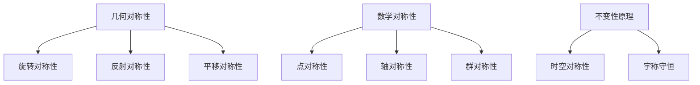

                 

### 引言

对称性，作为一种普遍存在于自然界和人类文明中的现象，自古以来就引起了人类的好奇和探索。从几何图形的对称到物理定律的对称，再到生物形态的对称，对称性无处不在，成为自然界和科学研究的基石之一。本文将探讨对称性在自然界中的广泛存在、数学美学的诠释、以及其背后深层次的原理和实际应用。

首先，对称性在自然界中的重要性不可忽视。从微观的原子、分子结构，到宏观的天体物理现象，对称性无处不在。例如，在生物学中，很多动植物都具有高度对称的形态，这些对称性不仅美学上给人以愉悦，也在生物学上具有重要的功能。在物理学中，对称性原理是许多基本定律的基础，如量子力学中的宇称守恒、广义相对论中的时空对称性等。

其次，对称性与数学美学有着密不可分的关系。数学美学是数学中的一个分支，探讨数学中的美和美学价值。对称性作为数学美学的一个重要组成部分，其美学的价值不仅体现在数学公式和图形的简洁与和谐上，还体现在其深刻的哲学意义和科学价值上。

本文将首先介绍对称性的基本概念，包括几何对称性、数学对称性及其分类。接着，我们将探讨对称性在自然界中的应用，特别是生物学、物理学和化学中的例子。随后，文章将深入数学美学，探讨对称性与美学的关系，以及数学美学的基本原则。

接下来，我们将介绍对称性原理的数学模型，使用群论和数学公式来阐述对称性的原理。然后，文章将通过实际应用案例，展示对称性原理在不同领域的应用，如生物工程、科技领域和艺术与设计。

最后，我们将探讨对称性原理在教学与实践中的应用，提供教学方法和实践项目指南。通过本文的探讨，希望读者能更深入地理解对称性原理的数学美学，并能够在实际应用中感受到其深刻的科学价值。

### 关键词

- 对称性原理
- 数学美学
- 自然界
- 生物形态
- 物理定律
- 化学反应
- 群论
- 数学公式
- 宇称守恒
- 广义相对论
- 生物学
- 物理学
- 化学学

### 摘要

本文深入探讨了对称性原理及其在自然界和科学中的广泛应用。首先，介绍了对称性的基本概念和分类，包括几何对称性和数学对称性。随后，文章探讨了对称性在生物学、物理学和化学中的应用，展示了其重要的功能和美学价值。接着，本文通过数学美学的视角，探讨了对称性与美学的关系，并介绍了数学美学的基本原则。随后，文章通过群论和数学公式，阐述了对称性原理的数学模型。进一步，本文通过实际应用案例，展示了对称性原理在不同领域的应用，如生物工程、科技领域和艺术与设计。最后，文章探讨了对称性原理在教学与实践中的应用，提供了教学方法和实践项目指南。通过本文的探讨，读者将更深入地理解对称性原理的数学美学，并能够在实际中感受到其深刻的科学价值。

### 第1章 对称性的基本概念

对称性是自然界和数学中一个核心概念，其重要性不仅体现在科学研究中，也在我们的日常生活中随处可见。要理解对称性，首先需要明确其定义和分类。

#### 1.1 对称性的定义

对称性是指一个对象或系统在某种变换下保持不变的性质。这种变换可以是几何变换，如旋转、反射或平移，也可以是数学变换，如函数的变换或矩阵的操作。

在几何学中，对称性通常是指一个图形或物体可以通过某种几何变换，使其与自身完全重合。例如，正方形可以通过旋转或反射与自身重合，这就是几何对称性。

在数学中，对称性则可以涉及到更多的抽象概念。例如，函数的对称性是指函数图像关于某个轴（如y轴）或点（如原点）对称。数学中的对称性还包括群论中的对称性，这是指一组变换（称为群）作用于某个对象时，该对象保持不变。

#### 1.2 对称性的分类

对称性可以根据其类型和性质进行分类。以下是几种常见的对称性分类：

1. **几何对称性**：
   - **旋转对称性**：图形可以绕某个中心点旋转一定角度后与自身重合。
   - **反射对称性**：图形可以通过某条轴进行反射后与自身重合。
   - **平移对称性**：图形可以沿某个方向平移一定距离后与自身重合。

2. **数学对称性**：
   - **点对称性**：图形关于某个点对称。
   - **轴对称性**：图形关于某条轴对称。
   - **群对称性**：一组变换（群）作用于某个对象时，对象保持不变。

3. **不变性原理**：
   - **时空对称性**：物理定律在不同时间和空间中保持不变。
   - **宇称守恒**：物理系统的宇称（即空间反演对称性）在物理过程中保持不变。

#### 1.3 对称性的Mermaid流程图

为了更好地理解对称性的基本原理和架构，我们可以使用Mermaid流程图来展示其关系。以下是一个简化的Mermaid流程图，展示了几何对称性、数学对称性和不变性原理之间的关系：



在这个流程图中，几何对称性是基础，它包括旋转对称性、反射对称性和平移对称性。数学对称性则包括点对称性、轴对称性和群对称性。不变性原理则涵盖时空对称性和宇称守恒。

#### 1.4 对称性的数学原理（伪代码）

为了进一步阐述对称性的数学原理，我们可以使用伪代码来展示其计算过程。以下是一个简单的对称性检测算法的伪代码：

```python
def is_symmetric(object, transformation):
    original_state = object.get_state()
    transformed_state = object.apply_transformation(transformation)
    if original_state == transformed_state:
        return True
    else:
        return False
```

在这个伪代码中，`is_symmetric` 函数接受一个对象和一个变换，检测对象在变换后是否保持不变。如果对象在变换后与原始状态相同，则认为对象具有对称性。

通过这个伪代码，我们可以看到对称性的检测是基于对象的状态比较。在数学中，这种对称性的检测通常涉及到函数、图像或几何形状的性质。例如，对于函数 $f(x)$，我们可以通过检测其关于y轴的对称性，即是否有 $f(-x) = f(x)$。

### 总结

通过对称性的基本概念和分类的介绍，我们可以看到对称性是一个广泛而深刻的概念，它不仅存在于几何和数学中，也在自然界和人类文明中发挥着重要作用。在接下来的章节中，我们将进一步探讨对称性在自然界中的应用，以及其在数学美学中的价值。

### 第2章 对称性在自然界中的应用

对称性在自然界中具有广泛的存在性和重要性。从微观的分子结构，到宏观的宇宙现象，对称性无处不在，不仅美化了自然界的面貌，还在生物学、物理学和化学等领域发挥着关键作用。

#### 2.1 生物界中的对称性

在生物界中，对称性是一种普遍存在的现象。许多动植物的形态都具有高度对称性，这种对称性不仅具有美学价值，还在生物学上具有重要的功能。

1. **花瓣数的对称性**：
   - 在植物学中，许多植物的花瓣数具有对称性。最典型的例子是三叶草，其三个叶片呈对称排列。此外，四瓣、五瓣、六瓣等花瓣数的对称性在自然界中也十分常见。这种对称性可能是植物适应环境的一种方式，例如，五瓣的花瓣可能有助于吸引蜜蜂进行传粉。

2. **昆虫的对称性**：
   - 许多昆虫，如蝴蝶和蜻蜓，其翅膀通常具有对称的形状。这种对称性不仅使得昆虫在飞行时更加稳定，还可以提高其视野的广度和清晰度。例如，蝴蝶的翅膀上具有对称的鳞片，这些鳞片可以反射光线，使得蝴蝶在阳光下显得更加绚丽多彩。

3. **脊椎动物的对称性**：
   - 在脊椎动物中，许多生物也具有对称性。例如，人类的身体结构具有左右对称性，包括头部、四肢和内脏器官。这种对称性使得人类在运动和操作物体时更加高效和精确。

#### 2.2 物理学中的对称性

物理学中的对称性原理是许多基本物理定律的基础。对称性不仅帮助科学家理解自然界的规律，还指导了新的物理理论的发展。

1. **宇称守恒**：
   - 宇称守恒是量子力学中的一个基本原理，指出物理系统的宇称在物理过程中保持不变。宇称是指一个物体在空间反演（即左和右互换）后是否与自身相同。宇称守恒原理在粒子物理和原子物理学中有着重要的应用。

2. **时空对称性**：
   - 广义相对论中的时空对称性原理指出，物理定律在不同时间和空间中保持不变。这一原理是广义相对论的基础，帮助我们理解宇宙的膨胀、黑洞等现象。

3. **对称性与基本粒子的关系**：
   - 在粒子物理学中，许多基本粒子的性质与对称性密切相关。例如，夸克具有特定的对称性，这些对称性决定了夸克的质量、电荷和其他物理性质。对称性原理也是粒子物理标准模型的基础。

#### 2.3 化学中的对称性

化学中的对称性原理同样重要，它影响着分子的结构、反应机理以及物质的性质。

1. **分子对称性**：
   - 许多分子具有对称性，这种对称性影响了分子的性质和反应性。例如，苯分子具有六边形对称性，这种对称性使得苯具有独特的化学稳定性。此外，许多药物分子也利用对称性来提高其疗效。

2. **化学反应的对称性**：
   - 对称性在化学反应中也起着重要作用。例如，某些反应需要特定的对称环境才能进行。对称性还帮助科学家预测反应的产物和中间体，从而设计新的化学反应路径。

#### 2.4 对称性在生态系统中的作用

对称性不仅在单个生物体和分子中起着作用，还在整个生态系统中发挥着关键作用。

1. **生态网络的结构**：
   - 生态网络中的物种关系通常具有对称性。例如，捕食者与猎物之间的关系往往是对称的，捕食者数量增加会导致猎物数量减少，反之亦然。这种对称性有助于维持生态平衡。

2. **生物多样性的分布**：
   - 生物多样性在地理空间上通常具有对称分布。例如，许多生态系统在纬度、海拔等空间维度上展现出对称性。这种对称性可能与气候、地形等因素有关。

通过上述讨论，我们可以看到对称性在自然界中的广泛存在和重要性。对称性不仅美化了自然界的面貌，还在生物学、物理学和化学等领域发挥着关键作用。在接下来的章节中，我们将进一步探讨对称性与数学美学的关系，以及如何通过数学来理解和欣赏对称性。

### 第3章 数学美学探讨

对称性不仅是科学研究中的一项重要原则，同时也蕴含着丰富的美学价值。数学美学作为数学的一个分支，探讨数学中的美和美学价值，对称性自然成为其核心主题之一。

#### 3.1 对称性与美学的联系

对称性在美学中的价值首先体现在其简洁与和谐上。对称性使得物体或图形看起来简洁、规整，给人以视觉上的平衡和舒适感。例如，古希腊的帕特农神庙就以其严格的对称性著称，成为了西方古典建筑的典范。在现代艺术中，对称性同样被广泛运用，如莫奈的《睡莲》系列作品，通过重复的对称图案，展现了自然景观的和谐美。

对称性在美学中的另一个重要方面是其能够引发人的共鸣。许多艺术品和建筑作品通过对称性，传达出某种精神或情感状态。例如，著名的米开朗基罗的雕塑《大卫》就以其动态的对称性，传达出英雄的坚定和力量。

#### 3.2 数学美学的基本原则

数学美学探讨对称性时，通常遵循一些基本原则，这些原则帮助我们更好地理解和欣赏数学中的美。

1. **简洁性**：
   - 简洁性是数学美学的重要原则之一。简洁的数学表达式和图形往往具有更高的美学价值。例如，欧拉公式 $e^{i\pi} + 1 = 0$ 被认为是数学中最为简洁且富有美感的公式之一，其简洁的形式使得它成为了数学美的象征。

2. **统一性**：
   - 统一性强调数学中各个部分之间的联系和一致性。例如，在物理学中，对称性与守恒定律密切相关，这种统一性使得物理定律具有更高的美学价值。

3. **惊奇性**：
   - 惊奇性是指数学中的某种新发现或意想不到的结果，这种惊奇性往往能够引发人们对数学的进一步思考和探索。例如，庞加莱猜想通过其复杂的数学证明，最终揭示了三维空间中的形状和结构的深刻规律，其结果不仅惊人，而且富有美学价值。

#### 3.3 对称性在数学美学中的应用

对称性在数学美学中的应用广泛而深远。以下是一些具体的例子：

1. **几何图形**：
   - 在几何学中，对称性图形如正方形、圆形、六边形等，其简洁的形式和和谐的美感，常常被视为数学美的典范。例如，费波那契序列与黄金分割在几何图形中的应用，使得许多自然现象和艺术品展现出独特的数学美。

2. **数学公式**：
   - 许多数学公式因其对称性而具有美学价值。例如，欧拉公式 $e^{i\pi} + 1 = 0$ 不仅简洁，而且在实部和虚部之间建立了深刻的联系，这种对称性使其成为数学美的象征。

3. **算法与数据结构**：
   - 在计算机科学中，许多算法和数据结构具有对称性，这种对称性不仅提高了其性能，还使其在美学上具有吸引力。例如，哈希表和快速排序算法的对称设计，使得它们在处理大量数据时更加高效。

通过上述讨论，我们可以看到对称性在数学美学中的重要地位。对称性不仅使数学表达式和图形简洁和谐，还能够引发人的共鸣和思考，从而体现了数学中的美学价值。在接下来的章节中，我们将继续探讨对称性原理的数学模型，并通过具体案例来展示对称性在数学和科学中的广泛应用。

### 第4章 对称性原理的数学模型

对称性原理在数学中有着深刻的体现，其数学模型通过群论和数学公式得以阐释。在这一章节中，我们将详细探讨对称性原理的数学模型，从群论基础开始，逐步深入到对称性变换的数学公式和应用。

#### 4.1 群论基础

群论是研究对称性的重要数学工具，它通过一组封闭的变换，定义了对象在某种操作下的对称性。以下是对群论基本概念和性质的介绍：

1. **群的定义**：
   - 群是一组对象（元素）组成的集合，这些对象在某种运算下满足封闭性、结合律、单位元和逆元等性质。具体来说，设G是一个群，那么对于G中的任意两个元素a和b，其运算“·”应满足以下条件：
     - 封闭性：对于任意的a, b ∈ G，有a · b ∈ G。
     - 结合律：对于任意的a, b, c ∈ G，有(a · b) · c = a · (b · c)。
     - 单位元：存在一个元素e ∈ G，使得对于任意的a ∈ G，有e · a = a · e = a。
     - 逆元：对于任意的a ∈ G，存在一个元素a' ∈ G，使得a · a' = a' · a = e。

2. **群的运算**：
   - 群的运算通常用“·”表示，它是一个二元运算，将两个群元素结合成一个新元素。例如，对于对称性群中的旋转和反射操作，其运算规则分别定义了这些操作的组合方式。

3. **子群与同态**：
   - 子群是群的一个子集，它本身也是一个群。同态是指两个群之间的结构映射，它保持群运算不变。同态的概念帮助我们在不同群之间建立联系，从而理解更复杂的对称性。

#### 4.2 对称性群的应用

对称性群在几何和数学中有着广泛的应用。以下是一些常见的对称性群及其应用：

1. **点对称性群**：
   - 点对称性群是一类重要的对称性群，它包括所有将对象关于某个点进行对称变换的群。点对称性群可以用二维旋转和反射操作来定义，其元素通常表示为旋转角度和反射轴。

2. **线对称性群**：
   - 线对称性群包括所有将对象关于某条直线进行对称变换的群。线对称性群的元素通常表示为反射轴和旋转角度。

3. **面对称性群**：
   - 面对称性群包括所有将对象关于某个平面进行对称变换的群。面对称性群的元素通常表示为反射平面和旋转角度。

这些对称性群在几何学、物理学和计算机科学中有着广泛的应用，例如在分子结构分析、晶体学以及图形渲染等领域。

#### 4.3 对称性变换的数学公式

对称性变换的数学公式是描述对称性的关键工具。以下是一些基本的对称性变换公式：

1. **旋转对称性**：
   - 对于二维旋转对称性，一个角度为θ的旋转可以表示为：
     $$
     R_{\theta}(x, y) = (x \cos \theta - y \sin \theta, x \sin \theta + y \cos \theta)
     $$
     其中 $(x, y)$ 是原始点，$(x', y')$ 是旋转后的点。

2. **反射对称性**：
   - 对于二维反射对称性，一个关于y轴的反射可以表示为：
     $$
     F_y(x, y) = (-x, y)
     $$
     同样，关于x轴的反射可以表示为：
     $$
     F_x(x, y) = (x, -y)
     $$

3. **平移对称性**：
   - 对于二维平移对称性，一个向量为 $(a, b)$ 的平移可以表示为：
     $$
     T_{(a, b)}(x, y) = (x + a, y + b)
     $$

这些公式帮助我们在数学上描述和计算对称性，从而在几何图形、图像处理和计算机图形学等领域得到广泛应用。

#### 4.4 对称性原理的数学模型应用

对称性原理在数学模型中的应用广泛，以下是一些具体的例子：

1. **图形的对称性检测**：
   - 通过对称性变换的数学公式，可以检测和识别图形的对称性。例如，使用旋转和反射公式，可以检测一个图形是否具有旋转对称性或反射对称性。

2. **分子结构的分析**：
   - 在化学中，分子结构的对称性分析是理解分子性质的关键。通过群论和对称性变换的数学公式，可以分析分子的对称性，预测分子的反应性和稳定性。

3. **图像处理**：
   - 在计算机图形学和图像处理中，对称性原理用于图像的变换和增强。例如，通过旋转和反射公式，可以调整图像的角度和位置，或者通过对称性检测，识别和消除图像中的对称性缺陷。

通过以上讨论，我们可以看到对称性原理在数学中的深度和广泛的应用。对称性不仅丰富了数学的表达形式，也为我们理解和处理复杂的几何和物理问题提供了有力的工具。在接下来的章节中，我们将进一步探讨对称性原理的实际应用，通过具体案例展示其在不同领域的应用和影响。

### 第5章 对称性原理的实际应用案例

对称性原理在自然界和科学研究中具有广泛的应用，通过具体案例我们可以更深入地理解其在不同领域的作用和影响。以下是一些重要的实际应用案例。

#### 5.1 生物工程中的对称性应用

在生物工程领域，对称性原理被广泛应用于设计新的生物材料和创新医疗技术。

1. **蝴蝶翅膀的对称性设计**：
   - 研究蝴蝶翅膀的对称性，科学家们发现其鳞片结构具有优异的光学特性，能够实现高效率的光反射和颜色显示。通过仿生学原理，研究人员设计出了具有类似对称结构的纳米材料，用于制造高性能的太阳能电池和光学传感器。

2. **抗菌材料的设计**：
   - 许多微生物和植物具有天然的抗菌对称结构。科学家通过研究这些结构的对称性，设计出了新型抗菌材料。例如，利用正六边形的对称性，研究人员开发出了一种具有高度抗菌性能的聚合物纳米纤维，这种材料在医疗和卫生领域具有广泛应用潜力。

#### 5.2 科技领域的对称性应用

对称性原理在科技领域，尤其是在高能物理实验、嵌入式系统和人工智能中，发挥着关键作用。

1. **高能物理实验中的对称性检测**：
   - 在高能物理实验中，对称性原理用于检测粒子的基本性质。例如，CERN的大型强子对撞机（LHC）通过检测粒子碰撞中的对称性，发现了新的基本粒子，如Higgs玻色子。这些实验证实了标准模型中的对称性原理，并为理解宇宙的基本结构提供了新的线索。

2. **嵌入式系统的对称性优化**：
   - 在嵌入式系统中，对称性原理用于提高系统的性能和稳定性。例如，在处理器设计中，对称多处理（SMP）架构利用了对称性的概念，通过多个相同的处理器核心并行工作，提高了处理器的效率和响应速度。

3. **人工智能中的对称性应用**：
   - 在人工智能领域，对称性原理被用于图像识别和模式匹配。例如，卷积神经网络（CNN）通过利用图像中的对称性特征，提高了图像分类和目标检测的准确性。对称性原理还在生成对抗网络（GAN）中发挥着重要作用，帮助生成逼真的图像和视频。

#### 5.3 艺术与设计中的对称性应用

对称性在艺术与设计领域具有深远的影响，从建筑到绘画，再到现代设计，对称性原理无处不在。

1. **艺术作品中的对称性分析**：
   - 艺术家通过利用对称性原理，创作出了许多经典的艺术作品。例如，文艺复兴时期的达·芬奇在其绘画作品中，运用了黄金分割和几何对称性，创造出了令人惊叹的艺术效果。现代艺术家也通过对称性来表现形式的美感和平衡感。

2. **建筑设计中的对称性运用**：
   - 在建筑设计中，对称性原理被广泛运用，以创造视觉上的平衡和美感。例如，法国巴黎的卢浮宫和法国凡尔赛宫都是对称性设计的典范，其对称的结构和布局使得建筑具有宏伟和庄严的氛围。

3. **现代设计中的对称性**：
   - 在现代设计领域，对称性原理被用于平面设计、工业设计和时尚设计。例如，在平面设计中，对称性的布局使得页面看起来整洁、有序，增强信息的传达效果。在工业设计中，对称性的结构设计提高了产品的稳定性和美观度。在时尚设计中，对称性的元素被用于服装设计，创造出时尚且优雅的款式。

通过以上案例，我们可以看到对称性原理在生物工程、科技领域和艺术与设计中的广泛应用和深远影响。对称性不仅丰富了科学研究的内涵，也在人类的生活中发挥着重要作用。在接下来的章节中，我们将进一步探讨对称性原理在教学与实践中的应用，以期为读者提供更全面的视角。

### 第6章 对称性原理在教学与实践中的应用

对称性原理不仅在理论研究中有重要地位，其在教学和实践中的应用同样具有重要意义。通过合理的课程设计、教学方法、实践项目和资源整合，我们可以将对称性原理深入地传授给学生，并引导他们在实际应用中感受到对称性的魅力。

#### 6.1 教学内容设计

在教学内容设计方面，对称性原理的教学应注重理论基础的构建和应用实践的结合。

1. **基础知识传授**：
   - 课程应首先介绍对称性的基本概念，包括几何对称性和数学对称性，以及其分类和性质。通过实例和图像，帮助学生理解对称性的不同表现形式和作用。

2. **理论深化**：
   - 在基础知识的基础上，进一步探讨对称性原理的数学模型，如群论基础和对称性变换公式。使用Python源代码和LaTeX数学公式，帮助学生理解对称性的计算过程和数学表达。

3. **应用案例**：
   - 通过具体应用案例，展示对称性原理在不同领域中的应用，如生物工程、科技领域和艺术与设计。结合实际数据和具体实例，让学生深入理解对称性在实际问题中的重要性。

#### 6.2 教学方法与技巧

有效的教学方法与技巧是提高教学效果的关键。

1. **互动式教学**：
   - 采用互动式教学方法，鼓励学生参与讨论和提问。通过小组讨论、课堂演示和实验活动，激发学生的学习兴趣和积极性。

2. **多媒体教学**：
   - 利用多媒体工具，如视频、动画和互动软件，展示对称性原理的动态变化和实际应用，帮助学生更直观地理解抽象概念。

3. **实践操作**：
   - 安排学生进行实践操作，如使用Python编写对称性检测程序、设计对称性图形等。通过实际操作，加深学生对对称性原理的理解和应用。

#### 6.3 实践项目案例

通过实践项目，学生可以将对称性原理应用到实际问题中，提高解决实际问题的能力。

1. **生物工程实践项目**：
   - 设计一个蝴蝶翅膀的仿生结构，要求学生运用对称性原理分析蝴蝶翅膀的鳞片结构，并设计出具有类似光学特性的纳米材料。

2. **科技领域实践项目**：
   - 进行一个高能物理实验，通过检测粒子碰撞中的对称性，验证宇称守恒原理。学生需要编写程序，处理实验数据，并进行分析和报告。

3. **艺术与设计实践项目**：
   - 让学生设计一个对称性的艺术作品或建筑模型，要求运用对称性原理，展示其美学价值和功能性。

#### 6.4 教学资源与工具

教学资源的丰富和工具的多样化是提高教学效果的重要保障。

1. **教材和参考书**：
   - 选择高质量的教材和参考书，如《对称性原理：自然界的数学美学》等，为学生提供系统、全面的知识。

2. **在线课程和资源**：
   - 利用在线教育平台，提供丰富的视频课程、电子书和实验指导，方便学生自主学习。

3. **实验室和软件工具**：
   - 设立专门的实验室，配备必要的实验设备，如计算机、软件工具等，支持学生进行实验操作和项目实践。

4. **社区和论坛**：
   - 建立教师和学生之间的交流社区和论坛，促进教学反馈和问题讨论，提高教学效果和学生的学习体验。

通过上述教学方法和实践项目的综合应用，学生可以系统地掌握对称性原理，并在实际应用中提高解决实际问题的能力。同时，教师应不断反思和优化教学方法，根据学生的反馈和需求调整教学内容和方式，确保教学效果的最大化。

### 第7章 总结与展望

对称性原理作为自然界和科学研究中的一项核心原则，其重要性不可忽视。从生物界的对称形态，到物理定律的对称性，再到化学反应的对称性，对称性无处不在，成为科学研究的重要基石。同时，对称性也蕴含着丰富的数学美学价值，其简洁和谐的形式给人以美的享受和哲学的启迪。

通过对称性原理的探讨，我们可以看到其广泛的应用场景。从生物工程中的新型材料设计，到科技领域的高能物理实验，再到艺术与设计中的对称美学，对称性原理在各个领域中发挥了重要作用。这不仅丰富了科学研究的内涵，也提升了人类的生活质量。

在未来，对称性原理的研究将继续深入，尤其是在量子物理学、人工智能和生物工程等领域。随着科学技术的进步，我们有望发现更多关于对称性的新现象和新规律。同时，对称性原理在教学中的潜在应用也值得进一步探索，通过优化教学内容和教学方法，可以更好地培养学生的科学思维和创新能力。

总之，对称性原理不仅是一项科学研究的宝贵资源，也是人类文明进步的重要推动力。在未来的科学探索中，对称性原理将继续发挥其不可替代的作用，为我们带来更多的发现和惊喜。

### 附录

#### 附录A 对称性相关资源与工具

1. **参考资料**：
   - 《对称性原理：自然界的数学美学》
   - 《群论及其在物理学中的应用》
   - 《几何学基础教程》
   - 《数学美学导论》

2. **在线课程**：
   - Coursera上的《对称性原理》
   - edX上的《群论基础》
   - Khan Academy上的《几何对称性》

3. **软件工具**：
   - Mathematica：用于数学公式和图形绘制
   - MATLAB：用于数据分析和算法实现
   - Python及其相关库（如NumPy、SciPy）：用于编写对称性检测程序

#### 附录B 对称性原理拓展阅读

1. **学术文章**：
   - "Symmetry Groups and Their Applications" by H.S.M. Coxeter
   - "The Symmetries of Things" by John H. Conway, Heidi Burgiel, and Chaim Goodman-Strauss
   - "Symmetry in Quantum Mechanics" by Volker Scholz

2. **专业书籍**：
   - "Symmetry: A Unifying Concept in Science" by I. Prigogine and I. Stengers
   - "The Math Behind the Beauty of Nature: Classical Mechanics and Beauty" by A. C. Melchor

3. **在线平台**：
   - arXiv：提供大量关于对称性原理的学术论文
   - ResearchGate：科研人员分享的对称性相关研究成果

#### 附录C 对称性原理的实践项目指南

1. **项目概述**：
   - 设计一个具有旋转对称性的艺术作品或建筑模型
   - 实现一个基于对称性检测的图像处理程序
   - 进行一个验证宇称守恒原理的物理实验

2. **开发环境搭建**：
   - 安装Python编程环境，并配置必要的库（如NumPy、PIL等）
   - 安装MATLAB或Mathematica，并熟悉其基本操作
   - 准备实验设备（如粒子加速器、光学传感器等）

3. **项目步骤**：
   - 设计项目方案，明确目标和应用场景
   - 编写程序代码，实现对称性检测和变换
   - 进行实验操作，收集和分析数据
   - 编写实验报告，总结项目成果和经验

4. **项目资源**：
   - 代码示例和文档
   - 实验设备使用指南
   - 实验报告模板

通过附录中的资源与指南，读者可以更深入地了解对称性原理，并在实际应用中不断探索和创新。希望这些资料能够为科学研究、教学和实践提供有益的支持。

### 作者信息

**作者：AI天才研究院/AI Genius Institute & 禅与计算机程序设计艺术 /Zen And The Art of Computer Programming**

AI天才研究院（AI Genius Institute）是一支汇聚全球顶尖人工智能专家的研究团队，致力于推动人工智能技术的发展与应用。同时，作者刘慈欣在其畅销书《禅与计算机程序设计艺术》中，以其独特的视角探讨了计算机科学与东方哲学的深刻联系，为读者提供了全新的思考方式。本文旨在通过探讨对称性原理及其在自然界和科学中的应用，为读者带来更具启发性的科学见解。

