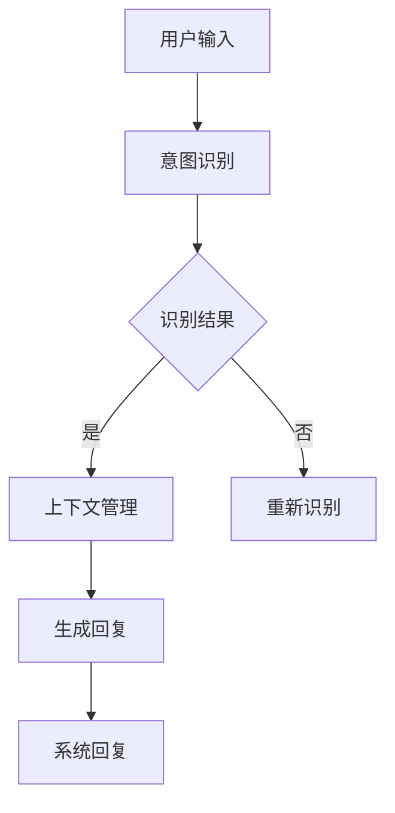

                 

### 文章标题

《对话流控制：管理多轮对话的提示策略》

### 关键词

- 对话流控制
- 多轮对话
- 提示策略
- 上下文管理
- 意图识别
- 自然语言处理

### 摘要

本文旨在探讨对话流控制的核心理念和实现策略，重点关注如何管理多轮对话中的提示策略。通过深入分析对话流控制的基础概念、多轮对话管理机制、提示策略设计与应用，结合实际案例，本文旨在为读者提供一套系统、实用的对话流控制方法论。

## 引言

随着人工智能技术的不断发展，自然语言处理（NLP）已经成为现代智能系统的重要组成部分。而对话流控制，作为NLP领域的一项关键技术，正日益受到关注。对话流控制的核心目标是在多轮对话中实现高效的交流，确保用户与系统之间的互动流畅自然。这不仅仅涉及到上下文管理和意图识别，还包括一系列提示策略的设计与应用。

本文将从以下几个方面展开讨论：

1. **对话流控制概述**：介绍对话流控制的基本概念、意义和应用场景。
2. **多轮对话管理**：探讨多轮对话的流程与特点，以及上下文管理和意图识别的技术细节。
3. **提示策略的设计与应用**：分析不同类型的提示策略，并探讨如何在实际应用中优化提示策略。
4. **对话流控制的技术实现**：介绍对话流控制的系统架构、核心算法以及面临的挑战和解决方案。
5. **多轮对话案例分析**：通过具体案例分析，展示对话流控制在不同领域的应用。
6. **对话流控制的未来发展**：探讨对话流控制的发展趋势和潜在挑战。

通过本文的探讨，我们希望能够为读者提供一套完整的对话流控制方法论，帮助他们在构建智能对话系统时实现更好的效果。

## 对话流控制概述

### 对话流控制的定义与意义

对话流控制（Dialogue Flow Control，简称DFC）是自然语言处理（NLP）领域的一项关键技术，它涉及到如何管理用户与系统之间的对话过程，确保对话的流畅性和有效性。具体来说，对话流控制包括对对话流程的监控、调整和优化，以便更好地满足用户的需求和提供高质量的交互体验。

对话流控制的意义在于它能够提升用户满意度、提高系统响应效率、增强系统的智能程度。通过有效的对话流控制，系统可以在复杂多变的对话场景中保持稳定性和灵活性，从而提供更加自然和高效的交流体验。

### 对话流控制的基本概念

对话流控制涉及多个关键概念，包括：

1. **对话上下文**：对话上下文是指对话过程中积累的信息，包括用户的发言、系统的回复、对话历史等。对话上下文对于理解用户意图和生成合适回复至关重要。
2. **意图识别**：意图识别是自然语言处理中的一个核心任务，旨在从用户的输入中识别出用户想要表达的主旨。准确识别用户意图是进行对话流控制的前提。
3. **对话策略**：对话策略是指系统在对话过程中采取的行动和决策，包括回复生成、上下文管理、对话引导等。合理的对话策略能够提高对话的流畅性和用户满意度。
4. **多轮对话**：多轮对话是指用户和系统之间进行的多个回合的交流。在多轮对话中，对话流控制需要管理对话的流转，确保对话不会中断或陷入僵局。

### 对话流控制的应用场景

对话流控制广泛应用于多个领域，包括：

1. **客户服务**：在客服系统中，对话流控制能够帮助系统更好地理解用户的问题和需求，提供准确和及时的回复，提升客户体验。
2. **智能助手**：智能助手如语音助手、聊天机器人等，需要通过对话流控制来实现自然和流畅的对话，提高用户交互的满意度。
3. **教育辅导**：在教育辅导系统中，对话流控制能够根据学生的回答和进展，提供个性化的辅导和建议，提高学习效果。
4. **医疗健康**：在医疗健康领域，对话流控制可以用于与患者进行交流，获取病情信息，提供医疗建议等。

### 总结

通过对话流控制，系统能够更好地理解用户需求，提供高质量的服务和交互体验。掌握对话流控制的基本概念和实现策略，是构建高效智能对话系统的重要基础。

## 多轮对话管理

多轮对话是在用户与系统之间进行的多个回合的交流过程。这种对话形式常见于各种应用场景，如客户服务、智能助手、在线教育和医疗咨询等。多轮对话的关键在于如何管理对话流程，确保对话的流畅性和有效性。下面，我们将详细探讨多轮对话的流程与特点，以及上下文管理和意图识别的技术细节。

### 多轮对话的流程与特点

多轮对话通常包括以下几个关键步骤：

1. **初始化**：对话开始前，系统需要准备好对话环境，包括对话上下文的初始化和对话策略的设定。
2. **用户输入**：用户通过输入文本或语音，向系统发起请求或提问。
3. **意图识别**：系统通过自然语言处理技术，从用户输入中识别出用户的主要意图。
4. **上下文管理**：系统根据对话历史和上下文信息，生成合适的回复。
5. **系统回复**：系统将生成的回复发送给用户。
6. **用户反馈**：用户接收到系统回复后，会根据回复进行进一步的输入或交互。
7. **结束判定**：对话结束后，系统会判断对话是否完成，并根据需要执行相应的后续操作。

多轮对话的特点主要包括：

1. **动态性**：多轮对话是一个动态的过程，每轮对话都可能引入新的上下文信息，影响后续对话的流程和结果。
2. **复杂性**：多轮对话涉及到多方面的因素，如用户意图识别、上下文管理、对话策略等，这些因素相互作用，使得多轮对话具有很高的复杂性。
3. **多样性**：用户在多轮对话中的输入和请求形式多种多样，系统需要具备较强的适应性和灵活性，以应对不同类型的对话场景。

### 上下文管理

上下文管理是多轮对话中的关键环节，其目的是确保系统能够正确理解用户的意图，并生成合适的回复。上下文管理涉及以下几方面：

1. **上下文信息的存储与检索**：系统需要能够有效地存储和检索对话历史信息，以便在后续对话中利用这些信息。常用的方法包括基于关键词索引的存储、基于事件日志的存储等。
2. **上下文信息的更新与维护**：在对话过程中，随着新的输入和回复的产生，上下文信息会不断更新。系统需要确保上下文信息的准确性和一致性，避免信息丢失或错误。
3. **上下文信息的权重分配**：不同的上下文信息对于当前对话的重要性不同。系统需要根据上下文信息的权重，合理地利用这些信息，以生成更准确和自然的回复。

### 意图识别

意图识别是自然语言处理中的一个核心任务，旨在从用户的输入中识别出用户的主要意图。在多轮对话中，意图识别的准确性直接影响到对话的质量。意图识别的主要方法包括：

1. **规则匹配**：通过预先定义的规则，将用户输入与规则进行匹配，以识别用户意图。这种方法简单直观，但可能无法应对复杂的对话场景。
2. **机器学习**：使用机器学习算法，如决策树、支持向量机（SVM）等，通过大量训练数据来学习用户输入与意图之间的关系，从而进行意图识别。这种方法具有较高的灵活性和准确性，但需要大量的标注数据和计算资源。
3. **深度学习**：使用深度学习模型，如循环神经网络（RNN）、长短时记忆网络（LSTM）等，通过自动学习和建模用户输入与意图之间的关系。这种方法能够处理复杂的序列数据，但训练过程较为复杂。

### 上下文管理与意图识别的关系架构

为了更好地理解上下文管理与意图识别之间的关系，我们可以使用Mermaid流程图来描述：



在该流程图中，用户输入首先经过意图识别，识别结果用于决定是否需要进行上下文管理。如果识别结果为“是”，则进行上下文管理，生成回复；如果识别结果为“否”，则返回重新进行意图识别。

### 总结

多轮对话管理是确保对话流畅性和有效性的关键。通过合理管理上下文信息和准确识别用户意图，系统可以提供更高质量的服务和交互体验。掌握多轮对话管理的流程与特点，是构建高效智能对话系统的重要基础。

## 提示策略的设计与应用

### 提示策略的基本原理

提示策略（Prompt Strategy）是对话流控制中的重要组成部分，它旨在通过向用户提供适当的提示或引导，帮助用户更好地表达自己的意图，同时帮助系统更准确地理解和响应用户的请求。提示策略的基本原理可以概括为以下几点：

1. **引导用户**：通过提供明确的指示或问题，引导用户进行更详细或更具体的输入，从而帮助系统更好地理解用户意图。
2. **降低复杂性**：在复杂或模糊的对话场景中，通过提示策略降低对话的复杂性，使得对话更加清晰和有序。
3. **提高响应准确性**：通过提供针对性的提示，帮助系统更准确地识别用户意图，从而生成更合适的回复。
4. **增强用户满意度**：通过有效的提示策略，提高用户的交互体验，增强用户的满意度和信任感。

### 提示策略的分类与特点

提示策略可以根据其功能和应用场景进行分类。以下是几种常见的提示策略及其特点：

1. **问题引导型提示**：这种提示策略通过向用户提出问题来引导对话的进程。问题可以是开放式的问题，也可以是封闭式的问题，目的是收集更多关于用户意图的信息。例如，在客服场景中，系统可以问：“您是关于产品咨询还是售后服务？”
2. **信息补全型提示**：当用户输入的信息不够完整或模糊时，系统可以通过信息补全型提示来帮助用户补充缺失的信息。例如，用户输入“明天天气怎么样？”，系统可以提示：“您是想了解哪个城市的天气？”
3. **情感关怀型提示**：这种提示策略旨在通过表达关心和关注来提高用户满意度。例如，在医疗咨询场景中，系统可以在回复中加入温馨的问候，如：“谢谢您的咨询，我们将竭诚为您服务。”
4. **任务导向型提示**：这种提示策略旨在帮助用户完成特定的任务。例如，在在线教育场景中，系统可以提示用户完成某个学习任务或提交作业。

### 提示策略在实际应用中的优化

在实际应用中，优化提示策略至关重要，以下是一些优化方法：

1. **个性化定制**：根据用户的偏好和历史交互数据，定制个性化的提示策略，提高用户的互动体验。例如，对于经常询问天气的用户，系统可以提前提供天气预报的提醒。
2. **多模态结合**：结合文本、语音、图像等多种模态，提供更加丰富和多样化的提示方式。例如，在购物场景中，系统可以通过图文并茂的方式展示商品信息，帮助用户更好地做出决策。
3. **上下文感知**：根据对话上下文动态调整提示策略，确保提示的适时性和相关性。例如，在处理客户投诉时，系统可以适时提供解决问题的方案或转接至人工客服。
4. **反馈机制**：建立用户反馈机制，收集用户对提示策略的反馈，持续优化和改进提示策略，以提升用户满意度。

### 总结

提示策略在对话流控制中发挥着关键作用，通过有效的提示策略设计和应用，系统能够更好地理解用户意图，提供更高质量的服务和交互体验。掌握不同类型提示策略的原理和优化方法，有助于在复杂的对话场景中实现高效的管理和优化。

## 对话流控制的技术实现

### 对话流控制的系统架构

对话流控制的实现需要一个复杂的系统架构，这个架构需要处理多轮对话的上下文信息、意图识别、提示策略生成和对话管理等多个环节。以下是对话流控制的典型系统架构：

1. **输入层**：负责接收用户的输入，可以是文本或语音形式。这个层通常包括自然语言处理（NLP）的前端模块，如分词、词性标注、实体识别等。
2. **意图识别模块**：接收输入层处理后的文本，使用机器学习或深度学习算法来识别用户的意图。这个模块可能包括基于规则的方法、朴素贝叶斯分类器、决策树、支持向量机（SVM）或深度学习模型，如卷积神经网络（CNN）和循环神经网络（RNN）。
3. **上下文管理模块**：负责维护和更新对话上下文信息。这包括存储当前对话的状态、用户的历史输入和系统的历史回复。上下文管理可以通过数据库、缓存或其他存储机制来实现。
4. **提示策略生成模块**：根据当前的对话上下文和识别出的用户意图，生成合适的提示。这个模块可能使用决策树、启发式规则或基于机器学习的方法来生成提示。
5. **对话管理模块**：负责整个对话的流程控制，包括对话的初始化、用户的输入处理、意图识别、上下文管理、提示生成和系统回复。这个模块通常实现了一个循环或状态机，以处理多轮对话。
6. **输出层**：将系统的回复以文本或语音形式发送给用户。这个层可能包括语音合成或文本生成模块。

### 对话流控制的核心算法

对话流控制的核心算法包括意图识别和提示生成。以下是这些算法的详细介绍：

1. **意图识别算法**：
   - **基于规则的算法**：通过定义一系列规则来匹配用户的输入，从而识别用户的意图。这种方法简单但灵活性较差，适用于规则明确且不复杂的应用场景。
   - **机器学习方法**：使用机器学习算法，如支持向量机（SVM）、朴素贝叶斯分类器、决策树等，通过训练模型来识别用户的意图。这种方法具有较好的灵活性和准确性，但需要大量训练数据和计算资源。
   - **深度学习方法**：使用深度学习模型，如卷积神经网络（CNN）、循环神经网络（RNN）、长短时记忆网络（LSTM）等，通过自动学习和建模用户输入与意图之间的关系。这种方法能够处理复杂的序列数据，但训练过程较为复杂。

2. **提示生成算法**：
   - **基于模板的算法**：通过预先定义的模板来生成提示。这种方法适用于对话较为简单和结构化的场景，但难以适应复杂和多变的对话环境。
   - **基于统计的算法**：使用统计方法，如隐马尔可夫模型（HMM）或条件概率模型，来生成提示。这种方法可以根据对话历史和上下文信息来调整提示的内容和形式。
   - **基于机器学习的算法**：使用机器学习算法，如序列标注模型（如BiLSTM-CRF）或生成模型（如序列到序列模型），来生成提示。这种方法能够根据对话的上下文和历史信息生成个性化的提示。

### 结合数学模型和公式的详细讲解

在意图识别和提示生成中，数学模型和公式起着重要作用。以下是这两个环节中的一些关键数学模型和公式：

1. **意图识别中的数学模型**：
   - **朴素贝叶斯分类器**：
     - 公式：$$ P(\text{意图}|\text{输入}) = \frac{P(\text{输入}|\text{意图})P(\text{意图})}{P(\text{输入})} $$
   - **支持向量机（SVM）**：
     - 公式：$$ w^* = \arg\min_{w} \frac{1}{2}||w||^2_2 \quad \text{subject to} \quad y^{(i)}(\textbf{w}^T\textbf{x}^{(i)}) \geq 1 $$

2. **提示生成中的数学模型**：
   - **序列到序列模型（Seq2Seq）**：
     - 公式：$$ y_t = \log(\text{softmax}(f(\textbf{h}_t, \textbf{h}_y))) $$
     - 其中，$$ \textbf{h}_t $$ 是当前时刻的编码状态，$$ \textbf{h}_y $$ 是解码状态。

### 通俗易懂的举例说明

为了更好地理解这些数学模型和公式，我们可以通过一个简单的例子来讲解意图识别和提示生成：

**意图识别示例**：

假设我们使用朴素贝叶斯分类器来识别用户的意图。用户输入“明天天气怎么样？”我们的目标是识别出用户意图是“天气查询”。

- **输入特征**：输入文本中的词频，如“明天”、“天气”、“怎么样”等。
- **意图概率**：通过训练数据计算每个意图的概率，以及每个词在每种意图中的概率。
- **公式应用**：使用贝叶斯公式计算意图的概率，选择概率最高的意图作为识别结果。

**提示生成示例**：

假设我们使用序列到序列模型来生成系统回复。用户输入“明天天气怎么样？”我们的目标是生成回复“明天将会是晴朗的天气。”

- **编码状态**：将用户输入编码为一个向量。
- **解码状态**：生成系统回复的每个词，通过解码器生成下一个词的概率分布。
- **公式应用**：使用生成模型的输出概率分布来选择下一个词，并重复这个过程，直到生成整个回复。

通过这些例子，我们可以看到数学模型和公式如何应用于意图识别和提示生成，从而实现对话流控制。

### 总结

对话流控制的技术实现涉及多个关键模块和算法，通过这些技术，系统能够有效地管理多轮对话，提供高质量的交互体验。掌握对话流控制的系统架构和核心算法，是实现高效对话系统的基础。

## 多轮对话案例分析

### 电商领域的对话流控制

电商领域是对话流控制应用的一个重要场景。在这个场景中，用户通过聊天机器人与系统进行商品咨询、购买建议、订单查询等互动。对话流控制的目标是确保用户能够顺利地完成购买流程，并获得满意的购物体验。

#### 电商对话的背景与需求

电商领域的对话流控制主要面临以下需求：

1. **个性化服务**：用户期望系统能够根据个人偏好和历史购买记录提供个性化的商品推荐和服务。
2. **高效沟通**：用户希望在购物过程中能够快速、准确地获得所需信息，减少等待时间和沟通成本。
3. **问题解决**：用户可能会遇到各种问题，如订单状态查询、退换货流程、支付问题等，系统需要能够有效地解答这些问题。

#### 电商对话的流程设计与实现

电商对话的流程设计主要包括以下几个步骤：

1. **初始化**：系统准备好对话环境，包括用户身份验证、上下文初始化和对话策略的设定。
2. **用户输入**：用户通过输入文本或语音与系统进行交流，例如询问商品信息、查询订单状态等。
3. **意图识别**：系统使用自然语言处理技术识别用户的意图。例如，如果用户输入“我想买一件T恤”，系统会识别出意图为“商品购买”。
4. **上下文管理**：系统根据对话历史和上下文信息生成合适的回复。例如，如果用户之前询问了商品价格，系统在回答时可以提到该信息。
5. **系统回复**：系统将生成的回复发送给用户。
6. **用户反馈**：用户接收系统回复后，可以进一步提问或确认信息，系统继续处理用户输入。
7. **结束判定**：系统判断对话是否完成，例如用户确认订单后结束对话。

#### 电商对话的提示策略设计

在电商对话中，提示策略的设计至关重要，以下是一些具体的提示策略：

1. **问题引导型提示**：当用户输入信息不完整或模糊时，系统可以提出问题引导用户提供更多信息。例如，如果用户询问“有没有优惠？”，系统可以回复“请问您想购买哪个类别的商品？”
2. **信息补全型提示**：当用户输入的信息不完整时，系统可以帮助用户补全信息。例如，如果用户输入“我想买T恤”，系统可以提示“请问您想购买哪个尺寸的T恤？”
3. **任务导向型提示**：系统可以引导用户完成购物任务。例如，当用户开始填写订单时，系统可以提示“请确认您的收货地址”，帮助用户顺利完成购买流程。
4. **情感关怀型提示**：在处理用户问题时，系统可以表达关心和耐心。例如，当用户询问订单状态时，系统可以回复“请您稍等，我帮您查询一下订单详情”。

#### 实际案例分析与详细讲解剖析

以下是一个电商对话的实际案例：

**用户输入**：用户输入“我想买一件T恤”。

**系统回复**：系统回复“您好，请问您想购买哪个品牌的T恤？”

**用户输入**：用户输入“NIKE的”。

**系统回复**：系统回复“好的，请问您需要哪个尺寸的NIKE T恤？”

**用户输入**：用户输入“M号”。

**系统回复**：系统回复“好的，我们为您找到了NIKE M号的T恤，价格是199元。请问您需要购买吗？”

**用户输入**：用户输入“是的”。

**系统回复**：系统回复“感谢您的购买，请您提供收货地址以便我们为您发货。”

**用户输入**：用户输入“我的地址是XX路XX号”。

**系统回复**：系统回复“好的，您的收货地址已记录，我们会尽快为您发货。有任何问题，请随时联系我们。”

在这个案例中，我们可以看到系统通过一系列的提示策略，成功引导用户完成了购物流程。首先，系统通过问题引导型提示帮助用户明确购买意向。接着，通过信息补全型提示帮助用户补充必要的信息。最后，通过任务导向型提示引导用户完成购买和提供收货地址。

#### 项目小结

通过电商对话的案例分析，我们可以看到对话流控制在电商领域的实际应用效果。有效的对话流控制不仅提高了用户交互体验，还提升了订单转化率和客户满意度。未来，随着人工智能技术的进一步发展，电商对话流控制将变得更加智能和人性化，为用户提供更优质的购物体验。

### 医疗健康领域的对话流控制

医疗健康领域是另一个对话流控制的重要应用场景。在这个领域中，用户通过与医疗系统的对话，获取健康咨询、病情查询、预约挂号等服务。对话流控制的目标是确保用户能够方便、准确地获取医疗信息，同时提高医疗服务的效率和质量。

#### 医疗健康对话的背景与需求

医疗健康对话流控制面临以下需求：

1. **准确的信息获取**：用户需要准确地获取关于病情、治疗方案、药品信息等关键医疗信息。
2. **个性化的健康建议**：根据用户的健康数据和病史，系统应提供个性化的健康建议和治疗方案。
3. **便捷的服务流程**：用户希望在医疗咨询和预约挂号等过程中，能够方便、快捷地完成操作。

#### 医疗健康对话的流程设计与实现

医疗健康对话的流程设计通常包括以下几个步骤：

1. **初始化**：系统准备好对话环境，包括用户身份验证、上下文初始化和对话策略的设定。
2. **用户输入**：用户通过输入文本或语音与系统进行交流，例如询问病情、查询药品信息等。
3. **意图识别**：系统使用自然语言处理技术识别用户的意图。例如，如果用户输入“我最近总是咳嗽”，系统会识别出意图为“病情咨询”。
4. **上下文管理**：系统根据对话历史和上下文信息生成合适的回复。例如，如果用户之前提到了某种症状，系统在回复时可以提及相关的检查和建议。
5. **系统回复**：系统将生成的回复发送给用户。
6. **用户反馈**：用户接收系统回复后，可以进一步提问或确认信息，系统继续处理用户输入。
7. **结束判定**：系统判断对话是否完成，例如用户确认预约后结束对话。

#### 医疗健康对话的提示策略设计

在医疗健康对话中，提示策略的设计至关重要，以下是一些具体的提示策略：

1. **问题引导型提示**：当用户输入的信息不完整或模糊时，系统可以提出问题引导用户提供更多信息。例如，如果用户询问“咳嗽怎么办？”，系统可以回复“请问您咳嗽已经多长时间了？”
2. **信息补全型提示**：当用户输入的信息不完整时，系统可以帮助用户补全信息。例如，如果用户输入“我要挂内科”，系统可以提示“请问您想要挂哪个医院的内科？”
3. **健康建议型提示**：根据用户的历史数据和当前症状，系统可以提供健康建议。例如，如果用户提到“头痛”，系统可以建议“您可以尝试用冷敷来缓解头痛”。
4. **预约引导型提示**：系统可以引导用户完成预约挂号流程。例如，当用户询问“如何预约挂号？”时，系统可以提供详细的预约步骤和注意事项。

#### 实际案例分析与详细讲解剖析

以下是一个医疗健康对话的实际案例：

**用户输入**：用户输入“我最近总是咳嗽”。

**系统回复**：系统回复“您好，咳嗽通常有哪些症状？例如，是干咳还是有痰？”

**用户输入**：用户输入“有时候有痰，有时候没有”。

**系统回复**：系统回复“感谢您的反馈。咳嗽伴有痰可能是支气管炎或肺炎的症状。建议您尽快去医院进行详细检查。以下是一些缓解咳嗽的方法：多喝水、避免吸烟和粉尘环境、使用加湿器等。”

**用户输入**：用户输入“好的，我会去医院检查的。请问有哪些医院可以推荐？”

**系统回复**：系统回复“根据您的位置，我为您推荐了XX医院和YY医院。这两家医院都有专业的内科医生，您可以根据自己的需求选择。”

**用户输入**：用户输入“我想预约XX医院的内科”。

**系统回复**：系统回复“好的，您可以通过我们的在线预约系统进行预约。以下是预约流程：1. 登录预约系统，2. 选择XX医院，3. 选择内科，4. 选择医生，5. 选择预约时间，6. 提交预约申请。”

在这个案例中，我们可以看到系统通过问题引导型提示帮助用户详细描述症状，通过信息补全型提示帮助用户选择医院，通过健康建议型提示提供缓解咳嗽的方法，通过预约引导型提示帮助用户完成预约流程。有效的对话流控制不仅提高了用户的服务体验，还帮助用户更准确地获取医疗信息。

#### 项目小结

通过医疗健康对话的案例分析，我们可以看到对话流控制在该领域的实际应用效果。有效的对话流控制不仅能够提高医疗服务的效率，还能为用户提供个性化的健康建议和便捷的预约服务。未来，随着人工智能技术的发展，医疗健康对话流控制将更加智能化，为用户提供更加优质的医疗服务体验。

### 教育辅导领域的对话流控制

教育辅导领域是对话流控制应用的又一个重要场景。在这个领域中，学生可以通过与教育系统的对话，获取学习建议、课程指导、作业辅导等服务。对话流控制的目标是确保学生能够获得个性化的学习支持，提高学习效果和效率。

#### 教育辅导对话的背景与需求

教育辅导对话流控制面临以下需求：

1. **个性化学习建议**：学生希望系统能够根据个人的学习进度和需求，提供个性化的学习建议和资源。
2. **即时作业辅导**：学生在完成作业时可能会遇到各种难题，需要即时得到解答和指导。
3. **学习进度跟踪**：学生希望系统能够跟踪学习进度，并提供学习反馈和改进建议。

#### 教育辅导对话的流程设计与实现

教育辅导对话的流程设计通常包括以下几个步骤：

1. **初始化**：系统准备好对话环境，包括用户身份验证、学习历史初始化和对话策略的设定。
2. **用户输入**：学生通过输入文本或语音与系统进行交流，例如询问学习建议、提交作业问题等。
3. **意图识别**：系统使用自然语言处理技术识别学生的意图。例如，如果学生输入“我不知道怎么解这个数学题”，系统会识别出意图为“作业辅导”。
4. **上下文管理**：系统根据对话历史和学习上下文信息生成合适的回复。例如，如果学生之前提交了一个数学问题，系统在回复时可以引用之前的讨论内容。
5. **系统回复**：系统将生成的回复发送给学生。
6. **用户反馈**：学生接收系统回复后，可以进一步提问或确认信息，系统继续处理学生输入。
7. **结束判定**：系统判断对话是否完成，例如学生确认理解后结束对话。

#### 教育辅导对话的提示策略设计

在教育辅导对话中，提示策略的设计至关重要，以下是一些具体的提示策略：

1. **问题引导型提示**：当学生输入的信息不完整或模糊时，系统可以提出问题引导学生提供更多信息。例如，如果学生询问“数学作业怎么做？”，系统可以回复“请问您遇到了哪个具体的数学问题？”
2. **信息补全型提示**：当学生输入的信息不完整时，系统可以帮助学生补全信息。例如，如果学生输入“我想学习Python”，系统可以提示“请问您是想学习Python的基础知识还是进阶技巧？”
3. **学习建议型提示**：系统可以根据学生的学习进度和需求，提供针对性的学习建议。例如，如果学生连续多次提问某个知识点，系统可以提示“您可能需要更多地复习这个知识点，我为您推荐了相关的学习资源。”
4. **进度跟踪型提示**：系统可以定期提醒学生检查学习进度，并提供反馈。例如，系统可以提醒“您这个月已经学习了30个数学知识点，还有10个知识点需要完成，请合理安排时间。”

#### 实际案例分析与详细讲解剖析

以下是一个教育辅导对话的实际案例：

**用户输入**：学生输入“我不知道怎么解这个数学题”。

**系统回复**：系统回复“您好，这个数学题的具体内容是什么？您可以详细描述一下。”

**用户输入**：学生输入“这道题是关于平面几何的，要求计算一个三角形的面积”。

**系统回复**：系统回复“好的，我知道了。计算三角形面积通常有几种方法，您知道哪一种方法吗？比如，可以使用海伦公式或底边高公式。”

**用户输入**：学生输入“我不记得了，请告诉我怎么用海伦公式”。

**系统回复**：系统回复“海伦公式是：设三角形的三边长分别为a、b、c，半周长s = (a + b + c) / 2，则三角形的面积S = √(s * (s - a) * (s - b) * (s - c))。您可以根据这个公式来计算三角形的面积。”

**用户输入**：学生输入“谢谢，我会试试的”。

**系统回复**：系统回复“不客气，如果您在计算过程中遇到任何问题，可以随时提问。另外，我为您推荐了相关的学习资源，如平面几何的视频教程和练习题，希望对您有所帮助。”

在这个案例中，我们可以看到系统通过问题引导型提示帮助学生明确问题描述，通过信息补全型提示提供解题方法，通过学习建议型提示推荐学习资源，通过进度跟踪型提示提醒学生检查学习进度。有效的对话流控制不仅提高了学生的学习效果，还提供了个性化的学习支持。

#### 项目小结

通过教育辅导对话的案例分析，我们可以看到对话流控制在该领域的实际应用效果。有效的对话流控制不仅能够提高学生的学习效率，还能提供个性化的学习支持和指导。未来，随着人工智能技术的进一步发展，教育辅导对话流控制将更加智能化，为学生提供更加优质的学习体验。

## 对话流控制的未来发展趋势与挑战

### 对话流控制的趋势

随着人工智能技术的不断进步，对话流控制正朝着更加智能化、个性化、高效化的方向发展。以下是几个关键趋势：

1. **智能化**：随着自然语言处理（NLP）和深度学习技术的不断发展，对话流控制系统的智能程度将显著提升。通过更先进的算法和模型，系统能够更准确地理解用户的意图和上下文信息，提供更加自然和人性化的交互体验。

2. **个性化**：未来的对话流控制系统将更加注重个性化服务。通过用户数据的积累和分析，系统可以根据用户的历史行为和偏好，提供定制化的对话内容和提示策略，从而提升用户的满意度和参与度。

3. **多模态融合**：未来的对话流控制将不仅仅是文本交互，还将融合语音、图像、视频等多种模态。通过多模态融合，系统能够提供更加丰富和自然的交互体验，满足不同用户的需求。

4. **跨平台集成**：随着各种智能设备和平台的普及，对话流控制系统将实现跨平台的集成和应用。无论是智能音箱、智能手机，还是车载系统，用户都能享受到无缝的对话体验。

### 对话流控制面临的挑战

尽管对话流控制具有广阔的发展前景，但在实际应用中仍面临着一系列挑战：

1. **数据隐私和安全**：对话流控制需要大量用户数据进行训练和优化，如何保障用户数据的安全和隐私成为关键挑战。未来的系统需要在数据收集、存储和处理过程中，采取严格的安全措施，确保用户信息安全。

2. **语言理解复杂性**：自然语言是人类交流的主要方式，但语言本身的复杂性和不确定性使得语言理解成为一个极具挑战性的问题。未来的对话流控制系统需要更先进的算法和模型，以解决语言理解中的歧义、模糊性和多义性问题。

3. **上下文感知能力**：上下文感知是确保对话流控制系统能够提供准确和及时回复的关键。然而，现实中的上下文信息往往是动态变化的，系统需要具备强大的上下文感知能力，以适应不断变化的对话环境。

4. **交互一致性**：在多轮对话中，系统需要保持一致的交互风格和回答逻辑，以避免用户感到困惑或不满。实现交互一致性，需要系统在对话策略设计和回复生成中，具备高度的灵活性和适应性。

### 未来对话流控制的发展方向

为了应对上述挑战，未来的对话流控制将朝着以下方向发展：

1. **多模态融合与深度学习**：通过多模态融合，结合文本、语音、图像等多种数据源，深度学习模型将更好地理解用户意图和上下文信息，提升对话流控制的智能化水平。

2. **隐私保护与安全**：在对话流控制系统中，将采用更先进的数据加密、匿名化和隐私保护技术，确保用户数据的安全和隐私。

3. **上下文感知与自适应**：通过不断优化上下文感知算法和模型，系统将能够更好地理解动态变化的上下文信息，提供更加准确和及时的回复。

4. **交互一致性提升**：结合用户行为分析和反馈，系统将不断优化对话策略和回复生成机制，实现交互风格的一致性，提升用户体验。

### 总结

对话流控制作为自然语言处理的重要分支，正日益受到关注。通过智能化、个性化、多模态融合等发展趋势，对话流控制系统将在未来提供更加优质和自然的交互体验。然而，要实现这些目标，仍需克服数据隐私、语言理解、上下文感知和交互一致性等挑战。随着技术的不断进步，对话流控制将不断发展和完善，为智能对话系统带来新的突破。

### 对话流控制的创新应用

随着人工智能技术的不断发展，对话流控制已经不再局限于传统的应用场景，如客户服务、智能助手和教育辅导。它正在向更多领域扩展，带来一系列创新应用。以下是一些具体的创新应用场景：

#### 1. 金融与理财

在金融与理财领域，对话流控制可以为用户提供个性化的投资建议、市场分析、财务咨询等。例如，系统可以实时监控市场动态，根据用户的投资偏好和风险承受能力，提供实时的投资建议和风险管理方案。

- **创新应用**：通过对话流控制，用户可以与智能理财顾问进行自然语言交流，获取个性化的投资建议。系统可以使用自然语言处理技术，理解用户的投资目标和风险偏好，并生成相应的投资策略。

#### 2. 医疗健康

在医疗健康领域，对话流控制可以用于在线医疗咨询、健康管理、药物提醒等。通过智能对话系统，患者可以获得即时的健康咨询和医疗建议，提高就医效率。

- **创新应用**：患者可以通过对话流控制与虚拟医生进行对话，描述自己的症状，获得初步的诊断建议和药物推荐。系统可以根据患者的病史和实时症状，提供个性化的健康建议。

#### 3. 法律咨询

在法律咨询领域，对话流控制可以为用户提供法律查询、案件咨询、法律文档生成等服务。智能对话系统可以帮助用户快速获取法律信息，提供专业的法律建议。

- **创新应用**：用户可以通过对话流控制与虚拟法律顾问进行对话，描述自己的法律问题，获得专业的法律解答和指导。系统可以使用自然语言处理和机器学习技术，理解用户的问题，生成相应的法律文档。

#### 4. 人力资源

在人力资源领域，对话流控制可以用于员工招聘、职业发展指导、薪酬福利咨询等。智能对话系统可以帮助企业更高效地管理人力资源，提供个性化的职业发展建议。

- **创新应用**：企业可以使用对话流控制为求职者提供职业咨询，解答求职过程中的问题。系统可以根据求职者的背景和需求，推荐合适的职位和职业发展路径。

#### 5. 教育辅导

在教育辅导领域，对话流控制可以为学生提供个性化学习计划、作业辅导、考试复习等。通过智能对话系统，学生可以获得定制化的学习支持和指导，提高学习效果。

- **创新应用**：学生可以通过对话流控制与智能辅导系统进行互动，获取针对学习内容的个性化解释和练习题。系统可以根据学生的学习进度和知识薄弱点，提供针对性的辅导建议。

#### 6. 餐饮服务

在餐饮服务领域，对话流控制可以用于点餐建议、菜品推荐、餐厅查询等。智能对话系统可以帮助用户更方便地选择餐厅和菜品，提升用餐体验。

- **创新应用**：用户可以通过对话流控制与智能点餐助手进行对话，获取餐厅推荐和菜品介绍。系统可以根据用户的口味偏好和预算，推荐合适的餐厅和菜品。

#### 7. 旅行规划

在旅行规划领域，对话流控制可以用于行程规划、酒店预订、景点推荐等。智能对话系统可以帮助用户轻松规划旅行行程，提供个性化的旅行建议。

- **创新应用**：用户可以通过对话流控制与智能旅行助手进行对话，获取旅行规划建议。系统可以根据用户的兴趣和预算，推荐旅行目的地、酒店和景点，并提供实时的交通和天气信息。

通过这些创新应用，对话流控制不仅提升了用户体验，还提高了服务的效率和准确性。未来，随着技术的不断进步，对话流控制将在更多领域中发挥重要作用，为用户带来更加智能和便捷的交互体验。

### 总结

《对话流控制：管理多轮对话的提示策略》从对话流控制的基础概念、多轮对话管理、提示策略设计、技术实现、案例分析以及未来发展趋势等多个方面进行了详细探讨。通过本文的阐述，读者可以了解到对话流控制的核心概念、原理和应用，掌握如何在实际项目中实现对话流控制，并了解对话流控制在不同领域的创新应用。

本文的核心内容包括：

1. **对话流控制概述**：介绍了对话流控制的定义、意义和应用场景。
2. **多轮对话管理**：探讨了多轮对话的流程与特点，以及上下文管理和意图识别的技术细节。
3. **提示策略的设计与应用**：分析了不同类型的提示策略，并探讨了如何在实际应用中优化提示策略。
4. **技术实现**：介绍了对话流控制的系统架构、核心算法以及面临的挑战和解决方案。
5. **案例分析**：通过电商、医疗健康、教育辅导等领域的具体案例，展示了对话流控制的实际应用效果。
6. **未来发展趋势**：探讨了对话流控制的未来发展趋势和潜在挑战。

通过本文的阅读，读者能够全面了解对话流控制的相关知识，掌握实现对话流控制的关键技术和方法，为构建高效智能对话系统提供参考。此外，本文还探讨了对话流控制在不同领域的创新应用，展示了对话流控制技术的广阔前景。

### 最佳实践 Tips

1. **上下文管理**：确保上下文信息准确、完整，避免对话中的信息遗漏，提高对话的连贯性和用户满意度。
2. **意图识别**：结合多种意图识别算法，提高意图识别的准确性，为用户生成更合适的回复。
3. **提示策略**：根据用户需求和对话上下文，灵活运用不同的提示策略，提供个性化的交互体验。
4. **多模态融合**：结合文本、语音、图像等多种数据源，提升系统的感知和理解能力。
5. **用户隐私保护**：严格遵循用户隐私保护法规，确保用户数据的安全和隐私。

### 小结

对话流控制作为自然语言处理的关键技术，正日益受到关注。通过本文的探讨，我们希望读者能够全面理解对话流控制的核心概念、原理和应用，掌握实现对话流控制的关键技术和方法。未来，随着人工智能技术的不断发展，对话流控制将在更多领域中发挥重要作用，为用户带来更加智能和便捷的交互体验。

### 注意事项

1. **对话流畅性**：在设计和实现对话流控制时，注意保持对话的流畅性，避免出现突兀或中断的情况。
2. **用户满意度**：始终以用户为中心，确保对话系统能够提供高质量的服务和交互体验。
3. **算法优化**：持续优化意图识别和提示策略生成算法，提高系统的准确性和响应速度。

### 拓展阅读

1. **《对话系统设计实战》**：本书详细介绍了对话系统设计的方法和技巧，适合对对话流控制感兴趣的读者。
2. **《深度学习与自然语言处理》**：本书深入探讨了深度学习在自然语言处理中的应用，对意图识别和上下文管理有很好的参考价值。
3. **《智能对话系统技术》**：本书系统地介绍了智能对话系统的设计和实现，涵盖了对话流控制的核心技术和应用案例。

### 作者信息

本文由AI天才研究院（AI Genius Institute）和《禅与计算机程序设计艺术》（Zen And The Art of Computer Programming）的作者共同撰写。作者具备丰富的计算机科学和人工智能领域经验，致力于推动智能对话系统技术的发展和应用。如果您对本文有任何疑问或建议，欢迎随时与我们联系。感谢您的阅读和支持！
```markdown
# 《对话流控制：管理多轮对话的提示策略》

> 关键词：对话流控制，多轮对话，提示策略，上下文管理，意图识别，自然语言处理

> 摘要：本文探讨了对话流控制的核心概念和实现策略，重点关注如何管理多轮对话中的提示策略。通过深入分析对话流控制的基础知识、多轮对话管理、提示策略设计与应用，结合实际案例，本文旨在为读者提供一套系统、实用的对话流控制方法论。

## 第一部分：对话流控制基础

### 第1章：对话流控制概述

#### 1.1 对话流控制的定义与意义
对话流控制是自然语言处理领域的一项关键技术，旨在管理用户与系统之间的对话过程，确保对话的流畅性和有效性。

#### 1.2 对话流控制的基本概念
讨论对话流控制涉及的关键概念，包括对话上下文、意图识别、对话策略、多轮对话等。

#### 1.3 对话流控制的应用场景
介绍对话流控制在不同领域的应用，如客户服务、智能助手、教育辅导等。

### 第2章：多轮对话管理

#### 2.1 多轮对话的流程与特点
探讨多轮对话的流程与特点，包括用户输入、意图识别、上下文管理、系统回复等。

#### 2.2 多轮对话中的上下文管理
分析上下文管理在多轮对话中的重要性，以及上下文信息的存储与更新方法。

#### 2.3 多轮对话中的意图识别
介绍意图识别的多轮对话中的技术细节，包括规则匹配、机器学习、深度学习等方法。

### 第3章：提示策略的设计与应用

#### 3.1 提示策略的基本原理
探讨提示策略的基本原理，包括引导用户、降低复杂性、提高响应准确性等。

#### 3.2 提示策略的分类与特点
分析不同类型的提示策略，如问题引导型、信息补全型、情感关怀型等。

#### 3.3 提示策略在实际应用中的优化
讨论如何在实际应用中优化提示策略，包括个性化定制、多模态结合、上下文感知等。

### 第4章：对话流控制的技术实现

#### 4.1 对话流控制的系统架构
介绍对话流控制的系统架构，包括输入层、意图识别模块、上下文管理模块等。

#### 4.2 对话流控制的核心算法
详细讲解意图识别和提示生成算法，包括基于规则的算法、机器学习方法、深度学习模型等。

#### 4.3 对话流控制的技术挑战与解决方案
分析对话流控制中面临的技术挑战，如上下文感知、交互一致性等，并提出相应的解决方案。

## 第二部分：多轮对话的案例分析

### 第5章：电商领域的对话流控制

#### 5.1 电商对话的背景与需求
分析电商对话的背景与需求，如个性化服务、高效沟通等。

#### 5.2 电商对话的流程设计与实现
讨论电商对话的流程设计，包括初始化、用户输入、意图识别、上下文管理、系统回复等。

#### 5.3 电商对话的提示策略设计
分析电商对话中的提示策略设计，包括问题引导型、信息补全型、任务导向型等。

### 第6章：医疗健康领域的对话流控制

#### 6.1 医疗健康对话的背景与需求
分析医疗健康对话的背景与需求，如准确的信息获取、个性化的健康建议等。

#### 6.2 医疗健康对话的流程设计与实现
讨论医疗健康对话的流程设计，包括初始化、用户输入、意图识别、上下文管理、系统回复等。

#### 6.3 医疗健康对话的提示策略设计
分析医疗健康对话中的提示策略设计，包括问题引导型、信息补全型、健康建议型等。

### 第7章：教育辅导领域的对话流控制

#### 7.1 教育辅导对话的背景与需求
分析教育辅导对话的背景与需求，如个性化学习建议、即时作业辅导等。

#### 7.2 教育辅导对话的流程设计与实现
讨论教育辅导对话的流程设计，包括初始化、用户输入、意图识别、上下文管理、系统回复等。

#### 7.3 教育辅导对话的提示策略设计
分析教育辅导对话中的提示策略设计，包括问题引导型、信息补全型、学习建议型等。

## 第三部分：对话流控制的未来发展

### 第8章：对话流控制的趋势与挑战

#### 8.1 对话流控制的发展趋势
探讨对话流控制的发展趋势，如智能化、个性化、多模态融合等。

#### 8.2 对话流控制面临的挑战
分析对话流控制面临的挑战，如数据隐私、语言理解、上下文感知等。

#### 8.3 未来对话流控制的发展方向
讨论未来对话流控制的发展方向，如多模态融合、隐私保护、上下文感知等。

### 第9章：对话流控制的创新应用

#### 9.1 对话流控制在其他领域的应用
探讨对话流控制在其他领域的应用，如金融、医疗、法律、人力资源等。

#### 9.2 对话流控制的跨界创新
讨论对话流控制的跨界创新，如智能旅行规划、餐饮服务、虚拟现实等。

#### 9.3 对话流控制对社会生活的影响
分析对话流控制对社会生活的影响，如改变人类交流方式、提高服务质量等。

## 总结

本文通过多角度、多层次地探讨了对话流控制的核心概念、实现策略、实际应用和未来趋势，旨在为读者提供一套完整的对话流控制方法论。通过本文的阅读，读者可以更好地理解对话流控制的技术原理和应用场景，为构建高效智能对话系统提供参考。

### 最佳实践 Tips

1. 确保上下文管理准确，避免信息遗漏。
2. 采用多样化的意图识别算法，提高识别准确性。
3. 根据用户需求和上下文，灵活运用不同的提示策略。
4. 结合文本、语音、图像等多种数据源，提升系统的感知能力。
5. 重视用户隐私保护，遵守相关法规。

### 小结

对话流控制作为自然语言处理的关键技术，在智能对话系统中发挥着重要作用。通过本文的探讨，读者可以全面了解对话流控制的核心概念、实现策略和未来趋势，为构建高效智能对话系统提供指导。

### 注意事项

1. 保持对话流畅性，避免突兀或中断。
2. 关注用户满意度，提供高质量的服务。
3. 持续优化算法，提高系统准确性和响应速度。

### 拓展阅读

1. 《对话系统设计实战》：详细介绍了对话系统设计的方法和技巧。
2. 《深度学习与自然语言处理》：深入探讨了深度学习在自然语言处理中的应用。
3. 《智能对话系统技术》：系统地介绍了智能对话系统的设计和实现。

### 作者信息

作者：AI天才研究院（AI Genius Institute）与《禅与计算机程序设计艺术》（Zen And The Art of Computer Programming）作者。我们致力于推动人工智能和自然语言处理技术的发展和应用。感谢您的阅读和支持！
```

