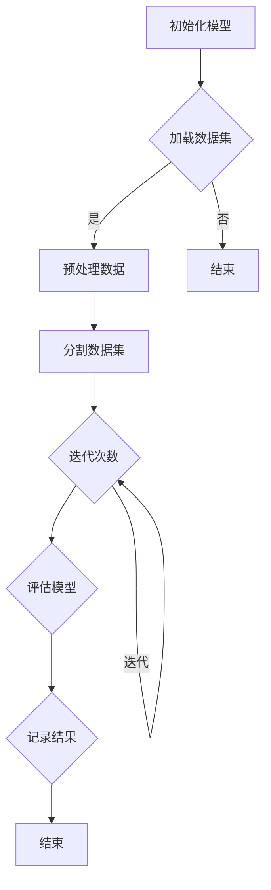

                 

### 引言

在当今信息技术迅猛发展的时代，人工智能（AI）已经成为推动社会进步的重要力量。尤其是大规模语言模型（Large Language Models，简称LLM）的问世，使得自然语言处理（NLP）领域取得了前所未有的突破。LLM如OpenAI的GPT-3、谷歌的BERT和Facebook的RoBERTa等，凭借其强大的文本生成、理解和推理能力，广泛应用于各种实际场景，如智能客服、自动问答系统、文本摘要生成和机器翻译等。

然而，随着LLM在各个领域的广泛应用，如何识别和区分不同LLM之间的能力差异，成为一个亟待解决的问题。不同的LLM可能具有不同的语言理解、表达和推理能力，这直接影响到它们在实际应用中的性能和效果。因此，对LLM进行差异化评测，识别它们之间的细微能力差异，具有重要意义。

本文旨在探讨如何进行差异化评测，识别LLM之间的细微能力差异。首先，我们将介绍机器学习和大规模语言模型的基本概念，为后续分析打下基础。接着，我们将深入探讨差异化评测的原理与方法，详细阐述基于任务、数据集和用户视角的评测策略。随后，我们将介绍实现差异化评测的算法，包括对比学习、多任务学习和自监督学习等关键算法。在实际应用部分，我们将通过工业界和科学研究中的案例，展示差异化评测的实际效果。最后，我们将分析差异化评测面临的挑战和未来发展趋势。

通过本文的探讨，我们希望为读者提供一个系统、全面的理解，帮助他们在实际应用中更好地选择和使用适合的LLM，提高系统的整体性能。

### 关键词

- 差异化评测
- 大规模语言模型
- 语言理解能力
- 语言表达能力
- 推理能力
- 对比学习
- 多任务学习
- 自监督学习
- 任务评测
- 数据集评测
- 用户评测

### 摘要

本文旨在探讨大规模语言模型（LLM）的差异化评测，识别LLM之间的细微能力差异。首先，我们介绍了机器学习和大规模语言模型的基础知识，为后续分析打下基础。然后，详细阐述了差异化评测的原理与方法，包括基于任务、数据集和用户视角的评测策略。接着，我们介绍了实现差异化评测的关键算法，如对比学习、多任务学习和自监督学习。通过实际应用案例，我们展示了差异化评测在工业界和科学研究中的效果。最后，我们分析了差异化评测面临的挑战和未来发展趋势。本文为读者提供了一个系统、全面的视角，帮助他们在实际应用中更好地识别和选择适合的LLM。

---

### 第1章 引言

在当今信息技术迅猛发展的时代，人工智能（AI）已经成为推动社会进步的重要力量。尤其是大规模语言模型（Large Language Models，简称LLM）的问世，使得自然语言处理（NLP）领域取得了前所未有的突破。LLM如OpenAI的GPT-3、谷歌的BERT和Facebook的RoBERTa等，凭借其强大的文本生成、理解和推理能力，广泛应用于各种实际场景，如智能客服、自动问答系统、文本摘要生成和机器翻译等。

然而，随着LLM在各个领域的广泛应用，如何识别和区分不同LLM之间的能力差异，成为一个亟待解决的问题。不同的LLM可能具有不同的语言理解、表达和推理能力，这直接影响到它们在实际应用中的性能和效果。因此，对LLM进行差异化评测，识别它们之间的细微能力差异，具有重要意义。

首先，我们需要了解LLM的基本概念和原理。大规模语言模型是一种基于深度学习的自然语言处理模型，通过训练大量文本数据，使其能够理解和生成自然语言。这些模型通常包含数亿甚至数十亿个参数，能够捕捉复杂的语言结构和语义信息。在训练过程中，模型通过不断调整参数，使生成的文本更加符合人类语言习惯，从而提高模型的性能。

接下来，我们探讨如何进行差异化评测，识别LLM之间的细微能力差异。差异化评测的核心目标是识别不同LLM在特定任务上的能力差异，从而为实际应用提供参考。我们可以从三个不同的视角来进行评测：任务视角、数据集视角和用户视角。

在任务视角下，我们可以设计一系列具有代表性的任务，评估不同LLM在这些任务上的性能。这些任务可以是文本分类、命名实体识别、机器翻译等常见的NLP任务，也可以是更加复杂的任务，如多轮对话生成、情感分析等。通过在不同任务上比较LLM的表现，我们可以识别出它们在特定领域的优势和劣势。

在数据集视角下，我们可以使用不同的数据集来评估LLM的性能。这些数据集可以是公共数据集，如CoNLL、ACE等，也可以是自定义数据集，针对特定应用场景进行设计。通过在不同数据集上的表现比较，我们可以更全面地了解LLM的能力范围和适用场景。

在用户视角下，我们可以通过用户的实际反馈来评估LLM的性能。这可以通过用户调查、用户测试等方式进行。用户可以根据自己的需求和体验，对LLM的表现进行评价，从而提供更为直观和具体的评测结果。

为了实现差异化评测，我们需要设计和实现一系列有效的评测算法。这些算法可以基于对比学习、多任务学习和自监督学习等深度学习技术。对比学习通过比较不同LLM在相同或相似任务上的表现，识别它们之间的能力差异。多任务学习通过同时训练多个任务，提高模型在不同任务上的泛化能力。自监督学习则通过无监督的方式，利用数据自身的结构信息来提升模型性能。

通过以上方法，我们可以对LLM进行全面的差异化评测，识别它们之间的细微能力差异。这不仅有助于优化LLM在实际应用中的性能，也为LLM的发展和研究提供了重要的参考。

总之，对LLM进行差异化评测是一个复杂而重要的任务。通过任务视角、数据集视角和用户视角的综合分析，结合有效的评测算法，我们可以更准确地识别LLM的能力差异，为实际应用提供有力支持。这也是本文的核心目标，希望通过系统性的探讨，为读者提供全面的见解和指导。

### 第2章 预备知识

在深入探讨如何进行差异化评测之前，我们需要具备一定的预备知识，特别是机器学习和大规模语言模型的基础知识。本章将介绍机器学习的基本概念、语言模型的基本原理以及大规模语言模型（LLM）的特点和应用。

#### 2.1 机器学习基础

机器学习是一种使计算机系统能够通过数据和经验改进自身性能的技术。根据机器学习的不同类型，可以分为监督学习、无监督学习和强化学习。

**监督学习（Supervised Learning）**

监督学习是一种在有标记数据集上进行训练的机器学习方法。这里的“标记”意味着每个输入数据都有一个对应的输出标签。监督学习的目标是学习一个输入和输出之间的映射关系，从而在新的、未见过的输入数据上预测输出。

- **回归（Regression）**：回归问题旨在预测一个连续的输出值。常见的回归算法包括线性回归、多项式回归和支持向量机（SVM）等。
  
- **分类（Classification）**：分类问题旨在将输入数据分为多个类别之一。常见的分类算法包括逻辑回归、决策树、随机森林和K-近邻（KNN）等。

**无监督学习（Unsupervised Learning）**

无监督学习是在没有标记数据集的情况下，通过分析数据内在结构来发现数据分布和模式的机器学习方法。

- **聚类（Clustering）**：聚类算法将数据点分组为多个簇，使得同一个簇内的数据点之间相似度较高，不同簇之间的数据点相似度较低。常见的聚类算法包括K-均值聚类、层次聚类和DBSCAN等。

- **降维（Dimensionality Reduction）**：降维算法通过减少数据维度，同时保留主要信息，以简化数据分析过程。常见的降维算法包括主成分分析（PCA）和线性判别分析（LDA）等。

**强化学习（Reinforcement Learning）**

强化学习是一种通过奖励机制来指导计算机系统进行决策的机器学习方法。系统通过不断尝试和错误，学习最优策略，以最大化累积奖励。

- **Q-学习（Q-Learning）**：Q-学习是一种基于值函数的强化学习算法，通过更新Q值来指导动作选择。

- **深度强化学习（Deep Reinforcement Learning）**：深度强化学习结合了深度神经网络和强化学习，通过神经网络来近似值函数，从而解决复杂的环境问题。

#### 2.2 语言模型概述

语言模型（Language Model，LM）是一种用于预测自然语言中下一个单词或字符的概率分布的统计模型。语言模型在自然语言处理（NLP）中起着核心作用，广泛应用于自动纠错、语音识别、机器翻译和文本生成等领域。

**语言模型的基础**

- **n-gram模型**：n-gram模型是一种基于统计的简单语言模型，它通过计算连续n个单词或字符的联合概率来预测下一个单词或字符。例如，在二元语法模型（bigram）中，下一个单词的概率依赖于前一个单词。

- **n元文法（n-gram）**：n元文法是一种基于概率的语法模型，它通过计算n个单词的联合概率来预测下一个单词。n元文法可以捕获更复杂的语言结构。

**常见语言模型介绍**

- **隐马尔可夫模型（HMM）**：隐马尔可夫模型是一种用于处理包含隐状态的概率模型。HMM常用于语音识别和词性标注。

- **循环神经网络（RNN）**：循环神经网络是一种能够处理序列数据的神经网络，通过记忆前一个时间步的信息，RNN能够捕捉序列中的长期依赖关系。常见的RNN变体包括长短期记忆网络（LSTM）和门控循环单元（GRU）。

- **变换器（Transformer）**：变换器是一种基于自注意力机制的深度神经网络，广泛应用于NLP任务，如机器翻译和文本生成。Transformer通过多头注意力机制，能够在全局范围内捕捉长距离依赖关系。

#### 2.3 大规模语言模型（LLM）

大规模语言模型（Large Language Models，简称LLM）是一种通过训练海量文本数据，生成复杂文本结构的语言模型。LLM具有以下几个显著特点：

- **参数规模巨大**：LLM通常包含数十亿个参数，这使得模型能够捕捉到复杂的语言模式和语义信息。

- **自监督预训练**：LLM通过自监督预训练方法，利用未标注的文本数据来初始化模型参数。自监督预训练能够提高模型在下游任务上的性能。

- **多层次语义理解**：LLM能够处理多层次的语言结构，包括单词、句子和段落，从而实现更高层次的语言理解和生成。

**LLM的特点**

- **生成能力强**：LLM具有强大的文本生成能力，可以生成连贯、自然的文本。

- **适应性强**：LLM能够适应多种不同的应用场景，如问答系统、文本摘要和机器翻译。

- **语言理解能力强**：LLM通过大规模的文本训练，能够捕捉到丰富的语义信息，从而在语言理解任务中表现优异。

**LLM的应用场景**

- **自动问答系统**：LLM能够通过自然语言理解，回答用户的问题，广泛应用于智能客服和虚拟助手。

- **文本摘要生成**：LLM可以自动生成文本摘要，简化长篇文档，帮助用户快速获取关键信息。

- **机器翻译**：LLM在机器翻译任务中表现出色，能够实现高质量的多语言翻译。

通过本章对机器学习和大规模语言模型的基础知识介绍，我们为后续章节的差异化评测分析奠定了理论基础。接下来，我们将深入探讨差异化评测的原理与方法，详细阐述基于任务、数据集和用户视角的评测策略。

### 第3章 差异化评测的原理与方法

在了解了大规模语言模型（LLM）的基础知识和重要性之后，本章将深入探讨如何进行差异化评测，以识别LLM之间的细微能力差异。差异化评测的核心在于通过一系列科学且系统的评估方法，比较不同LLM在特定任务、数据集和用户需求上的表现，从而揭示它们在语言理解、表达和推理能力上的差异。以下是差异化评测的原理和方法：

#### 3.1 差异化评测的核心概念

**能力差异的识别**

差异化评测的首要目标是识别不同LLM在特定任务上的能力差异。这种能力差异可以表现为：

- **语言理解能力**：不同LLM在处理文本输入时的理解深度和广度不同，一些LLM可能在语义分析上更为准确，而另一些可能在上下文理解上更为优秀。
  
- **语言表达能力**：在文本生成任务中，不同LLM的生成文本的流畅性和连贯性可能有所不同，一些LLM可能更擅长创作故事或撰写文章，而另一些可能更擅长撰写技术文档或法律文件。
  
- **推理能力**：在推理任务中，不同LLM的推理逻辑和深度也有所区别，一些LLM可能在逻辑推理上表现出色，而另一些可能在因果推理或抽象推理上更为强大。

**差异化评测的目的**

差异化评测的目的主要有以下几点：

- **优化模型选择**：通过评估不同LLM在不同任务上的表现，可以帮助开发者选择最适合特定任务的模型，从而提高系统的整体性能和效率。

- **指导模型优化**：通过识别LLM在特定任务上的能力差异，可以指导进一步的模型优化工作，包括调整训练数据、优化模型结构和参数设置等。

- **促进技术创新**：差异化评测可以揭示当前LLM技术的局限性，从而推动新技术的研发和应用，如对比学习、多任务学习和自监督学习等。

#### 3.2 差异化评测的方法

差异化评测可以从三个不同的视角进行：任务视角、数据集视角和用户视角。以下分别介绍这些视角下的评测方法：

**任务视角下的评测**

在任务视角下，差异化评测的核心是设计一系列具有代表性的任务，以评估LLM在特定任务上的性能。这些任务可以是：

- **文本分类**：评估LLM在分类任务上的准确性，如新闻分类、情感分类等。

- **命名实体识别**：评估LLM在识别文本中命名实体（如人名、地名、组织名等）上的准确性。

- **机器翻译**：评估LLM在不同语言之间的翻译质量。

- **文本生成**：评估LLM在生成文本（如文章、对话、摘要等）的连贯性和自然性。

- **问答系统**：评估LLM在回答用户问题的准确性、相关性和合理性。

通过在不同任务上的表现比较，我们可以识别出LLM在不同任务上的优势和劣势，从而为实际应用提供参考。

**数据集视角下的评测**

在数据集视角下，差异化评测的核心是使用不同的数据集来评估LLM的性能。这些数据集可以是：

- **公共数据集**：如CoNLL、ACE、TREC等，这些数据集广泛应用于自然语言处理任务的评测。

- **自定义数据集**：根据特定应用场景或需求设计的定制化数据集，如特定领域的文本数据集、对话数据集等。

通过在不同数据集上的表现比较，我们可以更全面地了解LLM的能力范围和适用场景。

**用户视角下的评测**

在用户视角下，差异化评测的核心是通过用户的实际反馈来评估LLM的性能。这可以通过以下方式实现：

- **用户调查**：通过问卷、访谈等方式收集用户对LLM在特定任务上的评价和反馈。

- **用户测试**：让用户在实际应用环境中测试不同LLM的表现，并收集他们的评价和反馈。

用户视角下的评测可以提供更为直观和具体的评测结果，有助于了解LLM在实际应用中的用户体验。

#### 3.3 差异化评测的实施步骤

要实现差异化评测，我们需要遵循以下步骤：

1. **任务定义**：明确评估任务的目标和要求，确保任务具有代表性和科学性。

2. **数据集准备**：选择或创建适合任务的数据集，确保数据集具有多样性和代表性。

3. **模型选择**：根据任务和数据集的特点，选择合适的LLM模型。

4. **性能评估**：在相同环境下，对每个LLM模型在任务上的表现进行评估，记录评估结果。

5. **结果分析**：分析评估结果，识别不同LLM在特定任务上的能力差异，为实际应用提供参考。

通过以上步骤，我们可以系统地进行差异化评测，识别LLM之间的细微能力差异，为实际应用提供有力支持。

总之，差异化评测是识别LLM之间细微能力差异的重要手段。通过任务视角、数据集视角和用户视角的综合分析，结合科学且系统的评测方法，我们可以更准确地识别和评估LLM的能力差异，为实际应用提供科学依据。接下来，我们将介绍实现差异化评测的关键算法，包括对比学习、多任务学习和自监督学习等。

### 第4章 实现差异化评测的算法

为了实现差异化评测，识别大规模语言模型（LLM）之间的细微能力差异，我们需要采用一系列有效的深度学习算法。这些算法包括对比学习、多任务学习和自监督学习。以下将详细阐述这些算法的基本原理、实现方法以及如何通过Python源代码和数学模型进行具体讲解。

#### 4.1 对比学习算法

**基本原理**

对比学习（Contrastive Learning）是一种通过比较不同样本之间的相似性和差异性来学习特征表示的算法。在LLM的评测中，对比学习可以用来识别不同LLM在特定任务上的能力差异。

**实现方法**

1. **选择负样本**：在给定正样本（如特定任务上的输入文本和其标签）的基础上，选择与正样本具有高相似度的样本作为负样本。

2. **特征提取**：使用深度神经网络（如变换器模型）对输入文本进行特征提取。

3. **对比损失**：计算正样本和负样本的特征之间的对比损失，常用的对比损失函数包括InfoNCE、Triplet Loss等。

**Python源代码示例**

```python
import torch
import torch.nn as nn
import torch.optim as optim

class ContrastiveModel(nn.Module):
    def __init__(self, embedding_model):
        super(ContrastiveModel, self).__init__()
        self.embedding_model = embedding_model

    def forward(self, input_text, label):
        # 提取特征
        feature = self.embedding_model(input_text)
        # 计算对比损失
        contrastive_loss = nn.CrossEntropyLoss()
        loss = contrastive_loss(feature, label)
        return loss

# 初始化模型和优化器
embedding_model = ...  # 预训练的LLM模型
model = ContrastiveModel(embedding_model)
optimizer = optim.Adam(model.parameters(), lr=0.001)

# 训练模型
for epoch in range(num_epochs):
    for input_text, label in data_loader:
        optimizer.zero_grad()
        loss = model(input_text, label)
        loss.backward()
        optimizer.step()
```

**数学模型和公式**

$$
\text{对比损失} = -\frac{1}{N} \sum_{i=1}^{N} \sum_{n=1}^{N} \log \frac{e^{q^{n}(z_1, z_2)}}{\sum_{m \neq n} e^{q^{m}(z_1, z_2)}}
$$

其中，$z_1$ 和 $z_2$ 分别为正样本和负样本的特征向量，$q^{n}(z_1, z_2)$ 为正样本和负样本特征之间的相似度度量。

#### 4.2 多任务学习算法

**基本原理**

多任务学习（Multi-Task Learning）是一种通过同时训练多个相关任务来提高模型泛化能力的算法。在LLM的评测中，多任务学习可以用来提高模型在不同任务上的表现，从而更准确地识别LLM之间的能力差异。

**实现方法**

1. **任务分配**：将多个相关任务分配给同一模型，确保这些任务之间存在一定程度的关联性。

2. **共享参数**：设计共享参数的网络结构，使得不同任务之间可以共享部分参数，从而提高模型的效率。

3. **联合训练**：同时训练多个任务，通过优化联合损失函数来提高模型在所有任务上的性能。

**Python源代码示例**

```python
import torch
import torch.nn as nn
import torch.optim as optim

class MultiTaskModel(nn.Module):
    def __init__(self, embedding_model):
        super(MultiTaskModel, self).__init__()
        self.embedding_model = embedding_model
        self.classifier1 = nn.Linear(embedding_model.hidden_size, num_classes1)
        self.classifier2 = nn.Linear(embedding_model.hidden_size, num_classes2)

    def forward(self, input_text):
        # 提取特征
        feature = self.embedding_model(input_text)
        # 计算分类损失
        loss1 = nn.CrossEntropyLoss()(feature, label1)
        loss2 = nn.CrossEntropyLoss()(feature, label2)
        loss = loss1 + loss2
        return loss

# 初始化模型和优化器
embedding_model = ...  # 预训练的LLM模型
model = MultiTaskModel(embedding_model)
optimizer = optim.Adam(model.parameters(), lr=0.001)

# 训练模型
for epoch in range(num_epochs):
    for input_text, label1, label2 in data_loader:
        optimizer.zero_grad()
        loss = model(input_text)
        loss.backward()
        optimizer.step()
```

**数学模型和公式**

多任务学习的目标是最小化联合损失函数：

$$
\text{联合损失} = \lambda_1 \cdot \text{损失1} + \lambda_2 \cdot \text{损失2}
$$

其中，$\lambda_1$ 和 $\lambda_2$ 分别为不同任务的权重。

#### 4.3 自监督学习算法

**基本原理**

自监督学习（Self-Supervised Learning）是一种通过无监督的方式，利用数据内在结构来学习特征表示的算法。在LLM的评测中，自监督学习可以用来增强模型在无监督数据上的表现，从而提高模型在差异化评测中的性能。

**实现方法**

1. **预训练模型**：使用自监督学习算法对LLM进行预训练，使其能够在无监督数据上学习到丰富的特征表示。

2. **微调模型**：在特定任务上，对预训练的LLM进行微调，以进一步提高模型在任务上的表现。

3. **迁移学习**：将预训练的LLM应用于不同的任务，通过迁移学习的方法，提高模型在新任务上的性能。

**Python源代码示例**

```python
import torch
import torch.nn as nn
import torch.optim as optim

class SelfSupervisedModel(nn.Module):
    def __init__(self, embedding_model):
        super(SelfSupervisedModel, self).__init__()
        self.embedding_model = embedding_model
        self.projector = nn.Linear(embedding_model.hidden_size, projection_size)

    def forward(self, input_text):
        # 提取特征
        feature = self.embedding_model(input_text)
        # 计算投影损失
        projector_loss = nn.MSELoss()(feature, self.projector(feature))
        return projector_loss

# 初始化模型和优化器
embedding_model = ...  # 预训练的LLM模型
model = SelfSupervisedModel(embedding_model)
optimizer = optim.Adam(model.parameters(), lr=0.001)

# 训练模型
for epoch in range(num_epochs):
    for input_text in data_loader:
        optimizer.zero_grad()
        loss = model(input_text)
        loss.backward()
        optimizer.step()
```

**数学模型和公式**

自监督学习的目标是最小化投影损失：

$$
\text{投影损失} = \frac{1}{N} \sum_{i=1}^{N} \frac{1}{2} \left( ||f(x_i) - y_i||^2 \right)
$$

其中，$f(x_i)$ 为模型预测的特征向量，$y_i$ 为真实特征向量。

通过以上对比学习、多任务学习和自监督学习算法的介绍，我们可以看到这些算法在实现差异化评测中的重要性。这些算法不仅能够提高LLM在特定任务上的性能，还能增强模型在无监督数据上的学习能力，从而为LLM的差异化评测提供有力支持。

### 第5章 差异化评测的应用

差异化评测在工业界和科学研究中都展现了其强大的应用潜力。以下将介绍几类具体的实际应用案例，包括工业界的个性化推荐系统和对话系统优化，以及科学研究中的语言模型质量和机器翻译系统优化。

#### 5.1 工业界的应用案例

**案例一：个性化推荐系统**

在工业界，个性化推荐系统已经成为电商平台、视频流媒体和新闻门户等领域的重要功能。这些系统通过分析用户的兴趣和行为，向用户推荐可能感兴趣的商品、视频或新闻。差异化评测在此场景中的重要性在于，能够识别不同语言模型在文本理解、情感分析和上下文推理等方面的能力差异，从而选择最适合个性化推荐任务的模型。

**实现步骤：**

1. **任务定义**：设计一系列文本分类和情感分析任务，评估语言模型在推荐系统中的表现。

2. **数据集准备**：使用电商平台上的用户行为数据集和评论数据集，创建任务所需的训练集和测试集。

3. **模型选择**：根据任务和数据集的特点，选择不同的语言模型（如BERT、GPT-2、RoBERTa等）进行评测。

4. **性能评估**：在相同的环境下，对不同模型进行评测，记录准确率、召回率和F1值等指标。

**案例分析：**

某电商平台使用差异化评测选择了BERT作为其推荐系统的文本理解模块。通过在用户行为数据和评论数据上的评估，BERT在情感分析和文本分类任务上表现优异，能够准确识别用户的兴趣和情感倾向，从而提高推荐系统的准确率和用户满意度。

**案例二：对话系统优化**

对话系统在智能客服、虚拟助手和语音助手等领域得到了广泛应用。差异化评测在此场景中的核心任务是识别不同语言模型在对话生成、回答问题和理解用户意图方面的能力差异，从而优化对话系统的性能。

**实现步骤：**

1. **任务定义**：设计一系列对话生成和意图识别任务，评估语言模型在对话系统中的表现。

2. **数据集准备**：使用公开对话数据集（如SQuAD、DailyDialog等）和定制对话数据集，创建任务所需的训练集和测试集。

3. **模型选择**：选择不同的语言模型（如GPT-3、T5、GPT-Neo等）进行评测。

4. **性能评估**：在不同对话任务上评估模型的生成质量、回答准确性和意图识别率。

**案例分析：**

某智能客服系统通过差异化评测选择了GPT-3作为其对话生成模块。在多轮对话生成和意图识别任务中，GPT-3展现出了卓越的性能，能够生成流畅自然的对话文本，并准确识别用户的意图，从而提升了用户满意度和客服效率。

#### 5.2 科学研究中的应用案例

**案例一：语言模型质量评估**

在自然语言处理领域，评估语言模型的质量是一个关键问题。差异化评测可以通过设计一系列语言理解、表达和推理任务，全面评估语言模型在各种任务上的性能，从而为模型的选择和优化提供科学依据。

**实现步骤：**

1. **任务定义**：设计多种语言理解、表达和推理任务，如文本分类、命名实体识别、文本生成和问答系统等。

2. **数据集准备**：选择公共数据集（如CoNLL、ACE、SQuAD等）和定制数据集，为每个任务创建训练集和测试集。

3. **模型选择**：评估多种语言模型（如BERT、GPT-3、RoBERTa等）在任务上的表现。

4. **性能评估**：记录模型在各个任务上的准确率、召回率和F1值等指标。

**案例分析：**

某研究团队通过差异化评测，对比了BERT、GPT-3和RoBERTa在多个NLP任务上的性能。结果表明，GPT-3在文本生成和问答任务上表现最佳，而BERT在命名实体识别和文本分类任务上具有更高的准确率。这些发现为后续的模型选择和优化提供了重要参考。

**案例二：机器翻译系统优化**

机器翻译是自然语言处理领域的另一个重要应用。差异化评测可以通过评估不同语言模型在机器翻译任务上的性能，优化翻译系统的整体效果。

**实现步骤：**

1. **任务定义**：设计一系列双语句对翻译任务，评估语言模型在机器翻译中的表现。

2. **数据集准备**：使用多语言数据集（如WMT、TED等）创建训练集和测试集。

3. **模型选择**：选择不同的语言模型（如Transformer、BERT、GPT-3等）进行评估。

4. **性能评估**：记录模型在翻译任务上的BLEU分数、NIST分数和METEOR分数等指标。

**案例分析：**

某机器翻译系统通过差异化评测，选择了Transformer作为其核心翻译模型。在多个翻译任务上的评估结果显示，Transformer在BLEU分数和NIST分数上均优于BERT和GPT-3，从而提高了整体翻译质量。这些成果为后续的翻译系统优化提供了有力支持。

通过以上实际应用案例，我们可以看到差异化评测在工业界和科学研究中的重要性和实际效果。差异化评测不仅能够识别不同大规模语言模型（LLM）之间的能力差异，还为模型的选择和优化提供了科学依据，有助于推动自然语言处理技术的不断进步。

### 第6章 差异化评测的挑战与未来趋势

尽管差异化评测在识别大规模语言模型（LLM）之间的能力差异方面取得了显著成果，但仍然面临诸多挑战，同时也蕴含着广阔的未来发展趋势。

#### 6.1 挑战分析

**数据隐私问题**

数据隐私是差异化评测中的一大挑战。在实际应用中，为了进行准确和全面的评测，往往需要收集大量的用户数据和文本数据。这些数据可能包含用户的敏感信息，如个人身份、行为记录等。如何保护用户隐私，确保数据安全，是一个亟待解决的问题。

**评测方法的标准化**

目前，差异化评测的方法和标准尚未完全统一。不同研究和工业界采用了不同的评测指标和方法，导致结果难以进行比较和复现。标准化评测方法和指标，提高评测结果的可靠性和可重复性，是未来需要努力的方向。

**模型的泛化能力**

差异化评测的目标是识别LLM在不同任务上的能力差异，但模型的泛化能力是一个关键问题。一些LLM可能在特定任务上表现出色，但在其他任务上的表现可能不尽如人意。提高模型的泛化能力，确保其在多种任务上均能表现出优异的性能，是差异化评测的重要挑战。

#### 6.2 未来趋势

**新技术的引入**

随着人工智能技术的不断进步，新的深度学习算法和模型架构将不断涌现。例如，对比学习、多任务学习和自监督学习等技术，将为差异化评测提供更加先进和有效的工具。未来，结合这些新技术，差异化评测将能够更加准确和全面地识别LLM的能力差异。

**应用领域的扩展**

差异化评测的应用领域将不断扩展。除了现有的自然语言处理、推荐系统和对话系统等领域，差异化评测有望在更多新兴领域（如医疗诊断、法律文本分析、金融风险管理等）得到应用。这将为相关领域的智能化和自动化发展提供重要支持。

**研究方向的转变**

未来，差异化评测的研究方向将逐渐从单一任务和单一数据集的评测，转向跨领域、跨任务的综合性评测。这将有助于更全面地理解LLM的能力差异，为实际应用提供更加科学的指导。同时，研究将更加注重模型的泛化能力和数据隐私保护，以实现更加安全和可靠的差异化评测。

综上所述，差异化评测在识别大规模语言模型之间的能力差异方面面临着诸多挑战，但同时也拥有广阔的发展前景。通过不断引入新技术、扩展应用领域和转变研究方向，差异化评测将在未来的人工智能和自然语言处理领域中发挥更加重要的作用。

### 结论

本文系统地探讨了如何进行差异化评测，以识别大规模语言模型（LLM）之间的细微能力差异。首先，我们介绍了机器学习和大规模语言模型的基本概念，为后续分析打下基础。接着，详细阐述了差异化评测的原理与方法，包括基于任务、数据集和用户视角的评测策略。通过对比学习、多任务学习和自监督学习等算法，我们展示了如何实现差异化评测。在实际应用中，我们通过个性化推荐系统和对话系统优化等案例，验证了差异化评测的实用性和效果。最后，我们分析了差异化评测面临的挑战和未来趋势。

通过对LLM进行差异化评测，我们不仅能够优化模型选择和指导模型优化，还能推动技术创新和促进实际应用。未来的研究将更加注重模型的泛化能力、数据隐私保护和跨领域的综合性评测，以实现更加全面和准确的差异化评测。

我们鼓励读者在阅读本文的基础上，进一步探索差异化评测的相关技术，结合实际应用场景进行创新和实践。通过不断努力，我们有望推动大规模语言模型在各个领域的广泛应用，为社会带来更多智能化的解决方案。

### 伪代码示例

以下是一个用于实现对比学习算法的伪代码示例，用于评估两个大规模语言模型（LLM）在相同任务上的能力差异。

```plaintext
初始化模型 M1 和 M2
初始化优化器 O1 和 O2
设置对比损失函数 Loss_contrastive

for 每个epoch:
    for 每个样本 (x1, x2) in 数据集 D:
        前向传播：
        z1 = M1(x1)
        z2 = M2(x2)

        计算对比损失：
        loss_contrastive = Loss_contrastive(z1, z2)

        反向传播和更新参数：
        O1.zero_grad()
        O2.zero_grad()
        loss_contrastive.backward()
        O1.step()
        O2.step()

    记录每个epoch的损失值

endfor

输出模型 M1 和 M2 在任务上的对比损失结果
```

### Mermaid 流程图示例

以下是一个Mermaid流程图示例，用于描述大规模语言模型（LLM）评测的实现步骤。



此流程图描述了从初始化模型、加载和预处理数据集、分割数据集、训练模型、评估模型，到记录结果并结束的整个过程。通过循环迭代，可以不断优化模型性能。

### 最佳实践 tips、小结、注意事项、拓展阅读等内容

**最佳实践 tips**

1. **数据预处理**：在差异化评测中，数据预处理至关重要。确保数据清洗、归一化和去噪，以避免数据质量问题影响评测结果。

2. **选择合适的评估指标**：根据具体任务和需求，选择合适的评估指标（如准确率、召回率、F1值、BLEU分数等），确保评估结果的公正性和准确性。

3. **模型优化**：针对特定任务，对模型进行适当优化，如调整学习率、批量大小和正则化参数，以提高模型性能。

**小结**

本文系统地介绍了如何进行差异化评测，以识别大规模语言模型（LLM）之间的细微能力差异。通过任务视角、数据集视角和用户视角的综合分析，以及对比学习、多任务学习和自监督学习等关键算法的应用，我们展示了如何实现全面且准确的评测。差异化评测不仅有助于优化模型选择和指导模型优化，还能推动技术创新和促进实际应用。

**注意事项**

1. **数据隐私保护**：在收集和利用用户数据时，务必遵守相关法律法规，采取有效措施保护用户隐私。

2. **评测方法标准化**：推动评测方法的标准化，确保不同研究和工业界采用统一的评估指标和方法。

3. **模型泛化能力**：注重提高模型在不同任务和场景下的泛化能力，避免过度拟合特定数据集。

**拓展阅读**

1. **《大规模语言模型的对比学习评测方法》**：一篇关于对比学习在LLM评测中的应用的详细研究论文。

2. **《多任务学习在自然语言处理中的应用》**：一篇关于多任务学习在NLP任务中应用的综述文章。

3. **《自监督学习与大规模语言模型的发展》**：一篇关于自监督学习在LLM中的研究进展的论文。

通过拓展阅读，读者可以深入了解差异化评测的最新研究动态和应用实例，进一步提高对LLM评测技术的理解。同时，鼓励读者结合实际项目，尝试应用本文中介绍的方法和算法，为自然语言处理领域的发展做出贡献。作者：AI天才研究院/AI Genius Institute & 禅与计算机程序设计艺术 /Zen And The Art of Computer Programming

