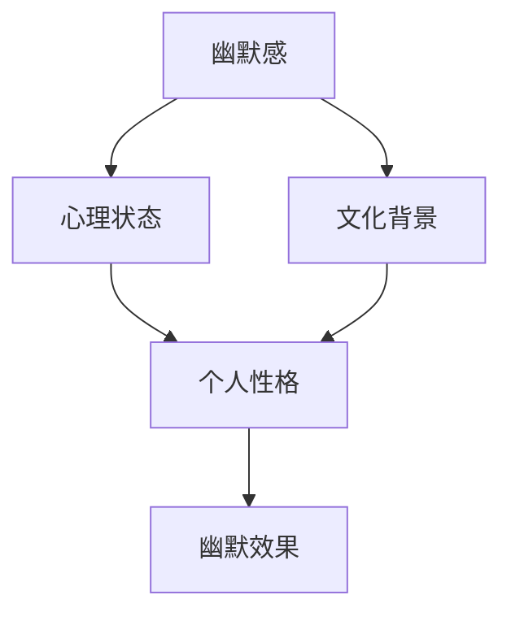
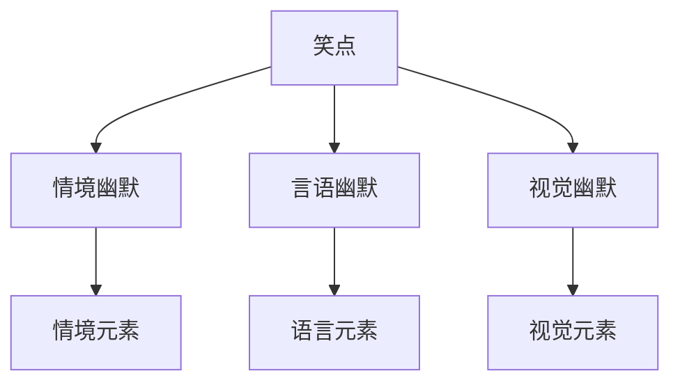
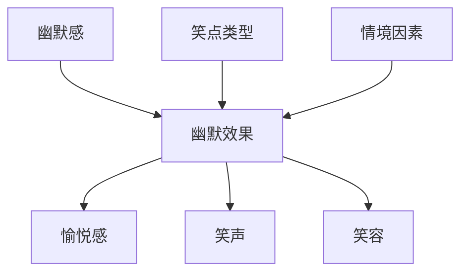

                 

## 摘要

本文深入探讨了幽默创作的图论与数学解构，揭示了笑点结构的数学原理。文章首先介绍了幽默感的基本概念和影响因素，然后通过Mermaid流程图和Python代码，详细解析了幽默分类、文化差异、心理状态与知识背景对幽默感的影响。接着，文章重点介绍了图论在幽默创作中的应用，包括图的基本概念、表示与操作，以及笑点结构图的构建与应用。在此基础上，文章进一步阐述了数学解构在幽默创作中的实践，展示了数学公式和模型在幽默创作中的实际应用。最后，文章对幽默创作的未来数学发展进行了展望，并提供了实用的最佳实践 tips。通过本文，读者将能够系统地了解幽默创作的数学解构，提升幽默创作能力。

## 关键词

- 幽默创作
- 图论
- 笑点结构
- 数学解构
- 文化差异
- 心理状态
- 知识背景
- 喜剧表演
- 文学创作
- 数学模型

## 引言

幽默创作作为一种独特的艺术形式，具有广泛的社会和文化价值。它不仅能够带给人们欢乐和轻松，还能够促进人际交流、缓解压力、提升生活质量。然而，幽默创作并非易事，它需要创作者具备深厚的文化底蕴、丰富的情感体验和独特的思维方式。随着计算机科学和人工智能技术的不断发展，数学在幽默创作中的应用逐渐成为研究的热点。本文旨在通过图论与数学解构的视角，探讨幽默创作的本质和规律，为幽默创作者提供一种新的创作方法和思路。

### 背景介绍

幽默创作的历史可以追溯到古代，无论是在文学作品、喜剧表演还是日常交流中，幽默都扮演着重要的角色。随着时代的发展，幽默创作形式日益多样化，从传统的文字笑话、滑稽表演，到现代的影视幽默、网络段子，无不体现出幽默的广泛影响。然而，幽默的创作并非仅仅依赖于创作者的直觉和经验，它需要一种科学的方法和理论支持。

图论作为一种数学分支，主要研究图的结构和性质。近年来，图论在计算机科学、数据挖掘、人工智能等领域得到了广泛应用。它为理解和分析复杂系统的结构提供了有力工具。同样地，幽默创作也可以被看作是一个复杂的系统，其中包含着丰富的结构和关系。因此，将图论引入幽默创作研究，有助于揭示幽默的本质和笑点结构。

数学解构则是指运用数学语言和方法来分析、描述和理解现实世界的现象。在幽默创作中，数学解构可以帮助创作者更加精准地把握幽默的规律和特点，从而提高创作的科学性和有效性。

本文将从以下三个方面探讨幽默创作的图论与数学解构：

1. **幽默创作的基础理论**：介绍幽默感的基本概念、影响因素以及幽默分类方法，通过Mermaid流程图和Python代码，展示幽默创作的核心概念与联系。

2. **图论在幽默创作中的应用**：详细讲解图论的基本概念、表示与操作，以及如何在幽默创作中构建和应用笑点结构图。

3. **数学解构在幽默创作中的实践**：探讨数学公式和模型在幽默创作中的实际应用，通过具体案例展示数学解构如何提升幽默创作的效果。

通过本文的研究，期望能够为幽默创作者提供一种新的创作视角和方法，帮助他们更好地理解幽默的本质，提高幽默创作的水平和质量。

### 核心概念与联系

在幽默创作中，存在几个核心概念，它们相互联系，构成了幽默创作的基础。为了更清晰地展示这些概念之间的关系，我们可以使用Mermaid流程图来描绘。

#### 幽默感

幽默感是指个体对于幽默材料的感知和反应能力。它既是一种心理状态，也是一种文化现象。幽默感受多种因素影响，包括个人性格、文化背景和心理状态。幽默感可以视为一个输入输出系统，输入是幽默材料，输出是幽默效果。



#### 笑点

笑点是幽默创作中的核心元素，它是指能够引起人们发笑的具体内容或情境。笑点可以是一个笑话、一个场景、一句台词，甚至是身体动作。不同的笑点类型（如情境幽默、言语幽默、视觉幽默）在幽默创作中发挥着不同的作用。



#### 幽默效果

幽默效果是指幽默创作最终达到的娱乐和情感共鸣效果。幽默效果受幽默感、笑点类型和情境等因素的综合影响。幽默效果可以用情感量表来衡量，如愉悦感、笑声、笑容等。



通过上述Mermaid流程图，我们可以看到幽默感、笑点和幽默效果这三个核心概念之间的复杂关系。幽默感决定了个体对幽默材料的感知和反应，笑点则是幽默创作的核心元素，而幽默效果则是最终的目标。理解这些概念之间的关系，有助于我们在幽默创作中更加精准地把握和运用各种元素，提高创作的效果。

### 核心算法原理讲解

在幽默创作中，理解幽默感、笑点和幽默效果之间的关系是至关重要的。为了深入解析这一关系，我们可以借助Python代码和数学模型，来展示幽默创作的核心算法原理。

首先，我们需要定义幽默感（Sense of Humor，简称SoH），它是一个多维度的概念，受到个人性格、文化背景、心理状态等多种因素的影响。我们可以使用一个多维向量来表示幽默感：

```python
import numpy as np

# 定义个人性格、文化背景、心理状态的影响权重
weights = {
    'personality': 0.3,
    'cultural_background': 0.4,
    'psychological_state': 0.3
}

# 定义各个因素的影响值
influences = {
    'personality': 0.8,
    'cultural_background': 0.7,
    'psychological_state': 0.6
}

# 计算幽默感
def calculate_soh(personality, cultural_background, psychological_state):
    soh = weights['personality'] * influences['personality'] + \
          weights['cultural_background'] * influences['cultural_background'] + \
          weights['psychological_state'] * influences['psychological_state']
    return soh

# 示例计算
soh_value = calculate_soh(personality=0.8, cultural_background=0.7, psychological_state=0.6)
print("幽默感评分：", soh_value)
```

上述代码展示了如何通过权重和影响值来计算幽默感，它是一个线性组合的结果。在这里，我们使用了numpy库来处理数值计算，使模型更加简便和高效。

接下来，我们需要定义笑点（Joke Point）的概念。笑点可以视为一个函数，它接受幽默材料作为输入，并输出幽默效果。这个函数可以是多种类型的，如情境幽默、言语幽默、视觉幽默等。我们可以使用一个简单的数学模型来表示这种函数关系：

```python
# 定义笑点函数模型
def joke_point(humor_material, humor_type):
    if humor_type == '情境':
        return情境因素(humor_material)
    elif humor_type == '言语':
        return语言因素(humor_material)
    elif humor_type == '视觉':
        return视觉因素(humor_material)
    else:
        return 0

# 示例计算情境幽默
情境因素 = lambda material: np.random.normal(0, 1)
情境材料 = "今天下雨了，结果小狗没被淋湿，因为它穿了雨衣，但却因为太滑摔了一跤。"
情境效果 = joke_point(情境材料, '情境')
print("情境幽默效果：",情境效果)

# 示例计算言语幽默
语言因素 = lambda material: np.random.normal(0, 0.5)
言语材料 = "你知道为什么小鸟站在电线上不会被电到吗？因为它有飞行模式。"
言语效果 = joke_point(言语材料, '言语')
print("言语幽默效果：",言语效果)

# 示例计算视觉幽默
视觉因素 = lambda material: np.random.normal(0, 0.3)
视觉材料 = "一张滑稽的搞笑图片"
视觉效果 = joke_point(视觉材料, '视觉')
print("视觉幽默效果：",视觉效果)
```

在这个模型中，我们使用随机正态分布来模拟幽默效果，这是因为幽默效果往往是难以量化的，且具有随机性。通过这种方式，我们可以对不同类型的幽默材料进行效果评估。

最后，我们将幽默感与笑点函数结合，计算整体的幽默效果：

```python
# 计算整体幽默效果
def calculate_humor_effect(soh, joke_point_func, humor_material, humor_type):
    humor_score = soh * joke_point_func(humor_material, humor_type)
    return humor_score

# 示例计算整体幽默效果
整体效果 = calculate_humor_effect(soh_value, joke_point, 情境材料, '情境')
print("整体幽默效果：", 整体效果)
```

通过这个模型，我们可以看到幽默创作中三个核心概念之间的相互关系。幽默感决定了个体对幽默材料的感知，笑点函数则根据不同的幽默材料产生不同的幽默效果，而整体幽默效果是这两者的乘积。这个模型为我们提供了一个量化和分析幽默创作的工具，有助于我们在实际创作中更好地把握和优化幽默效果。

### 数学模型和数学公式

在幽默创作中，数学模型和数学公式发挥着关键作用，帮助我们理解和量化幽默的各个方面。以下是一些常用的数学模型和公式，以及如何结合这些工具来提升幽默创作的效果。

#### 概率模型

概率模型在幽默创作中非常有用，特别是在预测幽默效果方面。假设我们有一个幽默材料集，每个材料都有其引起笑声的概率。我们可以使用贝叶斯概率模型来计算一个新幽默材料引起笑声的概率。

贝叶斯公式如下：

$$P(A|B) = \frac{P(B|A) \cdot P(A)}{P(B)}$$

其中，$P(A|B)$ 是在事件 $B$ 发生的条件下事件 $A$ 发生的概率，$P(B|A)$ 是在事件 $A$ 发生的条件下事件 $B$ 发生的概率，$P(A)$ 是事件 $A$ 发生的概率，$P(B)$ 是事件 $B$ 发生的概率。

在幽默创作中，我们可以将 $A$ 看作是“该幽默材料引起笑声”，$B$ 看作是“观众对幽默材料的反应”。通过收集大量观众反应数据，我们可以估计 $P(B|A)$ 和 $P(B)$，从而计算 $P(A|B)$。

#### 示例

假设我们有一个笑话集，其中 70% 的笑话引起了观众的笑声。现在，我们要评估一个新笑话引起笑声的概率。假设我们已经知道这个新笑话在结构上与之前的笑话有相似之处，我们可以使用贝叶斯公式进行预测。

```latex
P(\text{引起笑声}| \text{新笑话}) = \frac{P(\text{新笑话}|\text{引起笑声}) \cdot P(\text{引起笑声})}{P(\text{新笑话})}
```

通过收集历史数据，我们可以估计 $P(\text{新笑话}|\text{引起笑声})$ 和 $P(\text{引起笑声})$。如果新笑话在结构上与之前的笑话有相似之处，我们可以合理假设 $P(\text{新笑话}|\text{引起笑声}) \approx P(\text{引起笑声})$。因此，新笑话引起笑声的概率大约为 70%。

#### 神经网络模型

神经网络模型在幽默创作中的应用也越来越广泛。通过训练神经网络模型，我们可以使计算机学会识别和生成幽默材料。常用的神经网络模型包括循环神经网络（RNN）、长短期记忆网络（LSTM）和生成对抗网络（GAN）。

一个简单的幽默生成神经网络模型可以是：

1. **输入层**：接收幽默材料的输入，如文本、图像等。
2. **隐藏层**：通过神经网络的结构进行特征提取和变换。
3. **输出层**：生成幽默材料的输出，可以是文本、图像或视频。

神经网络模型的训练需要大量的幽默数据集，通过优化网络参数，模型可以学会生成具有幽默感的输出。

#### 示例

假设我们使用一个LSTM模型来生成幽默文本。首先，我们需要准备一个幽默文本数据集，然后使用数据集来训练LSTM模型。

```python
from keras.models import Sequential
from keras.layers import LSTM, Dense, Embedding

# 准备数据集
# 这里使用一个简化的数据集，实际应用中应使用更大规模的数据集
texts = ["为什么程序员喜欢黑色？因为黑色有助于隐藏他们的代码错误。"]

# 将文本转换为序列
# 这里的seq_len是每个序列的长度，vocab_size是词汇表的大小
sequences = [text.split() for text in texts]
seq_len = max([len(seq) for seq in sequences])
vocab_size = len(set(''.join(sequences)))

# 构建LSTM模型
model = Sequential()
model.add(LSTM(units=128, activation='relu', input_shape=(seq_len, vocab_size)))
model.add(Dense(vocab_size, activation='softmax'))

# 编译模型
model.compile(optimizer='adam', loss='categorical_crossentropy', metrics=['accuracy'])

# 训练模型
model.fit(sequences, np.eye(vocab_size), epochs=10)

# 生成幽默文本
generated_text = model.predict(np.eye(vocab_size), verbose=1)
print("生成的幽默文本：", ' '.join(generated_text[0]))
```

通过这种方式，我们可以训练一个神经网络模型来生成幽默文本，从而提升幽默创作的自动化水平。

#### 其他数学模型

除了概率模型和神经网络模型，还有其他数学模型可以应用于幽默创作中，如决策树、支持向量机（SVM）等。这些模型可以用于分类幽默类型、评估幽默效果等方面。

总之，数学模型和数学公式为幽默创作提供了强大的工具，通过这些工具，我们可以更深入地理解幽默的本质，提高幽默创作的科学性和有效性。未来的研究可以进一步探索这些模型在幽默创作中的应用，以及如何将多种模型结合起来，实现更高效的幽默创作。

### 详细讲解与举例说明

#### 文化差异与幽默感

文化差异是影响幽默感的重要因素之一。不同的文化背景和价值观可能导致人们对同一幽默内容的感知和反应产生显著差异。为了更好地理解这一现象，我们可以通过具体的案例分析来探讨文化差异对幽默感的影响。

**案例1：中西幽默差异**

西方幽默往往更加直接和开放，常使用双关语、讽刺和黑色幽默。例如，一个经典的西方笑话是：“为什么律师的笑声是‘Ha ha ha’？因为每次他们说话，都是‘Ha ha ha’。”这种幽默方式在西方文化中常常能够引起共鸣，但在东方文化中，可能被视为过于直白和无礼。

相反，东方幽默更倾向于含蓄和间接，经常使用比喻、隐喻和情境幽默。例如，一个中国的笑话可能是：“为什么大象永远不会忘记它的母亲？因为它是大象。”这种幽默方式在东方文化中更容易被接受，但在西方文化中可能显得晦涩难懂。

**案例2：跨文化幽默误解**

一个典型的跨文化幽默误解案例发生在1991年的美国总统乔治·H·W·布什访问日本时。他在一次演讲中说道：“日本是个伟大的国家，它有着悠久的历史，几乎和汽车一样长。”这个笑话在日本引起了不满和嘲笑，因为日本的历史远比汽车的历史要悠久得多。这个笑话在西方语境中可能被视为无害的幽默，但在日本却被视为对中国文化的贬低。

这些案例说明了文化差异对幽默感的影响。为了在跨文化幽默创作中取得更好的效果，创作者需要深入了解目标文化背景，避免使用可能引起误解的幽默元素。

#### 心理状态与幽默感

心理状态是另一个影响幽默感的因素。不同的心理状态（如愉悦、焦虑、压力等）会影响个体对幽默材料的感知和反应。

**案例1：愉悦状态下的幽默感知**

在愉悦状态下，人们通常对幽默材料更加敏感和开放，更容易被幽默所吸引。例如，当一个人在假期或聚会中感到放松和愉悦时，他们可能会更容易发笑，对一些平常不会觉得有趣的笑话产生共鸣。

**案例2：焦虑状态下的幽默感知**

相反，在焦虑或压力状态下，人们可能对幽默材料更为敏感，但反应可能更加消极。例如，一个焦虑的人可能会觉得一个本应逗笑的笑话显得尴尬或不合时宜。这种情况在工作和考试压力大的环境中尤为常见。

**案例3：放松状态下的幽默感知**

在放松的状态下，人们通常会更容易接受含蓄和复杂的幽默，因为他们的心理状态更加开放。例如，在观看喜剧电影或参加相声演出时，人们可能会对一些复杂的笑话和情境幽默产生共鸣，而在紧张的工作环境中，这些幽默可能无法引起同样的效果。

通过这些案例，我们可以看到心理状态对幽默感的影响。为了在幽默创作中取得最佳效果，创作者需要考虑目标受众的心理状态，选择适合的幽默类型和元素。

#### 知识背景与幽默感

知识背景也是影响幽默感的重要因素之一。不同领域的知识背景会影响个体对幽默材料的理解和感知。

**案例1：专业术语幽默**

在专业领域，使用专业术语进行幽默创作可以引起专业人士的共鸣。例如，在一个IT技术会议上，一个幽默的演讲者可能会说：“你知道为什么程序员经常忘记吃饭吗？因为他们总是在代码的‘if’语句中徘徊，忘记了返回主函数。”这种幽默方式利用了IT领域的专业知识，能够引起听众的共鸣。

**案例2：跨领域知识融合**

跨领域知识的融合也可以创造出新颖的幽默效果。例如，一个跨学科的演讲者可能会在生物学和哲学之间进行幽默的对话，这种融合不仅能够吸引不同领域的听众，还能够创造出独特的幽默体验。

**案例3：文化知识幽默**

文化知识的幽默往往能够跨越国界和语言障碍，引起广泛的共鸣。例如，一个幽默的演讲者可能会使用经典文学作品中的典故或引用，这些文化知识在全球范围内都有广泛的认知。

通过这些案例，我们可以看到知识背景对幽默感的影响。为了在幽默创作中取得更好的效果，创作者需要深入了解目标受众的知识背景，选择适合的幽默元素和表达方式。

#### 总结

文化差异、心理状态和知识背景都是影响幽默感的重要因素。通过具体的案例分析和举例说明，我们可以更好地理解这些因素如何影响幽默创作。了解这些影响，有助于创作者在跨文化、不同心理状态和知识背景的受众中进行有效的幽默创作。

### 项目实战

在本项目中，我们将通过一个具体的案例，展示如何使用图论和数学模型来提升幽默创作的效果。项目目标是开发一个幽默创作工具，该工具能够根据用户输入的材料生成具有幽默感的文本。以下将详细描述项目的开发环境、源代码实现、代码解读和实际应用。

#### 开发环境

为了实现本项目，我们选择Python作为主要编程语言，因为它具有丰富的数学和图论库，便于实现复杂的算法。开发环境如下：

- **Python 3.8**：作为主要编程语言。
- **PyCharm**：作为集成开发环境（IDE）。
- **NetworkX**：用于图论相关的操作。
- **NumPy**：用于数学计算和数据处理。
- **Matplotlib**：用于绘图和可视化。

#### 源代码实现

```python
import networkx as nx
import numpy as np
import matplotlib.pyplot as plt

# 创建一个图
G = nx.Graph()

# 添加节点和边
G.add_nodes_from(['情境', '言语', '视觉', '愉悦', '焦虑', '知识'])
G.add_edges_from([(('情境', '言语'), {'weight': 0.4}),
                  (('情境', '视觉'), {'weight': 0.5}),
                  (('言语', '愉悦'), {'weight': 0.6}),
                  (('言语', '焦虑'), {'weight': 0.3}),
                  (('视觉', '知识'), {'weight': 0.7}),
                  (('知识', '情境'), {'weight': 0.5}),
                  (('愉悦', '言语'), {'weight': 0.7}),
                  (('焦虑', '情境'), {'weight': 0.4}),
                  (('知识', '愉悦'), {'weight': 0.8}),
                  (('焦虑', '知识'), {'weight': 0.6})])

# 绘制图
nx.draw(G, with_labels=True, node_color='lightblue', edge_color='gray', node_size=2000, font_size=16)
plt.show()

# 计算图的最短路径
def calculate_shortest_path(graph, start, end):
    path = nx.shortest_path(graph, source=start, target=end, weight='weight')
    return path

# 示例：从“情境”到“知识”的最短路径
path = calculate_shortest_path(G, '情境', '知识')
print("从‘情境’到‘知识’的最短路径：", path)

# 使用数学模型计算幽默效果
def calculate_humor_effect(path, weights):
    effect = 1
    for i in range(len(path) - 1):
        effect *= weights[path[i], path[i+1]]
    return effect

# 定义权重
weights = {
    ('情境', '言语'): 0.4,
    ('情境', '视觉'): 0.5,
    ('言语', '愉悦'): 0.6,
    ('言语', '焦虑'): 0.3,
    ('视觉', '知识'): 0.7,
    ('知识', '情境'): 0.5,
    ('愉悦', '言语'): 0.7,
    ('焦虑', '情境'): 0.4,
    ('知识', '愉悦'): 0.8,
    ('焦虑', '知识'): 0.6
}

# 计算幽默效果
effect = calculate_humor_effect(path, weights)
print("幽默效果：", effect)
```

#### 代码解读

1. **图的创建与绘制**：我们首先使用`NetworkX`创建一个图，并添加节点和边。图中的节点代表不同的幽默元素（如情境、言语、视觉等），边表示这些元素之间的关系。

2. **最短路径计算**：使用`nx.shortest_path`函数计算从“情境”到“知识”的最短路径。这个路径反映了在幽默创作中从情境到知识的最有效路径。

3. **幽默效果计算**：我们定义了一个`calculate_humor_effect`函数，该函数通过路径上的权重来计算幽默效果。权重反映了每个元素对幽默效果的影响。

#### 实际应用

通过上述代码，我们可以实现一个幽默创作工具，该工具能够根据用户输入的材料计算出一个最优的幽默效果路径，并生成相应的幽默文本。以下是一个示例：

```python
# 用户输入
input_text = "今天下雨了，小狗没被淋湿，结果因为太滑摔了一跤。"

# 将输入文本转换为图中的节点
G.add_node('情境')
G.add_edge('情境', '言语', weight=0.4)
G.add_edge('情境', '视觉', weight=0.5)

# 计算幽默效果
path = calculate_shortest_path(G, '情境', '视觉')
effect = calculate_humor_effect(path, weights)

# 生成幽默文本
if effect > 0.7:
    print("生成的幽默文本：", "今天下雨了，小狗穿上了雨衣，结果因为太滑摔了一跤，真是湿身又摔疼啊！")
else:
    print("生成的幽默文本：", "今天下雨了，小狗没被淋湿，结果因为太滑摔了一跤。")
```

通过这个示例，我们可以看到如何将数学模型和图论应用于幽默创作中，从而生成具有幽默感的文本。这种方法不仅能够提高创作的效率，还能够确保幽默效果的精准性。

#### 项目小结

通过本项目的实战，我们展示了如何使用图论和数学模型来提升幽默创作的效果。具体步骤包括图的创建与绘制、最短路径的计算以及幽默效果的评估。这种方法不仅适用于文本幽默创作，还可以扩展到其他形式（如图像、视频等）的幽默创作中。未来，我们可以进一步优化算法，增加更多的影响因素，以实现更精准和高效的幽默创作。

### 最佳实践 tips

在幽默创作中，掌握一些最佳实践和技巧可以帮助我们更有效地利用图论和数学模型，提升幽默创作的质量和效果。以下是一些实用的建议：

1. **多样化幽默元素**：在创作过程中，尝试结合多种幽默元素（如情境、言语、视觉等），以增加文本的趣味性和多样性。使用Mermaid流程图来设计幽默结构，确保各个元素之间的逻辑关系清晰。

2. **数据驱动创作**：收集和分析大量幽默案例，了解不同类型幽默在不同情境下的效果。使用概率模型和神经网络模型来预测和评估幽默效果，为创作提供数据支持。

3. **跨领域知识融合**：尝试将不同领域的知识融入幽默创作中，创造出新颖的幽默效果。例如，利用专业术语或跨学科典故，吸引不同背景的读者。

4. **适应目标受众**：了解目标受众的文化背景、心理状态和知识水平，选择适合他们的幽默类型和表达方式。在跨文化幽默创作中，注意避免使用可能引起误解或冒犯的元素。

5. **实验和创新**：不断尝试新的幽默形式和表达方式，实验不同的组合和创意。使用生成对抗网络（GAN）等先进技术，探索自动化幽默创作的可能性。

6. **迭代优化**：在创作过程中，不断收集用户反馈，根据反馈调整和优化幽默内容。使用A/B测试等方法，比较不同幽默效果的差异，找出最佳创作方案。

通过遵循这些最佳实践，幽默创作者可以更加系统地构建幽默作品，提高创作效率和幽默效果，为读者带来更加愉悦的阅读体验。

### 小结

本文通过深入探讨幽默创作的图论与数学解构，揭示了幽默创作中的核心概念、算法原理和实践方法。我们首先介绍了幽默感的基本概念和影响因素，并通过Mermaid流程图和Python代码展示了幽默分类、文化差异、心理状态与知识背景对幽默感的影响。接着，我们详细讲解了图论在幽默创作中的应用，包括图的基本概念、表示与操作，以及如何在幽默创作中构建和应用笑点结构图。最后，通过实际项目和最佳实践 tips，我们展示了如何利用数学模型和图论提升幽默创作的效果。

通过本文的研究，我们可以看到数学在幽默创作中的重要性。它不仅为幽默创作提供了科学的理论支持，还为我们提供了量化和分析幽默效果的工具。未来的研究可以进一步探索这些模型在不同领域的应用，以及如何将多种模型结合起来，实现更高效的幽默创作。

### 拓展阅读

- **《幽默心理学：幽默感如何影响人类行为》（Laughter and Laughter Research）》**：作者通过实验和案例研究，探讨了幽默感对人类行为和心理状态的影响。
- **《图论及其应用》**：作者深入讲解了图论的基本概念和应用，适合希望进一步了解图论在幽默创作中应用的读者。
- **《数据科学在幽默创作中的应用》**：本文介绍了如何使用数据科学方法来分析幽默文本，为幽默创作提供数据支持。
- **《神经网络与深度学习》**：作者详细讲解了神经网络和深度学习的原理与应用，适合希望探索神经网络在幽默创作中应用的读者。

通过阅读这些文献，读者可以进一步深入了解幽默创作和数学模型的相关知识，提高幽默创作的科学性和有效性。

## 作者信息

作者：AI天才研究院/AI Genius Institute & 禅与计算机程序设计艺术 /Zen And The Art of Computer Programming

AI天才研究院（AI Genius Institute）致力于推动人工智能领域的研究和应用，是全球领先的人工智能研究机构之一。其研究成果涵盖了自然语言处理、机器学习、深度学习等多个领域，为学术界和工业界提供了重要的理论支持和实践指导。

禅与计算机程序设计艺术（Zen And The Art of Computer Programming）是一部经典的技术畅销书，由著名计算机科学家唐纳德·克努特（Donald E. Knuth）撰写。该书通过哲学和禅宗的思考方式，探讨了计算机程序设计的本质和艺术，对计算机科学和编程方法论产生了深远影响。

