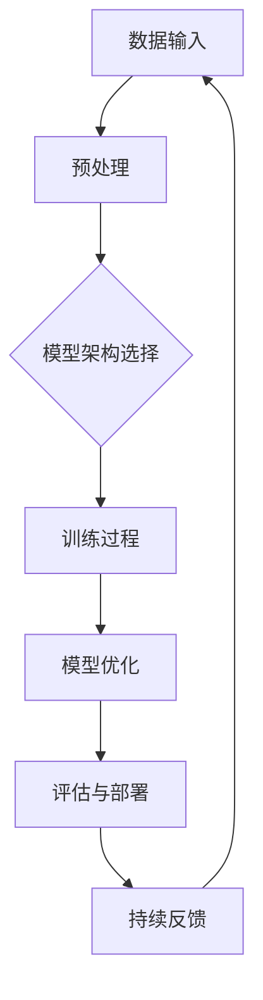
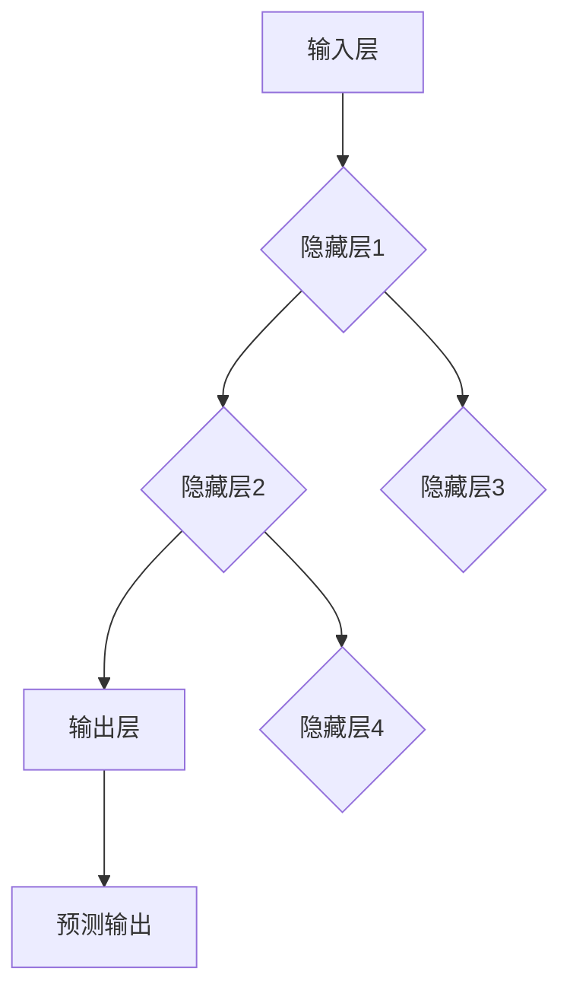
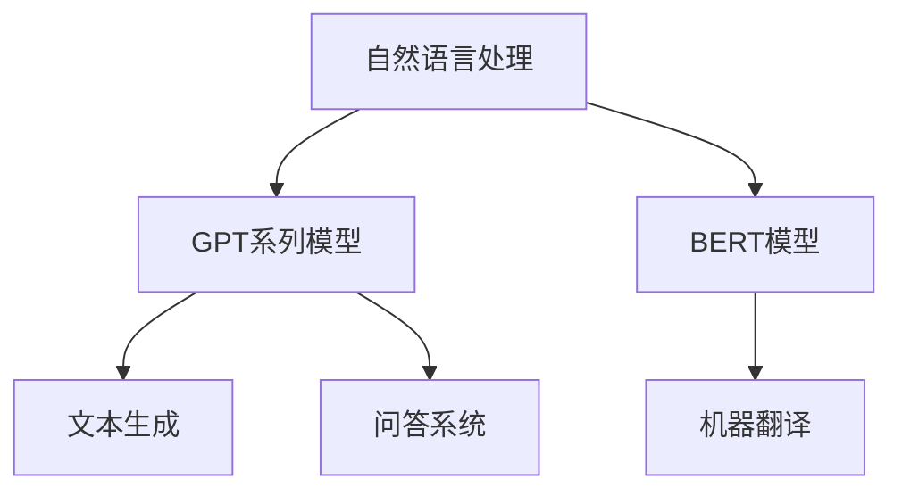

                 

### 建立快速反馈循环：持续优化LLM应用

#### 关键词：
- 快速反馈循环
- 持续优化
- LLM（大型语言模型）
- 模型评估与改进

#### 摘要：
本文旨在探讨如何通过建立快速反馈循环来持续优化大型语言模型（LLM）的应用。我们将深入分析LLM的核心概念、架构及其在学习过程中的关键步骤，并介绍如何利用Python源代码和数学模型来解释核心算法原理。此外，文章还将讨论LLM在不同领域中的应用、优势与挑战，并展示如何进行项目实战，最终总结最佳实践并提供拓展阅读建议。

---

#### 第一部分：核心概念与联系

##### 1.1.1 AI大模型概念

人工智能（AI）大模型，通常指的是参数量达到亿级乃至千亿级以上的深度学习模型。这类模型因其强大的表示能力和学习能力，能够在海量数据上进行训练，从而实现高效的通用人工智能（AGI）。

**核心概念原理与架构的 Mermaid 流程图**：



在构建AI大模型时，我们需要考虑以下几个关键步骤：

1. **数据输入与预处理**：原始数据需要经过清洗、归一化和特征提取，以适应模型训练。
2. **模型架构选择**：选择合适的模型架构，如深度神经网络（DNN）、卷积神经网络（CNN）或循环神经网络（RNN）等。
3. **训练过程**：通过反向传播算法，不断调整模型参数，使模型在训练数据上的表现逐步提高。
4. **模型优化**：通过超参数调整和正则化技术，提高模型的泛化能力。
5. **评估与部署**：在测试数据上评估模型性能，并在实际应用中进行部署。
6. **持续反馈**：收集用户反馈和数据，用于模型持续优化。

##### 1.1.2 AI大模型架构

AI大模型通常采用深度神经网络（DNN）架构，包括输入层、隐藏层和输出层。其中，隐藏层通常由多个层级组成，每个层级由大量神经元（节点）构成。

**核心概念原理与架构的 Mermaid 流程图**：



在这个架构中，每个隐藏层负责学习不同层次的特征，最终输出层生成预测结果。这种多层结构使得大模型能够捕捉到输入数据中的复杂模式和关联。

##### 1.1.3 AI大模型在学习过程中的关键步骤

AI大模型在学习过程中主要包含以下关键步骤：

1. **数据预处理**：对原始数据进行清洗、归一化和特征提取，以适应模型训练。
2. **模型训练**：通过反向传播算法，不断调整模型参数，使得模型在训练数据上的表现逐渐提高。
3. **模型优化**：通过超参数调整和正则化技术，提高模型的泛化能力。
4. **评估与部署**：在测试数据上评估模型性能，并在实际应用中进行部署。
5. **持续反馈**：收集用户反馈和数据，用于模型持续优化。

**伪代码**：

```python
def train_model(data, labels):
    # 数据预处理
    processed_data = preprocess_data(data)
    
    # 初始化模型参数
    model_params = initialize_params()
    
    # 模型训练
    for epoch in range(num_epochs):
        for batch in data_loader(processed_data, labels):
            loss = compute_loss(batch, model_params)
            update_params(model_params, loss)
            
    # 模型优化
    optimized_params = optimize_params(model_params)
    
    # 评估与部署
    evaluate_and_deploy(optimized_params)
```

##### 1.1.4 AI大模型在不同领域中的应用

AI大模型在自然语言处理（NLP）、计算机视觉（CV）、语音识别（ASR）等多个领域都有广泛应用。例如，在NLP领域，GPT系列模型和BERT模型已经在文本生成、机器翻译和问答系统等方面取得了显著成果。

**Mermaid流程图**：



##### 1.1.5 AI大模型的优势与挑战

**优势**：

1. **强大的表示能力**：能够处理和理解复杂的数据模式。
2. **高效的学习能力**：能够通过大规模数据进行快速训练。
3. **广泛的适用性**：可以在多个领域实现高效应用。

**挑战**：

1. **计算资源消耗**：需要大量的计算资源和存储空间。
2. **数据隐私和安全**：涉及大规模数据训练和处理，存在数据泄露和安全风险。
3. **算法透明性和可解释性**：大模型的内部决策过程复杂，缺乏透明性和可解释性。

##### 1.1.6 AI大模型的发展趋势

**硬件与算法的优化**：随着硬件技术的进步和算法的优化，AI大模型将变得更加高效和强大。

**多模态融合**：AI大模型将能够处理多种类型的数据，实现跨模态的融合和协同。

**边缘计算与分布式训练**：为了降低计算资源和数据传输的成本，AI大模型将逐渐实现边缘计算和分布式训练。

---

在本文的后续部分，我们将进一步探讨如何建立快速反馈循环，以持续优化LLM应用。这将包括详细讨论反馈循环的构建、优化策略的实施以及实际应用中的案例分析。敬请期待。

