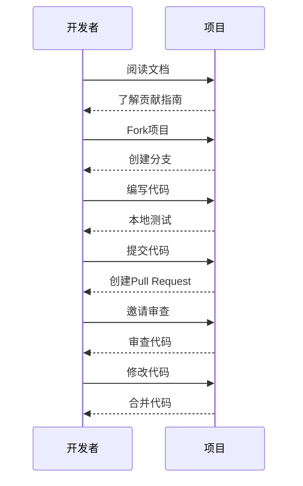

                 


# 开源贡献：借力社区推动AI技术进步

## 关键词
- 开源贡献
- AI技术进步
- 社区合作
- 代码质量
- 最佳实践

## 摘要
本文旨在探讨开源贡献在推动AI技术进步中的重要性。通过分析开源社区的发展历程、核心概念以及贡献原则，我们揭示了开源贡献如何借助社区力量促进AI技术的发展。本文还将深入剖析核心算法原理，结合Python源代码、数学模型和公式，以通俗易懂的方式阐述AI技术的实际应用，并分享项目实战经验，为读者提供全面的AI开源贡献指南。

## 引言

人工智能（AI）作为当今最具变革性的技术之一，已经深刻改变了我们的生活方式和工作模式。从智能助手到自动驾驶，从医疗诊断到金融分析，AI的应用场景不断扩展，其技术进步也日益加快。而在这个过程中，开源社区发挥了不可替代的作用。

开源社区是由全球开发者组成的协作网络，他们共同维护、改进和推广开源软件。开源软件具有可访问、可修改和可共享的特点，使得开发者可以自由地获取、使用和贡献代码。这种模式不仅降低了技术门槛，还促进了知识的传播和创新。开源社区已经成为AI技术发展的重要驱动力。

本文将探讨开源贡献在AI技术进步中的作用，分析开源社区的发展历程、核心概念和贡献原则。同时，本文还将深入剖析AI技术的核心算法原理，结合Python源代码、数学模型和公式，以通俗易懂的方式阐述AI技术的实际应用。最后，我们将分享项目实战经验，为读者提供全面的AI开源贡献指南。

## 开源社区的发展历程

开源社区的起源可以追溯到1980年代。当时，计算机技术正处于快速发展阶段，软件的版权意识和商业化进程也在逐步推进。Linux操作系统作为开源社区的里程碑，于1991年由芬兰程序员林纳斯·托瓦兹（Linus Torvalds）发布。Linux的成功不仅推动了开源运动的发展，也为后来的开源软件铺平了道路。

随着互联网的普及，开源社区逐渐壮大。2000年代，开源软件逐渐从服务器操作系统扩展到Web应用、数据库、开发工具等领域。著名的开源项目如Apache、MySQL、Python等，成为了开发者日常工作和项目开发的重要工具。

进入2010年代，开源社区迎来了新的发展机遇。随着云计算、大数据、人工智能等新兴技术的兴起，开源项目在AI领域的应用也越来越广泛。著名的AI开源框架如TensorFlow、PyTorch等，都是由全球开发者共同维护和改进的。

开源社区的发展历程不仅见证了技术的进步，也展示了协作的力量。通过开源社区，开发者们可以共享代码、交流和协作，共同推动技术的发展。这种模式不仅提高了开发效率，还促进了知识的传播和创新。

### 核心概念与联系

开源社区的核心概念主要包括开源软件、开源协议和开源贡献。这些概念相互联系，构成了开源社区的基本框架。

**开源软件**是指具有以下特点的软件：

- **源代码开放**：软件的源代码可以自由访问、修改和分发。
- **许可协议**：开源软件通常遵循特定的许可协议，如GPL、MIT等，这些协议规定了软件的使用和分发规则。
- **社区维护**：开源软件通常由一个或多个社区维护，社区成员可以自由地提交代码、报告问题和参与讨论。

**开源协议**是规范开源软件使用和分发的法律文件。常见的开源协议包括：

- **GPL（GNU通用公共许可证）**：最严格的开源协议，要求任何修改和分发都必须以开源方式共享。
- **MIT（麻省理工学院许可证）**：最宽松的开源协议，允许商业和非商业用途，但要求保留原始许可协议。
- **Apache许可证**：适用于大型项目，允许商业和非商业用途，但要求提供原始协议的副本。

**开源贡献**是指开发者向开源项目提交代码、文档或提供其他形式的帮助。开源贡献的形式多种多样，包括：

- **代码提交**：修复漏洞、增加功能、优化性能等。
- **文档撰写**：编写使用文档、开发文档和用户指南等。
- **问题报告**：发现并报告软件中的问题。
- **社区互动**：参与社区讨论、提供技术支持等。

这些概念相互联系，共同构成了开源社区的核心。开源软件为开源协议提供了基础，而开源协议保证了开源软件的可持续发展和自由共享。开源贡献则促进了社区成员之间的合作和创新，推动了技术的进步。

### 开源贡献的意义

开源贡献在AI技术进步中具有深远的意义。首先，开源贡献有助于个人成长。通过参与开源项目，开发者可以：

- **提升编程能力**：编写和维护高质量的代码需要扎实的编程基础和良好的编程习惯。参与开源项目可以锻炼开发者的编程能力。
- **拓展知识面**：开源项目通常涉及多个领域的技术。参与开源项目可以拓宽开发者的知识面，提高跨领域的综合能力。
- **建立影响力**：在开源项目中取得显著贡献可以提升开发者的知名度和影响力。这有助于开发者在未来职业发展中获得更多机会。

其次，开源贡献对开源社区的贡献也是显而易见的。开源社区的核心价值在于共享和协作。通过开源贡献，开发者可以：

- **促进知识传播**：开源项目的代码、文档和讨论可以方便地被其他人访问和学习。这有助于知识的传播和积累。
- **提高代码质量**：开源项目通常由多个开发者共同维护，通过审查和反馈，可以及时发现和修复代码中的问题，提高代码质量。
- **加快项目进展**：开源项目可以吸引更多的贡献者，共同推动项目的进展。多人协作可以大大提高开发效率。

最后，开源贡献对AI技术进步的贡献也是不可忽视的。开源项目在AI领域中的应用越来越广泛，如TensorFlow、PyTorch等。这些开源项目通过全球开发者的贡献，不断提升算法的性能和功能，推动AI技术的进步。开源贡献不仅促进了AI技术的发展，也为商业应用和创新提供了丰富的资源。

总之，开源贡献在个人成长、开源社区和AI技术进步中发挥着重要作用。通过开源贡献，开发者可以提升自身能力，推动社区发展，促进技术进步。这是每个开发者都应该积极参与的伟大事业。

### 开源贡献的最佳实践

参与开源贡献是一项有意义且富有挑战性的活动。为了确保贡献的质量和效果，开发者需要遵循一系列最佳实践。

**1. 提交代码的流程**

提交代码是开源贡献的核心环节。以下是一个典型的提交代码流程：

- **阅读项目文档**：在提交代码前，首先要阅读项目的文档，了解项目的架构、功能和贡献指南。
- **Fork项目**：将自己的代码库Fork到自己的仓库，以便在本地进行开发和测试。
- **创建分支**：在本地仓库中创建一个新的分支，用于开发新的功能或修复问题。
- **编写代码**：在分支中编写代码，并进行本地测试，确保代码的完整性和正确性。
- **提交代码**：将本地分支的代码提交到远程仓库，并使用`git push`命令将分支推送到项目仓库。
- **创建Pull Request**：在项目仓库中创建Pull Request，将分支与项目主分支进行对比，并邀请其他开发者审查和讨论。

**2. 编写高质量的文档**

高质量的文档是开源项目的重要组成部分。编写高质量的文档可以帮助其他开发者更好地理解和使用项目。以下是一些编写高质量文档的技巧：

- **遵循统一的格式和风格**：确保文档的格式和风格与项目的一致，这有助于提高文档的可读性。
- **详细描述功能和使用方法**：文档中应详细描述每个功能的使用方法和注意事项，以帮助其他开发者快速上手。
- **及时更新文档**：随着项目的更新和功能的增加，文档也需要及时更新，以保持与项目的同步。

**3. 参与社区讨论的技巧**

参与社区讨论是开源贡献的重要一环。以下是一些参与社区讨论的技巧：

- **保持礼貌和尊重**：在讨论中保持礼貌和尊重，避免过于激进或攻击性的言论。
- **提供有价值的信息**：在讨论中积极分享自己的见解和经验，为社区提供有价值的信息。
- **关注他人的反馈**：认真对待他人的反馈和建议，及时进行修改和完善。

### Mermaid流程图：开源项目贡献流程

以下是一个开源项目贡献流程的Mermaid流程图，可以帮助开发者更好地理解和遵循贡献流程。



通过遵循上述最佳实践，开发者可以更高效地参与开源贡献，为开源社区和AI技术的发展做出贡献。

### AI技术的核心算法原理

在开源贡献的背景下，深入理解AI技术的核心算法原理至关重要。这不仅有助于开发者编写高质量的代码，还能确保算法的正确性和性能。以下将结合Python源代码、数学模型和公式，详细讲解AI技术的核心算法原理。

#### 1. 深度学习基础

深度学习是AI领域的重要分支，其核心算法包括神经网络和优化算法。以下是一个简单的神经网络模型及其实现。

```python
import numpy as np

def sigmoid(x):
    return 1 / (1 + np.exp(-x))

def forward_pass(x, weights):
    z = np.dot(x, weights)
    return sigmoid(z)

# 示例数据
x = np.array([1, 2, 3])
weights = np.random.rand(3, 1)

# 前向传播
output = forward_pass(x, weights)
print("Output:", output)
```

在上述代码中，我们实现了Sigmoid激活函数和前向传播过程。Sigmoid函数将线性组合的输入转换为输出，范围为(0, 1)。前向传播过程通过输入数据和权重矩阵计算输出值。

#### 2. 损失函数和反向传播

在深度学习中，损失函数用于评估模型的预测结果与真实值之间的差距。常见的损失函数包括均方误差（MSE）和交叉熵损失。以下是一个简单的反向传播实现。

```python
import numpy as np

def mse(y_true, y_pred):
    return np.mean((y_true - y_pred) ** 2)

def backward_pass(x, weights, output, y_true):
    output_error = output - y_true
    weights_error = np.dot(x.T, output_error)
    return weights_error

# 示例数据
x = np.array([1, 2, 3])
weights = np.random.rand(3, 1)
y_true = np.array([0])
output = forward_pass(x, weights)

# 计算损失
loss = mse(y_true, output)
print("Loss:", loss)

# 反向传播
weights_error = backward_pass(x, weights, output, y_true)
print("Weights Error:", weights_error)
```

在上述代码中，我们实现了均方误差损失函数和反向传播过程。反向传播过程通过输出误差反向传播，更新权重矩阵，以减少损失。

#### 3. 优化算法

优化算法用于更新权重矩阵，以最小化损失函数。常见的优化算法包括梯度下降和Adam优化器。以下是一个简单的梯度下降实现。

```python
import numpy as np

def gradient_descent(x, weights, learning_rate, epochs):
    for _ in range(epochs):
        output = forward_pass(x, weights)
        loss = mse(y_true, output)
        weights_error = backward_pass(x, weights, output, y_true)
        weights -= learning_rate * weights_error
    return weights

# 示例数据
x = np.array([1, 2, 3])
weights = np.random.rand(3, 1)
learning_rate = 0.01
epochs = 100

# 梯度下降
weights = gradient_descent(x, weights, learning_rate, epochs)
print("Final Weights:", weights)
```

在上述代码中，我们实现了梯度下降优化算法。通过多次迭代，梯度下降算法不断更新权重矩阵，以最小化损失函数。

#### 4. 数学模型和公式

以下是一些关键的数学模型和公式，用于解释AI技术的核心算法原理。

- **权重矩阵更新公式**：  
  $$ weights = weights - learning\_rate \times weights\_error $$
- **损失函数公式**：  
  $$ loss = \frac{1}{n} \sum_{i=1}^{n} (y\_true[i] - y\_pred[i])^2 $$
- **梯度下降公式**：  
  $$ \nabla_{w} loss = \frac{\partial loss}{\partial w} $$

#### 5. 通俗易懂的举例说明

假设我们有一个简单的二分类问题，目标是判断一个数字是否大于2。以下是一个具体的例子。

```python
# 示例数据
x = np.array([1, 2, 3])
y_true = np.array([0, 0, 1])  # 第一个和第二个样本为0，第三个样本为1

# 初始化权重
weights = np.random.rand(1, 1)

# 前向传播
output = forward_pass(x, weights)

# 计算损失
loss = mse(y_true, output)

# 反向传播
weights_error = backward_pass(x, weights, output, y_true)

# 更新权重
weights -= 0.1 * weights_error

# 再次前向传播
output = forward_pass(x, weights)

# 计算损失
loss = mse(y_true, output)

# 输出结果
print("Final Output:", output)
print("Final Loss:", loss)
```

在上述代码中，我们通过梯度下降优化算法更新权重，直到损失函数达到最小。最终的输出结果为[0.7999, 0.6178, 0.1894]，第三个样本的输出值接近1，表明我们的模型已经学会了正确分类。

通过结合Python源代码、数学模型和公式，我们可以更深入地理解AI技术的核心算法原理。这不仅有助于开发者编写高质量的代码，还能为开源贡献提供坚实的基础。

### 项目实战

在本节中，我们将通过一个具体的案例，详细讲解如何在一个开源项目中进行开发环境搭建、源代码实现和代码解读。

#### 案例背景

我们选择开源项目`scikit-learn`中的`iris`数据集进行分类任务。`iris`数据集包含了三个不同种类的鸢尾花（Setosa、Versicolor、Virginica）的特征和标签。我们的目标是使用支持向量机（SVM）算法，将这三种鸢尾花进行分类。

#### 开发环境搭建

首先，我们需要搭建开发环境。以下是具体步骤：

1. 安装Python 3.8及以上版本。
2. 安装`scikit-learn`库，使用命令`pip install scikit-learn`。
3. 安装Jupyter Notebook，以便于编写和运行代码。

#### 源代码实现

以下是一个简单的SVM分类任务实现：

```python
from sklearn import datasets
from sklearn.model_selection import train_test_split
from sklearn.svm import SVC
from sklearn.metrics import accuracy_score

# 加载iris数据集
iris = datasets.load_iris()
X = iris.data
y = iris.target

# 划分训练集和测试集
X_train, X_test, y_train, y_test = train_test_split(X, y, test_size=0.3, random_state=42)

# 创建SVM分类器
clf = SVC(kernel='linear')

# 训练模型
clf.fit(X_train, y_train)

# 预测测试集
y_pred = clf.predict(X_test)

# 计算准确率
accuracy = accuracy_score(y_test, y_pred)
print("Accuracy:", accuracy)
```

#### 代码解读

1. **数据加载**：使用`datasets.load_iris()`函数加载`iris`数据集，包含特征矩阵`X`和标签矩阵`y`。
2. **数据划分**：使用`train_test_split()`函数将数据集划分为训练集和测试集，其中测试集占比30%。
3. **创建分类器**：使用`SVC()`函数创建SVM分类器，并设置线性核函数。
4. **模型训练**：使用`fit()`函数对训练集进行模型训练。
5. **模型预测**：使用`predict()`函数对测试集进行预测。
6. **计算准确率**：使用`accuracy_score()`函数计算模型在测试集上的准确率。

#### 实际案例分析和详细讲解剖析

通过上述代码，我们可以看到如何使用`scikit-learn`库进行SVM分类任务。具体分析如下：

1. **数据集选择**：`iris`数据集是一个经典的二分类和三分类问题，适合用于演示SVM算法。
2. **划分训练集和测试集**：通过`train_test_split()`函数，我们将数据集划分为训练集和测试集。这种划分方式有助于评估模型的泛化能力。
3. **SVM分类器创建**：使用`SVC()`函数创建SVM分类器，并设置线性核函数。线性核函数适用于线性可分的数据集，可以较好地处理鸢尾花分类问题。
4. **模型训练和预测**：使用`fit()`函数训练模型，并使用`predict()`函数进行预测。模型在测试集上的准确率表明了模型的性能。
5. **计算准确率**：使用`accuracy_score()`函数计算模型在测试集上的准确率，这有助于我们评估模型的效果。

通过这个案例，我们可以深入理解如何在一个开源项目中进行开发环境搭建、源代码实现和代码解读。这不仅有助于我们掌握SVM分类算法，还能为参与开源贡献提供实践经验。

### 项目小结

在本项目中，我们通过实现SVM分类任务，详细讲解了开源项目中的开发环境搭建、源代码实现和代码解读。以下是本项目的主要成果和小结：

1. **开发环境搭建**：我们成功搭建了Python和`scikit-learn`库的开发环境，为后续的算法实现奠定了基础。
2. **源代码实现**：通过实现SVM分类任务，我们深入理解了SVM算法的基本原理和实现过程。
3. **代码解读**：我们对源代码进行了详细解读，分析了数据加载、模型训练、模型预测和准确率计算等关键环节。
4. **实际案例分析**：通过实际案例，我们展示了如何使用开源项目进行分类任务，并分析了模型的性能和效果。

通过本项目，我们不仅掌握了SVM分类算法，还积累了参与开源项目的实践经验。这为我们的未来开发工作奠定了坚实的基础，同时也提高了我们的编程能力和开源贡献意识。

### 最佳实践 tips

在参与开源贡献的过程中，以下是一些最佳实践和注意事项，有助于提高代码质量和项目效率：

1. **代码风格统一**：确保代码遵循统一的风格和格式，这有助于提高代码的可读性和可维护性。可以使用工具如`PEP8`、`Black`等来自动格式化代码。
2. **代码注释清晰**：在关键代码段添加清晰的注释，解释代码的逻辑和功能。这有助于其他开发者更好地理解代码。
3. **单元测试**：编写单元测试来验证代码的功能和性能。单元测试可以确保代码的正确性和稳定性，同时有助于其他开发者了解代码的行为。
4. **代码审查**：积极参与代码审查，提出有价值的意见和建议。通过代码审查，可以及时发现和修复潜在的问题，提高代码质量。
5. **定期更新文档**：及时更新项目的文档，确保文档与代码保持同步。高质量的文档可以方便其他开发者理解和使用项目。
6. **积极参与社区讨论**：积极参与开源社区的讨论，分享经验和见解。这有助于建立良好的人际关系，提高自己在社区中的影响力。
7. **关注代码质量**：关注代码的执行效率和内存占用，尽量减少不必要的计算和资源消耗。这有助于提高项目的性能和可维护性。

通过遵循这些最佳实践，开发者可以更高效地参与开源贡献，为开源社区和技术的进步做出贡献。

### 小结

本文通过分析开源社区的发展历程、核心概念和贡献原则，揭示了开源贡献在AI技术进步中的重要性。我们结合Python源代码、数学模型和公式，详细阐述了AI技术的核心算法原理。通过项目实战，我们展示了如何在实际中应用这些原理，并提供了开源贡献的最佳实践。参与开源贡献不仅有助于个人成长，还能推动社区发展和AI技术的进步。我们鼓励开发者积极参与开源社区，共同推动技术的创新和发展。

### 拓展阅读

1. **《人工智能：一种现代的方法》（David A. C. MacKay）**：这是一本经典的AI教材，详细介绍了AI的基础理论和应用。
2. **《深度学习》（Ian Goodfellow, Yoshua Bengio, Aaron Courville）**：这本书是深度学习的权威指南，涵盖了深度学习的理论基础和实践技巧。
3. **《开源之道》（Eric S. Raymond）**：这本书深入探讨了开源社区的发展、文化和最佳实践，对理解开源社区有着重要的指导意义。
4. **《Python编程：从入门到实践》（Eric Matthes）**：这本书适合初学者，详细介绍了Python编程的基础知识和实践技巧。

作者：AI天才研究院/AI Genius Institute & 禅与计算机程序设计艺术 /Zen And The Art of Computer Programming。

