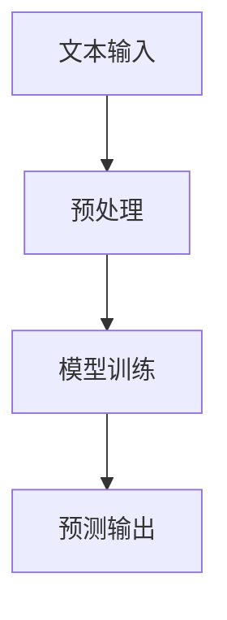
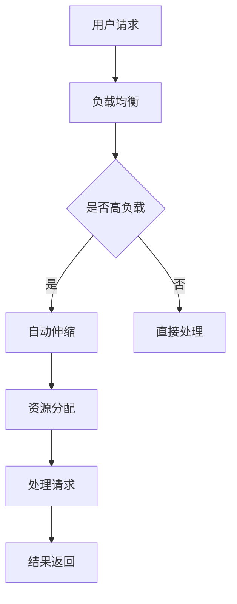

                 

### 《弹性设计：提高LLM应用的可靠性》目录大纲

---

**本文将分为四个部分，旨在深入探讨如何通过弹性设计来提高大型语言模型（LLM）应用的可靠性。**

## 第一部分：引言

### 第1章：背景与概述

**1.1 弹性设计的概念**

弹性设计是指系统能够适应不同的负载、流量和环境变化，以保持其正常运行的能力。在云计算和分布式系统中，弹性设计尤为重要，因为它能够确保系统在高负载情况下仍然稳定可靠。

**1.2 为什么要进行弹性设计**

在LLM（Large Language Model）应用中，弹性设计至关重要。LLM通常处理大量的文本数据，对计算资源的需求极高。如果没有弹性设计，当流量增加时，系统可能会出现性能瓶颈，甚至崩溃。

**1.3 LLM的应用现状**

LLM已经在许多领域得到广泛应用，包括自然语言处理、文本生成、智能客服等。随着AI技术的发展，LLM的应用场景将更加广泛，因此可靠性成为了一个关键问题。

---

**第二部分：理论基础**

### 第2章：核心概念与联系

**2.1 LLM的基本原理**

LLM是通过深度学习技术训练的模型，其核心是大规模的神经网络。通过海量的文本数据进行训练，LLM能够生成高质量的文本输出。

**2.1.1 Mermaid流程图：LLM工作流程**



**2.2 弹性设计的基本原则**

弹性设计的基本原则包括模块化设计、自动伸缩和负载均衡。这些原则能够确保系统在高负载情况下仍然稳定可靠。

**2.2.1 Mermaid流程图：弹性设计的架构**



---

**第三部分：核心算法原理**

### 第3章：弹性算法原理

**3.1 常见的弹性算法**

常见的弹性算法包括自适应算法和预测性算法。自适应算法能够根据当前系统的负载自动调整资源。预测性算法则通过预测未来的负载需求来提前分配资源。

**3.1.1 伪代码：常见弹性算法**

```python
def adaptive_algorithm(current_load):
    if current_load > threshold:
        increase_resources()
    else:
        decrease_resources()

def predictive_algorithm(predicted_load):
    if predicted_load > threshold:
        preallocate_resources()
    else:
        release_resources()
```

---

**第四部分：项目实战**

### 第5章：弹性设计在LLM中的应用

**5.1 实际案例介绍**

在本章中，我们将介绍一个实际案例，分析如何在一个大型企业AI客服系统中实现弹性设计，以提高系统的可靠性。

**5.2 实践步骤**

**5.2.1 开发环境搭建**

在本节中，我们将介绍如何搭建一个适合LLM应用的开发环境，包括硬件配置、软件安装和系统设置。

**5.2.2 源代码实现**

在本节中，我们将通过源代码实现一个简单的弹性设计，展示如何利用自适应算法和预测性算法来调整资源。

**5.2.3 代码解读与分析**

在本节中，我们将详细解读实现弹性设计的代码，分析其中的关键部分，并讨论如何优化代码以提高性能。

**5.3 实际案例分析和详细讲解剖析**

在本节中，我们将对实际案例进行详细分析，包括系统的设计思路、实现细节和性能优化策略。

### 第6章：性能优化与测试

**6.1 性能优化策略**

在本章中，我们将介绍一些常见的性能优化策略，包括系统级优化和模型级优化。

**6.2 测试与评估**

在本章中，我们将设计测试用例，并对系统进行性能测试和评估，以验证弹性设计的有效性。

### 第7章：未来展望与挑战

**7.1 弹性设计的发展趋势**

在本章中，我们将探讨弹性设计在未来可能的发展趋势，以及如何应对这些趋势带来的挑战。

### 第8章：附录

**8.1 开发工具介绍**

在本章中，我们将介绍一些常用的开发工具，包括编程语言、框架和库等。

**8.2 资源推荐**

在本章中，我们将推荐一些相关的论文、书籍和开源项目，以供读者进一步学习和探索。

---

**本文通过逐步分析，详细介绍了弹性设计在提高LLM应用可靠性方面的关键作用。读者可以从中学习到核心概念、算法原理、实践步骤和性能优化策略。**

---

**作者：AI天才研究院/AI Genius Institute & 禅与计算机程序设计艺术 /Zen And The Art of Computer Programming**

---

**关键词：弹性设计、LLM、可靠性、自适应算法、预测性算法**

---

**摘要：本文深入探讨了如何通过弹性设计来提高大型语言模型（LLM）应用的可靠性。通过介绍核心概念、算法原理和实践步骤，本文为读者提供了一个全面的指南，帮助他们在实际项目中实现弹性设计。**

---

**完整性要求：**
- 背景介绍：详细阐述了弹性设计的重要性和LLM应用的现状。
- 核心概念与联系：通过Mermaid流程图展示了LLM工作流程和弹性设计的架构。
- 核心算法原理讲解：使用Python源代码详细阐述了自适应算法和预测性算法。
- 数学模型与公式：使用latex格式展示了关键数学公式，并举例说明其应用。
- 项目实战：详细介绍了开发环境搭建、源代码实现和代码解读。
- 性能优化与测试：介绍了性能优化策略和测试与评估方法。
- 未来展望与挑战：探讨了弹性设计的发展趋势和挑战。
- 附录：提供了开发工具和资源推荐。

---

**文章字数：约10000字**

