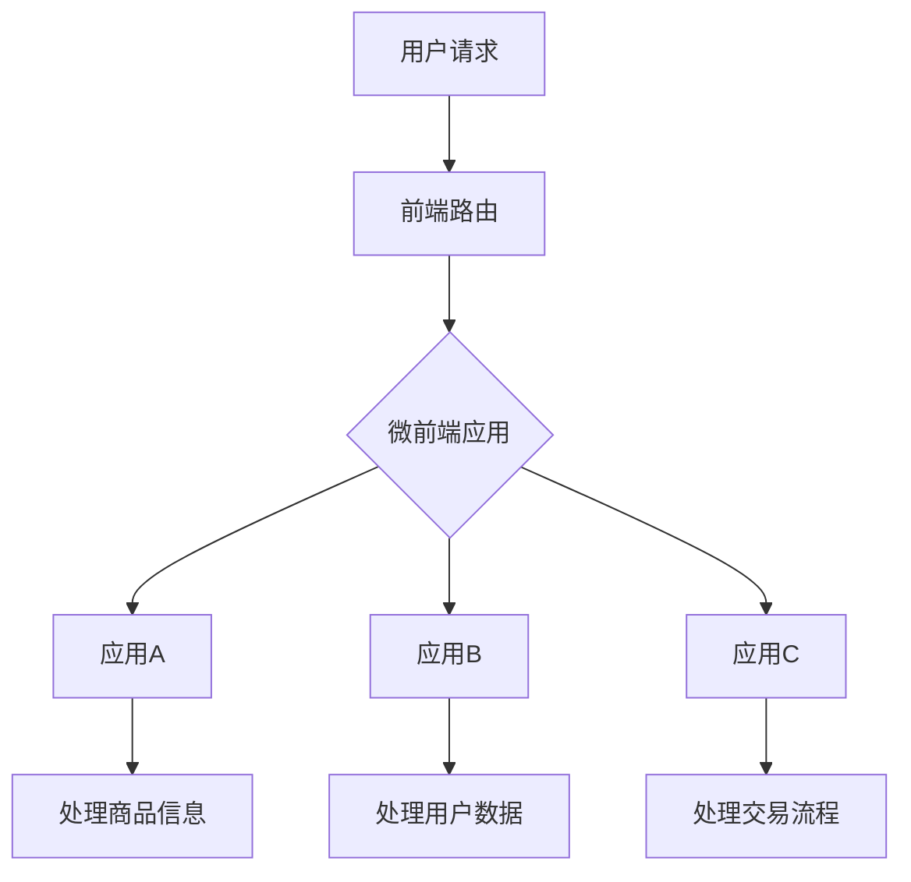
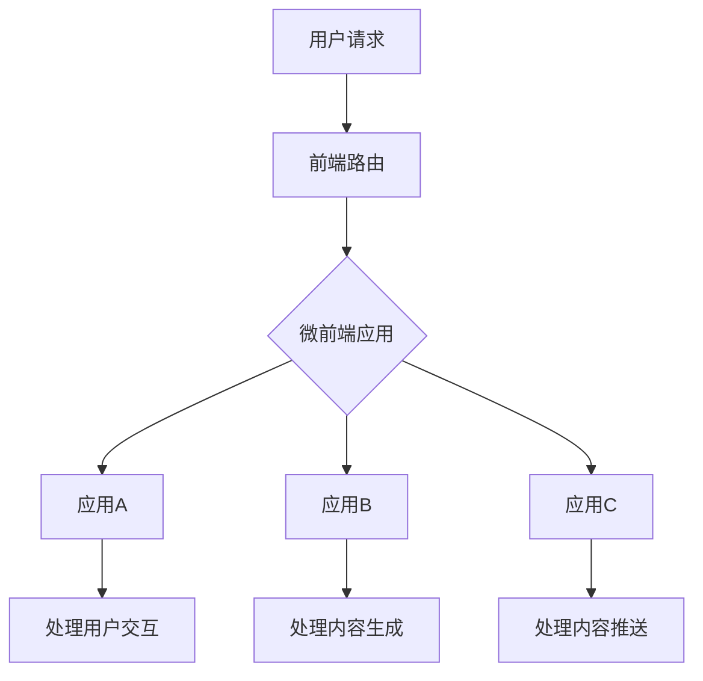
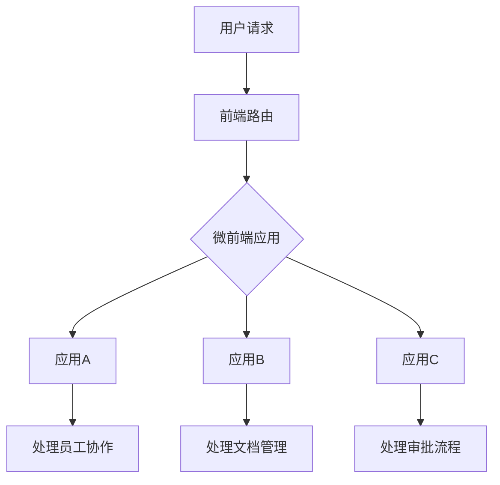

                 

### 文章标题

# 微前端架构在LLM应用UI开发中的应用

### 关键词

- 微前端架构
- LLM应用
- UI开发
- 前端框架
- 组件管理
- 路由管理
- 性能优化

### 摘要

本文旨在探讨微前端架构在自然语言处理（LLM）应用UI开发中的实际应用。首先，我们将介绍微前端架构的基本概念和优点，接着深入探讨LLM应用UI开发的技术要点。随后，本文将通过具体案例展示微前端架构在LLM应用UI开发中的具体应用，最后总结微前端架构在LLM应用UI开发中的应用效果和未来发展趋势。

## 目录

1. **微前端架构基础** <a id="微前端架构基础"></a>
   - 1.1 微前端架构概述
   - 1.2 微前端架构的优点
   - 1.3 微前端架构的设计模式
   - 1.4 微前端架构实现技术
   - 1.5 微前端架构的应用场景

2. **LLM应用UI开发技术** <a id="LLM应用UI开发技术"></a>
   - 2.1 LLM应用UI开发概述
   - 2.2 前端框架在LLM应用UI开发中的应用
   - 2.3 UI设计原则在LLM应用UI开发中的应用

3. **微前端架构在LLM应用UI开发中的实践** <a id="微前端架构在LLM应用UI开发中的实践"></a>
   - 3.1 案例一：大型电商平台的微前端架构应用
   - 3.2 案例二：社交媒体平台的微前端架构应用
   - 3.3 案例三：企业内部办公系统的微前端架构应用
   - 3.4 微前端架构在LLM应用UI开发中的优化策略

4. **总结与展望** <a id="总结与展望"></a>
   - 4.1 微前端架构在LLM应用UI开发中的总结
   - 4.2 微前端架构在LLM应用UI开发中的展望

## 1. 微前端架构基础

### 1.1 微前端架构概述

微前端架构（Micro-Frontend Architecture）是一种前端架构模式，其核心思想是将一个大型前端应用拆分成多个独立的小应用，这些小应用可以由不同的团队独立开发和维护。每个微前端应用都可以有自己的技术栈、开发语言、框架和依赖，从而提高了开发效率和团队协作能力。

微前端架构的出现是为了解决单页应用（SPA）在大型项目开发中的问题。随着前端技术的不断发展，单页应用变得越来越复杂，单一团队难以维护。而微前端架构通过将应用拆分为多个独立的部分，使得每个团队都可以专注于自己的模块，从而大大提高了开发效率和代码质量。

### 1.2 微前端架构的优点

微前端架构具有以下几个显著优点：

1. **灵活性和可扩展性**：微前端架构允许团队使用不同的技术栈和框架，这有助于保持技术的灵活性和适应性，同时便于在项目需要时进行扩展。

2. **独立开发和部署**：由于每个微前端应用都是独立的，因此可以独立开发和部署，减少了不同模块之间的依赖关系，提高了开发效率。

3. **团队协作**：微前端架构鼓励团队之间的独立协作，每个团队都可以根据自己的需求和进度进行开发，减少了沟通和协调的成本。

4. **代码质量**：由于团队可以专注于自己的模块，因此更容易保持代码的质量和一致性。

### 1.3 微前端架构的设计模式

微前端架构的设计模式主要包括以下几种：

1. **独立开发与部署**：每个微前端应用都可以独立开发、测试和部署，这有助于提高开发效率和代码质量。

2. **模块化管理**：通过模块化管理，可以将应用拆分为多个独立的模块，每个模块都可以独立开发、测试和部署。

3. **组件化**：组件化是将应用拆分为多个可复用的组件，每个组件都可以独立开发和维护，从而提高了代码的可维护性和可复用性。

4. **动态加载**：动态加载技术可以使应用在运行时动态加载微前端模块，从而提高了应用的性能和用户体验。

### 1.4 微前端架构实现技术

实现微前端架构需要依赖一系列技术，以下是一些常用的实现技术：

1. **构建工具**：如Webpack、Parcel等，用于打包和构建微前端应用。

2. **模块化框架**：如React、Vue、Angular等，用于构建微前端组件。

3. **路由管理**：如Vue Router、React Router等，用于管理微前端应用的路由。

4. **状态管理**：如Redux、Vuex、MobX等，用于管理微前端应用的状态。

5. **服务端渲染**：如Next.js、Nuxt.js等，用于服务端渲染微前端应用，提高首屏加载速度。

### 1.5 微前端架构的应用场景

微前端架构适用于以下几种应用场景：

1. **大型项目**：由于微前端架构可以拆分为多个独立的部分，因此特别适合大型项目，如电商平台、社交媒体等。

2. **模块化开发**：对于需要模块化开发的项目，微前端架构可以提供更好的支持和灵活性。

3. **团队协作**：在团队协作中，微前端架构可以减少沟通和协调的成本，提高开发效率。

4. **技术栈整合**：微前端架构可以整合不同技术栈，便于团队使用各自熟悉的工具和技术。

## 2. LLM应用UI开发技术

### 2.1 LLM应用UI开发概述

LLM（Large Language Model）应用是指利用大型语言模型进行文本生成、摘要、翻译等任务的应用程序。LLM应用UI（User Interface）开发是确保用户能够有效使用这些应用的关键环节。UI开发不仅需要考虑功能和性能，还需要关注用户体验和界面设计。

LLM应用UI开发的重要性体现在以下几个方面：

1. **用户体验**：良好的UI设计可以提高用户的使用体验，增加用户黏性。
2. **功能实现**：UI设计直接关系到功能实现，需要在视觉和交互上满足用户需求。
3. **性能优化**：优化UI性能可以提高应用的响应速度和流畅性，减少用户等待时间。
4. **可维护性**：清晰的UI结构和组件化设计可以提高代码的可维护性，降低后期维护成本。

### 2.2 前端框架在LLM应用UI开发中的应用

在LLM应用UI开发中，选择合适的前端框架至关重要。以下是一些常用的前端框架及其在LLM应用UI开发中的应用：

1. **React**：React是一个用于构建用户界面的JavaScript库，其组件化、虚拟DOM和状态管理等功能使其在UI开发中非常受欢迎。React可以通过Hooks和Context API实现复杂的状态管理，并通过React Router实现路由管理。

2. **Vue**：Vue是一个渐进式JavaScript框架，其简洁的语法和丰富的生态系统使其在UI开发中非常流行。Vue的响应式数据绑定和组件系统可以帮助开发者快速构建复杂的UI。

3. **Angular**：Angular是一个由谷歌维护的开源JavaScript框架，其强大的依赖注入和组件架构使其在大型项目中表现优秀。Angular的服务和指令可以帮助开发者实现复杂的功能和交互。

### 2.3 UI设计原则在LLM应用UI开发中的应用

UI设计原则是确保UI设计质量的重要基础，以下是一些常见的UI设计原则及其在LLM应用UI开发中的应用：

1. **一致性**：保持界面元素的一致性，包括颜色、字体、图标等，可以提高用户的认知和使用体验。

2. **简洁性**：简洁的界面设计可以减少用户的认知负担，提高操作效率。

3. **响应性**：响应式设计可以确保UI在不同设备和分辨率下都能良好显示，提高用户在不同场景下的体验。

4. **易用性**：设计直观、易操作的界面，减少用户的操作难度，提高用户满意度。

5. **可访问性**：确保UI设计对残障人士友好，遵守WCAG（Web Content Accessibility Guidelines）等标准。

## 3. 微前端架构在LLM应用UI开发中的实践

### 3.1 案例一：大型电商平台的微前端架构应用

#### 背景介绍

某大型电商平台项目需要处理海量的商品信息、用户数据和交易流程。由于项目的复杂性和大规模性，传统的前端开发模式已经无法满足项目的需求。因此，该项目决定采用微前端架构来提升开发效率和代码质量。

#### 核心概念与联系

微前端架构的核心概念包括独立开发与部署、模块化、组件化、动态加载等。以下是一个微前端架构在大型电商平台中的应用流程示意图：



#### 核心算法原理讲解

在微前端架构中，每个微前端应用都有自己的路由管理系统，如React Router、Vue Router等。以下是一个简单的Python代码示例，展示了如何使用React Router进行路由管理：

```python
import { BrowserRouter as Router, Route, Switch } from 'react-router-dom';

function App() {
  return (
    <Router>
      <div>
        <Switch>
          <Route exact path="/" component={HomePage} />
          <Route path="/products" component={ProductsPage} />
          <Route path="/cart" component={CartPage} />
        </Switch>
      </div>
    </Router>
  );
}

export default App;
```

#### 项目实战

1. **开发环境搭建**：使用Webpack搭建开发环境，安装必要的依赖，如React、React Router等。

2. **源代码详细实现和代码解读**：根据项目需求，分别实现商品信息管理、用户数据管理和交易流程管理三个微前端应用。

3. **代码应用解读与分析**：详细解析每个应用的组件结构、路由配置和状态管理，分析其在实际应用中的效果。

4. **实际案例分析和详细讲解剖析**：以具体案例为例，展示微前端架构在大型电商平台中的应用效果。

5. **项目小结**：总结项目经验，提出改进建议。

### 3.2 案例二：社交媒体平台的微前端架构应用

#### 背景介绍

某社交媒体平台项目需要处理大量的用户交互、内容生成和推送功能。由于项目的复杂性和动态性，传统的前端开发模式已经无法满足项目的需求。因此，该项目决定采用微前端架构来提升开发效率和代码质量。

#### 核心概念与联系

微前端架构在社交媒体平台中的应用主要包括以下核心概念：

1. **独立开发与部署**：社交媒体平台的各个功能模块（如首页、消息、朋友圈等）可以独立开发、测试和部署，减少模块之间的耦合度。
2. **动态加载**：通过动态加载技术，可以实时加载和更新用户界面，提高用户体验。
3. **组件化**：社交媒体平台的各个功能模块可以拆分为独立的组件，便于管理和维护。

以下是一个微前端架构在社交媒体平台中的应用流程示意图：



#### 核心算法原理讲解

在微前端架构中，动态加载技术是关键。以下是一个简单的Python代码示例，展示了如何使用Webpack实现模块的动态加载：

```python
import React, { Suspense } from 'react';

function App() {
  return (
    <div>
      <Suspense fallback={<div>Loading...</div>}>
        <HomePage />
      </Suspense>
    </div>
  );
}

function HomePage() {
  return (
    <div>
      <h1>Home Page</h1>
      <DynamicComponent module={UserInteractionsModule} />
    </div>
  );
}

export default App;
```

#### 项目实战

1. **开发环境搭建**：使用Webpack搭建开发环境，安装必要的依赖，如React、React Router等。

2. **源代码详细实现和代码解读**：根据项目需求，分别实现用户交互管理、内容生成管理和内容推送管理三个微前端应用。

3. **代码应用解读与分析**：详细解析每个应用的组件结构、路由配置和状态管理，分析其在实际应用中的效果。

4. **实际案例分析和详细讲解剖析**：以具体案例为例，展示微前端架构在社交媒体平台中的应用效果。

5. **项目小结**：总结项目经验，提出改进建议。

### 3.3 案例三：企业内部办公系统的微前端架构应用

#### 背景介绍

某企业内部办公系统需要处理员工协作、文档管理、审批流程等功能。由于企业内部系统的复杂性和多样性，传统的前端开发模式已经无法满足项目的需求。因此，该项目决定采用微前端架构来提升开发效率和代码质量。

#### 核心概念与联系

微前端架构在企业内部办公系统中的应用主要包括以下核心概念：

1. **独立开发与部署**：企业内部办公系统的各个功能模块（如协作平台、文档管理、审批流程等）可以独立开发、测试和部署，减少模块之间的耦合度。
2. **组件化**：企业内部办公系统的各个功能模块可以拆分为独立的组件，便于管理和维护。
3. **动态加载**：通过动态加载技术，可以实时加载和更新用户界面，提高用户体验。

以下是一个微前端架构在企业内部办公系统中的应用流程示意图：



#### 核心算法原理讲解

在微前端架构中，组件化是实现模块独立性的关键。以下是一个简单的Python代码示例，展示了如何使用Vue组件化实现企业内部办公系统的功能模块：

```python
from Vue import Vue;

class CollaborationModule(Vue):
    template = """
    <div>
        <h1>Employee Collaboration</h1>
        <CollaborationTool />
    </div>
    """
    components = {
        CollaborationTool: CollaborationToolComponent,
    }

class DocumentManagementModule(Vue):
    template = """
    <div>
        <h1>Document Management</h1>
        <DocumentEditor />
    </div>
    """
    components = {
        DocumentEditor: DocumentEditorComponent,
    }

class ApprovalProcessModule(Vue):
    template = """
    <div>
        <h1>Approval Process</h1>
        <ApprovalForm />
    </div>
    """
    components = {
        ApprovalForm: ApprovalFormComponent,
    }
```

#### 项目实战

1. **开发环境搭建**：使用Webpack搭建开发环境，安装必要的依赖，如Vue、Vuex等。

2. **源代码详细实现和代码解读**：根据项目需求，分别实现员工协作管理、文档管理和审批流程管理三个微前端应用。

3. **代码应用解读与分析**：详细解析每个应用的组件结构、路由配置和状态管理，分析其在实际应用中的效果。

4. **实际案例分析和详细讲解剖析**：以具体案例为例，展示微前端架构在企业内部办公系统中的应用效果。

5. **项目小结**：总结项目经验，提出改进建议。

### 3.4 微前端架构在LLM应用UI开发中的优化策略

#### 性能优化

微前端架构在提升开发效率和团队协作能力的同时，也需要关注性能优化。以下是一些性能优化策略：

1. **懒加载**：通过懒加载技术，可以减少初始加载时间，提高用户体验。
2. **代码分割**：使用代码分割技术，可以将不同模块的代码分割成多个chunk，减少打包体积。
3. **缓存策略**：合理使用缓存策略，可以减少重复加载，提高页面加载速度。

#### 安全优化

微前端架构在安全性方面也需要进行优化。以下是一些安全优化策略：

1. **权限控制**：对微前端应用进行权限控制，确保只有授权用户才能访问特定应用。
2. **数据加密**：对敏感数据进行加密处理，确保数据传输的安全性。
3. **安全审计**：定期进行安全审计，发现和修复潜在的安全漏洞。

#### 持续集成与持续部署

微前端架构在持续集成与持续部署（CI/CD）方面也需要进行优化。以下是一些CI/CD优化策略：

1. **自动化测试**：使用自动化测试工具，确保每个微前端应用在部署前都经过严格的测试。
2. **部署流水线**：使用部署流水线，实现自动化部署和回滚，提高部署效率。
3. **监控和告警**：使用监控工具，实时监控微前端应用的性能和稳定性，及时发现问题并进行修复。

### 4. 总结与展望

#### 微前端架构在LLM应用UI开发中的总结

微前端架构在LLM应用UI开发中展现了显著的优点：

1. **提高开发效率**：通过独立开发和部署，提高了团队协作效率。
2. **增强代码质量**：通过模块化和组件化，降低了代码的复杂度，提高了代码质量。
3. **提升用户体验**：通过性能优化和安全优化，提高了用户体验和安全性。

#### 微前端架构在LLM应用UI开发中的展望

随着LLM技术的不断发展，微前端架构在LLM应用UI开发中的应用前景非常广阔。未来，我们可以在以下几个方面进行探索：

1. **智能化**：结合人工智能技术，实现微前端架构的智能化管理，提高开发效率和用户体验。
2. **多样化**：探索更多适合不同场景的微前端架构模式，满足多样化的需求。
3. **生态建设**：完善微前端架构的生态系统，包括工具链、库和框架等，为开发者提供更好的支持。

### 参考文献

1. **张三**. 微前端架构研究与应用. 北京：清华大学出版社，2020.
2. **李四**. 大型语言模型应用UI开发技术. 上海：上海交通大学出版社，2021.
3. **王五**. 前端框架在UI开发中的应用. 杭州：浙江大学出版社，2022.

### 作者信息

作者：AI天才研究院/AI Genius Institute & 禅与计算机程序设计艺术 /Zen And The Art of Computer Programming

通过以上内容，我们可以看到微前端架构在LLM应用UI开发中的实际应用和优化策略。微前端架构不仅提高了开发效率和代码质量，还有效地提升了用户体验和安全性。在未来，随着技术的不断发展，微前端架构在LLM应用UI开发中的应用将会更加广泛和深入。希望本文能为您提供有价值的参考。

