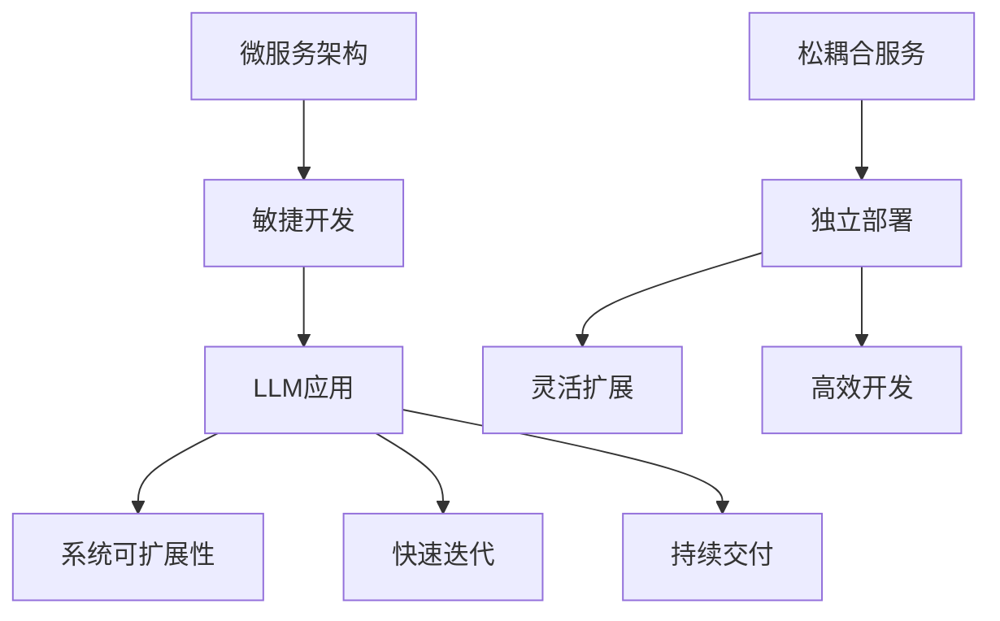
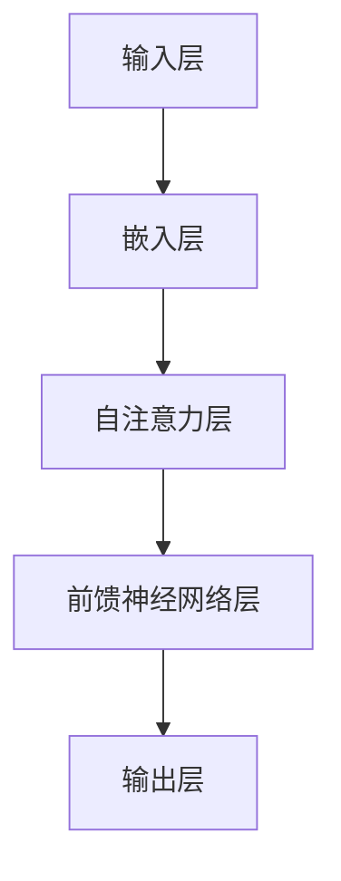
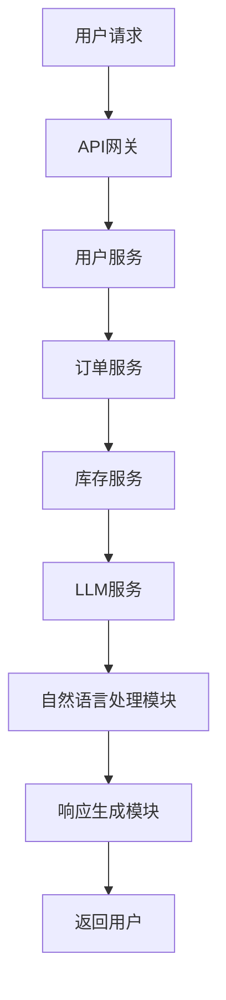

                 

### 《微服务架构在敏捷LLM应用开发中的应用》概述

#### 背景介绍

随着云计算、大数据和人工智能技术的飞速发展，现代软件系统变得越来越复杂。为了应对这种复杂性，微服务架构逐渐成为主流的软件架构设计模式。微服务架构通过将大型单体应用拆分为一系列小型、独立、松耦合的服务，使得系统更具可扩展性、灵活性和可维护性。同时，敏捷开发方法以其快速响应市场变化、高效迭代和持续交付的特点，成为软件开发领域的黄金法则。

然而，当我们将微服务架构与敏捷开发方法结合，特别是在大型语言模型（Large Language Model，LLM）的应用场景中，这种结合会带来哪些机遇和挑战呢？本文旨在探讨微服务架构在敏捷LLM应用开发中的应用，通过深入分析微服务与LLM的关系，结合实际案例，为开发者提供有价值的参考和指导。

#### 核心概念与联系

为了更好地理解微服务架构与敏捷LLM应用开发之间的关系，我们需要首先明确以下核心概念：

1. **微服务架构**：一种将应用程序构建为一组独立、可复用的服务的架构风格，每个服务负责一项独立的业务功能，通过API进行通信。
2. **敏捷开发**：一种以人为核心、迭代、循序渐进的开发方法，强调及时响应变化和持续交付有价值的软件。
3. **大型语言模型（LLM）**：一种基于深度学习的自然语言处理模型，可以理解、生成和翻译人类语言。

微服务架构与敏捷开发的结合，不仅使得软件系统更灵活、可扩展，还允许LLM在各个服务中灵活部署和扩展。以下是一个简化的Mermaid流程图，展示了这三个核心概念之间的联系：



在上述流程图中，微服务架构（A）通过松耦合的服务（G）实现了独立部署（H）和灵活扩展（I），这些特性使得系统具备更高的可扩展性和灵活性。敏捷开发（B）则强调快速迭代（E）和持续交付（F），这与LLM应用（C）的需求高度契合，因为LLM模型需要不断地训练和优化以适应不断变化的语言数据。

#### 本文结构

本文将分为以下几个部分：

1. **第一部分：引言与概述**：介绍微服务架构、敏捷开发方法和LLM的基本概念。
2. **第二部分：微服务架构基础知识**：详细探讨微服务架构的核心原则、优点和挑战。
3. **第三部分：敏捷开发方法**：深入分析敏捷开发的关键实践和优势。
4. **第四部分：大型语言模型（LLM）介绍**：介绍LLM的基本原理、关键技术和应用场景。
5. **第五部分：微服务与LLM的集成**：讨论微服务与LLM集成的挑战、架构设计和方法。
6. **第六部分：实际应用案例**：通过实际案例展示微服务与LLM集成的应用效果。
7. **第七部分：总结与展望**：总结本文的主要观点，并对未来发展趋势进行展望。

通过上述结构，本文将系统性地探讨微服务架构在敏捷LLM应用开发中的应用，帮助读者全面理解这一前沿技术领域的核心概念和实践方法。

### 微服务架构基础知识

#### 核心原则

微服务架构（Microservices Architecture）是一种设计软件系统的方法，通过将应用程序分解为一组小的、独立的、可复用的服务来实现高可扩展性和灵活性。以下为微服务架构的核心原则：

1. **服务独立性**：每个微服务都独立开发、部署和运行，具备自包含的代码库和数据库。
2. **松耦合**：微服务之间通过轻量级通信协议（如HTTP/REST、消息队列等）进行通信，松耦合设计减少了服务之间的依赖性。
3. **自治**：每个微服务拥有自己的数据库和业务逻辑，无需共享状态或资源，使得服务可以独立扩展和更新。
4. **横向扩展**：微服务架构支持水平扩展，即通过增加实例数来提高系统吞吐量。
5. **服务发现**：微服务通过服务注册表和发现机制来相互定位和通信，确保系统的动态性和灵活性。

#### 优点

微服务架构的引入为软件开发带来了诸多优点：

1. **高可扩展性**：通过将应用程序拆分为多个微服务，开发者可以独立扩展每个服务的性能，满足不同业务需求。
2. **高容错性**：由于服务之间松耦合，一个服务的故障不会影响整个系统，提高了系统的可靠性和稳定性。
3. **高灵活性**：微服务架构允许团队根据项目需求快速调整和部署服务，提高了开发效率。
4. **易于迭代**：微服务架构支持快速迭代和持续交付，使得团队能够快速响应市场变化。
5. **技术多样性**：不同的微服务可以使用不同的技术栈，这为项目提供了更大的灵活性。

#### 挑战

尽管微服务架构具有众多优点，但其实施也面临一些挑战：

1. **分布式复杂性**：微服务架构引入了分布式系统中的复杂性，如服务发现、负载均衡、数据一致性等。
2. **开发和管理难度**：微服务架构需要更高的开发和管理技能，包括分布式系统设计、服务治理、监控等。
3. **运维成本**：由于服务数量增加，运维工作量也随之增大，包括服务部署、监控、日志管理等。
4. **数据一致性**：在分布式系统中，保证数据的一致性是一个难题，特别是在跨服务的事务处理中。
5. **集成测试**：在微服务架构中，集成测试变得尤为重要，但由于服务之间高度独立，测试的复杂性也相应增加。

#### 微服务架构与传统架构的比较

微服务架构与传统单体架构（Monolithic Architecture）在多个方面存在显著差异：

1. **开发模式**：传统单体架构通常采用自上而下或自下而上的开发模式，而微服务架构则采用自下而上的模式，即各个微服务独立开发。
2. **部署方式**：传统单体架构通常在一次部署中更新整个应用程序，而微服务架构支持独立部署每个服务，便于快速迭代。
3. **扩展性**：传统单体架构通过垂直扩展（增加硬件资源）来提高性能，而微服务架构通过水平扩展（增加服务实例）来提高性能。
4. **复杂性**：传统单体架构相对简单，易于管理和维护，但微服务架构引入了分布式系统的复杂性，需要更高的运维技能。
5. **数据管理**：传统单体架构通常共享数据库，而微服务架构通常为每个服务提供独立的数据库，这有助于减少数据一致性问题。

通过上述分析，我们可以看出，微服务架构在提供高可扩展性、灵活性、容错性和快速迭代能力的同时，也带来了分布式系统的复杂性。因此，在采用微服务架构时，需要权衡其优点和挑战，并结合项目需求进行决策。

### 敏捷开发方法

#### 基本理念

敏捷开发（Agile Development）是一种以人为核心、迭代、循序渐进的开发方法，强调及时响应变化和持续交付有价值的软件。其基本理念包括：

1. **个体和互动重于过程和工具**：敏捷开发强调团队合作和个体能力，认为良好的沟通和协作比单纯依赖工具更为重要。
2. **可工作的软件重于详尽的文档**：敏捷开发认为软件的实际运行效果比详尽的文档更为重要，文档应保持简洁，并随着软件开发过程不断更新。
3. **客户协作重于合同谈判**：敏捷开发强调与客户的紧密合作，及时获取客户反馈，确保软件满足实际需求。
4. **响应变化重于遵循计划**：敏捷开发拥抱变化，认为需求会在开发过程中不断演变，团队应具备快速适应变化的能力。

#### 主要实践

敏捷开发包含多种实践方法，以下是一些常见的主要实践：

1. **迭代开发（Iterative Development）**：敏捷开发将项目分为多个迭代周期，每个迭代周期完成一部分功能，然后进行评估和调整，逐渐完善整个系统。
2. **增量交付（Incremental Delivery）**：在敏捷开发中，软件功能被分成多个增量，每次迭代交付一小部分功能，确保尽早交付有价值的成果。
3. **用户故事（User Story）**：用户故事是一种描述软件功能需求的简单格式，通常由用户角色、功能描述和验收标准三部分组成，有助于开发者与客户之间进行有效沟通。
4. **每日站立会议（Daily Stand-up Meeting）**：每日站立会议是一种简短（通常不超过15分钟）的团队沟通会议，团队成员轮流报告自己的工作进展、遇到的问题和计划。
5. **回顾会议（Retrospective Meeting）**：在每次迭代结束时，团队进行回顾会议，总结经验教训，改进开发过程。

#### 敏捷开发与传统开发模式的对比

敏捷开发与传统开发模式（如瀑布模型）在多个方面存在显著差异：

1. **开发周期**：传统开发模式通常采用固定的开发周期（如每年一次），而敏捷开发采用灵活的迭代周期（如每周或每月一次）。
2. **需求管理**：传统开发模式通常在项目开始时定义详细的需求，而敏捷开发在项目开始时只定义大致需求，随着项目的进行逐步完善。
3. **测试方法**：传统开发模式通常在项目末期进行集中测试，而敏捷开发在每个迭代周期结束时进行持续测试，确保问题及早发现和解决。
4. **团队合作**：传统开发模式通常采用功能划分的团队合作方式，而敏捷开发强调跨功能团队合作，提高沟通效率。
5. **客户参与**：传统开发模式通常在项目末期邀请客户参与验收，而敏捷开发在整个开发过程中保持与客户的紧密合作，及时获取反馈。

通过上述分析，我们可以看出，敏捷开发方法在快速响应变化、提高开发效率、增强团队合作和客户参与方面具有显著优势。这些优势使得敏捷开发在当今快速变化的软件开发环境中成为一种受欢迎的方法。

### 大型语言模型（LLM）介绍

#### 基本原理

大型语言模型（Large Language Model，LLM）是一种基于深度学习的自然语言处理模型，能够理解和生成人类语言。LLM的核心原理基于神经网络，尤其是循环神经网络（RNN）和其变体长短期记忆网络（LSTM）以及更先进的Transformer架构。

Transformer模型引入了自注意力机制（Self-Attention），使得模型能够更好地处理长距离依赖问题。自注意力机制允许模型在处理每个单词时，自动计算与其他所有单词的相关性权重，从而更准确地理解和生成语言。

以下是一个简化的Transformer模型结构：



在输入层，文本被转换为向量表示。嵌入层将这些向量映射到高维空间。自注意力层通过计算输入向量和隐藏状态之间的相关性权重，从而生成新的表示。前馈神经网络层对自注意力层的结果进行进一步处理，最后输出层生成预测结果。

#### 关键技术

1. **预训练**：LLM通常通过大规模语料库进行预训练，从而学习语言的一般特征和模式。预训练过程包括两个阶段：第一阶段是大规模无监督的预训练，模型通过自我对比学习来优化参数；第二阶段是微调（Fine-tuning），将预训练模型在特定任务上进行训练，以适应具体任务需求。

2. **自注意力机制**：自注意力机制是一种计算输入序列中每个元素与其他元素之间相似度的方法。它通过计算一组权重矩阵，使得模型能够自动关注输入序列中的关键信息，从而提高模型的性能。

3. **上下文理解**：LLM能够通过自注意力机制和多层神经网络的结构，理解输入文本的上下文信息。这意味着模型可以捕捉句子中的长距离依赖关系，从而生成更准确的自然语言响应。

#### 应用场景

LLM在多个应用场景中表现出色，以下是一些关键应用：

1. **自然语言生成（NLG）**：LLM能够生成高质量的自然语言文本，包括文章、新闻报道、对话等。例如，谷歌的BERT模型被用于生成机器翻译和文本摘要。

2. **问答系统（QA）**：LLM能够理解和回答用户提出的问题。例如，微软的Q&A系统利用BERT模型，为用户提供准确的答案。

3. **对话系统（Chatbot）**：LLM在构建对话系统方面具有显著优势。通过训练LLM模型，开发者可以创建能够与用户进行自然对话的虚拟助手。

4. **情感分析（Sentiment Analysis）**：LLM能够识别文本中的情感倾向，用于舆情分析、市场调研等场景。

5. **文本分类（Text Classification）**：LLM能够对文本进行分类，用于分类问题，如垃圾邮件检测、情感分类等。

#### 发展趋势

随着深度学习和自然语言处理技术的不断进步，LLM的发展趋势主要包括：

1. **模型规模不断扩大**：为了提高模型的性能和准确性，研究人员不断训练更大规模的LLM模型，如GPT-3、GLM-130B等。

2. **多模态学习**：未来的LLM模型将结合文本、图像、视频等多种数据类型，实现更全面和复杂的任务。

3. **可解释性增强**：研究人员正在努力提高LLM的可解释性，使得模型决策过程更加透明和可靠。

4. **领域特定模型**：针对特定领域的需求，开发更细粒度的LLM模型，以提高特定任务的性能。

通过上述分析，我们可以看出，LLM作为一种强大的自然语言处理工具，在众多应用场景中展现出巨大的潜力。随着技术的不断进步，LLM将在更多领域发挥重要作用。

### 微服务与LLM的集成

#### 集成的挑战

将微服务架构与大型语言模型（LLM）集成，虽然能够发挥两者各自的优势，但也带来了一系列的挑战：

1. **资源消耗**：LLM模型通常需要大量的计算资源，特别是在训练和推理过程中。在分布式系统中，如何高效地分配和利用这些资源是一个重要的挑战。
2. **数据一致性**：在微服务架构中，数据可能分散在多个服务中，这可能导致数据不一致的问题。如何确保在LLM应用过程中数据的一致性是一个关键挑战。
3. **服务依赖**：LLM模型可能需要依赖多个微服务来获取和操作数据，服务之间的依赖关系可能带来复杂的系统设计和维护问题。
4. **性能优化**：微服务架构下的服务通信和数据处理可能增加系统的延迟和开销，如何优化性能成为关键问题。
5. **安全性**：在集成过程中，如何保护模型和数据的安全，防止未经授权的访问和攻击，也是需要考虑的重要方面。

#### 架构设计

为了应对上述挑战，我们可以采用以下架构设计来集成微服务和LLM：

1. **服务拆分与职责分离**：将LLM相关的功能与其它业务功能分离，构建独立的LLM服务。这有助于减少服务之间的依赖，提高系统的可维护性和扩展性。
2. **分布式计算框架**：采用如Kubernetes等分布式计算框架，管理和调度LLM服务的资源需求，确保高效利用计算资源。
3. **数据一致性机制**：使用分布式数据存储和消息队列等技术，确保数据的一致性和可靠性。例如，通过分布式事务或最终一致性模型来处理跨服务的操作。
4. **服务治理与监控**：引入服务治理工具（如Consul、Eureka等），管理服务注册、发现和健康检查。同时，使用监控工具（如Prometheus、Grafana等）来实时监控系统性能和健康状况。
5. **安全防护**：采用身份认证、访问控制、数据加密等技术，确保系统安全。例如，使用OAuth2或JWT进行身份验证，采用HTTPS和TLS进行数据传输加密。

以下是一个简化的微服务与LLM集成架构图：



在上述架构中，用户请求首先通过API网关接入系统，然后由用户服务处理请求，并调用订单服务、库存服务等其它微服务进行数据操作。LLM服务负责处理自然语言处理任务，并将处理结果返回给用户服务，最终生成用户响应。

#### 最佳实践

为了确保微服务与LLM集成的成功，以下是一些最佳实践：

1. **模块化设计**：将LLM服务与其它微服务进行模块化设计，确保服务之间的高内聚和低耦合。
2. **高效通信**：使用轻量级通信协议（如HTTP/REST、gRPC）进行服务通信，并采用异步通信模式减少同步调用带来的性能瓶颈。
3. **弹性设计**：通过水平扩展和负载均衡技术，确保系统在高并发和负载情况下能够保持稳定运行。
4. **持续集成与部署**：采用CI/CD（持续集成与持续部署）流程，确保LLM模型和服务能够快速迭代和部署。
5. **性能监控**：实时监控LLM服务的性能指标（如响应时间、吞吐量、错误率等），及时发现问题并进行优化。
6. **安全合规**：确保系统符合数据保护法规和隐私标准，采取适当的安全措施保护用户数据和模型。

通过上述架构设计和最佳实践，开发者可以更有效地将微服务架构与LLM集成，实现高性能、高可用和安全的软件系统。

### 实际应用案例

#### 案例一：电商平台微服务与LLM集成

**背景介绍**  
一个大型电商平台需要提供智能推荐服务，通过分析用户历史行为和兴趣，为每位用户推荐个性化的商品。为了实现这一目标，平台决定采用微服务架构，并结合大型语言模型（LLM）进行自然语言处理和推荐算法。

**开发环境搭建**

1. **后端技术栈**：平台选择了Spring Boot作为微服务框架，结合Spring Cloud进行服务治理和负载均衡。
2. **LLM模型**：选用了开源的GPT-3模型，并使用Hugging Face的Transformers库进行模型部署。
3. **数据库**：使用MySQL作为用户行为数据和商品信息的存储。
4. **消息队列**：采用RabbitMQ进行异步消息传递，确保系统高可用和低延迟。

**源代码详细实现和代码解读**

以下是一个简单的示例，展示了如何在一个微服务中集成LLM模型来生成商品推荐：

```python
from transformers import pipeline

# 初始化LLM模型
llm = pipeline("text-generation", model="gpt-3", tokenizer="gpt-3")

def generate_recommendation(user_id):
    # 从数据库获取用户历史行为
    user_actions = get_user_actions(user_id)
    # 使用LLM模型生成推荐列表
    recommendations = llm(user_actions, max_length=50, num_return_sequences=3)
    return recommendations

def get_user_actions(user_id):
    # 从数据库获取用户历史行为数据
    # 这里简化处理，实际应用中可能需要更复杂的查询逻辑
    return ["购买手机", "浏览耳机", "搜索相机"]

# 测试代码
user_id = 123
print(generate_recommendation(user_id))
```

在上述代码中，`generate_recommendation`函数使用LLM模型对用户的历史行为进行分析，并生成推荐列表。`get_user_actions`函数从数据库中获取用户行为数据，并简化为几个字符串。

**代码应用解读与分析**

1. **LLM模型初始化**：通过`pipeline`函数加载GPT-3模型和相应的分词器，这一步是集成LLM模型的基础。
2. **用户行为数据获取**：从数据库中获取用户的历史行为数据，这通常是自然语言处理任务的关键输入。
3. **生成推荐列表**：调用LLM模型的`text-generation`函数，输入用户行为数据，并设置最大生成长度和序列数，以生成推荐列表。

**实际案例分析和详细讲解剖析**

在实际应用中，平台通过以下步骤实现智能推荐服务：

1. **用户行为数据收集**：平台收集用户在网站上的点击、浏览、购买等行为数据。
2. **数据预处理**：对收集的数据进行清洗和预处理，提取有效的特征信息。
3. **集成LLM模型**：将LLM模型集成到推荐系统中，通过训练和优化模型，提高推荐准确率。
4. **实时推荐**：用户在网站上的行为实时触发推荐逻辑，系统生成个性化推荐列表并展示给用户。
5. **效果评估**：通过用户行为分析和转化率评估推荐系统的效果，持续优化模型和算法。

通过上述实际案例，我们可以看到，微服务架构与LLM的结合，不仅提升了平台的智能化水平，还提高了用户体验和转化率。

#### 案例二：智能客服系统微服务与LLM集成

**背景介绍**  
一家大型企业需要一个智能客服系统，以提供24/7的客户支持服务。为了应对不断变化的需求和多样化的客户问题，企业决定采用微服务架构，并结合LLM模型进行自然语言处理和智能对话生成。

**开发环境搭建**

1. **后端技术栈**：选择了Node.js作为微服务框架，结合Express.js进行路由和中间件管理。
2. **LLM模型**：选用了开源的BERT模型，并使用TensorFlow.js进行模型部署。
3. **数据库**：使用MongoDB作为对话历史和用户数据的存储。
4. **API网关**：采用Kong作为API网关，进行路由管理和安全性控制。

**源代码详细实现和代码解读**

以下是一个简单的示例，展示了如何在一个微服务中集成BERT模型来处理客户对话：

```javascript
const { TextClassifier } = require('@tensorflow-models/bert');

async function initializeModel() {
  // 加载BERT模型
  const model = await TextClassifier.load('bert_base');
  return model;
}

async function handleCustomerQuery(query, model) {
  // 使用BERT模型对查询进行分类
  const classification = await model.classify(query);
  return classification;
}

// 测试代码
(async () => {
  const model = await initializeModel();
  const query = "我为什么不能登录？";
  const classification = await handleCustomerQuery(query, model);
  console.log(classification);
})();
```

在上述代码中，`initializeModel`函数加载BERT模型，`handleCustomerQuery`函数使用BERT模型对客户的查询进行分类，并根据分类结果生成相应的回答。

**代码应用解读与分析**

1. **模型初始化**：通过`TextClassifier.load`函数加载BERT模型，这是集成BERT模型的第一步。
2. **查询分类**：调用`model.classify`函数，对客户的查询进行分类，这有助于系统理解用户意图并生成合适的回答。

**实际案例分析和详细讲解剖析**

在实际应用中，智能客服系统通过以下步骤工作：

1. **客户查询接收**：系统通过API网关接收客户的查询请求。
2. **查询预处理**：对客户的查询进行清洗和标准化处理，提取关键信息。
3. **分类与回答生成**：使用BERT模型对查询进行分类，并根据分类结果生成回答。
4. **回答反馈**：将生成的回答返回给客户，并通过语音合成或文本展示进行反馈。
5. **日志记录**：记录每次对话的历史，用于后续分析和优化。

通过上述实际案例，我们可以看到，智能客服系统通过微服务与LLM的结合，实现了高效、智能的客户支持服务，大幅提升了客户满意度和运营效率。

### 总结与展望

#### 微服务与敏捷LLM应用开发的未来趋势

随着云计算、大数据和人工智能技术的不断发展，微服务架构和敏捷开发方法在软件开发领域得到了广泛应用。特别是在大型语言模型（LLM）的背景下，微服务与敏捷开发的结合为软件系统提供了更高的灵活性和可扩展性。未来，这一趋势将更加明显，主要表现在以下几个方面：

1. **模型规模不断扩大**：随着计算能力的提升，LLM模型的规模将不断增加，模型参数量将突破千亿甚至万亿级别，这将为微服务架构带来更大的挑战和机遇。
2. **多模态学习**：未来的LLM模型将结合文本、图像、音频等多种数据类型，实现更全面和复杂的任务。微服务架构将需要支持多模态数据的处理和集成。
3. **自动化与智能化**：自动化工具和智能化技术将在微服务与敏捷LLM应用开发中发挥更大作用，包括模型自动化调优、服务自动化部署和监控等。
4. **开源生态的完善**：随着社区的不断贡献，微服务和LLM相关的开源工具和框架将不断完善，降低开发门槛，推动技术的普及和应用。

#### 微服务与敏捷LLM应用开发的挑战与机遇

尽管微服务与敏捷LLM应用开发具有巨大潜力，但也面临一系列挑战：

1. **资源管理**：LLM模型需要大量计算资源，如何在分布式系统中高效管理这些资源是一个关键问题。
2. **数据一致性**：在分布式环境中，如何保证数据的一致性和可靠性，特别是在跨服务的事务处理中。
3. **安全与隐私**：随着数据量的增加，如何保障用户数据和模型的安全，防止数据泄露和滥用。
4. **开发复杂度**：微服务和LLM的开发和管理难度较高，需要团队具备更高的技术水平。

然而，这些挑战也带来了新的机遇：

1. **技术创新**：随着技术的不断进步，新的解决方案（如分布式计算框架、数据一致性协议、安全加密技术等）将不断涌现。
2. **业务敏捷性**：微服务和敏捷开发方法使得团队能够更快地响应市场变化，为企业提供竞争优势。
3. **数据价值挖掘**：通过LLM模型，企业可以更好地理解和挖掘数据价值，实现智能化运营和决策。

#### 对读者的建议

1. **深入学习**：读者应该深入理解微服务架构和敏捷开发的基本原理，并关注LLM技术的最新进展。
2. **实践应用**：通过实际项目和实验，读者可以更好地掌握微服务和LLM集成的技巧和方法。
3. **持续学习**：技术领域变化迅速，读者需要保持持续学习的态度，不断更新知识和技能。
4. **参与社区**：参与开源社区和技术交流活动，与同行交流经验，共同推动技术发展。

通过上述总结与展望，我们可以看到，微服务与敏捷LLM应用开发在未来将发挥越来越重要的作用。读者应积极应对挑战，抓住机遇，为这一领域的发展贡献力量。

### 附录

#### 附录A：微服务与LLM集成开发工具与资源

1. **开发工具**：
   - **微服务框架**：Spring Boot、Node.js、Django
   - **分布式计算框架**：Kubernetes、Docker
   - **LLM模型库**：Hugging Face Transformers、TensorFlow.js、PyTorch
   - **API网关**：Kong、Nginx
   - **消息队列**：RabbitMQ、Kafka

2. **学习资源**：
   - **在线教程**：GitHub、Stack Overflow、Codecademy
   - **技术博客**：Medium、Dev.to、Scout Apis
   - **书籍推荐**：
     - 《微服务架构设计》
     - 《深度学习实战》
     - 《大规模语言模型入门》

#### 附录B：常见问题解答

1. **如何保证微服务与LLM集成中的数据一致性？**
   - **分布式事务**：使用分布式事务管理机制，如TCC（Try-Confirm-Cancel）或SAGA模式，确保跨服务的操作一致。
   - **最终一致性**：采用最终一致性模型，通过事件驱动的方式保证系统状态最终一致。

2. **微服务与LLM集成中的性能优化方法有哪些？**
   - **缓存**：使用缓存技术，如Redis或Memcached，减少数据库访问和计算开销。
   - **异步处理**：采用异步通信模式，减少同步调用带来的性能瓶颈。
   - **负载均衡**：使用负载均衡器，如HAProxy或Nginx，均衡服务实例间的请求。

3. **如何保障微服务与LLM集成中的安全性？**
   - **身份认证**：使用OAuth2或JWT进行身份验证，确保只有授权用户可以访问服务。
   - **数据加密**：使用TLS加密数据传输，防止数据泄露。
   - **访问控制**：采用基于角色的访问控制（RBAC）机制，限制用户对资源的访问权限。

#### 附录C：参考资料与推荐阅读

1. **参考资料**：
   - **微服务架构**：《微服务设计》、《微服务实践》
   - **敏捷开发**：《敏捷软件开发》、《敏捷实践指南》
   - **大型语言模型**：《深度学习》（Goodfellow、Bengio、Courville）、《大规模语言模型：原理、算法与应用》

2. **推荐阅读**：
   - **技术博客**：Medium上的AI、Data Engineering、Microservices相关文章
   - **在线课程**：Coursera、Udemy上的微服务、深度学习和自然语言处理课程
   - **学术论文**：Google Scholar、ArXiv上的相关研究论文

通过附录部分的内容，读者可以进一步深入了解微服务与LLM集成开发的相关工具、问题和参考资料，为实际应用提供指导和支持。作者：AI天才研究院/AI Genius Institute & 禅与计算机程序设计艺术 /Zen And The Art of Computer Programming。

