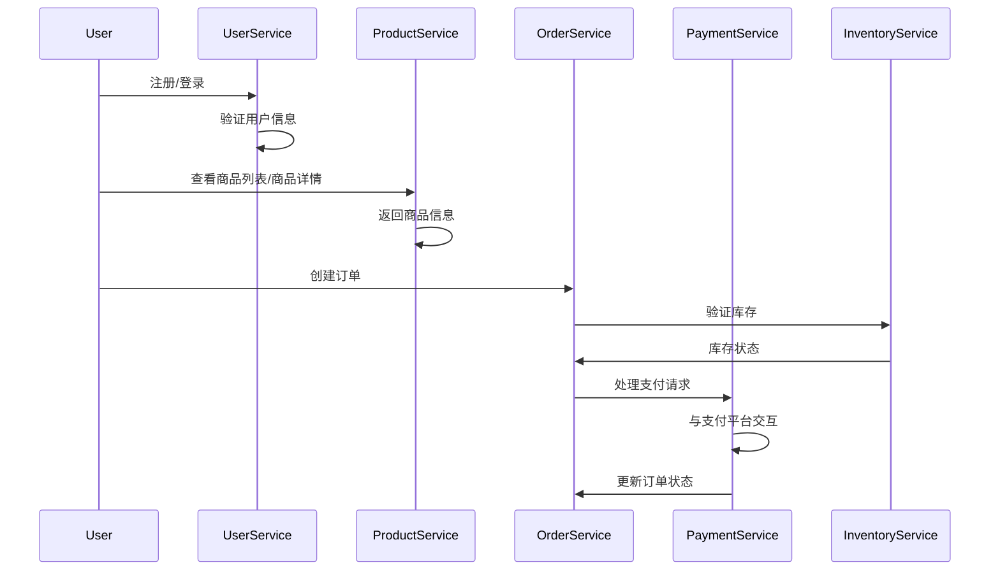

                 

### 微服务架构：构建灵活可扩展的LLM应用

## 摘要

随着云计算、分布式计算和容器化技术的快速发展，微服务架构逐渐成为现代软件开发领域的主流趋势。本文旨在深入探讨微服务架构的核心概念、设计原则、技术栈及其在构建大型语言模型（LLM）应用中的实际应用。通过系统性地分析微服务架构的各个方面，本文将为读者提供一个全面的指导，帮助他们在构建灵活、可扩展的LLM应用时充分利用微服务架构的优势。关键词：微服务架构、分布式系统、LLM应用、设计原则、技术栈。

## 引言

### 微服务架构的起源与演变

微服务架构的概念最早由马丁·福勒（Martin Fowler）在2014年提出。其核心理念是将应用程序拆分成一组小型、独立的服务，每个服务负责实现特定的业务功能。这种架构模式旨在解决传统单体架构在应对快速变化和大规模扩展时的局限性。微服务架构的起源可以追溯到互联网公司的需求，它们需要能够快速迭代、灵活扩展且易于维护的系统。

随着云计算、分布式计算和容器化技术的发展，微服务架构逐渐成熟并得到广泛应用。Docker的诞生和Kubernetes的兴起为微服务架构的实施提供了强有力的支持，使得开发人员可以轻松地将应用程序部署到容器化环境中，实现服务的自动化部署、扩展和管理。

### 微服务架构与传统架构的差异

传统单体架构（Monolithic Architecture）将应用程序的所有组件打包成一个单一的、庞大的代码库。这种架构模式在早期开发阶段较为简单，但会随着项目的不断扩展而变得复杂和难以维护。以下是微服务架构与传统单体架构的一些关键区别：

1. **组件独立性**：微服务架构中的每个服务都是独立部署和运行的，而传统单体架构中的所有组件都需要打包在一起。

2. **分布式系统**：微服务架构本质上是一个分布式系统，服务之间通过网络进行通信。传统单体架构通常是在单台服务器上运行。

3. **部署与扩展**：微服务架构支持水平扩展，即通过增加服务实例的数量来提高系统的吞吐量。传统单体架构通常需要垂直扩展，即增加服务器硬件配置。

4. **管理难度**：微服务架构需要更多的管理和监控工具，因为每个服务都需要单独管理。传统单体架构相对简单，但会随着规模的增加而变得难以维护。

### 本书的主要内容和结构

本书将分七个章节详细探讨微服务架构的各个方面。以下是本书的结构概述：

1. **第1章：引言**：概述微服务架构的概念、发展和重要性，讨论微服务架构与传统单体架构的差异，并引入本书的主要内容和结构。

2. **第2章：微服务架构的核心概念**：定义微服务、服务拆分、服务自治、分布式系统等核心概念，并讨论微服务架构的优势和挑战。

3. **第3章：微服务架构的设计原则**：介绍微服务架构的设计原则，如单一职责、无状态、松耦合等，并探讨如何应用这些原则构建高效微服务系统。

4. **第4章：微服务技术栈**：罗列并简要介绍构建微服务所需的技术栈，如Docker、Kubernetes、服务注册与发现等，并深入分析这些技术如何支持微服务架构。

5. **第5章：微服务部署与运维**：讨论微服务的部署策略，如容器化、持续集成与持续部署等，并探讨微服务的监控、日志和性能优化。

6. **第6章：微服务安全与治理**：分析微服务架构下的安全挑战和解决方案，介绍微服务治理的方法和工具。

7. **第7章：微服务项目实战**：提供微服务项目的实战案例，包括需求分析、架构设计、实现和部署，对案例进行详细解释和代码分析。

通过以上章节，读者将能够全面了解微服务架构的理论和实践，掌握构建灵活、可扩展的LLM应用的方法和技巧。接下来，我们将深入探讨微服务架构的核心概念和设计原则。### 第1章：微服务架构概述

#### 第1.1节：微服务架构的起源与演变

微服务架构的起源可以追溯到2000年代初期，当时互联网公司的需求开始逐渐变化。传统的单体架构（Monolithic Architecture）虽然能够快速构建简单的应用程序，但在应对复杂的业务需求、快速迭代和扩展方面存在显著的局限性。随着互联网的兴起，企业需要能够灵活地响应市场变化，快速开发并部署新的功能。

2005年，亚马逊率先采用微服务架构来构建其电子商务平台。亚马逊的微服务架构使得开发团队可以独立地开发、测试和部署不同的服务，从而提高了开发效率和系统可扩展性。这一成功案例激发了其他企业对微服务架构的兴趣。

2010年代，随着云计算和容器化技术的成熟，微服务架构逐渐成为主流。Docker的推出使得容器化变得简单可行，Kubernetes等工具则为容器编排提供了强大的支持。这些技术的发展为微服务架构的实施提供了基础设施，使得开发人员可以更加轻松地构建和部署微服务应用。

#### 第1.1.1 微服务架构的概念

微服务架构（Microservices Architecture）是一种基于服务的、分布式、可独立部署的软件架构风格。在微服务架构中，应用程序被拆分成一组小型、独立的微服务，每个微服务负责实现特定的业务功能。

这些微服务通常具有以下特点：

1. **独立性**：每个微服务都是独立的，可以独立部署、运行和扩展。这意味着开发团队可以独立地开发和维护每个微服务，而不必担心其他服务的依赖关系。

2. **分布式系统**：微服务架构本质上是一个分布式系统，服务之间通过网络进行通信。这使得微服务架构能够支持横向扩展，即通过增加服务实例的数量来提高系统的吞吐量。

3. **自治性**：每个微服务都有自己的数据库和其他资源，服务之间通过API进行通信。这种自治性使得每个服务都可以独立地运行和扩展，减少了服务之间的耦合度。

4. **灵活性**：微服务架构允许开发团队根据业务需求灵活地调整服务。例如，如果一个服务需要增加功能或性能，开发团队可以独立地对这个服务进行修改，而不影响其他服务。

5. **可扩展性**：微服务架构支持水平扩展，即通过增加服务实例的数量来提高系统的吞吐量。这使得微服务架构能够应对大规模的业务需求。

#### 第1.1.2 微服务架构的演变历程

微服务架构的发展历程可以分为几个阶段：

1. **单体架构的局限性**：在2000年代初期，单体架构是软件开发的主流。但随着业务需求的复杂化，单体架构在扩展性和维护性方面遇到了挑战。

2. **服务化架构的兴起**：为了解决单体架构的局限性，开发人员开始将应用程序拆分成多个服务，形成服务化架构。这种架构模式在互联网公司中得到了广泛应用。

3. **微服务架构的成熟**：随着云计算和容器化技术的成熟，微服务架构逐渐成为主流。Docker和Kubernetes等工具的推出为微服务架构的实施提供了强有力的支持。

4. **云原生微服务架构**：云原生微服务架构（Cloud-Native Microservices Architecture）是一种基于云环境的微服务架构模式。它强调容器化、自动化和DevOps文化，使得微服务架构能够更好地适应云计算环境。

#### 第1.1.3 微服务架构与传统架构的差异

微服务架构与传统单体架构之间存在显著差异，主要体现在以下几个方面：

1. **组件独立性**：在微服务架构中，每个微服务都是独立的，可以独立部署和运行。而在传统单体架构中，所有组件都需要打包在一起，难以独立部署。

2. **分布式系统**：微服务架构本质上是一个分布式系统，服务之间通过网络进行通信。而传统单体架构通常是在单台服务器上运行。

3. **部署与扩展**：微服务架构支持水平扩展，即通过增加服务实例的数量来提高系统的吞吐量。而传统单体架构通常需要垂直扩展，即增加服务器硬件配置。

4. **管理难度**：微服务架构需要更多的管理和监控工具，因为每个服务都需要单独管理。而传统单体架构相对简单，但会随着规模的增加而变得难以维护。

5. **开发模式**：在微服务架构中，开发团队可以独立地开发、测试和部署不同的服务。而在传统单体架构中，所有组件需要同步开发、测试和部署。

#### 第1.2节：微服务架构的核心概念

微服务架构的核心概念包括微服务、服务拆分、服务自治、分布式系统等。以下是对这些核心概念的定义和解释：

##### 1.2.1 微服务

微服务（Microservice）是指一种小型、独立、自治的软件单元，它负责实现特定的业务功能。微服务的核心特点是独立性，每个微服务都可以独立部署、运行和扩展。

##### 1.2.2 服务拆分

服务拆分（Service Decomposition）是指将大型、复杂的应用程序拆分成多个微服务的过程。服务拆分的目的是提高系统的可扩展性和可维护性。通过合理地拆分服务，可以减少服务之间的耦合度，提高系统的灵活性。

##### 1.2.3 服务自治

服务自治（Service Autonomy）是指每个微服务都可以独立运行、管理和扩展，服务之间通过API进行通信。服务自治使得开发团队可以独立地开发、测试和部署每个服务，提高了开发效率和系统可扩展性。

##### 1.2.4 分布式系统

分布式系统（Distributed System）是指由多个节点组成的系统，这些节点通过网络进行通信，共同完成一个任务。在微服务架构中，分布式系统是实现服务自治和横向扩展的基础。

#### 第1.3节：微服务架构的优势与挑战

微服务架构具有许多优势，但也面临一些挑战。以下是对微服务架构优势和挑战的讨论：

##### 1.3.1 微服务架构的优势

1. **可扩展性**：微服务架构支持水平扩展，通过增加服务实例的数量来提高系统的吞吐量。

2. **灵活性**：微服务架构允许开发团队根据业务需求灵活地调整服务，提高系统的可扩展性和可维护性。

3. **独立性**：每个微服务都是独立的，可以独立部署、运行和扩展，减少了服务之间的耦合度。

4. **可重用性**：微服务架构使得服务可以独立开发和部署，服务之间可以相互重用，提高了开发效率。

5. **可测试性**：微服务架构使得每个服务都可以独立测试，提高了测试效率和测试覆盖率。

##### 1.3.2 微服务架构的挑战

1. **分布式复杂性**：微服务架构是一个分布式系统，需要处理分布式数据一致性、网络延迟等问题。

2. **服务拆分难题**：合理地拆分服务是微服务架构的关键，但服务拆分需要深入理解业务需求和系统架构。

3. **服务自治管理**：服务自治意味着需要更多的管理和监控工具，如何有效地管理大量服务是一个挑战。

4. **系统复杂性**：微服务架构增加了系统的复杂性，如何保证系统整体性能和稳定性是一个挑战。

5. **团队协作**：在微服务架构中，开发团队需要更好地协作，如何提高团队协作效率是一个挑战。

#### 第1.4节：本书的主要内容和结构

本书旨在为读者提供关于微服务架构的全面指导，内容包括微服务架构的核心概念、设计原则、技术栈、部署与运维、安全与治理以及项目实战。以下是本书的结构概述：

1. **第1章：引言**：概述微服务架构的概念、发展和重要性，讨论微服务架构与传统单体架构的差异，并引入本书的主要内容和结构。

2. **第2章：微服务架构的核心概念**：定义微服务、服务拆分、服务自治、分布式系统等核心概念，并讨论微服务架构的优势和挑战。

3. **第3章：微服务架构的设计原则**：介绍微服务架构的设计原则，如单一职责、无状态、松耦合等，并探讨如何应用这些原则构建高效微服务系统。

4. **第4章：微服务技术栈**：罗列并简要介绍构建微服务所需的技术栈，如Docker、Kubernetes、服务注册与发现等，并深入分析这些技术如何支持微服务架构。

5. **第5章：微服务部署与运维**：讨论微服务的部署策略，如容器化、持续集成与持续部署等，并探讨微服务的监控、日志和性能优化。

6. **第6章：微服务安全与治理**：分析微服务架构下的安全挑战和解决方案，介绍微服务治理的方法和工具。

7. **第7章：微服务项目实战**：提供微服务项目的实战案例，包括需求分析、架构设计、实现和部署，对案例进行详细解释和代码分析。

通过以上章节，读者将能够全面了解微服务架构的理论和实践，掌握构建灵活、可扩展的LLM应用的方法和技巧。接下来，我们将深入探讨微服务架构的核心概念和设计原则。### 第2章：微服务架构的核心概念

#### 第2.1节：服务拆分

服务拆分是微服务架构中的关键步骤，其目的是将大型、复杂的应用程序拆分成一组小型、独立的微服务，从而提高系统的可扩展性和可维护性。以下是服务拆分的策略和如何评估服务拆分的可行性。

##### 2.1.1 服务拆分的策略

1. **按业务功能拆分**：根据业务功能将应用程序拆分成多个微服务。每个微服务负责实现一个独立的业务功能，例如订单管理、用户管理、库存管理等。

2. **按数据拆分**：根据数据访问模式将应用程序拆分成多个微服务。例如，可以将用户数据、订单数据和库存数据分别存储在不同的数据库中，从而提高数据访问的性能和灵活性。

3. **按技术领域拆分**：根据技术领域将应用程序拆分成多个微服务。例如，可以将前端、后端、数据库和中间件等不同的技术组件拆分成独立的微服务。

4. **按团队职责拆分**：根据团队职责将应用程序拆分成多个微服务。每个团队负责开发和维护一组相关的微服务，从而提高团队协作效率。

##### 2.1.2 如何评估服务拆分的可行性

1. **业务需求**：首先，需要评估业务需求是否支持服务拆分。如果业务需求要求高灵活性和可扩展性，那么服务拆分是可行的。

2. **技术可行性**：其次，需要评估现有技术栈是否支持服务拆分。例如，是否可以使用容器化技术、服务注册与发现工具等。

3. **团队协作**：需要评估团队协作能力是否能够支持服务拆分。例如，团队是否能够独立开发和维护一组相关的微服务。

4. **运维成本**：评估服务拆分带来的运维成本。例如，需要更多的管理和监控工具，以及更复杂的部署策略。

5. **系统复杂性**：评估服务拆分对系统复杂性的影响。合理的服务拆分可以降低系统的复杂性，但如果拆分不当，反而会增加系统的复杂性。

##### 2.1.3 服务拆分案例

假设我们有一个电子商务平台，它包含订单管理、用户管理、库存管理、支付处理等功能。以下是一个服务拆分的案例：

1. **订单管理服务**：负责处理订单的创建、更新、取消等操作。该服务可以独立部署、运行和扩展，不受其他服务的依赖。

2. **用户管理服务**：负责用户的注册、登录、个人信息管理等操作。该服务可以独立部署、运行和扩展，不受其他服务的依赖。

3. **库存管理服务**：负责管理商品的库存信息，包括商品的入库、出库、库存查询等操作。该服务可以独立部署、运行和扩展，不受其他服务的依赖。

4. **支付处理服务**：负责处理支付请求，包括订单支付、退款等操作。该服务可以独立部署、运行和扩展，不受其他服务的依赖。

通过上述服务拆分，我们可以实现以下目标：

1. **提高系统可扩展性**：每个服务都可以独立扩展，例如通过增加服务实例的数量来提高系统的吞吐量。

2. **提高系统可维护性**：每个服务都可以独立开发和维护，减少了服务之间的耦合度。

3. **提高团队协作效率**：每个团队可以独立开发和维护一组相关的微服务，从而提高团队协作效率。

#### 第2.2节：服务自治

服务自治（Service Autonomy）是指每个微服务都可以独立运行、管理和扩展，服务之间通过API进行通信。服务自治是微服务架构的核心特点之一，它带来了许多优势，但同时也带来了一些挑战。

##### 2.2.1 服务自治的概念

1. **独立运行**：每个微服务都可以独立运行，即每个服务都有自己的进程和内存空间。

2. **独立管理**：每个微服务都可以独立管理，包括部署、监控、日志记录等。

3. **独立扩展**：每个微服务都可以独立扩展，即通过增加服务实例的数量来提高系统的吞吐量。

4. **API通信**：服务之间通过API进行通信，这些API可以是RESTful API、gRPC等。

##### 2.2.2 服务自治的优势

1. **独立性**：服务自治使得每个服务都可以独立运行和扩展，减少了服务之间的耦合度，提高了系统的灵活性。

2. **可重用性**：服务自治使得服务可以独立开发和部署，服务之间可以相互重用，提高了开发效率。

3. **可测试性**：服务自治使得每个服务都可以独立测试，提高了测试效率和测试覆盖率。

4. **故障隔离**：服务自治使得服务之间相互独立，如果一个服务出现故障，不会影响到其他服务的运行。

##### 2.2.3 实现服务自治的方法

1. **独立部署**：每个服务都有自己的部署脚本，可以独立部署。

2. **独立监控**：使用监控工具对每个服务进行监控，例如Prometheus、Grafana等。

3. **独立日志记录**：使用日志记录工具对每个服务的日志进行记录，例如ELK堆栈（Elasticsearch、Logstash、Kibana）等。

4. **独立配置管理**：使用配置管理工具对每个服务的配置进行管理，例如Consul、Spring Cloud Config等。

#### 第2.3节：微服务通信

微服务通信是微服务架构中的重要组成部分，服务之间通过网络进行通信。以下是几种常见的微服务通信方式：

##### 2.3.1 RESTful API

RESTful API（Representational State Transfer Application Programming Interface）是一种基于HTTP协议的API设计风格。RESTful API具有以下特点：

1. **无状态**：每个请求都是独立的，服务器不会保留之前的请求信息。

2. **统一接口**：所有API接口都遵循统一的规范，例如使用URL表示资源，使用HTTP动词表示操作。

3. **状态转移**：客户端通过发送请求来触发服务器状态的变化。

RESTful API的优点是简单、易用，但它的缺点是性能较低，不适合处理大量并发请求。

##### 2.3.2 gRPC

gRPC（gRPC Remote Procedure Call）是一种高性能、通用的远程过程调用（RPC）框架。gRPC基于HTTP/2协议，支持多语言、多平台，具有以下优点：

1. **高效性**：gRPC使用二进制协议，减少了网络传输开销。

2. **多语言支持**：gRPC支持多种编程语言，如Java、Python、C++等。

3. **流支持**：gRPC支持双向流式通信，适用于需要实时交互的场景。

4. **负载均衡**：gRPC支持负载均衡，可以有效地分配请求到不同的服务实例。

##### 2.3.3 WebSocket

WebSocket是一种网络通信协议，提供了一种全双工通信渠道，可以实现实时、双向的数据传输。WebSocket的优点是实时性和低延迟，适用于需要实时交互的应用场景，如在线聊天、实时股票行情等。

##### 第2.4节：分布式系统

分布式系统（Distributed System）是由多个节点组成的系统，这些节点通过网络进行通信，共同完成一个任务。分布式系统具有以下特点：

1. **分布式计算**：分布式系统可以将任务分配到不同的节点上执行，提高系统的计算能力。

2. **容错性**：分布式系统可以通过冗余和故障转移来提高系统的容错性。

3. **扩展性**：分布式系统可以通过增加节点数量来提高系统的吞吐量。

4. **网络通信**：分布式系统中的节点通过网络进行通信，需要处理网络延迟、数据一致性等问题。

分布式系统面临的主要挑战是数据一致性和服务协调。分布式数据一致性（Consistency）是指多个节点上的数据保持一致。分布式服务协调（Coordination）是指多个服务之间需要协调一致，共同完成一个任务。

解决分布式系统挑战的方法包括：

1. **数据一致性协议**：如强一致性、最终一致性等。

2. **分布式锁**：用于保证分布式系统中的服务协调。

3. **消息队列**：用于异步处理分布式系统中的任务。

4. **分布式计算框架**：如Hadoop、Spark等，用于处理大规模分布式数据。

#### 第2.5节：微服务架构的优势和挑战

微服务架构具有许多优势，但同时也面临一些挑战。

##### 2.5.1 微服务架构的优势

1. **可扩展性**：微服务架构支持水平扩展，通过增加服务实例的数量来提高系统的吞吐量。

2. **灵活性**：微服务架构允许开发团队根据业务需求灵活地调整服务，提高系统的可扩展性和可维护性。

3. **独立性**：微服务架构中的每个服务都是独立的，可以独立部署、运行和扩展，减少了服务之间的耦合度。

4. **可重用性**：微服务架构使得服务可以独立开发和部署，服务之间可以相互重用，提高了开发效率。

5. **可测试性**：微服务架构使得每个服务都可以独立测试，提高了测试效率和测试覆盖率。

##### 2.5.2 微服务架构的挑战

1. **分布式复杂性**：微服务架构是一个分布式系统，需要处理分布式数据一致性、网络延迟等问题。

2. **服务拆分难题**：合理地拆分服务是微服务架构的关键，但服务拆分需要深入理解业务需求和系统架构。

3. **服务自治管理**：服务自治意味着需要更多的管理和监控工具，如何有效地管理大量服务是一个挑战。

4. **系统复杂性**：微服务架构增加了系统的复杂性，如何保证系统整体性能和稳定性是一个挑战。

5. **团队协作**：在微服务架构中，开发团队需要更好地协作，如何提高团队协作效率是一个挑战。

通过以上讨论，我们可以看到微服务架构具有许多优势，但同时也面临一些挑战。在接下来的章节中，我们将继续探讨微服务架构的设计原则和技术栈，帮助读者更好地理解和应用微服务架构。### 第3章：微服务架构的设计原则

微服务架构的成功不仅取决于技术的选择和实现，更依赖于合理的设计原则。设计原则为微服务架构的构建提供了指导，帮助开发团队构建高效、可维护、可扩展的系统。以下是一些核心的设计原则，以及如何应用这些原则构建高效微服务系统。

#### 第3.1节：单一职责原则

单一职责原则（Single Responsibility Principle，SRP）是面向对象设计中的一个基本原则。它指出，一个类（或服务）应该只负责一项功能，避免功能过于复杂。在微服务架构中，单一职责原则同样适用。

##### 3.1.1 单一职责的定义

单一职责原则是指每个服务（或类）应该只完成一个职责，这样做有以下好处：

1. **提高可维护性**：职责单一的服务更容易理解和修改，因为它们的功能相对简单。

2. **提高可测试性**：职责单一的服务更容易测试，因为测试时只需关注单一的功能点。

3. **降低耦合度**：职责单一的服务与其他服务的依赖性较低，从而降低了系统的整体复杂性。

##### 3.1.2 单一职责的实践方法

1. **功能分解**：将复杂的业务功能分解为多个单一职责的服务。例如，订单系统可以分解为订单创建服务、订单查询服务、订单修改服务等。

2. **领域驱动设计（Domain-Driven Design，DDD）**：使用DDD的方法论，根据业务领域将系统划分为多个子领域，每个子领域对应一组单一职责的服务。

3. **接口分离**：使用接口分离设计，将服务的主要功能和辅助功能分离。主要功能对外暴露，辅助功能仅用于服务内部调用。

#### 第3.2节：无状态原则

无状态原则（Statelessness）是指服务不应该保存任何状态信息。无状态服务具有以下优势：

1. **可重用性**：无状态服务可以在多个实例之间共享，从而提高资源利用率。

2. **可扩展性**：无状态服务可以水平扩展，因为新实例可以立即投入使用，不需要初始化状态。

3. **可恢复性**：无状态服务在发生故障时更容易恢复，因为无需重置状态。

##### 3.2.1 无状态的概念

无状态服务（Stateless Service）是指服务在处理请求时不依赖于客户端的状态信息。每次请求都是独立的，服务只需根据请求的内容进行处理，无需依赖之前的请求信息。

##### 3.2.2 无状态的实现方式

1. **使用缓存**：对于需要存储状态信息的服务，可以考虑使用缓存来临时存储状态，从而实现无状态。

2. **依赖外部存储**：将状态信息存储在外部存储系统（如数据库、缓存等），服务仅处理请求和响应，不保存状态。

3. **状态转移**：使用状态机模型来管理状态转换，服务根据当前状态和输入请求进行状态转移，而不保存历史状态。

##### 3.2.3 无状态的优势与挑战

1. **优势**：无状态服务具有更高的可重用性、可扩展性和可恢复性。

2. **挑战**：无状态服务可能导致较高的系统复杂性和数据一致性挑战，特别是在分布式系统中。

#### 第3.3节：松耦合原则

松耦合原则（Loose Coupling）是指服务之间应该尽量减少直接的依赖关系。松耦合有助于提高系统的灵活性和可维护性。

##### 3.3.1 松耦合的概念

松耦合（Loose Coupling）是指服务之间通过轻量级、可替换的接口进行通信，而不是直接依赖其他服务的内部实现。

##### 3.3.2 松耦合的实现方法

1. **使用API**：服务之间通过API进行通信，而不是直接调用其他服务的内部方法。

2. **事件驱动**：使用事件驱动架构，服务通过发布/订阅模式进行通信，而不是直接依赖其他服务。

3. **异步通信**：使用异步通信模式，服务可以独立处理请求，不依赖于其他服务的响应。

##### 3.3.3 松耦合的优势与挑战

1. **优势**：松耦合降低了服务之间的依赖性，提高了系统的灵活性和可维护性。

2. **挑战**：松耦合可能导致通信延迟和复杂性的增加，特别是在需要强一致性场景下。

#### 第3.4节：扩展性原则

扩展性原则（Scalability）是指系统应该能够随着用户量和业务需求的增长而灵活扩展。扩展性是微服务架构的核心目标之一。

##### 3.4.1 扩展性的概念

扩展性（Scalability）是指系统能够在性能、容量和资源使用方面随着需求增长而线性提升的能力。

##### 3.4.2 扩展性的实现方法

1. **水平扩展**：通过增加服务实例的数量来提高系统的吞吐量。例如，使用负载均衡器将请求分配到多个服务实例。

2. **垂直扩展**：通过增加服务器的硬件资源（如CPU、内存、存储等）来提高单个服务实例的性能。

3. **分布式存储**：使用分布式存储系统来提高数据访问性能和可靠性。

##### 3.4.3 扩展性的优势与挑战

1. **优势**：扩展性使系统能够灵活应对业务增长，提高用户体验。

2. **挑战**：扩展性可能导致系统设计和实现的复杂性增加，需要合理规划和设计。

#### 第3.5节：安全性原则

安全性原则（Security）是微服务架构中的一个重要方面。在分布式系统中，安全性尤为重要。

##### 3.5.1 安全性的概念

安全性（Security）是指保护系统免受未经授权的访问、篡改和攻击的能力。

##### 3.5.2 安全性的实现方法

1. **身份验证与授权**：使用身份验证（Authentication）确保只有授权用户可以访问系统，使用授权（Authorization）确保用户只能访问授权的资源。

2. **加密传输**：使用加密（Encryption）保护数据在传输过程中的安全性，例如使用TLS/SSL加密通信。

3. **访问控制**：使用访问控制（Access Control）机制确保用户只能访问授权的操作和资源。

##### 3.5.3 安全性的优势与挑战

1. **优势**：安全性保护系统的数据和资源，防止未经授权的访问和攻击。

2. **挑战**：安全性可能导致系统的复杂性和性能开销增加，需要合理平衡安全性需求与系统性能。

通过以上设计原则，开发团队可以构建高效、可维护、可扩展的微服务系统。合理应用这些原则，可以降低系统的复杂性，提高系统的灵活性和可靠性。在接下来的章节中，我们将继续探讨微服务技术栈，包括Docker、Kubernetes等工具，以及如何利用这些工具支持微服务架构。### 第4章：微服务技术栈

构建微服务架构需要一系列技术栈的支持，这些技术栈包括容器化工具、容器编排系统、服务注册与发现工具等。在本章中，我们将简要介绍这些技术，并深入分析它们如何支持微服务架构。

#### 第4.1节：Docker与容器化

Docker是一种开源容器化平台，它允许开发人员将应用程序及其依赖环境打包成一个可移植的容器，从而实现一次编写，到处运行。Docker的容器化技术为微服务架构提供了以下几个关键优势：

1. **可移植性**：Docker容器可以在任何支持Docker的操作系统上运行，从而保证了环境的可移植性。

2. **隔离性**：每个Docker容器都是独立的，具有自己的文件系统、进程和网络命名空间，从而提高了系统的隔离性。

3. **轻量级**：Docker容器比虚拟机更轻量，启动速度快，资源占用小。

4. **可扩展性**：通过Docker Compose，可以轻松地将多个容器组成一个应用程序，从而支持微服务的横向扩展。

#### 第4.1.1 Docker的概念

Docker是一个开源的应用容器引擎，它允许开发者将应用程序及其依赖环境打包成一个容器镜像（Container Image），然后运行在这些容器中。Docker容器镜像是一个静态的、不可变的文件系统，它包含了应用程序的所有必需组件，如代码、库、配置文件等。

#### 第4.1.2 Docker的基本操作

1. **构建镜像**：使用Dockerfile定义如何构建容器镜像。Dockerfile是一个文本文件，包含了一系列用于构建镜像的命令。

   ```dockerfile
   FROM python:3.9
   WORKDIR /app
   COPY . .
   RUN pip install -r requirements.txt
   ```

2. **运行容器**：使用docker run命令运行容器镜像。

   ```bash
   docker run -d -p 8000:80 my-python-app
   ```

3. **管理容器**：使用docker命令行工具管理容器，如启动、停止、重启、删除等。

   ```bash
   docker start my-python-app
   docker stop my-python-app
   docker restart my-python-app
   docker rm my-python-app
   ```

#### 第4.1.3 Docker Compose

Docker Compose是一个用于定义和运行多容器应用的工具。使用Docker Compose，可以将多个容器组成一个应用程序，并通过一个文件（通常是YAML格式）定义应用程序的各个组件及其关系。

```yaml
version: '3'
services:
  web:
    build: ./web
    ports:
      - "8000:80"
  db:
    image: mysql:5.7
    environment:
      - MYSQL_ROOT_PASSWORD=mysecretpassword
      - MYSQL_DATABASE=mydatabase
```

使用Docker Compose，可以方便地启动、停止和重启整个应用程序，而不需要单独管理每个容器。

#### 第4.2节：Kubernetes与集群管理

Kubernetes是一个开源的容器编排系统，它用于自动化容器操作，如部署、扩展和管理。Kubernetes提供了丰富的功能，支持大规模的容器化应用程序的部署和管理。

1. **自动化部署**：Kubernetes可以自动部署和更新应用程序，确保应用程序始终处于预期状态。

2. **自动化扩展**：Kubernetes可以根据资源使用情况自动扩展或收缩应用程序。

3. **高可用性**：Kubernetes提供了故障转移机制，确保应用程序在节点故障时能够自动恢复。

4. **负载均衡**：Kubernetes使用内置的负载均衡器将流量分配到不同的容器实例。

#### 第4.2.1 Kubernetes的概念

Kubernetes是一个集群管理系统，它由一系列的组件构成，包括：

1. **控制平面（Control Plane）**：控制平面负责集群的总体管理，包括调度、资源配置、监控等。

2. **工作节点（Node）**：工作节点是运行容器实例的计算机，它接收来自控制平面的指令，并执行这些指令。

3. **Pod**：Pod是Kubernetes中的最小部署单位，它包含一个或多个容器，共同运行在一个工作节点上。

4. **部署（Deployment）**：部署是用于管理Pod的控制器，确保Pod的数量和状态符合预期。

5. **服务（Service）**：服务是用于访问Pod的逻辑接口，它为Pod提供了一个稳定的网络地址。

#### 第4.2.2 Kubernetes的核心组件

1. **apiserver**：apiserver是Kubernetes的核心组件，它提供了一个RESTful API，用于与其他组件进行通信。

2. **scheduler**：scheduler负责调度Pod到合适的工作节点上运行。

3. **etcd**：etcd是一个分布式键值存储，用于存储Kubernetes的配置信息和状态信息。

4. **kubelet**：kubelet是运行在每个工作节点上的组件，它负责启动和管理Pod中的容器。

5. **kube-proxy**：kube-proxy是一个网络代理，它负责将集群内部网络流量转发到正确的Pod实例。

#### 第4.2.3 Kubernetes的基本操作

1. **部署Pod**：使用kubectl命令部署Pod。

   ```bash
   kubectl create -f pod.yaml
   ```

2. **查看Pod状态**：使用kubectl命令查看Pod的状态。

   ```bash
   kubectl get pods
   ```

3. **扩展Pod**：使用kubectl命令扩展Pod的数量。

   ```bash
   kubectl scale deployment my-deployment --replicas=3
   ```

4. **删除Pod**：使用kubectl命令删除Pod。

   ```bash
   kubectl delete -f pod.yaml
   ```

#### 第4.3节：服务注册与发现

服务注册与发现是微服务架构中的一个关键环节，它允许服务动态地注册到服务注册中心，并从服务注册中心发现其他服务的位置。

1. **服务注册**：服务启动时，会将自身的网络地址和端口号注册到服务注册中心。

2. **服务发现**：服务消费端通过服务注册中心查询服务的网络地址和端口号，从而能够调用其他服务。

#### 第4.3.1 服务注册与发现

1. **Consul**：Consul是一个开源的服务注册与发现工具，它提供了服务注册、服务发现、健康检查等功能。

2. **Eureka**：Eureka是Netflix开源的服务注册与发现组件，它用于在分布式系统中定位服务。

3. **etcd**：etcd不仅可以作为Kubernetes的存储后端，还可以作为服务注册与发现工具。

#### 第4.3.2 服务注册与发现的使用方法

1. **注册服务**：使用Consul或Eureka等工具，将服务注册到服务注册中心。

   ```bash
   consul registry -service-name my-service -port 8080
   ```

2. **发现服务**：使用服务注册中心提供的API或命令，查询服务的网络地址和端口号。

   ```bash
   consul catalog services
   ```

通过以上技术栈的支持，开发团队可以有效地构建和部署微服务架构。接下来，我们将探讨微服务的部署与运维，包括容器化、持续集成与持续部署（CI/CD）等关键环节。### 第5章：微服务部署与运维

微服务的部署与运维是确保系统稳定、高效运行的关键环节。在微服务架构中，容器化技术、持续集成与持续部署（CI/CD）流程以及监控、日志和性能优化策略起着至关重要的作用。以下是对这些方面的详细探讨。

#### 第5.1节：容器化技术

容器化技术，如Docker，为微服务的部署提供了极大的便利。通过将应用程序及其依赖环境打包成容器镜像，可以确保应用程序在不同的环境中运行一致，从而提高了系统的可移植性和可维护性。

1. **容器镜像**：容器镜像是一个静态的、不可变的文件系统，它包含了应用程序的全部内容，包括代码、库、配置文件等。创建容器镜像的常用工具是Dockerfile。

2. **容器编排**：容器编排工具，如Kubernetes，可以帮助管理多个容器的生命周期，包括部署、扩展、滚动更新等。Kubernetes通过YAML配置文件定义和管理容器化应用，从而简化了部署和运维过程。

3. **容器网络**：容器网络是容器之间进行通信的桥梁。Docker默认使用桥接网络，而Kubernetes使用自己的网络方案，通过Pod和Service来实现容器之间的通信。

#### 第5.2节：持续集成与持续部署（CI/CD）

持续集成与持续部署是现代软件开发中的关键实践，它通过自动化测试、构建和部署过程，提高了软件交付的效率和可靠性。

1. **持续集成（CI）**：持续集成是指将代码变更频繁地集成到一个共享的主干分支中，并通过自动化测试确保集成后的代码质量。CI工具，如Jenkins、GitLab CI等，可以帮助自动化构建、测试和部署过程。

2. **持续部署（CD）**：持续部署是指通过自动化工具将经过测试的代码部署到生产环境中。CD工具，如Jenkins、Kubernetes的Helm等，可以管理应用程序的部署过程，包括环境切换、滚动更新、回滚等。

3. **CI/CD流程**：一个典型的CI/CD流程包括以下步骤：

   - **代码提交**：开发人员将代码提交到版本控制系统。
   - **构建**：CI工具触发构建过程，编译应用程序并创建容器镜像。
   - **测试**：CI工具运行自动化测试，确保代码质量。
   - **部署**：通过CD工具将经过测试的代码部署到生产环境。

#### 第5.3节：监控

监控是确保微服务系统稳定运行的关键环节。通过监控，可以实时了解系统的性能、健康状态和资源使用情况。

1. **Prometheus**：Prometheus是一个开源的监控解决方案，它具有数据收集、存储和可视化等功能。Prometheus可以通过HTTP探针监控应用程序的HTTP接口、JMX接口等，从而获取应用程序的性能指标。

2. **Grafana**：Grafana是一个开源的监控和可视化工具，它可以与Prometheus等数据源集成，提供丰富的仪表板和告警功能。

3. **日志监控**：除了性能指标，日志也是监控的重要数据来源。通过收集和分析日志，可以及时发现和解决问题。ELK（Elasticsearch、Logstash、Kibana）堆栈是一个常用的日志监控解决方案。

#### 第5.4节：日志

日志是记录系统运行过程中的重要信息，它对于故障排除、性能分析和安全审计具有重要意义。

1. **日志收集**：通过日志收集器，如Filebeat、Logstash等，可以将分布式系统中的日志集中收集到一个统一的存储中。

2. **日志存储**：日志存储可以使用Elasticsearch、MySQL等数据库。Elasticsearch因其强大的搜索和分析功能，常用于日志存储。

3. **日志分析**：通过日志分析工具，如Kibana、Grok等，可以对日志数据进行实时分析和可视化，从而帮助理解和优化系统运行。

#### 第5.5节：性能优化

性能优化是确保微服务系统能够高效运行的重要环节。以下是一些常见的性能优化策略：

1. **负载均衡**：使用负载均衡器，如Nginx、HAProxy等，可以合理分配请求到不同的服务实例，从而提高系统的吞吐量和响应速度。

2. **缓存**：使用缓存，如Redis、Memcached等，可以减少数据库的访问压力，提高系统的响应速度。

3. **数据库优化**：通过索引、分片、读写分离等技术，可以提高数据库的性能和可用性。

4. **网络优化**：优化网络配置，如调整TCP参数、使用TLS加密等，可以提高网络传输效率。

5. **服务优化**：对服务进行优化，如使用异步处理、批量处理等，可以提高系统的并发处理能力。

#### 第5.6节：部署策略

微服务的部署策略对于系统的稳定性、可靠性和可扩展性具有重要影响。以下是一些常见的部署策略：

1. **滚动更新**：滚动更新是指在部署新版本的服务时，逐步替换旧版本的服务实例，从而减少系统停机时间和风险。

2. **蓝绿部署**：蓝绿部署是指同时运行两个版本的服务（蓝色和绿色），将流量逐渐切换到新版本，从而确保系统平稳升级。

3. **灰度发布**：灰度发布是指将新版本的服务逐渐上线，通过对一小部分用户进行测试，确保新版本没有问题后再全面上线。

#### 第5.7节：安全与治理

微服务架构下的安全与治理是一个复杂但关键的问题。以下是一些安全与治理的策略：

1. **身份验证与授权**：使用OAuth 2.0、JWT等协议进行身份验证和授权，确保只有授权用户可以访问系统。

2. **加密**：使用HTTPS、TLS等协议加密数据传输，确保数据在传输过程中的安全性。

3. **访问控制**：使用基于角色的访问控制（RBAC）或基于属性的访问控制（ABAC）模型，确保用户只能访问授权的资源。

4. **服务治理**：使用服务注册与发现工具，如Consul、Eureka等，实现服务的动态注册和发现，确保系统可以快速响应变化。

5. **安全审计**：定期进行安全审计，检查系统的安全配置和操作日志，及时发现和解决安全问题。

通过以上部署与运维策略，开发团队可以确保微服务系统的高效、稳定和安全运行。在下一章中，我们将探讨微服务架构下的安全与治理，帮助团队应对分布式系统中的安全挑战。### 第6章：微服务安全与治理

在微服务架构中，安全性是确保系统稳定运行的关键因素，而治理则是确保系统持续健康发展的必要手段。本章将深入探讨微服务架构下的安全挑战、解决方案以及治理方法。

#### 第6.1节：微服务架构下的安全挑战

微服务架构由于其分布式和自治的特性，带来了一系列的安全挑战：

1. **服务暴露**：微服务通常通过API暴露在互联网上，增加了攻击面。

2. **认证与授权**：微服务之间的认证与授权机制需要确保服务仅对授权用户和系统提供服务。

3. **数据安全**：在分布式系统中，数据传输和存储的安全性至关重要。

4. **分布式攻击**：攻击者可以利用微服务架构中的分布式特性发动更复杂的攻击。

5. **服务隔离**：确保一个服务出现问题时不会影响其他服务。

6. **配置管理**：配置信息的安全管理也是微服务安全的重要方面。

#### 第6.2节：安全解决方案

为了应对上述安全挑战，可以采取以下解决方案：

1. **身份验证与授权**：使用OAuth 2.0、OpenID Connect等标准协议进行身份验证和授权，确保用户和服务之间的安全通信。

2. **服务网关**：使用API网关（如Kong、NGINX）进行统一的认证、授权和请求路由，从而减少服务暴露的风险。

3. **安全加密**：使用HTTPS/TLS加密通信，确保数据在传输过程中的安全性。

4. **服务隔离**：使用容器化技术（如Docker）和容器编排系统（如Kubernetes）实现服务的隔离，确保服务之间的独立运行。

5. **配置管理**：使用配置管理工具（如HashiCorp的Vault）来安全地存储和分发配置信息。

#### 第6.3节：微服务治理

微服务治理是确保微服务架构长期稳定运行的关键。以下是一些微服务治理的方法：

1. **服务监控**：使用Prometheus、Grafana等工具对服务进行实时监控，确保服务运行在健康状态。

2. **服务日志**：使用ELK（Elasticsearch、Logstash、Kibana）等工具收集和分析服务日志，帮助快速定位和解决问题。

3. **服务发现**：使用Consul、Eureka等工具实现服务自动发现，确保服务之间可以动态地互相发现和通信。

4. **服务注册**：服务启动时自动注册到服务注册中心，服务关闭时自动注销，确保服务注册信息的实时更新。

5. **服务路由**：使用服务网关或服务路由器（如Kong、NGINX）进行服务间的请求路由，提高服务的访问效率。

6. **配置管理**：使用配置管理工具（如Spring Cloud Config、Consul）集中管理服务的配置信息，确保配置的统一和安全性。

7. **服务限流与熔断**：使用Hystrix、Resilience4j等工具实现服务限流和熔断，防止服务雪崩。

#### 第6.4节：安全治理实践

以下是一些实际的安全治理实践：

1. **定期安全审计**：定期进行安全审计，检查系统的安全配置和操作日志，及时发现和解决安全问题。

2. **漏洞管理**：建立漏洞管理机制，及时更新系统中的安全漏洞。

3. **安全培训**：对开发团队进行安全培训，提高团队成员的安全意识。

4. **安全测试**：定期进行安全测试，包括渗透测试、代码审查等，确保系统的安全性。

5. **合规性检查**：确保系统符合相关法律法规和行业标准，如GDPR、HIPAA等。

通过上述安全治理实践，开发团队可以有效地降低微服务架构中的安全风险，确保系统的安全性和稳定性。在下一章中，我们将通过一个实战案例，详细分析微服务架构的整个生命周期，从需求分析到架构设计，再到实现和部署，帮助读者更好地理解微服务架构的实践。### 第7章：微服务项目实战

#### 第7.1节：项目背景

为了更好地展示微服务架构的实际应用，我们选择构建一个简单的电子商务平台，该平台包含用户管理、商品管理、订单管理和支付处理等模块。通过这个项目，我们将从需求分析、架构设计、实现和部署等各个环节，详细展示微服务架构的应用过程。

##### 需求分析

电子商务平台的需求如下：

1. **用户管理**：允许用户注册、登录、修改个人信息等。
2. **商品管理**：允许管理员添加、修改、删除商品信息，并支持商品分类。
3. **订单管理**：允许用户创建订单，管理员处理订单，包括订单创建、修改、取消等。
4. **支付处理**：支持支付宝、微信支付等支付方式，处理支付请求，并更新订单状态。
5. **库存管理**：实时监控商品库存，确保订单创建时库存充足。

#### 第7.2节：架构设计

根据需求分析，我们将电子商务平台拆分为以下几个微服务：

1. **用户管理服务（User Service）**：负责用户的注册、登录、个人信息管理等。
2. **商品管理服务（Product Service）**：负责商品信息的添加、修改、删除和分类管理。
3. **订单管理服务（Order Service）**：负责订单的创建、修改、取消等操作。
4. **支付处理服务（Payment Service）**：负责处理支付请求，并与支付宝、微信支付等支付平台进行交互。
5. **库存管理服务（Inventory Service）**：负责监控商品库存，确保订单创建时库存充足。

##### 架构设计图

以下是一个简单的Mermaid流程图，展示了各个微服务之间的交互关系：



#### 第7.3节：开发环境搭建

为了实现上述微服务架构，我们需要搭建一个开发环境。以下是搭建过程：

1. **Docker安装**：在服务器上安装Docker，用于容器化我们的应用程序。
2. **Kubernetes集群搭建**：使用Minikube在本地环境中搭建Kubernetes集群，用于部署和管理微服务。
3. **代码仓库**：在Git上创建一个代码仓库，用于存储项目代码。

#### 第7.4节：源代码实现

以下是对各个微服务的主要实现代码进行简要概述：

##### 用户管理服务（User Service）

用户管理服务负责用户的注册、登录、个人信息管理等操作。以下是用户注册的Python代码示例：

```python
from flask import Flask, request, jsonify
from flask_jwt_extended import JWTManager, create_access_token
import os

app = Flask(__name__)
app.config['JWT_SECRET_KEY'] = os.environ['JWT_SECRET_KEY']
jwt = JWTManager(app)

@app.route('/register', methods=['POST'])
def register():
    username = request.form.get('username')
    password = request.form.get('password')
    # 保存用户信息到数据库
    # ...
    return jsonify({'message': 'User registered successfully'}), 200

@app.route('/login', methods=['POST'])
def login():
    username = request.form.get('username')
    password = request.form.get('password')
    # 验证用户信息
    # ...
    access_token = create_access_token(identity=username)
    return jsonify({'access_token': access_token}), 200

if __name__ == '__main__':
    app.run(host='0.0.0.0', port=5000)
```

##### 商品管理服务（Product Service）

商品管理服务负责商品信息的添加、修改、删除和分类管理。以下是商品添加的Python代码示例：

```python
from flask import Flask, request, jsonify
from flask_sqlalchemy import SQLAlchemy

app = Flask(__name__)
app.config['SQLALCHEMY_DATABASE_URI'] = 'sqlite:///products.db'
db = SQLAlchemy(app)

class Product(db.Model):
    id = db.Column(db.Integer, primary_key=True)
    name = db.Column(db.String(80), nullable=False)
    price = db.Column(db.Float, nullable=False)
    category_id = db.Column(db.Integer, db.ForeignKey('category.id'), nullable=False)

class Category(db.Model):
    id = db.Column(db.Integer, primary_key=True)
    name = db.Column(db.String(80), nullable=False)

@app.route('/products', methods=['POST'])
def add_product():
    name = request.form.get('name')
    price = request.form.get('price')
    category_id = request.form.get('category_id')
    # 创建商品并保存到数据库
    # ...
    return jsonify({'message': 'Product added successfully'}), 200

if __name__ == '__main__':
    db.create_all()
    app.run(host='0.0.0.0', port=5001)
```

##### 订单管理服务（Order Service）

订单管理服务负责订单的创建、修改、取消等操作。以下是订单创建的Python代码示例：

```python
from flask import Flask, request, jsonify
from flask_jwt_extended import JWTManager, jwt_required, get_jwt_identity
from sqlalchemy import create_engine

app = Flask(__name__)
app.config['SQLALCHEMY_DATABASE_URI'] = 'sqlite:///orders.db'
app.config['JWT_SECRET_KEY'] = os.environ['JWT_SECRET_KEY']
jwt = JWTManager(app)
engine = create_engine('sqlite:///orders.db')

@app.route('/orders', methods=['POST'])
@jwt_required()
def create_order():
    user_id = get_jwt_identity()
    product_ids = request.form.getlist('product_ids[]')
    quantities = request.form.getlist('quantities[]')
    # 验证库存并创建订单
    # ...
    return jsonify({'message': 'Order created successfully'}), 200

if __name__ == '__main__':
    db.create_all()
    app.run(host='0.0.0.0', port=5002)
```

##### 支付处理服务（Payment Service）

支付处理服务负责处理支付请求，并与支付宝、微信支付等支付平台进行交互。以下是支付宝支付处理的Python代码示例：

```python
from flask import Flask, request, jsonify
from alipay import AliPay

app = Flask(__name__)
alipay = AliPay(
    appid="",
    app_notify_url="",
    app_private_key_path="",
    alipay_public_key_path="",
    return_url=""
)

@app.route('/alipay/return', methods=['GET'])
def alipay_return():
    # 处理支付宝支付回调
    # ...
    return jsonify({'message': 'Payment success'}), 200

@app.route('/alipay/notify', methods=['POST'])
def alipay_notify():
    # 处理支付宝支付通知
    # ...
    return jsonify({'message': 'Payment success'}), 200

if __name__ == '__main__':
    app.run(host='0.0.0.0', port=5003)
```

##### 库存管理服务（Inventory Service）

库存管理服务负责监控商品库存，确保订单创建时库存充足。以下是库存检查的Python代码示例：

```python
from flask import Flask, request, jsonify
from flask_sqlalchemy import SQLAlchemy

app = Flask(__name__)
app.config['SQLALCHEMY_DATABASE_URI'] = 'sqlite:///inventory.db'
db = SQLAlchemy(app)

class Product(db.Model):
    id = db.Column(db.Integer, primary_key=True)
    name = db.Column(db.String(80), nullable=False)
    price = db.Column(db.Float, nullable=False)
    quantity = db.Column(db.Integer, nullable=False)

@app.route('/inventory/check', methods=['POST'])
def check_inventory():
    product_id = request.form.get('product_id')
    quantity = request.form.get('quantity')
    # 检查库存
    # ...
    return jsonify({'message': 'Inventory check passed'}), 200

if __name__ == '__main__':
    db.create_all()
    app.run(host='0.0.0.0', port=5004)
```

#### 第7.5节：代码解读与分析

上述代码示例展示了各个微服务的基本实现。接下来，我们对关键代码进行解读和分析：

1. **用户管理服务**：用户管理服务使用Flask框架和JWT扩展实现。注册接口接收用户名和密码，验证后保存到数据库。登录接口验证用户信息，并生成JWT令牌。

2. **商品管理服务**：商品管理服务使用Flask框架和SQLAlchemy实现。商品信息存储在SQLite数据库中，通过RESTful API提供商品添加、查询等功能。

3. **订单管理服务**：订单管理服务使用Flask框架和SQLAlchemy实现。订单创建接口接收用户ID和商品ID，验证库存后保存订单信息。该服务需要与用户管理服务和库存管理服务进行交互。

4. **支付处理服务**：支付处理服务使用Flask框架和支付宝SDK实现。支付接口处理支付宝支付回调，更新订单状态。该服务需要与支付宝支付平台进行交互。

5. **库存管理服务**：库存管理服务使用Flask框架和SQLAlchemy实现。库存检查接口验证商品库存，确保订单创建时库存充足。

#### 第7.6节：项目部署

项目部署分为以下几个步骤：

1. **构建Docker镜像**：使用Dockerfile为每个微服务构建Docker镜像。

2. **部署到Kubernetes集群**：使用Kubernetes配置文件（YAML文件）部署微服务到集群中。

3. **服务发现与路由**：使用Kubernetes服务（Service）实现微服务之间的发现和路由。

4. **持续集成与部署**：使用Jenkins或GitLab CI/CD实现持续集成与部署。

#### 第7.7节：项目小结

通过本次项目实战，我们实现了以下目标：

1. **需求分析**：根据业务需求，拆分出用户管理、商品管理、订单管理、支付处理和库存管理五个微服务。

2. **架构设计**：设计了简单的微服务架构，并通过Mermaid流程图展示了各个微服务之间的交互关系。

3. **代码实现**：实现了各个微服务的基本功能，包括用户注册、登录、商品管理、订单创建、支付处理和库存检查。

4. **项目部署**：成功部署了微服务架构，并使用Kubernetes进行服务管理和运维。

5. **代码解读与分析**：对关键代码进行了解读和分析，展示了微服务架构的实践过程。

通过这个项目实战，读者可以更好地理解微服务架构的原理和实践方法，为在实际项目中应用微服务架构打下坚实的基础。### 第8章：最佳实践、注意事项与拓展阅读

#### 第8.1节：最佳实践

在构建微服务架构时，遵循以下最佳实践可以提升系统的稳定性、可维护性和可扩展性：

1. **标准化服务接口**：确保所有服务接口遵循统一的RESTful API规范，包括请求和响应格式，以提高系统的互操作性。

2. **实现服务自治**：每个微服务应实现自治，拥有独立的数据库、配置和日志，减少服务之间的依赖性。

3. **使用容器化技术**：利用Docker等容器化技术，简化部署和运维过程，提高系统的可移植性。

4. **实施持续集成与持续部署（CI/CD）**：通过CI/CD工具实现自动化测试、构建和部署，提高开发效率和软件质量。

5. **监控和日志管理**：使用Prometheus、Grafana、ELK等工具对系统进行实时监控和日志管理，确保能够快速识别和解决问题。

6. **安全性设计**：在服务设计中考虑安全性，包括身份验证、授权、加密传输等，以防止未授权访问和数据泄露。

7. **服务版本管理**：为每个服务实现版本管理，便于在更新和回滚时减少对其他服务的影响。

8. **优化网络通信**：合理配置网络参数，优化服务之间的通信，减少延迟和开销。

#### 第8.2节：注意事项

在微服务架构的实施过程中，需要注意以下几点：

1. **服务拆分与耦合度**：合理拆分服务，避免过度拆分导致系统复杂性增加。同时，注意控制服务之间的耦合度，以减少依赖关系。

2. **数据一致性与分布式系统**：分布式系统中的数据一致性问题是一个挑战，需要设计合适的分布式数据一致性策略，如最终一致性、强一致性等。

3. **服务监控与告警**：确保对每个服务进行全面的监控和告警配置，及时发现异常并进行处理。

4. **系统容错性**：设计系统时，要考虑容错机制，如服务故障转移、数据备份等，以提高系统的可靠性。

5. **团队协作**：微服务架构需要团队成员之间的紧密协作，确保各个服务之间的接口定义和版本管理一致。

6. **性能优化**：在系统设计时考虑性能优化，包括数据库查询优化、缓存策略等，以避免系统成为性能瓶颈。

#### 第8.3节：拓展阅读

以下是一些推荐的拓展阅读资源，可以帮助读者进一步深入了解微服务架构：

1. **《微服务设计》**：由Christopher M. Richardson撰写的经典书籍，详细介绍了微服务架构的设计原则、模式和技术。

2. **《Kubernetes权威指南》**：由刘天宇、唐刘编写，提供了全面的Kubernetes集群搭建、运维和应用的实战指南。

3. **《微服务架构实战》**：由Sam Newnham撰写的书籍，通过具体案例展示了微服务架构的实现过程和最佳实践。

4. **《分布式系统设计》**：由Martin Kleppmann撰写的书籍，深入探讨了分布式系统的设计原则、挑战和解决方案。

5. **《Spring Cloud微服务实战》**：由张宴林撰写的书籍，介绍了如何使用Spring Cloud构建微服务架构，包括服务注册与发现、负载均衡、断路器等。

6. **《Docker实战》**：由Jason Myers和Edward J. Capriolo撰写的书籍，提供了丰富的Docker实践案例，包括容器化、容器编排等。

通过以上最佳实践、注意事项和拓展阅读资源，读者可以更好地理解微服务架构的原理和实践，为构建高效的微服务系统提供有力支持。### 结论

微服务架构作为一种现代软件设计方法，以其灵活、可扩展和自治的特性，在复杂的应用场景中展现出了巨大的优势。通过本章的探讨，我们系统地介绍了微服务架构的核心概念、设计原则、技术栈以及在实际项目中的应用。从服务拆分、服务自治到分布式系统，再到容器化、持续集成与持续部署，微服务架构为开发团队提供了一种系统性的解决方案，以应对快速变化的市场需求。

然而，微服务架构并非没有挑战。分布式复杂性、数据一致性和安全性等问题需要我们深入思考和精心设计。通过合理的服务拆分、松耦合原则、无状态设计和扩展性策略，我们可以构建高效、可靠的微服务系统。此外，持续集成与持续部署、监控与日志管理、安全与治理等最佳实践，也是确保系统稳定运行的关键。

在未来的实践中，我们鼓励读者持续探索和学习微服务架构的最新动态和技术。随着云计算、人工智能和物联网等技术的不断演进，微服务架构将继续发展和完善，为开发者带来更多的创新机遇。希望本文能为读者提供有益的启示，帮助您在构建灵活、可扩展的LLM应用时，充分发挥微服务架构的优势。作者：AI天才研究院/AI Genius Institute & 禅与计算机程序设计艺术 /Zen And The Art of Computer Programming。期待与读者在技术探索的道路上共同成长。

