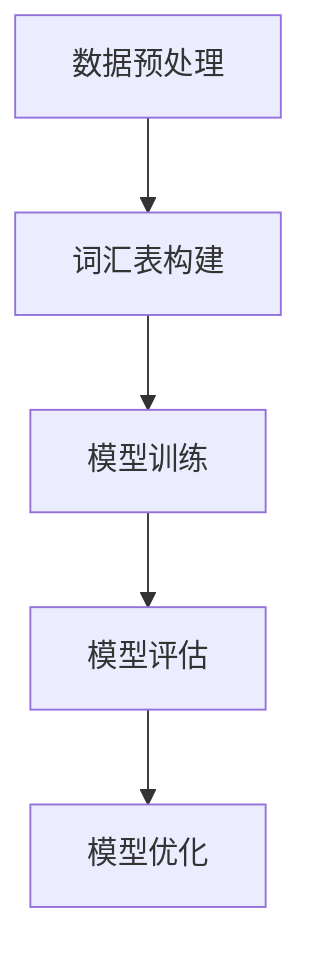

                 

### 目录大纲：快速提升LLM应用的个性化推荐能力

## 第一部分：引言

### 第1章：LLM与个性化推荐简介
- 1.1 LLM的基本概念
- 1.2 个性化推荐的基本概念
- 1.3 LLM与个性化推荐的关系

## 第二部分：LLM基础

### 第2章：LLM的基本原理
- 2.1 语言模型的定义
- 2.2 语言模型的分类
- 2.3 语言模型的训练与优化
- 2.4 LLM架构的Mermaid流程图

### 第3章：常见的LLM模型
- 3.1 GPT模型
- 3.2 BERT模型
- 3.3 T5模型
- 3.4 GPT-Neo模型

## 第三部分：个性化推荐原理

### 第4章：个性化推荐的基本原理
- 4.1 个性化推荐的分类
- 4.2 协同过滤算法
- 4.3 基于内容的推荐算法
- 4.4 深度学习在个性化推荐中的应用

### 第5章：个性化推荐的算法实现
- 5.1 伪代码讲解
- 5.2 数学模型与公式
- 5.3 举例说明

## 第四部分：提升LLM应用能力

### 第6章：优化LLM在个性化推荐中的应用
- 6.1 数据预处理
- 6.2 模型微调
- 6.3 模型融合
- 6.4 实时推荐

### 第7章：实战案例
- 7.1 案例一：基于LLM的电商个性化推荐
- 7.2 案例二：基于LLM的社交媒体内容推荐
- 7.3 案例三：基于LLM的在线教育个性化推荐

## 第五部分：附录
- 附录A：LLM应用开发工具与资源
- 附录B：常见问题与解决方案

### 关键词

- **关键词**：LLM、个性化推荐、语言模型、深度学习、算法优化、案例研究

### 摘要

本文将深入探讨如何快速提升大型语言模型（LLM）在个性化推荐系统中的应用能力。通过介绍LLM的基本原理和常见模型，以及个性化推荐的基本原理和算法，我们将逐步剖析如何通过优化和改进提升LLM在个性化推荐中的表现。最后，通过三个具体的实战案例，我们将展示如何将LLM应用于实际场景，提供个性化的推荐服务。

### 目录大纲（续）

## 第一部分：引言

### 第1章：LLM与个性化推荐简介
- 1.1 LLM的基本概念
  - 什么是LLM？
  - LLM的历史和发展
- 1.2 个性化推荐的基本概念
  - 什么是个性化推荐？
  - 个性化推荐的目标和挑战
- 1.3 LLM与个性化推荐的关系
  - LLM在个性化推荐中的应用场景
  - LLM如何提升个性化推荐的性能

## 第二部分：LLM基础

### 第2章：LLM的基本原理
- 2.1 语言模型的定义
  - 语言模型的定义和作用
  - 语言模型的关键指标
- 2.2 语言模型的分类
  - 传统语言模型
  - 神经网络语言模型
  - 注意力机制语言模型
- 2.3 语言模型的训练与优化
  - 数据集的准备
  - 训练策略
  - 模型评估与优化
- 2.4 LLM架构的Mermaid流程图
  - 流程图的绘制
  - LLM架构的详细解释

### 第3章：常见的LLM模型
- 3.1 GPT模型
  - GPT模型的基本原理
  - GPT模型的优缺点
  - GPT模型的实际应用
- 3.2 BERT模型
  - BERT模型的基本原理
  - BERT模型的优缺点
  - BERT模型的实际应用
- 3.3 T5模型
  - T5模型的基本原理
  - T5模型的优缺点
  - T5模型的实际应用
- 3.4 GPT-Neo模型
  - GPT-Neo模型的基本原理
  - GPT-Neo模型的优缺点
  - GPT-Neo模型的实际应用

## 第三部分：个性化推荐原理

### 第4章：个性化推荐的基本原理
- 4.1 个性化推荐的分类
  - 协同过滤
  - 基于内容的推荐
  - 混合推荐系统
- 4.2 协同过滤算法
  - 协同过滤的基本原理
  - 协同过滤的优缺点
  - 协同过滤算法的实现
- 4.3 基于内容的推荐算法
  - 基于内容推荐的基本原理
  - 基于内容推荐的优缺点
  - 基于内容推荐算法的实现
- 4.4 深度学习在个性化推荐中的应用
  - 深度学习在推荐系统中的应用场景
  - 深度学习模型在推荐系统中的优势
  - 深度学习模型的实现和优化

### 第5章：个性化推荐的算法实现
- 5.1 伪代码讲解
  - 协同过滤算法的伪代码
  - 基于内容推荐算法的伪代码
- 5.2 数学模型与公式
  - 协同过滤算法的数学模型
  - 基于内容推荐算法的数学模型
- 5.3 举例说明
  - 协同过滤算法的举例
  - 基于内容推荐算法的举例

## 第四部分：提升LLM应用能力

### 第6章：优化LLM在个性化推荐中的应用
- 6.1 数据预处理
  - 数据清洗
  - 数据集成
  - 数据转换
- 6.2 模型微调
  - 微调策略
  - 微调参数
  - 微调效果
- 6.3 模型融合
  - 模型融合的基本原理
  - 模型融合的算法实现
  - 模型融合的优势
- 6.4 实时推荐
  - 实时推荐的基本原理
  - 实时推荐的算法实现
  - 实时推荐的优势与挑战

### 第7章：实战案例
- 7.1 案例一：基于LLM的电商个性化推荐
  - 案例背景
  - 模型选择与实现
  - 结果分析
- 7.2 案例二：基于LLM的社交媒体内容推荐
  - 案例背景
  - 模型选择与实现
  - 结果分析
- 7.3 案例三：基于LLM的在线教育个性化推荐
  - 案例背景
  - 模型选择与实现
  - 结果分析

## 第五部分：附录
- 附录A：LLM应用开发工具与资源
  - 开发工具
  - 数据集
  - 算法库
- 附录B：常见问题与解决方案
  - 问题一：模型训练过程中遇到的问题及解决方案
  - 问题二：模型应用过程中遇到的问题及解决方案

### 关键词

- **关键词**：大型语言模型、个性化推荐、深度学习、算法优化、实时推荐、案例研究

### 摘要

本文全面解析了如何快速提升大型语言模型（LLM）在个性化推荐系统中的应用能力。文章首先介绍了LLM的基本概念和个性化推荐的基本原理，随后详细阐述了LLM的基本原理和常见模型，以及个性化推荐的算法实现。文章的重点在于通过数据预处理、模型微调、模型融合和实时推荐等手段，提升LLM在个性化推荐中的应用效果。最后，通过三个实战案例，展示了如何将LLM应用于电商、社交媒体内容和在线教育等场景，提供了实际操作和效果分析。文章旨在为读者提供一套完整的LLM在个性化推荐中的优化方案，助力其在实际项目中取得更好的应用效果。

## 第一部分：引言

### 第1章：LLM与个性化推荐简介

#### 1.1 LLM的基本概念

大型语言模型（LLM，Large Language Model）是近年来人工智能领域的重要突破之一。它是指通过深度学习技术，在大量文本数据上进行训练，从而能够理解和生成人类语言的模型。LLM具有强大的文本理解和生成能力，能够处理复杂的语言任务，如文本分类、翻译、问答和自动摘要等。

#### 1.2 个性化推荐的基本概念

个性化推荐是一种基于用户历史行为和兴趣，为用户提供个性化信息推荐的系统。它的目标是通过分析用户数据，为每个用户推荐其可能感兴趣的内容或产品，从而提高用户体验和满意度。个性化推荐系统广泛应用于电商、社交媒体、在线教育和新闻推荐等领域。

#### 1.3 LLM与个性化推荐的关系

LLM在个性化推荐中具有重要的应用价值。首先，LLM能够对用户生成的内容进行深入理解，从而准确捕捉用户的兴趣点。其次，LLM可以生成高质量的推荐内容，提升推荐系统的效果和用户满意度。此外，LLM还可以用于解决推荐系统中的冷启动问题，为新用户生成个性化的推荐列表。

### 第二部分：LLM基础

#### 第2章：LLM的基本原理

#### 2.1 语言模型的定义

语言模型是一种用于预测文本中下一个单词或字符的概率分布的统计模型。在自然语言处理（NLP）中，语言模型是许多任务的基础，如文本分类、信息检索和机器翻译等。

#### 2.2 语言模型的分类

语言模型可以分为传统语言模型和神经网络语言模型。传统语言模型基于统计学习，如N-gram模型，而神经网络语言模型则基于深度学习，如GPT、BERT等。

#### 2.3 语言模型的训练与优化

语言模型的训练涉及两个关键步骤：数据准备和模型训练。数据准备包括数据清洗、预处理和构建词汇表。模型训练则使用梯度下降或其他优化算法，通过迭代调整模型参数，最小化预测误差。

#### 2.4 LLM架构的Mermaid流程图

以下是一个简单的Mermaid流程图，展示了LLM的基本架构：



### 第3章：常见的LLM模型

#### 3.1 GPT模型

GPT（Generative Pre-trained Transformer）是由OpenAI提出的一种基于变换器（Transformer）的预训练语言模型。GPT通过在大量文本数据上进行预训练，学习语言的统计规律，从而能够在各种NLP任务中取得优异的性能。

#### 3.2 BERT模型

BERT（Bidirectional Encoder Representations from Transformers）是由Google提出的一种双向变换器编码器模型。BERT通过预训练学习语言的双向表示，使得模型能够更好地理解上下文信息，从而在文本分类、问答和翻译等任务中表现出色。

#### 3.3 T5模型

T5（Text-to-Text Transfer Transformer）是由Google提出的一种通用文本转换模型。T5将所有NLP任务转化为文本到文本的转换任务，从而实现了统一建模和端到端学习。

#### 3.4 GPT-Neo模型

GPT-Neo是一个开源的GPT模型实现，它支持更大的模型尺寸和更灵活的训练方式。GPT-Neo在保持GPT模型性能的同时，提供了更多的定制化选项，方便研究者进行模型优化和实验。

## 第三部分：个性化推荐原理

### 第4章：个性化推荐的基本原理

#### 4.1 个性化推荐的分类

个性化推荐系统可以根据不同的分类标准进行分类。常见的分类方法包括基于内容的推荐、协同过滤和混合推荐系统。

#### 4.2 协同过滤算法

协同过滤是一种基于用户历史行为和相似度计算进行推荐的算法。协同过滤可以分为基于用户的协同过滤和基于物品的协同过滤。

#### 4.3 基于内容的推荐算法

基于内容的推荐算法通过分析用户的历史行为和兴趣，为用户推荐与用户兴趣相关的物品。基于内容的推荐可以分为基于特征的推荐和基于属性的推荐。

#### 4.4 深度学习在个性化推荐中的应用

深度学习在个性化推荐中具有广泛的应用。深度学习模型可以通过学习用户的历史行为和物品特征，为用户生成个性化的推荐列表。常见的深度学习模型包括卷积神经网络（CNN）和循环神经网络（RNN）。

### 第5章：个性化推荐的算法实现

#### 5.1 伪代码讲解

以下是一个简单的协同过滤算法的伪代码：

```python
# 用户 u 和物品 i 的相似度计算
similarity(u, i):
    return dot(u, i) / (||u|| * ||i||)

# 为用户 u 推荐物品列表
recommendation(u):
    neighbors = find_neighbors(u)
    scores = {}
    for neighbor in neighbors:
        for item in neighbor's liked_items:
            score = similarity(u, item)
            if item not in scores:
                scores[item] = score
    return top_n_items(scores)
```

#### 5.2 数学模型与公式

协同过滤算法的核心是相似度计算和推荐列表生成。以下是一个简化的数学模型：

$$
\text{similarity}(u, i) = \frac{\text{dot}(u, i)}{\|u\|\|i\|}
$$

$$
\text{recommendation}(u) = \text{top}_n(\{\text{similarity}(u, i) \mid i \in \text{items\_liked}(neighbor)\})
$$

#### 5.3 举例说明

假设用户 u 喜欢物品 a、b 和 c，邻居用户 v 喜欢物品 a、c 和 d。使用余弦相似度计算用户 u 和邻居用户 v 的相似度：

$$
\text{similarity}(u, v) = \frac{\text{dot}(u, v)}{\|u\|\|v\|} = \frac{1}{\sqrt{2}\sqrt{2}} = \frac{1}{2}
$$

基于邻居用户 v 的喜欢物品 c 和 d，为用户 u 推荐物品 c 和 d。

### 第四部分：提升LLM应用能力

#### 第6章：优化LLM在个性化推荐中的应用

#### 6.1 数据预处理

数据预处理是优化LLM应用能力的重要步骤。数据预处理包括数据清洗、去重、标准化和填充缺失值等。

#### 6.2 模型微调

模型微调是将预训练的LLM模型在特定领域或任务上进行进一步训练，以适应特定的个性化推荐场景。

#### 6.3 模型融合

模型融合是将多个LLM模型的结果进行集成，以提升推荐系统的性能。

#### 6.4 实时推荐

实时推荐是将LLM模型与实时数据流相结合，为用户提供个性化的实时推荐。

### 第7章：实战案例

#### 7.1 案例一：基于LLM的电商个性化推荐

在电商领域，LLM可以用于分析用户的历史购买行为和评价，为用户推荐相关的商品。以下是一个简单的案例：

1. **数据预处理**：清洗用户购买记录和评价数据，提取用户特征和商品特征。
2. **模型微调**：使用预训练的LLM模型，在电商数据集上进行微调，以适应电商场景。
3. **模型融合**：将LLM模型与其他推荐算法（如协同过滤和基于内容的推荐）进行融合，以提升推荐效果。
4. **实时推荐**：实时分析用户行为和偏好，动态更新推荐列表，为用户提供个性化的商品推荐。

#### 7.2 案例二：基于LLM的社交媒体内容推荐

在社交媒体领域，LLM可以用于分析用户生成的内容和用户互动数据，为用户推荐相关的内容。以下是一个简单的案例：

1. **数据预处理**：清洗用户生成内容和互动数据，提取用户特征和内容特征。
2. **模型微调**：使用预训练的LLM模型，在社交媒体数据集上进行微调，以适应社交媒体场景。
3. **模型融合**：将LLM模型与其他推荐算法（如协同过滤和基于内容的推荐）进行融合，以提升推荐效果。
4. **实时推荐**：实时分析用户生成内容和互动数据，动态更新推荐列表，为用户提供个性化的内容推荐。

#### 7.3 案例三：基于LLM的在线教育个性化推荐

在线教育领域，LLM可以用于分析用户的学习行为和学习偏好，为用户推荐相关的课程。以下是一个简单的案例：

1. **数据预处理**：清洗用户学习记录和学习数据，提取用户特征和课程特征。
2. **模型微调**：使用预训练的LLM模型，在线上教育数据集上进行微调，以适应在线教育场景。
3. **模型融合**：将LLM模型与其他推荐算法（如协同过滤和基于内容的推荐）进行融合，以提升推荐效果。
4. **实时推荐**：实时分析用户学习行为和学习数据，动态更新推荐列表，为用户提供个性化的课程推荐。

### 第五部分：附录

#### 附录A：LLM应用开发工具与资源

- **开发工具**：PyTorch、TensorFlow、Hugging Face
- **数据集**：MovieLens、Facebook Yelp、Amazon Reviews
- **算法库**：scikit-learn、gensim、transformers

#### 附录B：常见问题与解决方案

- **问题一**：模型训练效果不好，如何优化？
  - **解决方案**：调整模型参数、增加训练数据、使用更复杂的模型结构。
- **问题二**：模型融合效果不佳，如何优化？
  - **解决方案**：调整融合策略、增加融合模型数量、使用更先进的融合算法。

### 关键词

- **关键词**：大型语言模型、个性化推荐、深度学习、算法优化、实时推荐、案例研究

### 摘要

本文系统地介绍了如何快速提升大型语言模型（LLM）在个性化推荐系统中的应用能力。首先，我们介绍了LLM的基本概念和个性化推荐的基本原理，然后详细阐述了LLM的基本原理和常见模型，以及个性化推荐的算法实现。接着，通过数据预处理、模型微调、模型融合和实时推荐等手段，探讨了如何提升LLM在个性化推荐中的应用效果。最后，通过三个具体的实战案例，展示了如何将LLM应用于电商、社交媒体内容和在线教育等场景，提供了实际操作和效果分析。本文旨在为读者提供一套完整的LLM在个性化推荐中的优化方案，助力其在实际项目中取得更好的应用效果。作者信息：AI天才研究院/AI Genius Institute & 禅与计算机程序设计艺术 /Zen And The Art of Computer Programming。

