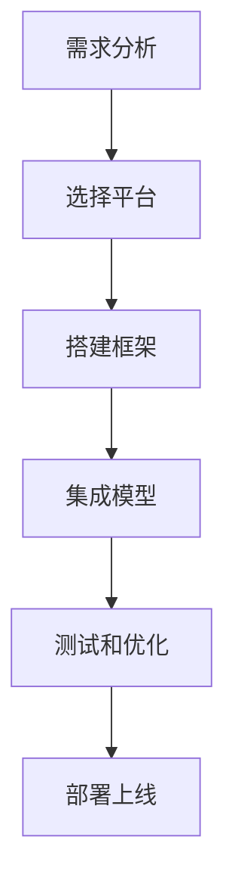
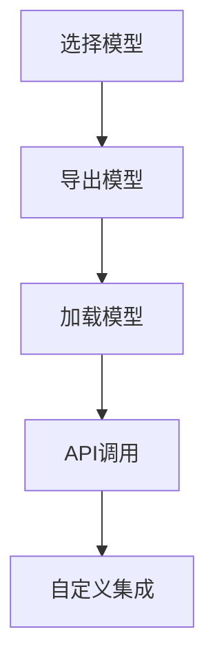
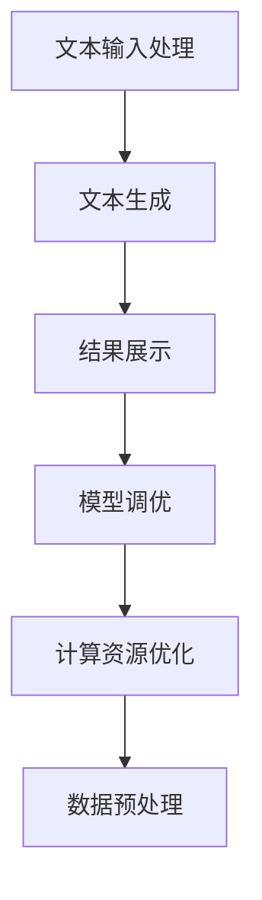
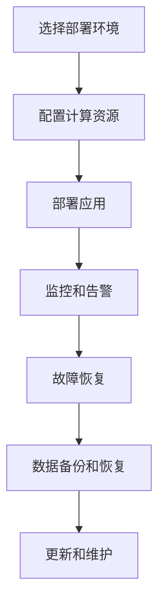

                 

### 快速构建LLM应用的低代码平台

#### 关键词：
- 低代码平台
- 大型语言模型（LLM）
- 应用开发
- 集成
- 优化
- 部署

#### 摘要：
本文旨在探讨如何利用低代码平台快速构建大型语言模型（LLM）应用。通过概述低代码平台的优势、常见的低代码平台、构建LLM应用的步骤以及核心概念和联系，本文为开发者提供了清晰易懂的指南，帮助他们轻松实现高效的LLM应用开发。

## 1. 快速构建LLM应用的低代码平台

### 1.1 概述

在人工智能领域，大型语言模型（LLM）因其强大的文本生成和处理能力，在自然语言处理、文本摘要、机器翻译等任务中表现出色。然而，传统的LLM应用开发流程复杂，涉及大量的底层技术细节，对于开发者的技术要求较高。为了降低开发门槛和提高开发效率，低代码平台应运而生。低代码平台通过提供可视化界面和丰富的组件，使得开发者可以无需编写大量代码，快速搭建和部署LLM应用。

低代码平台的优势在于：

- **降低开发门槛**：低代码平台将复杂的开发任务简化为拖拽和配置，使得开发者无需深入了解底层技术细节，即可快速构建应用程序。
- **提高开发效率**：通过低代码平台的组件和工具，开发者可以快速完成应用程序的搭建，缩短开发周期。
- **易于维护和扩展**：低代码平台通常具有良好的模块化设计，使得应用易于维护和扩展。

### 1.2 低代码平台的优势

#### 1.2.1 降低开发门槛

低代码平台通过提供可视化的界面和组件，使得开发者可以无需编写代码或仅编写少量代码，即可完成应用程序的搭建。例如，在OutSystems平台上，开发者可以使用拖拽方式创建表单、按钮和列表等组件，并通过配置属性来定义组件的行为和样式。这种直观的开发方式降低了开发门槛，使得非专业的开发者也可以快速上手，构建功能丰富的应用。

#### 1.2.2 提高开发效率

低代码平台提供了丰富的组件和工具，可以帮助开发者快速搭建应用程序。例如，在AppSheet平台上，开发者可以通过在线表单收集用户输入的数据，并自动生成基于这些数据的移动和Web应用。这种快速搭建的方式大大提高了开发效率，使得开发者可以专注于业务逻辑的实现，而无需耗费大量时间在界面设计和代码编写上。

#### 1.2.3 易于维护和扩展

低代码平台通常具有良好的模块化设计，使得应用易于维护和扩展。例如，在OutSystems平台上，应用由多个模块组成，每个模块都可以独立开发和部署。这种模块化设计使得应用在后续的维护和升级过程中更加便捷，开发者可以仅针对特定模块进行修改，而无需影响整个应用的运行。

### 1.3 常见的低代码平台

低代码平台种类繁多，以下介绍几种常见的低代码平台：

#### 1.3.1 Airtable

Airtable是一款功能强大的低代码数据库和表格工具，它将数据库和表格的功能融合在一起，提供了一种直观的方式来管理数据和应用搭建。开发者可以使用Airtable创建自定义表格，设置字段类型和关系，并通过拖拽组件快速搭建数据可视化和交互应用。Airtable支持各种数据库操作，如增删查改，同时提供API接口，方便与其他应用程序集成。

#### 1.3.2 OutSystems

OutSystems是一款全面的低代码开发平台，支持构建企业级应用程序。OutSystems提供了丰富的组件和工具，包括表单、列表、地图、图表等，开发者可以通过拖拽和配置的方式快速搭建应用。OutSystems还提供了强大的后台管理功能，支持用户权限管理、数据备份和恢复等。OutSystems适用于各种规模的企业，从初创公司到大型企业都可以使用。

#### 1.3.3 AppSheet

AppSheet是一款无需编写代码的移动和Web应用程序开发平台。开发者可以使用AppSheet创建自定义表单、列表和图表，并通过配置属性来自定义应用的行为和样式。AppSheet支持通过在线表单收集用户输入的数据，并自动生成移动和Web应用。AppSheet提供了丰富的API接口，方便与其他应用程序集成。

### 1.4 构建LLM应用的步骤

构建LLM应用可以分为以下几个步骤：

#### 1.4.1 需求分析

在构建LLM应用之前，首先需要明确应用的目标和功能需求。例如，应用需要实现文本摘要、机器翻译、问答系统等功能。需求分析阶段可以帮助开发者确定应用的核心功能，为后续的开发提供指导。

#### 1.4.2 选择低代码平台

根据需求分析的结果，选择适合的低代码平台。选择平台时需要考虑平台的功能、易用性、扩展性等因素。常见的低代码平台包括Airtable、OutSystems和AppSheet等。

#### 1.4.3 搭建应用框架

使用所选低代码平台的组件和工具，搭建应用的基本框架。例如，在OutSystems中，可以使用表单、列表和按钮等组件构建应用的界面，并通过配置属性来定义组件的行为和样式。

#### 1.4.4 集成LLM模型

将预训练的LLM模型集成到应用中。常见的集成方法包括API调用、模型导出和自定义集成。例如，可以使用TensorFlow或PyTorch等框架将模型导出为低代码平台支持的格式，然后在平台中加载和使用。

#### 1.4.5 测试和优化

对应用进行测试和优化，确保其性能和稳定性。测试阶段可以发现和修复应用中的问题，优化阶段可以调整模型参数和应用配置，提高应用的效果。

#### 1.4.6 部署和上线

将应用部署到服务器或云平台上，供用户使用。部署阶段需要确保应用的可访问性和安全性，上线阶段需要进行数据备份和恢复策略。

#### 1.5 核心概念与联系

为了更好地理解构建LLM应用的过程，可以使用Mermaid流程图来表示核心概念和联系：

### 2. LLM模型选择与集成

#### 2.1 LLM模型概述

在构建LLM应用时，选择合适的模型至关重要。LLM模型主要包括BERT、GPT和T5等，每种模型都有其独特的特点和应用场景。

- **BERT**：BERT（Bidirectional Encoder Representations from Transformers）是一种基于Transformer的预训练语言模型，广泛应用于自然语言处理任务。BERT通过双向编码器学习文本的上下文信息，具有很强的语义理解能力。
- **GPT**：GPT（Generative Pre-trained Transformer）是一种基于Transformer的生成预训练模型，具有很强的文本生成能力。GPT通过自回归方式生成文本，可以用于问答系统、文本摘要和机器翻译等任务。
- **T5**：T5（Text-to-Text Transfer Transformer）是一种基于Transformer的通用文本到文本预训练模型。T5将所有自然语言处理任务转换为文本到文本的格式，使得模型可以轻松迁移到各种任务。

#### 2.2 选择LLM模型的考虑因素

在选择LLM模型时，需要考虑以下几个因素：

- **任务需求**：根据任务类型选择合适的模型。例如，对于问答系统，可以选择BERT或GPT等具有较强语义理解能力的模型；对于文本摘要，可以选择T5等通用文本到文本的模型。
- **模型大小**：模型大小影响应用的性能和部署成本。较大的模型需要更多的计算资源，适用于有充足资源的场景；较小的模型适合资源受限的场景。
- **计算资源**：根据计算资源选择合适的模型。例如，在云端部署时，可以选择较大的模型；在边缘设备部署时，可以选择较小的模型。

#### 2.3 LLM模型集成方法

将LLM模型集成到低代码平台中，常用的方法包括API调用、模型导出和自定义集成。

- **API调用**：通过低代码平台的API接口调用预训练模型。例如，在OutSystems中，可以使用HTTP请求发送文本数据到模型，获取生成的文本结果。
- **模型导出**：将预训练模型导出为低代码平台支持的格式，然后在平台中加载和使用。例如，可以使用TensorFlow或PyTorch等框架将模型导出为ONNX格式，然后在OutSystems中加载和使用。
- **自定义集成**：针对特定的低代码平台，自定义模型集成方法。例如，在AppSheet中，可以编写JavaScript代码，将模型集成到应用中。

#### 2.4 核心概念与联系

为了更好地理解LLM模型选择与集成的过程，可以使用Mermaid流程图来表示核心概念和联系：

### 3. LLM应用开发与优化

#### 3.1 应用开发流程

利用低代码平台开发LLM应用可以分为以下几个阶段：

- **需求分析**：明确应用的目标和功能需求。
- **设计应用框架**：根据需求设计应用的整体框架，包括数据流、功能模块等。
- **集成LLM模型**：将预训练的LLM模型集成到应用中，实现文本处理和分析功能。
- **实现应用功能**：编写代码实现应用的功能，包括文本输入处理、文本生成、结果展示等。
- **测试与优化**：对应用进行测试和优化，确保其性能和稳定性。

#### 3.2 应用功能设计

LLM应用的功能设计主要包括以下几个方面：

- **文本输入处理**：对输入的文本进行处理，如分词、去噪等。可以使用Python的NLTK或jieba库进行文本预处理。
- **文本生成**：使用LLM模型生成文本，如回答问题、生成摘要等。可以使用TensorFlow或PyTorch等框架调用预训练的LLM模型。
- **结果展示**：将生成的文本展示给用户，如文本框、语音合成等。可以使用HTML、CSS和JavaScript等前端技术实现。

#### 3.3 应用性能优化

为了提高LLM应用的性能和稳定性，可以从以下几个方面进行优化：

- **模型调优**：调整模型参数，提高模型性能。例如，可以使用TensorFlow的Keras Tuner进行超参数优化。
- **计算资源优化**：根据需求调整计算资源，提高应用运行效率。例如，在云端部署时，可以采用分布式计算和并行处理技术。
- **数据预处理**：优化数据预处理流程，提高模型训练效果。例如，可以采用数据增强、数据清洗等技术。

#### 3.4 核心概念与联系

为了更好地理解LLM应用开发与优化的过程，可以使用Mermaid流程图来表示核心概念和联系：

### 4. LLM应用部署与运维

#### 4.1 部署策略

LLM应用的部署需要考虑以下几个方面：

- **选择部署环境**：根据应用的需求和性能要求，选择合适的部署环境。例如，在云端部署时，可以选择AWS、Azure或Google Cloud等云平台；在边缘设备部署时，可以选择嵌入式设备或物联网设备。
- **配置计算资源**：根据应用的需求，配置计算资源，包括CPU、GPU、内存等。对于资源密集型应用，可以选择高性能的GPU服务器。
- **部署应用**：将应用部署到服务器或云平台上。可以使用容器化技术（如Docker）或虚拟化技术（如KVM）来部署应用。

#### 4.2 运维策略

LLM应用的运维需要考虑以下几个方面：

- **监控和告警**：监控应用的性能指标和资源使用情况，设置告警机制，及时发现和解决问题。
- **故障恢复**：制定故障恢复策略，确保应用在出现故障时能够快速恢复，减少对用户的影响。
- **数据备份和恢复**：定期备份应用数据，确保在数据丢失或损坏时能够恢复。
- **更新和维护**：定期更新应用，修复漏洞和bug，优化性能和稳定性。

#### 4.3 核心概念与联系

为了更好地理解LLM应用部署与运维的过程，可以使用Mermaid流程图来表示核心概念和联系：

### 总结

低代码平台为开发者提供了快速构建LLM应用的能力，降低了开发门槛，提高了开发效率。通过本文的介绍，开发者可以了解到如何选择低代码平台、集成LLM模型、开发优化和应用部署与运维。在实际应用中，开发者可以根据具体需求灵活选择合适的技术和工具，构建出高性能、稳定的LLM应用。

#### 最佳实践 Tips

- 在选择低代码平台时，要考虑平台的功能、易用性、扩展性等因素，选择适合自己的平台。
- 在集成LLM模型时，要考虑模型大小和计算资源，确保应用在有限的资源下高效运行。
- 在应用开发过程中，要注重性能优化，提高应用的速度和响应能力。
- 在部署和运维过程中，要确保应用的稳定性和安全性，定期进行监控和备份。

#### 小结

本文通过详细的步骤和案例分析，介绍了如何利用低代码平台快速构建LLM应用。通过本文的阅读，开发者可以更好地理解低代码平台的优势和应用开发过程，为实际项目提供有力的技术支持。

#### 注意事项

- 在使用低代码平台时，要熟悉平台的文档和教程，了解平台的功能和使用方法。
- 在集成LLM模型时，要确保模型与平台的兼容性，避免出现不兼容的问题。
- 在应用开发和优化过程中，要遵循最佳实践，提高应用的质量和性能。

#### 拓展阅读

- 《大型语言模型：理论、实现和应用》
- 《深度学习入门：基于Python的实现》
- 《云计算：概念、技术和应用》
- 《边缘计算：原理、架构与应用》

### 作者信息

作者：AI天才研究院/AI Genius Institute & 禅与计算机程序设计艺术 /Zen And The Art of Computer Programming

