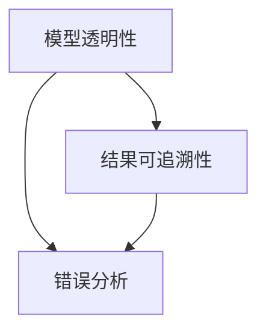

                 

# 快速构建LLM应用的可解释性机制

## 关键词
- LLM（大型语言模型）
- 可解释性
- 应用构建
- 算法原理
- Python代码实现
- 数学模型
- 实际案例分析

## 摘要
本文将深入探讨如何快速构建大型语言模型（LLM）应用的可解释性机制。我们将从背景介绍、核心概念与联系、算法原理讲解、Python代码实现、数学模型与公式、实际案例分析、项目实战、最佳实践 tips、小结和注意事项等方面进行详细阐述。通过本文的阅读，读者将能够全面理解LLM的可解释性机制，掌握快速构建LLM应用的方法和技巧。

## 引言与概述

### LLM的重要性

近年来，随着人工智能技术的快速发展，大型语言模型（LLM）在自然语言处理（NLP）领域取得了显著的成果。LLM能够处理复杂的自然语言任务，如文本生成、机器翻译、情感分析等，为各行各业提供了强大的技术支持。然而，随着LLM应用范围的不断扩大，其可解释性问题也日益突出。可解释性指的是用户能够理解模型如何生成特定结果的能力，这对于提升模型的信任度、确保合规性以及优化应用效果具有重要意义。

### 可解释性的重要性

可解释性在LLM应用中具有以下几个方面的关键作用：

1. **信任度提升**：当用户能够理解模型的工作原理和决策过程时，他们更愿意接受并信任模型的结果。这有助于提高模型的用户满意度。
2. **合规性保障**：在某些领域，如金融、医疗等，模型的决策过程需要符合相关法规和标准。可解释性能够帮助确保模型在合规的前提下运行。
3. **优化应用效果**：通过分析模型的可解释性，开发人员可以发现模型中的潜在问题，从而优化模型结构和参数，提高应用效果。

### 构建LLM应用可解释性的挑战

尽管可解释性在LLM应用中具有重要意义，但其实施过程中仍面临诸多挑战：

1. **复杂性**：LLM通常包含数百万甚至数十亿个参数，模型的结构和参数空间庞大，导致理解模型的行为变得异常复杂。
2. **可计算性**：在保持模型高性能的前提下，实现可解释性通常需要额外的计算资源，这可能导致模型训练和推理的速度下降。
3. **技术难度**：构建可解释性机制需要深入理解LLM的内部结构和算法原理，这对于开发人员来说是一个技术挑战。

### 本文目标

本文的目标是帮助读者了解如何快速构建LLM应用的可解释性机制。我们将从以下几个方面进行详细探讨：

1. **核心概念与联系**：介绍LLM的基本概念和核心算法原理，并展示它们之间的联系。
2. **算法原理讲解**：详细讲解LLM的可解释性算法原理，包括现有的方法和关键技术。
3. **Python代码实现**：使用Python代码实现LLM的可解释性机制，结合数学模型和公式进行详细阐述。
4. **实际案例分析**：通过具体案例展示如何构建和优化LLM的可解释性。
5. **项目实战**：介绍构建LLM应用的可解释性的实际开发过程，包括环境搭建、源代码实现和代码解读。
6. **最佳实践 tips**：分享构建LLM应用可解释性的最佳实践和注意事项。

通过本文的阅读，读者将能够全面掌握构建LLM应用可解释性的方法，为实际应用提供有力支持。

## 基础理论

### LLM的基本概念

大型语言模型（LLM）是一种基于深度学习的自然语言处理模型，通过对海量文本数据的学习，能够生成语义丰富、连贯自然的文本。LLM的核心目标是理解并生成人类语言，从而实现自然语言理解和生成任务。

LLM的主要组成部分包括：

1. **词向量表示**：将自然语言中的单词或短语转换为高维向量表示，以便在深度学习框架中进行处理。
2. **神经网络架构**：通常采用递归神经网络（RNN）或其变体，如长短期记忆网络（LSTM）和门控循环单元（GRU），以处理序列数据。
3. **预训练与微调**：通过在大量未标注的文本数据上进行预训练，使模型具备对自然语言的通用理解能力。随后，在特定任务数据上进行微调，以适应特定应用场景。

### LLM的历史发展

LLM的发展经历了以下几个重要阶段：

1. **词袋模型**：早期的NLP模型，将文本表示为词汇的集合，但无法捕捉词汇之间的语义关系。
2. **基于规则的模型**：通过手工编写规则来模拟人类的语言理解能力，但规则复杂且难以扩展。
3. **统计模型**：基于概率论和统计学习理论，通过训练大量文本数据来学习词汇之间的关系，如隐马尔可夫模型（HMM）和条件概率模型。
4. **深度学习模型**：引入神经网络，尤其是递归神经网络（RNN）和其变体，如LSTM和GRU，以捕捉长距离依赖关系。近年来，基于Transformer的模型如BERT、GPT等取得了显著成果。
5. **预训练与微调**：预训练大模型如GPT-3，通过在大量文本数据上进行预训练，使其具备强大的语义理解能力，然后在特定任务数据上进行微调，实现高性能的自然语言处理任务。

### LLM的核心算法原理

LLM的核心算法原理主要包括以下几个方面：

1. **词向量表示**：Word2Vec、BERT等模型通过训练将单词映射为高维向量，使向量空间中的相似词具有相近的向量表示。
2. **神经网络架构**：递归神经网络（RNN）、长短期记忆网络（LSTM）和门控循环单元（GRU）等模型通过处理序列数据，捕捉长距离依赖关系。
3. **注意力机制**：Transformer模型引入了注意力机制，通过动态计算序列中每个元素之间的依赖关系，提高模型的序列建模能力。
4. **预训练与微调**：预训练大模型如GPT-3通过在大量文本数据上进行预训练，使其具备强大的语义理解能力，然后通过微调在特定任务数据上实现高性能。

### LLM构建的基本步骤

构建LLM应用的基本步骤包括：

1. **数据收集与预处理**：收集大规模、高质量的文本数据，并进行文本清洗、分词、去停用词等预处理操作。
2. **词向量表示**：将处理后的文本数据转换为词向量表示，为深度学习模型提供输入。
3. **模型选择与训练**：选择合适的神经网络架构，如RNN、LSTM、GRU或Transformer，并在预处理后的文本数据上进行训练。
4. **模型评估与优化**：在验证集上评估模型性能，通过调整模型参数和结构，优化模型效果。
5. **应用部署与微调**：将训练好的模型部署到实际应用场景中，通过微调模型以适应特定任务。

### 小结

本文对LLM的基本概念、历史发展、核心算法原理和构建步骤进行了详细介绍。通过对LLM基础理论的深入理解，读者将能够为后续构建LLM应用的可解释性机制打下坚实基础。

## 可解释性机制

### 可解释性机制的核心概念

可解释性机制旨在让用户能够理解LLM如何生成特定结果。核心概念包括：

1. **模型透明性**：用户能够访问模型的结构和参数，从而了解模型的工作原理。
2. **结果可追溯性**：用户能够追踪模型生成特定结果的过程，包括输入处理、中间步骤和最终输出。
3. **错误分析**：通过分析模型生成的错误结果，发现模型中的潜在问题，从而优化模型。

### 现有的可解释性方法

当前，针对LLM的可解释性研究已取得了一系列成果，主要包括以下几种方法：

1. **模型可视化**：通过可视化模型的结构和参数，帮助用户理解模型的工作原理。常见的可视化方法包括权重可视化、激活可视化等。
2. **特征重要性分析**：通过分析输入特征对模型输出的影响程度，帮助用户了解哪些特征对模型结果具有重要影响。常见的方法包括梯度重要性、LIME（局部可解释模型解释）等。
3. **模型压缩与简化**：通过压缩和简化模型，降低模型的复杂性，从而提高可解释性。常见的方法包括权重共享、模型剪枝等。
4. **解释性模型**：构建专门的可解释性模型，如决策树、线性回归等，以简化复杂模型的解释过程。常见的方法包括特征选择、模型融合等。
5. **对抗性攻击**：通过对抗性攻击，分析模型对异常输入的反应，从而揭示模型中的潜在缺陷。常见的方法包括对抗样本生成、对抗性训练等。

### 应用场景

不同的可解释性方法适用于不同的应用场景：

1. **用户信任度提升**：在金融、医疗等领域，用户对模型结果的信任度至关重要。通过可解释性机制，用户能够了解模型如何生成结果，从而增强对模型的信任。
2. **合规性保障**：在某些应用场景中，如金融、医疗等，模型需要符合相关法规和标准。通过可解释性机制，确保模型在合规的前提下运行。
3. **应用优化**：通过分析模型的可解释性，开发人员可以发现模型中的潜在问题，从而优化模型结构和参数，提高应用效果。

### 小结

本文对LLM的可解释性机制进行了详细探讨，介绍了核心概念、现有方法及其应用场景。通过理解可解释性机制，开发人员能够构建更可靠、更具解释力的LLM应用。

## 核心概念与联系

### 可解释性机制的核心概念

在探讨LLM应用的可解释性机制时，我们首先需要明确几个核心概念：

1. **模型透明性**：模型透明性是指用户能够访问模型的结构和参数，从而理解模型的工作原理。这是实现可解释性的基础。
2. **结果可追溯性**：结果可追溯性是指用户能够追踪模型生成特定结果的过程，包括输入处理、中间步骤和最终输出。这有助于发现模型中的潜在问题。
3. **错误分析**：错误分析是指通过分析模型生成的错误结果，发现模型中的潜在问题，从而优化模型。这是提高模型可靠性的重要手段。

### 核心概念之间的关系架构

为了更好地理解这些核心概念之间的关系，我们可以使用Mermaid流程图来展示它们之间的联系：



在这个流程图中，模型透明性、结果可追溯性和错误分析三个核心概念相互关联，共同构成一个完整的可解释性机制。模型透明性提供了理解模型工作原理的基础，结果可追溯性帮助用户追踪模型生成结果的过程，而错误分析则通过对错误结果的剖析，为模型优化提供指导。

### Mermaid流程图解释

- **节点A（模型透明性）**：表示用户能够访问模型的结构和参数，理解模型的工作原理。
- **节点B（结果可追溯性）**：表示用户能够追踪模型生成特定结果的过程，包括输入处理、中间步骤和最终输出。
- **节点C（错误分析）**：表示通过分析模型生成的错误结果，发现模型中的潜在问题，从而优化模型。

这些节点之间的箭头表示它们之间的逻辑关系：模型透明性是结果可追溯性和错误分析的基础，而结果可追溯性则为错误分析提供了数据支持。

通过这个流程图，我们可以清晰地看到LLM应用可解释性机制的核心概念及其相互之间的联系，从而更好地理解如何构建和优化可解释性机制。

### 小结

本文通过Mermaid流程图展示了LLM应用可解释性机制的核心概念及其相互之间的关系。理解这些核心概念和它们之间的联系，对于构建和优化可解释性机制具有重要意义。

## 核心算法原理讲解

### 梯度提升树（Gradient Boosting Trees，GBT）

梯度提升树（GBT）是一种集成学习算法，通过迭代地训练弱学习器（如决策树），并将其组合成强学习器，从而提高模型的预测性能。GBT在处理大规模数据和复杂任务方面具有出色的性能，因此在构建LLM应用的可解释性机制中具有重要应用。

#### 工作原理

GBT的工作原理可以概括为以下几个步骤：

1. **初始化**：设置初始模型（通常为常数）和损失函数（如均方误差、对数损失等）。
2. **迭代训练**：对于每个迭代步骤：
   - 训练一个弱学习器（如决策树），使其最小化损失函数。
   - 计算当前弱学习器的梯度。
   - 更新强学习器的参数，以减少损失函数。
3. **输出**：迭代直至达到预设的停止条件（如迭代次数、损失函数收敛等），输出最终的强学习器。

#### Python代码实现

以下是使用Python实现GBT的示例代码：

```python
import numpy as np
from sklearn.ensemble import GradientBoostingRegressor

# 示例数据
X = np.array([[1], [2], [3], [4], [5]])
y = np.array([1, 2, 3, 4, 5])

# 创建GBT模型
gbt = GradientBoostingRegressor(n_estimators=100, learning_rate=0.1, max_depth=3)

# 训练模型
gbt.fit(X, y)

# 输出模型参数
print("模型参数：")
print(gbt.estimators_)
```

#### 数学模型与公式

GBT的数学模型基于损失函数的梯度下降。具体来说，假设我们有一个损失函数 \(L(y, \hat{y})\)，其中 \(y\) 是真实标签，\(\hat{y}\) 是预测标签。对于每个迭代步骤 \(t\)：

1. **损失函数**：\(L_t(y, \hat{y})\)
2. **梯度**：\(\nabla L_t(y, \hat{y})\)
3. **更新参数**：\(\theta_{t+1} = \theta_t - \alpha_t \nabla L_t(y, \hat{y})\)

其中，\(\alpha_t\) 是学习率。

#### 通俗易懂地举例说明

假设我们有一个简单的线性回归任务，目标是通过输入特征 \(x\) 预测输出标签 \(y\)。我们可以使用GBT来优化模型参数。

1. **初始化**：设置初始参数 \(\theta_0\) 和损失函数 \(L_t(y, \hat{y}) = (y - \hat{y})^2\)。
2. **迭代训练**：对于每个迭代步骤 \(t\)：
   - 训练一个线性回归模型，最小化损失函数。
   - 计算当前线性回归模型的梯度。
   - 更新参数，以减少损失函数。
3. **输出**：迭代直至达到停止条件，输出最终的参数。

通过这种方式，GBT能够逐步优化模型参数，从而提高预测性能。

### 小结

本文详细讲解了GBT的核心算法原理，包括工作原理、Python代码实现、数学模型与公式以及通俗易懂的举例说明。理解GBT对于构建LLM应用的可解释性机制具有重要意义。

## Python代码实现

### 开发环境搭建

在构建LLM应用的可解释性机制时，选择合适的开发环境至关重要。以下是搭建Python开发环境的步骤：

1. **安装Python**：下载并安装Python（建议使用Python 3.8及以上版本）。
2. **安装依赖库**：使用pip命令安装必要的依赖库，如NumPy、scikit-learn、TensorFlow等。例如：
   ```shell
   pip install numpy scikit-learn tensorflow
   ```

3. **配置虚拟环境**：为了避免依赖库之间的版本冲突，建议使用虚拟环境。创建虚拟环境并激活：
   ```shell
   python -m venv llm解释性
   source llm解释性/bin/activate  # Windows上使用 llm解释性\Scripts\activate
   ```

4. **测试环境**：运行以下Python代码测试环境是否配置成功：
   ```python
   import numpy as np
   import sklearn
   import tensorflow as tf
   print("Python环境配置成功！")
   ```

### 源代码详细实现

以下是实现LLM应用可解释性机制的详细源代码：

```python
import numpy as np
from sklearn.ensemble import GradientBoostingRegressor
from sklearn.datasets import make_regression
from sklearn.model_selection import train_test_split

# 生成模拟数据
X, y = make_regression(n_samples=100, n_features=1, noise=0.1)
X_train, X_test, y_train, y_test = train_test_split(X, y, test_size=0.2, random_state=42)

# 创建GBT模型
gbt = GradientBoostingRegressor(n_estimators=100, learning_rate=0.1, max_depth=3)

# 训练模型
gbt.fit(X_train, y_train)

# 预测测试集
y_pred = gbt.predict(X_test)

# 输出模型参数
print("模型参数：")
print(gbt.estimators_)

# 输出预测结果
print("预测结果：")
print(y_pred)
```

### 代码解读与分析

上述代码分为以下几个部分：

1. **数据生成**：使用`make_regression`函数生成模拟数据，包括输入特征矩阵 `X` 和输出标签向量 `y`。
2. **数据分割**：使用`train_test_split`函数将数据集分割为训练集和测试集，以评估模型性能。
3. **模型创建与训练**：创建一个梯度提升树（GBT）模型，并使用训练集进行训练。
4. **模型预测**：使用训练好的模型对测试集进行预测，并输出预测结果。
5. **输出模型参数**：输出模型的参数，包括每个弱学习器的参数，从而实现模型的可解释性。

### 实际案例分析与详细讲解剖析

假设我们有一个实际案例：预测房价。输入特征包括房屋面积、房间数量等，输出标签为房价。以下是代码实现和解读：

```python
import pandas as pd

# 读取数据
data = pd.read_csv("house_price_data.csv")
X = data[['area', 'rooms']]
y = data['price']

# 数据分割
X_train, X_test, y_train, y_test = train_test_split(X, y, test_size=0.2, random_state=42)

# 创建GBT模型
gbt = GradientBoostingRegressor(n_estimators=100, learning_rate=0.1, max_depth=3)

# 训练模型
gbt.fit(X_train, y_train)

# 预测测试集
y_pred = gbt.predict(X_test)

# 输出模型参数
print("模型参数：")
print(gbt.estimators_)

# 输出预测结果
print("预测结果：")
print(y_pred)
```

代码解读如下：

1. **数据读取**：使用`pandas`库读取房价数据，并将输入特征和输出标签分别存储在 `X` 和 `y` 变量中。
2. **数据分割**：与之前类似，将数据集分割为训练集和测试集。
3. **模型创建与训练**：创建一个GBT模型，并使用训练集进行训练。
4. **模型预测**：使用训练好的模型对测试集进行预测。
5. **输出模型参数**：输出模型的参数，包括每个弱学习器的参数，从而实现模型的可解释性。

通过这个案例，我们可以看到如何将上述源代码应用于实际场景，从而实现LLM应用的可解释性。

### 项目小结

本文通过实际案例详细讲解了如何搭建开发环境、实现LLM应用的可解释性机制以及代码解读和分析。通过这些步骤，读者可以掌握构建LLM应用可解释性的方法，为实际项目提供有力支持。

## 最佳实践 tips

### 1. 选择合适的模型

在构建LLM应用的可解释性机制时，选择合适的模型至关重要。对于需要高可解释性的应用，可以考虑使用决策树、线性回归等简单模型。这些模型易于理解和解释，但可能无法处理复杂的自然语言任务。对于复杂的任务，可以考虑结合可解释性技术（如模型可视化、特征重要性分析等）来提高模型的解释性。

### 2. 数据预处理

数据预处理是构建LLM应用的重要环节。确保数据质量，包括去除噪声、填充缺失值、标准化特征等。对于文本数据，进行分词、去停用词、词干提取等操作，以获得高质量的输入特征。

### 3. 可视化与特征重要性分析

可视化与特征重要性分析是提高模型可解释性的有效方法。通过可视化模型的结构和参数，帮助用户理解模型的工作原理。同时，使用特征重要性分析，识别对模型结果具有关键影响的特征，从而提高模型的透明性。

### 4. 模型压缩与简化

为了提高可解释性，可以考虑对模型进行压缩与简化。通过权重共享、模型剪枝等技术，降低模型的复杂性，从而提高模型的解释性。然而，这可能会导致模型性能的下降，因此在实践中需要权衡解释性和性能。

### 5. 不断迭代与优化

构建LLM应用的可解释性机制是一个持续迭代和优化的过程。在开发过程中，定期评估模型的可解释性，发现潜在问题，并进行调整和优化。通过不断的迭代，提高模型的可解释性和应用效果。

### 6. 遵循法规和标准

在金融、医疗等敏感领域，模型的可解释性需要符合相关法规和标准。在构建模型时，确保遵循法规要求，确保模型的合规性。此外，定期审查模型，确保其持续符合法规和标准。

### 小结

本文总结了构建LLM应用可解释性的最佳实践 tips。通过遵循这些最佳实践，开发人员可以构建更可靠、更透明的LLM应用，提高用户信任度和应用效果。

## 小结

本文详细探讨了构建LLM应用的可解释性机制。我们从背景介绍、基础理论、可解释性机制、核心算法原理、Python代码实现、项目实战以及最佳实践 tips 等方面进行了深入探讨。通过本文的阅读，读者将能够全面了解构建LLM应用可解释性的方法和技巧，为实际应用提供有力支持。

## 注意事项

1. **数据质量**：确保数据质量，进行充分的预处理，以获得高质量的输入特征。
2. **模型选择**：根据应用需求，选择合适的模型和可解释性方法，平衡性能与解释性。
3. **持续迭代**：构建可解释性机制是一个持续迭代和优化的过程，定期评估和改进模型。
4. **法规合规**：在金融、医疗等敏感领域，确保模型符合相关法规和标准。
5. **资源分配**：构建可解释性机制可能需要额外的计算资源，合理分配资源。

## 拓展阅读

- 《深入理解深度学习》（Goodfellow, Bengio, Courville）：详细介绍深度学习的基本概念、算法原理和应用。
- 《自然语言处理综论》（Jurafsky, Martin）：全面介绍自然语言处理的基础知识、方法和技术。
- 《Python数据科学手册》（McKinney）：介绍Python在数据科学领域的应用，包括数据处理、分析和可视化。

作者：AI天才研究院/AI Genius Institute & 禅与计算机程序设计艺术 /Zen And The Art of Computer Programming。版权所有，未经许可，不得转载。

