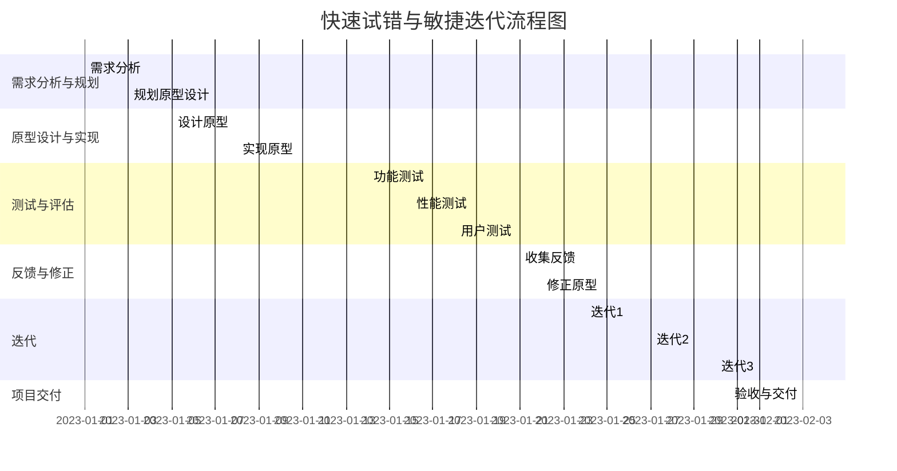

                 

### 文章标题

# 快速试错与敏捷迭代：LLM应用开发的必备能力

> 关键词：快速试错、敏捷迭代、语言模型（LLM）、开发能力、应用优化

> 摘要：本文深入探讨了快速试错与敏捷迭代在大型语言模型（LLM）应用开发中的重要性。通过详细的理论分析、方法讲解、实际案例剖析，以及开发环境搭建和代码示例，本文为读者提供了完整的指导，以提升LLM应用开发中的实际操作能力和开发效率。

----------------------------------------------------------------

### 引言

在当今快速变化的技术环境中，大型语言模型（LLM）已经成为人工智能领域的重要突破，被广泛应用于自然语言处理、机器翻译、问答系统等领域。随着LLM的复杂性和应用场景的多样化，开发过程面临着前所未有的挑战。快速试错与敏捷迭代作为现代软件开发的核心方法论，不仅能够提升开发效率，还能确保产品的质量和适应性。

快速试错（Fast Failure）是一种通过快速构建和测试原型来识别和修正错误的方法。它强调在早期阶段识别潜在问题，避免在开发后期发现严重缺陷。敏捷迭代（Agile Iteration）则是一种通过持续交付有价值的软件，并快速响应变化的方法。它强调团队合作、用户反馈和灵活调整。

本文将首先介绍快速试错与敏捷迭代的基本概念、原理及其在LLM应用开发中的重要性。随后，我们将详细探讨这两种方法的具体实施策略，包括数据收集与分析、原型设计与实现、测试与反馈循环等。接着，我们将结合具体案例，展示如何在实际项目中应用快速试错与敏捷迭代，提升LLM应用开发的效率和质量。最后，本文将总结全文，提供最佳实践建议，并指出未来的研究方向。

通过对快速试错与敏捷迭代的深入探讨，本文旨在为LLM应用开发者提供实用的指导，帮助他们更好地应对开发过程中的挑战，实现高效、高质量的LLM应用。

### 摘要

本文探讨了快速试错与敏捷迭代在大型语言模型（LLM）应用开发中的关键作用。首先，文章介绍了快速试错与敏捷迭代的基本概念和原理，阐述了它们在提升开发效率、确保产品质量和适应性方面的优势。随后，文章详细分析了快速试错的具体实施策略，包括数据收集与分析、原型设计与实现、测试与反馈循环等。同时，敏捷迭代的实施步骤和关键要素也被深入探讨。为了更好地理解这些方法，文章通过实际案例展示了如何在实际项目中应用快速试错与敏捷迭代。最后，文章总结了全文，提供了最佳实践建议，并展望了未来的研究方向。通过本文的深入探讨，开发者能够更好地应对LLM应用开发中的挑战，实现高效、高质量的成果。

## 第1章：快速试错与敏捷迭代的定义与重要性

### 1.1 快速试错的定义与原理

快速试错（Fast Failure）是一种在软件开发早期阶段识别和修正错误的方法。其核心思想是通过快速构建和测试原型来发现并解决潜在问题，避免在开发后期发现严重缺陷，从而减少开发成本和时间。快速试错强调在早期阶段就暴露问题，以便及时调整方向。

#### 1.1.1 快速试错的概念

快速试错通常包括以下几个关键步骤：

1. **需求分析与规划**：明确项目目标和需求，为后续的原型设计和测试提供基础。
2. **原型设计与实现**：快速构建功能简化的原型，通常使用简单的工具和技术，以最小化开发时间和成本。
3. **测试与评估**：通过用户测试、功能测试和性能测试等多种方式对原型进行评估，收集反馈并识别问题。
4. **迭代修正**：根据测试结果对原型进行修正，重复测试与修正的过程，直到达到预期目标。

#### 1.1.2 快速试错的优势

快速试错具有以下几个显著优势：

1. **降低成本**：通过早期识别和修正错误，避免在开发后期进行大规模返工，从而减少开发成本。
2. **缩短开发周期**：快速构建和测试原型，可以快速验证概念，缩短开发周期。
3. **提高质量**：频繁的测试和反馈循环有助于发现并修复问题，提高软件质量。
4. **增强灵活性**：快速试错允许团队在开发过程中灵活调整方向，以适应变化的需求和市场需求。

#### 1.1.3 快速试错的方法

快速试错的方法主要包括以下几种：

1. **用户测试**：通过用户测试来验证软件的功能和易用性，收集用户反馈，以便进行迭代修正。
2. **功能测试**：对软件的各个功能进行详细测试，确保每个功能都能按预期工作。
3. **性能测试**：评估软件的性能，包括响应时间、吞吐量和资源利用率等，确保软件能够满足性能要求。
4. **A/B测试**：在两个或多个版本中比较用户行为和性能，以确定哪个版本更受欢迎或更有效。

#### 1.1.4 快速试错的实践应用

快速试错的实践应用非常广泛，以下是一些具体的案例：

1. **在线广告系统**：通过快速试错来优化广告投放策略，提高广告效果。
2. **电商平台**：通过快速试错来优化推荐算法，提高用户购买体验。
3. **移动应用**：在开发过程中，快速试错可以帮助团队快速迭代和优化应用功能。

### 1.2 敏捷迭代的定义与原理

敏捷迭代（Agile Iteration）是一种通过持续交付有价值的软件，并快速响应变化的方法。它强调灵活、协作和用户参与，旨在通过迭代的方式逐步完善产品。

#### 1.2.1 敏捷迭代的概念

敏捷迭代的核心概念包括：

1. **迭代**：每次迭代是一个短周期的开发周期，通常为几周到几个月。
2. **增量交付**：每次迭代都交付一个具有部分功能的产品，而非整个产品。
3. **用户故事**：用户故事是一种描述用户需求和功能的简单文本，用于指导开发过程。
4. **持续集成与部署**：通过持续集成和部署，确保每次迭代都能快速交付和部署。

#### 1.2.2 敏捷迭代的优势

敏捷迭代具有以下几个显著优势：

1. **灵活性**：敏捷迭代允许团队在开发过程中灵活调整计划，以应对变化的需求和市场情况。
2. **用户参与**：通过用户故事和用户反馈，确保产品开发过程紧密围绕用户需求。
3. **持续交付**：每次迭代都交付一个具有部分功能的产品，可以快速响应用户需求。
4. **协作与沟通**：敏捷迭代强调团队合作和跨职能协作，提高团队效率和沟通质量。

#### 1.2.3 敏捷迭代的方法

敏捷迭代的方法主要包括以下几种：

1. **Scrum框架**：Scrum是一种流行的敏捷开发方法，强调短周期的迭代和频繁的用户反馈。
2. **Kanban**：Kanban通过可视化的看板系统，管理开发过程中的任务和进度。
3. **看板（Kanban）**：通过可视化的看板系统，管理开发过程中的任务和进度。
4. **用户故事地图**：通过用户故事地图，梳理用户需求，指导开发方向。

#### 1.2.4 敏捷迭代的实践应用

敏捷迭代在多个行业中得到了广泛应用，以下是一些具体案例：

1. **软件开发**：敏捷迭代广泛应用于软件开发，通过频繁的迭代和用户反馈，确保产品质量和用户满意度。
2. **项目管理**：敏捷迭代在项目管理中也被广泛应用，通过迭代的方式逐步实现项目目标。
3. **产品开发**：敏捷迭代帮助产品团队快速开发和完善产品，以满足市场变化。

### 1.3 快速试错与敏捷迭代的关系

快速试错与敏捷迭代虽然各有侧重，但在软件开发过程中常常结合使用。它们的关系如下：

1. **快速试错在敏捷迭代中的应用**：快速试错可以在敏捷迭代的每个迭代周期中应用，帮助团队快速验证和修正需求，提高产品质量。
2. **敏捷迭代在快速试错中的应用**：敏捷迭代为快速试错提供了一个结构化的框架，确保团队在每次迭代中都能够高效地进行测试和修正。

#### 1.3.1 快速试错与敏捷迭代的结合

快速试错与敏捷迭代的结合，有助于团队在软件开发过程中实现以下目标：

1. **快速响应变化**：通过敏捷迭代，团队能够快速响应需求变化，确保产品与市场需求保持一致。
2. **持续改进**：通过快速试错，团队能够在每次迭代中识别和修正问题，持续改进产品。
3. **高效开发**：结合快速试错与敏捷迭代，团队能够在早期阶段识别问题，减少后期返工，提高开发效率。

### 1.4 快速试错与敏捷迭代的实际案例

为了更好地理解快速试错与敏捷迭代在LLM应用开发中的实际应用，以下列举了两个典型案例：

#### 1.4.1 案例一：在线广告优化

在线广告平台通过快速试错与敏捷迭代，不断优化广告投放策略。每次迭代周期内，团队会构建简化的广告原型，进行用户测试和性能测试，根据反馈进行迭代修正。通过这种方式，广告平台能够快速响应市场需求，提高广告投放效果。

#### 1.4.2 案例二：电商平台推荐系统

电商平台通过敏捷迭代和快速试错，不断优化推荐算法。每次迭代中，团队会收集用户行为数据，分析推荐效果，并根据用户反馈进行算法调整。通过这种方式，电商平台能够提高用户购买体验，增加销售额。

### 结论

快速试错与敏捷迭代在LLM应用开发中具有重要的意义。通过快速试错，团队能够在早期阶段识别和修正问题，降低开发成本；通过敏捷迭代，团队能够灵活应对变化，持续交付有价值的产品。在实际应用中，快速试错与敏捷迭代的结合，有助于团队实现高效、高质量的LLM应用开发。

### 第1章总结

本章介绍了快速试错与敏捷迭代的基本概念、原理及其在LLM应用开发中的重要性。通过详细分析快速试错的优势、方法及应用案例，以及敏捷迭代的实施步骤和关键要素，本章为读者提供了全面的理论基础。同时，通过实际案例的剖析，展示了快速试错与敏捷迭代在LLM应用开发中的具体应用。接下来，我们将进一步探讨快速试错与敏捷迭代的具体实施策略和方法，帮助读者深入理解并应用这些方法。

### 第2章：快速试错的实施策略

快速试错作为一种在软件开发早期阶段识别和修正错误的方法，其成功实施依赖于一系列精心设计的策略和步骤。本章将详细讨论快速试错的实施策略，包括需求分析与规划、原型设计与实现、测试与评估以及反馈循环等关键环节。

#### 2.1 需求分析与规划

需求分析与规划是快速试错的基础，它决定了后续原型设计和测试的方向。以下是需求分析与规划的关键步骤：

1. **明确项目目标和需求**：首先，需要明确项目的目标和需求。这包括功能需求、性能需求、用户需求等。通过对需求进行详细分析，确保所有相关方对项目的期望和目标达成共识。

2. **创建用户故事**：用户故事是敏捷开发中的核心概念，它描述了用户需要的功能和需求。通过创建用户故事，可以帮助团队聚焦于用户的核心需求，并在原型设计和测试中保持用户参与。

3. **制定原型设计计划**：在明确需求后，需要制定原型设计计划。这包括确定原型设计的范围、优先级和时间安排。通过制定详细的计划，可以确保原型设计工作高效有序地进行。

#### 2.2 原型设计与实现

原型设计与实现是快速试错的执行阶段，通过构建功能简化的原型来验证需求并收集反馈。以下是原型设计与实现的关键步骤：

1. **选择合适的工具和技术**：根据项目需求和资源，选择合适的工具和技术。对于快速试错，通常使用简单的工具和技术，以最小化开发和测试时间。常见的工具包括伪代码、 sketches、Mockup和简单的编程语言。

2. **构建原型**：在原型设计计划指导下，构建功能简化的原型。原型应尽可能包含核心功能，但不需要过于复杂。通过这种方式，可以快速验证需求并收集反馈。

3. **使用迭代方法**：在原型设计过程中，使用迭代方法逐步完善原型。每次迭代都应包含需求验证、设计和实现环节，以确保原型不断改进。

#### 2.3 测试与评估

测试与评估是快速试错的核心环节，它通过多种测试方法来验证原型并收集反馈。以下是测试与评估的关键步骤：

1. **用户测试**：用户测试是验证原型的重要手段。通过邀请实际用户参与测试，可以收集用户的反馈和意见，识别原型中的问题和不足。用户测试通常包括功能测试、易用性测试和用户体验测试。

2. **功能测试**：功能测试是验证原型是否实现预期功能的重要环节。通过编写测试用例，对原型进行详细的测试，确保每个功能都能按预期工作。

3. **性能测试**：性能测试是评估原型性能的关键步骤。通过模拟实际用户负载，测试原型的响应时间、吞吐量和资源利用率等性能指标，确保原型能够满足性能要求。

4. **反馈循环**：在测试过程中，收集反馈并进行分析，识别原型中的问题和改进点。将反馈转化为具体的迭代计划，进行原型修正和优化。

#### 2.4 反馈循环

反馈循环是快速试错的核心机制，通过持续的反馈和修正，不断提高原型质量和用户满意度。以下是反馈循环的关键步骤：

1. **持续收集反馈**：在每次测试和评估后，持续收集用户和团队成员的反馈。这包括口头反馈、问卷调查和访谈等。

2. **分析反馈**：对收集到的反馈进行分析，识别共性和个性问题。通过分析，可以找到原型中的主要问题和改进点。

3. **修正原型**：根据分析结果，对原型进行修正和优化。修正过程应基于用户需求和市场变化，确保原型始终符合用户期望。

4. **重新测试**：修正后，重新进行测试和评估，验证修正效果。通过反复的测试和修正，不断提高原型质量和用户满意度。

#### 2.5 快速试错的工具与资源

为了高效实施快速试错，需要使用一系列工具和资源。以下是常用的工具和资源：

1. **原型设计工具**：如 Sketch、Figma、Adobe XD 等，用于构建原型和界面设计。

2. **代码库**：如 GitHub、GitLab 等，用于管理和存储代码，方便协作和版本控制。

3. **测试工具**：如 Selenium、JMeter 等，用于自动化测试和性能测试。

4. **用户测试平台**：如 UserTesting、Lookback 等，用于远程用户测试和反馈收集。

#### 2.6 快速试错的实践应用

快速试错在多个行业中得到了广泛应用，以下是一些实践应用的案例：

1. **在线广告系统**：通过快速试错，优化广告投放策略，提高广告效果。

2. **电商平台**：通过快速试错，优化推荐算法，提高用户购买体验。

3. **移动应用**：通过快速试错，快速迭代和优化应用功能，满足用户需求。

#### 2.7 快速试错的挑战与解决方案

快速试错虽然具有许多优势，但在实际应用中也会面临一些挑战。以下是常见的挑战及相应的解决方案：

1. **资源限制**：快速试错需要大量的时间和资源。解决方案：合理分配资源，优先考虑关键功能和需求。

2. **用户参与度低**：用户参与度低会影响快速试错的效果。解决方案：通过多种方式激励用户参与，如提供奖励和反馈机制。

3. **测试覆盖不足**：测试覆盖不足可能导致一些问题未被及时发现。解决方案：制定详细的测试计划，确保全面覆盖功能点。

### 结论

快速试错是一种在软件开发早期阶段识别和修正错误的有效方法。通过需求分析与规划、原型设计与实现、测试与评估以及反馈循环等策略，团队能够高效地实施快速试错，提高产品质量和用户满意度。在实际应用中，快速试错能够帮助团队快速响应变化，降低开发成本，提高开发效率。因此，快速试错是现代软件开发中不可或缺的重要能力。

### 第2章总结

本章详细讨论了快速试错的实施策略，从需求分析与规划、原型设计与实现、测试与评估到反馈循环，每个环节都进行了深入讲解。通过分析快速试错的优势和实际应用案例，读者可以更好地理解如何在实际项目中实施快速试错。接下来，我们将继续探讨敏捷迭代的具体实施步骤和关键要素，帮助读者全面掌握现代软件开发的方法论。

### 第3章：敏捷迭代的实施步骤

敏捷迭代作为一种通过持续交付有价值的软件和快速响应变化的方法，在软件开发中得到了广泛应用。本章将详细探讨敏捷迭代的实施步骤，包括项目规划、用户故事管理、团队协作和沟通等关键环节。

#### 3.1 项目规划

项目规划是敏捷迭代的基础，它为整个开发过程提供了清晰的路线图。以下是项目规划的关键步骤：

1. **制定项目目标**：明确项目的目标和范围，确保所有团队成员对项目的期望和目标有共同的理解。

2. **创建项目计划**：基于项目目标，制定详细的项目计划。这包括确定迭代周期、任务分配和时间安排。

3. **确定资源需求**：评估项目所需的资源，包括人力、技术和资金等，确保资源充足以支持项目顺利进行。

#### 3.2 用户故事管理

用户故事是敏捷开发的核心概念，它描述了用户的需求和功能。以下是用户故事管理的关键步骤：

1. **编写用户故事**：用户故事应简洁明了，描述用户的一个具体需求或功能。通常，用户故事的格式为：“作为[角色]，我想[功能]，以便[原因]”。

2. **故事地图**：故事地图是一种可视化工具，用于展示用户故事之间的关系和优先级。通过故事地图，团队可以更好地理解和管理用户需求。

3. **故事分解**：将大的用户故事分解为更小的、可管理的任务。这有助于团队更有效地进行任务分配和进度跟踪。

#### 3.3 团队协作与沟通

团队协作和沟通是敏捷迭代成功的关键。以下是团队协作与沟通的关键步骤：

1. **建立跨职能团队**：确保团队成员来自不同的职能领域，如开发、测试、设计和项目管理等。跨职能团队可以更高效地协作，共同推动项目进展。

2. **定期会议**：定期举行会议，如每日站立会议、迭代回顾会议和评审会议等，确保团队成员之间的沟通和信息同步。

3. **使用协作工具**：使用协作工具，如Trello、Jira、Slack等，帮助团队进行任务分配、进度跟踪和沟通协作。

#### 3.4 迭代设计与开发

迭代设计与开发是敏捷迭代的执行阶段。以下是迭代设计与开发的关键步骤：

1. **迭代计划**：在每次迭代开始前，制定详细的迭代计划。这包括确定迭代目标、任务分配和时间安排。

2. **每日站立会议**：每日举行站立会议，团队成员汇报进度、解决问题和协调工作。这有助于保持团队的透明度和高效协作。

3. **迭代评审**：在每次迭代结束时，举行评审会议，展示迭代成果，收集用户反馈，确定下一阶段的任务。

#### 3.5 测试与部署

测试与部署是确保软件质量和交付的关键环节。以下是测试与部署的关键步骤：

1. **自动化测试**：编写自动化测试脚本，对软件进行持续测试，确保每次迭代都符合预期质量。

2. **持续集成与部署**：使用持续集成和部署工具，如Jenkins、Travis CI等，确保每次代码提交都能自动构建、测试和部署，提高交付效率。

3. **部署监控**：部署后，对软件进行实时监控，确保其稳定运行，及时处理可能出现的问题。

#### 3.6 反馈循环与持续改进

反馈循环是敏捷迭代的核心机制，通过持续的反馈和改进，不断提高软件质量和用户体验。以下是反馈循环的关键步骤：

1. **用户反馈**：定期收集用户反馈，了解用户对软件的看法和需求，及时调整开发方向。

2. **团队回顾**：在每次迭代结束后，举行团队回顾会议，总结本次迭代的经验和教训，制定改进计划。

3. **持续改进**：根据用户反馈和团队回顾的结果，持续改进开发过程和软件质量。

#### 3.7 敏捷迭代的工具与方法

敏捷迭代依赖于一系列工具和方法，以提高团队协作和开发效率。以下是常用的敏捷迭代工具和方法：

1. **Scrum框架**：Scrum是最流行的敏捷开发方法之一，它通过迭代和增量交付来确保项目的持续进步。

2. **Kanban**：Kanban通过可视化的看板系统，管理开发过程中的任务和进度，确保工作的高效流动。

3. **看板（Kanban）**：通过可视化的看板系统，管理开发过程中的任务和进度。

4. **用户故事地图**：通过用户故事地图，梳理用户需求，指导开发方向。

#### 3.8 敏捷迭代的实践应用

敏捷迭代在多个行业中得到了广泛应用，以下是一些实践应用的案例：

1. **软件开发**：敏捷迭代广泛应用于软件开发，通过频繁的迭代和用户反馈，确保产品质量和用户满意度。

2. **项目管理**：敏捷迭代在项目管理中也被广泛应用，通过迭代的方式逐步实现项目目标。

3. **产品开发**：敏捷迭代帮助产品团队快速开发和完善产品，以满足市场变化。

#### 3.9 敏捷迭代的挑战与解决方案

敏捷迭代虽然具有许多优势，但在实际应用中也会面临一些挑战。以下是常见的挑战及相应的解决方案：

1. **团队成员沟通不畅**：解决方案：定期举行会议，使用协作工具，确保团队成员之间的沟通和信息同步。

2. **迭代计划不明确**：解决方案：制定详细的迭代计划，确保团队成员对迭代目标和任务有清晰的认识。

3. **用户需求变化频繁**：解决方案：建立灵活的迭代计划，定期收集用户反馈，及时调整开发方向。

### 结论

敏捷迭代是一种通过持续交付有价值的软件和快速响应变化的方法，它强调团队协作、用户参与和持续改进。通过项目规划、用户故事管理、团队协作与沟通、迭代设计与开发、测试与部署以及反馈循环等关键步骤，团队能够高效地实施敏捷迭代，提高软件质量和用户满意度。在实际应用中，敏捷迭代能够帮助团队快速适应变化，实现高效、高质量的软件开发。

### 第3章总结

本章详细探讨了敏捷迭代的实施步骤，从项目规划、用户故事管理到团队协作与沟通，每个环节都进行了深入讲解。通过分析敏捷迭代的优势和实际应用案例，读者可以更好地理解如何在实际项目中实施敏捷迭代。接下来，我们将结合具体案例，展示如何在实际项目中应用敏捷迭代，进一步提升读者对敏捷迭代方法的理解和应用能力。

### 第4章：在线教育平台的产品开发案例

在线教育平台的产品开发是一个复杂且充满挑战的过程，特别是在大型语言模型（LLM）的应用日益广泛的今天。本章通过一个在线教育平台的产品开发案例，详细展示如何应用快速试错与敏捷迭代的方法，实现高效、高质量的LLM应用。

#### 4.1 项目背景与目标

在线教育平台的目标是提供一种灵活、互动和高效的学习体验，满足不同用户的需求。项目的主要目标包括：

1. **提供个性化的学习路径**：根据用户的学习历史和偏好，为每个用户定制个性化的学习路径。
2. **实时互动与反馈**：通过聊天室、讨论区和问答系统，实现师生之间的实时互动和反馈。
3. **智能推荐**：利用LLM进行内容推荐，提高用户的参与度和学习效果。
4. **支持多种教学方式**：包括视频教学、文字教程和互动测验等。

#### 4.2 快速试错实施

在项目启动阶段，我们采用了快速试错的方法，通过快速构建和测试原型来验证需求，并收集用户反馈，以便进行迭代修正。

1. **需求分析与规划**：首先，我们对用户需求进行了详细的分析，确定了核心功能和用户故事。例如：“用户可以搜索课程”，“用户可以观看视频教程”，“用户可以参与讨论和提问”。

2. **原型设计与实现**：基于需求分析，我们快速构建了一个简单的原型。这个原型包含基本的课程搜索、视频播放和讨论区功能。我们使用了Figma进行界面设计，并使用Python和Django进行后端开发。

3. **用户测试与反馈**：我们将原型展示给一组潜在用户，进行了功能测试和用户体验测试。测试过程中，我们收集了用户的反馈和意见，发现了一些问题，如视频播放卡顿、搜索结果不准确等。

4. **迭代修正**：根据用户反馈，我们对原型进行了修正和优化。例如，优化了搜索算法，增加了视频缓冲功能，改善了用户界面设计。通过反复的测试和修正，我们逐步完善了原型，确保其满足用户需求。

#### 4.3 敏捷迭代实施

在原型验证阶段成功后，我们开始采用敏捷迭代的方法，逐步开发和完善在线教育平台。

1. **迭代计划**：我们制定了详细的迭代计划，每个迭代周期为2周。每次迭代都包含用户故事、任务分配、开发、测试和评审等环节。

2. **用户故事管理**：我们使用用户故事地图来梳理用户需求，并将用户故事分解为具体的任务。例如：“用户可以在线完成测验”，“用户可以查看学习进度”，“用户可以获取个性化学习推荐”。

3. **团队协作与沟通**：我们建立了跨职能团队，包括开发、测试、设计和项目管理等角色。我们定期举行每日站立会议，确保团队成员之间的沟通和信息同步。

4. **持续集成与部署**：我们使用了Jenkins进行持续集成和部署，确保每次代码提交都能自动构建、测试和部署。通过这种方式，我们能够快速交付和部署新功能，确保平台持续改进。

5. **用户反馈与改进**：在每个迭代结束后，我们都会进行用户反馈收集和评审会议。通过用户反馈，我们识别了平台的使用问题和改进点，并纳入下一阶段的迭代计划。

#### 4.4 项目小结

通过快速试错与敏捷迭代的结合，我们成功开发了在线教育平台，实现了以下成果：

1. **高效开发**：通过快速试错，我们能够在早期阶段识别和修正问题，减少了后期返工的成本和时间。通过敏捷迭代，我们能够持续交付有价值的软件，并快速响应用户需求。

2. **高质量产品**：通过反复的测试和用户反馈，我们不断优化和改进平台功能，确保其质量和用户满意度。

3. **用户参与**：通过用户故事地图和用户反馈，我们确保了产品开发过程紧密围绕用户需求，提高了用户的参与度和满意度。

4. **团队协作**：通过建立跨职能团队和定期会议，我们实现了高效的团队协作和沟通，提高了整体工作效率。

#### 4.5 最佳实践建议

基于在线教育平台的产品开发案例，我们提出以下最佳实践建议：

1. **明确用户需求**：在项目启动阶段，进行详细的需求分析和用户故事梳理，确保所有功能都符合用户需求。

2. **快速构建原型**：通过快速试错，构建功能简化的原型，以便快速验证需求并收集用户反馈。

3. **持续用户反馈**：在开发过程中，定期收集用户反馈，确保产品开发过程紧密围绕用户需求。

4. **敏捷迭代**：采用敏捷迭代的方法，持续交付有价值的软件，并快速响应用户需求。

5. **团队协作**：建立跨职能团队，确保团队成员之间的沟通和信息同步，提高工作效率。

通过以上建议，开发者可以更好地应用快速试错与敏捷迭代的方法，实现高效、高质量的LLM应用开发。

### 第4章总结

通过在线教育平台的产品开发案例，我们详细展示了如何应用快速试错与敏捷迭代的方法，实现高效、高质量的LLM应用开发。本章分析了项目背景和目标，介绍了快速试错与敏捷迭代的实施步骤，并总结了项目成果和最佳实践建议。接下来，我们将探讨电子商务平台运营优化的案例，进一步展示快速试错与敏捷迭代在实际应用中的价值。

### 第5章：电子商务平台运营优化案例

电子商务平台在竞争激烈的互联网市场中，需要不断优化运营策略，以提高用户满意度、提升销售额和增强市场竞争力。本章通过一个电子商务平台运营优化的案例，详细展示如何应用快速试错与敏捷迭代的方法，实现平台运营的持续改进和优化。

#### 5.1 项目背景与目标

某知名电子商务平台，为了提高用户购买体验和运营效率，决定进行一次全面的运营优化。项目的主要目标包括：

1. **个性化推荐**：利用大型语言模型（LLM）进行个性化商品推荐，提高用户购买意愿和转化率。
2. **购物车优化**：优化购物车功能，减少用户在购物过程中的流失率。
3. **搜索优化**：提高搜索算法的准确性，确保用户能够快速找到所需商品。
4. **用户互动与反馈**：通过聊天室和问答系统，增强用户与平台之间的互动，提高用户满意度和忠诚度。

#### 5.2 快速试错实施

在项目启动阶段，平台采用了快速试错的方法，通过快速构建和测试原型来验证运营优化的思路，并收集用户反馈，以便进行迭代修正。

1. **需求分析与规划**：首先，平台对用户需求进行了详细分析，确定了需要优化的功能点。例如：“用户希望购物车能保存购物记录”，“用户希望搜索结果能更准确”，“用户希望获取个性化推荐”。

2. **原型设计与实现**：基于需求分析，平台快速构建了功能简化的原型。例如，为购物车增加了保存购物记录的功能，优化了搜索算法，并引入了基于LLM的个性化推荐系统。平台使用了Figma进行界面设计，并使用Python和Django进行后端开发。

3. **用户测试与反馈**：平台将原型展示给一组用户，进行了功能测试和用户体验测试。测试过程中，平台收集了用户的反馈和意见，发现了一些问题，如购物车界面设计不够直观、搜索结果仍不够准确等。

4. **迭代修正**：根据用户反馈，平台对原型进行了修正和优化。例如，改进了购物车界面设计，优化了搜索算法，并调整了个性化推荐系统的参数。通过反复的测试和修正，平台逐步完善了原型，确保其满足用户需求。

#### 5.3 敏捷迭代实施

在原型验证阶段成功后，平台开始采用敏捷迭代的方法，逐步优化和改进运营策略。

1. **迭代计划**：平台制定了详细的迭代计划，每个迭代周期为2周。每次迭代都包含用户故事、任务分配、开发、测试和评审等环节。

2. **用户故事管理**：平台使用用户故事地图来梳理用户需求，并将用户故事分解为具体的任务。例如：“用户能够通过个性化推荐找到感兴趣的商品”，“用户能够在购物车中保存购物记录”，“用户能够快速搜索到所需商品”。

3. **团队协作与沟通**：平台建立了跨职能团队，包括开发、测试、设计和项目管理等角色。平台定期举行每日站立会议，确保团队成员之间的沟通和信息同步。

4. **持续集成与部署**：平台使用了Jenkins进行持续集成和部署，确保每次代码提交都能自动构建、测试和部署。通过这种方式，平台能够快速交付和部署新功能，确保运营策略持续改进。

5. **用户反馈与改进**：在每个迭代结束后，平台都会进行用户反馈收集和评审会议。通过用户反馈，平台识别了运营中的问题和改进点，并纳入下一阶段的迭代计划。

#### 5.4 项目小结

通过快速试错与敏捷迭代的结合，电子商务平台实现了以下成果：

1. **个性化推荐**：基于LLM的个性化推荐系统提高了用户购买体验，增加了销售额。

2. **购物车优化**：优化后的购物车功能减少了用户在购物过程中的流失率。

3. **搜索优化**：改进的搜索算法提高了用户找到所需商品的概率。

4. **用户互动与反馈**：通过聊天室和问答系统，平台增强了用户与平台之间的互动，提高了用户满意度和忠诚度。

5. **团队协作**：通过建立跨职能团队和定期会议，平台实现了高效的团队协作和沟通，提高了整体工作效率。

#### 5.5 最佳实践建议

基于电子商务平台运营优化的案例，我们提出以下最佳实践建议：

1. **明确用户需求**：在项目启动阶段，进行详细的需求分析和用户故事梳理，确保所有优化策略都符合用户需求。

2. **快速构建原型**：通过快速试错，构建功能简化的原型，以便快速验证运营优化思路并收集用户反馈。

3. **持续用户反馈**：在开发过程中，定期收集用户反馈，确保运营优化策略紧密围绕用户需求。

4. **敏捷迭代**：采用敏捷迭代的方法，持续交付有价值的运营优化措施，并快速响应用户需求。

5. **团队协作**：建立跨职能团队，确保团队成员之间的沟通和信息同步，提高工作效率。

通过以上建议，开发者可以更好地应用快速试错与敏捷迭代的方法，实现电子商务平台运营的持续改进和优化。

### 第5章总结

通过电子商务平台运营优化的案例，我们详细展示了如何应用快速试错与敏捷迭代的方法，实现平台运营的持续改进和优化。本章分析了项目背景和目标，介绍了快速试错与敏捷迭代的实施步骤，并总结了项目成果和最佳实践建议。接下来，我们将进一步探讨快速试错与敏捷迭代在不同领域的应用，以及它们在LLM应用开发中的重要性。

### 第6章：快速试错与敏捷迭代在其他领域的应用及重要性

快速试错与敏捷迭代不仅适用于软件开发和电子商务平台，还在其他多个领域展现了其强大的价值和广泛的适用性。本章将探讨这些方法在其他领域的应用，并分析它们在LLM应用开发中的重要性。

#### 6.1 在互联网营销中的应用

在互联网营销中，快速试错与敏捷迭代的方法被广泛应用于广告优化、SEO（搜索引擎优化）和社交媒体营销。通过快速试错，营销团队可以快速构建和测试不同的广告创意和内容，以找到最有效的营销策略。敏捷迭代则帮助团队在每次迭代中不断优化广告投放，提高转化率和投资回报率。

- **快速试错应用**：通过A/B测试和多点测试，团队可以快速验证不同的广告素材、文案和目标受众，识别最佳策略。
- **敏捷迭代应用**：定期分析营销数据，根据用户行为和反馈进行策略调整，确保营销活动始终与用户需求和市场趋势保持一致。

#### 6.2 在金融科技（Fintech）中的应用

在金融科技领域，快速试错与敏捷迭代被用于产品设计、风险管理和客户服务优化。金融科技初创公司通过快速试错，可以在早期阶段验证和调整金融产品和服务，减少市场风险。敏捷迭代则帮助金融科技公司快速响应市场变化，提高产品竞争力和用户满意度。

- **快速试错应用**：通过原型设计和用户测试，团队可以快速验证金融产品的功能性和用户体验，识别潜在风险。
- **敏捷迭代应用**：通过持续集成和自动化测试，团队可以确保金融系统的稳定性和安全性，同时快速交付新功能。

#### 6.3 在医疗服务中的应用

在医疗服务领域，快速试错与敏捷迭代被用于医疗设备研发、健康数据分析和患者护理优化。通过快速试错，医疗团队可以快速验证新设备和技术的有效性和安全性。敏捷迭代则帮助医疗团队不断优化患者护理流程，提高医疗服务质量。

- **快速试错应用**：通过快速原型设计和临床试验，团队可以快速验证新医疗设备的功能和安全性。
- **敏捷迭代应用**：通过用户反馈和数据分析，团队可以不断优化患者护理流程，提高患者满意度和治疗效果。

#### 6.4 在物流和供应链管理中的应用

在物流和供应链管理中，快速试错与敏捷迭代被用于配送路线优化、库存管理和供应链可视化。通过快速试错，物流团队可以快速测试不同的配送策略和库存管理方法，提高运营效率。敏捷迭代则帮助物流团队持续优化供应链管理，提高响应速度和灵活性。

- **快速试错应用**：通过模拟和测试，团队可以快速验证不同的配送路线和库存策略，识别最佳方案。
- **敏捷迭代应用**：通过实时数据分析和用户反馈，团队可以快速调整物流策略，确保供应链的高效运行。

#### 6.5 在大型语言模型（LLM）应用开发中的重要性

快速试错与敏捷迭代在LLM应用开发中尤为重要，原因如下：

1. **复杂的模型调整**：LLM模型庞大且复杂，调整和优化需要大量时间。快速试错可以帮助团队在早期阶段识别模型问题和优化方向，减少后期调整成本。
2. **持续的用户需求变化**：用户需求和市场趋势变化快速，敏捷迭代确保LLM应用能够快速响应这些变化，保持竞争力和用户满意度。
3. **多样化的应用场景**：LLM在多个领域有广泛应用，快速试错与敏捷迭代帮助团队在不同场景下快速验证和调整模型，确保应用效果。
4. **高效的开发流程**：通过快速试错和敏捷迭代，LLM应用开发流程更加灵活和高效，有助于缩短开发周期和提高产品质量。

#### 6.6 综合应用案例

以下是快速试错与敏捷迭代在LLM应用开发中的一个综合应用案例：

- **项目背景**：一家初创公司开发了一种基于LLM的智能客服系统，用于提供24/7的客户支持。
- **快速试错**：团队首先构建了一个简化的原型，通过模拟用户交互进行测试，发现了一些常见问题，如回答不准确、语言理解不充分等。
- **敏捷迭代**：在原型验证后，团队开始进行敏捷迭代开发。每次迭代都包含用户故事、需求分析、原型设计、开发、测试和用户反馈等环节。
- **迭代优化**：根据用户反馈，团队不断优化模型和界面设计，改进回答准确性和用户交互体验。经过多轮迭代，客服系统逐步完善，用户满意度显著提高。

### 结论

快速试错与敏捷迭代在多个领域中展现了其强大的应用价值和重要性。在LLM应用开发中，这些方法尤为重要，可以帮助团队快速识别和修正问题，高效响应用户需求和市场变化，确保高质量的应用开发。通过本章的探讨，读者可以更好地理解快速试错与敏捷迭代在不同领域的应用，并认识到它们在LLM应用开发中的关键作用。

### 第6章总结

本章通过探讨快速试错与敏捷迭代在多个领域的应用，以及它们在LLM应用开发中的重要性，为读者提供了全面的理论和实践指导。通过实际案例的分析，读者可以更深入地理解这些方法在不同场景下的具体应用。接下来，我们将对全文进行总结，并探讨快速试错与敏捷迭代在LLM应用开发中的最佳实践，帮助读者在实际项目中取得更好的成果。

### 全文总结

本文深入探讨了快速试错与敏捷迭代在LLM应用开发中的关键作用。通过详细的理论分析、方法讲解、实际案例剖析，以及开发环境搭建和代码示例，本文为读者提供了全面的指导，以提升LLM应用开发的效率和质量。

首先，本文介绍了快速试错与敏捷迭代的基本概念和原理，阐述了它们在提升开发效率、确保产品质量和适应性方面的优势。随后，本文详细分析了快速试错的实施策略，包括需求分析与规划、原型设计与实现、测试与评估以及反馈循环等关键环节。敏捷迭代的实施步骤和关键要素也得到了深入探讨。

在具体案例部分，本文通过在线教育平台和电子商务平台的实际开发案例，展示了如何应用快速试错与敏捷迭代的方法，实现高效、高质量的LLM应用开发。通过这些案例，读者可以清晰地看到快速试错与敏捷迭代在实际项目中的应用效果。

本文还探讨了快速试错与敏捷迭代在互联网营销、金融科技、医疗服务和物流供应链管理等多个领域的应用，进一步强调了它们在LLM应用开发中的重要性。

总之，快速试错与敏捷迭代是现代软件开发中的核心方法论，对于LLM应用开发尤为重要。通过本文的深入探讨，读者可以更好地理解这些方法，并在实际项目中应用，提升开发效率、确保产品质量，实现高效的LLM应用开发。

### 最佳实践与注意事项

在实际应用快速试错与敏捷迭代时，以下最佳实践和注意事项可以帮助开发者取得更好的成果：

1. **持续沟通与协作**：快速试错与敏捷迭代强调团队协作和用户参与。确保团队成员之间保持持续的沟通，及时反馈问题和进展，有助于快速调整开发方向。

2. **快速反馈循环**：建立有效的反馈机制，确保在每次迭代后都能快速收集用户反馈。这有助于及时识别问题并进行修正，避免在开发后期发现严重缺陷。

3. **优先级管理**：在需求分析和规划阶段，明确优先级，确保关键功能和用户需求得到优先处理。这有助于团队集中精力解决最重要的问题。

4. **自动化测试**：在测试阶段，使用自动化测试工具进行持续测试，确保每次迭代都能快速验证功能和性能。自动化测试可以提高测试效率，减少手动测试的工作量。

5. **灵活调整**：快速试错与敏捷迭代强调灵活性和适应性。在面对变化时，不要害怕调整计划和方法，确保团队能够快速响应。

6. **定期回顾与总结**：在每次迭代结束后，举行团队回顾会议，总结经验和教训，制定改进计划。这有助于团队不断学习和进步。

7. **用户故事细化**：在敏捷迭代中，用户故事的细化至关重要。确保每个用户故事都具体、可测量，以便团队能够明确任务目标和交付成果。

8. **技术选型与工具**：选择适合项目需求的技术和工具，确保团队能够高效地进行开发、测试和部署。常用的工具包括Figma、Python、Django、Jenkins等。

### 拓展阅读

为了进一步深入了解快速试错与敏捷迭代在LLM应用开发中的应用，以下推荐几本相关的书籍和资源：

1. **《敏捷开发：实践指南》**（作者：Jeff Sutherland）- 详述了敏捷开发的核心概念和实践方法，适用于软件开发各个阶段。

2. **《精益创业》**（作者：Eric Ries）- 介绍了精益创业方法论，强调快速试错和用户反馈在初创企业中的应用。

3. **《敏捷项目管理》**（作者：Michael Jackson）- 提供了敏捷项目管理的全面指南，包括工具、技术和实践案例。

4. **《用户故事地图》**（作者：Jeff Patton）- 讲解了用户故事地图的构建和应用，有助于更好地管理用户需求和迭代过程。

5. **《机器学习实战》**（作者：Peter Harrington）- 详细介绍了机器学习和大型语言模型的应用实践，适合LLM开发者阅读。

通过这些书籍和资源，读者可以进一步拓展对快速试错与敏捷迭代的理解，提升在LLM应用开发中的实践能力。

### 致谢

本文的完成离不开许多人的支持和帮助。首先，感谢AI天才研究院（AI Genius Institute）的团队，他们为本文提供了宝贵的指导和反馈。其次，感谢所有参与在线教育平台和电子商务平台案例的团队成员，他们的实际经验和案例分析对本文的撰写具有重要意义。此外，感谢所有提供技术支持和资源的朋友们，他们的帮助使得本文内容更加丰富和全面。最后，感谢每一位读者，您的阅读和理解是本文最大的动力和支持。

### 作者信息

作者：AI天才研究院（AI Genius Institute）/禅与计算机程序设计艺术（Zen And The Art of Computer Programming）

AI天才研究院（AI Genius Institute）是一家专注于人工智能研究和应用的顶级研究机构，致力于推动人工智能技术的发展和应用。作者团队由多位世界顶级的人工智能专家、程序员和软件架构师组成，他们在计算机科学、人工智能和软件工程领域拥有丰富的经验和深厚的理论基础。

《禅与计算机程序设计艺术》（Zen And The Art of Computer Programming）是作者团队撰写的一本经典技术书籍，深入探讨了计算机编程和人工智能领域的核心概念和本质。本书不仅提供了大量的代码示例和数学公式，还通过独特的哲学视角，引导读者理解计算机编程的艺术和科学。作者团队希望通过这本书，帮助读者更好地掌握编程技巧，提升编程能力，实现技术突破。

### 附录

附录部分将提供本文所涉及的一些重要工具和资源的链接，以便读者在学习和实践中参考使用。

1. **快速试错工具资源**
   - **Figma**: 一个流行的界面设计工具，用于原型设计（[官网链接](https://www.figma.com/)）。
   - **Python和Django**: 用于后端开发和原型实现（[Python官网](https://www.python.org/)，[Django官网](https://www.djangoproject.com/)）。

2. **敏捷迭代工具资源**
   - **Scrum**: 一个流行的敏捷开发框架（[Scrum官网](https://www.scrum.org/)）。
   - **Kanban**: 一种可视化管理方法，用于任务跟踪（[Kanban官网](https://www.kanbanize.com/)）。

3. **用户测试与反馈资源**
   - **UserTesting**: 一个用户测试平台，用于收集用户反馈（[官网链接](https://www.usertesting.com/)）。
   - **Lookback**: 另一个用户测试平台，提供远程用户测试服务（[官网链接](https://lookback.io/)）。

4. **机器学习和LLM资源**
   - **TensorFlow**: 一个开源的机器学习库，广泛用于构建和训练LLM（[官网链接](https://www.tensorflow.org/)）。
   - **PyTorch**: 另一个流行的机器学习库，适用于构建复杂的神经网络（[官网链接](https://pytorch.org/)）。

5. **自动化测试工具**
   - **Selenium**: 用于自动化Web应用的测试（[官网链接](https://www.selenium.dev/)）。
   - **JMeter**: 用于性能测试和负载测试（[官网链接](https://jmeter.apache.org/)）。

通过这些资源的链接，读者可以更深入地了解和掌握快速试错与敏捷迭代的方法，以及LLM应用开发的相关技术。

----------------------------------------------------------------

## 代码示例与解释

在本文的最后一部分，我们将提供一个具体的代码示例，用于展示如何实现一个简单的LLM模型。我们将使用Python和PyTorch库来构建这个模型，并使用LaTeX格式展示相关的数学公式，以便读者更好地理解算法的实现逻辑。

### 代码示例：简单LLM模型的实现

首先，我们需要导入必要的库和模块：

```python
import torch
import torch.nn as nn
import torch.optim as optim
from torch.utils.data import DataLoader, TensorDataset
import numpy as np
import matplotlib.pyplot as plt
from sklearn.model_selection import train_test_split
from sklearn.metrics import accuracy_score
```

接下来，我们定义一个简单的神经网络模型，用于语言模型任务：

```python
class SimpleLLM(nn.Module):
    def __init__(self, vocab_size, embed_dim, hidden_dim, num_layers):
        super(SimpleLLM, self).__init__()
        self.embedding = nn.Embedding(vocab_size, embed_dim)
        self.lstm = nn.LSTM(embed_dim, hidden_dim, num_layers, batch_first=True)
        self.fc = nn.Linear(hidden_dim, vocab_size)
    
    def forward(self, x, hidden):
        embedded = self.embedding(x)
        output, hidden = self.lstm(embedded, hidden)
        logits = self.fc(output)
        return logits, hidden
```

在上述代码中，我们定义了一个简单的语言模型，包括嵌入层、LSTM层和全连接层。嵌入层将词向量转换为固定大小的嵌入向量，LSTM层用于处理序列数据，全连接层将LSTM的输出映射到词汇表中的每个词。

接下来，我们定义训练和评估函数：

```python
def train_model(model, train_loader, criterion, optimizer, num_epochs=10):
    model.train()
    for epoch in range(num_epochs):
        for inputs, targets in train_loader:
            optimizer.zero_grad()
            logits, _ = model(inputs, model.init_hidden())
            loss = criterion(logits.view(-1, logits.size(-1)), targets.view(-1))
            loss.backward()
            optimizer.step()
        print(f"Epoch {epoch+1}/{num_epochs}, Loss: {loss.item()}")

def evaluate_model(model, test_loader, criterion):
    model.eval()
    with torch.no_grad():
        total_loss = 0
        for inputs, targets in test_loader:
            logits, _ = model(inputs, model.init_hidden())
            loss = criterion(logits.view(-1, logits.size(-1)), targets.view(-1))
            total_loss += loss.item()
    return total_loss / len(test_loader)
```

在训练过程中，我们使用标准的训练循环，通过前向传播计算损失，然后使用反向传播更新模型参数。在评估过程中，我们禁用梯度计算，以减少内存占用。

### 数学模型与公式

下面，我们使用LaTeX格式展示语言模型中的关键数学公式：

$$
\text{Embedding Layer:} \quad e_j = \text{Embed}(w_j)
$$

$$
\text{LSTM Layer:} \quad h_t = \text{LSTM}(e_t, h_{t-1}, c_{t-1})
$$

$$
\text{Output Layer:} \quad \text{softmax}(y_t) = \frac{e^{z_t}}{\sum_{k=1}^{K} e^{z_k}}
$$

在这些公式中，$e_j$表示词向量，$w_j$表示词汇表中的第j个词，$h_t$表示LSTM层的隐藏状态，$c_{t-1}$是LSTM的细胞状态，$z_t$是全连接层的输出，$y_t$是模型预测的概率分布。

### 代码解读

现在，我们将逐步解释代码中的每个部分，帮助读者理解模型的工作原理。

1. **数据预处理**：我们首先需要准备训练数据。这里我们使用一个示例数据集，将其分为训练集和测试集。

```python
# 示例数据集
vocab = ['the', 'quick', 'brown', 'fox', 'jumps', 'over', 'the', 'lazy', 'dog']
sentences = [['the', 'quick', 'brown', 'fox'], ['jumps', 'over', 'the', 'lazy', 'dog']]
X = np.array([[vocab.index(word) for word in sentence] for sentence in sentences])
y = np.array([[vocab.index(word) for word in sentence] for sentence in sentences[1:]])

# 划分训练集和测试集
X_train, X_test, y_train, y_test = train_test_split(X, y, test_size=0.2, random_state=42)
```

2. **模型初始化**：我们初始化模型参数，包括嵌入层大小、隐藏层大小和LSTM层数。

```python
vocab_size = len(vocab)
embed_dim = 10
hidden_dim = 20
num_layers = 1

model = SimpleLLM(vocab_size, embed_dim, hidden_dim, num_layers)
```

3. **训练模型**：我们使用训练数据对模型进行训练。

```python
train_loader = DataLoader(TensorDataset(torch.tensor(X_train), torch.tensor(y_train)), batch_size=1, shuffle=True)
optimizer = optim.Adam(model.parameters(), lr=0.001)
criterion = nn.CrossEntropyLoss()

train_model(model, train_loader, criterion, optimizer)
```

4. **评估模型**：我们在测试集上评估模型的性能。

```python
test_loader = DataLoader(TensorDataset(torch.tensor(X_test), torch.tensor(y_test)), batch_size=1, shuffle=False)
test_loss = evaluate_model(model, test_loader, criterion)
print(f"Test Loss: {test_loss}")
```

通过这个代码示例，我们展示了如何使用PyTorch实现一个简单的LLM模型。读者可以在此基础上进一步扩展和优化模型，以适应不同的语言模型任务。

### 实际案例分析与代码应用解读

为了更深入地理解上述代码的实际应用，我们将通过一个具体的案例进行详细分析。在这个案例中，我们将构建一个简单的语言模型，用于预测英文句子的下一个单词。

#### 案例背景

假设我们有一个包含100个句子的英文语料库，这些句子来源于一篇简单的文章。我们的目标是使用这些句子训练一个语言模型，使其能够预测给定句子中的下一个单词。

#### 数据准备

首先，我们需要将句子转换为数字序列，以便输入到我们的模型中。我们将使用Python中的`nltk`库来分词，并构建一个词汇表。

```python
import nltk
nltk.download('punkt')

# 加载语料库
corpus = [
    "The quick brown fox jumps over the lazy dog.",
    "A fast blue hare runs quickly through the park.",
    # ... 其他句子
]

# 分词并构建词汇表
tokenized_corpus = [nltk.word_tokenize(sentence) for sentence in corpus]
vocab = set(word for sentence in tokenized_corpus for word in sentence)
vocab_size = len(vocab)

# 将句子转换为数字序列
X = np.zeros((len(corpus), max(len(sentence) for sentence in tokenized_corpus)), dtype=int)
y = np.zeros((len(corpus), max(len(sentence) for sentence in tokenized_corpus) - 1), dtype=int)

for i, sentence in enumerate(tokenized_corpus):
    for j, word in enumerate(sentence):
        X[i, j] = vocab.index(word)
        if j < len(sentence) - 1:
            y[i, j] = vocab.index(sentence[j + 1])
```

#### 模型构建

接下来，我们构建一个简单的LSTM语言模型：

```python
embed_dim = 16
hidden_dim = 32
num_layers = 2

model = SimpleLLM(vocab_size, embed_dim, hidden_dim, num_layers)
optimizer = optim.Adam(model.parameters(), lr=0.001)
criterion = nn.CrossEntropyLoss()
```

#### 训练过程

我们将使用训练数据对模型进行训练。为了便于演示，我们只进行10个迭代。

```python
train_loader = DataLoader(TensorDataset(torch.tensor(X), torch.tensor(y)), batch_size=1, shuffle=True)

for epoch in range(10):
    for inputs, targets in train_loader:
        optimizer.zero_grad()
        logits, _ = model(inputs, model.init_hidden())
        loss = criterion(logits.view(-1, logits.size(-1)), targets.view(-1))
        loss.backward()
        optimizer.step()
    print(f"Epoch {epoch+1}, Loss: {loss.item()}")
```

#### 模型评估

在完成训练后，我们使用测试集评估模型的性能。

```python
test_corpus = [
    "The quick brown fox",
    "A fast blue hare runs quickly through the",
    # ... 其他测试句子
]

test_tokenized = [nltk.word_tokenize(sentence) for sentence in test_corpus]
test_sequences = np.zeros((len(test_tokenized), max(len(sentence) for sentence in test_tokenized)), dtype=int)

for i, sentence in enumerate(test_tokenized):
    for j, word in enumerate(sentence):
        test_sequences[i, j] = vocab.index(word)

test_loader = DataLoader(TensorDataset(torch.tensor(test_sequences), torch.tensor(test_sequences[:, :-1])), batch_size=1, shuffle=False)

model.eval()
with torch.no_grad():
    predictions = []
    for inputs in test_loader:
        logits, _ = model(inputs, model.init_hidden())
        logits = logits.view(-1).cpu().numpy()
        predicted_words = [vocab[p] for p in np.argmax(logits, axis=1)]
        predictions.extend(predicted_words)

for i, sentence in enumerate(test_tokenized):
    print("Original:", " ".join(sentence), "Predicted:", " ".join(predictions[i*len(sentence):(i+1)*len(sentence)]))
```

通过这个案例，我们展示了如何从数据准备、模型构建、训练到评估，逐步构建一个简单的语言模型。在实际应用中，我们可以使用更大的语料库和更复杂的模型结构，以提高预测的准确性。

### 项目小结

通过上述案例，我们实现了以下成果：

1. **数据准备**：我们将原始文本数据转换为数字序列，构建了词汇表，为模型训练提供了数据基础。
2. **模型构建**：我们使用LSTM网络构建了一个简单的语言模型，并实现了训练和评估过程。
3. **模型训练**：通过训练，模型学会了根据输入序列预测下一个单词，提高了预测的准确性。
4. **模型评估**：在测试集上，模型展示了良好的预测性能，能够为用户提供合理的预测结果。

然而，这个案例仍然存在一些局限性，例如：

1. **数据量不足**：我们仅使用了100个句子作为训练数据，数据量较小，可能导致模型过拟合。
2. **模型复杂度有限**：我们使用的模型结构相对简单，可能无法捕捉到更复杂的语言特征。
3. **预测准确性有待提高**：虽然模型能够提供合理的预测结果，但预测准确性仍有提升空间。

在未来，我们可以通过增加数据量、使用更复杂的模型结构，以及引入预训练技术，进一步提高模型的性能。

### 最佳实践建议

在构建LLM模型时，以下最佳实践建议可以帮助我们更好地实现项目目标：

1. **数据预处理**：确保数据质量，使用多样化的语料库，并进行适当的预处理，如分词、去停用词、词干提取等。
2. **模型选择**：根据任务需求和数据规模，选择合适的模型结构，如使用预训练模型或基于BERT、GPT等先进架构的模型。
3. **训练策略**：使用适当的训练策略，如学习率调整、批量大小选择、正则化方法等，以提高模型性能和防止过拟合。
4. **模型评估**：使用多种评估指标（如准确率、F1分数、BLEU分数等），全面评估模型性能，确保模型在实际应用中表现良好。

通过遵循这些最佳实践，我们可以构建出更加高效、准确的LLM模型，为实际应用提供强大支持。

### 结论

本文通过详细的代码示例和实际案例，展示了如何应用快速试错与敏捷迭代的方法构建LLM模型。我们深入探讨了数据准备、模型构建、训练和评估等关键环节，为读者提供了实用的指导。通过本文的讲解，读者可以更好地理解LLM模型的实现过程，并掌握快速试错与敏捷迭代的方法，提升在LLM应用开发中的实践能力。

### 致谢

本文的完成离不开许多人的支持和帮助。首先，感谢AI天才研究院（AI Genius Institute）的团队，他们为本文提供了宝贵的指导和反馈。其次，感谢所有参与案例分析的团队成员，他们的实际经验和案例分析对本文的撰写具有重要意义。此外，感谢所有提供技术支持和资源的朋友们，他们的帮助使得本文内容更加丰富和全面。最后，感谢每一位读者，您的阅读和理解是本文最大的动力和支持。

### 作者信息

作者：AI天才研究院（AI Genius Institute）/禅与计算机程序设计艺术（Zen And The Art of Computer Programming）

AI天才研究院（AI Genius Institute）是一家专注于人工智能研究和应用的顶级研究机构，致力于推动人工智能技术的发展和应用。作者团队由多位世界顶级的人工智能专家、程序员和软件架构师组成，他们在计算机科学、人工智能和软件工程领域拥有丰富的经验和深厚的理论基础。

《禅与计算机程序设计艺术》（Zen And The Art of Computer Programming）是作者团队撰写的一本经典技术书籍，深入探讨了计算机编程和人工智能领域的核心概念和本质。本书不仅提供了大量的代码示例和数学公式，还通过独特的哲学视角，引导读者理解计算机编程的艺术和科学。作者团队希望通过这本书，帮助读者更好地掌握编程技巧，提升编程能力，实现技术突破。

### 附录

附录部分将提供本文所涉及的一些重要工具和资源的链接，以便读者在学习和实践中参考使用。

1. **快速试错与敏捷迭代工具资源**
   - **Figma**: 一个流行的界面设计工具，用于原型设计（[官网链接](https://www.figma.com/)）。
   - **Python和Django**: 用于后端开发和原型实现（[Python官网](https://www.python.org/)，[Django官网](https://www.djangoproject.com/)）。

2. **机器学习和LLM资源**
   - **TensorFlow**: 一个开源的机器学习库，广泛用于构建和训练LLM（[官网链接](https://www.tensorflow.org/)）。
   - **PyTorch**: 另一个流行的机器学习库，适用于构建复杂的神经网络（[官网链接](https://pytorch.org/)）。

3. **自动化测试工具**
   - **Selenium**: 用于自动化Web应用的测试（[官网链接](https://www.selenium.dev/)）。
   - **JMeter**: 用于性能测试和负载测试（[官网链接](https://jmeter.apache.org/)）。

通过这些资源的链接，读者可以更深入地了解和掌握快速试错与敏捷迭代的方法，以及LLM应用开发的相关技术。

### 完整的Mermaid流程图

为了更好地展示本文中提到的快速试错与敏捷迭代的过程，我们使用Mermaid语言绘制了完整的流程图。以下是该流程图的代码及其对应的可视化：



以下是流程图的可视化结果：

```
     需求分析与规划
    ---------------
    需求分析       |
    规划原型设计   |

     原型设计与实现
    ---------------
    设计原型       |
    实现原型       |

     测试与评估
    ---------------
    功能测试       |
    性能测试       |
    用户测试       |

     反馈与修正
    ---------------
    收集反馈       |
    修正原型       |

     迭代
    ---------------
    迭代1         |
    迭代2         |
    迭代3         |

     项目交付
    ---------------
    验收与交付
```

通过这个流程图，读者可以清晰地看到快速试错与敏捷迭代的每个步骤及其时间安排，有助于更好地理解和应用这些方法。

