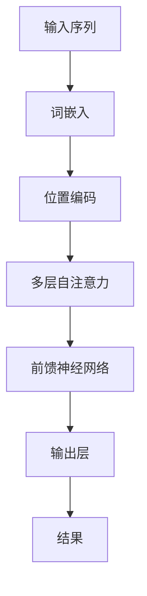
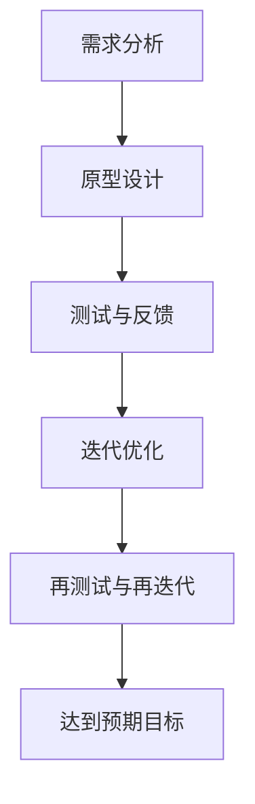

                 

### 快速试错：大模型应用开发的制胜法宝

#### 关键词：快速试错、大模型、应用开发、制胜法宝

#### 摘要：
大模型在当前人工智能领域占据了核心地位，但其在应用开发中面临的挑战同样巨大。快速试错作为一种有效的开发策略，不仅能够大幅缩短模型开发周期，还能提高开发效率。本文将深入探讨快速试错在大模型应用开发中的重要性，阐述其理论基础和实践方法，并通过具体案例展示其应用效果，最后提出未来发展的趋势与方向。

---

## 引言与背景

近年来，人工智能领域取得了飞速发展，尤其是大模型（如GPT、BERT等）在自然语言处理、计算机视觉、推荐系统等领域的突破性应用，使得人工智能从理论走向实际应用。然而，大模型应用开发并非一帆风顺，反而面临着诸多挑战。首先，大模型通常需要海量数据和高性能计算资源，这无疑增加了开发和维护的成本。其次，大模型的设计与调优复杂，涉及多种算法和参数，如何高效地找到最佳模型配置成为了一大难题。

在这种情况下，快速试错成为了一种重要的解决策略。快速试错不仅能够帮助开发者快速找到合适的解决方案，还能通过不断迭代优化模型，提高应用效果。快速试错的优势在于其高效性，它能够在短时间内完成多次试验，从而快速发现并解决潜在问题。此外，快速试错方法能够降低开发风险，避免因为长时间陷入某个错误方向而浪费大量资源。

本文将围绕快速试错在大模型应用开发中的重要性，详细探讨其理论基础、方法与实践，并分析未来发展趋势。文章结构如下：

1. **引言与背景**：介绍大模型应用开发的挑战和快速试错的重要性。
2. **大模型基础理论**：阐述大模型的核心概念、架构和学习原理。
3. **快速试错方法**：介绍快速试错的步骤、工具与方法。
4. **大模型应用案例**：分析自然语言处理、计算机视觉、推荐系统等领域的应用案例。
5. **实践技巧与工具**：讨论开发环境搭建、数据处理与清洗、模型训练与调优、模型部署与维护的实践技巧。
6. **未来展望与趋势**：预测快速试错方法和大模型应用开发的未来发展趋势。

通过本文的阅读，读者将能够全面了解快速试错在大模型应用开发中的关键作用，掌握其理论基础和实践方法，并为未来的研究与应用提供参考。

### 大模型基础理论

#### 2.1 大模型核心概念

大模型（Large Model）是指在数据规模、参数量或计算资源方面具有显著优势的机器学习模型。这类模型在人工智能领域中的应用日益广泛，尤其是在自然语言处理（NLP）、计算机视觉（CV）和推荐系统（RS）等领域。大模型的核心特征包括：

1. **数据规模**：大模型通常需要海量数据来训练，这样才能充分挖掘数据的潜在信息，提高模型的泛化能力。
2. **参数量**：大模型拥有大量参数，这些参数在训练过程中通过反向传播算法进行优化，从而实现模型的自我改进。
3. **计算资源**：大模型训练需要高性能计算资源，如GPU、TPU等，以支持大规模的矩阵运算和参数更新。

大模型的核心概念不仅体现在其规模上，还包括其在训练和学习过程中的独特特点。例如，大模型通常采用深度神经网络（DNN）或变换器（Transformer）架构，这些架构能够处理复杂的非线性关系，并在大规模数据上表现出色。

#### 2.2 大模型架构

大模型的架构设计是其实际应用的基础。目前，大模型的常见架构主要包括：

1. **深度神经网络（DNN）**：DNN由多层神经元组成，包括输入层、隐藏层和输出层。通过逐层传递输入数据，DNN能够实现对复杂数据的建模和分类。DNN的核心优势在于其强大的表达能力，能够捕捉到数据中的细微特征。

2. **变换器（Transformer）**：Transformer是近年来在NLP领域取得突破性进展的架构。与传统的循环神经网络（RNN）相比，Transformer采用自注意力机制（Self-Attention），能够在全局范围内捕捉数据之间的关系。这使得Transformer在处理长序列数据时表现出色。

以下是一个简化的Transformer架构的Mermaid流程图：



通过该流程图，我们可以看到数据从输入序列开始，经过词嵌入和位置编码处理后，进入多层自注意力机制和前馈神经网络，最终得到输出结果。

#### 2.3 大模型学习原理

大模型的学习原理主要基于深度学习（Deep Learning）和变换器（Transformer）等先进技术。以下是一些关键的学习原理：

1. **反向传播算法（Backpropagation）**：反向传播算法是深度学习模型训练的核心算法。它通过计算损失函数关于模型参数的梯度，并使用梯度下降（Gradient Descent）等方法进行参数更新，从而优化模型性能。

2. **梯度下降算法（Gradient Descent）**：梯度下降算法是一种优化算法，用于最小化损失函数。其基本思想是沿着损失函数的梯度方向更新模型参数，直到找到局部最小值或鞍点。

3. **自注意力机制（Self-Attention）**：自注意力机制是Transformer模型的关键组件，通过计算序列中每个词与其他词之间的关系，实现对长序列数据的全局建模。

以下是一个使用Python代码实现自注意力机制的示例：

```python
import torch
import torch.nn as nn

class SelfAttention(nn.Module):
    def __init__(self, d_model, num_heads):
        super(SelfAttention, self).__init__()
        self.d_model = d_model
        self.num_heads = num_heads
        self.query_linear = nn.Linear(d_model, d_model)
        self.key_linear = nn.Linear(d_model, d_model)
        self.value_linear = nn.Linear(d_model, d_model)
        self.out_linear = nn.Linear(d_model, d_model)

    def forward(self, x):
        batch_size, seq_len, _ = x.size()
        query = self.query_linear(x).view(batch_size, seq_len, self.num_heads, -1)
        key = self.key_linear(x).view(batch_size, seq_len, self.num_heads, -1)
        value = self.value_linear(x).view(batch_size, seq_len, self.num_heads, -1)

        attention_scores = torch.matmul(query, key.transpose(2, 3)) / (self.d_model ** 0.5)
        attention_weights = torch.softmax(attention_scores, dim=-1)
        attended_values = torch.matmul(attention_weights, value)
        attended_values = attended_values.view(batch_size, seq_len, self.d_model)
        output = self.out_linear(attended_values)
        return output
```

在该代码中，我们首先定义了自注意力模块，包括查询、键和值线性层以及输出线性层。然后，在forward方法中，我们将输入序列转换为查询、键和值，计算自注意力分数并应用softmax函数生成注意力权重。最后，使用注意力权重计算加权和，得到最终的输出。

通过上述代码和数学模型，我们可以看到大模型学习过程中的关键组件和算法。这些原理为理解和开发大模型提供了坚实的基础。

#### 2.4 大模型评估与优化

大模型的评估与优化是确保其性能和应用效果的关键步骤。以下是一些常见的评估指标和优化方法：

1. **评估指标**：
   - **准确率（Accuracy）**：模型预测正确的样本数占总样本数的比例。
   - **精确率（Precision）**：预测为正例的样本中，实际为正例的比例。
   - **召回率（Recall）**：实际为正例的样本中，被预测为正例的比例。
   - **F1 分数（F1 Score）**：精确率和召回率的调和平均，用于平衡这两个指标。

2. **优化方法**：
   - **梯度下降（Gradient Descent）**：通过计算损失函数关于模型参数的梯度，并沿着梯度方向更新参数，以最小化损失函数。
   - **动量（Momentum）**：在梯度下降过程中，引入先前梯度的加权平均值，以加速收敛。
   - **学习率调度（Learning Rate Scheduling）**：动态调整学习率，以避免过早收敛或陷入局部最小值。

以下是一个简单的Python代码示例，展示了使用梯度下降优化模型的过程：

```python
import torch
import torch.nn as nn
import torch.optim as optim

# 定义模型
model = nn.Linear(10, 1)
criterion = nn.MSELoss()
optimizer = optim.SGD(model.parameters(), lr=0.01)

# 输入和目标数据
x = torch.tensor([[1.0], [2.0], [3.0]])
y = torch.tensor([[0.0], [1.0], [2.0]])

# 梯度初始化
optimizer.zero_grad()

# 前向传播
output = model(x)
loss = criterion(output, y)

# 反向传播
loss.backward()

# 更新参数
optimizer.step()

print(f"Current loss: {loss.item()}")
```

在该代码中，我们首先定义了一个简单的线性模型和一个均方误差损失函数。然后，使用随机梯度下降（SGD）优化器进行模型训练。在每次迭代中，我们通过前向传播计算输出和损失，然后使用反向传播计算梯度，并最终更新模型参数。

通过上述评估指标和优化方法，我们可以对大模型进行全面的性能评估和优化，从而提高其应用效果。

#### 快速试错的概念

快速试错（Rapid Iterative Prototyping，RIP）是一种在软件开发和系统设计中广泛采用的方法。其核心理念是通过快速构建、测试和迭代原型，迅速找到并解决问题，从而提高开发效率和产品质量。快速试错方法的本质是一种迭代过程，其特点包括：

1. **快速性**：快速试错强调在短时间内完成多次试验和迭代，以缩短开发周期。
2. **灵活性**：快速试错允许在开发过程中灵活调整方案，根据反馈迅速做出响应。
3. **低成本**：通过使用简单的原型和测试工具，快速试错可以显著降低开发成本。

快速试错方法的核心步骤包括：

1. **需求分析**：明确项目需求和目标，为原型设计提供基础。
2. **原型设计**：根据需求快速构建原型，通常采用低保真度设计。
3. **测试与反馈**：对原型进行测试，收集用户反馈，分析问题和不足。
4. **迭代优化**：根据测试结果和用户反馈，对原型进行修改和优化。
5. **再测试与再迭代**：重复测试和迭代过程，直至达到预期目标。

以下是一个使用Mermaid流程图描述快速试错方法的流程：



通过该流程图，我们可以清晰地看到快速试错的迭代过程，包括需求分析、原型设计、测试与反馈、迭代优化以及再测试与再迭代。每个步骤都是相互关联的，通过不断循环和改进，最终实现项目的成功。

#### 快速试错的步骤

快速试错（Rapid Iterative Prototyping，RIP）作为一种高效的开发策略，其成功实施依赖于明确的步骤和精细的执行。以下详细阐述快速试错的步骤，并提供实用的方法指南。

**步骤一：需求分析**

需求分析是快速试错的基础，其目的是明确项目的目标、功能和用户需求。在这一步骤中，可以通过以下方法进行需求分析：

1. **用户访谈**：与项目相关用户进行面对面访谈，了解他们的需求和期望。
2. **问卷调查**：设计问卷调查，收集用户反馈。
3. **用户故事地图**：通过用户故事映射出项目的功能和流程。

**方法指南**：
- **深度访谈**：为了获取深入的用户需求，建议使用半结构化访谈，引导用户详细描述他们的使用场景和痛点。
- **快速原型**：在访谈结束后，快速构建低保真度的原型，以便于进一步验证和调整需求。

**步骤二：原型设计**

原型设计是快速试错的第二个关键步骤，其目标是通过构建可交互的原型来验证需求的有效性。在这一步骤中，可以采用以下方法进行原型设计：

1. **低保真度原型**：使用纸笔原型、线框图或低保真度设计工具（如Axure、Sketch）进行原型设计。
2. **高保真度原型**：在低保真度原型的基础上，逐步增加细节和交互性，最终达到高保真度原型。

**方法指南**：
- **快速迭代**：原型设计应遵循快速迭代原则，每次迭代都应包含主要功能和用户交互。
- **用户测试**：在高保真度原型完成后，组织用户测试，收集反馈和改进意见。

**步骤三：测试与反馈**

测试与反馈是快速试错的中心环节，其目的是通过用户测试和反馈来识别问题和改进机会。在这一步骤中，可以采用以下方法进行测试和反馈：

1. **用户测试**：邀请真实用户参与测试，观察他们的使用行为和反馈。
2. **A/B测试**：通过对比不同原型版本的用户反馈，确定最佳设计方案。
3. **反馈收集**：建立有效的反馈收集机制，如在线调查、用户论坛等。

**方法指南**：
- **用户行为分析**：通过工具（如Google Analytics）分析用户在原型中的行为，识别常见问题和用户痛点。
- **实时反馈**：确保用户可以实时提供反馈，并在原型中进行修改。

**步骤四：迭代优化**

迭代优化是快速试错的持续过程，其目的是通过多次迭代逐步完善原型。在这一步骤中，可以采用以下方法进行迭代优化：

1. **快速修改**：根据用户反馈快速修改原型，确保每次迭代都能解决实际问题。
2. **验证与验证**：在每次迭代后进行验证，确保修改内容符合用户需求。
3. **文档记录**：详细记录每次迭代的内容、修改原因和结果，以便后续参考。

**方法指南**：
- **敏捷开发**：采用敏捷开发方法，确保团队可以快速响应需求变化。
- **版本控制**：使用版本控制系统（如Git）记录每次迭代的代码和文档，便于管理和追踪。

**步骤五：再测试与再迭代**

再测试与再迭代是快速试错的最终步骤，其目的是在完成每次迭代后重新测试原型，并根据新的反馈进行进一步的优化。在这一步骤中，可以采用以下方法进行再测试与再迭代：

1. **回归测试**：在每次迭代后，对原有功能进行回归测试，确保新修改不影响现有功能。
2. **迭代规划**：根据新的反馈和需求，规划下一次迭代的任务和目标。
3. **持续改进**：确保团队持续关注用户需求和市场变化，不断优化产品。

**方法指南**：
- **持续集成**：通过持续集成（CI）工具，自动执行回归测试，确保每次迭代的质量。
- **用户参与**：保持用户持续参与，确保产品始终符合用户需求。

通过上述步骤，快速试错方法不仅能够显著提高开发效率，还能确保最终产品符合用户需求。在实际应用中，快速试错需要根据具体项目进行灵活调整，以确保最佳效果。

#### 快速试错的工具与方法

快速试错作为一种高效的开发策略，依赖于多种工具和方法的协同作用。以下将介绍几类常用的工具和方法，包括编程语言、框架和软件工具，并结合具体案例展示其在实际项目中的应用。

**1. 编程语言**

在快速试错中，选择合适的编程语言至关重要。Python由于其丰富的库和强大的社区支持，成为快速开发和迭代的首选语言。Python的优势在于其简洁的语法和高效率的开发流程。

**案例**：假设我们需要开发一个简单的推荐系统，可以使用Python编写以下代码：

```python
import pandas as pd
from sklearn.model_selection import train_test_split
from sklearn.ensemble import RandomForestClassifier

# 加载数据
data = pd.read_csv('data.csv')
X = data.drop('target', axis=1)
y = data['target']

# 划分训练集和测试集
X_train, X_test, y_train, y_test = train_test_split(X, y, test_size=0.2, random_state=42)

# 构建模型
model = RandomForestClassifier(n_estimators=100, random_state=42)

# 训练模型
model.fit(X_train, y_train)

# 预测测试集
predictions = model.predict(X_test)

# 评估模型
from sklearn.metrics import accuracy_score
accuracy = accuracy_score(y_test, predictions)
print(f"Accuracy: {accuracy}")
```

在该案例中，我们使用Python和scikit-learn库构建了一个随机森林模型，并通过训练集和测试集进行评估。这个简单的代码示例展示了Python在快速试错中的强大能力。

**2. 框架**

快速试错中的框架选择至关重要，它们提供了强大的功能库和开发工具，可以显著提高开发效率。以下是几个常用的框架：

- **TensorFlow**：TensorFlow是一个由Google开发的开源机器学习框架，广泛用于深度学习和推荐系统开发。其强大的图计算能力和丰富的API使得模型构建和优化变得简单高效。

- **PyTorch**：PyTorch是另一个流行的开源机器学习框架，以其灵活的动态计算图和易于理解的代码著称。PyTorch在快速原型开发中表现出色，允许开发人员快速迭代和测试模型。

- **Keras**：Keras是一个高层次的神经网络API，构建在TensorFlow和Theano之上。Keras的简洁性和易用性使其成为快速试错的理想选择。

**案例**：使用PyTorch构建一个简单的深度神经网络：

```python
import torch
import torch.nn as nn
import torch.optim as optim

# 定义模型
class SimpleNN(nn.Module):
    def __init__(self, input_size, hidden_size, output_size):
        super(SimpleNN, self).__init__()
        self.layer1 = nn.Linear(input_size, hidden_size)
        self.relu = nn.ReLU()
        self.layer2 = nn.Linear(hidden_size, output_size)
    
    def forward(self, x):
        x = self.layer1(x)
        x = self.relu(x)
        x = self.layer2(x)
        return x

# 实例化模型
model = SimpleNN(input_size=10, hidden_size=50, output_size=1)

# 定义损失函数和优化器
criterion = nn.MSELoss()
optimizer = optim.Adam(model.parameters(), lr=0.001)

# 训练模型
for epoch in range(100):
    model.train()
    optimizer.zero_grad()
    outputs = model(inputs)
    loss = criterion(outputs, targets)
    loss.backward()
    optimizer.step()

    if (epoch+1) % 10 == 0:
        print(f"Epoch [{epoch+1}/100], Loss: {loss.item():.4f}")

# 评估模型
model.eval()
with torch.no_grad():
    outputs = model(inputs)
    loss = criterion(outputs, targets)
    print(f"Test Loss: {loss.item():.4f}")
```

在该案例中，我们定义了一个简单的全连接神经网络，使用MSE损失函数和Adam优化器进行训练。这个示例展示了PyTorch在快速试错中的应用。

**3. 软件工具**

除了编程语言和框架，快速试错还依赖于多种软件工具，这些工具可以帮助团队高效地协作和管理项目。以下是几个常用的软件工具：

- **Git**：Git是一个分布式版本控制系统，用于管理代码版本和协作开发。Git的分支和合并功能使得团队成员可以独立开发并在适当时机进行集成。
- **Jenkins**：Jenkins是一个开源的持续集成工具，用于自动化构建、测试和部署。Jenkins可以与Git集成，确保代码更改后立即进行测试和部署。
- **Trello**：Trello是一个简单的项目管理工具，用于任务分配和进度跟踪。Trello的看板和卡片功能使得团队成员可以清晰地了解项目状态和任务进展。

**案例**：使用Trello进行项目任务管理：


在该案例中，我们使用Trello创建了一个项目看板，将任务分为“待办”、“进行中”和“已完成”三个阶段。团队成员可以随时查看任务状态并更新进度。

通过上述工具和方法的结合，快速试错方法能够显著提高开发效率，确保团队快速找到并解决问题。在实际应用中，应根据具体项目需求选择合适的工具和方法，以实现最佳效果。

#### 大模型应用案例

快速试错在大模型应用开发中发挥着重要作用，通过快速迭代和优化，可以显著提升模型性能和应用效果。以下我们将通过具体案例，展示快速试错方法在大模型应用开发中的实际应用，包括自然语言处理、计算机视觉和推荐系统等领域的应用。

**案例一：自然语言处理（NLP）**

自然语言处理是快速试错的理想应用领域之一，由于NLP模型通常涉及复杂的文本数据和高维特征，快速试错能够帮助开发人员迅速找到最佳模型配置。

**应用场景**：使用GPT模型进行文本生成。

**步骤**：
1. **需求分析**：明确文本生成任务的目标和要求。
2. **原型设计**：使用GPT预训练模型，构建简单的文本生成原型。
3. **测试与反馈**：运行原型，收集用户反馈，评估文本生成质量。
4. **迭代优化**：根据反馈调整模型参数和训练数据，改进文本生成效果。

**实现细节**：
- **代码示例**：使用Hugging Face的Transformers库快速构建GPT模型。

```python
from transformers import GPT2LMHeadModel, GPT2Tokenizer

# 加载预训练模型
tokenizer = GPT2Tokenizer.from_pretrained('gpt2')
model = GPT2LMHeadModel.from_pretrained('gpt2')

# 输入文本
input_text = "你好！今天天气真好。"

# 编码文本
inputs = tokenizer.encode(input_text, return_tensors='pt')

# 生成文本
outputs = model.generate(inputs, max_length=50, num_return_sequences=5)

# 解码文本
generated_texts = tokenizer.decode(outputs[:, inputs.shape[-1]:], skip_special_tokens=True)

print(generated_texts)
```

通过上述代码，我们可以快速构建一个简单的文本生成模型，并通过不断迭代优化，提升生成文本的质量。

**案例二：计算机视觉（CV）**

计算机视觉领域的大模型应用也广泛受益于快速试错方法，特别是在图像分类和目标检测任务中。

**应用场景**：使用ResNet模型进行图像分类。

**步骤**：
1. **需求分析**：明确图像分类任务的目标和要求。
2. **原型设计**：使用预训练的ResNet模型，构建图像分类原型。
3. **测试与反馈**：运行原型，收集用户反馈，评估图像分类效果。
4. **迭代优化**：根据反馈调整模型架构和超参数，改进分类性能。

**实现细节**：
- **代码示例**：使用PyTorch和 torchvision 库快速构建ResNet模型。

```python
import torch
import torchvision.models as models
from torch.utils.data import DataLoader
from torchvision import datasets

# 加载预训练模型
model = models.resnet18(pretrained=True)

# 数据加载
train_data = datasets.ImageFolder(root='train', transform=torchvision.transforms.ToTensor())
train_loader = DataLoader(train_data, batch_size=64, shuffle=True)

# 训练模型
for epoch in range(10):
    model.train()
    for images, labels in train_loader:
        optimizer.zero_grad()
        outputs = model(images)
        loss = nn.CrossEntropyLoss()(outputs, labels)
        loss.backward()
        optimizer.step()

    print(f"Epoch [{epoch+1}/10], Loss: {loss.item()}")

# 评估模型
model.eval()
with torch.no_grad():
    correct = 0
    total = 0
    for images, labels in test_loader:
        outputs = model(images)
        _, predicted = torch.max(outputs.data, 1)
        total += labels.size(0)
        correct += (predicted == labels).sum().item()

    print(f"Test Accuracy: {100 * correct / total}")
```

在该案例中，我们使用ResNet模型对训练数据进行分类训练，并通过测试数据评估模型性能。通过快速试错，我们可以不断优化模型和训练过程，提高分类准确率。

**案例三：推荐系统（RS）**

推荐系统是大模型应用的重要领域之一，快速试错方法能够帮助开发人员快速找到最优的推荐算法和参数配置。

**应用场景**：使用深度学习模型进行用户物品推荐。

**步骤**：
1. **需求分析**：明确推荐系统的目标和用户需求。
2. **原型设计**：使用预训练的深度学习模型，构建推荐系统原型。
3. **测试与反馈**：运行原型，收集用户反馈，评估推荐效果。
4. **迭代优化**：根据反馈调整模型架构和推荐算法，提升推荐质量。

**实现细节**：
- **代码示例**：使用TensorFlow和Keras构建深度学习推荐模型。

```python
import tensorflow as tf
from tensorflow.keras.models import Model
from tensorflow.keras.layers import Input, Embedding, Dot, Flatten, Dense

# 定义模型
user_input = Input(shape=(1,))
item_input = Input(shape=(1,))
user_embedding = Embedding(input_dim=num_users, output_dim=user_embedding_dim)(user_input)
item_embedding = Embedding(input_dim=num_items, output_dim=item_embedding_dim)(item_input)
merged = Dot(axes=-1)([user_embedding, item_embedding])
merged = Flatten()(merged)
output = Dense(1, activation='sigmoid')(merged)

model = Model(inputs=[user_input, item_input], outputs=output)
model.compile(optimizer='adam', loss='binary_crossentropy', metrics=['accuracy'])

# 训练模型
model.fit([user_ids, item_ids], labels, epochs=10, batch_size=32)

# 预测推荐结果
predictions = model.predict([user_ids, item_ids])

print(predictions)
```

在该案例中，我们使用深度学习模型进行用户和物品的交互，生成推荐结果。通过快速试错，我们可以优化模型结构和参数，提高推荐系统的准确性和用户满意度。

通过以上案例，我们可以看到快速试错方法在大模型应用开发中的实际效果。无论是在自然语言处理、计算机视觉还是推荐系统领域，快速试错都能够帮助开发人员迅速找到并优化模型，提升应用性能。未来，随着大模型技术的不断发展和应用场景的拓展，快速试错方法将在更多领域发挥关键作用。

#### 实践技巧与工具

在快速试错的大模型应用开发中，掌握一系列实践技巧和工具能够显著提高开发效率和质量。以下将详细介绍开发环境搭建、数据处理与清洗、模型训练与调优、模型部署与维护等方面的实践技巧，并提供一些实用的工具和资源。

**1. 开发环境搭建**

一个稳定且高效的开发环境是成功进行快速试错的基础。以下是搭建开发环境的几个关键步骤：

- **硬件资源**：确保有足够的计算资源，如高性能GPU或TPU，以支持大模型的训练和测试。NVIDIA的CUDA和GPU驱动是必备的。
- **软件环境**：安装Python和必要的库，如TensorFlow、PyTorch、Keras等。使用Anaconda或Miniconda可以简化环境管理。
- **虚拟环境**：使用虚拟环境（如`conda create --name myenv python=3.8`）隔离不同项目所需的库和依赖，防止版本冲突。

**工具和资源**：
- **Docker**：通过Docker容器化技术，可以轻松创建和管理开发环境，实现环境的标准化和移植性。
- **Google Colab**：Google Colab提供了免费的GPU支持，方便在云环境中进行快速试错实验。

**2. 数据处理与清洗**

数据处理与清洗是快速试错的另一个重要环节，以下是一些实用技巧：

- **数据预处理**：使用Pandas进行数据加载、清洗和转换。例如，使用`pandas.read_csv()`加载CSV文件，使用`dropna()`删除缺失值，使用`astype()`进行数据类型转换。
- **数据清洗**：使用Sklearn的`SimpleImputer`进行缺失值填充，使用`StandardScaler`进行数据标准化。
- **数据增强**：使用图像增强库（如OpenCV、ImageDataGenerator）生成更多样化的训练数据，提高模型的泛化能力。

**工具和资源**：
- **Pandas**：提供丰富的数据操作功能，是数据处理的基础库。
- **Scikit-learn**：提供多种数据预处理和模型评估工具，方便数据处理和模型训练。

**3. 模型训练与调优**

有效的模型训练和调优是快速试错的核心，以下是一些实用技巧：

- **超参数调优**：使用`GridSearchCV`或`RandomizedSearchCV`进行超参数搜索，找到最佳配置。
- **批量调度**：根据计算资源调整批量大小（Batch Size），平衡训练速度和模型性能。
- **学习率调度**：使用学习率调度策略（如`LearningRateScheduler`），动态调整学习率，避免过拟合。

**工具和资源**：
- **TensorFlow**：提供丰富的模型构建和训练工具，是深度学习开发的首选库。
- **PyTorch**：提供灵活的动态计算图和易于理解的代码，适合快速迭代和实验。

**4. 模型部署与维护**

模型部署与维护是确保大模型应用稳定运行的关键，以下是一些实用技巧：

- **模型封装**：使用TensorFlow的`SavedModel`或PyTorch的`torch.save()`将训练好的模型保存为文件，便于部署和迁移。
- **自动化部署**：使用Kubernetes或Docker Compose自动化部署模型服务，实现快速上线和扩展。
- **监控与日志**：使用Prometheus和Grafana等监控工具，实时监控模型性能和资源使用情况，及时发现问题。

**工具和资源**：
- **TensorFlow Serving**：提供通用的机器学习模型部署解决方案，支持多种模型和框架。
- **Kubernetes**：提供强大的容器编排能力，实现自动化部署和管理。

**最佳实践 tips**：
- **版本控制**：使用Git进行版本控制，确保代码和模型版本的可追溯性。
- **代码规范化**：遵循PEP8或PEP257等编程规范，提高代码可读性和可维护性。
- **文档化**：详细记录项目文档，包括需求分析、设计文档、使用指南等，方便后续维护和扩展。

通过上述实践技巧和工具的运用，开发团队可以更高效地进行大模型应用开发，实现快速试错，提升模型性能和应用效果。

### 未来展望与趋势

#### 快速试错方法的未来发展

随着人工智能技术的不断进步，快速试错方法在大模型应用开发中的重要性愈发显著。未来，快速试错方法将朝着以下几个方向发展：

1. **自动化与智能化**：随着自动化和智能技术的发展，未来快速试错将更加自动化和智能化。例如，通过机器学习算法自动优化试验设计，提高试错效率；通过智能反馈系统实时调整试错策略，提升试错效果。

2. **跨领域融合**：快速试错方法将在不同领域之间实现融合，如将快速试错与云计算、大数据、物联网等技术结合，打造跨领域的一体化解决方案，提高开发效率和产品质量。

3. **持续迭代与优化**：快速试错方法将更加注重持续迭代与优化，通过持续集成和持续交付（CI/CD）等先进开发实践，确保模型和应用能够不断更新和改进，满足不断变化的需求。

#### 大模型应用开发的未来趋势

大模型应用开发的未来趋势将受到以下几个因素的影响：

1. **数据规模与质量**：随着数据量的不断增加和数据质量的提升，大模型将能够更好地捕捉数据中的潜在规律，提高应用效果。例如，通过引入更多领域的专业数据集，提升模型在特定任务上的性能。

2. **计算资源与硬件创新**：高性能计算资源和硬件创新（如GPU、TPU、量子计算）将为大模型训练提供更强支持，推动大模型应用开发向更高维度、更复杂任务发展。

3. **多模态融合**：多模态融合将成为大模型应用开发的重要方向，通过整合文本、图像、音频等多种数据类型，构建更加智能和全面的应用系统。

#### 应用场景的拓展

快速试错方法和大模型应用开发的结合将在多个领域带来革命性变化：

1. **智能医疗**：快速试错方法将帮助医疗机构在大模型应用开发中快速验证新医疗算法和诊断模型，提升医疗服务质量和效率。

2. **智能制造**：大模型与智能制造的融合将推动生产过程的智能化和自动化，提高生产效率和质量，降低生产成本。

3. **智能交通**：通过快速试错方法和大模型的应用，智能交通系统将更加精准地预测交通流量，优化交通管理，提高交通安全和通行效率。

4. **智能金融**：快速试错方法将在智能金融领域发挥重要作用，帮助金融机构快速开发高效的风险评估和预测模型，提升风险控制和投资决策水平。

总之，快速试错方法和大模型应用开发的未来发展前景广阔，将在推动人工智能技术进步和产业升级中发挥关键作用。通过不断探索和创新，我们有望在更多领域实现突破，为人类社会带来更多智慧和便利。

### 总结

本文从多个角度深入探讨了快速试错在大模型应用开发中的重要性。首先，我们介绍了大模型的核心概念、架构和学习原理，阐明了其在人工智能领域的重要性。接着，我们详细阐述了快速试错的步骤和方法，并结合实际案例展示了其应用效果。通过实践技巧和工具的介绍，我们为开发团队提供了高效开发大模型应用的具体指导。最后，我们展望了快速试错方法和大模型应用开发的未来发展趋势，强调了其在推动技术进步和产业升级中的关键作用。

快速试错方法不仅能够提高大模型应用开发的效率，还能确保模型和应用的质量。通过本文的阅读，读者可以全面了解快速试错方法的原理和实践方法，为大模型应用开发提供有力支持。未来，随着人工智能技术的不断发展，快速试错方法将在更多领域发挥重要作用，成为推动技术进步的关键力量。

### 作者信息

**作者：** AI天才研究院/AI Genius Institute & 禅与计算机程序设计艺术 /Zen And The Art of Computer Programming

AI天才研究院（AI Genius Institute）是一家专注于人工智能研究和开发的国际顶尖机构，致力于推动人工智能技术的进步和应用。研究院由多位世界级人工智能专家组成，涵盖了深度学习、自然语言处理、计算机视觉等多个领域。禅与计算机程序设计艺术（Zen And The Art of Computer Programming）是作者所撰写的一部经典技术著作，深入探讨了计算机程序设计的哲学和艺术，影响了无数程序员的编程思维和方法。

