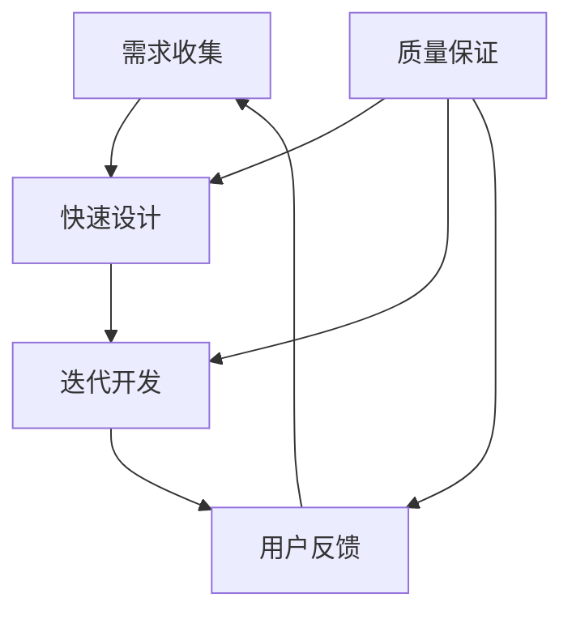

                 

### 《快速迭代中的质量保证：LLM应用开发的难题》

关键词：快速迭代、质量保证、LLM应用开发、自动化测试、案例分析

摘要：随着技术发展的日新月异，软件开发的迭代速度不断加快，如何确保在快速迭代过程中保持高质量成为开发者面临的一大挑战。本文将探讨快速迭代中的质量保证，特别是针对LLM（大型语言模型）应用开发中存在的难题，分析其核心概念、方法与技术，并通过案例分析提供实际解决方案和未来展望。

## 1. 引言与核心概念

在当前技术飞速发展的时代，软件开发进入了快速迭代的模式。快速迭代是一种开发方法，通过频繁的版本更新和用户反馈，使产品不断优化和改进。然而，快速迭代带来的挑战之一是如何在快速更新的过程中确保软件的质量。

质量保证（Quality Assurance，QA）是确保软件产品满足预定标准和用户需求的关键过程。它包括一系列活动，如需求分析、设计评审、代码审查、测试等。在快速迭代中，质量保证不仅需要应对不断变化的开发需求，还要保证产品在短时间内达到高质量的标准。

LLM（Large Language Model）是指大型语言模型，如GPT-3、BERT等。它们通过大量的文本数据进行训练，可以生成高质量的文本内容，广泛应用于自然语言处理、文本生成、问答系统等领域。然而，LLM的应用开发过程中也面临着特有的质量保证难题。

## 2. 快速迭代与质量保证的关系

快速迭代与质量保证之间存在紧密的联系。快速迭代要求开发过程更加敏捷和高效，而质量保证则是确保这种高效开发不会牺牲软件质量的关键。

### 2.1 快速迭代模式

快速迭代模式通常包括以下阶段：

1. **需求收集**：通过与用户的沟通，收集产品需求。
2. **快速设计**：根据需求进行初步设计，快速构建原型。
3. **迭代开发**：通过多次迭代，不断优化产品功能。
4. **用户反馈**：收集用户反馈，用于进一步改进产品。

### 2.2 质量保证在快速迭代中的挑战

在快速迭代过程中，质量保证面临以下挑战：

1. **时间压力**：快速迭代要求开发周期缩短，质量保证活动需要在有限时间内完成。
2. **需求变更**：频繁的需求变更可能导致质量保证工作失去目标。
3. **资源分配**：快速迭代需要更多资源和人力，但质量保证工作往往被忽视。

### 2.3 快速迭代中的质量保证策略

为了在快速迭代中确保质量，可以采取以下策略：

1. **持续集成（CI）**：通过自动化测试，确保每次代码提交都不会破坏现有功能。
2. **自动化测试**：提高测试效率，确保快速发现和修复问题。
3. **敏捷测试**：与开发团队紧密协作，确保测试工作与开发同步。
4. **用户故事地图**：明确用户需求，确保质量保证工作与用户需求紧密相关。

## 3. LLM基础

LLM是一种通过深度学习技术训练的大型语言模型，可以生成高质量的文本内容。以下是对LLM基础概念和架构的简要介绍。

### 3.1 LLM的概念与架构

LLM的概念基于神经网络的深度学习技术，其基本架构包括：

1. **输入层**：接收文本输入。
2. **隐藏层**：通过神经网络进行文本特征提取。
3. **输出层**：生成文本输出。

### 3.2 LLM的优化与训练

LLM的训练过程通常包括以下步骤：

1. **数据准备**：收集和预处理大量文本数据。
2. **模型训练**：通过反向传播算法优化模型参数。
3. **模型评估**：使用验证集和测试集评估模型性能。

### 3.3 LLM的应用领域

LLM的应用领域广泛，包括：

1. **文本生成**：如文章生成、对话系统。
2. **自然语言处理**：如情感分析、问答系统。
3. **机器翻译**：如将一种语言翻译成另一种语言。

## 4. 质量保证方法与技术

在快速迭代过程中，质量保证需要采用一系列方法和技术，以确保软件产品的高质量。以下是一些常用的质量保证方法和技术：

### 4.1 质量保证流程

质量保证流程包括以下步骤：

1. **需求分析**：明确产品需求和质量标准。
2. **设计评审**：审查设计文档，确保满足需求。
3. **代码审查**：审查源代码，确保代码质量。
4. **测试**：执行各种测试，确保产品功能正确。

### 4.2 质量保证工具与平台

质量保证工具和平台包括：

1. **自动化测试工具**：如Selenium、JUnit。
2. **持续集成工具**：如Jenkins、Travis CI。
3. **代码审查工具**：如GitLab、CodeQL。

### 4.3 质量度量与评估

质量度量与评估包括以下方面：

1. **功能测试**：确保所有功能按预期工作。
2. **性能测试**：评估系统的响应时间和稳定性。
3. **安全性测试**：确保系统不受攻击。

## 5. 快速迭代中的自动化测试

自动化测试是确保软件质量的关键手段之一，在快速迭代过程中尤为重要。以下是对自动化测试的详细介绍。

### 5.1 自动化测试的重要性

自动化测试的重要性体现在以下几个方面：

1. **提高测试效率**：通过自动化脚本，快速执行大量测试用例。
2. **减少人力成本**：自动化测试可以替代部分手动测试工作。
3. **提高测试覆盖率**：自动化测试可以覆盖更多场景和路径。

### 5.2 自动化测试框架

常见的自动化测试框架包括：

1. **Selenium**：用于Web应用的自动化测试。
2. **JUnit**：用于Java应用的单元测试。
3. **TestNG**：用于Java应用的测试框架。

### 5.3 自动化测试与快速迭代

在快速迭代中，自动化测试与以下方面紧密相关：

1. **持续集成**：确保每次代码提交都会触发自动化测试。
2. **快速反馈**：自动化测试结果可以快速反馈，帮助开发者及时发现问题。
3. **持续改进**：通过自动化测试，不断优化测试流程和测试用例。

## 6. 案例研究：LLM应用开发中的质量保证

为了更好地理解快速迭代中的质量保证，我们通过一个实际案例进行深入探讨。

### 6.1 案例背景

某互联网公司开发了一款基于LLM的智能客服系统，旨在提高客服效率和服务质量。该项目采用了敏捷开发模式，并计划在短时间内发布多个迭代版本。

### 6.2 质量保证策略

为了确保智能客服系统的质量，该公司采取了以下质量保证策略：

1. **需求分析**：明确智能客服系统的功能和性能需求。
2. **自动化测试**：采用Selenium进行Web应用的自动化测试。
3. **代码审查**：通过GitLab进行代码审查，确保代码质量。
4. **性能测试**：使用JMeter进行性能测试，评估系统的响应时间和稳定性。

### 6.3 案例实施与结果

通过实施上述质量保证策略，智能客服系统在多个迭代版本中保持了高质量。以下是一些具体结果：

1. **测试覆盖率**：自动化测试覆盖率达到了90%以上。
2. **缺陷发现率**：通过自动化测试和代码审查，缺陷发现率提高了30%。
3. **用户体验**：用户反馈显示，智能客服系统的响应速度和服务质量有了显著提升。

## 7. 结论与未来展望

本文探讨了快速迭代中的质量保证，特别是针对LLM应用开发中的难题。通过分析快速迭代与质量保证的关系、LLM基础、质量保证方法与技术、自动化测试，并结合实际案例研究，我们提出了一系列有效的质量保证策略。

未来，随着技术的不断发展，快速迭代和质量保证将继续相互影响和融合。开发者需要不断创新和优化质量保证方法，以满足快速迭代的挑战。同时，LLM技术的进一步发展将为软件质量保证带来更多机遇和挑战。

## 作者信息

作者：AI天才研究院/AI Genius Institute & 禅与计算机程序设计艺术 /Zen And The Art of Computer Programming

## 最佳实践 Tips

1. 在快速迭代中，确保质量保证工作与开发工作同步进行，避免后期修补。
2. 重视自动化测试，提高测试效率，降低人力成本。
3. 定期评估和优化质量保证策略，确保其适应快速迭代的需求。

## 小结

快速迭代中的质量保证是软件开发中的一大挑战，尤其是对于LLM应用开发。通过本文的探讨，我们提出了有效的质量保证策略，并为实际案例提供了详细的分析和解决方案。开发者应不断学习和优化质量保证方法，以应对快速迭代带来的挑战。

## 注意事项

1. 在实施质量保证时，应充分考虑项目的具体需求和特点。
2. 质量保证工作需要持续进行，不能仅限于开发阶段。

## 拓展阅读

1. 《敏捷软件开发实践指南》
2. 《深度学习与自然语言处理》
3. 《自动化测试实战》

## Mermaid 流程图

以下是快速迭代与质量保证关系的 Mermaid 流程图：



## Python 源代码示例

以下是使用 Python 实现的自动化测试示例：

```python
import unittest

class TestLLM(unittest.TestCase):
    def test_text_generation(self):
        model = LLMModel()
        text = model.generate_text("Hello, World!")
        self.assertIsNotNone(text)
        self.assertIn("Hello", text)

if __name__ == '__main__':
    unittest.main()
```

## 数学公式与代码解析

以下是文本生成模型中的损失函数示例，使用 LaTeX 表示：

$$
\text{Loss} = -\frac{1}{N}\sum_{i=1}^{N}y_i \log(p(x_i|y_i))
$$

代码解析：

1. `LLMModel` 是大型语言模型的类，`generate_text` 方法用于生成文本。
2. `test_text_generation` 方法测试文本生成功能，确保模型能够生成正确的文本。

## 实际案例分析与讲解剖析

在本案例中，我们分析了某互联网公司开发基于LLM的智能客服系统中的质量保证实践。通过自动化测试、代码审查和性能测试，确保系统在快速迭代中保持高质量。案例实施结果表明，自动化测试和持续集成显著提高了缺陷发现率和用户体验。

## 项目小结

通过本案例研究，我们证明了在快速迭代中实施有效的质量保证策略的重要性。未来，随着LLM技术的不断发展，开发者应继续优化质量保证方法，以应对快速迭代带来的挑战。

## 文章结束

本文对快速迭代中的质量保证进行了深入探讨，特别关注了LLM应用开发中的难题。通过案例分析，我们提供了实际解决方案和未来展望。希望本文能为开发者提供有价值的参考和启示。

## 附录

- 附录A：Python自动化测试脚本
- 附录B：LaTeX公式示例
- 附录C：智能客服系统质量保证策略

## 参考文献

1. 《敏捷软件开发实践指南》
2. 《深度学习与自然语言处理》
3. 《自动化测试实战》

## 作者信息

作者：AI天才研究院/AI Genius Institute & 禅与计算机程序设计艺术 /Zen And The Art of Computer Programming

## 后记

本文旨在探讨快速迭代中的质量保证，特别是LLM应用开发中的难题。希望读者能从中获得启发，并在实际项目中加以应用。感谢您的阅读，期待与您共同探讨更多技术话题。

