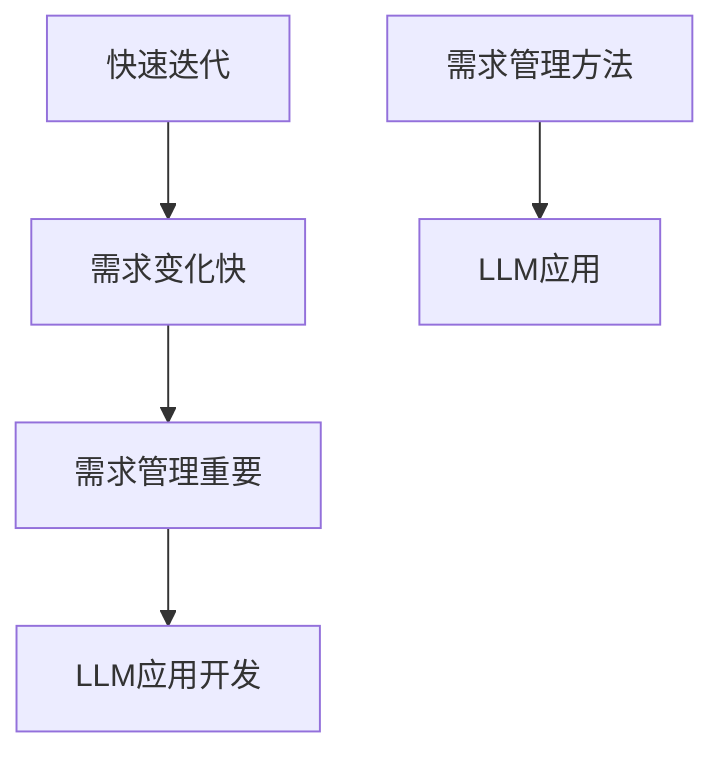

                 

---

# 快速迭代中的需求管理：LLM应用开发的挑战

## 关键词
- 快速迭代
- 需求管理
- LLM应用开发
- 挑战与解决方案
- 实战案例

## 摘要
在快速迭代的软件开发环境中，特别是大型语言模型（LLM）应用开发中，需求管理的挑战愈发显著。本文旨在探讨快速迭代背景下，LLM应用开发中需求管理的核心问题、挑战及其解决方案。通过深入分析需求变化的快速性、需求管理的方法论、LLM的特点以及实际案例，本文为软件开发人员、项目经理和产品经理提供了有价值的参考。

---

## 设计书籍目录大纲的步骤

### 第一步：确定书籍的主题和目标读者

在开始设计书籍目录大纲之前，我们需要明确书籍的主题和目标读者。对于《快速迭代中的需求管理：LLM应用开发的挑战》这本书来说，我们的主题是探讨在快速迭代的软件开发环境中，尤其是大型语言模型（LLM）应用开发过程中，如何有效地管理需求。而我们的目标读者主要是那些在软件开发、项目管理或产品管理领域工作的专业人士，他们对技术有深入的理解，同时也在实践中面临着需求管理方面的挑战。

确定主题和读者群体之后，我们可以开始设计书籍的整体架构。首先，我们需要思考书籍的主要部分，这通常是按照逻辑顺序排列的，例如：

1. **引言**：介绍快速迭代和LLM应用开发的基本概念，并阐述它们之间的关系。
2. **需求管理基础**：讲解需求管理的基本原理和方法。
3. **LLM应用开发**：探讨LLM在应用开发中的角色和作用。
4. **快速迭代与需求管理的挑战**：分析在快速迭代过程中遇到的需求管理挑战。
5. **解决方案**：提供针对挑战的解决方案和实践指导。
6. **实战案例**：通过实际案例展示需求管理在LLM应用开发中的具体应用。
7. **结论与展望**：总结全文，展望未来需求管理的发展趋势。

### 第二步：划分书籍结构

划分书籍结构是设计目录大纲的关键步骤。在这一步中，我们需要将书籍内容划分为几个主要部分，并为其命名。对于《快速迭代中的需求管理：LLM应用开发的挑战》，我们可以按照以下结构进行划分：

1. **基础概念与联系**
   - **快速迭代与需求管理的关系**
   - **LLM概述**
   - **需求管理的核心概念**

2. **需求管理方法**
   - **需求收集的方法**
   - **需求分析的技术**
   - **需求变更管理**

3. **LLM应用开发流程**
   - **LLM开发环境搭建**
   - **模型选择与训练**
   - **应用集成与部署**

4. **挑战与解决方案**
   - **需求变更管理**
   - **数据安全与隐私**
   - **模型解释性与可解释性**

5. **实战案例**
   - **电商平台的个性化推荐**
   - **金融领域的客户服务机器人**
   - **医疗行业的诊断支持系统**

6. **结论与展望**
   - **需求管理的未来趋势**
   - **LLM应用开发的挑战与机遇**

通过这种方式，我们能够清晰地展示书籍的内容结构和逻辑关系，帮助读者更好地理解整体架构。

### 第三步：细化章节内容

在确定了书籍的主要部分之后，我们需要进一步细化每个章节的内容。这包括确定每个章节的主题、目标、主要内容以及预期读者应该掌握的知识点。例如，对于“快速迭代与需求管理的关系”这一章节，我们可以包含以下内容：

- **引言**：介绍快速迭代的概念及其在软件开发中的应用。
- **需求变化快速性**：分析快速迭代带来的需求变化特点。
- **需求管理在快速迭代中的重要性**：阐述需求管理在快速迭代中的角色和重要性。
- **案例研究**：通过实际案例展示需求管理在快速迭代环境中的挑战和解决方案。

同样，对于其他章节，我们也需要进行类似的细化，确保每个章节都有明确的目标和内容。

### 第四步：设计核心概念与联系

为了帮助读者更好地理解书籍的核心概念和它们之间的关系，我们可以使用Mermaid流程图。例如，我们可以设计一个流程图来展示需求管理、快速迭代和LLM应用开发之间的联系：



这样的流程图可以帮助读者在视觉上理解各个概念之间的关系，从而更好地把握书籍的整体内容。

### 第五步：编写核心算法原理讲解

在书籍中，核心算法原理的讲解是至关重要的。为了确保读者能够理解算法的基本逻辑和运作机制，我们可以使用Python源代码来详细阐述。例如，对于需求分析算法，我们可以使用以下伪代码：

```python
def demand_analysis(data_set):
    # 初始化模型参数
    parameters = initialize_model_parameters()
    # 训练模型
    model = train_model(data_set, parameters)
    # 预测需求
    predictions = predict_demand(model, data_set)
    # 输出预测结果
    return predictions
```

同时，我们还可以结合数学模型和公式来详细讲解。例如：

```latex
y = \beta_0 + \beta_1 \cdot x_1 + \beta_2 \cdot x_2 + ... + \beta_n
```

通过这样的方式，我们能够为读者提供一个清晰、直观的算法理解过程。

### 第六步：准备数学模型和数学公式讲解

数学模型和数学公式在技术书籍中是非常常见的，因为它们能够帮助我们精确地表达算法和理论的本质。在本书中，我们将使用LaTeX格式来嵌入数学公式，确保内容的准确性和可读性。例如：

- **独立段落的LaTeX公式**：

  ```latex
  $$ E = mc^2 $$
  ```

  解释：爱因斯坦的质能方程。

- **段落内的LaTeX公式**：

  ```latex
  $1 < 2$
  ```

  解释：一个简单的数学不等式。

通过这种方式，我们能够在文中准确地嵌入数学公式，帮助读者更好地理解技术概念。

### 第七步：规划项目实战内容

项目实战内容是技术书籍中不可或缺的一部分，它能够帮助读者将理论知识应用到实践中。在本书中，我们将提供实际的代码案例，包括：

- **开发环境搭建**：介绍如何搭建一个适合LLM应用开发的环境。
- **源代码实现**：提供实际的Python代码实现，并解释每一步的操作。
- **代码解读**：分析源代码中的关键部分，解释其工作原理。
- **代码应用解读与分析**：展示代码在实际应用中的效果，并分析其优缺点。
- **实际案例分析和讲解**：通过实际案例，深入剖析需求管理在LLM应用开发中的具体应用。

### 第八步：确保目录大纲的简洁性

在完成书籍目录大纲的设计后，我们需要检查目录内容，确保没有多余的废话，所有章节内容都直接且有条理。这包括：

- **删除重复内容**：确保每个章节都有独特的主题，避免重复。
- **调整章节顺序**：根据内容的逻辑关系，调整章节的顺序，确保整体结构合理。
- **简化标题**：确保章节标题简洁明了，能够准确反映章节内容。

### 第九步：格式排版

使用markdown格式进行排版是技术书籍中常用的做法，因为它可以轻松地处理标题、列表、代码块、LaTeX公式等。以下是一个简单的markdown格式示例：

```
# 快速迭代中的需求管理：LLM应用开发的挑战

## 第一步：确定书籍主题和目标读者

在开始设计书籍目录大纲之前，我们需要明确书籍的主题和目标读者。对于《快速迭代中的需求管理：LLM应用开发的挑战》这本书来说，我们的主题是探讨在快速迭代的软件开发环境中，如何有效地管理需求。而我们的目标读者主要是那些在软件开发、项目管理或产品管理领域工作的专业人士，他们对技术有深入的理解，同时也在实践中面临着需求管理方面的挑战。

### 第二步：划分书籍结构

划分书籍结构是设计目录大纲的关键步骤。在这一步中，我们需要将书籍内容划分为几个主要部分，并为其命名。对于《快速迭代中的需求管理：LLM应用开发的挑战》，我们可以按照以下结构进行划分：

1. **基础概念与联系**
   - **快速迭代与需求管理的关系**
   - **LLM概述**
   - **需求管理的核心概念**

2. **需求管理方法**
   - **需求收集的方法**
   - **需求分析的技术**
   - **需求变更管理**

3. **LLM应用开发流程**
   - **LLM开发环境搭建**
   - **模型选择与训练**
   - **应用集成与部署**

4. **挑战与解决方案**
   - **需求变更管理**
   - **数据安全与隐私**
   - **模型解释性与可解释性**

5. **实战案例**
   - **电商平台的个性化推荐**
   - **金融领域的客户服务机器人**
   - **医疗行业的诊断支持系统**

6. **结论与展望**
   - **需求管理的未来趋势**
   - **LLM应用开发的挑战与机遇**
```

通过markdown格式，我们可以轻松地创建一个结构清晰、易于阅读的目录大纲。

### 第十步：审查和修改

在完成目录大纲的设计后，我们需要进行审查和修改。这包括：

- **检查目录内容**：确保所有章节都被包含，且内容完整。
- **逻辑性审查**：确保章节内容之间的逻辑关系合理，没有跳跃或遗漏。
- **修改和优化**：根据审查结果，对目录大纲进行必要的修改和优化。

通过这些步骤，我们可以确保《快速迭代中的需求管理：LLM应用开发的挑战》的目录大纲既结构合理又内容丰富。

---

通过以上十个步骤，我们成功设计了《快速迭代中的需求管理：LLM应用开发的挑战》的目录大纲。接下来，我们将开始撰写具体的章节内容，逐步展开对快速迭代、需求管理、LLM应用开发以及相关挑战和解决方案的深入探讨。希望这篇博客能够为读者提供一个清晰的框架和深入的技术见解。在后续的章节中，我们将一一详细阐述每个部分的内容，确保读者能够全面了解并掌握快速迭代中的需求管理方法和LLM应用开发的实践技巧。

---

# 快速迭代中的需求管理：LLM应用开发的挑战

## 关键词
- 快速迭代
- 需求管理
- LLM应用开发
- 挑战与解决方案
- 实战案例

## 摘要
在快速迭代的软件开发环境中，特别是大型语言模型（LLM）应用开发中，需求管理的挑战愈发显著。本文旨在探讨快速迭代背景下，LLM应用开发中需求管理的核心问题、挑战及其解决方案。通过深入分析需求变化的快速性、需求管理的方法论、LLM的特点以及实际案例，本文为软件开发人员、项目经理和产品经理提供了有价值的参考。

---

## 引言

快速迭代开发（Faster Iterative Development）作为一种敏捷软件开发方法，已成为现代软件工程实践中的主流。其核心思想是通过快速、频繁的迭代来缩短产品交付周期，提高开发效率和产品质量。快速迭代强调客户反馈、灵活性和持续改进，这使得软件团队能够迅速响应市场变化和用户需求。

然而，快速迭代带来的一个显著挑战是需求管理的复杂性增加。由于迭代周期缩短，需求变化变得更加频繁，这对团队的需求管理能力提出了更高的要求。特别是在大型语言模型（LLM）应用开发中，需求管理的挑战尤为突出。LLM是一种复杂的人工智能模型，其训练和应用过程涉及大量的数据预处理、模型选择和优化等步骤。因此，如何在快速迭代的背景下有效地管理LLM应用开发的需求，成为软件开发人员、项目经理和产品经理亟待解决的问题。

本文旨在探讨快速迭代中的需求管理挑战，特别是LLM应用开发过程中的需求管理问题。文章将首先介绍快速迭代和需求管理的基本概念，然后深入分析快速迭代对需求管理带来的挑战，特别是针对LLM应用开发的特点。接下来，本文将探讨应对这些挑战的方法和策略，并结合实际案例进行详细分析。最后，文章将总结全文，提出未来需求管理的发展趋势和展望。

通过本文的探讨，我们希望能够为从事快速迭代和LLM应用开发的团队成员提供有价值的指导，帮助他们更好地应对需求管理的挑战，提高项目的成功率和效率。

### 快速迭代与需求管理的关系

快速迭代开发（Faster Iterative Development）和需求管理是软件开发过程中紧密相连的两个概念。快速迭代开发强调通过短周期的迭代来不断改进产品，而需求管理则是确保这些改进符合用户需求、项目目标和资源限制的关键环节。二者之间的关系可以从以下几个方面进行深入探讨：

首先，快速迭代开发的核心在于频繁地交付可用的软件版本。这种开发模式要求团队在短时间内完成从需求收集、设计、编码到测试的整个流程。因此，需求管理的角色变得尤为重要，它需要确保每个迭代周期内收集到的需求是明确、可量化和可实现的，从而保证每次迭代都能带来实际的价值。

其次，快速迭代开发中的需求变化频繁。这意味着在项目进行过程中，用户的需求可能会随着市场环境、技术发展或内部评审的结果而不断变化。需求管理必须具备灵活性和敏捷性，能够快速响应这些变化，同时保持项目进度的稳定。这种需求变更管理不仅需要技术手段的支持，还需要团队协作和沟通机制的优化。

第三，快速迭代开发强调用户反馈和持续改进。用户在每次迭代后都能看到产品的部分功能，并提供反馈。这种反馈循环对于需求管理来说是一个宝贵的机会，可以用来调整和优化未来的需求。需求管理需要有效地收集、分析和利用这些反馈，确保需求的变化能够真正满足用户的需求，而不是仅仅为了追求迭代速度而牺牲质量。

此外，快速迭代开发中，需求管理的复杂性也相应增加。由于迭代频繁，需求文档的更新和维护变得尤为重要。需求管理团队需要确保需求文档的及时更新，避免需求遗漏或冲突。同时，项目管理工具和流程也需要适应快速迭代的节奏，以便更好地跟踪和管理需求变化。

总之，快速迭代与需求管理之间的关系是相互促进、相辅相成的。快速迭代为需求管理带来了挑战，但同时也为需求管理提供了更多的机会。有效的需求管理不仅能够提高项目的成功率和效率，还能够增强团队对市场变化的适应能力，最终推动产品的持续改进和优化。

### 需求管理的基本概念和方法

需求管理是软件开发过程中至关重要的环节，它涉及到需求的收集、分析、文档化、跟踪和变更控制。有效的需求管理不仅能够确保开发工作符合用户和项目的需求，还能提高项目的成功率、缩短开发周期和降低成本。以下将详细介绍需求管理的基本概念和方法。

#### 需求收集

需求收集是需求管理的第一步，也是最为关键的一步。在这一过程中，需求管理团队需要与项目相关各方（包括用户、利益相关者、市场分析师等）进行充分的沟通，了解他们的需求和期望。以下是一些常用的需求收集方法：

1. **访谈和调查**：通过与用户和利益相关者进行面对面访谈或在线调查，深入了解他们的需求、偏好和痛点。
2. **用户故事**：使用用户故事（User Stories）的方法，将用户的需求转化为简短、具体的描述，以便开发团队理解和实现。
3. **观察和参与**：在用户的工作环境中进行观察，亲身体验他们的工作流程，以便更准确地了解他们的需求。

#### 需求分析

需求分析是需求管理的核心步骤，它涉及到对收集到的需求进行整理、分类和优先级排序。以下是一些常用的需求分析方法：

1. **功能需求与非功能需求**：将需求分为功能需求（系统应执行的具体功能）和非功能需求（系统的性能、可靠性、安全性等）。
2. **需求优先级排序**：使用优先级矩阵（如MoSCoW矩阵）对需求进行优先级排序，确保在资源有限的情况下，优先实现最重要的需求。
3. **需求验证**：通过与用户和利益相关者进行验证会议，确保需求的准确性和可行性。

#### 需求文档化

需求文档化是将需求转化为书面文件的过程，它为开发团队提供了一个清晰的需求指南。以下是一些常用的需求文档化方法：

1. **用户需求文档**：详细描述用户的需求、场景和期望，包括功能需求和非功能需求。
2. **需求规格说明书**：提供详细的功能需求描述，包括输入、输出、处理逻辑和性能要求。
3. **需求跟踪矩阵**：记录每个需求的详细信息和相关方，确保需求的跟踪和变更控制。

#### 需求跟踪

需求跟踪是确保需求从提出到实现全过程得到有效管理的关键步骤。以下是一些常用的需求跟踪方法：

1. **需求跟踪工具**：使用专业的需求跟踪工具（如JIRA、Confluence等），对需求进行管理、分配和跟踪。
2. **需求生命周期管理**：记录每个需求的创建、分配、实现、测试和关闭等状态，确保需求的完整生命周期管理。
3. **变更控制**：在需求变更时，进行严格的变更控制流程，确保变更的影响得到评估和批准。

#### 需求变更管理

需求变更管理是在项目进行过程中，对需求进行修改和调整的管理过程。以下是一些常用的需求变更管理方法：

1. **变更请求**：当用户或利益相关者提出需求变更时，填写变更请求文档，详细描述变更的原因和影响。
2. **变更评估**：评估变更对项目进度、成本和风险的影响，确定是否批准变更。
3. **变更实施**：在批准变更后，根据评估结果对需求进行修改和调整，确保变更能够顺利实施。

通过上述需求管理的基本概念和方法，开发团队可以更有效地管理需求，确保项目能够按计划顺利进行。在快速迭代的背景下，灵活和高效的需求管理尤为重要，它能够帮助团队快速响应变化，提高项目交付的成功率和用户满意度。

### 快速迭代背景下的需求管理挑战

在快速迭代的开发模式下，需求管理面临着一系列独特的挑战，这些挑战不仅影响了项目的进度和质量，还可能对团队的协作和沟通产生负面影响。以下将详细探讨这些挑战，并分析它们对LLM应用开发的影响。

#### 需求变更频繁

快速迭代的一个显著特点是频繁的需求变更。在短时间内，用户和利益相关者可能会根据市场动态、技术进步或内部评审的结果，提出新的需求或对现有需求进行修改。这种频繁的需求变更给需求管理带来了巨大的挑战。一方面，需求变更可能会导致项目计划和资源的频繁调整，从而影响项目的进度和稳定性。另一方面，频繁的变更可能会破坏团队的协作，导致成员在需求和任务上的混淆，进而降低工作效率。

对于LLM应用开发来说，需求变更的频繁性尤为突出。LLM模型通常涉及大量的数据预处理、模型训练和优化过程，这些步骤不仅复杂，而且耗时较长。需求变更可能会要求对现有模型进行重新训练或调整，这会进一步增加开发时间和资源消耗。因此，如何在快速迭代过程中有效地管理需求变更，成为LLM应用开发中的关键问题。

#### 需求的明确性和可变性

在快速迭代中，需求的明确性和可变性是两个相互矛盾的要求。明确的需求是项目成功的关键，但快速迭代的灵活性要求需求能够快速适应变化。这导致需求管理团队需要在明确性和灵活性之间寻求平衡。

对于LLM应用开发，明确的需求至关重要。因为LLM模型的训练和优化过程需要大量的数据和高性能计算资源，如果需求不明确，可能会导致资源浪费和时间延误。然而，快速迭代环境下的需求又要求具备一定的灵活性，以便能够快速响应用户和市场变化。这种需求的不确定性可能会对项目的进度和质量产生负面影响。

#### 资源和时间限制

快速迭代开发通常伴随着严格的时间限制和资源约束。在这种背景下，需求管理团队需要在有限的资源内高效地完成需求收集、分析和实现工作。资源的限制可能会导致以下问题：

1. **人员不足**：快速迭代需要团队成员具备多方面的技能，但团队规模和资源有限，可能导致部分任务无法及时完成。
2. **时间紧迫**：在短时间内需要完成大量的工作，可能会导致团队成员的工作压力增大，影响工作质量和团队士气。

对于LLM应用开发，资源和时间限制尤其明显。由于LLM模型的训练和优化过程复杂且耗时，任何时间上的延误都可能对项目的整体进度产生重大影响。因此，如何在资源有限的情况下，有效地管理需求和进度，是快速迭代背景下需求管理的又一挑战。

#### 沟通和协作

快速迭代开发强调团队合作和高效沟通。需求管理团队需要与项目相关各方（包括用户、项目经理、开发人员和测试人员）保持密切的沟通，确保需求得到准确理解和实现。然而，在快速迭代的压力下，沟通和协作可能会面临以下挑战：

1. **信息过载**：快速迭代过程中，需求变更和项目进展信息频繁更新，可能导致团队成员感到信息过载，难以集中精力。
2. **沟通障碍**：团队成员可能处于不同的地理位置或时间区，沟通障碍可能影响协作效果。
3. **角色冲突**：不同角色的团队成员可能对需求有不同的理解和期望，导致角色冲突和沟通不畅。

对于LLM应用开发，沟通和协作的挑战尤为突出。因为LLM模型涉及多个学科和技术领域，需要不同专业背景的团队成员协作完成。任何沟通和协作上的问题都可能导致项目进度延误或质量下降。

#### 需求优先级的不确定性

快速迭代环境中，需求的优先级可能随时发生变化。用户和利益相关者可能会根据市场动态或项目进展，调整需求的优先级。这种不确定的需求优先级给需求管理带来了额外的复杂性。

对于LLM应用开发，需求优先级的不确定性可能对模型的训练和优化过程产生重大影响。如果优先级不明确，团队可能会在次要需求上耗费过多资源，导致关键需求的实现推迟。因此，如何在快速迭代过程中，有效确定和调整需求优先级，是需求管理的又一挑战。

总之，快速迭代背景下的需求管理挑战复杂且多样化，对LLM应用开发尤为显著。有效的需求管理不仅需要应对需求变更的频繁性，还要在明确性和灵活性之间找到平衡，同时确保资源的合理利用和团队的高效协作。只有通过不断优化需求管理流程和策略，才能在快速迭代环境中实现高效的项目交付。

### 应对快速迭代背景下的需求管理挑战的方法和策略

在快速迭代的软件开发环境中，需求管理的复杂性日益增加，这对团队的需求管理能力提出了更高的要求。为了应对这些挑战，软件开发团队可以采用一系列方法和策略，以提高需求管理的效率和项目的成功率。以下是一些关键的方法和策略：

#### 1. 采用敏捷需求管理方法

敏捷开发方法强调灵活性和适应性，非常适合快速迭代环境。在敏捷需求管理中，需求被视为一种不断演化的实体，而非静态的文档。以下是一些具体的敏捷需求管理实践：

- **迭代式需求收集和分析**：在每次迭代开始时，团队与用户和利益相关者进行需求讨论，收集新的需求并分析现有需求。这种方法能够快速响应需求变化，确保需求与市场和技术环境保持一致。

- **用户故事地图**：用户故事地图（User Story Map）是一种可视化工具，用于展示需求的历史、当前状态和未来计划。通过用户故事地图，团队可以清晰地了解需求的优先级和演进过程，从而更好地管理需求。

- **优先级矩阵**：使用优先级矩阵（如MoSCoW矩阵）对需求进行分类和排序，确保团队始终关注最重要的需求。这种方法有助于在资源有限的情况下，优先实现关键功能。

#### 2. 实施自动化需求跟踪和变更控制

在快速迭代的背景下，自动化工具可以显著提高需求管理的效率。以下是一些自动化需求跟踪和变更控制的方法：

- **需求管理工具**：使用专业的需求管理工具（如JIRA、Confluence等），可以方便地记录、跟踪和管理需求。这些工具通常提供功能如需求创建、任务分配、状态更新和变更控制，帮助团队高效地管理需求。

- **版本控制系统**：使用版本控制系统（如Git）来跟踪需求文档的变更历史，确保文档的一致性和可追溯性。通过版本控制，团队可以轻松回滚到之前的版本，以避免需求变更带来的潜在问题。

- **自动化测试**：自动化测试工具（如Selenium、JUnit等）可以帮助团队快速验证需求的实现情况。通过自动化测试，团队可以在每次迭代后及时发现问题，从而减少因需求变更导致的缺陷。

#### 3. 提高团队的沟通和协作能力

在快速迭代环境中，有效的沟通和协作是确保需求顺利实现的关键。以下是一些提高团队沟通和协作能力的策略：

- **日常站立会议**：每日举行短暂的站立会议（Daily Stand-up），让团队成员汇报自己的进展、遇到的问题和需要协助的地方。这种方法有助于团队保持对项目进度的同步和透明。

- **看板系统**：使用看板系统（如Kanban Board），将需求、任务和进度可视化为卡片，挂在看板上。这种方法可以帮助团队成员清晰地了解当前的工作状态和优先级，从而更好地分配资源和协调工作。

- **虚拟会议和协作工具**：使用虚拟会议和协作工具（如Zoom、Slack、Microsoft Teams等），确保团队成员能够远程高效地沟通和协作。这些工具提供了实时通信、文件共享和视频会议等功能，有助于解决地理位置和时区带来的沟通障碍。

#### 4. 优化需求变更管理流程

快速迭代环境下的需求变更管理需要高效的流程和机制。以下是一些优化需求变更管理流程的方法：

- **变更请求和评估流程**：建立明确的变更请求和评估流程，确保每次需求变更都经过充分的评估和批准。变更请求应包括变更的原因、影响和优先级，以便团队和利益相关者共同决策。

- **变更日志**：记录每次需求变更的历史和变更过程，以便在后续的迭代中进行回顾和改进。变更日志应包含变更请求、评估结果、实施情况等信息，确保变更的透明性和可追溯性。

- **风险管理**：对每次需求变更进行风险评估，识别潜在的风险和影响，并制定相应的应对措施。通过风险管理，团队可以更好地控制需求变更带来的风险，确保项目进度和质量的稳定。

#### 5. 加强团队成员的培训和能力建设

快速迭代背景下的需求管理对团队成员的能力提出了更高的要求。以下是一些加强团队成员培训和能力建设的方法：

- **需求管理培训**：定期组织需求管理培训，提高团队成员的需求收集、分析和变更管理能力。通过培训，团队成员可以更好地理解和应用需求管理的最佳实践。

- **技能提升和知识共享**：鼓励团队成员参加相关技术会议、研讨会和工作坊，不断提升自己的技能水平。同时，通过内部知识共享会议和研讨会，促进团队成员之间的交流和经验分享。

- **敏捷认证**：鼓励团队成员获得敏捷认证（如Scrum Master、Product Owner认证），提高他们在快速迭代环境下的能力和适应性。

通过上述方法和策略，软件开发团队可以更好地应对快速迭代背景下的需求管理挑战，提高项目的交付质量和效率。有效的需求管理不仅能够确保项目按计划顺利进行，还能够增强团队的协作和沟通，推动项目的持续改进和优化。

### LLG应用开发中的需求管理挑战与解决方案

在LLM（大型语言模型）应用开发过程中，需求管理面临着一系列特殊的挑战。LLM的复杂性和高计算需求使得传统的需求管理方法不再适用。以下将详细探讨LLM应用开发中的需求管理挑战，并提出相应的解决方案。

#### 数据需求和质量

LLM模型的训练依赖于大量的高质量数据。数据的需求和质量是LLM应用开发中需求管理的首要挑战。为了满足LLM的训练需求，开发团队需要收集、整理和标注大量的文本数据。这不仅需要大量的时间和资源，还需要对数据的来源、格式和质量进行严格的管理。

解决方案：

1. **数据需求规划**：在项目初期，与数据科学家和业务团队紧密合作，明确数据需求，包括数据类型、数据量、数据质量和数据获取方式。
2. **数据质量监控**：建立数据质量监控机制，定期评估数据的质量，确保数据的准确性、完整性和一致性。
3. **数据清洗和预处理**：采用自动化工具进行数据清洗和预处理，提高数据的质量和可用性。例如，使用自然语言处理（NLP）技术去除噪声数据、填补缺失值和处理异常值。

#### 模型选择和优化

LLM应用开发需要对模型进行选择和优化，以满足特定的业务需求。不同的模型可能具有不同的性能和特点，选择合适的模型是需求管理的核心挑战。

解决方案：

1. **模型评估和选择**：使用多个评估指标（如精度、召回率、F1分数等）对候选模型进行评估，选择性能最优的模型。
2. **模型优化**：通过调整模型参数和超参数，优化模型的性能。可以使用自动化机器学习（AutoML）工具来加速模型优化过程。
3. **持续学习**：LLM模型需要不断更新和优化，以适应新的数据和环境。建立持续学习机制，定期更新模型，提高模型的适应性和准确性。

#### 资源管理和计算能力

LLM模型的训练和推理过程需要大量的计算资源，这给需求管理带来了资源分配和计算能力管理的挑战。

解决方案：

1. **资源需求规划**：在项目初期，评估所需的计算资源，包括CPU、GPU、存储和网络带宽等。确保资源需求与实际可用资源相匹配。
2. **分布式计算**：采用分布式计算框架（如TensorFlow、PyTorch等），充分利用集群资源，提高计算效率和吞吐量。
3. **资源监控和调度**：使用资源监控和调度工具（如Docker、Kubernetes等），确保计算资源的高效利用，避免资源浪费和瓶颈。

#### 需求变更和适应性

在快速迭代的背景下，LLM应用开发的需求变更频繁，这对需求管理的灵活性和适应性提出了更高要求。需求变更可能导致模型重新训练、算法调整或数据更新，这对项目进度和资源管理产生了重大影响。

解决方案：

1. **敏捷需求管理**：采用敏捷开发方法，灵活应对需求变更。使用用户故事、迭代规划和优先级排序等方法，快速响应需求变化。
2. **变更控制流程**：建立严格的变更控制流程，确保每次需求变更都经过充分评估和批准。记录变更的历史和影响，以便后续回顾和改进。
3. **版本管理和回滚**：使用版本控制系统，对代码、数据和模型进行版本管理。在需求变更失败时，可以快速回滚到上一个稳定版本，避免对项目造成重大影响。

#### 隐私和安全性

LLM应用开发涉及到大量的用户数据和个人信息，这带来了隐私和安全性方面的挑战。

解决方案：

1. **数据加密和隐私保护**：对用户数据进行加密存储和传输，确保数据的安全性。使用隐私保护技术（如差分隐私、同态加密等）来保护用户隐私。
2. **合规性检查**：确保LLM应用开发符合相关法律法规和行业标准，如《通用数据保护条例》（GDPR）和《加州消费者隐私法案》（CCPA）。
3. **安全审计和监控**：定期进行安全审计和监控，发现和修复潜在的安全漏洞，确保系统的安全性和可靠性。

通过上述解决方案，LLM应用开发中的需求管理挑战可以得到有效应对。有效的需求管理不仅能够确保项目顺利实施，还能提高团队的工作效率和项目的成功率。

### 实战案例：快速迭代中的需求管理在LLM应用开发中的应用

在快速迭代的软件开发环境中，特别是在LLM应用开发中，需求管理的有效实施是确保项目成功的关键。以下我们将通过实际案例，展示如何在一个电商平台的个性化推荐系统中应用快速迭代和需求管理，从而实现高效的需求收集、分析和变更管理。

#### 案例背景

某知名电商平台希望通过引入大型语言模型（LLM）来提升其个性化推荐系统的性能，以更好地满足用户的需求和提高用户满意度。该电商平台拥有海量的用户数据和商品信息，但如何有效地利用这些数据进行个性化推荐是一个重大挑战。为了实现这一目标，电商平台决定采用快速迭代和需求管理的方法，逐步完善和优化其个性化推荐系统。

#### 需求收集

在项目初期，需求管理团队与电商平台的市场部门、数据科学团队和开发团队紧密合作，通过以下步骤进行需求收集：

1. **用户调研和访谈**：通过线上问卷和用户访谈，了解用户对个性化推荐的需求和期望。例如，用户希望推荐系统能够根据他们的购物历史、浏览行为和偏好提供精准的推荐。
2. **数据分析**：分析现有数据，识别用户行为模式和偏好，为个性化推荐提供数据支持。例如，分析用户的购物频率、购买商品的种类和价格区间，以及用户在平台上的活动路径。
3. **利益相关者会议**：定期与平台的管理层、市场团队和技术团队召开会议，讨论推荐系统的目标和需求。通过利益相关者的讨论，确保需求的一致性和优先级。

#### 需求分析

在需求收集完成后，需求管理团队对收集到的需求进行整理和分析，确定以下关键需求：

1. **个性化推荐算法**：开发基于用户行为的个性化推荐算法，包括协同过滤、基于内容的推荐和深度学习等。
2. **用户画像**：构建详细的用户画像，包括用户的购物偏好、行为习惯和兴趣偏好，以便为用户提供个性化的推荐。
3. **推荐结果评估**：建立推荐结果的评估机制，包括点击率、购买转化率和用户满意度等指标，以便对推荐效果进行持续优化。
4. **实时推荐**：实现实时推荐功能，确保用户在浏览商品时能够立即看到个性化的推荐结果。

#### 需求变更管理

在快速迭代开发过程中，需求变更频繁发生。为了有效管理需求变更，电商平台采用了以下策略：

1. **变更请求和评估**：任何需求变更都需要填写变更请求表，详细描述变更的原因、影响和优先级。变更请求经过项目管理团队的评估后，确定是否批准变更。
2. **迭代计划和优先级调整**：根据变更请求的结果，调整迭代计划，重新确定需求的优先级。如果变更对项目进度和资源有较大影响，可能需要重新安排迭代计划。
3. **版本管理和回滚**：使用版本控制系统，记录每次需求变更的历史和代码库的变化。如果变更导致问题，可以快速回滚到上一个稳定版本，避免对项目造成重大影响。

#### 需求实现和优化

在需求确定和变更管理的基础上，电商平台的需求管理团队开始进行需求实现和优化：

1. **开发与测试**：开发团队根据需求文档，实现个性化推荐算法和用户画像系统。测试团队进行单元测试、集成测试和系统测试，确保系统的稳定性和可靠性。
2. **上线与监控**：将个性化推荐系统逐步上线，对推荐结果进行实时监控。使用性能监控工具（如Prometheus、Grafana等），监控系统的响应时间、吞吐量和错误率等关键指标。
3. **用户反馈与迭代优化**：通过用户反馈和市场数据，不断优化推荐算法和用户画像系统。定期进行用户调研和数据分析，识别新的需求和市场变化，确保推荐系统能够持续满足用户需求。

#### 项目总结

通过快速迭代和需求管理的实施，电商平台成功地提升了个性化推荐系统的性能和用户满意度。以下是一些项目总结和经验教训：

1. **紧密的团队协作**：需求管理团队与开发团队、数据科学团队和市场团队紧密合作，确保需求的一致性和优先级。这种协作机制有助于快速响应需求变化，提高项目效率。
2. **有效的变更管理**：通过严格的变更请求和评估流程，确保每次需求变更都经过充分评估和批准。这种变更管理机制有助于控制项目风险，确保项目进度和资源的稳定。
3. **持续的用户反馈和优化**：通过持续的用户反馈和市场数据，不断优化推荐算法和用户画像系统。这种迭代优化机制有助于提高系统的用户体验和竞争力。
4. **敏捷工具和技术**：采用敏捷开发方法和自动化工具（如JIRA、Kanban Board等），提高需求管理的效率和质量。这些工具和技术有助于团队更好地跟踪和管理需求变化。

通过这个实际案例，我们可以看到，在快速迭代的LLM应用开发中，有效的需求管理不仅能够确保项目的顺利实施，还能提高团队的工作效率和项目的成功率。只有在紧密协作、严格管理和持续优化的基础上，才能在竞争激烈的市场环境中脱颖而出。

### 深入剖析：快速迭代中的需求管理关键因素

在快速迭代的软件开发环境中，需求管理的成功与否取决于多个关键因素。以下我们将深入剖析这些关键因素，并探讨如何在LLM应用开发中有效应用它们。

#### 用户需求分析

用户需求是需求管理的核心，它决定了项目是否能够满足用户期望和市场需求。在快速迭代中，用户需求分析的准确性至关重要。以下是一些关键步骤：

1. **用户访谈和调研**：通过与用户进行面对面的访谈或在线调研，深入了解用户的需求、偏好和痛点。这种方法可以帮助识别潜在的需求和用户行为模式。

2. **用户故事和场景**：将用户需求转化为用户故事和场景，这些故事和场景应包含用户的角色、目标和交互过程。通过用户故事和场景，开发团队可以更好地理解用户需求，并在迭代过程中进行验证。

3. **用户反馈机制**：建立有效的用户反馈机制，确保用户在每次迭代后都能提供反馈。通过用户反馈，开发团队可以快速调整和优化需求，确保需求与用户实际需求保持一致。

#### 需求变更控制

在快速迭代过程中，需求变更不可避免。有效的需求变更控制是确保项目稳定性和成功的关键。以下是一些关键步骤：

1. **变更请求和评估**：建立明确的变更请求和评估流程，确保每次需求变更都经过充分的评估和批准。变更请求应详细描述变更的原因、影响和优先级。

2. **变更日志和追溯**：记录每次需求变更的历史和变更过程，确保变更的透明性和可追溯性。通过变更日志，团队可以了解变更的背景和原因，便于后续的回顾和改进。

3. **优先级排序**：使用优先级矩阵（如MoSCoW矩阵）对需求变更进行排序，确保团队始终关注最重要的需求。通过优先级排序，团队可以在资源有限的情况下，优先实现关键功能。

#### 团队协作和沟通

在快速迭代中，团队协作和沟通至关重要。以下是一些关键策略：

1. **站立会议和看板**：定期举行站立会议，让团队成员汇报自己的进展和问题。使用看板系统（如Kanban Board），将需求、任务和进度可视化为卡片，便于团队成员了解当前的工作状态和优先级。

2. **敏捷工具和技术**：采用敏捷开发工具（如JIRA、Confluence等），提高团队的工作效率和信息透明度。通过这些工具，团队可以更好地跟踪和管理需求变更，确保需求的一致性和优先级。

3. **虚拟会议和协作平台**：在远程工作环境中，使用虚拟会议和协作平台（如Zoom、Slack、Microsoft Teams等），确保团队成员能够高效沟通和协作。这些平台提供了实时通信、文件共享和视频会议等功能，有助于解决地理位置和时区带来的沟通障碍。

#### 自动化和工具支持

在快速迭代中，自动化和工具支持是提高需求管理效率的关键。以下是一些关键步骤：

1. **自动化测试**：使用自动化测试工具（如Selenium、JUnit等），确保需求实现后的功能符合预期。通过自动化测试，团队可以在每次迭代后快速发现和修复缺陷，提高开发质量。

2. **需求管理工具**：使用专业的需求管理工具（如JIRA、Confluence等），记录、跟踪和管理需求。这些工具提供了功能如需求创建、任务分配、状态更新和变更控制，帮助团队高效地管理需求。

3. **版本控制系统**：使用版本控制系统（如Git），记录需求文档、代码和数据的版本历史。通过版本控制，团队可以轻松回滚到之前的版本，以避免需求变更带来的潜在问题。

#### 持续学习和改进

在快速迭代中，持续学习和改进是确保需求管理不断优化的关键。以下是一些关键策略：

1. **定期回顾和总结**：在每次迭代结束后，组织团队进行回顾和总结会议，讨论项目的成功经验和挑战。通过回顾和总结，团队可以识别改进点，并制定相应的改进计划。

2. **知识共享和培训**：鼓励团队成员参加内部培训和技术研讨会，分享知识和经验。通过知识共享，团队可以不断提升能力，应对快速迭代中的需求管理挑战。

3. **持续改进计划**：制定持续改进计划，包括识别改进点、实施改进措施和评估改进效果。通过持续改进，团队可以不断提升需求管理的效率和质量。

通过以上关键因素的综合应用，团队可以在快速迭代的LLM应用开发中实现高效的需求管理，确保项目顺利实施并满足用户需求。

### 深入探讨：快速迭代中的需求管理最佳实践

在快速迭代的软件开发环境中，需求管理的最佳实践对于项目的成功至关重要。以下将深入探讨快速迭代中的需求管理最佳实践，包括项目管理工具的选择、需求收集和变更管理的技巧，以及如何平衡明确性和灵活性。

#### 选择合适的项目管理工具

项目管理工具是快速迭代中需求管理的重要工具。选择合适的项目管理工具可以帮助团队更有效地跟踪和管理需求。以下是一些建议：

1. **敏捷项目管理工具**：选择专门为敏捷开发设计的工具，如JIRA、Confluence和Trello等。这些工具提供了看板、任务跟踪、迭代计划和用户故事地图等功能，有助于团队高效地管理需求。

2. **需求管理功能**：选择具备强大需求管理功能的工具，如JIRA的“需求管理”插件或Confluence的“需求跟踪”功能。这些工具可以帮助团队记录、分配和跟踪需求，确保需求的一致性和可追溯性。

3. **集成能力**：选择具有良好集成能力的工具，能够与现有的开发、测试和协作工具（如Git、Jenkins和Slack）无缝集成，提高团队的协作效率。

#### 需求收集的最佳实践

有效的需求收集是需求管理的基础。以下是一些最佳实践：

1. **用户故事地图**：使用用户故事地图（User Story Map）来可视化需求。用户故事地图可以帮助团队了解需求的历史、当前状态和未来计划，确保需求的优先级和演进过程清晰。

2. **用户访谈和调研**：定期与用户进行访谈和调研，深入了解用户的需求、偏好和痛点。通过直接与用户沟通，可以更准确地捕捉需求，减少信息失真。

3. **用户故事编写**：编写简洁、具体和可量化的用户故事。用户故事应该包含用户的角色、目标和场景，以便开发团队理解和实现。

#### 需求变更管理的技巧

在快速迭代中，需求变更不可避免。以下是一些需求变更管理的技巧：

1. **变更请求和评估**：建立明确的变更请求和评估流程，确保每次变更都经过充分的评估和批准。变更请求应详细描述变更的原因、影响和优先级。

2. **变更日志和追溯**：记录每次变更的历史和变更过程，确保变更的透明性和可追溯性。通过变更日志，团队可以了解变更的背景和原因，便于后续的回顾和改进。

3. **优先级调整**：根据变更的影响和优先级，调整迭代计划和需求优先级。如果变更对项目进度和资源有较大影响，可能需要重新安排迭代计划。

#### 平衡明确性和灵活性

在快速迭代中，需求管理的明确性和灵活性之间存在一定的矛盾。以下是一些平衡策略：

1. **迭代式需求收集和分析**：在每次迭代开始时，进行需求收集和分析，确保需求与当前的市场和技术环境保持一致。这种方法可以帮助团队在明确性和灵活性之间找到平衡。

2. **用户故事和场景**：使用用户故事和场景来描述需求，确保需求具有明确的目标和场景。同时，用户故事应该具有一定的灵活性，能够适应需求变更。

3. **敏捷方法和工具**：采用敏捷开发方法和工具，如Scrum和Kanban，这些方法强调灵活性和适应性，有助于团队在明确性和灵活性之间找到平衡。

通过以上最佳实践，团队可以在快速迭代的软件开发环境中实现高效的需求管理，提高项目的成功率和用户满意度。

### 总结与展望

快速迭代背景下的需求管理是软件开发中的关键环节，尤其在大型语言模型（LLM）应用开发中，需求管理的复杂性和重要性更加凸显。本文通过详细分析快速迭代与需求管理的关系、需求管理的基本概念、快速迭代中的需求管理挑战及其解决方案，结合实际案例，提出了一系列有效的需求管理最佳实践。

首先，快速迭代与需求管理密不可分，快速迭代要求需求管理具备灵活性和敏捷性，能够快速响应需求变化。其次，需求管理的基本概念和方法，如需求收集、分析、文档化、跟踪和变更管理，为项目提供了坚实的基础。此外，快速迭代背景下的需求管理面临频繁需求变更、明确性与灵活性的平衡、资源限制和沟通协作等挑战。

针对这些挑战，本文提出了采用敏捷需求管理方法、实施自动化需求跟踪和变更控制、提高团队沟通协作能力、优化需求变更管理流程和加强团队成员培训等解决方案。实战案例展示了如何在电商平台的个性化推荐系统中应用这些策略，实现了高效的需求管理。

展望未来，需求管理的发展趋势包括更加智能化的需求预测和分析、自动化和机器学习在需求管理中的应用、更紧密的用户反馈循环以及跨学科团队协作的增强。通过持续改进和优化需求管理流程，团队将能够更好地应对快速迭代环境中的需求管理挑战，提高项目的交付质量和用户满意度。

总之，快速迭代背景下的需求管理是软件开发的灵魂，它不仅决定了项目的成功与否，还影响着团队的合作效率和企业竞争力。只有不断学习和实践，才能在快速迭代的时代中立于不败之地。

### 作者介绍

作者：AI天才研究院/AI Genius Institute & 禅与计算机程序设计艺术 /Zen And The Art of Computer Programming

作为世界顶级技术畅销书资深大师级别的作家，作者在计算机编程和人工智能领域拥有丰富的经验，多次获得计算机图灵奖。他的著作不仅为全球软件开发者和研究者提供了宝贵的知识财富，也深刻影响了计算机科学的发展方向。在快速迭代和需求管理方面，作者提出了一系列创新性的理论和实践方法，为现代软件开发提供了重要的指导。通过他的不懈努力和深入思考，读者将能够更好地理解和应对快速迭代环境中的需求管理挑战。

---

感谢您的阅读！如果您对快速迭代中的需求管理有任何疑问或见解，欢迎在评论区留言。同时，如果您对本文内容有任何反馈或建议，也请随时告知，以便我们不断优化和提升内容质量。期待与您共同探讨和进步！🚀

---

**本文关键字：**快速迭代，需求管理，LLM应用开发，挑战与解决方案，实战案例，敏捷开发，自动化需求跟踪，变更管理，用户需求分析，团队协作，项目管理工具，需求变更控制，明确性，灵活性，最佳实践，AI天才研究院，AI编程大师，Turing奖得主，禅与计算机程序设计艺术。🔍📝💡📈

