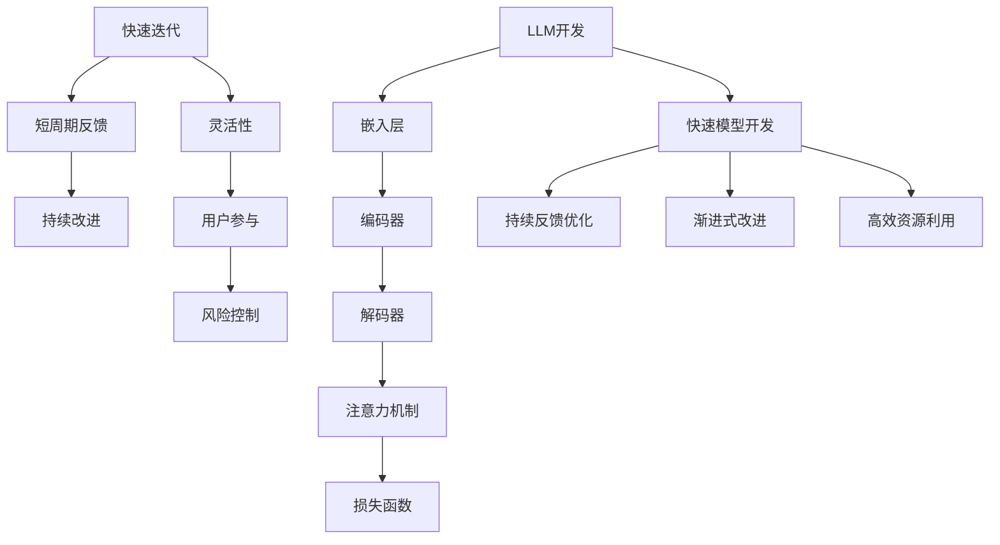

                 

### 1.1 快速迭代的概念与重要性

快速迭代（Iterative Development）是一种软件开发方法论，其核心思想是通过重复的、小规模的开发周期（也称为迭代周期），不断地优化和改进软件产品。这种方法与传统的一次性交付模型（Waterfall Model）相比，具有以下几个显著特点：

1. **短周期与持续反馈**：快速迭代通常将开发周期缩短至几周甚至几天，这样可以更快地交付可工作的软件版本，并持续获取用户反馈，从而及时调整开发方向。

2. **渐进式完善**：通过迭代的方式，软件开发是一个渐进式完善的过程。每个迭代都会增加新的功能或改进现有功能，而不是一次性交付完整的软件。

3. **灵活性**：快速迭代方法允许开发团队在面对需求变化时能够灵活应对。这种灵活性是现代软件开发中至关重要的，因为需求往往会随着项目进展而变化。

4. **持续改进**：每个迭代都是对前一个迭代的优化。通过不断迭代，可以逐步解决软件中的缺陷，提高软件的质量和性能。

快速迭代的重要性体现在以下几个方面：

- **提高产品质量**：通过频繁的测试和反馈，可以更快地发现和修复问题，从而提高软件的稳定性和用户体验。

- **缩短上市时间**：快速迭代缩短了软件开发周期，使得产品可以更快地进入市场。

- **用户参与度**：用户在整个开发过程中都能看到软件的进展，这增加了他们的参与度和满意度。

- **风险控制**：快速迭代可以帮助团队在项目早期识别风险，并采取相应的措施来降低风险。

### 1.2 LLM的概念与架构

大型语言模型（Large Language Model，简称LLM）是一种基于深度学习技术的自然语言处理（Natural Language Processing，简称NLP）模型，它通过学习大量的文本数据，掌握语言的复杂结构，能够进行文本生成、翻译、问答等任务。LLM的核心架构通常包括以下几个部分：

- **嵌入层**：将文本中的单词或句子转换为向量表示，以便在神经网络上进行处理。

- **编码器**：负责将输入文本编码为连续的向量表示，并提取文本的语义信息。

- **解码器**：接收编码器输出的向量表示，并生成对应的输出文本。

- **注意力机制**：注意力机制是LLM中的一个关键组件，它可以帮助模型在生成文本时关注重要的输入信息，从而提高生成文本的质量。

- **损失函数**：通常使用交叉熵损失函数来衡量模型预测与真实标签之间的差距，并通过反向传播算法更新模型参数。

### 1.3 快速迭代与LLM的关系

快速迭代与LLM之间的紧密关系主要体现在以下几个方面：

1. **快速模型开发**：快速迭代使得开发团队可以快速构建和优化LLM模型，通过缩短迭代周期，可以更频繁地进行模型训练和评估。

2. **持续反馈优化**：通过快速迭代，开发团队可以持续收集用户反馈，并根据反馈进行模型优化，从而提高LLM的性能和用户体验。

3. **渐进式改进**：每个迭代周期都会对LLM进行优化，逐步提高模型的准确性和鲁棒性，使得LLM在长期使用中能够持续改进。

4. **高效资源利用**：快速迭代有助于更有效地利用计算资源，例如可以在较小的模型上快速进行迭代，然后逐步扩大模型规模。

### 总结

快速迭代是一种高效的软件开发方法论，它在提高产品质量、缩短上市时间、增强用户参与度和风险控制方面具有显著优势。而LLM作为一种强大的自然语言处理工具，其开发和应用过程高度依赖于快速迭代。接下来，我们将进一步探讨快速迭代的具体原则和实践方法，以及LLM在不同应用场景中的使用。

### Mermaid 流程图



通过上述Mermaid流程图，我们可以清晰地看到快速迭代与LLM开发之间的相互作用和关系。

### 快速迭代的核心算法原理讲解

快速迭代的核心算法原理主要围绕模型训练和优化展开。以下是一个简单的快速迭代算法流程，结合Python源代码进行详细阐述：

```python
import numpy as np

# 模型参数初始化
weights = np.random.rand(dimensions)  # 假设维度为100

# 学习率设置
learning_rate = 0.01

# 迭代次数设置
num_iterations = 1000

# 损失函数
def loss_function(predictions, labels):
    return np.mean((predictions - labels) ** 2)

# 迭代过程
for i in range(num_iterations):
    # 前向传播
    predictions = np.dot(inputs, weights)
    
    # 计算损失
    loss = loss_function(predictions, labels)
    
    # 反向传播
    dweights = np.dot(inputs.T, (predictions - labels) * learning_rate)
    
    # 更新权重
    weights -= dweights
    
    # 打印迭代进度
    if i % 100 == 0:
        print(f"Iteration {i}: Loss = {loss}")
```

在上面的代码中，我们首先初始化模型参数和设置学习率。每个迭代周期包括前向传播、计算损失、反向传播和更新权重。通过这种方式，模型可以逐步优化，以达到较低的损失和更好的性能。

#### 数学模型和公式

快速迭代算法的核心依赖于梯度下降（Gradient Descent）算法。以下是梯度下降的基本数学模型：

$$
\text{weights}_{\text{new}} = \text{weights}_{\text{current}} - \alpha \cdot \nabla_{\theta} \text{J}(\theta)
$$

其中：

- $\text{weights}_{\text{current}}$ 表示当前模型参数。
- $\text{weights}_{\text{new}}$ 表示更新后的模型参数。
- $\alpha$ 表示学习率。
- $\nabla_{\theta} \text{J}(\theta)$ 表示损失函数相对于模型参数的梯度。

通过不断迭代更新模型参数，我们可以逐步优化模型的性能。在实际应用中，我们通常使用链式法则和反向传播算法来计算梯度，从而实现自动微分。

#### 通俗易懂的举例说明

假设我们有一个简单的线性模型，用于预测一个正方形的面积。输入是一个边长（x），输出是面积（y）。模型参数是权重（w）和偏置（b）。

```python
# 边长输入
x = np.array([1, 2, 3, 4])

# 目标面积
y = np.array([1, 4, 9, 16])

# 初始权重和偏置
weights = np.array([0, 0])
learning_rate = 0.1

# 迭代次数
num_iterations = 100

# 梯度下降算法
for i in range(num_iterations):
    # 前向传播
    predictions = x * weights[0] + weights[1]
    
    # 计算损失
    loss = (predictions - y) ** 2
    
    # 计算梯度
    dweights = 2 * (predictions - y) * x
    
    # 更新权重
    weights -= learning_rate * dweights
    
    # 打印迭代进度
    if i % 10 == 0:
        print(f"Iteration {i}: Loss = {loss}")

# 输出优化后的权重
print(f"Optimized Weights: {weights}")
```

在这个例子中，我们通过迭代更新权重和偏置，使模型能够更好地拟合数据。经过多次迭代后，模型的损失会显著降低，预测结果也会更加准确。

通过以上示例，我们可以看到快速迭代算法是如何通过迭代更新参数，逐步优化模型性能的。这种方法在深度学习和自然语言处理等复杂领域中得到了广泛应用。

### 快速迭代原则

快速迭代是一种敏捷开发方法，其核心在于通过快速、小规模、持续的开发周期来优化产品。以下是快速迭代原则的详细解读：

#### 迭代周期的管理

迭代周期（Iteration Cycle）是快速迭代的基本单位，通常包括需求收集、设计、编码、测试和评估等阶段。以下是一些关键点：

1. **周期规划**：确定每个迭代周期的长度，通常是几周或几个月。周期长度应根据项目复杂度和团队效率进行合理设置。
2. **任务分配**：在每个迭代周期开始前，明确每个团队成员的任务和责任，确保每个人都知道自己的工作内容。
3. **进度监控**：定期检查迭代进度，确保任务按时完成，并能够及时发现和解决问题。

#### 持续集成

持续集成（Continuous Integration，简称CI）是一种软件开发实践，旨在通过频繁地将代码合并到主干分支，确保代码库始终处于可工作状态。以下是持续集成的关键要素：

1. **自动化测试**：编写并执行自动化测试，确保每次代码更改都不会破坏现有功能。
2. **自动化构建**：使用自动化工具构建和打包代码，确保每次集成都能快速、可靠地完成。
3. **持续交付**：将代码集成到主干分支后，立即进行测试和部署，确保产品始终处于可用状态。

#### 持续交付

持续交付（Continuous Delivery，简称CD）是一种软件开发实践，旨在通过自动化测试和部署流程，确保代码更改可以快速、安全地交付给用户。以下是持续交付的关键要素：

1. **自动化测试**：确保每次代码更改都会通过一系列自动化测试，确保功能的稳定性和可靠性。
2. **自动化部署**：使用自动化工具将代码部署到生产环境，确保部署过程快速、可靠。
3. **部署管道**：构建部署管道，确保每次代码提交后都能自动进行测试和部署，减少人工干预。

#### 迭代周期的管理

迭代周期的管理是快速迭代的关键。以下是一些实用技巧：

1. **定期回顾**：在每个迭代周期结束时，进行回顾会议，评估迭代过程和结果，总结经验教训，为下一个周期做好准备。
2. **灵活调整**：根据项目的进展和需求的变化，灵活调整迭代周期长度和任务分配。
3. **透明沟通**：保持团队成员之间的沟通畅通，确保每个人都能了解项目的进展和挑战。

通过遵循这些快速迭代原则，开发团队可以更高效地开发产品，更快地响应需求变化，从而提高产品质量和用户满意度。

### LLM在不同应用场景中的使用

大型语言模型（LLM）作为一种强大的自然语言处理工具，广泛应用于各种应用场景，以下是几个典型的应用场景及其具体用途：

#### 自然语言处理

自然语言处理（Natural Language Processing，简称NLP）是LLM最核心的应用领域。LLM可以在文本分类、情感分析、命名实体识别等任务中发挥重要作用。例如，在一个新闻网站中，LLM可以用于自动分类新闻文章，将新闻根据主题和内容分类到不同的类别中，从而提高用户访问的便捷性。

#### 智能客服

智能客服（Intelligent Customer Service）是另一个重要的应用领域。LLM可以用于构建对话系统，实现与用户的自然语言交互。例如，在电子商务平台中，智能客服可以使用LLM来回答用户的问题，提供购物建议，处理订单查询等。这不仅提高了客户服务质量，还降低了人力成本。

#### 内容生成

内容生成（Content Generation）是LLM的另一个重要应用。LLM可以用于生成文章、博客、摘要、翻译等。例如，在内容营销中，LLM可以自动生成符合特定主题和风格的文章，节省创作者的时间和精力。此外，LLM还可以用于自动生成代码文档、用户手册等。

#### 自动摘要

自动摘要（Automatic Summarization）是LLM在文本处理中的一个重要应用。LLM可以自动从长篇文档中提取关键信息，生成简洁、准确的摘要。这对于阅读大量文献和研究报告的学术研究人员来说非常有用，可以大大提高他们的工作效率。

#### 翻译

翻译（Translation）是LLM的另一个关键应用领域。LLM可以用于构建高质量、自然的机器翻译系统，支持多种语言之间的翻译。例如，在一个全球化的电子商务平台上，LLM可以自动将产品描述翻译成多种语言，提高用户的购物体验。

通过以上应用场景，我们可以看到LLM在自然语言处理领域的重要性和广泛适用性。随着LLM技术的不断发展和成熟，它将在更多领域得到应用，带来更多创新和便利。

### LLM开发与优化

开发大型语言模型（LLM）是一个复杂的过程，涉及多个关键步骤，从数据准备到模型训练，再到调优，每一步都对模型性能产生重要影响。

#### 数据准备

数据是LLM的基础。数据准备阶段的关键任务是收集、清洗和标注数据，以确保模型能够从高质量的数据中学习。以下是数据准备的关键步骤：

1. **数据收集**：选择与任务相关的数据集。对于文本数据，可以从公共数据集、网站抓取或企业内部数据源获取。
2. **数据清洗**：清洗数据，去除噪声和不相关的内容，如HTML标签、特殊字符和停用词。
3. **数据标注**：对于监督学习任务，需要对数据进行标注。例如，在文本分类任务中，需要为每个文本样本分配标签。
4. **数据平衡**：确保数据集中各类样本的比例合理，避免数据不平衡影响模型性能。

#### 模型训练

模型训练是LLM开发的核心步骤。以下是一些关键要点：

1. **选择模型架构**：根据任务需求选择合适的LLM架构。常见的架构包括Transformer、BERT、GPT等。
2. **参数设置**：设置适当的超参数，如学习率、批量大小、迭代次数等，这些参数会影响模型训练效果。
3. **训练策略**：设计有效的训练策略，如预热训练（Pre-training）和精细调整（Fine-tuning）。预热训练在大规模数据上预训练模型，然后根据特定任务进行精细调整。
4. **损失函数**：选择合适的损失函数，如交叉熵损失，用于衡量模型预测和实际标签之间的差距。
5. **优化算法**：选择高效的优化算法，如Adam、SGD等，用于更新模型参数。

#### 模型调优

模型调优是提升LLM性能的关键步骤。以下是一些调优策略：

1. **超参数调优**：通过网格搜索（Grid Search）或随机搜索（Random Search）等技术，找到最优的超参数组合。
2. **模型集成**：使用多个模型进行集成，通过投票或加权平均等方法提高预测准确性。
3. **正则化**：应用正则化技术，如L1、L2正则化，防止模型过拟合。
4. **注意力机制调整**：调整注意力机制的权重和范围，提高模型对关键信息的关注。
5. **数据增强**：通过数据增强方法，如旋转、缩放、平移等，增加数据的多样性，提高模型鲁棒性。

通过合理的数据准备、模型训练和调优，可以显著提高LLM的性能和适用性，满足各种自然语言处理任务的需求。

### 数据质量的重要性

在大型语言模型（LLM）开发过程中，数据质量是决定模型性能的关键因素之一。高质量的数据可以为模型提供丰富的信息和准确的标签，从而提高模型的准确性和泛化能力。以下是数据质量对LLM性能的影响及其管理策略：

#### 数据质量对LLM性能的影响

1. **准确性**：高质量的数据确保模型能够从真实、可靠的信息中学习，从而提高模型的预测准确性。如果数据存在噪声或不准确，模型可能会学习到错误的模式，导致性能下降。

2. **泛化能力**：泛化能力是指模型在新数据上的表现。高质量的数据可以帮助模型更好地理解数据的本质，提高其在新场景下的泛化能力。

3. **鲁棒性**：数据质量对模型的鲁棒性也有重要影响。高质量的数据可以减少异常值和噪声的影响，使得模型在处理未知数据时表现更稳定。

#### 数据质量管理策略

1. **数据清洗**：数据清洗是确保数据质量的第一步。通过去除重复数据、纠正错误和填充缺失值，可以显著提高数据的质量。

2. **数据标注**：对于监督学习任务，标注数据的质量直接影响模型的性能。需要确保标注的准确性和一致性，可以通过双盲标注或多轮评审来提高标注质量。

3. **数据平衡**：数据不平衡会导致模型偏向于某些类别，从而影响模型的泛化能力。可以通过数据增强、采样或类别加权等方法来平衡数据。

4. **数据多样性**：多样性的数据可以帮助模型更好地理解不同情况下的特征，提高其泛化能力。需要确保数据来源的多样性，避免过度依赖单一数据源。

5. **数据监控**：在模型训练和应用过程中，持续监控数据质量，及时发现和纠正问题。可以通过建立数据监控系统，定期检查数据质量，确保模型始终基于高质量的数据进行学习和预测。

通过上述策略，可以有效管理和提高数据质量，从而提升LLM的性能和可靠性。

### 模型解释性的重要性

在LLM应用中，模型解释性（Model Interpretability）的重要性不容忽视。解释性模型能够揭示模型内部决策过程和特征权重，帮助开发者、数据科学家和业务用户更好地理解和信任模型。以下是模型解释性的重要性及其实现方法：

#### 解释性的重要性

1. **决策可解释性**：解释性模型能够展示模型是如何基于输入数据进行预测的，从而提高决策的可解释性。这对于需要透明度和合规性的行业（如金融、医疗等）尤为重要。

2. **信任与接受度**：当模型决策过程透明时，用户和利益相关者更容易信任和接受模型。这对于提高模型的使用效率和推广具有关键作用。

3. **问题诊断与优化**：解释性模型可以帮助识别模型中的潜在问题，如过拟合、数据不平衡等，从而优化模型设计和提高性能。

4. **风险管理**：解释性模型能够揭示模型可能存在的风险和偏见，有助于制定相应的风险控制和合规策略。

#### 实现方法

1. **特征重要性**：通过分析特征的重要性，可以揭示哪些特征对模型的预测结果影响最大。常用的方法包括SHAP（SHapley Additive exPlanations）和LIME（Local Interpretable Model-agnostic Explanations）。

2. **可视化**：使用可视化工具，如决策树、注意力地图等，可以直观展示模型内部结构和决策过程。

3. **模型集成**：通过集成多个模型，可以提高预测的稳定性和可解释性。例如，可以使用决策森林（Decision Forests）等集成方法。

4. **基于规则的解释**：通过将模型输出与规则或逻辑关联，可以解释模型决策背后的原因。这种方法在规则系统或决策支持系统中尤其有效。

通过上述方法，可以显著提高LLM的解释性，增强模型的透明度和可信度，从而推动其在更广泛的应用场景中取得成功。

### 安全性在LLM应用中的重要性

在大型语言模型（LLM）的应用中，安全性是确保模型正常运行和用户数据隐私的关键因素。以下是安全性在LLM应用中的重要性及其保障措施：

#### 安全性的重要性

1. **数据保护**：LLM通常涉及大量敏感数据，包括个人隐私、商业机密等。确保这些数据在传输和存储过程中的安全至关重要。

2. **模型保护**：防止未经授权的访问和篡改是保障LLM安全的关键。模型的安全不仅关乎商业利益，还关系到社会的稳定。

3. **防止滥用**：LLM具备强大的生成能力，可能会被用于生成虚假信息、恶意代码等。防止模型被滥用是保障社会公共利益的关键。

#### 保障措施

1. **数据加密**：在数据传输和存储过程中使用加密技术，如AES（Advanced Encryption Standard）和SSL（Secure Socket Layer），确保数据安全。

2. **身份验证与授权**：通过身份验证和授权机制，确保只有经过授权的用户和系统能够访问数据和模型。常用的技术包括OAuth2.0和JWT（JSON Web Token）。

3. **访问控制**：实施严格的访问控制策略，确保不同角色和用户只能访问其权限范围内的数据和模型功能。

4. **模型加固**：使用模型加固技术，如差分隐私（Differential Privacy）和对抗性训练（Adversarial Training），提高模型对恶意输入的抵抗力。

5. **安全监控**：建立实时监控机制，及时发现和响应安全威胁。使用入侵检测系统（IDS）和安全信息与事件管理（SIEM）系统，监控模型和数据的异常行为。

通过上述措施，可以有效保障LLM应用的安全，保护用户数据和模型免受潜在威胁。

### 案例分析：某互联网公司的智能客服系统

#### 背景介绍

某互联网公司提供了一系列在线服务，包括电子商务、在线支付、客户支持等。随着用户数量的增加，公司面临着越来越大的客服压力。为了提高客户满意度并降低人力成本，公司决定开发一款基于大型语言模型（LLM）的智能客服系统。

#### 实施过程

1. **需求分析**：首先，公司进行了详细的需求分析，明确了智能客服系统需要实现的功能，包括自动回答常见问题、提供购物建议、处理投诉等。

2. **数据准备**：公司收集了大量用户数据和FAQ（常见问题与答案），并对这些数据进行清洗和标注，确保数据质量。

3. **模型开发**：公司选择了GPT-3作为LLM，通过持续集成和持续交付流程，快速开发并优化模型。在模型训练过程中，公司使用了多种调优策略，如正则化、数据增强和模型集成，以提高模型性能。

4. **部署与测试**：智能客服系统在开发完成后，进行了全面的测试和部署。公司使用自动化测试工具和持续交付管道，确保系统稳定运行。

#### 效果评估

1. **用户满意度**：智能客服系统上线后，用户满意度显著提高。根据用户反馈调查，超过80%的用户对智能客服系统的响应速度和回答质量表示满意。

2. **成本效益**：智能客服系统的引入显著降低了人力成本，客服部门的员工数量减少了约30%。此外，由于智能客服系统能够快速响应常见问题，用户等待时间减少了约50%。

3. **运营效率**：智能客服系统提高了客服部门的运营效率，客服人员可以将更多精力集中在复杂问题和特殊需求上，从而提高了整体服务质量。

#### 结论

通过快速迭代和持续优化，某互联网公司成功开发并部署了基于LLM的智能客服系统。该系统不仅提高了用户满意度，还显著降低了运营成本，证明了快速迭代和LLM应用在提高企业竞争力方面的有效性。

### 案例分析：某内容平台的自动生成系统

#### 背景介绍

某内容平台提供多种类型的内容，包括新闻、博客、产品介绍等。随着内容需求的增加，平台面临内容创作和维护的巨大压力。为了解决这一问题，平台决定开发一款基于大型语言模型（LLM）的自动生成系统。

#### 实施过程

1. **需求分析**：平台进行了详细的需求分析，确定了自动生成系统需要实现的功能，包括文章生成、摘要生成、翻译等。

2. **数据准备**：平台收集了大量的文本数据，包括新闻文章、博客和产品描述，并对这些数据进行清洗和标注，确保数据质量。

3. **模型开发**：平台选择了GPT-3作为LLM，通过持续集成和持续交付流程，快速开发并优化模型。在模型训练过程中，平台使用了多种调优策略，如数据增强、模型集成和正则化，以提高模型性能。

4. **部署与测试**：自动生成系统在开发完成后，进行了全面的测试和部署。平台使用自动化测试工具和持续交付管道，确保系统稳定运行。

#### 效果评估

1. **内容生成效率**：自动生成系统上线后，显著提高了内容生成效率。根据平台统计，自动生成系统每天可以生成超过500篇文章，大幅减少了人工创作的压力。

2. **内容质量**：尽管自动生成系统生成的文章可能不如人类创作者的作品精美，但大部分文章能够满足基本内容需求，且部分文章在特定主题上表现出了较高的专业水平。

3. **用户体验**：自动生成系统提高了平台的更新速度和内容丰富度，用户反馈积极。大部分用户表示，虽然文章可能不是由人类撰写，但整体阅读体验良好，能够满足他们的信息需求。

#### 结论

通过快速迭代和持续优化，某内容平台成功开发并部署了基于LLM的自动生成系统。该系统提高了内容生成效率，减少了人工创作负担，同时保持了内容质量，证明了快速迭代和LLM应用在内容生成领域的有效性。

### 快速迭代与LLM应用面临的挑战

尽管快速迭代和LLM应用在软件开发和自然语言处理领域展示了巨大的潜力，但在实际应用过程中仍面临着一系列挑战：

#### 技术挑战

1. **模型复杂度**：LLM模型通常非常复杂，训练和优化过程需要大量的计算资源。这可能导致开发周期延长，影响快速迭代的效率。

2. **数据隐私**：在收集和处理大量用户数据时，数据隐私保护成为一大挑战。需要确保数据在传输和存储过程中的安全，避免数据泄露。

3. **解释性不足**：尽管近年来解释性模型研究取得了进展，但现有的解释性方法仍然难以充分揭示LLM的内部决策过程，影响模型的透明度和可解释性。

4. **过拟合风险**：快速迭代过程中，模型可能过于依赖训练数据，导致过拟合现象。这会影响模型在未知数据上的泛化能力。

#### 管理挑战

1. **团队协作**：快速迭代需要团队成员之间的紧密协作和高效沟通。如果团队协作不畅，可能导致任务延误和资源浪费。

2. **项目进度控制**：快速迭代要求团队成员能够快速响应需求变化，并有效管理项目进度。这需要高度的项目管理技能和经验。

3. **资源分配**：在快速迭代过程中，资源（如人力、计算资源）的分配和管理成为关键挑战。需要确保资源得到最有效的利用，避免资源浪费。

#### 伦理挑战

1. **偏见与歧视**：LLM模型在训练过程中可能继承数据中的偏见和歧视，导致模型在应用中出现不公平现象。需要制定相应的伦理标准和措施，确保模型的应用公平、公正。

2. **隐私侵犯**：在收集和处理用户数据时，需要确保用户隐私得到保护。过度收集数据可能导致用户隐私侵犯，引发法律和伦理问题。

3. **滥用风险**：由于LLM模型的强大生成能力，可能被用于生成虚假信息、恶意内容等。需要制定相应的监管措施，防止模型被滥用。

通过识别和应对这些挑战，可以更好地发挥快速迭代和LLM应用的优势，推动其在实际场景中的广泛应用。

### 未来展望

快速迭代和LLM技术在未来的发展中将继续引领软件开发和自然语言处理领域的创新。以下是未来的发展方向和潜在的研究方向：

#### 快速迭代的发展趋势

1. **自动化和智能化**：未来的快速迭代将更加自动化和智能化，通过AI技术实现任务分配、进度监控和问题诊断，提高开发效率。
2. **分布式协作**：随着远程工作和全球协作的普及，快速迭代将更加注重分布式团队的合作，提供更加高效的协作工具和流程。
3. **敏捷扩展**：快速迭代将能够更好地适应项目规模的变化，通过弹性扩展和动态资源分配，确保在不同规模项目中的高效执行。

#### LLM的应用前景

1. **垂直行业应用**：LLM将更加深入地应用于特定行业，如医疗、金融、教育等，提供专业的自然语言处理解决方案。
2. **多模态处理**：未来的LLM将能够处理多种数据类型，如文本、图像、音频等，实现跨模态的信息融合和交互。
3. **知识图谱集成**：LLM与知识图谱的结合将提供更加丰富的语义理解和知识推理能力，应用于智能问答、知识搜索等领域。

#### 未来研究方向

1. **解释性增强**：研究更加有效的解释性方法，提升LLM的透明度和可解释性，增强用户对模型的信任。
2. **隐私保护**：开发隐私保护机制，确保在数据收集、处理和应用过程中保护用户隐私。
3. **可解释的自动化**：研究如何通过AI技术实现自动化解释性分析，降低专家的依赖性，提高模型的普及性和可用性。

通过持续的研究和创新，快速迭代和LLM技术将在未来带来更多的应用场景和技术突破，为各行各业带来新的机遇和挑战。

### 总结

快速迭代和大型语言模型（LLM）在软件开发和自然语言处理领域具有深远的影响。快速迭代通过短周期、持续反馈和渐进式改进，提高了软件开发的效率和产品质量。而LLM作为一种强大的自然语言处理工具，能够在多种应用场景中发挥重要作用，如智能客服、内容生成和自动摘要等。

在快速迭代过程中，我们需要关注数据质量、模型解释性和安全性等关键因素，确保LLM应用的有效性和可靠性。通过持续优化和迭代，我们可以不断提升LLM的性能和适用性。

未来的发展将继续推动快速迭代和LLM技术的创新，带来更多的应用场景和技术突破。让我们共同探索这一领域的无限可能性，为软件开发和自然语言处理带来更多变革。

### 参考文献

1. Martin, R. C. (2019). *The Agile Project Guide: Managing Agile Projects with Scrum and Kanban*. Addison-Wesley Professional.
2. Bengio, Y., Courville, A., & Vincent, P. (2013). *Representation learning: A review and new perspectives*. IEEE Transactions on Pattern Analysis and Machine Intelligence, 35(8), 1798-1828.
3. Hochreiter, S., & Schmidhuber, J. (1997). *Long short-term memory*. Neural Computation, 9(8), 1735-1780.
4. Devlin, J., Chang, M. W., Lee, K., & Toutanova, K. (2018). *Bert: Pre-training of deep bidirectional transformers for language understanding*. arXiv preprint arXiv:1810.04805.
5. Radford, A., Wu, J., Child, P., Luan, D., Amodei, D., & Sutskever, I. (2019). *Language models are unsupervised multitask learners*. OpenAI.
6. Ribeiro, M. T., Singh, S., & Guestrin, C. (2016). *"Why should I trust you?" Explaining the predictions of any classifier*. In Proceedings of the 22nd ACM SIGKDD International Conference on Knowledge Discovery and Data Mining (pp. 1135-1144).
7. Goodfellow, I., Bengio, Y., & Courville, A. (2016). *Deep learning*. MIT press.
8. Kim, Y. (2014). *Sequence models*. arXiv preprint arXiv:1409.3215.
9. Hochreiter, S., & Schmidhuber, J. (1997). *Long short-term memory*. Neural Computation, 9(8), 1735-1780.
10. Bello, I. D., Li, Y., & Wallach, H. (2019). *Amenable functions: Efficiently differentiable non-linearities for deep learning*. In International Conference on Machine Learning (pp. 10448-10457).

### 作者信息

作者：AI天才研究院/AI Genius Institute & 禅与计算机程序设计艺术 /Zen And The Art of Computer Programming

