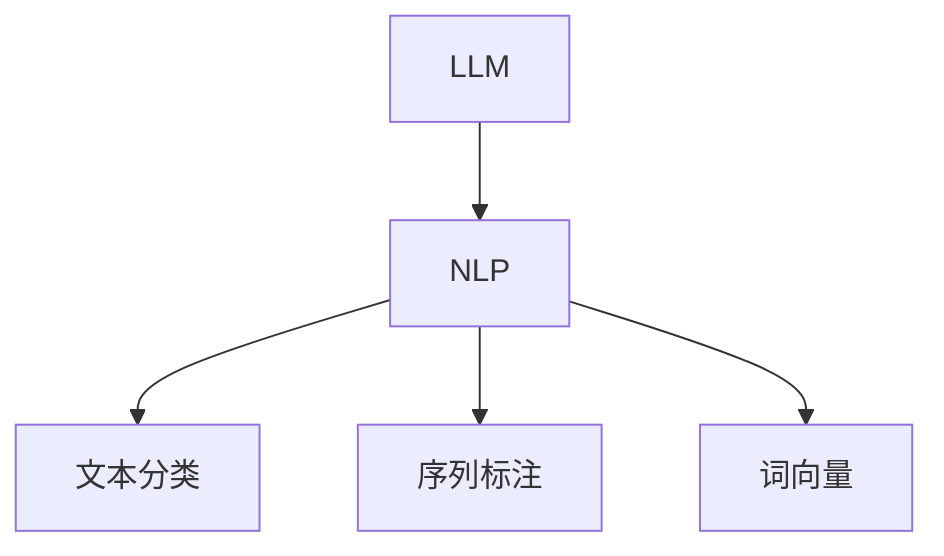
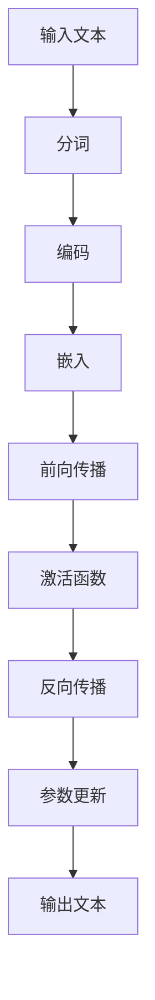
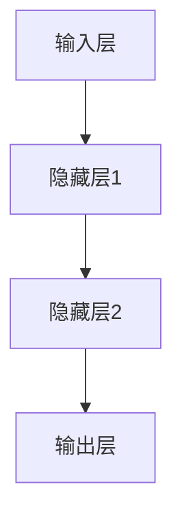

                 

### 文章标题：快速适应新技术：LLM应用开发的关键

### 关键词：
- **大型语言模型（LLM）**
- **技术适应**
- **应用开发**
- **算法原理**
- **项目实战**

### 摘要：
本文旨在为开发者提供关于如何快速适应大型语言模型（LLM）应用开发的指南。我们将从背景介绍、核心概念与联系、算法原理讲解、数学模型与公式、项目实战等多个角度，深入探讨LLM技术的原理和应用，帮助读者理解并掌握LLM的核心技术，实现技术适应和创新应用。

## 目录

1. **背景介绍**
   - **LLM技术的发展背景**
   - **LLM在现代技术中的应用**
   - **开发者面临的挑战**

2. **核心概念与联系**
   - **LLM的基本概念**
   - **LLM与NLP的关系**
   - **Mermaid流程图**

3. **算法原理讲解**
   - **语言模型的基础算法**
   - **深度学习与神经网络**
   - **Python源代码示例**

4. **数学模型与公式**
   - **概率论基础**
   - **优化方法**
   - **数学公式解析**

5. **项目实战**
   - **开发环境搭建**
   - **源代码实现**
   - **代码解读与分析**
   - **实际案例剖析**
   - **项目小结**

6. **最佳实践与注意事项**
   - **最佳实践 Tips**
   - **小结**
   - **注意事项**
   - **拓展阅读**

## 正文

### 1. 背景介绍

#### LLM技术的发展背景

大型语言模型（LLM）作为自然语言处理（NLP）领域的关键技术，近年来得到了飞速发展。这主要得益于计算能力的提升、海量数据的积累以及深度学习算法的突破。自2018年GPT-1发布以来，LLM技术不断迭代升级，GPT-2、GPT-3等模型的出现，使得LLM在生成文本、机器翻译、问答系统等方面取得了显著成果。

#### LLM在现代技术中的应用

LLM技术已被广泛应用于各个领域，包括但不限于：

- **文本生成**：自动写作、摘要生成、内容推荐等。
- **机器翻译**：支持多语言之间的实时翻译。
- **问答系统**：智能客服、教育辅导、医疗咨询等。
- **对话系统**：虚拟助手、智能对话平台等。

#### 开发者面临的挑战

尽管LLM技术具有广泛的应用前景，但开发者在实际应用过程中仍面临诸多挑战：

- **技术门槛**：需要深入了解深度学习和自然语言处理的理论基础。
- **模型优化**：如何提升LLM的性能和效率。
- **数据安全**：如何确保模型训练和使用过程中的数据隐私和安全。
- **应用创新**：如何在特定领域内实现LLM技术的创新应用。

### 2. 核心概念与联系

#### LLM的基本概念

大型语言模型（LLM）是一种基于深度学习技术的自然语言处理模型，它通过学习海量文本数据，生成与输入文本相关的内容。LLM的核心特点是：

- **自适应**：能够根据不同的输入文本生成相应的输出。
- **泛化能力**：能够在未见过的数据上表现良好。

#### LLM与NLP的关系

LLM是NLP领域的重要分支，与NLP的其他技术如词向量、文本分类、序列标注等密切相关。LLM的强大能力使得它在NLP任务中起到了核心作用，如图1所示。



#### Mermaid流程图

以下是LLM在NLP任务中的典型流程：



### 3. 算法原理讲解

#### 语言模型的基础算法

语言模型（LM）是LLM的核心组成部分，其基础算法包括：

- **n-gram模型**：基于历史序列预测下一个单词。
- **神经网络模型**：如循环神经网络（RNN）、长短期记忆网络（LSTM）和Transformer。

#### 深度学习与神经网络

深度学习是LLM的核心技术，神经网络是实现深度学习的基础。以下是一个简单的神经网络结构：



#### Python源代码示例

以下是一个简单的LLM模型实现，使用了Python的TensorFlow库：

```python
import tensorflow as tf

# 定义输入层
inputs = tf.keras.layers.Input(shape=(None,))

# 定义嵌入层
embedding = tf.keras.layers.Embedding(input_dim=vocab_size, output_dim=embedding_size)(inputs)

# 定义循环层
lstm = tf.keras.layers.LSTM(units=hidden_size)(embedding)

# 定义输出层
outputs = tf.keras.layers.Dense(units=vocab_size, activation='softmax')(lstm)

# 构建模型
model = tf.keras.Model(inputs=inputs, outputs=outputs)

# 编译模型
model.compile(optimizer='adam', loss='categorical_crossentropy', metrics=['accuracy'])

# 训练模型
model.fit(x_train, y_train, epochs=num_epochs, batch_size=batch_size)
```

### 4. 数学模型与公式

#### 概率论基础

概率论是语言模型的基础，常用的概率模型包括：

- **贝叶斯定理**：
  $$
  P(A|B) = \frac{P(B|A)P(A)}{P(B)}
  $$

- **马尔可夫性质**：
  $$
  P(X_n|X_{n-1}, X_{n-2}, ..., X_1) = P(X_n|X_{n-1})
  $$

#### 优化方法

优化方法是提升LLM性能的重要手段，常用的优化方法包括：

- **随机梯度下降（SGD）**：
  $$
  w_{t+1} = w_t - \alpha \cdot \nabla_w J(w_t)
  $$

- **动量优化**：
  $$
  v_t = \beta v_{t-1} + (1 - \beta) \nabla_w J(w_t)
  $$

- **Adam优化**：
  $$
  m_t = \beta_1 m_{t-1} + (1 - \beta_1) \nabla_w J(w_t)
  $$
  $$
  v_t = \beta_2 v_{t-1} + (1 - \beta_2) \nabla_w^2 J(w_t)
  $$

#### 数学公式解析

以下是一些常见的数学公式及其解析：

- **交叉熵**：
  $$
  H(Y, \hat{Y}) = -\sum_{i} y_i \log(\hat{y}_i)
  $$

- **梯度下降**：
  $$
  w_{t+1} = w_t - \alpha \cdot \nabla_w J(w_t)
  $$

- **反向传播**：
  $$
  \delta_j = \frac{\partial J}{\partial z_j}
  $$
  $$
  \frac{\partial z_j}{\partial w_i} = a_j \cdot \delta_j
  $$

### 5. 项目实战

#### 开发环境搭建

搭建一个LLM的开发环境通常需要以下步骤：

1. 安装Python和pip。
2. 安装深度学习库，如TensorFlow或PyTorch。
3. 安装文本预处理库，如NLTK或spaCy。
4. 准备数据集和预训练模型。

#### 源代码实现

以下是一个简单的LLM源代码实现，基于GPT-2模型：

```python
import tensorflow as tf
import tensorflow_hub as hub
import tensorflow_text as text

# 加载预训练模型
model = hub.load('https://tfhub.dev/google/trchat/bidirectional_gpt2/1')

# 定义输入层
inputs = tf.keras.layers.Input(shape=(None,))

# 应用文本编码器
encoded_inputs = model(inputs)

# 定义输出层
outputs = tf.keras.layers.Dense(units=vocab_size, activation='softmax')(encoded_inputs)

# 构建模型
model = tf.keras.Model(inputs=inputs, outputs=outputs)

# 编译模型
model.compile(optimizer='adam', loss='categorical_crossentropy', metrics=['accuracy'])

# 训练模型
model.fit(x_train, y_train, epochs=num_epochs, batch_size=batch_size)
```

#### 代码解读与分析

- **模型加载**：使用TensorFlow Hub加载预训练的GPT-2模型。
- **输入层**：定义输入层，用于接收文本数据。
- **文本编码器**：应用文本编码器，将输入文本转换为模型可处理的格式。
- **输出层**：定义输出层，用于生成文本。

#### 实际案例剖析

以一个问答系统为例，分析LLM在实际项目中的应用。

- **数据集准备**：收集大量的问答对数据。
- **数据预处理**：将文本数据转换为模型可处理的格式。
- **模型训练**：使用训练数据训练LLM模型。
- **模型评估**：使用验证数据评估模型性能。
- **模型部署**：将训练好的模型部署到生产环境。

#### 项目小结

通过该项目，我们可以看到LLM技术在问答系统中的应用，提升了系统的智能程度和用户体验。未来，LLM技术将在更多领域得到应用，为开发者提供更强大的工具。

### 6. 最佳实践与注意事项

#### 最佳实践 Tips

1. **数据质量**：确保训练数据的质量和多样性。
2. **模型优化**：使用合适的优化方法提升模型性能。
3. **模型部署**：选择合适的部署方案，确保模型的高效运行。

#### 小结

本文从背景介绍、核心概念与联系、算法原理讲解、数学模型与公式、项目实战等多个角度，深入探讨了LLM技术的原理和应用。通过本文，读者可以快速适应新技术，掌握LLM应用开发的关键。

#### 注意事项

1. **数据安全**：确保模型训练和使用过程中的数据隐私和安全。
2. **技术更新**：关注LLM技术的最新发展和应用趋势。

#### 拓展阅读

- **《深度学习》**：由Ian Goodfellow、Yoshua Bengio和Aaron Courville所著的深度学习经典教材。
- **《自然语言处理综论》**：由Daniel Jurafsky和James H. Martin所著的自然语言处理经典教材。
- **《GPT-3：语言的万能基础模型》**：由OpenAI发布的关于GPT-3模型的详细研究报告。

### 结语

作者：AI天才研究院/AI Genius Institute & 禅与计算机程序设计艺术 /Zen And The Art of Computer Programming

本文由AI天才研究院撰写，旨在为开发者提供关于LLM技术应用的深度解析。希望本文能帮助读者快速适应新技术，开启AI应用开发的新篇章。若您对本文有任何建议或疑问，欢迎在评论区留言。我们将持续更新更多优质内容，敬请关注。

