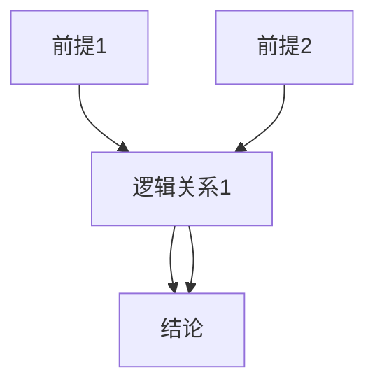

                 

# 思维链在哲学研究中的应用：AI辅助思想实验

## 关键词
AI辅助哲学研究，思维链，思想实验，逻辑哲学，伦理哲学，政治哲学

## 摘要
本文旨在探讨思维链在哲学研究中的应用，以及如何利用人工智能（AI）辅助进行思想实验。首先，我们介绍了思维链的基本概念及其在哲学研究中的重要性。接着，我们详细阐述了AI在思想实验中的角色，并探讨了如何通过AI来设计和实施思想实验。随后，我们通过具体案例展示了思维链和AI在逻辑哲学、伦理哲学和政治哲学中的应用。最后，我们对AI辅助思想实验的未来发展进行了展望，并提供了相关最佳实践和注意事项。

## 引言

哲学作为一门探究存在、真理、价值和知识的学科，一直以来都是人类思考的源泉。然而，哲学问题往往复杂且难以捉摸，传统的哲学研究方法难以充分揭示其本质。随着人工智能（AI）技术的迅速发展，人们开始探索如何将AI应用于哲学研究，以提供新的视角和方法。其中，思维链和思想实验成为AI在哲学研究中应用的重要工具。

思维链是一种逻辑结构，通过将一系列相关的思想、观点和论证连接起来，形成一种系统性的思考方式。在哲学研究中，思维链可以帮助研究者分析复杂问题，发现潜在的逻辑关系，并构建有力的论证。而思想实验则是一种通过模拟和思考假设情景来探讨哲学问题的方法。AI辅助思想实验可以通过模拟不同的情景和假设，快速分析大量数据，从而为哲学研究提供有力的支持。

本文将首先介绍思维链的基本概念和原理，然后探讨AI在思想实验中的应用，最后通过具体案例展示思维链和AI在哲学研究中的实际应用。

### 思维链的基本概念与原理

思维链是一种逻辑结构，用于组织和连接一系列相关的思想、观点和论证。它起源于逻辑学和认知科学领域，近年来在哲学研究中得到了广泛应用。思维链的核心在于通过明确的逻辑关系将不同部分连接起来，形成一个连贯的整体，从而帮助研究者更好地理解复杂问题。

#### 定义与结构

思维链的基本结构包括三个主要部分：前提（premises）、结论（conclusions）和逻辑关系（logical relations）。前提是思维链的基础，是支持结论的陈述或假设。结论是思维链的终点，是基于前提所推导出的结论。逻辑关系则是将前提和结论连接起来的桥梁，用于表明前提如何推导出结论。

一个典型的思维链可以表示为以下形式：

$$
\text{前提1} \land \text{前提2} \rightarrow \text{结论}
$$

其中，$\land$ 表示逻辑与（AND）运算，$\rightarrow$ 表示逻辑推导（implies）运算。

#### 功能与应用

思维链在哲学研究中有多种功能和应用。首先，它可以帮助研究者分析复杂问题，将问题分解成更小的部分，并通过逻辑关系将它们重新组合。这种分析方法有助于揭示问题中的潜在逻辑关系，从而更深入地理解问题。

其次，思维链可以帮助研究者构建论证。通过将前提和结论连接起来，研究者可以构建出清晰的论证结构，从而更有说服力地表达观点。此外，思维链还可以用于反驳论证。通过分析论证中的逻辑关系，研究者可以找出论证中的漏洞和错误，从而对其进行反驳。

在哲学研究中，思维链的应用非常广泛。例如，在逻辑哲学中，思维链可以帮助研究者分析逻辑问题，如推理、论证和逻辑谬误。在伦理哲学中，思维链可以帮助研究者探讨道德问题，如道德责任、道德义务和道德判断。在政治哲学中，思维链可以帮助研究者分析政治问题，如民主、自由和权力。

#### Mermaid流程图表示

为了更好地理解思维链的结构和功能，我们可以使用Mermaid流程图进行表示。以下是一个简单的思维链流程图示例：

在这个示例中，A和D是前提，C是结论，B是逻辑关系。通过这种图形化的表示，我们可以更直观地理解思维链的结构和功能。

#### 思维链与哲学研究

思维链在哲学研究中具有重要作用。首先，它可以帮助研究者构建系统化的思考方式，将复杂的哲学问题分解成更小、更易于管理的部分。这种分解和组合的方式有助于研究者更好地理解哲学问题的本质。

其次，思维链可以帮助研究者分析和解决哲学问题。通过分析前提和结论之间的逻辑关系，研究者可以识别出问题中的关键点和潜在矛盾，从而提出更准确的观点和论证。

此外，思维链还可以用于批判性思维。通过分析论证中的逻辑关系，研究者可以找出论证中的漏洞和错误，从而对其进行反驳。这种批判性思维的能力对于哲学研究至关重要。

总之，思维链作为一种逻辑结构，在哲学研究中具有广泛应用和重要价值。它不仅可以帮助研究者更好地理解和解决哲学问题，还可以提高批判性思维和论证能力。

### AI与思想实验的基本概念

人工智能（AI）作为一种能够模拟人类智能的技术，已经广泛应用于各个领域，包括哲学研究。思想实验是哲学研究中的一种重要方法，通过构建假设情景和模拟，探讨哲学问题。AI与思想实验的结合，为哲学研究提供了新的工具和方法。

#### 定义与原理

思想实验是指通过构建假设情景，对某个哲学问题进行深入探讨和思考。它通常包括设定一个情境，然后分析这个情境下可能发生的情况和结果，从而推导出结论。例如，著名的思想实验“独角兽”就是通过设想一个不存在的事物，来探讨现实世界中的问题。

AI在思想实验中的应用，主要是利用其强大的计算能力和数据处理能力，对假设情景进行模拟和分析。AI模型可以通过学习大量的数据，建立复杂的模型，然后根据这些模型进行预测和推理。这种能力使得AI能够快速、准确地处理思想实验中的复杂情景，为哲学研究提供有力的支持。

#### AI在思想实验中的角色

AI在思想实验中扮演着多种角色。首先，AI可以帮助构建和模拟假设情景。通过AI模型，研究者可以快速生成各种假设情景，并进行模拟和分析。这大大提高了思想实验的效率和准确性。

其次，AI可以帮助分析思想实验的结果。AI模型可以处理大量的数据，识别出其中的模式和规律，从而为哲学问题的解决提供新的视角和思路。

此外，AI还可以用于优化思想实验的设计。通过分析历史数据和现有模型，AI可以提出更有效的思想实验方案，从而提高研究的深度和广度。

#### 思想实验的AI模型

在AI辅助思想实验中，常用的模型包括生成对抗网络（GANs）、深度学习模型、逻辑推理模型等。

生成对抗网络（GANs）是一种基于博弈理论的模型，通过生成器和判别器的对抗训练，生成高质量的数据。在思想实验中，生成器可以用来生成假设情景，判别器则用于评估这些情景的合理性。

深度学习模型是一种基于神经网络的学习算法，可以通过学习大量的数据，自动提取特征并进行预测。在思想实验中，深度学习模型可以用于分析复杂情景和预测结果。

逻辑推理模型是一种基于逻辑推理的算法，可以通过分析前提和结论之间的逻辑关系，进行推理和推导。在思想实验中，逻辑推理模型可以用于验证假设和推导结论。

这些AI模型的应用，使得思想实验的构建和分析更加高效和精确，为哲学研究提供了新的工具和方法。

### AI辅助思维链在哲学研究中的应用

思维链作为一种逻辑结构，在哲学研究中具有重要作用。而人工智能（AI）的出现，使得思维链的应用得到了进一步的扩展和深化。本文将探讨AI如何辅助思维链在哲学研究中的应用，包括AI在思维链分析、推理和验证中的作用。

#### AI在思维链分析中的应用

思维链分析是指通过分析思维链中的前提、结论和逻辑关系，理解其结构和功能。AI在思维链分析中具有显著的优势，主要体现在以下几个方面：

1. **自动化分析**：AI可以通过机器学习算法，自动分析思维链中的前提、结论和逻辑关系。例如，使用自然语言处理（NLP）技术，AI可以自动提取文本中的关键信息，并将其转化为结构化的数据。这种自动化分析大大提高了思维链分析的效率和准确性。

2. **深度分析**：AI可以通过深度学习模型，对思维链进行深度分析。深度学习模型可以自动提取思维链中的复杂模式和关系，从而提供更深入的理解。例如，使用深度神经网络（DNN）或图神经网络（GNN），AI可以分析思维链中的隐含逻辑关系，揭示其中的复杂结构。

3. **可视化分析**：AI可以通过可视化技术，将思维链的分析结果以图形化的形式呈现。这种可视化分析不仅使思维链的分析结果更加直观，还可以帮助研究者更好地理解复杂逻辑关系。例如，使用Mermaid流程图，AI可以生成思维链的图形表示，使得分析过程更加清晰易懂。

#### AI在思维链推理中的应用

思维链推理是指通过前提和逻辑关系，推导出结论的过程。AI在思维链推理中具有以下应用：

1. **自动推理**：AI可以通过自动推理算法，自动推导出思维链中的结论。例如，使用谓词逻辑推理算法，AI可以基于前提和逻辑规则，自动推导出结论。这种自动推理能力大大提高了思维链推理的效率和准确性。

2. **推理优化**：AI可以通过机器学习算法，优化思维链推理的过程。例如，使用强化学习（RL）算法，AI可以学习如何选择最佳的推理策略，从而提高推理的效率和准确性。

3. **推理验证**：AI可以通过逻辑验证算法，验证思维链推理的正确性。例如，使用SAT求解器或模型检查器，AI可以验证思维链中的推理步骤是否正确，从而确保推理的可靠性。

#### AI在思维链验证中的应用

思维链验证是指通过检查思维链中的前提、结论和逻辑关系，确保其正确性和一致性。AI在思维链验证中具有以下应用：

1. **自动化验证**：AI可以通过自动验证算法，自动检查思维链的正确性和一致性。例如，使用模型检查器，AI可以自动检查思维链中的逻辑关系，确保其符合逻辑规则。

2. **复杂验证**：AI可以通过深度学习模型，对思维链进行复杂验证。例如，使用图神经网络（GNN），AI可以分析思维链中的复杂结构，确保其符合逻辑规则。

3. **动态验证**：AI可以通过动态验证算法，对思维链进行实时验证。例如，使用增量推理算法，AI可以随着思维链的扩展，实时检查其正确性和一致性。

总之，AI在思维链分析、推理和验证中具有广泛的应用。通过AI的辅助，思维链的哲学研究可以更加高效、准确和可靠。这不仅为哲学研究提供了新的工具和方法，也为AI技术在哲学领域的研究和应用提供了新的可能性。

### 逻辑哲学中的思维链和AI辅助思想实验

逻辑哲学是哲学研究中的一个重要领域，主要探讨逻辑、推理和论证的基本原理。思维链作为一种逻辑结构，在逻辑哲学研究中具有重要作用。而人工智能（AI）的出现，为逻辑哲学研究提供了新的工具和方法。本文将探讨思维链和AI在逻辑哲学中的应用，并通过具体案例展示AI辅助思想实验在逻辑哲学研究中的潜力。

#### 思维链在逻辑哲学中的应用

思维链在逻辑哲学中主要用于分析逻辑问题、构建论证和识别逻辑谬误。以下是一些具体的例子：

1. **逻辑问题的分析**：逻辑哲学中，许多问题都可以通过思维链来分析。例如，探讨因果关系时，可以使用思维链将原因和结果连接起来，从而更清晰地理解因果关系。

2. **论证的构建**：思维链可以帮助逻辑哲学家构建论证。例如，在探讨伦理道德问题时，可以通过思维链将道德原则、道德义务和道德行为连接起来，构建出有力的道德论证。

3. **逻辑谬误的识别**：思维链可以帮助逻辑哲学家识别论证中的逻辑谬误。例如，通过分析思维链中的逻辑关系，可以发现论证中的错误推理和逻辑漏洞。

#### AI辅助思想实验在逻辑哲学中的应用

AI辅助思想实验在逻辑哲学研究中具有巨大潜力。通过AI，逻辑哲学家可以更高效地设计、实施和评估思想实验。以下是一些具体的例子：

1. **思想实验的设计**：AI可以帮助逻辑哲学家设计复杂的思想实验。例如，使用生成对抗网络（GANs），AI可以生成各种可能的逻辑情境，从而帮助逻辑哲学家选择最合适的实验设计。

2. **思想实验的实施**：AI可以帮助逻辑哲学家实施思想实验。例如，使用深度学习模型，AI可以模拟不同的逻辑情境，并生成相应的结果。这种模拟可以帮助逻辑哲学家更好地理解逻辑问题的复杂性和多样性。

3. **思想实验的评估**：AI可以帮助逻辑哲学家评估思想实验的结果。例如，使用逻辑验证算法，AI可以检查实验结果是否符合逻辑规则，从而确保实验的可靠性和有效性。

#### 案例研究：自由意志与决定论的思想实验

以下是一个关于自由意志与决定论的AI辅助思想实验案例：

1. **背景介绍**：自由意志与决定论是哲学中一个古老而复杂的问题。自由意志主张个体具有自主选择的能力，而决定论则认为一切事件都有因果规律，个体无法自主选择。

2. **假设情景**：使用AI生成对抗网络（GANs），设计一个虚拟环境，其中个体在两种选择之间进行选择。AI可以模拟不同的情境，如不同的奖励机制、不同的外部干扰等。

3. **实验实施**：通过AI模拟，观察个体在不同情境下的选择情况。AI可以记录个体的选择，并分析其选择的频率和规律。

4. **结果分析**：通过AI分析，可以发现个体在自由意志和决定论之间的行为模式。例如，AI可能会发现个体在某些情境下表现出明显的自主选择，而在其他情境下则表现出更多的决定论特征。

5. **结论推导**：基于实验结果，可以推导出关于自由意志和决定论的结论。例如，AI可能会发现个体在某些情境下具有自由意志，而在其他情境下则受到决定论的限制。

通过这个案例，我们可以看到AI辅助思想实验在逻辑哲学研究中的应用。AI不仅可以帮助设计、实施和评估思想实验，还可以通过数据分析提供新的见解和解释。这种结合思维链和AI的研究方法，为逻辑哲学研究提供了新的视角和工具。

### 伦理哲学中的思维链和AI辅助思想实验

伦理哲学是哲学研究中的一个重要领域，主要探讨道德原则、道德责任和道德判断。思维链作为一种逻辑结构，在伦理哲学研究中具有重要作用。而人工智能（AI）的出现，为伦理哲学研究提供了新的工具和方法。本文将探讨思维链和AI在伦理哲学中的应用，并通过具体案例展示AI辅助思想实验在伦理哲学研究中的潜力。

#### 思维链在伦理哲学中的应用

思维链在伦理哲学中主要用于分析道德问题、构建道德论证和评估道德责任。以下是一些具体的例子：

1. **道德问题的分析**：伦理哲学家可以通过思维链分析复杂的道德问题。例如，在探讨道德义务时，可以使用思维链将道德原则、道德行为和道德责任连接起来，从而更深入地理解道德义务。

2. **道德论证的构建**：思维链可以帮助伦理哲学家构建道德论证。例如，在探讨道德决策时，可以通过思维链将道德原则、道德情境和道德决策连接起来，构建出有说服力的道德论证。

3. **道德责任的评估**：思维链可以帮助伦理哲学家评估道德责任。例如，在分析道德责任时，可以通过思维链将个体行为、道德标准和道德后果连接起来，从而更准确地评估道德责任。

#### AI辅助思想实验在伦理哲学中的应用

AI辅助思想实验在伦理哲学研究中具有巨大潜力。通过AI，伦理哲学家可以更高效地设计、实施和评估思想实验。以下是一些具体的例子：

1. **思想实验的设计**：AI可以帮助伦理哲学家设计复杂的伦理实验。例如，使用生成对抗网络（GANs），AI可以生成各种可能的道德情境，从而帮助伦理哲学家选择最合适的实验设计。

2. **思想实验的实施**：AI可以帮助伦理哲学家实施伦理实验。例如，使用深度学习模型，AI可以模拟不同的道德情境，并生成相应的结果。这种模拟可以帮助伦理哲学家更好地理解道德问题的复杂性和多样性。

3. **思想实验的评估**：AI可以帮助伦理哲学家评估伦理实验的结果。例如，使用逻辑验证算法，AI可以检查实验结果是否符合道德规则，从而确保实验的可靠性和有效性。

#### 案例研究：道德责任与行为后果的思想实验

以下是一个关于道德责任与行为后果的AI辅助思想实验案例：

1. **背景介绍**：道德责任与行为后果是伦理哲学中一个重要的问题。道德责任涉及到个体应承担的责任，而行为后果则涉及到个体行为带来的影响。

2. **假设情景**：使用AI生成对抗网络（GANs），设计一个虚拟环境，其中个体需要做出道德决策。AI可以模拟不同的情境，如不同的道德选择、不同的后果等。

3. **实验实施**：通过AI模拟，观察个体在不同情境下的道德决策和行为后果。AI可以记录个体的选择，并分析其选择对行为后果的影响。

4. **结果分析**：通过AI分析，可以发现个体在不同情境下的道德责任和行为后果。例如，AI可能会发现个体在某些情境下表现出强烈的道德责任感，而在其他情境下则表现出更多的利己行为。

5. **结论推导**：基于实验结果，可以推导出关于道德责任与行为后果的结论。例如，AI可能会发现道德责任感对行为后果有显著影响，个体在道德责任感较强时更倾向于做出有益于社会的行为。

通过这个案例，我们可以看到AI辅助思想实验在伦理哲学研究中的应用。AI不仅可以帮助设计、实施和评估思想实验，还可以通过数据分析提供新的见解和解释。这种结合思维链和AI的研究方法，为伦理哲学研究提供了新的视角和工具。

### 政治哲学中的思维链和AI辅助思想实验

政治哲学是哲学研究中的一个重要领域，主要探讨政治制度、民主、自由和权力等核心问题。思维链作为一种逻辑结构，在政治哲学研究中具有重要作用。而人工智能（AI）的出现，为政治哲学研究提供了新的工具和方法。本文将探讨思维链和AI在政治哲学中的应用，并通过具体案例展示AI辅助思想实验在政治哲学研究中的潜力。

#### 思维链在政治哲学中的应用

思维链在政治哲学中主要用于分析政治问题、构建政治论证和评估政治制度。以下是一些具体的例子：

1. **政治问题的分析**：政治哲学家可以通过思维链分析复杂政治问题。例如，在探讨民主制度时，可以使用思维链将民主原则、民主实践和民主效果连接起来，从而更深入地理解民主制度的本质。

2. **政治论证的构建**：思维链可以帮助政治哲学家构建政治论证。例如，在探讨自由与权力关系时，可以通过思维链将自由原则、权力机构和权力分配连接起来，构建出有说服力的政治论证。

3. **政治制度的评估**：思维链可以帮助政治哲学家评估政治制度。例如，在分析不同政治制度时，可以通过思维链将政治制度的基本原则、运行机制和实际效果连接起来，从而更准确地评估政治制度的优劣。

#### AI辅助思想实验在政治哲学中的应用

AI辅助思想实验在政治哲学研究中具有巨大潜力。通过AI，政治哲学家可以更高效地设计、实施和评估思想实验。以下是一些具体的例子：

1. **思想实验的设计**：AI可以帮助政治哲学家设计复杂的政治实验。例如，使用生成对抗网络（GANs），AI可以生成各种可能的政治情境，从而帮助政治哲学家选择最合适的实验设计。

2. **思想实验的实施**：AI可以帮助政治哲学家实施政治实验。例如，使用深度学习模型，AI可以模拟不同的政治情境，并生成相应的结果。这种模拟可以帮助政治哲学家更好地理解政治问题的复杂性和多样性。

3. **思想实验的评估**：AI可以帮助政治哲学家评估政治实验的结果。例如，使用逻辑验证算法，AI可以检查实验结果是否符合政治规则，从而确保实验的可靠性和有效性。

#### 案例研究：民主与权力的思想实验

以下是一个关于民主与权力的AI辅助思想实验案例：

1. **背景介绍**：民主与权力是政治哲学中的核心问题。民主强调民众的参与和决策，而权力则涉及到对资源的控制和管理。

2. **假设情景**：使用AI生成对抗网络（GANs），设计一个虚拟政治环境，其中个体需要参与民主决策并争夺权力。AI可以模拟不同的情境，如不同的选举制度、不同的权力分配等。

3. **实验实施**：通过AI模拟，观察个体在虚拟环境中的行为和决策。AI可以记录个体的选举结果、权力分配和行为模式。

4. **结果分析**：通过AI分析，可以发现个体在民主与权力之间的行为模式。例如，AI可能会发现个体在民主制度下更倾向于公平竞争，而在权力集中制度下则表现出更多的权力争夺行为。

5. **结论推导**：基于实验结果，可以推导出关于民主与权力的结论。例如，AI可能会发现民主制度有助于促进公平和合作，而权力集中制度则可能导致权力滥用和利益冲突。

通过这个案例，我们可以看到AI辅助思想实验在政治哲学研究中的应用。AI不仅可以帮助设计、实施和评估思想实验，还可以通过数据分析提供新的见解和解释。这种结合思维链和AI的研究方法，为政治哲学研究提供了新的视角和工具。

### AI辅助思想实验的未来展望

随着人工智能（AI）技术的不断进步，AI辅助思想实验在哲学研究中的应用前景广阔。然而，这一领域仍面临诸多挑战和机遇。本文将探讨AI辅助思想实验的未来发展趋势，以及相关的研究方向和潜在应用。

#### 未来发展趋势

1. **更复杂的情景模拟**：未来的AI辅助思想实验将能够模拟更复杂、更真实的情景。通过更先进的生成对抗网络（GANs）和深度学习模型，AI可以生成更加复杂多变的假设情景，从而为哲学研究提供更丰富的实验数据。

2. **更精确的数据分析**：随着计算能力和算法的进步，AI将能够更精确地分析实验数据，发现其中的模式和规律。这将为哲学研究提供更深入的见解，有助于解决复杂哲学问题。

3. **跨学科合作**：AI辅助思想实验的发展将需要跨学科的合作。哲学、计算机科学、认知科学、逻辑学等多个领域的专家将共同合作，开发出更加完善和实用的AI工具。

4. **更加个性化的研究方法**：AI辅助思想实验将能够根据研究者的需求，提供个性化的研究方法。通过机器学习算法，AI可以自动选择最适合特定研究问题的方法，从而提高研究的效率和准确性。

#### 研究方向

1. **情景生成与优化**：研究如何使用AI生成更加丰富、真实的假设情景，并优化实验设计，以提高实验的可靠性和有效性。

2. **数据分析与解释**：研究如何利用AI对实验结果进行深入分析，并解释实验结果背后的原因和机制，从而为哲学研究提供新的理论支持。

3. **跨学科融合**：研究如何将不同领域的知识和方法融合到AI辅助思想实验中，以解决复杂哲学问题。

4. **AI伦理问题**：探讨AI在哲学研究中的应用可能带来的伦理问题，如数据隐私、算法偏见等，并提出相应的解决方案。

#### 潜在应用

1. **哲学教育**：AI辅助思想实验可以用于哲学教育，帮助学生更好地理解和掌握哲学概念。通过虚拟实验，学生可以亲身体验哲学问题的复杂性，从而提高学习效果。

2. **公共政策分析**：AI辅助思想实验可以用于分析公共政策问题，如民主制度、社会福利等，为政策制定提供科学依据。

3. **人工智能伦理研究**：AI辅助思想实验可以用于探讨人工智能的伦理问题，如人工智能的道德责任、人工智能的公正性等。

4. **哲学研究自动化**：AI辅助思想实验有望实现哲学研究的自动化，从而提高研究效率，拓展哲学研究的范围。

总之，AI辅助思想实验在哲学研究中的应用前景广阔。通过不断创新和探索，我们可以期待AI在哲学研究中的应用将带来新的突破和进展。

### 总结与展望

本文探讨了思维链在哲学研究中的应用，以及如何利用人工智能（AI）辅助进行思想实验。首先，我们介绍了思维链的基本概念和原理，展示了其在逻辑哲学、伦理哲学和政治哲学中的应用。接着，我们详细阐述了AI在思想实验中的角色，并探讨了AI如何辅助构建和实施思想实验。通过具体案例，我们展示了思维链和AI在哲学研究中的实际应用和潜力。

思维链作为一种逻辑结构，可以帮助哲学研究者分析复杂问题、构建论证和验证结论。而AI的出现，为思维链的应用提供了新的工具和方法。通过AI的辅助，哲学研究者可以更高效地设计、实施和评估思想实验，从而推动哲学研究的发展。

展望未来，AI辅助思想实验在哲学研究中的应用前景广阔。随着AI技术的不断进步，我们可以期待更加丰富和真实的假设情景生成，更精确的数据分析，以及更加个性化的研究方法。跨学科合作将成为AI辅助思想实验的重要趋势，推动哲学研究迈向新的高度。

对于未来的研究，我们建议进一步探讨AI在哲学研究中的应用，特别是如何解决AI在伦理问题上的挑战。同时，加强AI与哲学研究的跨学科融合，开发出更加完善和实用的AI工具，以推动哲学研究的发展。通过不断的创新和探索，我们相信AI将助力哲学研究实现新的突破，为人类社会的发展提供更深刻的思考。

### 最佳实践、注意事项与拓展阅读

#### 最佳实践

1. **实验设计**：在设计思想实验时，应充分考虑实验的目的和预期结果，确保实验情境的真实性和合理性。
2. **数据收集**：确保收集的数据具有代表性和可靠性，避免引入偏差。
3. **算法选择**：根据实验需求和数据特点，选择合适的AI算法，如生成对抗网络（GANs）、深度学习模型等。
4. **结果分析**：对实验结果进行详细分析，结合逻辑和数学模型，得出有说服力的结论。

#### 注意事项

1. **伦理问题**：在实验过程中，应严格遵守伦理规范，确保数据隐私和算法公正性。
2. **计算资源**：AI辅助思想实验可能需要大量计算资源，确保充足的计算能力以支持实验的顺利进行。
3. **数据解释**：对实验结果进行合理解释，避免过度解读或误导性结论。

#### 拓展阅读

1. **《思维链与认知科学》**：了解思维链在认知科学中的应用，加深对其原理和机制的理解。
2. **《深度学习》**：学习深度学习的基本原理和应用，为AI辅助思想实验提供技术支持。
3. **《AI伦理》**：探讨AI在伦理问题上的挑战和解决方案，为AI辅助哲学研究提供伦理指导。

### 作者信息

作者：AI天才研究院/AI Genius Institute & 禅与计算机程序设计艺术 /Zen And The Art of Computer Programming

感谢您的阅读，希望本文对您在哲学研究中的应用AI辅助思想实验有所启发。希望未来有更多机会与您探讨这一领域的前沿问题。祝您在哲学研究中取得丰硕成果！

