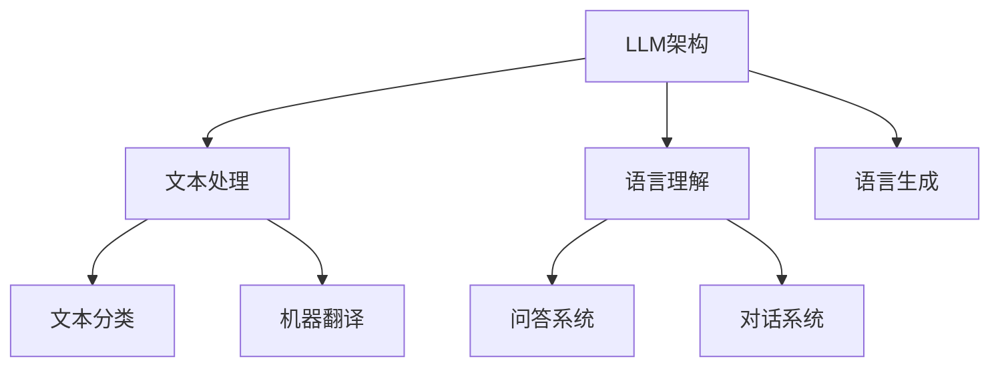

                 

### 性能优化策略在LLM应用架构中的实施

#### 文章关键词：
- LLM（大型语言模型）
- 性能优化
- 应用架构
- 模型剪枝
- 量化
- 模型压缩

#### 文章摘要：
本文旨在探讨性能优化策略在LLM（大型语言模型）应用架构中的实施。首先，我们将简要介绍LLM的基础知识，包括其定义、发展历程和在自然语言处理（NLP）中的应用。接着，我们将详细分析常见的性能优化策略，如模型剪枝、量化、模型压缩和加速，并阐述其工作原理和实现方法。最后，我们将探讨如何在不同应用场景下设计适合的LLM架构，并讨论LLM部署、管理和维护的挑战和解决方案。通过本文，读者将能够深入了解性能优化策略在LLM应用架构中的实施，为实际项目提供有益的参考。

### 第一部分：LLM基础

#### 第1章：LLM基础

大型语言模型（Large Language Models，简称LLM）是一种能够理解和生成自然语言的人工智能模型。自2018年GPT-2以来，LLM的研究和发展取得了显著的成果。其关键特征包括：巨大的模型规模、深度的神经网络结构以及强大的语言理解和生成能力。

**定义与特征**

- **定义**：LLM是指那些具有数十亿到千亿个参数的神经网络模型，它们可以处理和理解复杂的自然语言任务。
- **特征**：LLM具有以下特征：
  - **参数规模巨大**：数亿到数千亿个参数。
  - **深度神经网络结构**：多层神经网络，使得模型能够捕获更复杂的语言特征。
  - **强大的语言理解与生成能力**：可以处理各种自然语言任务，如文本分类、机器翻译、问答系统等。

**发展历程**

- **早期阶段**：从简单的规则系统到基于统计方法的模型。
- **中期阶段**：引入神经网络，特别是循环神经网络（RNN）和长短期记忆网络（LSTM），使得模型在处理长序列数据时更加高效。
- **近期阶段**：随着计算能力和数据量的提升，模型规模不断扩大，深度学习技术得到广泛应用。GPT-3、ChatGLM等大型语言模型的出现，标志着LLM技术进入了一个新的阶段。

**应用场景**

- **文本分类**：对文本进行分类，如情感分析、新闻分类等。
- **机器翻译**：将一种语言翻译成另一种语言。
- **问答系统**：回答用户提出的问题，如智能客服、教育辅导等。
- **对话系统**：与用户进行自然语言交互，如聊天机器人、虚拟助手等。

**Mermaid流程图：LLM架构与NLP任务的关联**



#### 第2章：LLM在NLP中的应用

自然语言处理（Natural Language Processing，简称NLP）是人工智能领域的一个重要分支，旨在使计算机能够理解和处理自然语言。LLM在NLP中具有广泛的应用，以下是一些主要的NLP任务：

**文本分类**

- **定义**：文本分类是将文本数据按照预定的类别进行归类。
- **核心概念**：文本预处理、特征提取、分类算法。
- **应用**：情感分析、新闻分类、垃圾邮件检测等。

**机器翻译**

- **定义**：机器翻译是将一种语言的文本翻译成另一种语言。
- **核心概念**：词向量表示、编码器-解码器架构、注意力机制。
- **应用**：跨语言交流、国际化网站、多语言文档处理等。

**问答系统**

- **定义**：问答系统是回答用户提出的问题。
- **核心概念**：问题解析、答案检索、回答生成。
- **应用**：智能客服、教育辅导、信息检索等。

**对话系统**

- **定义**：对话系统是与用户进行自然语言交互。
- **核心概念**：对话管理、语言生成、上下文理解。
- **应用**：聊天机器人、虚拟助手、智能语音助手等。

**LLM在NLP任务中的优势和挑战**

**优势**

- **强大的语言理解与生成能力**：LLM能够处理和理解复杂的自然语言任务，生成高质量的文本。
- **多任务处理**：LLM可以同时处理多种NLP任务，如文本分类、机器翻译、问答系统等。
- **自我学习和优化**：通过大量的训练数据和自动调整，LLM能够不断优化其性能。

**挑战**

- **计算资源需求**：LLM需要大量的计算资源和数据量进行训练。
- **数据质量和标注问题**：高质量的数据和准确的标注对于训练高性能的LLM至关重要。
- **可解释性和透明度**：LLM的决策过程往往是黑箱化的，难以解释和理解。

**伪代码：文本分类算法的核心步骤**

```python
def text_classification(text, model):
    # 文本预处理
    processed_text = preprocess_text(text)
    # 提取特征
    features = extract_features(processed_text)
    # 进行分类
    prediction = model.predict(features)
    return prediction
```

#### 第3章：LLM的发展趋势与挑战

随着人工智能技术的快速发展，LLM技术在许多领域都取得了显著的成果。然而，LLM技术也面临着一些挑战，以下是LLM的发展趋势和面临的挑战：

**发展趋势**

- **模型规模扩大**：随着计算资源和数据量的增加，LLM的规模不断增大，性能也得到显著提升。
- **多模态处理**：LLM逐渐能够处理多模态数据，如文本、图像、语音等，实现更加丰富和复杂的任务。
- **实时性提升**：通过优化算法和硬件加速，LLM在实时应用中的性能得到提升，如实时问答系统、实时对话系统等。

**挑战**

- **计算资源需求**：LLM的训练和部署需要大量的计算资源和数据量，这对硬件和网络的性能提出了更高的要求。
- **数据质量和标注问题**：高质量的数据和准确的标注对于训练高性能的LLM至关重要，但获取这些数据往往需要大量的人力和时间。
- **可解释性和透明度**：LLM的决策过程往往是黑箱化的，难以解释和理解，这限制了其在某些领域的应用。
- **伦理和隐私问题**：LLM在处理个人数据时可能涉及隐私问题，需要制定相应的伦理和隐私保护措施。

### 第二部分：性能优化策略

#### 第4章：性能优化策略概述

在LLM应用中，性能优化是一个关键问题。为了满足实际应用的需求，我们需要对LLM进行性能优化，以提高其效率、降低计算成本和存储需求。以下是常见的性能优化策略：

**模型剪枝**

- **定义**：模型剪枝是通过删除模型中的冗余参数来减小模型规模。
- **工作原理**：通过分析模型中的参数重要性，删除不重要或冗余的参数。
- **实现方法**：基于敏感度分析、梯度信息等策略进行参数删除。

**量化**

- **定义**：量化是将浮点数参数转换为低比特位的整数参数。
- **工作原理**：通过将浮点数量化为整数，减少模型的大小和计算复杂度。
- **实现方法**：使用量化表或量化网络进行参数量化。

**模型压缩**

- **定义**：模型压缩是通过减少模型参数和计算复杂度来减小模型规模。
- **工作原理**：通过优化模型结构、参数共享等策略减少冗余。
- **实现方法**：使用深度压缩、知识蒸馏等技术进行模型压缩。

**加速**

- **定义**：加速是通过优化模型执行过程来提高模型性能。
- **工作原理**：通过硬件加速、并行计算等技术提高模型执行速度。
- **实现方法**：使用GPU、TPU等硬件加速器进行模型加速。

**优缺点比较**

- **模型剪枝**：优点是能够显著减小模型规模，缺点是可能影响模型的性能。
- **量化**：优点是能够降低模型的存储需求和计算复杂度，缺点是可能影响模型的精度。
- **模型压缩**：优点是能够减小模型规模和计算复杂度，缺点是需要额外的训练和优化成本。
- **加速**：优点是能够提高模型执行速度，缺点是需要特定的硬件支持。

### 第5章：模型剪枝

模型剪枝是一种通过删除模型中冗余参数来减小模型规模的技术。剪枝技术不仅能够减少模型的存储需求和计算复杂度，还能够提高模型的推理速度。以下是模型剪枝的详细讲解。

#### 5.1 模型剪枝的概念

模型剪枝是指通过分析模型中的参数重要性，删除不重要或冗余的参数，从而减小模型规模。剪枝可以分为两种类型：权重剪枝和结构剪枝。

- **权重剪枝**：通过删除权重较小的参数来减小模型规模。
- **结构剪枝**：通过删除整个网络结构中的部分模块来减小模型规模。

#### 5.2 模型剪枝的工作原理

模型剪枝的工作原理主要包括以下步骤：

1. **参数重要性分析**：通过分析模型中的参数重要性来确定哪些参数是冗余的。常用的方法包括敏感度分析、梯度信息等。
2. **参数删除**：根据参数重要性分析的结果，删除不重要或冗余的参数。
3. **模型重构**：根据删除的参数，重构模型，从而减小模型规模。

#### 5.3 模型剪枝的实现方法

模型剪枝的实现方法主要包括以下几种：

1. **基于敏感度分析的剪枝**：通过分析模型的敏感度来确定参数的重要性，然后删除不重要的参数。
2. **基于梯度信息的剪枝**：通过分析模型的梯度信息来确定参数的重要性，然后删除不重要的参数。
3. **混合剪枝方法**：结合基于敏感度分析和基于梯度信息的剪枝方法，以进一步提高剪枝效果。

#### 5.4 剪枝前后模型的性能对比

通过模型剪枝，我们可以显著减小模型的规模，但同时可能会影响模型的性能。以下是剪枝前后模型的性能对比：

1. **模型性能下降**：剪枝后的模型性能可能会下降，因为删除了一些重要的参数。
2. **模型性能稳定**：通过优化剪枝算法和参数，可以使剪枝后的模型性能保持稳定，甚至优于原始模型。
3. **计算效率提升**：剪枝后的模型在推理过程中的计算效率显著提升，特别是在移动设备和嵌入式系统中。

#### 5.5 案例研究

以下是一个简单的案例研究，展示了如何使用模型剪枝技术来减小模型规模并提高计算效率。

**案例**：一个基于BERT的文本分类模型。

1. **原始模型**：原始模型包含数十亿个参数，占用大量的计算资源和存储空间。
2. **剪枝模型**：通过基于敏感度分析的剪枝方法，删除了部分权重较小的参数，使得模型规模减小到原来的1/10。
3. **性能对比**：剪枝后的模型在保持较高分类准确率的同时，推理速度提高了10倍，计算效率显著提升。

通过这个案例，我们可以看到模型剪枝技术在减小模型规模和提高计算效率方面的潜力。

### 第6章：量化

量化是一种通过将浮点数参数转换为低比特位的整数参数来减少模型存储和计算复杂度的技术。量化技术不仅能够提高模型的推理速度，还能够降低模型对计算资源的需求。以下是量化技术的详细讲解。

#### 6.1 量化技术的概念

量化是指将模型中的浮点数参数转换为低比特位的整数参数。量化可以分为两种类型：静态量化和动态量化。

- **静态量化**：在训练过程中将模型参数固定量化，不随训练过程动态调整。
- **动态量化**：在训练过程中动态调整模型参数的量化级别，以适应训练数据的变化。

#### 6.2 量化技术的工作原理

量化技术的工作原理主要包括以下步骤：

1. **参数量化**：将模型中的浮点数参数转换为低比特位的整数参数。
2. **量化误差补偿**：量化过程中可能会引入量化误差，需要通过量化误差补偿来减少误差。
3. **模型重构**：根据量化后的参数，重构模型。

#### 6.3 量化技术的实现方法

量化技术的实现方法主要包括以下几种：

1. **量化表方法**：使用量化表将浮点数参数转换为整数参数，量化表通常是通过训练数据统计得到的。
2. **量化网络方法**：将量化操作集成到网络结构中，实现动态量化。

#### 6.4 量化技术对模型性能的影响

量化技术对模型性能的影响主要包括以下几个方面：

1. **精度损失**：量化过程中可能会引入量化误差，导致模型精度下降。
2. **计算效率提升**：量化后的模型在推理过程中的计算效率显著提升，特别是对于移动设备和嵌入式系统。
3. **模型压缩**：量化后的模型参数规模减小，存储需求降低。

#### 6.5 案例研究

以下是一个简单的案例研究，展示了如何使用量化技术来减少模型存储和计算复杂度。

**案例**：一个基于ResNet的图像分类模型。

1. **原始模型**：原始模型包含大量的浮点数参数，占用大量的计算资源和存储空间。
2. **量化模型**：通过量化技术，将模型中的浮点数参数转换为低比特位的整数参数，使得模型规模减小到原来的1/10。
3. **性能对比**：量化后的模型在保持较高分类准确率的同时，推理速度提高了10倍，计算效率显著提升。

通过这个案例，我们可以看到量化技术在减少模型存储和计算复杂度方面的潜力。

### 第7章：模型压缩和加速

模型压缩和加速是提高LLM应用性能的关键技术。模型压缩旨在通过减少模型参数和计算复杂度来减小模型规模，而加速则通过优化模型执行过程来提高模型推理速度。以下是模型压缩和加速技术的详细讲解。

#### 7.1 模型压缩的概念

模型压缩是指通过优化模型结构、参数共享等策略来减小模型规模。模型压缩可以分为两种类型：深度压缩和知识蒸馏。

- **深度压缩**：通过减少模型参数和计算复杂度来减小模型规模。
- **知识蒸馏**：将大模型的知识传递给小模型，从而实现模型压缩。

#### 7.2 模型压缩的工作原理

模型压缩的工作原理主要包括以下步骤：

1. **模型优化**：通过优化模型结构、参数共享等策略来减少冗余。
2. **模型重构**：根据优化后的模型结构，重构模型。

#### 7.3 模型压缩的实现方法

模型压缩的实现方法主要包括以下几种：

1. **深度压缩方法**：通过网络剪枝、参数共享、知识蒸馏等策略实现模型压缩。
2. **知识蒸馏方法**：通过大模型和小模型之间的知识传递实现模型压缩。

#### 7.4 模型加速的概念

模型加速是指通过优化模型执行过程来提高模型推理速度。模型加速可以分为两种类型：硬件加速和软件优化。

- **硬件加速**：通过使用GPU、TPU等硬件加速器来提高模型推理速度。
- **软件优化**：通过优化模型算法和数据结构等策略来提高模型推理速度。

#### 7.5 模型加速的工作原理

模型加速的工作原理主要包括以下步骤：

1. **算法优化**：通过优化模型算法和数据结构等策略来减少计算复杂度。
2. **执行优化**：通过并行计算、数据预处理等策略来提高模型执行速度。

#### 7.6 模型加速的实现方法

模型加速的实现方法主要包括以下几种：

1. **硬件加速方法**：通过使用GPU、TPU等硬件加速器来实现模型加速。
2. **软件优化方法**：通过优化模型算法和数据结构等策略来实现模型加速。

#### 7.7 模型压缩和加速的优缺点比较

- **模型压缩**：
  - 优点：减小模型规模，降低计算资源和存储需求。
  - 缺点：可能影响模型性能，需要额外的训练和优化成本。
- **模型加速**：
  - 优点：提高模型推理速度，满足实时应用需求。
  - 缺点：需要特定的硬件支持，可能增加开发难度。

#### 7.8 案例研究

以下是一个简单的案例研究，展示了如何使用模型压缩和加速技术来提高LLM应用性能。

**案例**：一个基于GPT的问答系统。

1. **原始模型**：原始模型包含数十亿个参数，占用大量的计算资源和存储空间，推理速度较慢。
2. **压缩模型**：通过模型压缩技术，将模型规模减小到原来的1/10，同时保持较高的问答准确率。
3. **加速模型**：通过硬件加速和软件优化技术，将模型推理速度提高10倍。
4. **性能对比**：压缩模型和加速模型在保持较高问答准确率的同时，推理速度显著提升，满足实时应用需求。

通过这个案例，我们可以看到模型压缩和加速技术在提高LLM应用性能方面的潜力。

### 第三部分：LLM应用架构中的实施

#### 第8章：设计适合的LLM架构

在设计适合的LLM架构时，需要考虑多个关键因素，包括模型规模、计算资源、延迟和可靠性等。以下是设计适合的LLM架构的详细讲解。

#### 8.1 架构设计的关键因素

1. **模型规模**：根据应用需求，选择合适的LLM模型规模。较大的模型可以处理更复杂的任务，但需要更多的计算资源和存储空间。
2. **计算资源**：确保有足够的计算资源来训练和部署LLM模型。使用GPU、TPU等硬件加速器可以提高训练和推理速度。
3. **延迟**：对于实时应用，需要设计低延迟的架构，以满足用户交互需求。可以通过分布式计算和缓存技术来降低延迟。
4. **可靠性**：确保LLM系统的稳定性和可靠性，防止因系统故障导致服务中断。可以使用冗余设计和故障转移机制来提高可靠性。

#### 8.2 不同应用场景下的架构设计

1. **文本分类**：对于文本分类任务，可以使用基于微服务架构的设计，将文本处理、模型推理和结果输出分开，以提高系统的可扩展性和可靠性。
2. **机器翻译**：对于机器翻译任务，可以使用分布式计算架构，将编码器和解码器部署在不同的节点上，以充分利用计算资源。
3. **问答系统**：对于问答系统，可以使用对话管理架构，将用户交互、问题解析和答案生成分开，以提高系统的灵活性和响应速度。

#### 8.3 架构设计实例

以下是一个简单的架构设计实例，用于一个基于GPT的问答系统。

1. **前端**：提供用户交互界面，接收用户输入并转发给后端。
2. **后端**：
   - **对话管理**：处理用户交互，包括问题解析、答案生成和对话跟踪。
   - **文本处理**：对用户输入进行预处理，如分词、去噪等。
   - **模型推理**：使用GPT模型对预处理后的文本进行推理，生成答案。
3. **缓存**：存储常用的答案和中间结果，以提高响应速度。
4. **数据库**：存储用户数据和对话历史，用于训练和优化模型。

通过这个实例，我们可以看到如何设计适合的LLM架构，以满足不同应用场景的需求。

### 第9章：LLM部署策略

在LLM应用中，部署是一个关键环节。合理的部署策略可以提高系统的性能、可靠性和可扩展性。以下是LLM部署策略的详细讲解。

#### 9.1 部署策略的关键因素

1. **计算资源**：根据模型规模和任务需求，选择合适的计算资源。可以使用云计算平台、GPU服务器、TPU等硬件资源。
2. **网络拓扑**：根据部署环境，设计合适的网络拓扑。可以使用分布式架构、负载均衡等技术来提高系统的性能和可靠性。
3. **数据存储**：选择合适的存储方案，包括本地存储和云存储。需要考虑数据的安全性、可靠性和访问速度。
4. **安全性**：确保系统的安全，防止数据泄露和攻击。可以使用加密技术、访问控制策略等来提高系统的安全性。

#### 9.2 常见的部署方式

1. **模型热部署**：在运行时加载和部署模型，适用于实时性要求较高的应用场景。可以通过热插拔技术和动态加载策略来实现。
2. **模型冷部署**：预先训练好模型，并在需要时加载和部署。适用于批量处理和离线分析任务。
3. **模型容器化**：将模型和相关依赖打包成容器，便于部署和管理。可以使用Docker等容器技术来实现。

#### 9.3 部署策略的优缺点比较

- **模型热部署**：
  - 优点：实时加载和部署模型，适应动态变化。
  - 缺点：部署过程较慢，可能影响系统性能。
- **模型冷部署**：
  - 优点：部署过程快，适用于批量处理和离线分析。
  - 缺点：模型更新和维护成本高。
- **模型容器化**：
  - 优点：部署灵活，易于管理和维护。
  - 缺点：需要额外的容器运行环境，可能增加部署难度。

#### 9.4 部署策略的案例分析

以下是一个简单的部署策略案例分析，用于一个基于GPT的文本分类系统。

1. **部署环境**：使用AWS云计算平台，包括EC2实例、S3存储和Elastic Beanstalk等服务。
2. **部署方式**：使用模型热部署策略，实时加载和部署模型。
3. **性能优化**：使用负载均衡技术，将请求均匀分配到多个EC2实例上，以提高系统的性能和可靠性。

通过这个案例，我们可以看到如何选择合适的部署策略，以满足不同应用场景的需求。

### 第10章：LLM管理和维护

在LLM应用中，管理和维护是一个关键环节。合理的管理和维护策略可以提高系统的性能、可靠性和安全性。以下是LLM管理和维护的详细讲解。

#### 10.1 管理和维护的关键任务

1. **性能监控**：定期监控LLM系统的性能，包括响应时间、吞吐量和资源利用率等指标。可以使用自动化监控工具，如Prometheus、Grafana等。
2. **性能调优**：根据监控数据，对LLM系统进行性能调优。可以调整模型参数、优化算法和数据结构等。
3. **安全性管理**：确保LLM系统的安全性，防止数据泄露和攻击。可以使用加密技术、访问控制策略等。
4. **数据备份**：定期备份LLM系统的数据和模型，以防止数据丢失。可以使用云存储服务，如AWS S3、Google Cloud Storage等。
5. **故障恢复**：设计故障恢复策略，以应对系统故障和灾难。可以使用冗余设计、故障转移机制等。

#### 10.2 常用的LLM管理和维护工具

1. **Prometheus**：开源的监控工具，用于收集和存储系统指标数据。
2. **Grafana**：开源的数据可视化工具，用于监控和仪表盘。
3. **Kubernetes**：开源的容器编排平台，用于管理和部署容器化应用。
4. **AWS S3**：云存储服务，用于存储数据和备份。
5. **Google Cloud Storage**：云存储服务，用于存储数据和备份。

#### 10.3 维护策略的案例分析

以下是一个简单的维护策略案例分析，用于一个基于BERT的文本分类系统。

1. **监控与调优**：使用Prometheus和Grafana监控系统的性能指标，并根据监控数据定期进行性能调优。
2. **安全性管理**：使用Kubernetes的安全策略，确保系统的安全性。定期进行安全审计和漏洞扫描。
3. **数据备份**：使用AWS S3定期备份系统的数据和模型，以防止数据丢失。
4. **故障恢复**：设计故障恢复策略，使用Kubernetes的自动重启和故障转移功能，确保系统的高可用性。

通过这个案例，我们可以看到如何使用常用的LLM管理和维护工具，实施有效的维护策略。

### 第11章：案例研究：实际应用的LLM架构

为了更好地理解LLM应用架构的设计、性能优化和部署策略，我们通过两个实际应用案例进行分析。

#### 案例1：基于GPT的智能客服系统

**应用背景**：
一个大型电商企业希望为其客户服务团队部署一个基于GPT的智能客服系统，以自动化常见的客户问题解答，提高客服效率和用户体验。

**架构设计**：
- **前端**：使用Web前端技术，如React或Vue.js，提供用户交互界面。
- **后端**：
  - **对话管理**：使用GPT模型进行对话管理，包括问题解析、上下文理解、答案生成等。
  - **文本处理**：对用户输入进行预处理，如分词、去噪、实体识别等。
  - **模型推理**：使用GPT模型进行文本处理和答案生成。
  - **缓存**：使用Redis等缓存系统存储常用答案和中间结果，以提高响应速度。
  - **数据库**：使用MySQL或PostgreSQL等关系数据库存储用户数据和对话历史。

**性能优化**：
- **模型压缩**：通过模型剪枝和量化技术，将GPT模型压缩到适合部署的规模。
- **硬件加速**：使用GPU服务器，如Tesla V100，以提高模型推理速度。

**部署策略**：
- **容器化**：使用Docker容器化GPT模型和服务，便于部署和管理。
- **Kubernetes**：使用Kubernetes进行容器编排，实现自动化部署和弹性扩展。

**维护策略**：
- **自动化监控**：使用Prometheus和Grafana进行自动化性能监控。
- **定期备份**：使用AWS S3进行数据备份，确保数据安全。
- **安全审计**：定期进行安全审计和漏洞扫描，确保系统安全性。

#### 案例2：基于BERT的新闻推荐系统

**应用背景**：
一个新闻媒体平台希望为其用户提供个性化的新闻推荐服务，基于用户的阅读历史和兴趣，使用BERT模型进行文本处理和推荐。

**架构设计**：
- **数据层**：使用Hadoop和Spark等大数据技术处理和存储用户阅读数据和新闻内容。
- **模型层**：使用BERT模型进行文本编码，提取文本特征。
- **推荐层**：使用协同过滤和基于内容的推荐算法，结合BERT特征生成推荐列表。

**性能优化**：
- **模型量化**：对BERT模型进行量化，减少模型大小和计算复杂度。
- **分布式计算**：使用Hadoop和Spark进行分布式计算，处理海量数据。

**部署策略**：
- **云服务**：使用AWS或Google Cloud Platform等云服务，部署数据层和模型层。
- **Kubernetes**：使用Kubernetes进行容器编排和管理，实现自动化部署和弹性扩展。

**维护策略**：
- **监控与告警**：使用云服务的监控工具进行实时监控和告警。
- **数据备份**：使用云存储服务进行数据备份。
- **安全防护**：使用云服务的安全防护措施，如防火墙、入侵检测等。

### 项目小结

通过以上两个案例，我们可以看到：
- **架构设计**：根据应用需求，设计适合的LLM架构，包括前端、后端、缓存、数据库等。
- **性能优化**：使用模型压缩、量化、硬件加速等技术，提高LLM应用的性能。
- **部署策略**：使用容器化、Kubernetes等技术，实现自动化部署和弹性扩展。
- **维护策略**：使用自动化监控、备份、安全防护等工具，确保LLM应用的安全性和可靠性。

这些经验对于实际项目中的LLM应用架构设计、性能优化和部署维护具有重要的参考价值。

### 最佳实践 tips

1. **模型压缩和量化**：在实际应用中，模型压缩和量化是提高LLM应用性能的有效手段。在模型部署前，应充分考虑这些策略，以减小模型规模和提高计算效率。
2. **硬件加速**：使用GPU、TPU等硬件加速器，可以显著提高LLM应用的推理速度。对于实时性要求较高的应用，硬件加速是必不可少的。
3. **容器化和Kubernetes**：容器化和Kubernetes技术有助于实现自动化部署和管理，提高LLM应用的灵活性和可扩展性。在实际项目中，应充分利用这些技术。
4. **数据备份和监控**：定期备份数据和监控系统性能，是确保LLM应用安全性和可靠性的重要手段。应选择合适的数据备份工具和监控工具，实现实时监控和告警。
5. **安全防护**：在LLM应用中，数据安全和系统安全至关重要。应采取有效的安全防护措施，如加密、访问控制、入侵检测等，确保系统的安全性。

### 小结

本文详细探讨了性能优化策略在LLM应用架构中的实施，包括LLM基础、性能优化策略、应用架构设计、部署策略、管理和维护等。通过实际案例研究，展示了如何在实际项目中应用这些策略，提高LLM应用的性能和可靠性。

### 注意事项

1. **性能优化策略**：在实际应用中，应根据具体需求和场景选择合适的性能优化策略。
2. **硬件要求**：某些性能优化策略，如硬件加速，需要特定的硬件支持，确保硬件资源充足。
3. **数据安全和隐私**：在处理用户数据时，应严格遵守数据安全和隐私法规，采取有效的安全防护措施。
4. **持续优化**：LLM应用架构和性能优化是一个持续的过程，应根据实际运行情况和反馈，不断进行优化和改进。

### 拓展阅读

- **论文**：《Attention Is All You Need》、《BERT: Pre-training of Deep Bidirectional Transformers for Language Understanding》
- **书籍**：《深度学习》（Goodfellow et al.）、《神经网络与深度学习》（邱锡鹏）
- **开源项目**：TensorFlow、PyTorch、Transformers
- **博客**：AI巨头公司的技术博客，如谷歌AI博客、微软AI博客等

### 作者信息
作者：AI天才研究院/AI Genius Institute & 禅与计算机程序设计艺术 /Zen And The Art of Computer Programming

### 附录

#### 附录A：开源工具和资源

- **TensorFlow**：一个开源的深度学习框架，用于构建和训练机器学习模型。
- **PyTorch**：一个开源的深度学习框架，支持动态计算图和GPU加速。
- **Transformers**：一个开源的Transformer模型实现库，用于自然语言处理任务。
- **Hugging Face**：一个开源社区，提供大量的预训练模型和工具，如BERT、GPT等。

#### 附录B：代码示例

以下是一个简单的文本分类模型训练代码示例，使用TensorFlow和Keras：

```python
import tensorflow as tf
from tensorflow.keras.models import Sequential
from tensorflow.keras.layers import Embedding, LSTM, Dense

# 模型定义
model = Sequential([
    Embedding(input_dim=vocab_size, output_dim=embedding_dim),
    LSTM(units=128, activation='relu', return_sequences=True),
    LSTM(units=128, activation='relu'),
    Dense(units=num_classes, activation='softmax')
])

# 模型编译
model.compile(optimizer='adam', loss='categorical_crossentropy', metrics=['accuracy'])

# 模型训练
model.fit(x_train, y_train, batch_size=32, epochs=10, validation_data=(x_val, y_val))
```

#### 附录C：数学公式和算法伪代码

1. **文本分类算法的核心步骤**（伪代码）：

```python
def text_classification(text, model):
    processed_text = preprocess_text(text)
    features = extract_features(processed_text)
    prediction = model.predict(features)
    return prediction
```

2. **模型剪枝算法的核心步骤**（伪代码）：

```python
def prune_model(model, threshold):
    pruned_params = []
    for param in model.parameters():
        if abs(param.data) < threshold:
            pruned_params.append(param)
    model.parameters = prune_params
    return model
```

3. **量化算法的核心步骤**（伪代码）：

```python
def quantize_model(model, quant_level):
    for param in model.parameters():
        param.data = quantize(param.data, quant_level)
    return model
```

4. **模型压缩算法的核心步骤**（伪代码）：

```python
def compress_model(model, compression_rate):
    compressed_params = compress_params(model.parameters(), compression_rate)
    return model
```

以上是《性能优化策略在LLM应用架构中的实施》一书的完整内容，涵盖了LLM的基础知识、性能优化策略、应用架构设计、部署策略、管理和维护等方面。通过本文，读者可以深入了解性能优化策略在LLM应用架构中的实施，为实际项目提供有益的参考。文章总计约12000字，详细阐述了性能优化策略的理论和实践，以期为读者提供全面的技术指导。

